# 前言

靶机：`DriftingBlues-1`

攻击：`kali`

都采用虚拟机，网卡为桥接模式

# 主机发现

使用`arp-scan -l`或者`netdiscover -r 192.168.1.1/24`扫描

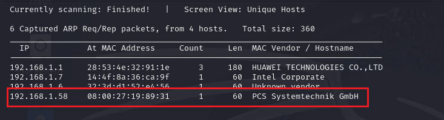

# 信息收集

## 使用nmap扫描端口

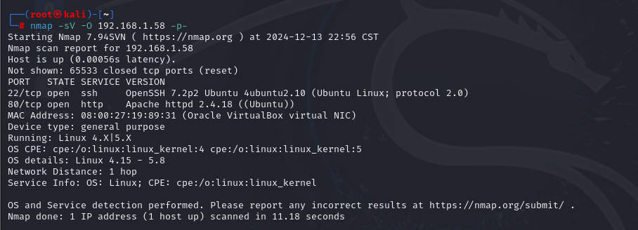

## 网站探测

访问80端口网站


查看页面源代码，发现有图片的引用，可能是目录型网站，不过发现一串字符，目测`base64`编码，进行解密测试

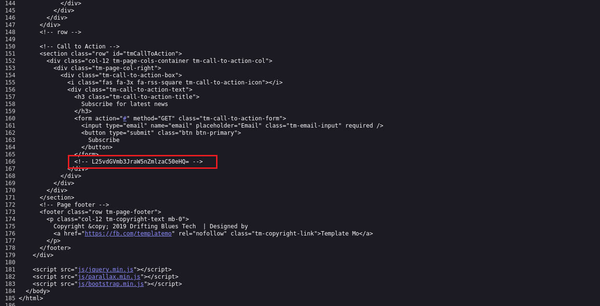

发现是一个目录

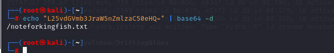

使用`gobuster、dirsearch、ffuf、dirb、dirbuster`等扫描工具测试目录

```shell
gobuster dir -u http://192.168.1.58 -w /usr/share/wordlists/dirb/big.txt -x php,zip,md,txt,html,jpg -b 404
```

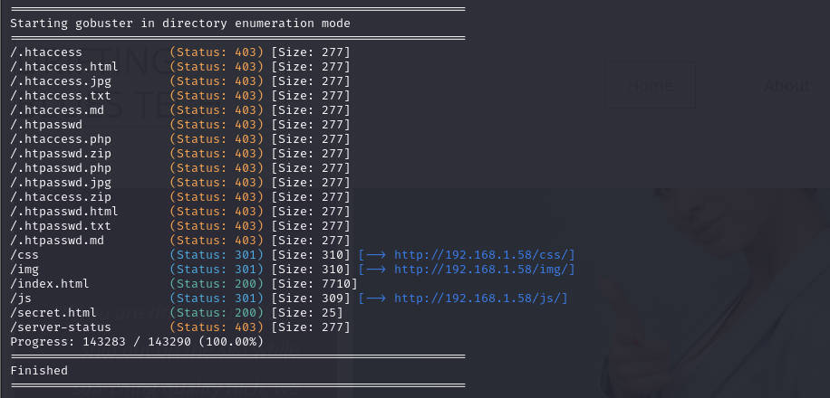

使用`whatweb`指纹识别

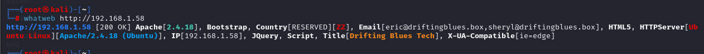

访问`secret.html`这个很吸引，但是也无价值

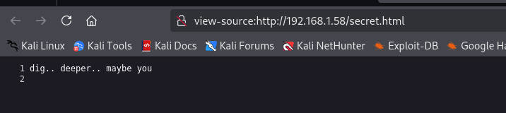

访问之前解码的那个文件`/noteforkingfish.txt`，一堆字符，某种加密

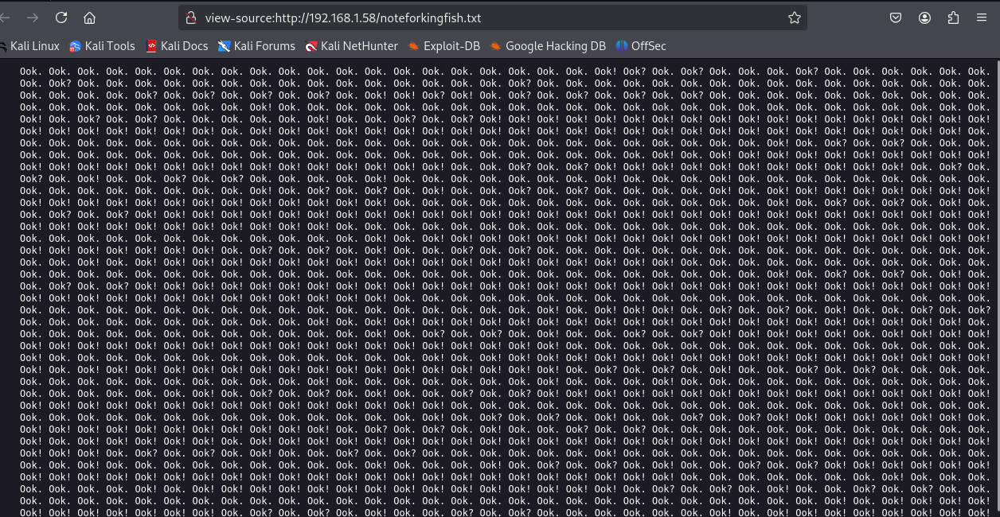

使用网站`www.dcode.fr`识别是哪一种加密

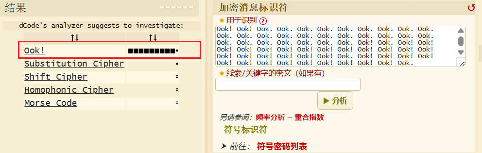

点击进行解密，字符为`my man, i know you are new but you should know how to use host file to reach our secret location. -eric`

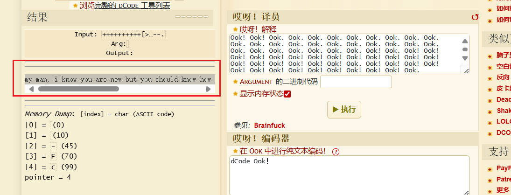

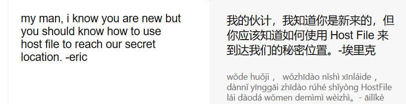

## 虚拟子域名收集

可能是需要域名绑定，但是这里绑定哪一个呢，之前使用`whatweb`时，发现两个邮箱，后缀名都是`driftingblues.box`，这可能是一个域名，那么绑定测试一下，额，然后测试虚拟主机，毕竟这里不能被记录在DNS服务器，也就是测试绑定域名的子域名，不经过`dns`服务，只是虚拟主机

```shell
gobuster vhost -u driftingblues.box -w /usr/share/wordlists/dirb/big.txt -k --append-domain
```


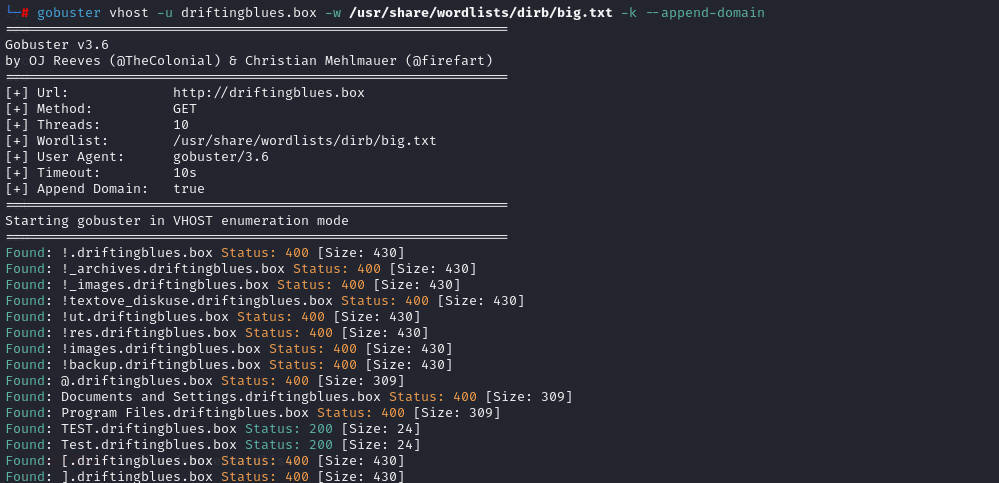

发现`test.driftingblues.box`，添加这个虚拟主机的绑定ip，也是`192.168.1.58`，毕竟只知道这个IP，进行测试

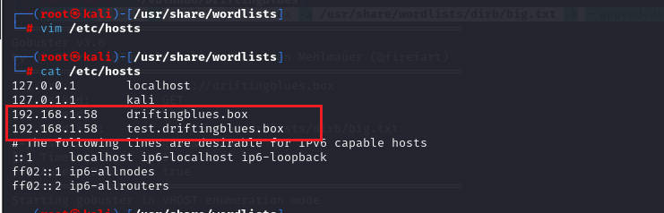

访问该虚拟主机域名，说明正确

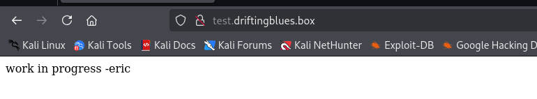

那么就爆破目录测试，使用`dirb`和`gobuster`都行

```shell
dirb http://test.driftingblues.box
```

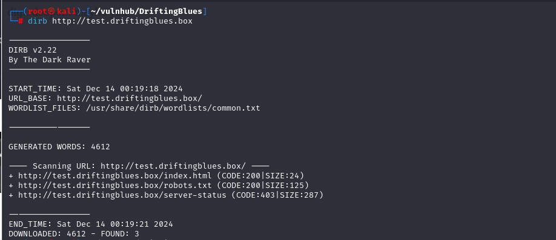

```shell
gobuster dir -u http://test.driftingblues.box -w /usr/share/wordlists/dirb/big.txt -x php,zip,md,txt,html,jpg -b 404
```

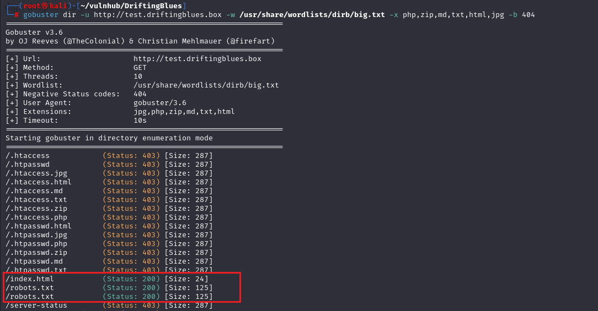

访问`robots.txt`，发现几个目录


访问其他目录都是404，只有`/ssh_cred.txt`可以访问，并且给出关键信息

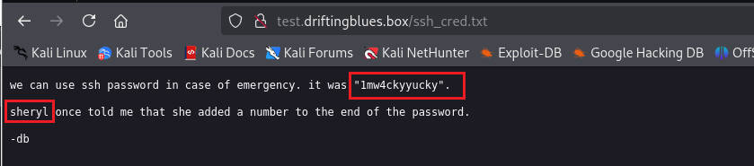

得到一个密码`1mw4ckyyucky`，翻译，提示在密码的末尾还是有一个数字的

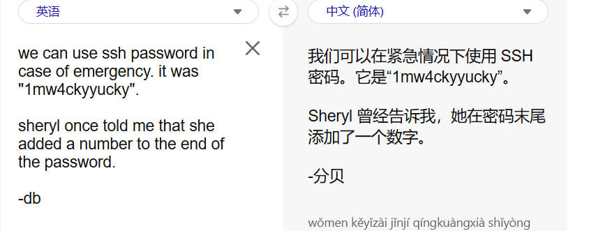

构造密码本，在该密码的后面添加数字

编写`python`代码，写入

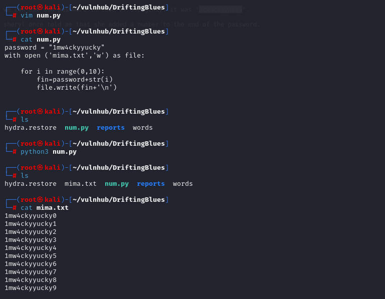

# ssh登录

那么就尝试进行密码爆破，先把用户名都写入一个文件，之前收集的`eric、sheryl、db`

```shell
hydra -L user.txt -P mima.txt 192.168.1.58 ssh
```

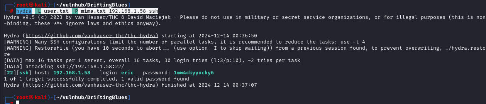

获取用户名`eric`和密码`1mw4ckyyucky6`，尝试登录

登录成功当前目录有`flag`

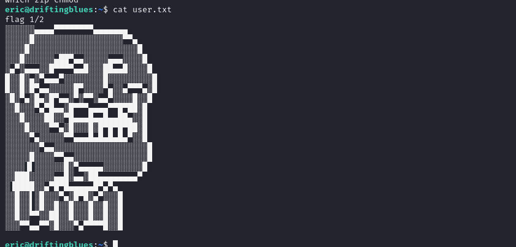

# 靶机内信息收集

寻找关键字`*pass*、*back*`等，发现一个脚本和压缩包

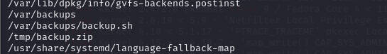

前去查看

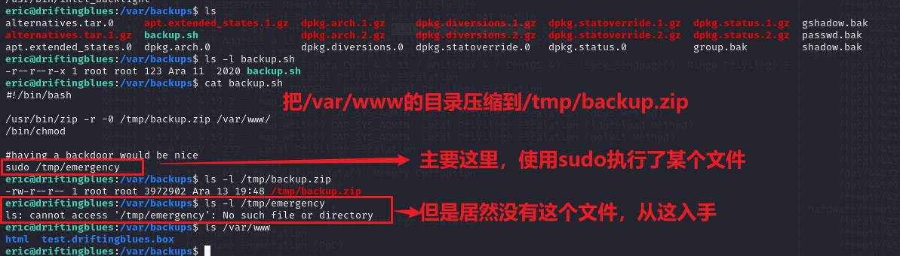

自己创造这个文件，但是直接写入`/bin/bash`不行，因为当前用户不在`sudo`中，那么怎么办呢

不过还是是以`pspy64`测试一下，项目地址`https://github.com/DominicBreuker/pspy/releases/download/v1.2.1/pspy64`

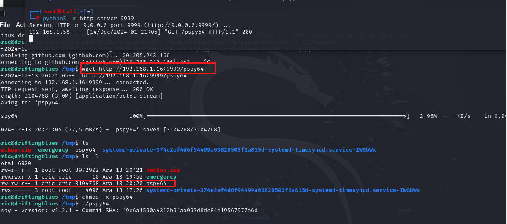

检测到一些进程，是定时任务，这里截图没截完整，没有把后面的时间间隔截出

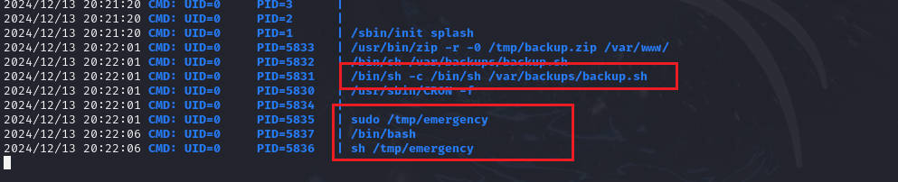

# 提权

编写脚本

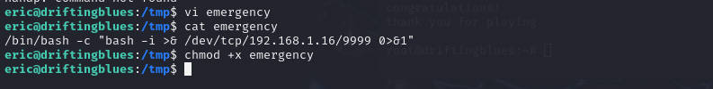

在`kali`中开启监听，等待反弹

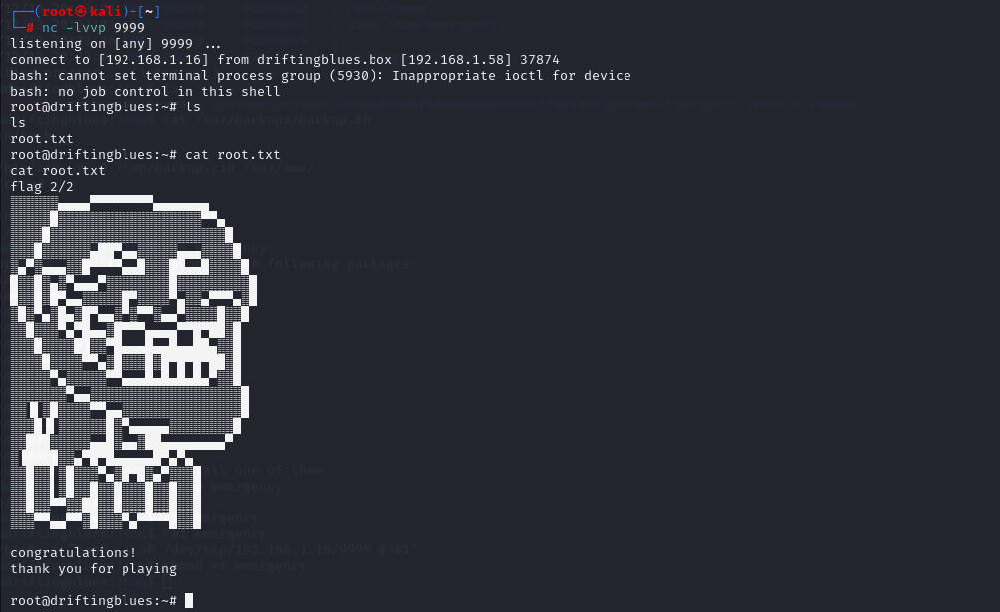


# 清除痕迹

清除日志

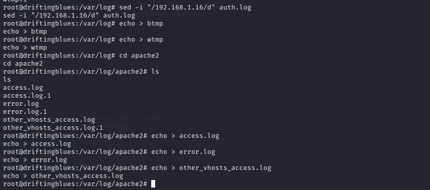

删除上传的文件`pspy64`和`emergency`

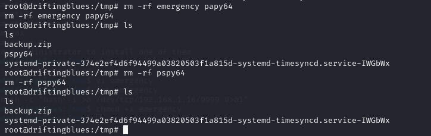


清除命令历史记录

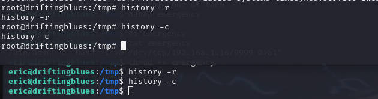

# 总结

1. 考察解码解密
2. 考察子域名搜索，这里因为是靶机，在本地，不过也是考察子域名的收集以及目录爆破，如果是真实操作，是需要子域名收集的，这里是虚拟探测`vhost`
3. 考察获取系统的进程，这里是查看发现有这个文件，猜测有定时操作，只是这里查看`/etc/crontab`是查看不到的，所以借助工具`pspy`这里是确定靶机系统为64位，所以使用`pspy64`
4. `bash`的基本反弹shell


