# 前言

靶机：`digitalworld.local-electrical`，IP地址为`192.168.10.12`

攻击：`kali`，IP地址为`192.168.10.6`

`kali`采用`VMware`虚拟机，靶机选择使用`VMware`打开文件，都选择桥接网络

这里官方给的有两种方式，一是直接使用`virtualbox`加载，另一种是通过`VMware`直接加载，也给出了`iso`镜像文件。	

> 文章中涉及的靶机，来源于`vulnhub`官网，想要下载，可自行访问官网下载，或者通过网盘下载`https://pan.quark.cn/s/86cf8a398835`

# 主机发现

使用`arp-scan -l`或`netdiscover -r 192.168.10.1/24`扫描

也可以使用`nmap`等工具进行

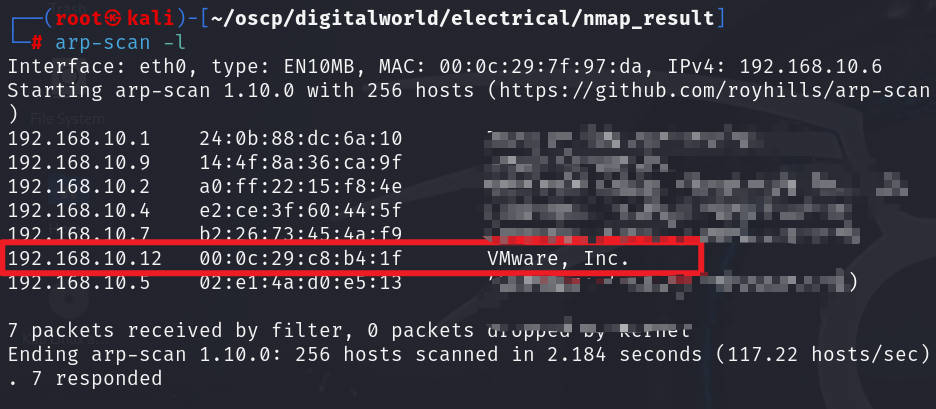

# 信息收集

## 使用nmap扫描端口

扫描`tcp`端口，并保存于`nmap-tcp`

```shell
nmap -sT 192.168.10.12 --min-rate=1000 -p- -oA nmap-tcp
```

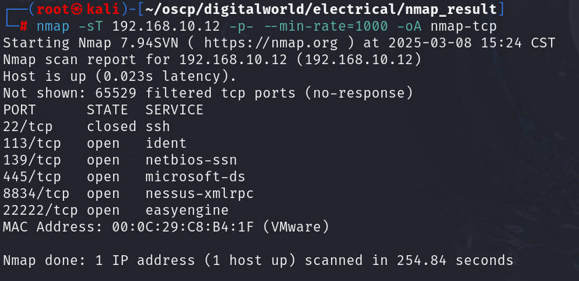

扫描常见的20个`udp`端口，不过这里的端口大部分都是不确定的情况

```shell
nmap -sU 192.168.10.12 --top-ports 20 -T4 -oA nmap-udp
```

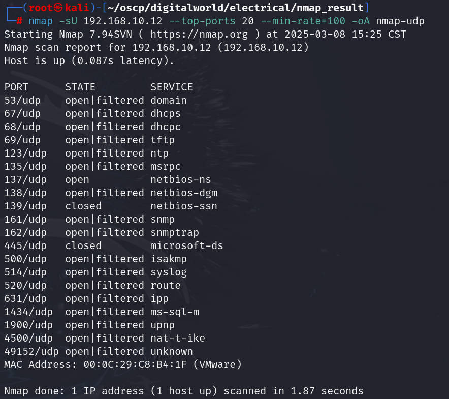

把前面扫描出的`tcp、udp`端口，进行处理，只取端口号

```shell
grep open nmap-tcp.nmap | awk -F'/' '{print $1}' | paste -sd ','
#这里就是包括可能开放的端口都不要，因为是靶机，可能过滤的话，也会无法进一步扫描
ports=22,80,8080,68,69,138,161,631,1434,1900
```

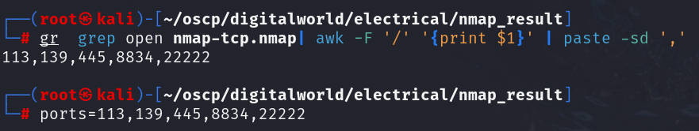

对特定的端口号进行深入探测

```shell
nmap -sV -O -sC -sT 192.168.10.12 -p $ports -oA detail
```

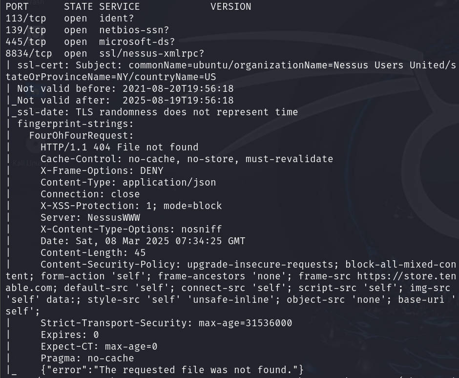

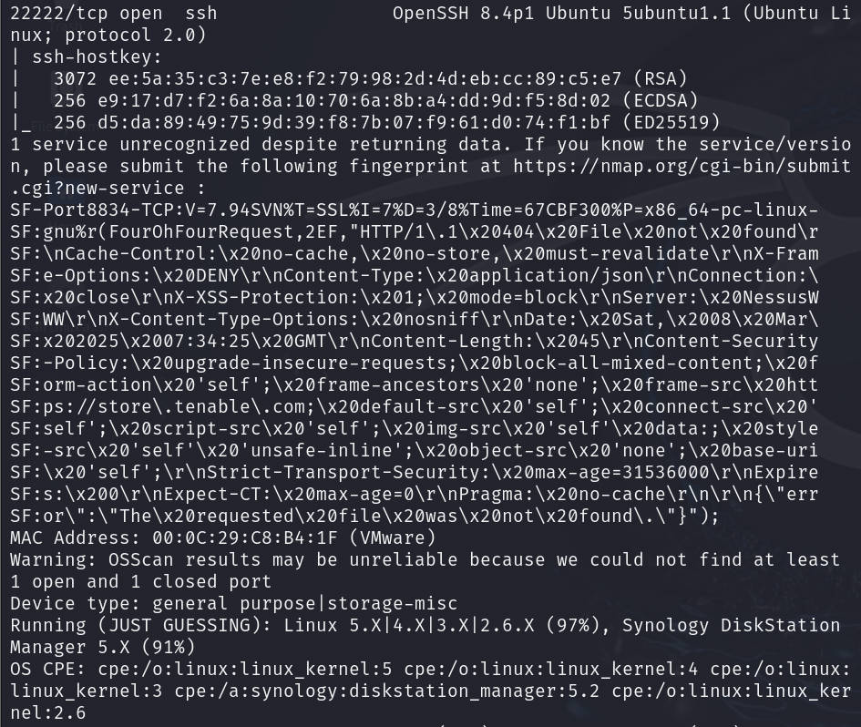

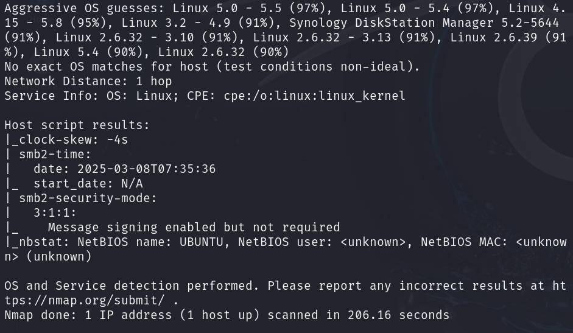

使用脚本检测有无漏洞

```shell
nmap --script=vuln 192.168.10.12 -p $ports -oA vuln
```

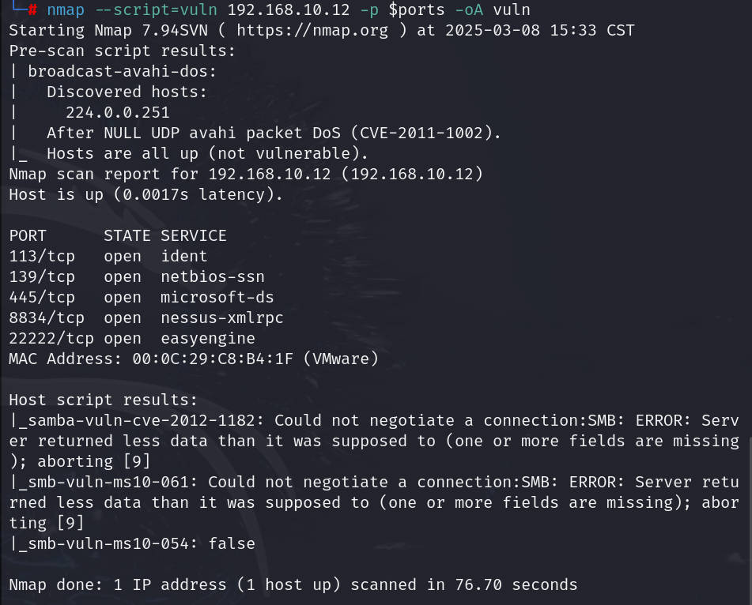

## SMB探测

使用`enum4linux`尝试进行枚举，发现两个分享`print$`和`IPC$`，并还有两个用户`govindasamy`和`electrical`

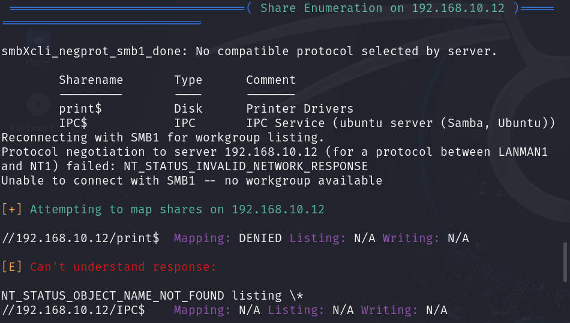

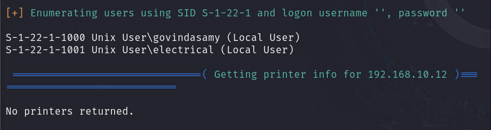

## 8834端口探测

这里需要注意，使用浏览器访问时需要加上`https`协议

```shell
https://192.168.10.12:8834
```

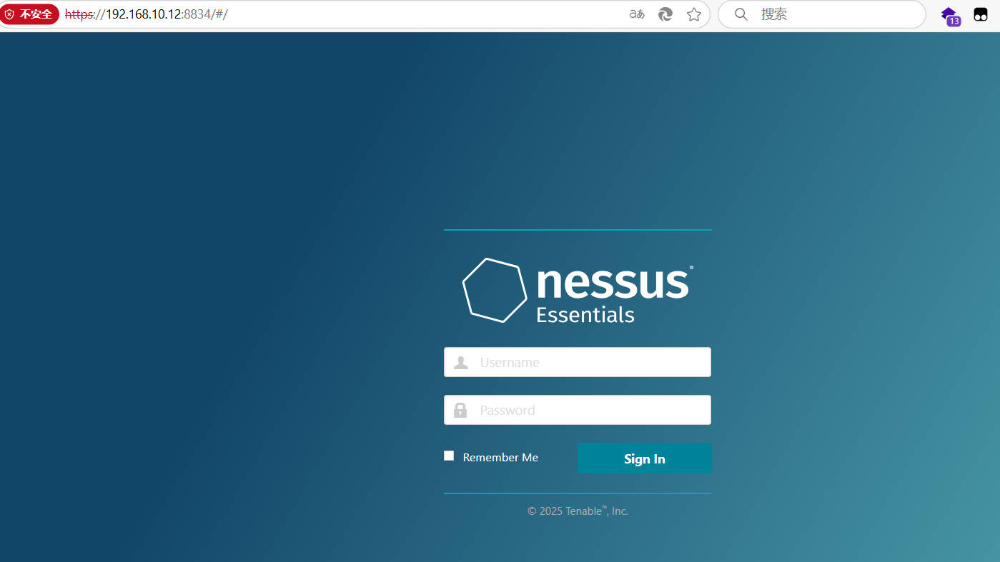

查看页面源代码也没有信息泄露，那么尝试识别一下，使用`whatweb`测试

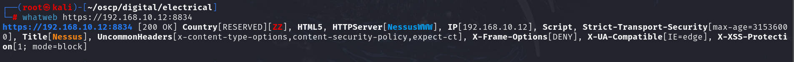

再使用浏览器插件`wappalyzer`识别

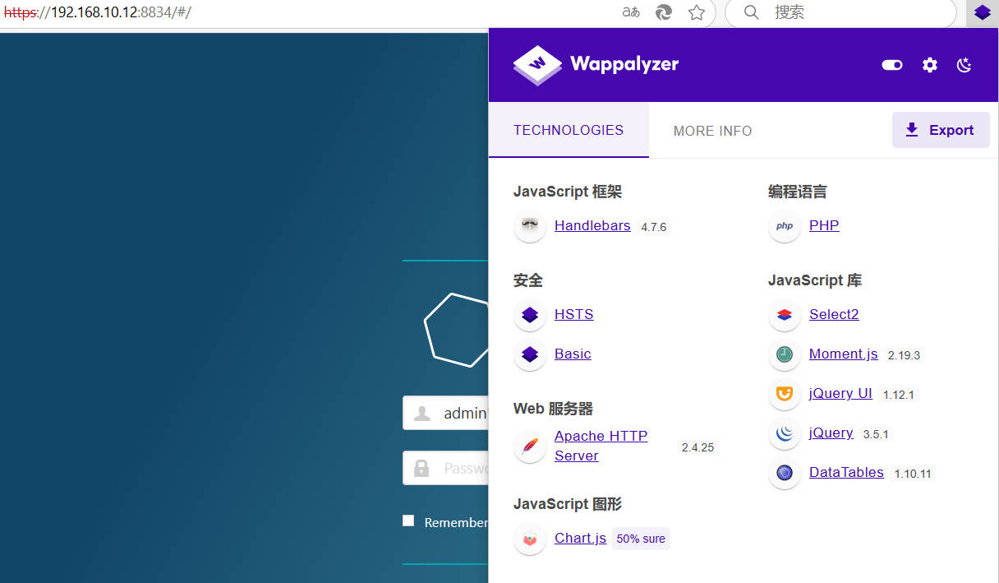

尝试进行目录爆破，可以使用`dirb`或`dirsearch`进行测试

```shell
dirsearch -u https://192.168.10.12:8834 -x 403,404 -e js,txt,zip,bak,cfm,dbm
```

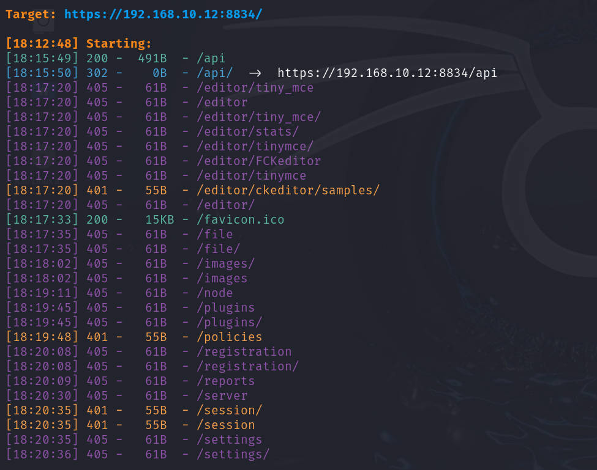

发现有`api`，访问之后，发现有很多功能

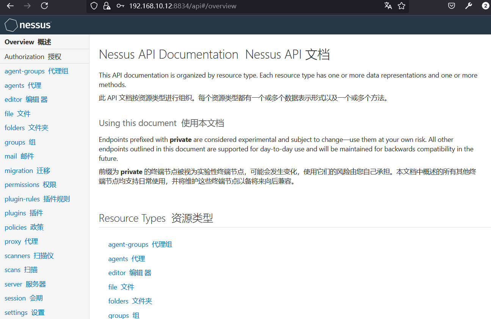

测试这些`api`功能后，基本上都是需要登录的，无意义

尝试进行抓取数据包然后爆破，以前面两个用户名为测试，我这里是使用`burp`的

选择攻击点、攻击模式、以及字典的选择

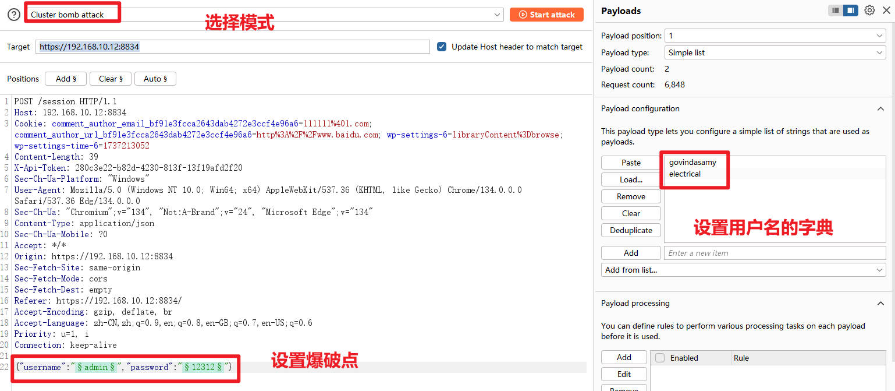

这里的默认字典，只有`burp pro`版本中有，若使用社区版，可以加载密码字典，比如加载`kali`中的`/usr/share/wordlists/fasttrack.txt`字典或`rockyou.txt`也行

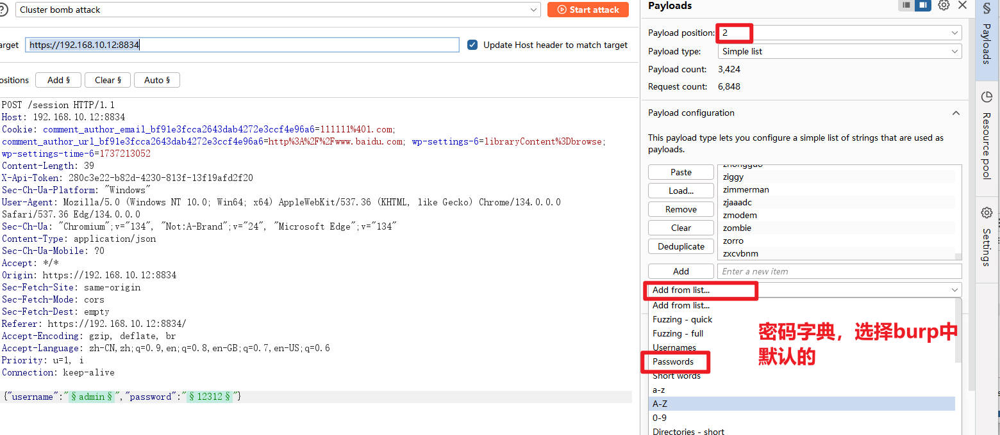

开始攻击后，等一会即可发现成功获取一个，用户名`govindasamy`和弱密码`password`

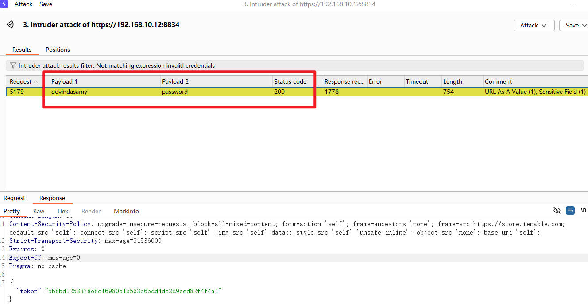


```
192.168.59.129
X-Cookie: token=8627d69a7c10797d08c56eee8e10117e41c351545d8e469b

{
    "secretKey": "f9fb0b2704a2d79f7f3b8acee5e8afab1f301a3c7bf60c76084ba364282b7c9e",
    "accessKey": "67a3f9a02ae00bc89b072305a1647f4e905bec38fa695e3d66f862f0b1940999"
}
```


```
{
    “ACL” 中： [
        {
            “权限”：16、
            “owner”： null、
            “display_name”： null，
            “name”： null，
            “id”： null，
            “type”： “default”
        },
        {
            “权限”：128、
            “owner”： 1，
            “display_name”： “system”，
            “name”： “nessus_ms_agent”，
            “id”： 1，
            “type”： “user”
        }
    ]
}
```


