# 前言

靶机：`stapler`靶机，IP地址为`192.168.10.12`

攻击：`kali`，IP地址为`192.168.10.6`

靶机采用`virtualbox`，攻击机采用`VMware`虚拟机，都采用桥接网卡模式

> 文章涉及的靶机及工具，都可以自行访问官网或者项目地址进行获取，或者通过网盘链接下载  `https://pan.quark.cn/s/ee513814fee2`

# 主机发现

也就是相当于现实环境中去发现确定主机的`ip`地址，因为这里是靶机环境，所以跳过了从域名到`ip`地址的过程。

使用`arp-scan -l`或者`netdiscovery -r 192.168.10.1/24`

当然也可以使用`nmap`等工具进行

```shell
netdiscover -r 192.168.10.1/24
```

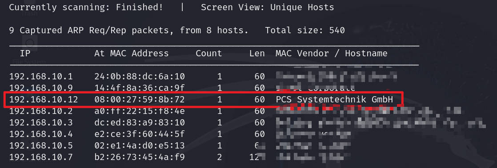

# 信息收集

## 使用nmap扫描目标端口等信息

首先扫描目标的`tcp`端口的开放情况

```shell
nmap -sT --min-rate=1000 192.168.10.12 -p- -oA nmap-tcp
```

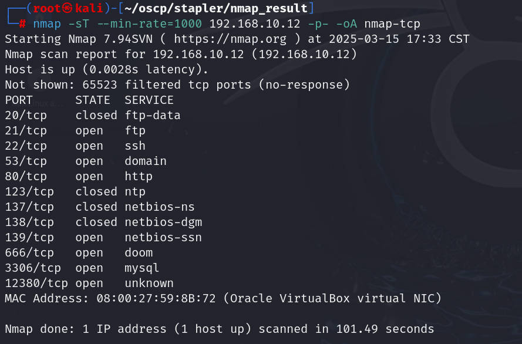

再扫描`udp`端口的开放情况

```shell
nmap -sU --min-rate=1000 192.168.10.12 --top-ports 20 -oA nmap-udp
```

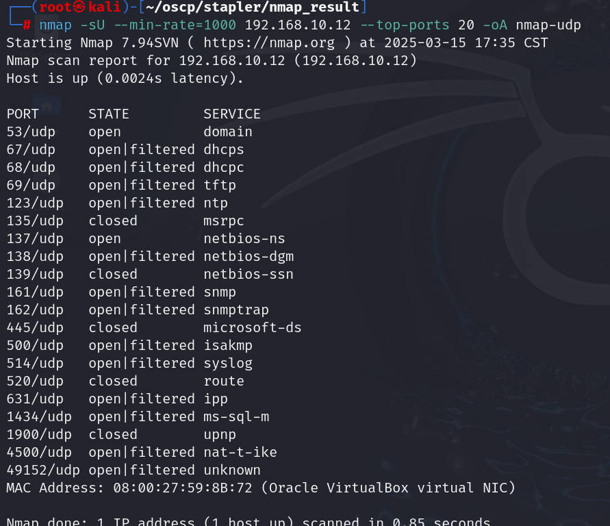

可以看到明确开放的`udp`端口没有，所以下面对`tcp`端口进行一个筛选

```shell
ports=`grep open nmap-tcp.nmap | awk -F'/' '{print $1}' | paste -sd ','`
```

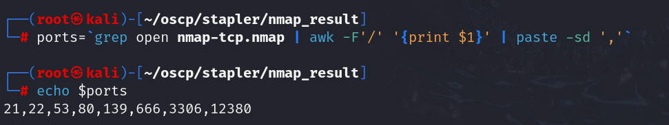

进一步对这些端口进行服务、系统等探测

```shell
nmap -sV -O -sC 192.168.10.12 -p $ports --min-rate=1000 -oA detail
```

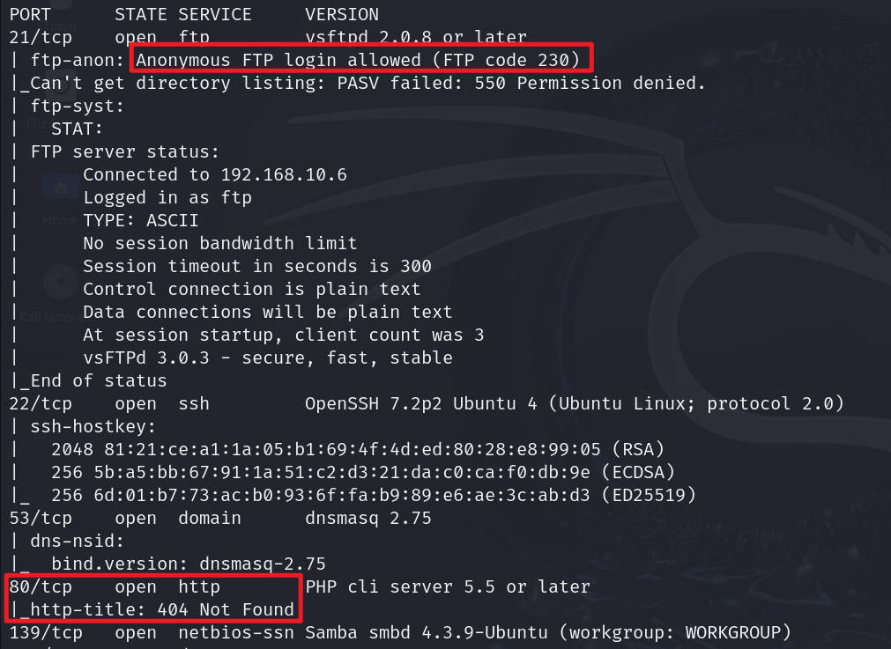

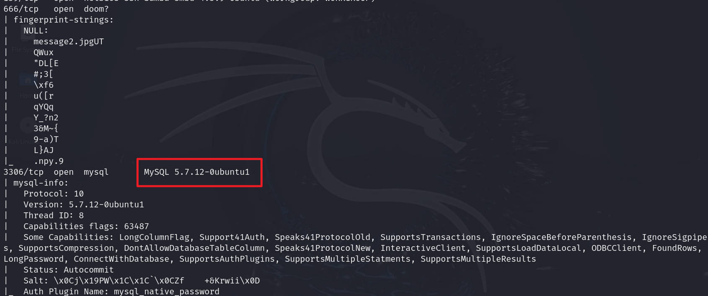

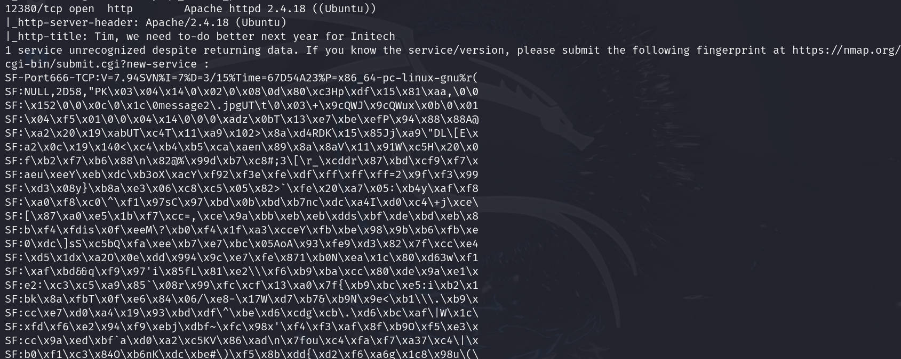

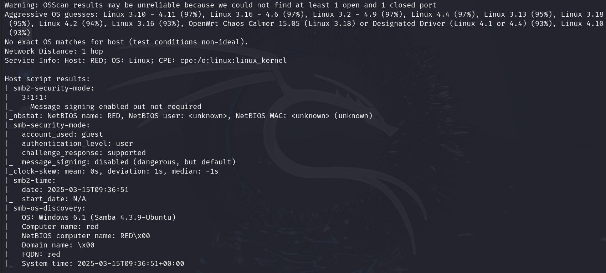

再使用`nmap`的漏洞检测脚本对这些端口进行探测

```shell
nmap --script=vuln 192.168.10.12 -p $ports -oA vuln
```

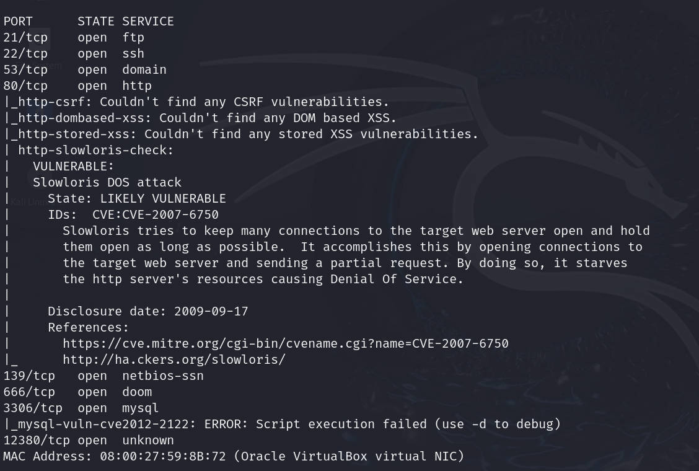

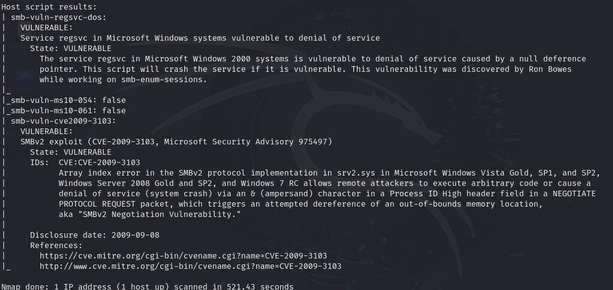

信息小结：

| 端口  | 服务   | 版本                 |
| ----- | ------ | -------------------- |
| 21    | ftp    | vsftpd 2.0.8         |
| 22    | ssh    | openssh 7.2p2        |
| 53    | domain | dnsmasq 2.75         |
| 80    | http   | php cli server 5.5   |
| 139   | samba  | smbd                 |
| 666   |        |                      |
| 3306  | mysql  | mysql 5.7.12         |
| 12380 | http   | apache httpd  2.4.18 |

## FTP信息探测

使用`anonymous`匿名空密码登录

```shell
ftp anonymous@192.168.10.12
ls -la
get note
```

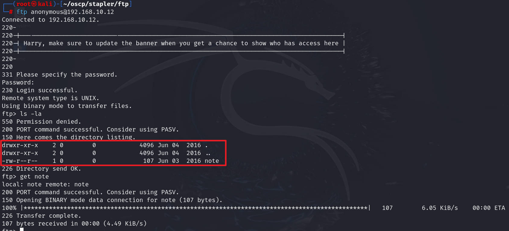

查看`note`，又有发现

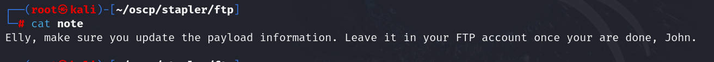

信息小结，获取三个用户名

```shell
harry
elly
john
```


## SMB探测

使用`enum4linux`探测服务

```shell
enum4linux 192.168.10.12 -a
```

可以看到有几个共享

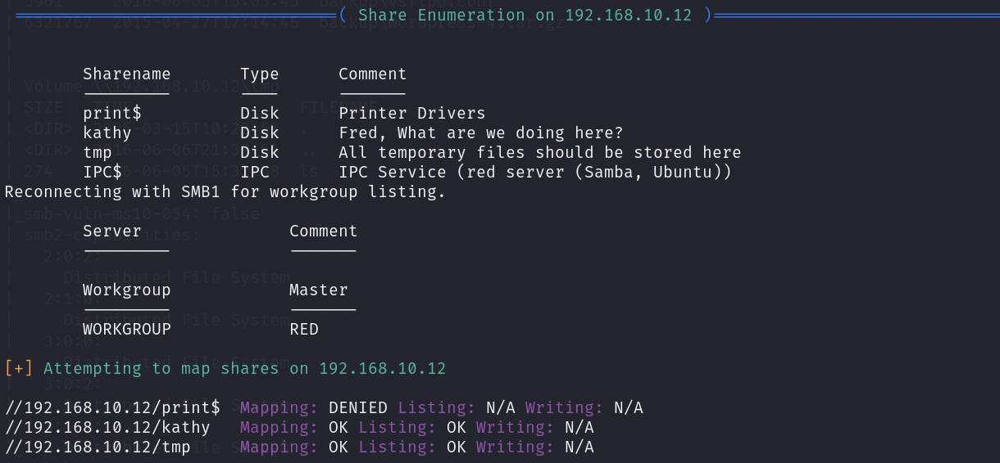

以及一堆用户名

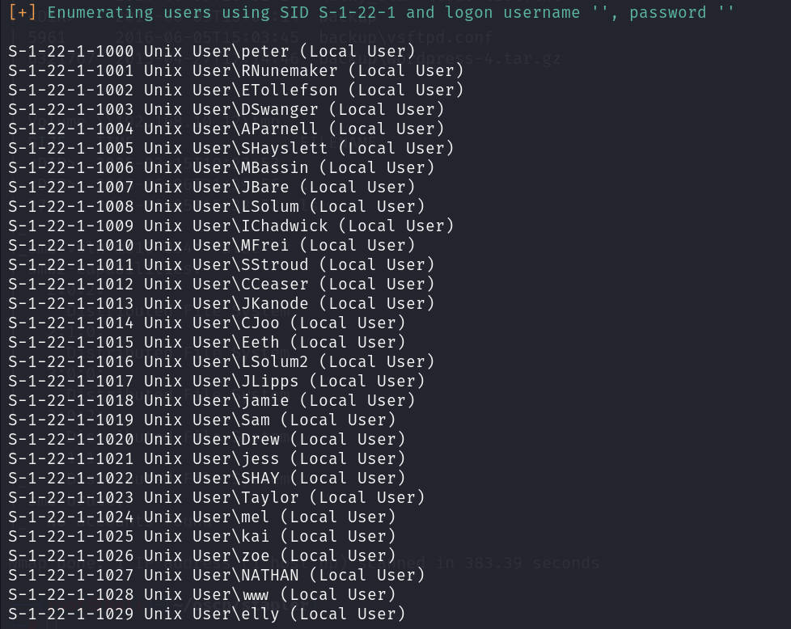

或者使用`nmap`的脚本进行探测

```shell
nmap --script=smb* 192.168.10.12
```

共享出的一样，只是这里明确列举出了共享中的文件

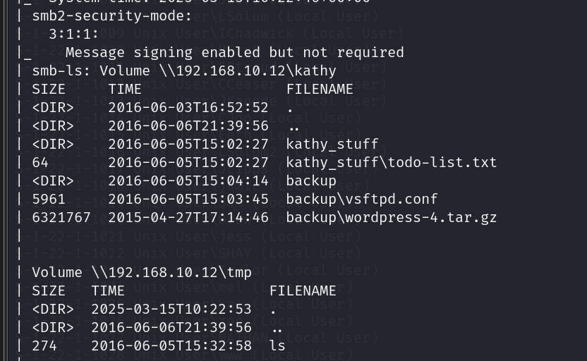

使用`smbclient`查看或者连接也行

```shell
smbclient -L //192.168.10.12
```

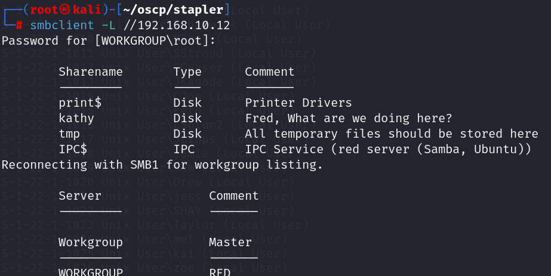

使用`smbclient`连接`kathy`共享

```shell
smbclient //192.168.10.12/kathy -N

smb: \> prompt		#关闭交互
smb: \> recurse		#开启递归
smb: \> mget *		#下载所有
```

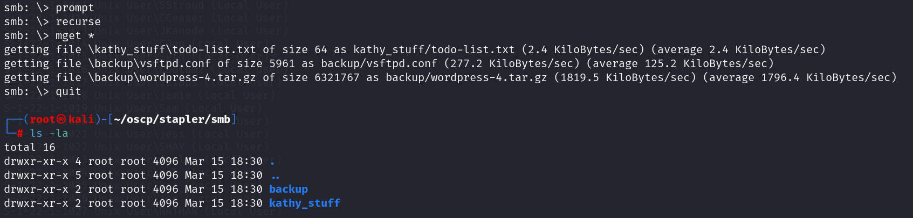

再连接`tmp`共享，下载所有文件

```shell
smbclient //192.168.10.12/tmp -N

smb: \> prompt		#关闭交互
smb: \> recurse		#开启递归
smb: \> mget *		#下载所有
```

查看文件构造，发现一个压缩包，一个`txt`文件

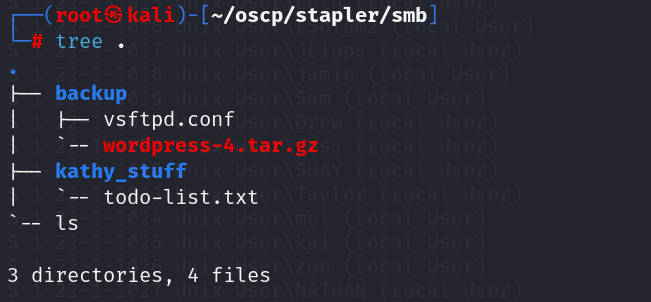

查看相关文件，发现一个用户名`kathy`，以及`wordpress`的备份文件

```shell
#解压文件
tar -zxf wordpress-4.tar.gz
```

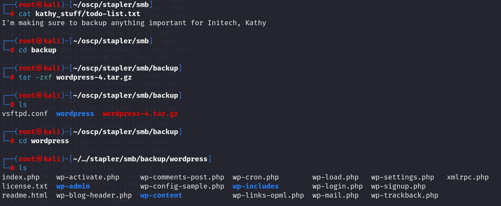

不过查看了很久，并没有发现连接数据库的配置文件

查看`ls`文件，发现只是一种记录

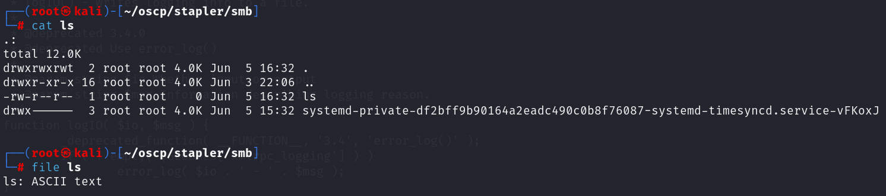

信息小结：

获取众多用户名，把前面获取的用户名都放在一起，做成字典

```shell
peter
RNunemaker
ETollefson
DSwanger
AParnell
SHayslett
MBassin
JBare
LSolum
IChadwick
MFrei
SStroud
CCeaser
JKanode
CJoo
Eeth
LSolum2
JLipps
jamie
Sam
Drew
jess
SHAY
Taylor
mel
kai
zoe
NATHAN
www
elly
kathy
harry
john
```

## 网站信息探测

###### 访问80端口的网站

并没有发现东西，并且页面源代码也没有内容

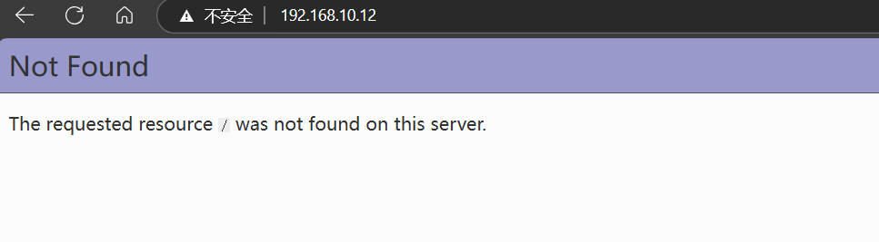

使用`gobuster`等工具进行目录爆破

```shell
gobuster dir -u http://192.168.10.12 -w /usr/share/wordlists/dirb/big.txt -b 404 -x php,html,txt,md       
```

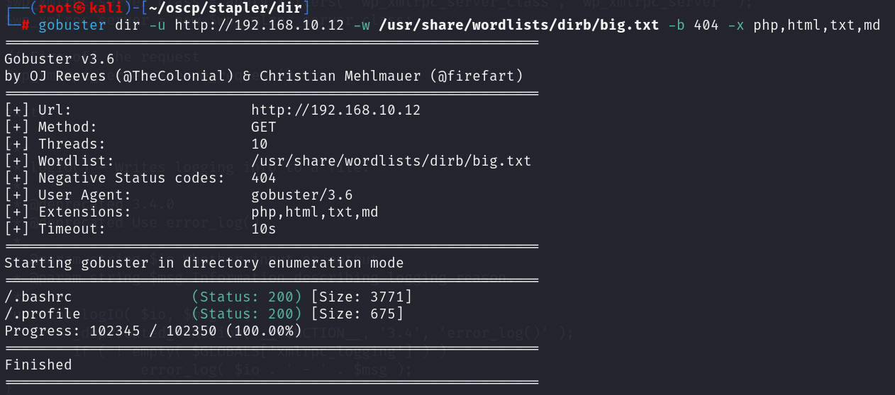

访问这两个发现直接下载，并且这两个文件，一般是在某个用户的主目录下的，猜测这个网站，可能就是以某个用户的主目录为网站目录的

在测试`.ssh/id_rsa`无果后，暂且搁置该网站


###### 访问12380网站

可以看到，主界面没有任何内容，并且页面源代码中也没有内容

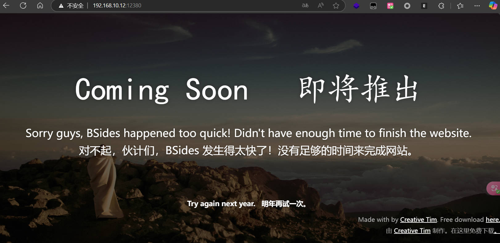

使用`dirb`进行网站扫描，没有出现任何内容

```shell
dirb http://192.168.10.12:12380
```

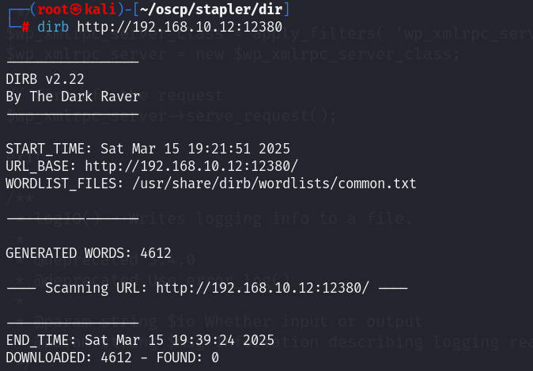


# 密码爆破

目前只有大量的用户名，并没有其他东西，以之前整理后的`user`，进行密码爆破

```shell
hydra -L username -P /usr/share/wordlists/fasttrack.txt 192.168.10.12 ssh
```

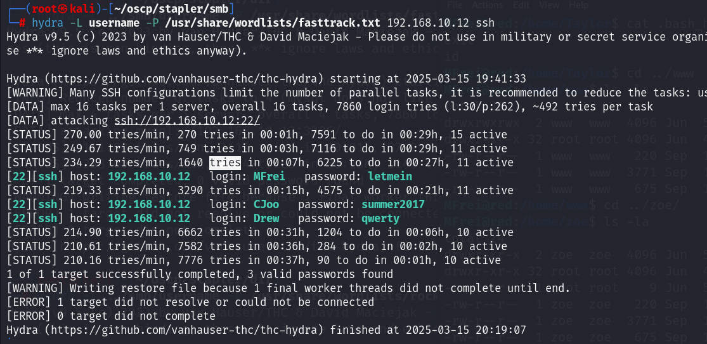

爆破出三个，随便以这用户进行登录，发现基本上没有什么内容，并且用户众多

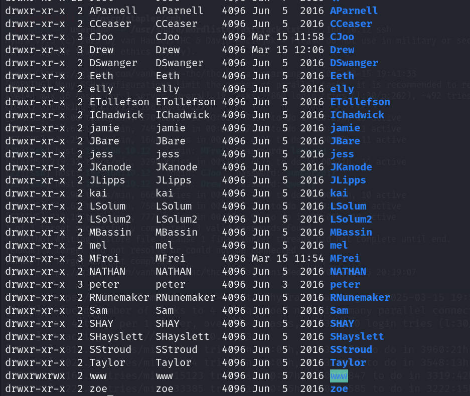

一个个访问这些目录，只有在`JKanode`用户的目录下，发现命令历史记录中具有信息

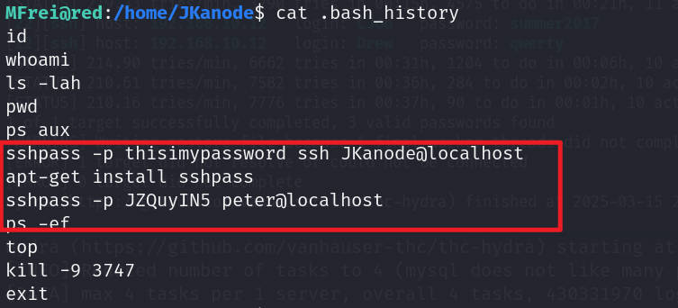

```shell
sshpass -p thisimypassword ssh JKanode@localhost
sshpass -p JZQuyIN5 peter@localhost
```

经测试，上面这两个可以作为ssh登录，这里开始整理信息

| 用户名  | 密码            |
| ------- | --------------- |
| MFrei   | letmein         |
| CJoo    | summer2017      |
| Drew    | qwerty          |
| JKanode | thisimypassword |
| peter   | JZQuyIN5        |

这里查看网站，发现在`/var/www/https/blogblog/wp-config.php`的配置文件，有连接数据库的配置

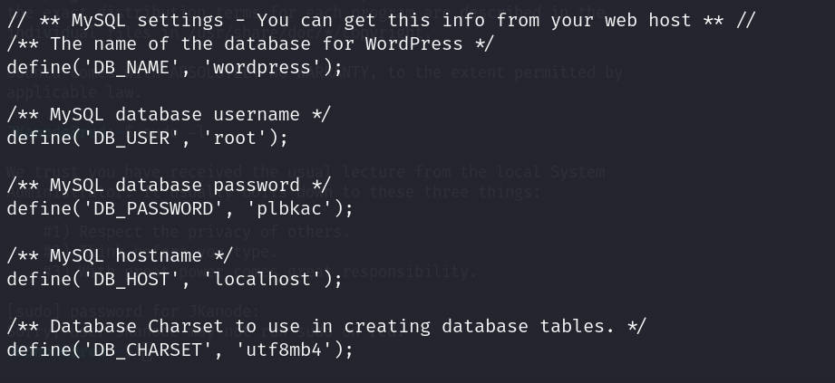

发现密码`plbkac`，并且连接数据库的是以`root`执行的

查看`wordpress`数据库，发现其中的一些用户，不过都是加密处理的，不知道其算法

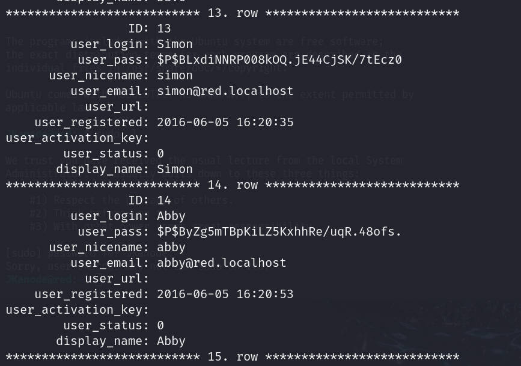

# 提权

这里可能存在`mysql udf`提权，但是这里测试发现，不想，因为`mysql`版本大于`5.0`，并且插件的所在路径对于非`root`用户没有写入权限，所以无法提权

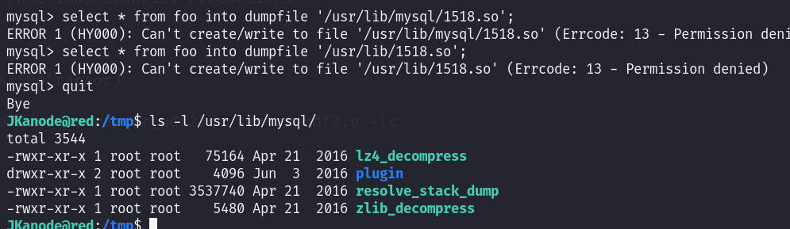

从前面所有用户下手，并且使用`find`寻找具有SUID权限的文件

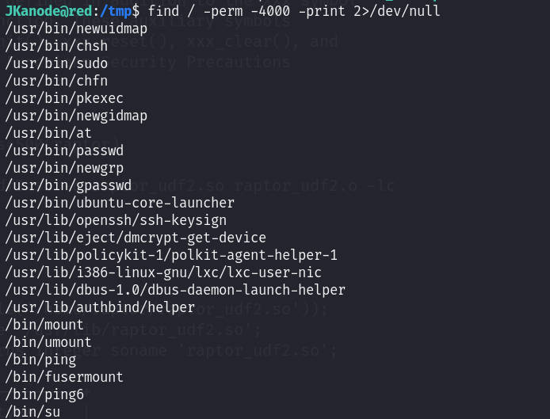

不过最终只有在`peter`用户不一样，登录界面就不同

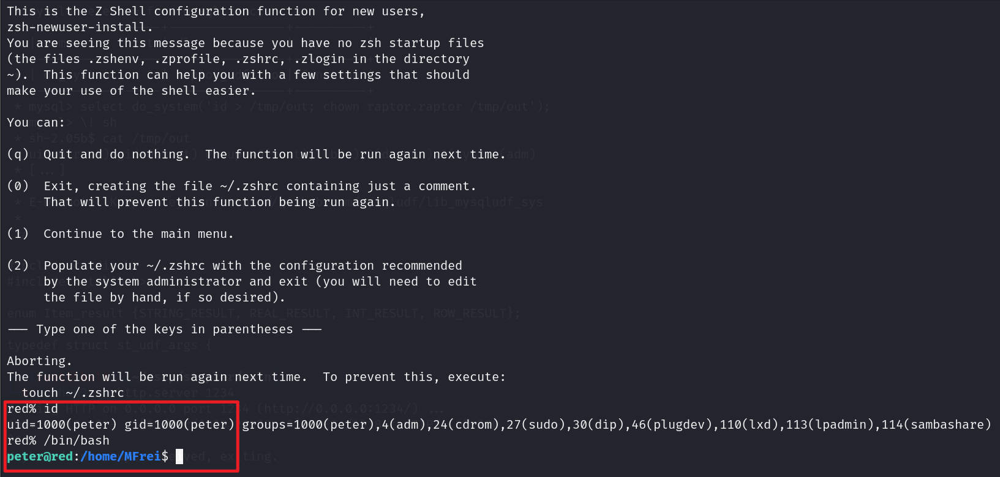

以`peter`使用`sudo -l`发现完全`ok`

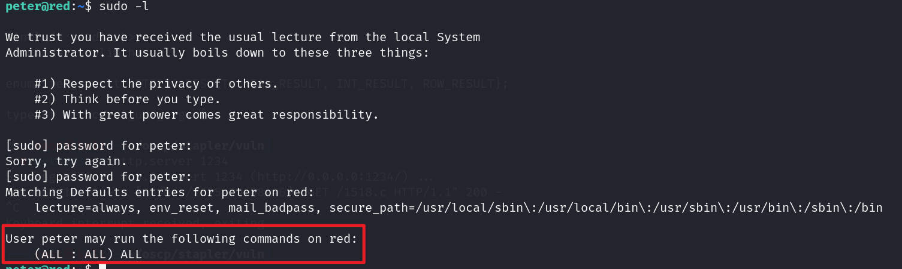

直接`sudo /bin/bash -p`提权

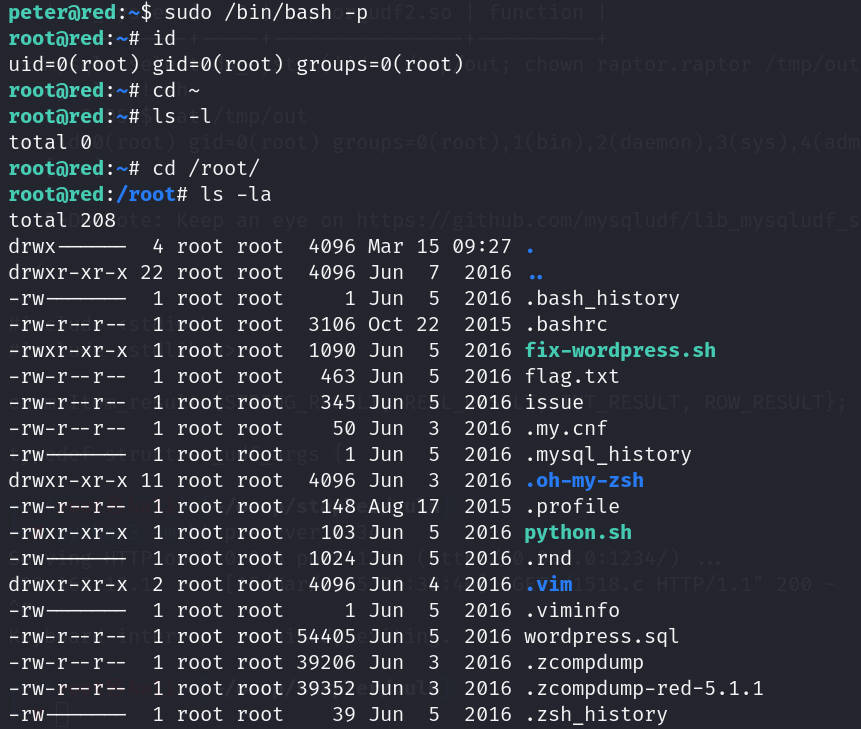

查看最终`flag`

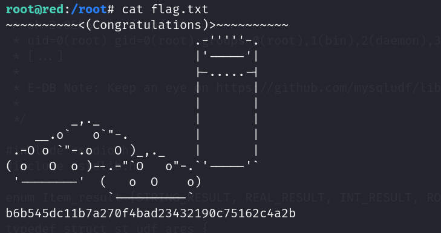

# 总结

该靶机主要就是枚举，枚举，枚举！！！！

1. FTP服务的匿名探测
2. SMB服务的用户名枚举
3. SSH服务的暴力破解
4. 靶机内信息收集，找到的密码
5. 最终提权，就是不同用户直接的切换