# 前言

靶机：`kioptrix-4`，IP地址为`192.168.1.75`，后期IP地址为`192.168.10.8`

攻击：`kali`，IP地址为`192.168.1.16`，后期IP地址为`192.168.10.6`

都采用`VMware`虚拟机，网卡为桥接模式

这里的靶机，官方只给了硬盘文件，没有给出虚拟机可直接加载文件`.vmx`，所以这里需要自行安装一个，然后导入硬盘

# 安装靶机

首先使用`VMware`新建一个虚拟机

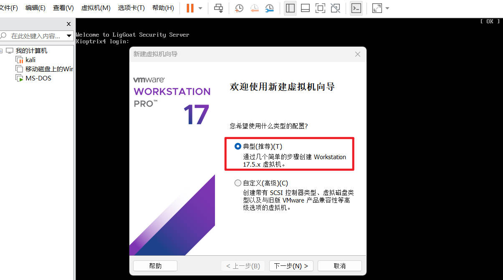

然后选择稍后安装操作系统

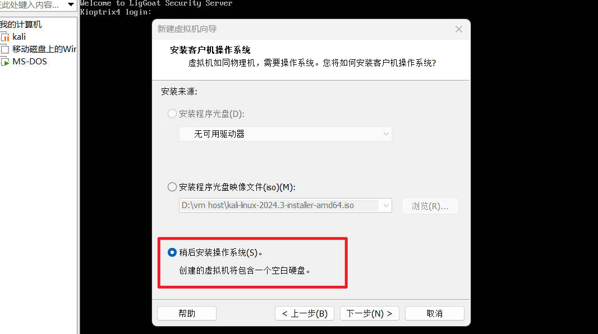

然后选择其他，默认版本即可

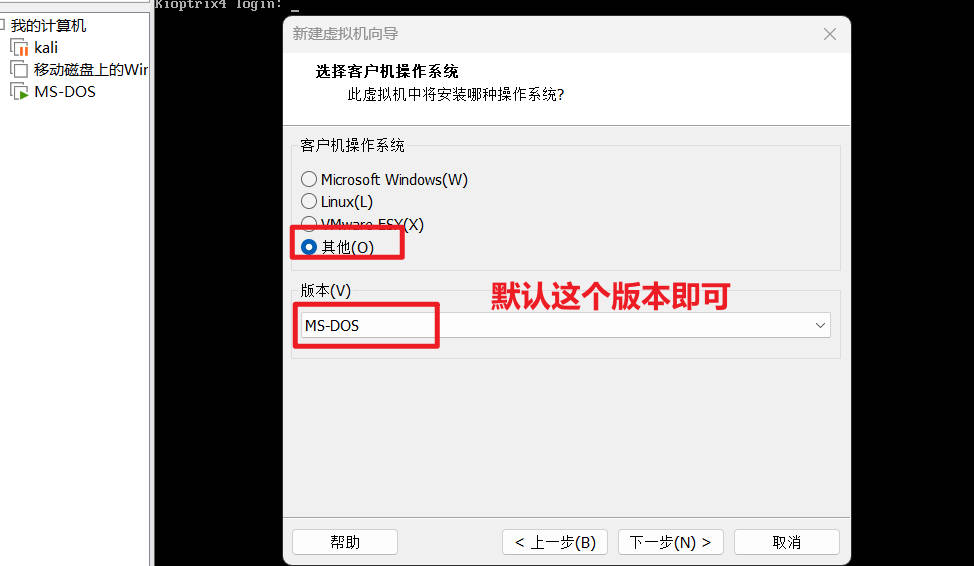

然后一直点击下一步直到完成即可

打开新建虚拟机的设置，添加一个硬盘，该路径就是靶机的硬盘位置

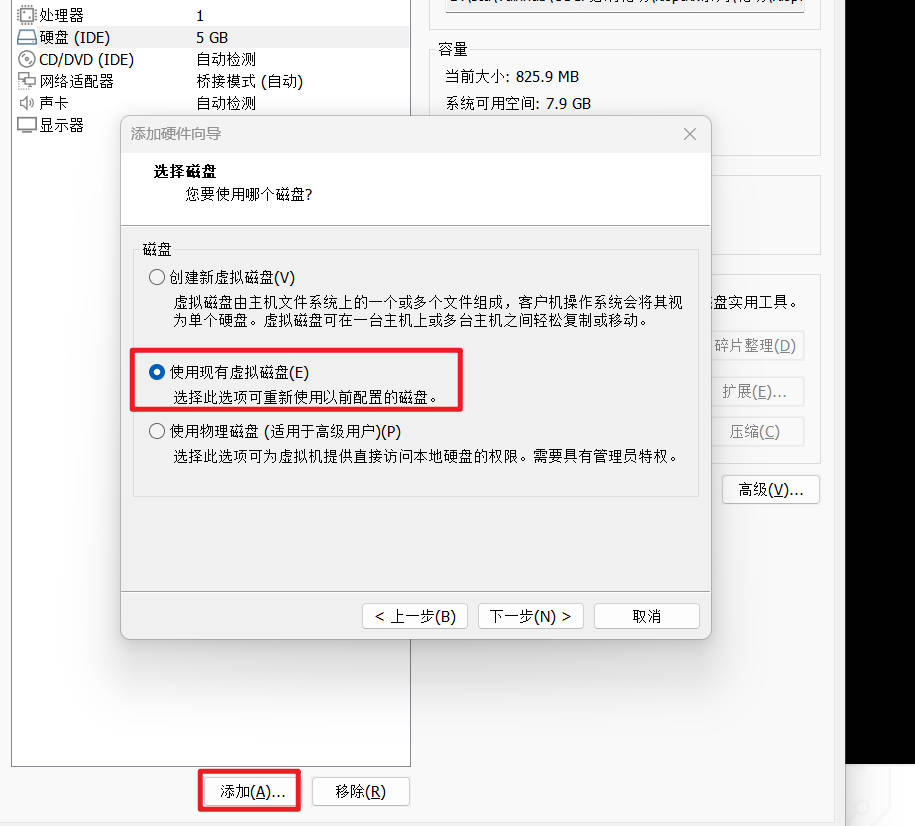

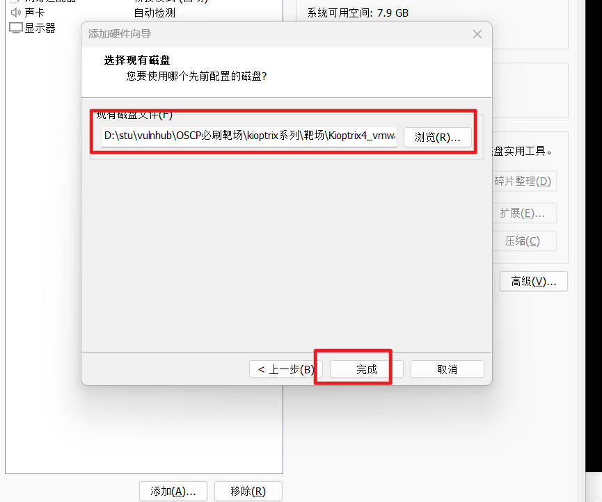

然后这时候把原本新建虚拟机的硬盘移除

这里千万别忘了把网络适配器改为桥接模式

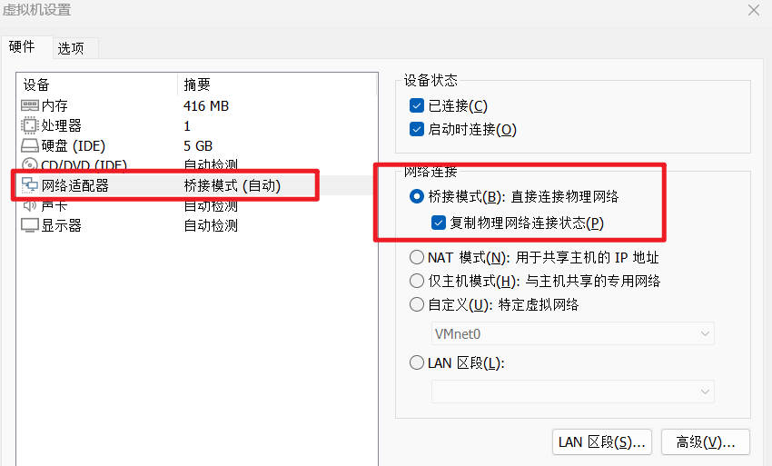

这时候直接启动即可成功

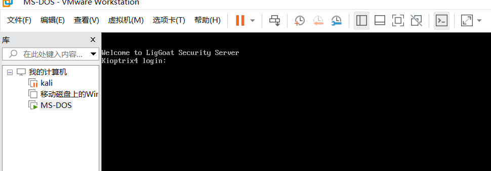

# 主机发现

使用`arp-scan -l`或`netdiscover -r 192.168.1.1/24`，因为这两款工具对于同一局域网，同一网段扫描极快，当然也可以使用`nmap`扫描，我这里因为设备过多，影响截图，所以采用上面两个

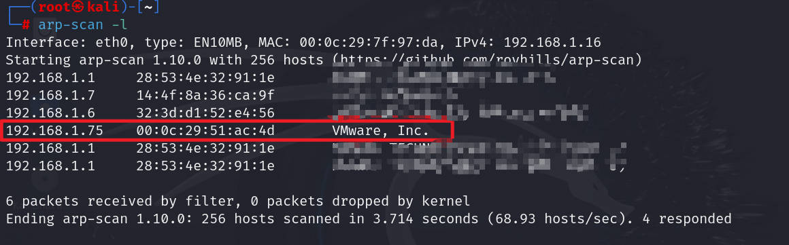

# 信息收集

## 使用nmap扫描端口

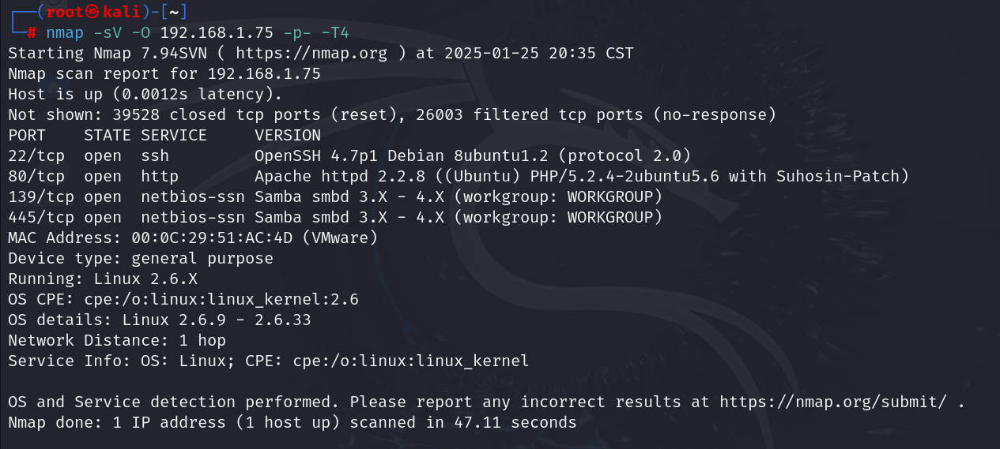

## 网站信息探测

访问80端口默认界面，发现是一个登录界面

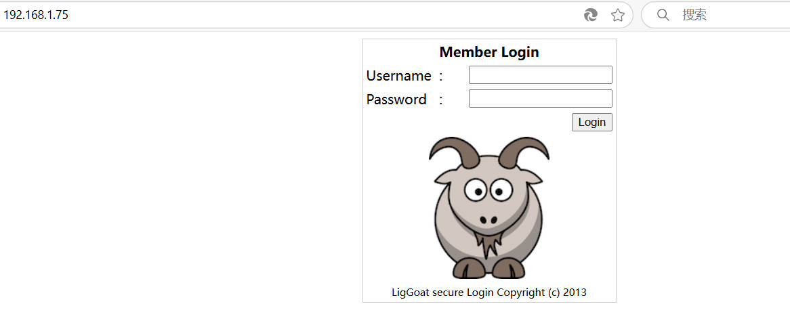

查看页面源代码，发现是`form`表单，并且是提交给`checklogin.php`处理的

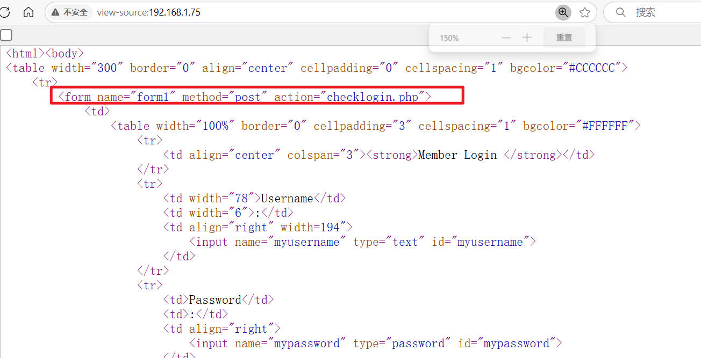

尝试进行网站目录爆破，借助`gobuster、dirsearch、dirb`等工具皆可

```shell
gobuster dir -u http://192.168.1.75 -w /usr/share/wordlists/dirb/big.txt -x php,zip,gz,tar,txt,md -b 403-404
```

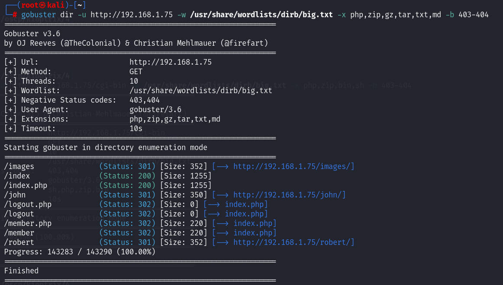

访问`john`和`robert`都是跳转到`index.php`

```shell
dirsearch -u http://192.168.1.75 -x 404
```

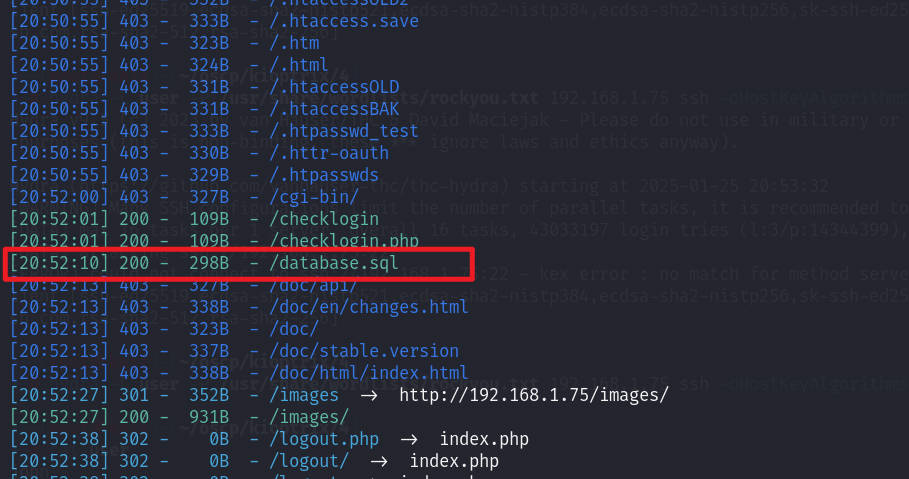

访问`database.sql`，发现是类似于日志一样，访问发现添加了一个用户和密码，但是登录网站并不能成功

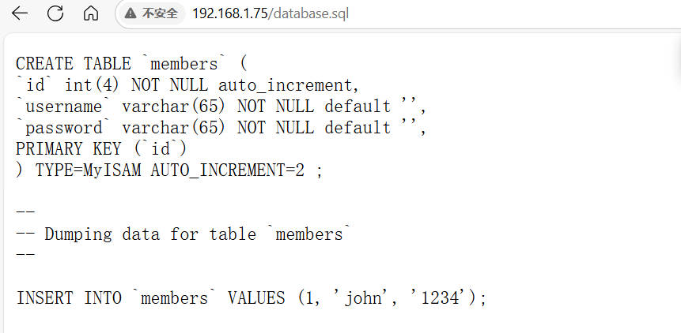

## samba探测

之前扫描出的`139`和`445`端口，服务为`samba`，那么尝试确定其版本

使用`nmap`脚本测试发现版本为`3.0.28a`，并且使用之前的脚本探测也是这个版本

```shell
nmap -sV 192.168.1.75 --script=smb-os-discovery
```

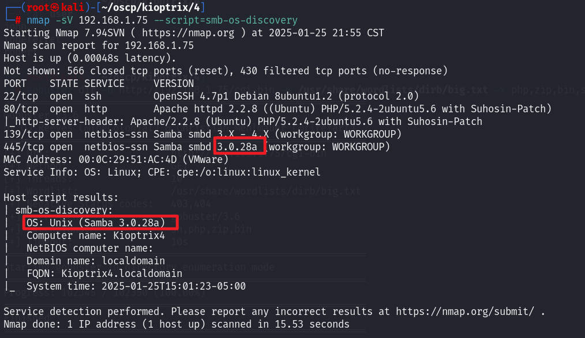


使用`searchsploit`搜索对应的版本漏洞，发现并无好用的，毕竟目的是获取`shell`等

```shell
searchsploit samba 3.0.28a
```

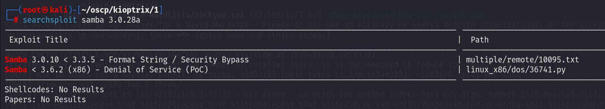

尝试使用`enum4linux`测试，发现几个用户

```shell
enum4linux 192.168.1.75 -a
```

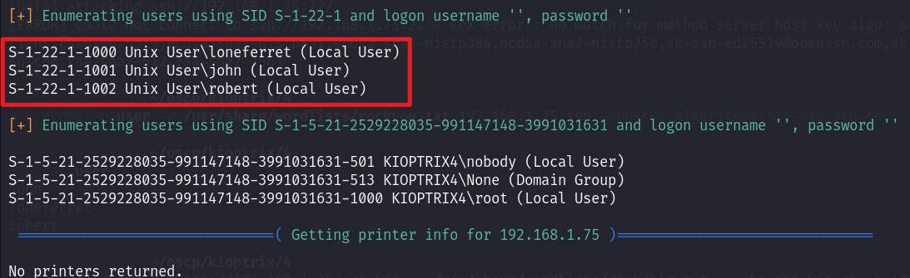

不过当测试`ssh`爆破时，发现长时间就出现超时，所以暂时搁置

# 漏洞寻找

根据前面收集的信息，暂无直接漏洞可用，那么开启`burp`或者`yakit`

尝试对网站进行抓取数据包进行测试，每一步都抓取数据包测试

但是这里不知道什么原因，这里原本的主机在开启`burp`后突然无法访问成功了，唉，估计是`ip`测试技术之类的吧，换一个机器测试，毕竟之前也没有抓取数据包，无法得知数据包情况

抓取登录时的数据包

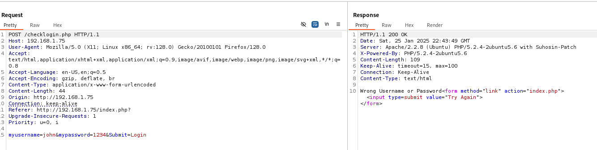

那么尝试在`post`请求体数据中修改，在`username`处发现闭合并未有任何效果

在`password`处发现闭合，出现返回不一样的，这里是数据库的报错

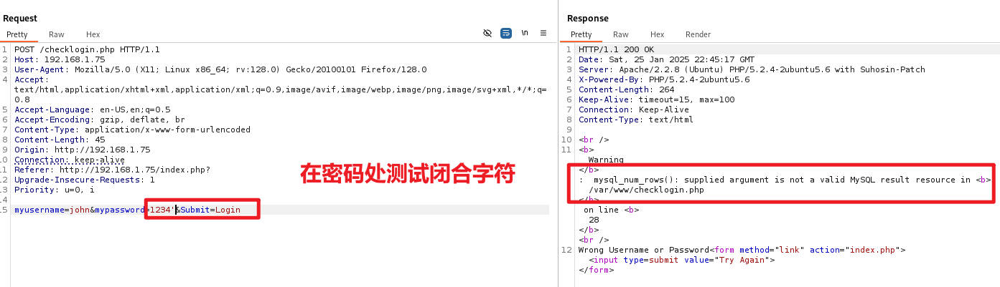

说明存在`sql`注入，那么尝试万能密码

```
myusername=john&mypassword=1234'+or+1=1--+&Submit=Login
```

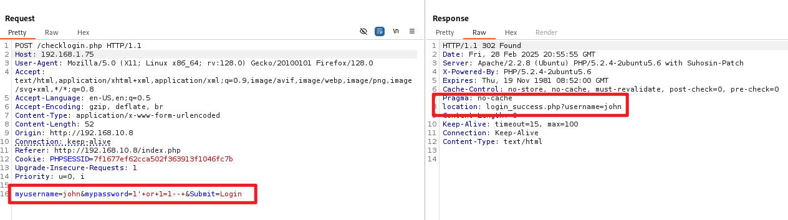

发现跳转，并且这个重定向有点东西，根据英语意思是否可以理解为登录成功，并在后面指定用户

跟随跳转，发现又跳转到用户界面

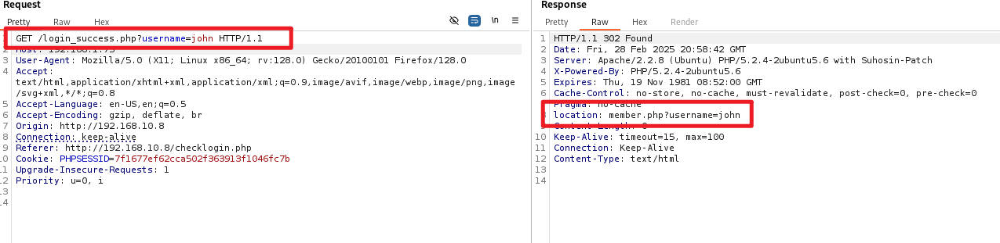

再次跟随跳转发现直接登录成功

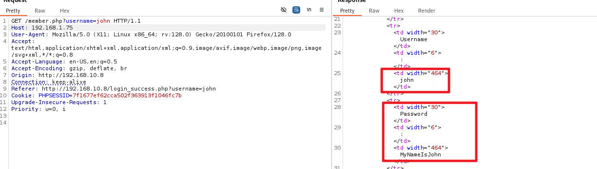

查看浏览器的界面，并以密码登录，确实成功

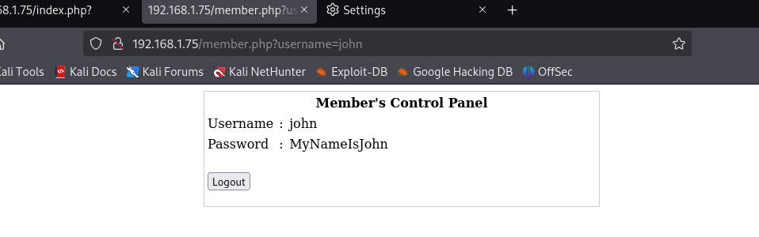

这里可以看到登录后，在`url`的构造是以`username`为参数指定用户名的，测试直接在`url`中修改`username=robert`，但是发现还是`john`的界面

继续通过抓包修改，也就是以`robert`登录时的数据包

然后与上面的形式一样进行万能密码测试，发现确实可行

**这里注意，抓取的数据包是重新抓取的新的，当然也是可以在其中一个跳转的数据包中修改，也就是在`login_success.php?username=john`这里修改用户名，也就是前面`enum4linux`中枚举出的用户名**

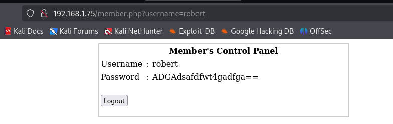

继续以上面的形式测试`loneferret`，通过抓包修改的方式以及修改`url`参数的方式，获取到一个提示

**这里因为换了网络，所以这里靶机的`ip`地址和`kali`的地址都改变了**

靶机地址`192.168.10.8`，`kali`地址`192.168.10.6`

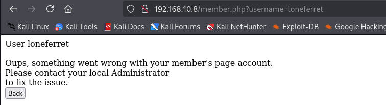

当前获取到的两个用户和密码

| 用户名 | 密码                  |
| ------ | --------------------- |
| john   | MyNameIsJohn          |
| robert | ADGAdsafdfwt4gadfga== |

一般到这里就可以进行下一步的测试了,不过实际情况中，不知道是否还有遗漏

建议进行一次完整的`sql`注入，这里就不演示了，很简单的，不过大概率是盲注

所以尝试使用`sqlmap`进行测试，说不定有些东西

吧抓取的数据包复制，并放置在一个文件中即可，命名为`data`

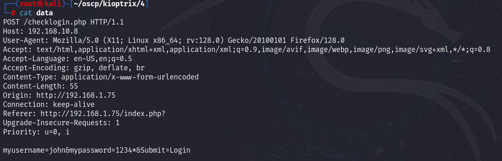

使用`sqlmap`，`sqlmap -r data --batch --dump`

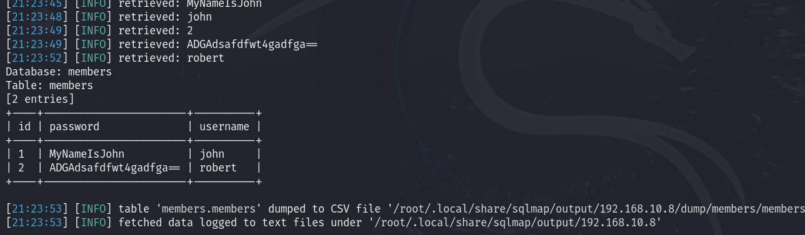

# bash逃逸

以`john`和`robert`对应的密码，都可以以`ssh`登录成功，只是这里应该是`rbash`，太多东西无法使用

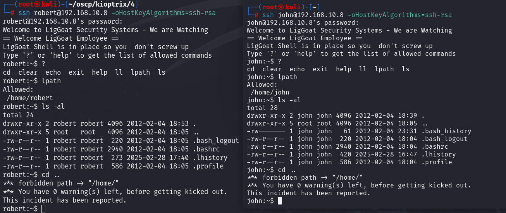

这里经过多次测试，发现大多都是无法使用的`rbash`逃逸，并且可用的命令很少

尝试使用`echo`写脚本等也是不行。最终无奈，百度一下`wp`，发现竟然是配合使用，就是这个命令`echo os.system('/bin/bash')`这个让我不理解。继续搜索，发现这个是`lshell`的一个漏洞，是针对`python2`的一个，下面是链接`https://dev59.com/unix/LUHGoIgBc1ULPQZFOr8H`


# 靶机内网收集

使用`find`寻找具有SUID权限的文件

```shell
find / -perm -u=s -type f 2>/dev/null
find / -perm -4000 -print 2>/dev/null
```

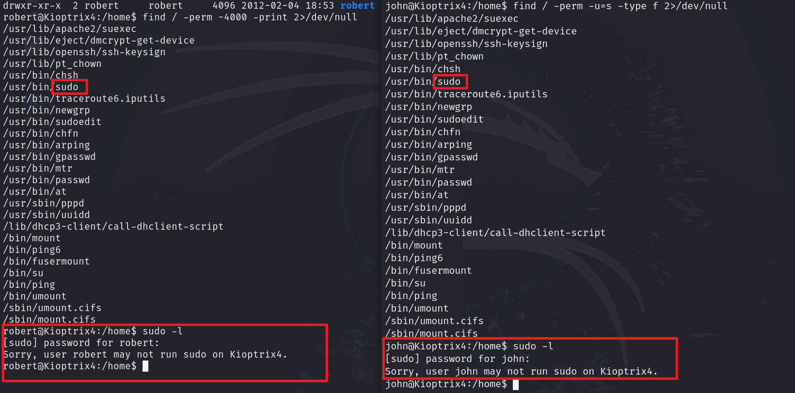

有`sudo`，但是没有权限，进一步收集，之前在网站存在`sql`注入，可能与数据库有交互的，那么去网站目录寻找一下是否连接数据库，确实连接数据库，并且还是以`root`这个权限极高的用户，且无密码

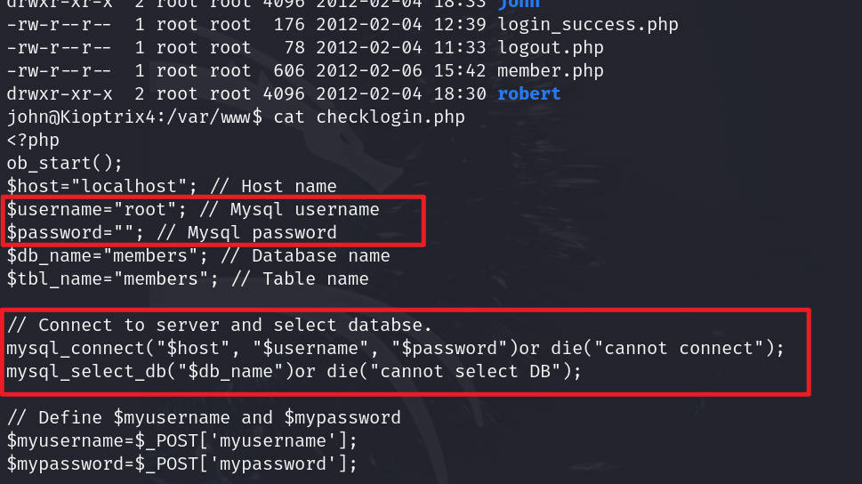

查看网络连接

```shell
ss -antlp
netstat -antlp
```

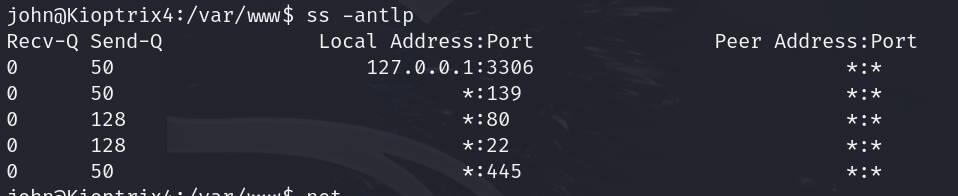

查看进程，并发现`mysql`服务确实以`root`在运行的

```shell
ps aux | grep root
ps -ef | grep root
```

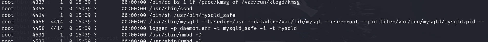

内核版本信息以及系统信息

```shell
uname -a/-r
cat /etc/issue
cat /etc/*release
lsb_release
```

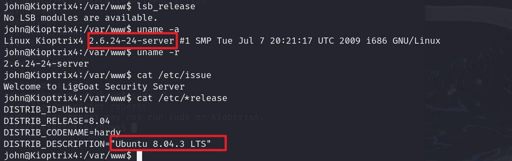

尝试上传脚本`pspy64`以及`les.sh`，发现该靶机首先不能执行二进制文件，然后`les.sh`需要更高的`bash`版本才行，所以可能隐藏的一些内容，可能无法收集

# 提权

既然`mysql`以`root`执行，并且也是指定`root`连接，密码也为空，就可能直接联想到`udf`提权，不过需要进一步验证

首先确定数据库版本信息，然后再次连接数据库，并查看安全配置

```shell
mysql -uroot -p
```

可以连接成功数据库

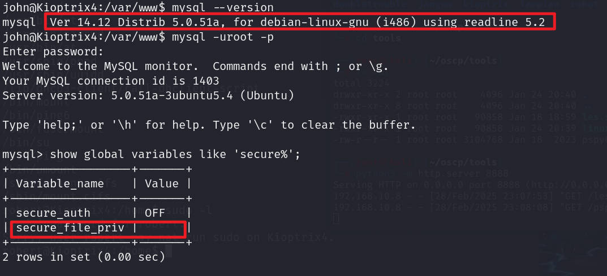

这里我在前面的`raven`靶机提到过这个提权方式的，对于这个提权，如果`secure_file_priv`后没有具体值是，代表可能存在提权的。

并且这里的`mysql`版本信息，是因为当`mysql>=5.1`时，是必须把`udf`的动态链接库文件放置于`mysql`安装目录下的插件文件夹下，才能创建自定义函数，以提权。这里`mysql`版本是小于的，所以可直接使用


这里的提权方式可以使用默认的文件`lib_mysqludf_sys.so`，这个是可以执行系统命令的一个函数，根据情况，若是没有加载，需要使用`create`加载这个文件

或者也可以使用`searchsploit`搜索出的`c`文件中的函数进行提权，这里的文件可以自己编写，当然知道原理即可

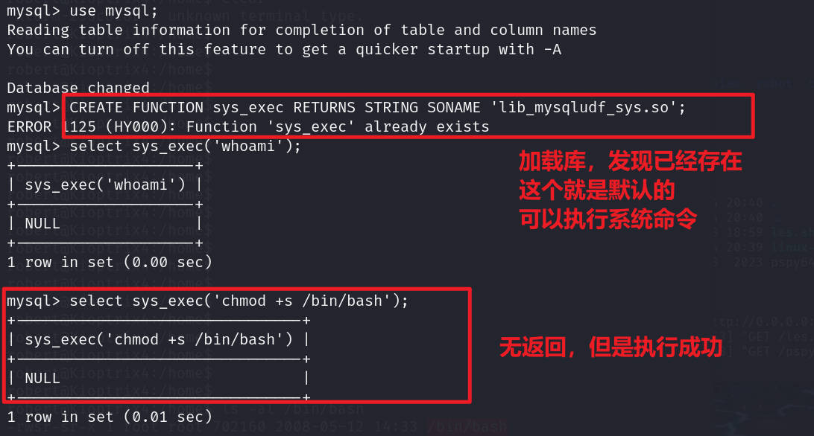

查看`/bin/bash`是否修改为`SUID`权限

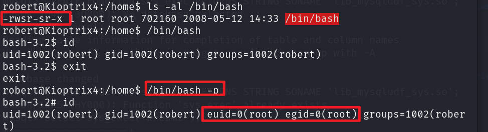

发现确实，并且可以直接输入`/bin/bash -p`提权至`root`

查看最终文件

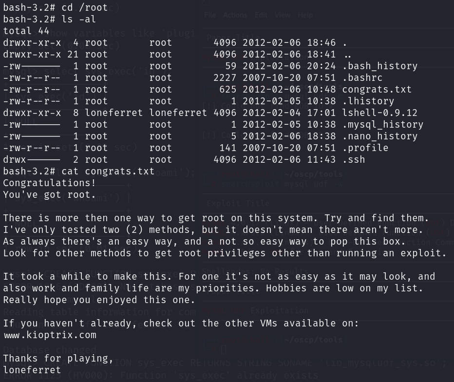

对于使用`searchsploit`搜索出的，直接进行复原即可，因为文件中有每一步的用法，这里就省略

> 或者可以看之前的靶机`raven`系列，那个是`mysql`版本>=5.0的。链接：`https://mp.weixin.qq.com/s/M1MQcKTW738sx463Vo7pgg`

# 总结

该靶机主要考察：

1. 对于sql注入，要结合，不要只看固定的地方，这里是根据`http`协议，存在于`post`方式中，那么依次类推，是否可以存在请求头中呢，要去思考
2. 对于`rbash`逃逸，也要考虑可能是版本问题，这里就是`lshell`的版本漏洞，导致执行`python`中的函数
3. 对于`mysql`的`udf`提权，要知道条件，不然就是盲目的去硬碰，这里知道UDF提权条件后，就可以根据版本来进行测试，当然可以自己写提权文件


