# 前言

全部虚拟环境，桥接模式

靶机：`grotesque-2    192.168.1.43`

攻击：`kali     192.168.1.16`

# 主机发现

今天换个命令，不使用`arp-scan -l`，使用`netdiscover `

```shell
netdiscover -r 192.168.1.1/24	指定网络范围
```

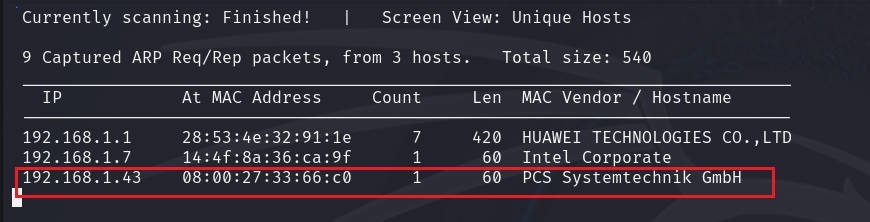


# 信息收集

## 使用nmap扫描

后面端口也开启，一直到555端口，中间可能不是连续的，都是与前面一样的内容

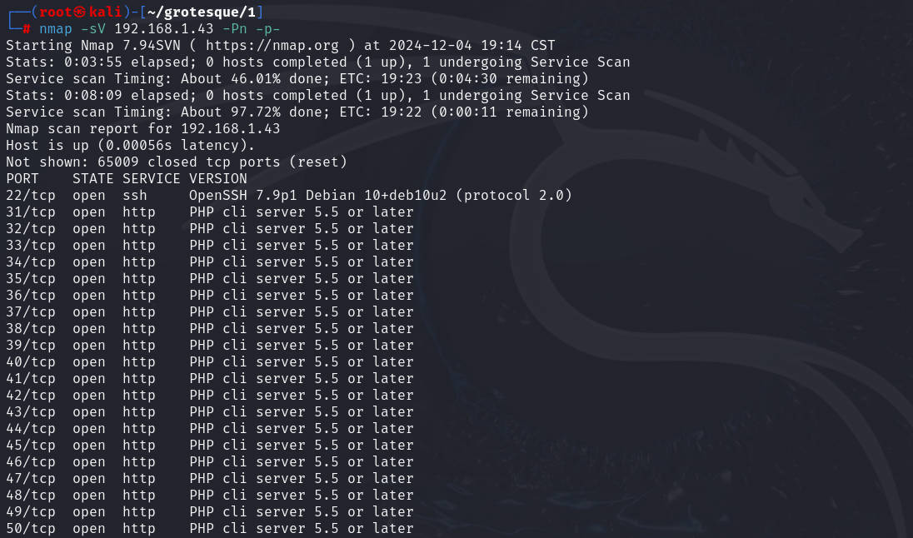


访问端口内容都是一张`angel`图片，但是端口太多，不能一个个的访问，使用`shell`编程去测试

```shell
for i in {80..556};do wget http://192.168.1.43:$i -O ange$i;done
```

然后把下载的内容进行数据大小的排序

```shell
ls -Slh		从文件大--->文件小
ls -Slhr	从文件小--->文件大
```

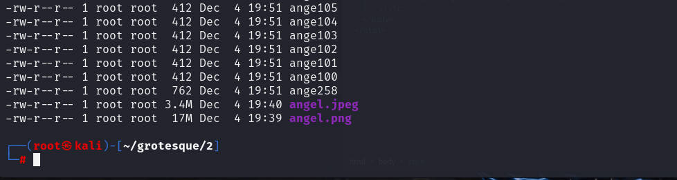


发现明显过于大的内容，查看内容，或者浏览器访问`258`端口

后面两张图片是我用于之前测试的，忘了删除，因为前面怀疑图片隐藏信息，所以这里先忽略最后两个文件，看`ange258`

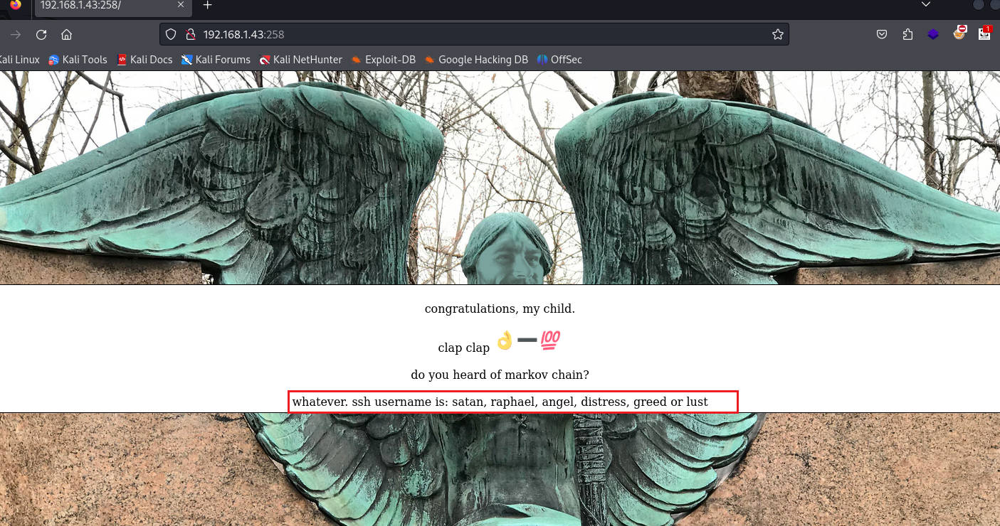

给出几个`ssh`的用户名，意思可能爆破吧，这个爆破的时候看了一下网上的wp，竟然是藏在ok手势中，我服啦。`b6e705ea1249e2bb7b0fd7dac9fcd1b3`


应该是`md5`加密，可以通过在线网站或者`kali`的`john`破解，密码`solomon1`，不过这里不知道为什么，我这里的`john`没破解出来

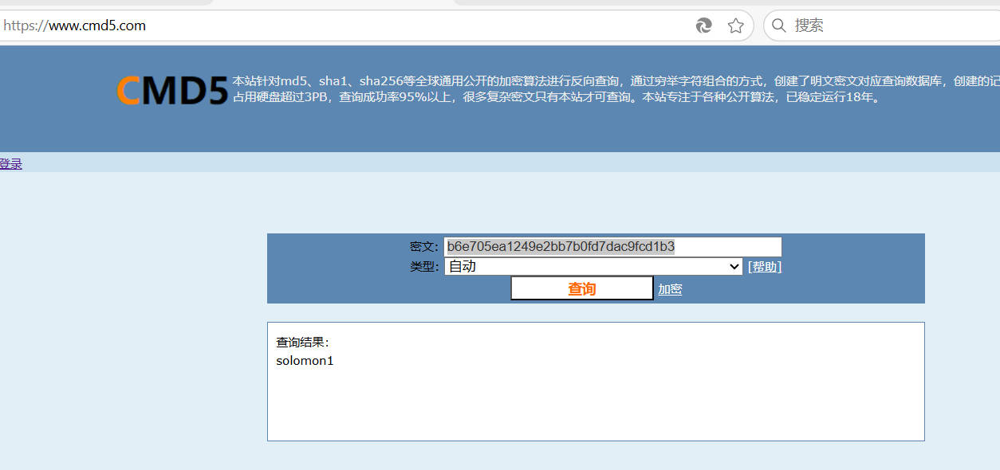


账户已经知道了，剩下就是匹配账户密码，使用`hydra`进行爆破

```shell
hydra -L [文件名] -p 1234 ssh://ip -vV -f
-L 是指定文件去爆破用户名
-l 是指定用户名
-P 是指定字典文件
-p 是指定密码
ssh:// 是服务协议
-vV 详细展示
-f  匹配到就停止爆破
```


# ssh登录

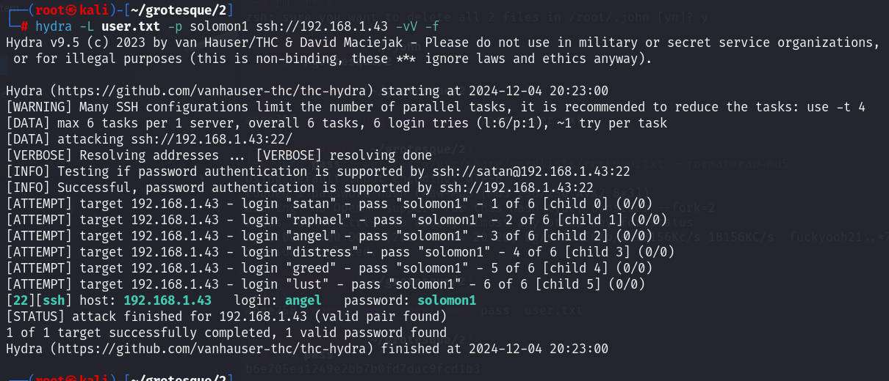


登录

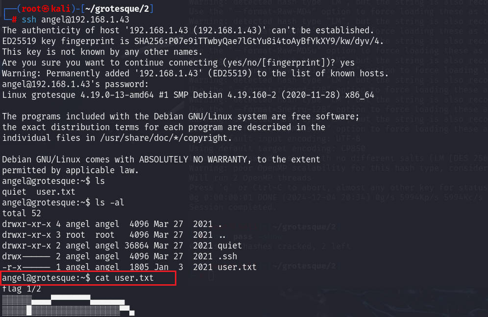


# 提权

查看目录下还有一个`quite`目录，里面的文件全是字符`quite`，我以为可以`more`提权，但是不行。

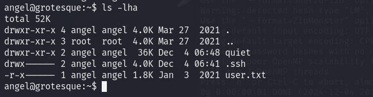


后面看网上的wp，说是删除后，会出现新的内容。我丢，这个是真不敢想

在`/home/angel/quite`目录下，执行删除所有当前目录的命令

```shell
rm -rf *
```

然后这个时候使用`find`寻找5分钟之内修改的文件

```shell
find / -mmin -5 -iname "*root*" -type f 2>/dev/null
```


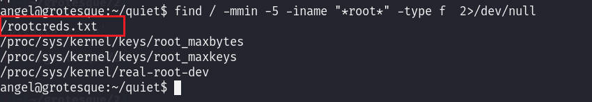


查看文件获取到`root`的密码

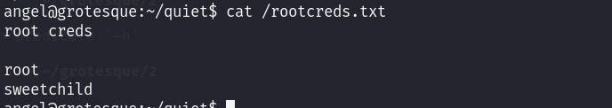

登录root，查看`/root`目录下的文本

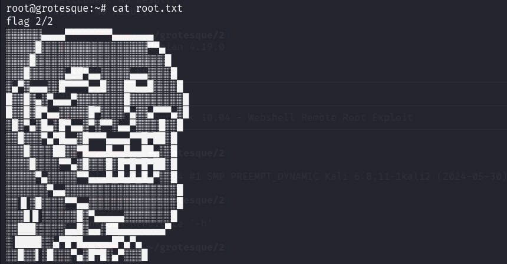


还给出了清理日志的脚本，而且也能看到，确实是在写入，搞了个循环

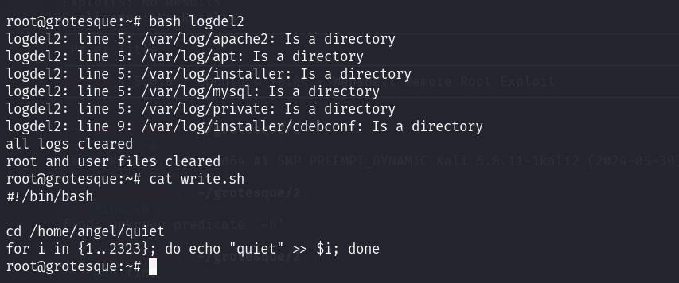


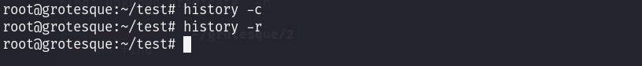


# 总结

1. 考的是脑洞，不是真正的`web`渗透。
2. 不过也是能结合实际，这里就是把shell编程结合起来，省事，不需要一个个的访问端口


