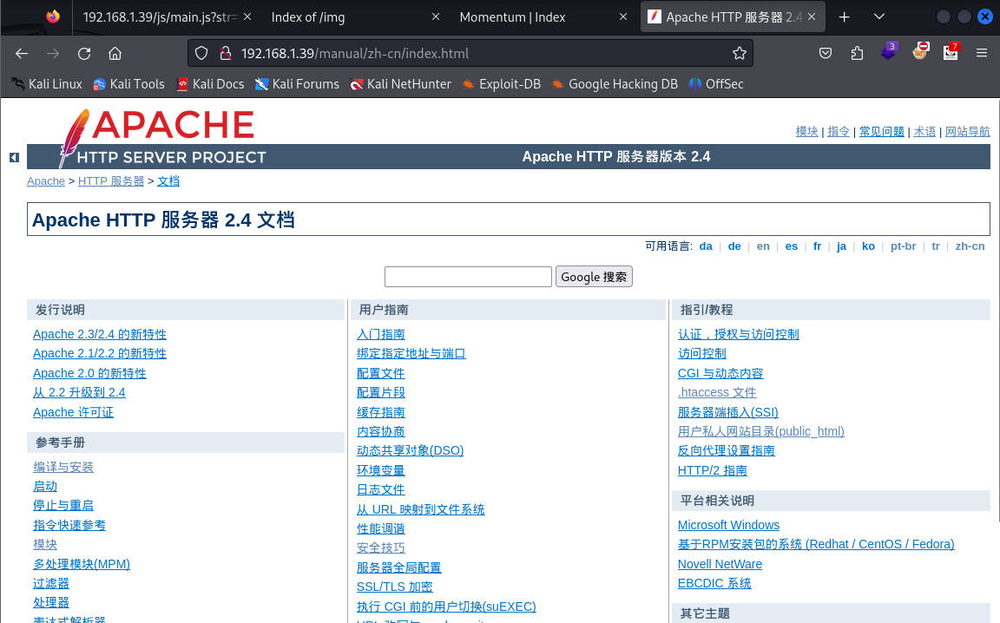

# 前言

靶机在`virual box`运行，桥接网卡，攻击在`VMware`运行，桥接网卡

靶机：`momentum-1`

攻击：`kali`

# 主机发现

使用`arp-scan -l`扫描


# 信息收集

## 使用nmap扫描


## 网站信息收集

访问默认界面，查看页面源码无泄露，不过确定图片是放在网站目录，也就是网站是目录型网站


使用`dirsearch、gobuster、ffuf、dirb、dirbuster`等工具进行目录扫描，这里`gobuster`的扫描与之差不多


使用`whatweb`搜集网站信息


这是一个手册，关于`apache`的，访问查看，并无任何内容，只是`apache`的手册




访问`js`目录，发现有`js`代码，并且函数接收等


返回主页面，再次查看有无调用`js`中的函数`viewDetails`

看到四个图片的每一张都调用了这个函数，点击之后可以看到图片的详细信息


查看图片信息


# 漏洞寻找

在这里尝试修改`id`的值，发现输入什么就返回什么，尝试进行`XSS`的测试

或者这里使用一款工具检测`xss`的，`xssstrike`的项目地址`https://github.com/s0md3v/XSStrike.git`

依靠的是`python`环境，所以运行前使用`pip`安装依赖库。然后如果报错，注意看提示，按照提示继续即可

这里运行脚本检测，可以看到有效载荷生效，并且十分确认，这时候复制`payload`验证即可


在浏览器复制`payload`进行验证，发现确实有，说明有`xss`漏洞


# 漏洞利用

但是直到漏洞怎么利用，获取更有价值的东西呢，可以使用`beef-xss`，在kali中可直接安装

启动`beef-xss`


这里给出了`hook`的代码，修改即可使用，修改成攻击者`kali`的`ip`地址，然后浏览器访问后，可以看到在`beef-xss`中显示出

经历了一番尝试，在`beef-xss`上可以操纵浏览器行为，但是无法获取到有用信息，除了`cookie`

当然，这里不止可以使用`beef-xss`工具，还有其他在线的`xss`平台，如`xssaq.com`等，百度一下，到处都是。下面以在线平台再演示一遍.

选择查看配置代码


然后选择一个语句复制，然后粘贴到有xss漏洞的地方


当浏览器访问确定后，就会在平台显示，可以看到其`cookie`等信息

```http
cookie=U2FsdGVkX193yTOKOucUbHeDp1Wxd5r7YkoM8daRtj0rjABqGuQ6Mx28N1VbBSZt; BEEFHOOK=XMZKZ6tiOADTu5PPftRbLOgpjAiTUbJoouJEui4adXmH4l7aGimY3wYTZdX4eXluTZmOldtPdnJZTlSk
```


如上所说，暂时无其他可用，返回之前的信息搜索，其中访问`js`时不止有函数，下面还有一段代码，虽然被注释，但是可以看出是`AES`加解密的。


`crypto-js` 是一个纯 `javascript` 写的加密算法类库 ，这里就是通过该库进行解密

```
CryptoJS.AES.decrypt(srcs, key, { iv: iv, mode: CryptoJS.mode.CBC, padding: CryptoJS.pad.Pkcs7 });
一般是这种形式，也就是第二个参数其实就是密码
```


把`cookie`与这个密码进行结合测试,这里注意，只是`cookie`的值，后面的`beefhook`不算

尝试进行解密，在网站`https://www.sojson.com/encrypt_aes.html`，解密出`auxerre-alienum##`


# ssh登录

获得一个密码，因为在`cookie`中，猜测可能是用户名-密码的形式，使用ssh登录`auxerre`测试，发现确实有该用户，不过密码不是后面的，而是解密出的一整个文本`auxerre-alienum##`


# 提权

在使用`find`寻找具有`SUID`权限没有内容后，再寻找可能隐藏或敏感文件，也没有发现，那就查看端口连接情况`ss -antlp`，发现`6379`端口，该端口默认是`redis`服务


测试有无`redis-cli`命令，发现有，可以查看帮助


可以看到默认情况下与现在的条件吻合，那么就不需要指定主机和端口，直接输入`redis-cli`即可连接，若无密码，则可以直接登录，进行测试，登录成功，并且获取到几个键。


获取其中的值，说是`rootpass`，使用密码`m0mentum-al1enum##`连接进行测试


直接另起终端`ssh`连接，发现不行，可能设置不允许`ssh`登录等情况


之前使用`find`寻找SUID权限的文件时，有`su`命令，直接使用`su`命令切换进行测试


# 清除痕迹


# 总结

1. 对于信息收集时，是否认真，JS文件中也会导致一些算法的泄露，如加密算法
2. 对于网站的URL是否敏感，这里是`get`请求，所以看的清晰，如果是`post`请求，需要抓包，然后测试有无`xss`漏洞
3. `xss`漏洞要有基本判断，知道是否有注入点
4. 对于获取`cookie`的方式很多，可以自己构造语句，或者利用第三方平台都行
5. JS的一些代码要有了解，知道这个可能是干什么的即可，或者丢给`AI`分析
6. 对于收集到的信息，要有一定的结合型，可能数据结合起来看，就会不一样
7. 对于一些端口的默认服务要了解，比如这里就是典型的`redis`未授权访问，其默认端口`6379`


主要考察三点

1. 加密算法`AES`（通过`js`代码已经明确告知，解密即可）
2. `XSS`注入点的寻找及利用
3. `redis`默认端口及未授权访问


